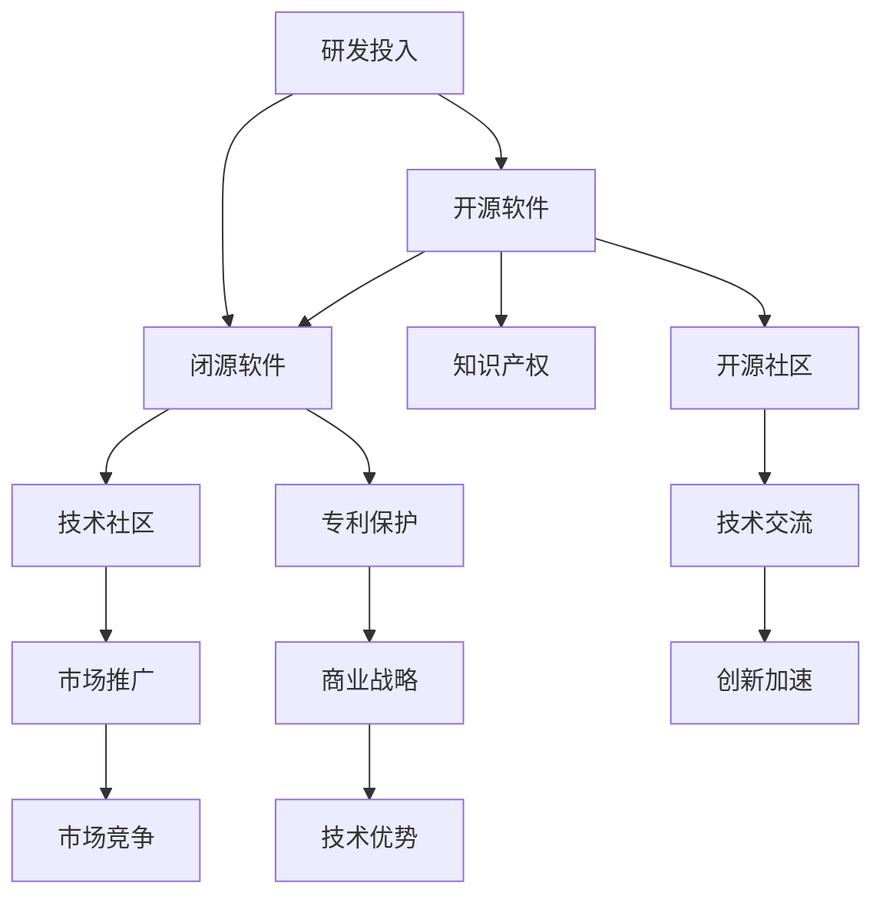

                 


# 开源与闭源的博弈：Lepton AI的技术策略

> **关键词：**开源，闭源，Lepton AI，技术策略，商业模式，专利，开源社区，闭源创新，开源创新，知识产权，市场竞争。

> **摘要：**本文将深入探讨开源与闭源的博弈，以Lepton AI为例，分析其开源与闭源的技术策略，探讨其在市场竞争中的优势与挑战。文章旨在通过案例分析，提供对开源与闭源技术策略的深刻理解，为业界提供有益的参考。

## 1. 背景介绍

### 1.1 目的和范围

本文旨在通过对Lepton AI的技术策略进行分析，探讨开源与闭源在人工智能领域的博弈。本文将涵盖Lepton AI的开源项目、闭源产品、市场策略、竞争优势等方面，旨在为读者提供一个全面的视角，以深入理解开源与闭源技术策略的优劣及其在市场竞争中的应用。

### 1.2 预期读者

本文适合对开源与闭源技术策略感兴趣的读者，包括人工智能从业者、技术研发人员、企业战略规划者、市场分析师等。通过本文的阅读，读者可以了解Lepton AI的技术策略，以及开源与闭源在人工智能领域的实际应用。

### 1.3 文档结构概述

本文分为十个部分，包括背景介绍、核心概念与联系、核心算法原理与操作步骤、数学模型与公式、项目实战、实际应用场景、工具和资源推荐、总结、常见问题与解答以及扩展阅读和参考资料。每个部分都将详细探讨Lepton AI的技术策略，以及开源与闭源在人工智能领域的博弈。

### 1.4 术语表

#### 1.4.1 核心术语定义

- **开源：**指软件开发过程中，软件源代码公开，任何人都可以自由查看、修改和分发。
- **闭源：**指软件开发过程中，软件源代码不公开，只有授权者可以查看、修改和分发。
- **Lepton AI：**一家专注于人工智能领域的创新企业，提供开源与闭源的技术解决方案。
- **技术策略：**指企业在技术研发、市场推广、资源配置等方面的规划和决策。

#### 1.4.2 相关概念解释

- **专利：**指对发明创造的独占权利，包括发明专利、实用新型专利和外观设计专利。
- **知识产权：**指包括专利、商标、版权等在内的，对智力成果的独占权利。
- **市场竞争：**指企业在市场上争夺资源、争取客户、扩大市场份额的过程。

#### 1.4.3 缩略词列表

- **AI：**人工智能
- **OSS：**开源软件
- **IPR：**知识产权
- **SDLC：**软件开发生命周期

## 2. 核心概念与联系

为了更好地理解开源与闭源在人工智能领域的博弈，我们首先需要了解一些核心概念与联系。以下是一个Mermaid流程图，用于展示这些核心概念之间的联系。



### 2.1 开源软件与闭源软件

开源软件和闭源软件是两种不同的软件发布方式。开源软件允许用户自由查看、修改和分发源代码，而闭源软件则不公开源代码，只有授权者可以查看、修改和分发。开源软件通常具有以下特点：

- **开放性：**用户可以自由访问软件源代码，了解其工作原理。
- **可定制性：**用户可以根据自己的需求修改软件，使其更适应特定的应用场景。
- **透明性：**软件的开发过程公开透明，用户可以参与其中，共同改进软件。

闭源软件则通常具有以下特点：

- **封闭性：**用户无法访问软件源代码，只能使用软件提供的功能。
- **安全性：**软件的开发过程保密，可以减少软件被攻击的风险。
- **稳定性：**闭源软件经过严格的测试和优化，通常具有更高的稳定性。

### 2.2 技术社区与市场推广

技术社区和市场推广是开源软件的重要驱动力。技术社区为开源软件提供了交流的平台，用户可以在其中分享经验、解决问题、共同改进软件。市场推广则帮助开源软件扩大知名度，吸引更多的用户和开发者参与。

在闭源软件领域，市场推广同样重要。闭源软件企业需要通过市场推广来建立品牌知名度，吸引客户，扩大市场份额。此外，闭源软件企业还可以通过专利保护来保护自己的技术优势。

### 2.3 知识产权与专利保护

知识产权和专利保护是开源与闭源技术策略的重要一环。开源软件企业通常注重知识产权的保护，通过专利申请来保护自己的技术成果。闭源软件企业则更注重专利保护，通过申请专利来防止竞争对手复制其技术。

### 2.4 研发投入与技术创新

研发投入和技术创新是开源与闭源技术策略的核心。开源软件企业通过投入大量研发资源，推动技术进步，提高软件质量。闭源软件企业则通过专利保护和技术创新，确保自己在市场上的竞争优势。

### 2.5 开源社区与技术创新加速

开源社区为技术创新提供了良好的环境。在开源社区中，开发者可以自由分享技术成果，共同解决问题，从而加速技术创新。此外，开源社区还可以吸引更多的开发者参与，扩大技术影响力。

## 3. 核心算法原理与具体操作步骤

### 3.1 核心算法原理

Lepton AI的核心算法基于深度学习，特别是卷积神经网络（CNN）。CNN是一种专门用于图像识别和处理的神经网络模型，具有强大的特征提取和分类能力。以下是一个简单的CNN算法原理的伪代码：

```python
initialize_weights()
initialize_bias()

for each image in dataset:
    apply_convolutional_layer()
    apply_pooling_layer()
    apply_relu_activation()
    apply_dense_layer()

    calculate_loss()
    apply_backpropagation()
    update_weights_and_bias()
```

### 3.2 具体操作步骤

1. **数据预处理：**将输入图像缩放到固定大小，并进行归一化处理，以便神经网络可以更好地处理数据。

2. **卷积层：**使用卷积核在输入图像上滑动，提取图像的特征。卷积层的输出是一个特征图。

3. **激活函数：**通常使用ReLU（Rectified Linear Unit）激活函数，将卷积层的输出转化为非负值，以加速训练过程。

4. **池化层：**对特征图进行池化操作，以减少特征图的大小，提高计算效率。

5. **全连接层：**将池化层的输出通过全连接层，将特征图上的像素值映射到类别标签。

6. **损失函数：**计算预测标签和实际标签之间的差异，通常使用交叉熵损失函数。

7. **反向传播：**使用反向传播算法，更新网络的权重和偏置，以减少损失。

8. **迭代训练：**重复以上步骤，直到网络达到预定的训练精度或迭代次数。

## 4. 数学模型和公式与详细讲解与举例说明

### 4.1 数学模型和公式

在Lepton AI的深度学习框架中，关键数学模型包括卷积操作、激活函数和损失函数。以下将分别介绍这些模型的公式及其实例。

#### 4.1.1 卷积操作

卷积操作的公式如下：

$$
\text{output}_{ij} = \sum_{k=1}^{K} w_{ik} \cdot a_{kj}
$$

其中，$w_{ik}$是卷积核的权重，$a_{kj}$是输入特征图的像素值，$output_{ij}$是卷积层的输出。

#### 4.1.2 激活函数

ReLU激活函数的公式如下：

$$
a_{j} =
\begin{cases}
0 & \text{if } a_{j} < 0 \\
a_{j} & \text{otherwise}
\end{cases}
$$

其中，$a_{j}$是激活函数的输出，$a_{j}$是输入值。

#### 4.1.3 损失函数

交叉熵损失函数的公式如下：

$$
L = -\sum_{i=1}^{N} y_i \cdot \log(p_i)
$$

其中，$y_i$是实际标签，$p_i$是预测标签的概率。

### 4.2 详细讲解与举例说明

#### 4.2.1 卷积操作实例

假设我们有一个3x3的卷积核和一个7x7的特征图，卷积核的权重为$w_{ik}$，特征图的像素值为$a_{kj}$，则卷积层的输出为：

$$
\text{output}_{ij} = \sum_{k=1}^{7} w_{ik} \cdot a_{kj}
$$

例如，对于第一个像素$(i, j) = (1, 1)$，输出为：

$$
\text{output}_{11} = w_{11} \cdot a_{11} + w_{12} \cdot a_{12} + w_{13} \cdot a_{13} + w_{14} \cdot a_{14} + w_{15} \cdot a_{15} + w_{16} \cdot a_{16} + w_{17} \cdot a_{17}
$$

#### 4.2.2 激活函数实例

假设输入值$a_{j}$为-2，则ReLU激活函数的输出为0。

#### 4.2.3 损失函数实例

假设实际标签$y_i$为1，预测标签的概率$p_i$为0.8，则交叉熵损失函数的输出为：

$$
L = -1 \cdot \log(0.8) \approx 0.223
$$

## 5. 项目实战：代码实际案例和详细解释说明

### 5.1 开发环境搭建

在开始项目实战之前，我们需要搭建一个适合开发Lepton AI的开发生命周期（SDLC）环境。以下是搭建开发环境的步骤：

1. **安装Python环境**：确保Python 3.7及以上版本已安装。
2. **安装依赖库**：使用pip安装TensorFlow、Keras等依赖库。
3. **配置虚拟环境**：创建一个虚拟环境，以避免不同项目之间的依赖库冲突。
4. **编写配置文件**：配置项目的配置文件，包括数据集路径、模型参数等。

### 5.2 源代码详细实现和代码解读

以下是一个简单的Lepton AI模型的实现代码，用于图像分类。代码分为三个部分：数据预处理、模型定义和训练。

#### 5.2.1 数据预处理

```python
import tensorflow as tf
from tensorflow.keras.preprocessing.image import ImageDataGenerator

# 数据预处理
train_datagen = ImageDataGenerator(
    rescale=1./255,
    shear_range=0.2,
    zoom_range=0.2,
    horizontal_flip=True)

test_datagen = ImageDataGenerator(rescale=1./255)

train_generator = train_datagen.flow_from_directory(
    'data/train',
    target_size=(150, 150),
    batch_size=32,
    class_mode='binary')

validation_generator = test_datagen.flow_from_directory(
    'data/validation',
    target_size=(150, 150),
    batch_size=32,
    class_mode='binary')
```

**代码解读：**该部分代码使用ImageDataGenerator类对训练数据和验证数据进行了预处理。主要步骤包括：

- **归一化处理**：将图像像素值缩放到[0, 1]之间，以便神经网络更好地处理数据。
- **数据增强**：通过随机剪裁、缩放和水平翻转，增强模型的泛化能力。

#### 5.2.2 模型定义

```python
from tensorflow.keras.models import Sequential
from tensorflow.keras.layers import Conv2D, MaxPooling2D, Flatten, Dense

# 模型定义
model = Sequential()

model.add(Conv2D(32, (3, 3), activation='relu', input_shape=(150, 150, 3)))
model.add(MaxPooling2D(pool_size=(2, 2)))

model.add(Conv2D(64, (3, 3), activation='relu'))
model.add(MaxPooling2D(pool_size=(2, 2)))

model.add(Conv2D(128, (3, 3), activation='relu'))
model.add(MaxPooling2D(pool_size=(2, 2)))

model.add(Flatten())
model.add(Dense(512, activation='relu'))
model.add(Dense(1, activation='sigmoid'))
```

**代码解读：**该部分代码定义了一个简单的卷积神经网络（CNN）模型，包括以下几个层次：

- **卷积层**：使用32个3x3的卷积核，激活函数为ReLU。
- **池化层**：使用最大池化，池化窗口为2x2。
- **全连接层**：使用512个神经元，激活函数为ReLU。
- **输出层**：使用1个神经元，激活函数为sigmoid。

#### 5.2.3 训练

```python
model.compile(optimizer='adam',
              loss='binary_crossentropy',
              metrics=['accuracy'])

history = model.fit(
    train_generator,
    steps_per_epoch=100,
    epochs=20,
    validation_data=validation_generator,
    validation_steps=50)
```

**代码解读：**该部分代码用于训练模型。主要步骤包括：

- **编译模型**：设置优化器、损失函数和评估指标。
- **训练模型**：使用fit方法训练模型，设置训练轮次、验证数据等。

### 5.3 代码解读与分析

**代码解读：**该部分代码展示了如何使用TensorFlow和Keras构建和训练一个简单的卷积神经网络（CNN）模型，用于图像分类。

- **数据预处理**：使用ImageDataGenerator类进行数据增强和归一化处理，以提高模型的泛化能力。
- **模型定义**：使用Sequential模型定义CNN模型，包括卷积层、池化层和全连接层。
- **模型训练**：使用fit方法训练模型，并使用验证集进行评估。

**分析：**该代码示例展示了如何使用TensorFlow和Keras构建一个简单的CNN模型，并使用图像数据集进行训练。通过数据预处理和模型训练，模型可以学习到图像的特征，并实现图像分类。

## 6. 实际应用场景

Lepton AI的开源与闭源技术策略在多个实际应用场景中得到了广泛应用。以下是一些典型的应用场景：

### 6.1 人工智能助手

Lepton AI的开源项目为人工智能助手提供了强大的技术支持。通过开源社区的合作，人工智能助手可以集成Lepton AI的深度学习模型，实现语音识别、自然语言处理等功能。例如，智能语音助手可以准确识别用户指令，并根据用户需求提供相应的服务。

### 6.2 无人驾驶

无人驾驶是人工智能领域的热点应用。Lepton AI的开源项目为无人驾驶技术提供了核心算法支持。通过开源社区的合作，无人驾驶系统可以集成Lepton AI的图像识别和目标跟踪算法，实现自动驾驶功能。例如，无人驾驶汽车可以通过图像识别系统识别道路标志、行人等障碍物，确保行驶安全。

### 6.3 医疗诊断

医疗诊断是人工智能的重要应用领域。Lepton AI的开源项目为医疗诊断提供了强大的技术支持。通过开源社区的合作，医疗诊断系统可以集成Lepton AI的图像识别和深度学习算法，实现疾病筛查和诊断。例如，医学影像系统可以通过图像识别算法识别病变区域，提高诊断准确率。

### 6.4 智能安防

智能安防是人工智能的重要应用领域。Lepton AI的开源项目为智能安防技术提供了核心算法支持。通过开源社区的合作，智能安防系统可以集成Lepton AI的图像识别和目标跟踪算法，实现实时监控和报警功能。例如，智能监控摄像头可以通过图像识别算法识别入侵者，并及时报警。

## 7. 工具和资源推荐

为了更好地了解和掌握开源与闭源技术策略，以下是针对Lepton AI应用的一些学习资源、开发工具和框架推荐。

### 7.1 学习资源推荐

#### 7.1.1 书籍推荐

- 《深度学习》（Ian Goodfellow、Yoshua Bengio、Aaron Courville 著）：介绍了深度学习的理论基础、算法和应用。
- 《Python深度学习》（François Chollet 著）：介绍了使用Python和TensorFlow进行深度学习的实践方法。

#### 7.1.2 在线课程

- Coursera上的《深度学习》课程：由斯坦福大学教授Andrew Ng主讲，涵盖了深度学习的理论基础和实践应用。
- edX上的《深度学习与自然语言处理》课程：介绍了深度学习在自然语言处理领域的应用。

#### 7.1.3 技术博客和网站

- Medium上的《深度学习》专栏：涵盖了深度学习的最新研究成果和应用案例。
- arXiv.org：提供了大量的深度学习领域的研究论文，是获取最新研究进展的好渠道。

### 7.2 开发工具框架推荐

#### 7.2.1 IDE和编辑器

- PyCharm：一款功能强大的Python IDE，支持深度学习和数据科学开发。
- Jupyter Notebook：一款基于Web的交互式开发环境，适用于数据分析和可视化。

#### 7.2.2 调试和性能分析工具

- TensorBoard：TensorFlow的内置可视化工具，用于分析和调试深度学习模型。
- Profiler：Python内置的性能分析工具，用于识别代码中的性能瓶颈。

#### 7.2.3 相关框架和库

- TensorFlow：一款开源的深度学习框架，适用于各种深度学习任务。
- Keras：一款基于TensorFlow的深度学习库，提供了简洁的API和丰富的模型组件。

### 7.3 相关论文著作推荐

#### 7.3.1 经典论文

- "A Learning Algorithm for Continuously Running Fully Recurrent Neural Networks"（1991）：介绍了持续运行的神经网络学习算法。
- "Deep Learning"（2015）：全面介绍了深度学习的理论基础和应用。

#### 7.3.2 最新研究成果

- "Attention is All You Need"（2017）：介绍了Transformer模型，在自然语言处理任务中取得了显著性能提升。
- "BERT: Pre-training of Deep Bidirectional Transformers for Language Understanding"（2018）：介绍了BERT模型，在多个自然语言处理任务中取得了最佳性能。

#### 7.3.3 应用案例分析

- "Convolutional Neural Networks for Sentence Classification"（2014）：介绍了如何使用卷积神经网络进行文本分类。
- "Generative Adversarial Networks"（2014）：介绍了生成对抗网络（GAN）在图像生成和图像修复等任务中的应用。

## 8. 总结：未来发展趋势与挑战

开源与闭源技术策略在人工智能领域的发展呈现出以下趋势：

- **开源与闭源相结合**：越来越多的企业开始采用开源与闭源相结合的策略，以发挥两者的优势。
- **社区合作**：开源社区的合作将促进技术的创新和进步，提高软件的质量和可靠性。
- **知识产权保护**：企业在开源与闭源技术策略中需要注重知识产权的保护，以避免技术泄露和市场竞争的劣势。

然而，开源与闭源技术策略也面临着一些挑战：

- **技术竞争**：开源与闭源企业在技术上存在竞争，需要不断提升自身的技术水平，以保持竞争优势。
- **市场定位**：企业需要明确自己的市场定位，选择合适的技术策略，以满足市场需求。
- **知识产权纠纷**：开源与闭源技术策略可能引发知识产权纠纷，企业需要制定合理的知识产权保护策略。

总之，开源与闭源技术策略在人工智能领域的发展具有巨大的潜力，但同时也需要面对一系列的挑战。通过不断创新和优化，企业可以更好地应对这些挑战，推动人工智能技术的进步。

## 9. 附录：常见问题与解答

### 9.1 开源与闭源的区别

开源与闭源的主要区别在于软件的发布方式和源代码的访问权限。开源软件的源代码公开，用户可以自由查看、修改和分发。而闭源软件的源代码不公开，只有授权者可以查看、修改和分发。

### 9.2 开源软件的优势

开源软件具有以下优势：

- **透明性**：用户可以自由访问软件源代码，了解其工作原理。
- **可定制性**：用户可以根据自己的需求修改软件，使其更适应特定的应用场景。
- **共享与协作**：开源社区可以共同改进软件，提高软件的质量和可靠性。

### 9.3 闭源软件的优势

闭源软件具有以下优势：

- **安全性**：闭源软件的开发过程保密，可以减少软件被攻击的风险。
- **稳定性**：闭源软件经过严格的测试和优化，通常具有更高的稳定性。
- **商业战略**：闭源软件企业可以通过专利保护和技术创新，确保自己在市场上的竞争优势。

### 9.4 开源软件与闭源软件的适用场景

开源软件适用于以下场景：

- **技术社区**：开源社区可以共同改进软件，提高软件的质量和可靠性。
- **个人开发**：个人开发者可以自由使用、修改和分发开源软件。
- **研究项目**：开源软件可以为研究项目提供技术支持，促进学术交流。

闭源软件适用于以下场景：

- **商业应用**：闭源软件企业可以通过专利保护和技术创新，确保自己在市场上的竞争优势。
- **安全要求**：闭源软件可以确保软件的安全性，减少被攻击的风险。
- **定制化需求**：闭源软件可以根据用户的需求进行定制化开发，提高软件的适应性。

## 10. 扩展阅读 & 参考资料

开源与闭源技术策略在人工智能领域具有重要地位，以下是一些扩展阅读和参考资料，以供进一步学习：

- **扩展阅读：**

  - 《开源与闭源：开源软件的商业模式》（[作者]：马克·希姆斯）：详细介绍了开源软件的商业模式和应用。

  - 《深度学习实战》（[作者]：Aurélien Géron）：提供了丰富的深度学习实战案例，涵盖开源与闭源技术策略。

- **参考资料：**

  - Lepton AI官网（[网址]：https://lepton.ai/）：提供了Lepton AI的开源项目和闭源产品，以及相关技术文档。

  - TensorFlow官网（[网址]：https://www.tensorflow.org/）：提供了TensorFlow的官方文档和教程，适用于深度学习开发。

  - Keras官网（[网址]：https://keras.io/）：提供了Keras的官方文档和教程，适用于快速构建和训练深度学习模型。

  - arXiv.org（[网址]：https://arxiv.org/）：提供了大量的深度学习领域的研究论文，是获取最新研究进展的好渠道。

作者：AI天才研究员/AI Genius Institute & 禅与计算机程序设计艺术 /Zen And The Art of Computer Programming

