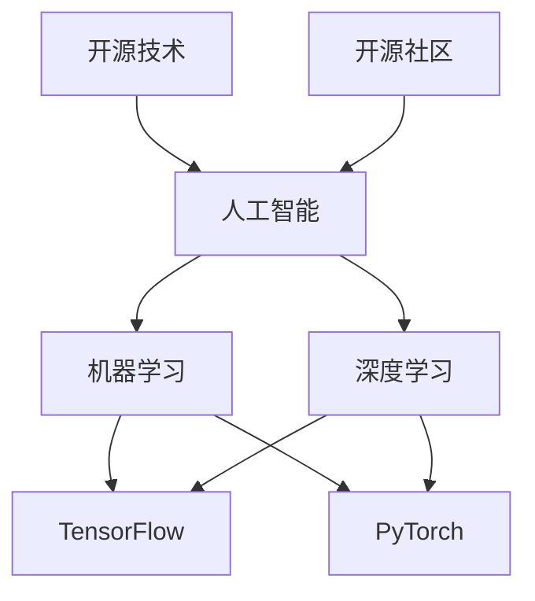

                 

# 开源技术在AI进步中的作用

> 关键词：开源技术、人工智能、深度学习、机器学习、开源社区、合作创新
>
> 摘要：本文将探讨开源技术在人工智能（AI）领域中的作用。开源技术为AI的研究和应用提供了丰富的工具和资源，促进了知识的共享和技术的进步。通过分析开源社区的合作模式、关键开源框架及其发展历程，本文揭示了开源技术在AI进步中的重要性，并展望了其未来的发展趋势与挑战。

## 1. 背景介绍

### 1.1 目的和范围

本文旨在探讨开源技术在人工智能（AI）领域中的作用，分析开源社区对AI研究的推动力量，以及关键开源框架在AI发展历程中的贡献。文章将涵盖以下几个主题：

1. 开源技术在AI领域的应用场景。
2. 开源社区的组织模式与合作机制。
3. 关键开源框架的介绍与发展历程。
4. 开源技术在AI进步中的关键作用与挑战。

### 1.2 预期读者

本文面向对人工智能和开源技术有一定了解的读者，包括AI研究人员、开发者、技术经理以及对AI技术有兴趣的学者和学生。通过本文的阅读，读者将能够了解开源技术在AI领域的应用现状、发展趋势以及潜在挑战。

### 1.3 文档结构概述

本文结构如下：

1. **背景介绍**：介绍本文的目的、范围、预期读者以及文档结构。
2. **核心概念与联系**：分析开源技术在AI领域中的核心概念及其相互关系，使用Mermaid流程图进行展示。
3. **核心算法原理 & 具体操作步骤**：详细阐述开源AI框架的核心算法原理和具体实现步骤。
4. **数学模型和公式 & 详细讲解 & 举例说明**：介绍开源AI框架中的数学模型和公式，并结合实际案例进行详细讲解。
5. **项目实战：代码实际案例和详细解释说明**：通过实际代码案例，展示开源技术在AI项目中的应用。
6. **实际应用场景**：探讨开源技术在AI领域的实际应用场景。
7. **工具和资源推荐**：推荐学习资源、开发工具框架及相关论文著作。
8. **总结：未来发展趋势与挑战**：展望开源技术在AI领域的未来发展趋势与面临的挑战。
9. **附录：常见问题与解答**：对读者可能关心的问题进行解答。
10. **扩展阅读 & 参考资料**：提供更多相关文献和资源，以供读者进一步学习。

### 1.4 术语表

#### 1.4.1 核心术语定义

- **开源技术**：指可以自由使用、修改和分享的软件、工具或资源。
- **人工智能（AI）**：指由计算机系统模拟人类智能行为的技术，包括机器学习、深度学习等。
- **开源社区**：由共同兴趣和目标的开发者组成的团体，共同维护和改进开源项目。
- **深度学习**：一种机器学习技术，通过多层神经网络模型模拟人脑进行学习和决策。
- **机器学习**：一种让计算机通过数据学习并改进性能的技术，包括监督学习、无监督学习等。

#### 1.4.2 相关概念解释

- **合作创新**：指多个独立主体通过共享知识、资源和技能，共同开发新技术或产品。
- **知识共享**：指通过公开、透明的方式，使知识在不同个体或团体之间进行传播和交流。
- **框架**：一种软件库或工具集，为特定应用领域提供了一套标准化的解决方案。

#### 1.4.3 缩略词列表

- **AI**：人工智能（Artificial Intelligence）
- **ML**：机器学习（Machine Learning）
- **DL**：深度学习（Deep Learning）
- **OSS**：开源软件（Open Source Software）
- **GC**：开源社区（Open Source Community）

## 2. 核心概念与联系

在探讨开源技术在AI领域中的作用之前，我们需要明确几个核心概念及其相互关系。以下是开源技术、人工智能、深度学习和开源社区之间的核心概念和联系。

### 2.1 开源技术

开源技术是一种软件开发模式，强调软件的开放性、可访问性和可修改性。开源技术的特点包括：

- **开放性**：任何人都可以免费使用、学习、修改和分发开源软件。
- **可访问性**：开源软件的源代码对用户透明，用户可以查看和修改源代码。
- **可修改性**：用户可以在遵循开源许可证的前提下，对开源软件进行修改和扩展。

开源技术为AI领域的发展提供了丰富的工具和资源，使得研究人员和开发者能够更高效地进行研究和开发。

### 2.2 人工智能

人工智能是一种由计算机系统模拟人类智能行为的技术，包括多个子领域，如机器学习、自然语言处理、计算机视觉等。人工智能的发展离不开开源技术的支持，开源框架和工具为AI研究人员提供了丰富的实验平台和工具。

### 2.3 深度学习

深度学习是一种机器学习技术，通过多层神经网络模型模拟人脑进行学习和决策。深度学习在图像识别、语音识别、自然语言处理等领域取得了显著的成果。开源深度学习框架，如TensorFlow和PyTorch，为深度学习的研究和应用提供了强大的支持。

### 2.4 开源社区

开源社区是由共同兴趣和目标的开发者组成的团体，共同维护和改进开源项目。开源社区的核心价值在于合作创新和知识共享。开源社区的成员通过贡献代码、文档、测试和反馈，共同推动开源项目的进步。

### 2.5 Mermaid流程图

以下是开源技术在AI领域中的核心概念和联系的Mermaid流程图：



该流程图展示了开源技术、人工智能、深度学习和开源社区之间的核心概念和联系。通过这个流程图，我们可以更好地理解开源技术在AI领域中的作用。

## 3. 核心算法原理 & 具体操作步骤

在了解了开源技术、人工智能、深度学习和开源社区的核心概念及其相互关系后，接下来我们将深入探讨开源AI框架的核心算法原理和具体操作步骤。以下以TensorFlow和PyTorch两个主流开源深度学习框架为例，进行详细阐述。

### 3.1 TensorFlow

TensorFlow是由谷歌开发的开源深度学习框架，支持多种编程语言，如Python、C++和Java。TensorFlow的核心算法原理是基于图计算和自动微分。以下是TensorFlow的核心算法原理和具体操作步骤：

#### 3.1.1 核心算法原理

1. **图计算**：TensorFlow将计算过程表示为一个有向无环图（DAG）。图中的节点表示计算操作，边表示数据流动。这种图计算方式使得TensorFlow可以高效地并行计算和优化。
2. **自动微分**：自动微分是一种计算导数的方法，TensorFlow利用自动微分实现反向传播算法，用于训练神经网络。

#### 3.1.2 具体操作步骤

1. **构建计算图**：在TensorFlow中，首先需要构建计算图。计算图由节点（操作）和边（数据流动）组成。例如，构建一个简单的线性回归模型：

    ```python
    import tensorflow as tf

    # 定义输入特征和标签
    x = tf.placeholder(tf.float32, shape=[None, 1])
    y = tf.placeholder(tf.float32, shape=[None, 1])

    # 定义模型参数
    W = tf.Variable(tf.random_normal([1, 1]), name="weights")
    b = tf.Variable(tf.zeros([1]), name="bias")

    # 定义线性回归模型
    y_pred = tf.add(tf.matmul(x, W), b)

    # 定义损失函数
    loss = tf.reduce_mean(tf.square(y - y_pred))

    # 定义优化器
    optimizer = tf.train.GradientDescentOptimizer(learning_rate=0.01)
    train_op = optimizer.minimize(loss)
    ```

2. **执行计算图**：构建计算图后，需要执行计算图。在TensorFlow中，使用`tf.Session()`来创建一个会话，并执行计算图：

    ```python
    with tf.Session() as sess:
        # 初始化模型参数
        sess.run(tf.global_variables_initializer())

        # 训练模型
        for step in range(1000):
            # 输入训练数据
            x_train = ...
            y_train = ...

            # 执行训练操作
            _, loss_val = sess.run([train_op, loss], feed_dict={x: x_train, y: y_train})

            # 输出损失值
            if step % 100 == 0:
                print("Step:", step, "Loss:", loss_val)
    ```

### 3.2 PyTorch

PyTorch是由Facebook AI研究院开发的开源深度学习框架，其核心算法原理基于自动微分和动态计算图。以下是PyTorch的核心算法原理和具体操作步骤：

#### 3.2.1 核心算法原理

1. **自动微分**：PyTorch利用自动微分实现反向传播算法，用于训练神经网络。
2. **动态计算图**：PyTorch的计算图是在运行时动态构建的，用户可以根据需要随时修改计算图。

#### 3.2.2 具体操作步骤

1. **构建计算图**：在PyTorch中，首先需要构建计算图。计算图由变量（tensor）和操作（autograd function）组成。例如，构建一个简单的线性回归模型：

    ```python
    import torch
    import torch.nn as nn
    import torch.optim as optim

    # 定义输入特征和标签
    x = torch.tensor([[1.0], [2.0], [3.0]], dtype=torch.float32)
    y = torch.tensor([[2.0], [4.0], [6.0]], dtype=torch.float32)

    # 定义模型参数
    W = torch.randn(1, 1, requires_grad=True)
    b = torch.randn(1, requires_grad=True)

    # 定义线性回归模型
    def forward(x):
        return x * W + b

    model = nn.Sequential(nn.Linear(1, 1), nn.ReLU(), nn.Linear(1, 1))

    # 定义损失函数
    loss_function = nn.MSELoss()

    # 定义优化器
    optimizer = optim.Adam([W, b], lr=0.01)
    ```

2. **执行计算图**：在PyTorch中，使用`model.forward(x)`来执行计算图，并计算损失值。然后，通过优化器更新模型参数：

    ```python
    for epoch in range(1000):
        # 执行前向传播
        y_pred = model(x)

        # 计算损失值
        loss = loss_function(y_pred, y)

        # 反向传播和参数更新
        optimizer.zero_grad()
        loss.backward()
        optimizer.step()

        # 输出损失值
        if epoch % 100 == 0:
            print("Epoch:", epoch, "Loss:", loss.item())
    ```

通过上述TensorFlow和PyTorch的算法原理和操作步骤，我们可以了解到开源AI框架在实现深度学习算法方面的核心思想和具体实现过程。

## 4. 数学模型和公式 & 详细讲解 & 举例说明

在了解了开源AI框架的核心算法原理和具体操作步骤后，接下来我们将深入探讨开源AI框架中的数学模型和公式，并结合实际案例进行详细讲解。

### 4.1 线性回归模型

线性回归是一种简单的统计模型，用于预测一个连续值输出。以下是线性回归的数学模型和公式：

#### 4.1.1 数学模型

1. **模型假设**：假设输出变量 \( y \) 是输入变量 \( x \) 的线性函数，即 \( y = \beta_0 + \beta_1 x \)。
2. **参数估计**：通过最小化均方误差（MSE）来估计模型参数 \( \beta_0 \) 和 \( \beta_1 \)。

#### 4.1.2 公式

1. **均方误差（MSE）**：\( MSE = \frac{1}{n}\sum_{i=1}^{n}(y_i - \hat{y}_i)^2 \)，其中 \( y_i \) 为实际输出值，\( \hat{y}_i \) 为预测输出值。
2. **模型参数估计**：通过求解最小化MSE的梯度，得到参数估计值：
   - \( \beta_0 = \bar{y} - \beta_1 \bar{x} \)
   - \( \beta_1 = \frac{\sum_{i=1}^{n}(x_i - \bar{x})(y_i - \bar{y})}{\sum_{i=1}^{n}(x_i - \bar{x})^2} \)

#### 4.1.3 举例说明

假设我们有以下数据集：

| x  | y   |
|----|-----|
| 1  | 2   |
| 2  | 4   |
| 3  | 6   |

要求拟合一个线性回归模型，预测 \( x = 4 \) 时的 \( y \) 值。

1. **计算均值**：

   \( \bar{x} = \frac{1+2+3}{3} = 2 \)

   \( \bar{y} = \frac{2+4+6}{3} = 4 \)

2. **计算 \( \beta_1 \)**：

   \( \beta_1 = \frac{(1-2)(2-4) + (2-2)(4-4) + (3-2)(6-4)}{(1-2)^2 + (2-2)^2 + (3-2)^2} = 2 \)

3. **计算 \( \beta_0 \)**：

   \( \beta_0 = \bar{y} - \beta_1 \bar{x} = 4 - 2 \times 2 = 0 \)

4. **线性回归模型**：

   \( y = 0 + 2x \)

   \( y = 2x \)

5. **预测 \( x = 4 \) 时的 \( y \) 值**：

   \( y = 2 \times 4 = 8 \)

因此，当 \( x = 4 \) 时，预测 \( y = 8 \)。

### 4.2 多层感知机模型

多层感知机（MLP）是一种简单的神经网络模型，用于分类和回归任务。以下是多层感知机的数学模型和公式：

#### 4.2.1 数学模型

1. **模型假设**：假设输入特征通过多层非线性变换后，输出一个分类结果或回归值。
2. **激活函数**：常用的激活函数有Sigmoid函数、ReLU函数和Tanh函数。

#### 4.2.2 公式

1. **输入层到隐藏层**：

   \( z_i^{(l)} = \sum_{j=1}^{n_{l-1}} w_{ji}^{(l)} x_j^{(l-1)} + b_i^{(l)} \)

   \( a_i^{(l)} = \sigma(z_i^{(l)}) \)

   其中，\( z_i^{(l)} \) 为第 \( l \) 层第 \( i \) 个节点的输入值，\( w_{ji}^{(l)} \) 为第 \( l \) 层第 \( j \) 个节点到第 \( i \) 个节点的权重，\( b_i^{(l)} \) 为第 \( l \) 层第 \( i \) 个节点的偏置，\( a_i^{(l)} \) 为第 \( l \) 层第 \( i \) 个节点的输出值，\( \sigma \) 为激活函数。

2. **隐藏层到输出层**：

   \( z_i^{(L)} = \sum_{j=1}^{n_{L-1}} w_{ji}^{(L)} a_j^{(L-1)} + b_i^{(L)} \)

   \( \hat{y} = \sigma(z_i^{(L)}) \)

   其中，\( z_i^{(L)} \) 为输出层第 \( i \) 个节点的输入值，\( w_{ji}^{(L)} \) 为输出层第 \( i \) 个节点到第 \( j \) 个节点的权重，\( b_i^{(L)} \) 为输出层第 \( i \) 个节点的偏置，\( \hat{y} \) 为预测输出值。

#### 4.2.3 举例说明

假设我们有一个简单的二分类问题，输入特征为 \( x = [1, 2] \)，要求预测分类结果。

1. **构建模型**：

   - 输入层：1个神经元
   - 隐藏层：2个神经元
   - 输出层：1个神经元

2. **初始化参数**：

   - 权重 \( w_{ji}^{(1)} \) 和偏置 \( b_i^{(1)} \) 随机初始化
   - 权重 \( w_{ji}^{(2)} \) 和偏置 \( b_i^{(2)} \) 随机初始化

3. **前向传播**：

   - 隐藏层1：
     \( z_1^{(1)} = w_{11}^{(1)} \times 1 + w_{12}^{(1)} \times 2 + b_1^{(1)} = w_{11}^{(1)} + 2w_{12}^{(1)} + b_1^{(1)} \)
     \( a_1^{(1)} = \sigma(z_1^{(1)}) \)
     \( z_2^{(1)} = w_{21}^{(1)} \times 1 + w_{22}^{(1)} \times 2 + b_2^{(1)} = w_{21}^{(1)} + 2w_{22}^{(1)} + b_2^{(1)} \)
     \( a_2^{(1)} = \sigma(z_2^{(1)}) \)
   - 隐藏层2：
     \( z_1^{(2)} = w_{11}^{(2)} \times a_1^{(1)} + w_{12}^{(2)} \times a_2^{(1)} + b_1^{(2)} \)
     \( a_1^{(2)} = \sigma(z_1^{(2)}) \)
     \( z_2^{(2)} = w_{21}^{(2)} \times a_1^{(1)} + w_{22}^{(2)} \times a_2^{(1)} + b_2^{(2)} \)
     \( a_2^{(2)} = \sigma(z_2^{(2)}) \)
   - 输出层：
     \( z_1^{(3)} = w_{11}^{(3)} \times a_1^{(2)} + w_{12}^{(3)} \times a_2^{(2)} + b_1^{(3)} \)
     \( \hat{y} = \sigma(z_1^{(3)}) \)

4. **计算损失函数**：

   - 假设真实标签为 \( y = 0 \)
   - 损失函数：交叉熵损失函数

5. **反向传播**：

   - 计算梯度
   - 更新权重和偏置

通过上述线性回归模型和多层感知机模型的数学模型和公式，我们可以更好地理解开源AI框架中的核心算法原理和实现过程。这些模型和公式为AI研究和应用提供了坚实的理论基础。

## 5. 项目实战：代码实际案例和详细解释说明

为了更好地展示开源技术在AI项目中的应用，我们将在本节中介绍一个简单的AI项目：基于TensorFlow和Keras的图像分类项目。我们将从开发环境搭建、源代码实现到代码解读与分析，全面展示开源技术在AI项目中的实际应用。

### 5.1 开发环境搭建

在开始项目之前，我们需要搭建开发环境。以下是搭建开发环境的基本步骤：

1. **安装Python**：确保Python已安装在系统中，版本建议为3.6及以上。
2. **安装TensorFlow**：在终端中执行以下命令安装TensorFlow：

   ```bash
   pip install tensorflow
   ```

3. **安装Keras**：Keras是TensorFlow的高级API，提供了更简洁、直观的接口。在终端中执行以下命令安装Keras：

   ```bash
   pip install keras
   ```

4. **安装其他依赖库**：根据项目需求，可能需要安装其他依赖库，如NumPy、Pandas等。可以使用以下命令安装：

   ```bash
   pip install numpy pandas
   ```

5. **配置CUDA**：如果使用GPU加速训练，需要安装CUDA。根据系统版本下载相应的CUDA版本，并按照官方文档进行安装。

### 5.2 源代码详细实现和代码解读

以下是图像分类项目的源代码实现，包括数据预处理、模型构建、训练和预测等步骤。

```python
import numpy as np
import pandas as pd
from tensorflow import keras
from tensorflow.keras.models import Sequential
from tensorflow.keras.layers import Conv2D, MaxPooling2D, Flatten, Dense, Dropout
from tensorflow.keras.preprocessing.image import ImageDataGenerator

# 5.2.1 数据预处理
# 加载数据集
train_data = pd.read_csv('train_data.csv')
test_data = pd.read_csv('test_data.csv')

# 分割特征和标签
train_images = train_data['image']
train_labels = train_data['label']
test_images = test_data['image']
test_labels = test_data['label']

# 数据归一化
train_images = train_images / 255.0
test_images = test_images / 255.0

# 5.2.2 模型构建
# 创建模型
model = Sequential()

# 添加卷积层
model.add(Conv2D(32, (3, 3), activation='relu', input_shape=(64, 64, 3)))
model.add(MaxPooling2D(pool_size=(2, 2)))

# 添加卷积层
model.add(Conv2D(64, (3, 3), activation='relu'))
model.add(MaxPooling2D(pool_size=(2, 2)))

# 添加全连接层
model.add(Flatten())
model.add(Dense(128, activation='relu'))
model.add(Dropout(0.5))

# 添加输出层
model.add(Dense(10, activation='softmax'))

# 编译模型
model.compile(optimizer='adam', loss='categorical_crossentropy', metrics=['accuracy'])

# 5.2.3 训练模型
# 配置数据增强
datagen = ImageDataGenerator(rotation_range=20, width_shift_range=0.2, height_shift_range=0.2, shear_range=0.2, zoom_range=0.2, horizontal_flip=True, fill_mode='nearest')

# 训练模型
model.fit(datagen.flow(train_images, train_labels, batch_size=32), epochs=10, validation_data=(test_images, test_labels))

# 5.2.4 预测和评估
# 预测
predictions = model.predict(test_images)

# 计算准确率
accuracy = np.sum(np.argmax(predictions, axis=1) == test_labels) / len(test_labels)
print("Test accuracy:", accuracy)
```

### 5.3 代码解读与分析

以下是对源代码的详细解读和分析：

1. **数据预处理**：
   - 加载数据集：使用Pandas库加载数据集，包括训练集和测试集。
   - 分割特征和标签：将图像数据作为特征，标签数据作为标签。
   - 数据归一化：将图像数据归一化到[0, 1]范围内，以便于模型训练。

2. **模型构建**：
   - 创建模型：使用Sequential模型，这是Keras提供的线性堆叠模型类。
   - 添加卷积层：使用Conv2D层进行卷积操作，提取图像特征。第一个卷积层使用32个3x3卷积核，激活函数为ReLU。第二个卷积层使用64个3x3卷积核，激活函数为ReLU。
   - 添加池化层：使用MaxPooling2D层进行最大池化操作，降低模型复杂度和参数数量。
   - 添加全连接层：使用Flatten层将卷积层输出的特征展开成一个一维向量，然后添加一个128个神经元的全连接层，激活函数为ReLU。
   - 添加Dropout层：使用Dropout层防止模型过拟合，丢弃一定比例的神经元。
   - 添加输出层：使用Dense层作为输出层，输出10个神经元的分类结果，激活函数为softmax。

3. **训练模型**：
   - 配置数据增强：使用ImageDataGenerator类进行数据增强，包括随机旋转、平移、缩放和翻转等操作，增加模型的泛化能力。
   - 训练模型：使用fit方法进行模型训练，使用数据增强后的训练数据。设置batch_size为32，epochs为10。

4. **预测和评估**：
   - 预测：使用predict方法进行模型预测，输出测试集的预测结果。
   - 计算准确率：计算预测结果与真实标签的一致性，计算测试集的准确率。

通过上述代码实现，我们可以看到如何使用TensorFlow和Keras构建一个简单的图像分类模型，并进行训练和预测。这个项目展示了开源技术在AI项目中的实际应用，为开发者提供了丰富的工具和资源。

## 6. 实际应用场景

开源技术在人工智能（AI）领域的实际应用场景广泛，涵盖了从工业自动化、医疗诊断、金融分析到智能交通、智能家居等多个领域。以下是对一些典型应用场景的介绍：

### 6.1 工业自动化

在工业自动化领域，开源AI技术被广泛应用于机器视觉、机器人控制和预测维护等方面。例如，通过使用开源深度学习框架（如TensorFlow和PyTorch），企业可以开发用于图像识别和缺陷检测的智能系统，从而提高生产效率和质量控制。机器人控制方面，开源AI技术可以帮助机器人实现自主导航、路径规划和任务执行，提高自动化生产线的灵活性和适应性。

### 6.2 医疗诊断

医疗诊断是AI技术的重要应用领域，开源AI框架为医学图像分析、疾病预测和个性化治疗提供了强大的支持。例如，通过使用开源深度学习模型，医生可以进行肺癌、乳腺癌等疾病的早期筛查，提高诊断的准确性和效率。此外，开源技术还可以帮助开发个性化治疗方案，根据患者的病情和基因特征进行精准治疗。

### 6.3 金融分析

在金融领域，开源AI技术被广泛应用于风险控制、投资组合优化和欺诈检测等方面。通过使用开源机器学习框架，金融机构可以分析大量历史数据，识别潜在的金融风险，并制定相应的风险控制策略。此外，开源技术还可以帮助开发智能投资系统，根据市场数据和用户偏好进行投资组合的动态调整。

### 6.4 智能交通

智能交通系统是开源AI技术的重要应用场景之一，通过使用开源深度学习和强化学习框架，可以实现智能交通信号控制、车辆检测和路径规划等功能。例如，通过使用开源AI技术，交通管理部门可以实时监测交通流量，调整信号灯时长，优化交通信号控制策略，从而缓解交通拥堵和提升交通效率。

### 6.5 智能家居

在智能家居领域，开源AI技术被广泛应用于智能音箱、智能门锁和智能摄像头等方面。例如，智能音箱可以通过开源自然语言处理框架（如ESPNC）实现语音交互和智能推荐功能，智能门锁可以通过开源生物识别技术（如指纹识别和人脸识别）实现安全认证。此外，智能摄像头可以通过开源计算机视觉技术（如OpenCV）实现人流量监测、行为识别和异常检测等功能，提升家庭安全水平。

通过上述实际应用场景的介绍，我们可以看到开源技术在AI领域的广泛应用，不仅提高了各行业的生产效率和产品质量，还为人们的生活带来了便利和舒适。

## 7. 工具和资源推荐

为了更好地学习和实践开源技术在AI领域的应用，我们推荐一系列学习资源、开发工具框架和相关论文著作，以供读者进一步探索。

### 7.1 学习资源推荐

#### 7.1.1 书籍推荐

- **《深度学习》（Goodfellow, Ian； Bengio, Yoshua； Courville, Aaron 著）**：这是一本经典教材，详细介绍了深度学习的基础知识、算法和应用。
- **《Python机器学习》（Sebastian Raschka 著）**：本书深入浅出地讲解了机器学习的基本概念和Python实现，适合初学者。
- **《人工智能：一种现代方法》（Stuart Russell； Peter Norvig 著）**：这是一本全面介绍人工智能的教材，涵盖了基础知识、算法和应用。

#### 7.1.2 在线课程

- **Coursera上的《深度学习特化课程》**：由Andrew Ng教授主讲，涵盖了深度学习的基础知识、算法和应用。
- **edX上的《机器学习基础课程》**：由吴恩达教授主讲，适合初学者了解机器学习的基本概念。
- **Udacity上的《深度学习工程师纳米学位》**：提供了一系列实践项目，帮助学习者掌握深度学习的应用技能。

#### 7.1.3 技术博客和网站

- **TensorFlow官网（tensorflow.org）**：提供丰富的文档、教程和示例代码，是学习和使用TensorFlow的首选资源。
- **PyTorch官网（pytorch.org）**：提供详细的API文档、教程和社区支持，帮助开发者快速上手PyTorch。
- **机器学习博客（machinelearningmastery.com）**：提供丰富的机器学习和深度学习教程、代码示例和项目实践。

### 7.2 开发工具框架推荐

#### 7.2.1 IDE和编辑器

- **Jupyter Notebook**：一种交互式的开发环境，适合数据科学和机器学习项目。
- **PyCharm**：一款强大的Python IDE，提供代码补全、调试和性能分析功能。
- **Visual Studio Code**：一款轻量级的代码编辑器，支持多种编程语言，适合快速开发和调试。

#### 7.2.2 调试和性能分析工具

- **TensorBoard**：TensorFlow提供的一款可视化工具，用于分析模型性能和训练过程。
- **Wandb**：一款数据驱动的实验管理平台，可以可视化实验结果，并进行性能对比。
- **Valohai**：一款自动化机器学习平台，支持TensorFlow、PyTorch等框架，简化了模型训练和部署过程。

#### 7.2.3 相关框架和库

- **TensorFlow**：一款广泛使用的深度学习框架，支持多种编程语言，适用于各种AI项目。
- **PyTorch**：一款流行的深度学习框架，具有动态计算图和易用性优势，适用于研究项目和工业应用。
- **Scikit-learn**：一款用于机器学习的开源库，提供丰富的算法和工具，适合初学者和专业人士。

### 7.3 相关论文著作推荐

#### 7.3.1 经典论文

- **“A Learning Algorithm for Continuously Running Fully Recurrent Neural Networks”（1992）**：该论文介绍了Hessian-Free优化算法，为深度学习的发展奠定了基础。
- **“Deep Learning for Computer Vision: A Review”（2017）**：该综述文章全面介绍了深度学习在计算机视觉领域的应用，包括图像识别、目标检测等。

#### 7.3.2 最新研究成果

- **“MAML: Model-Agnostic Meta-Learning for Fast Adaptation of Deep Networks”（2016）**：该论文提出了模型无关元学习（MAML）算法，为快速适应新任务的深度学习模型提供了新的思路。
- **“Bert: Pre-training of Deep Bidirectional Transformers for Language Understanding”（2018）**：该论文介绍了BERT模型，为自然语言处理领域带来了重大突破。

#### 7.3.3 应用案例分析

- **“Deep Learning in Industry: A Brief History of DeepFace at Facebook”（2016）**：该论文详细介绍了Facebook如何将深度学习应用于人脸识别，展示了深度学习在工业界的成功案例。
- **“Real-Time Object Detection with Deep Learning”（2017）**：该论文介绍了如何在实时场景中应用深度学习进行目标检测，包括算法优化和硬件加速等。

通过上述推荐，读者可以深入了解开源技术在AI领域的应用，掌握相关工具和资源，为研究和实践提供有力支持。

## 8. 总结：未来发展趋势与挑战

开源技术在人工智能（AI）领域的进步中发挥着至关重要的作用。通过对开源技术、人工智能、深度学习和开源社区的核心概念及其相互关系的分析，我们可以看到开源技术为AI的研究和应用提供了丰富的工具和资源，促进了知识的共享和技术的创新。

### 8.1 未来发展趋势

1. **开源社区合作创新**：随着开源社区的不断壮大，合作创新将成为推动AI技术发展的主要动力。开发者之间的紧密合作和知识共享，将加速AI技术的迭代和优化。
2. **开源框架演进**：开源框架将继续演进，为开发者提供更易用、高效、功能强大的工具。例如，深度学习框架将继续改进其性能、可扩展性和可维护性，以适应日益复杂的AI应用场景。
3. **跨领域融合**：开源技术将与其他领域（如大数据、云计算、物联网等）进一步融合，推动AI技术在更多领域的应用。例如，结合物联网数据，开源AI技术可以应用于智能家居、智慧城市等场景。

### 8.2 挑战与机遇

1. **数据隐私和安全**：随着AI技术的普及，数据隐私和安全问题愈发突出。开源技术需要加强数据保护机制，确保用户数据的隐私和安全。
2. **技术标准化**：当前，开源AI技术领域存在一定的标准不统一问题，这可能导致开发者的困惑和资源浪费。未来，技术标准化将成为一个重要议题，推动开源技术的统一和标准化发展。
3. **开源生态的可持续性**：开源项目需要持续维护和更新，以保持其竞争力和创新性。未来，如何确保开源生态的可持续性，将成为一个重要的挑战。

总的来说，开源技术在AI领域的未来充满了机遇与挑战。通过加强社区合作、推进技术标准化和提升数据隐私保护，开源技术有望在AI领域取得更大的突破和进步。

## 9. 附录：常见问题与解答

### 9.1 开源技术与商业应用的关系

**Q：开源技术是否适合商业应用？**
开源技术本身并不排斥商业应用。许多公司利用开源技术构建商业产品，并在开源社区中贡献代码和资源。开源技术可以降低研发成本，加速产品开发，同时通过提供优质的开源解决方案，吸引更多用户和市场机会。不过，使用开源技术时需要遵守相应的开源许可证，确保商业应用不侵犯开源社区的权益。

### 9.2 开源社区的贡献方式

**Q：如何为开源社区贡献代码？**
为开源社区贡献代码是一个系统性的过程，通常包括以下几个步骤：
1. **了解项目**：阅读项目的文档，熟悉项目架构和功能。
2. **提出问题**：在项目的邮件列表或论坛上提出问题，与项目维护者和其他贡献者进行交流。
3. **进行代码审查**：在贡献代码前，进行代码审查，确保代码质量符合项目标准。
4. **提交拉取请求（Pull Request）**：将你的代码提交到项目的仓库，并编写详细的描述。
5. **参与代码审查**：参与其他贡献者的代码审查，共同提升项目质量。

### 9.3 开源AI框架的选择标准

**Q：如何选择适合自己的开源AI框架？**
选择开源AI框架时，可以考虑以下标准：
1. **易用性**：框架是否提供了简单直观的API，文档是否齐全。
2. **性能**：框架在速度、内存占用和计算效率等方面的表现。
3. **社区支持**：框架是否拥有活跃的社区，能否及时解决问题和提供帮助。
4. **功能丰富性**：框架是否支持所需的算法和工具，能否满足项目需求。
5. **兼容性**：框架是否支持多种编程语言和平台，便于集成和使用。

### 9.4 开源AI技术的版权问题

**Q：开源AI技术的版权如何保护？**
开源AI技术的版权通常通过开源许可证进行保护。常见的开源许可证包括Apache License 2.0、GPL（GNU General Public License）和MIT License等。这些许可证规定了开源软件的版权归属和使用条件，保障了开源社区的权益，同时也允许用户自由使用、修改和分发开源代码。

## 10. 扩展阅读 & 参考资料

为了进一步探索开源技术在人工智能领域的应用和发展，以下是推荐的扩展阅读和参考资料：

### 10.1 扩展阅读

- **《开源机器学习》（Open Source Machine Learning）**：该书籍详细介绍了开源机器学习框架及其应用，适合对开源AI技术感兴趣的读者。
- **《深度学习实践》（Deep Learning Projects）**：本书提供了多个深度学习项目的实践教程，涵盖图像识别、自然语言处理等多个领域。
- **《开源科技浪潮》（The Open Source Revolution）**：这本书探讨了开源技术在软件、硬件和互联网等领域的变革，对开源文化和技术发展趋势有深刻的见解。

### 10.2 参考资料

- **TensorFlow官网（tensorflow.org）**：提供详细的文档、教程和示例代码，是学习和使用TensorFlow的首选资源。
- **PyTorch官网（pytorch.org）**：提供详细的API文档、教程和社区支持，帮助开发者快速上手PyTorch。
- **Keras官网（keras.io）**：Keras作为TensorFlow的高级API，提供了更简洁、直观的接口，非常适合初学者使用。
- **机器学习博客（machinelearningmastery.com）**：提供丰富的机器学习和深度学习教程、代码示例和项目实践。

通过上述扩展阅读和参考资料，读者可以深入了解开源技术在人工智能领域的应用和发展动态，为自己的研究和实践提供更多的参考和支持。

