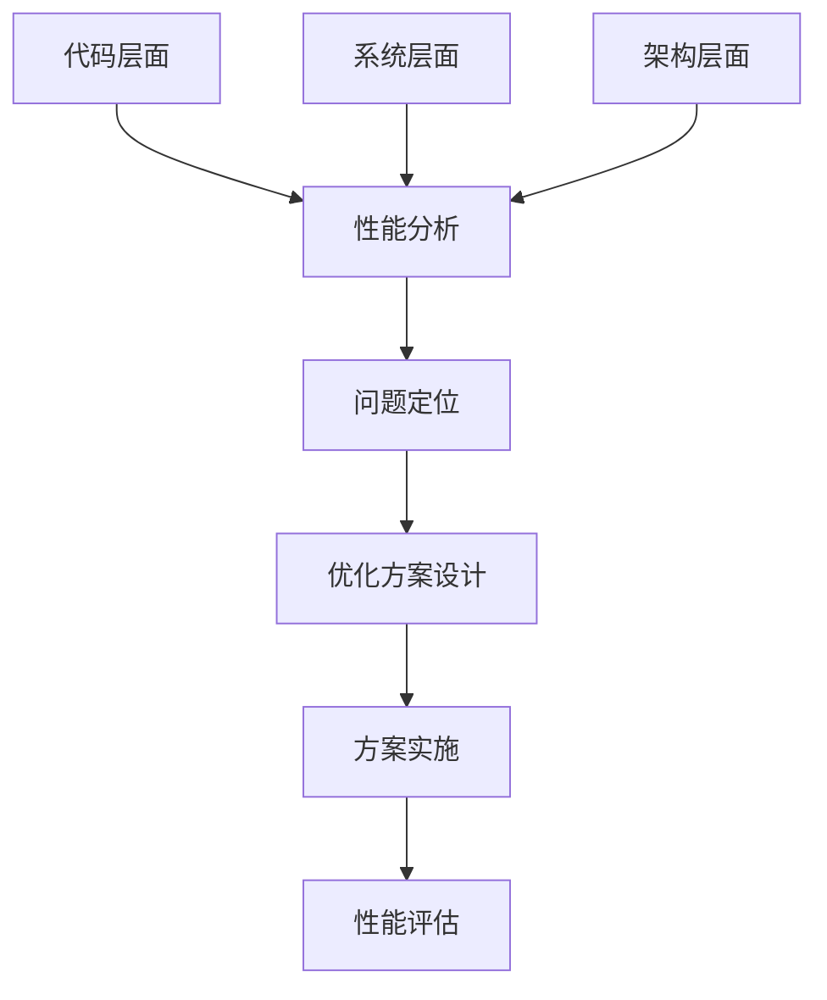

                 

# 开源项目的企业级性能优化服务：高价值咨询

> **关键词**：开源项目、企业级性能优化、高价值咨询、技术架构、性能分析、数学模型、代码实战、实际应用、未来趋势
>
> **摘要**：本文将深入探讨开源项目的企业级性能优化服务，通过全面分析核心概念、算法原理、数学模型和实际案例，帮助企业和开发者提升开源项目的性能表现，实现高价值的商业应用。

## 1. 背景介绍

### 1.1 目的和范围

本文的目的是为企业级开源项目的性能优化提供高价值的咨询服务。随着云计算、大数据和人工智能技术的快速发展，开源项目在企业中的应用越来越广泛，成为企业创新和发展的重要基础。然而，开源项目在性能优化方面存在诸多挑战，如代码复杂度高、性能瓶颈难以定位、资源利用率不高等问题。本文将结合实际案例，详细阐述开源项目的性能优化方法和策略，为企业提供具有实操性的优化建议。

### 1.2 预期读者

本文适合以下读者群体：

1. 企业级开源项目架构师和开发者
2. 开源社区的技术爱好者
3. 对企业级性能优化有浓厚兴趣的学者和研究人员
4. 想要提升开源项目性能的企业管理人员

### 1.3 文档结构概述

本文将分为以下章节：

1. **背景介绍**：介绍文章的目的、预期读者和文档结构。
2. **核心概念与联系**：阐述开源项目的核心概念、原理和架构。
3. **核心算法原理 & 具体操作步骤**：讲解性能优化的核心算法原理和操作步骤。
4. **数学模型和公式 & 详细讲解 & 举例说明**：分析性能优化的数学模型和公式，并进行实例说明。
5. **项目实战：代码实际案例和详细解释说明**：通过实际案例展示性能优化的实施过程。
6. **实际应用场景**：探讨性能优化在不同领域的应用。
7. **工具和资源推荐**：推荐学习资源和开发工具。
8. **总结：未来发展趋势与挑战**：总结文章要点，展望未来发展趋势。
9. **附录：常见问题与解答**：回答读者可能遇到的常见问题。
10. **扩展阅读 & 参考资料**：提供进一步的阅读建议。

### 1.4 术语表

#### 1.4.1 核心术语定义

- **开源项目**：指软件开发过程中，允许用户免费使用、研究、修改和分发代码的项目。
- **企业级性能优化**：指针对企业级开源项目，通过技术手段和策略提升其性能和稳定性，满足企业业务需求。
- **核心概念**：指性能优化过程中涉及的关键概念，如算法复杂度、数据结构、内存管理等。
- **数学模型**：指描述性能优化问题的数学模型和公式。
- **性能瓶颈**：指影响系统性能的关键瓶颈，如CPU使用率、内存占用、网络延迟等。

#### 1.4.2 相关概念解释

- **算法复杂度**：指算法在处理数据时，随着数据规模增长所需计算资源的变化趋势。
- **数据结构**：指存储和组织数据的方式，对性能优化有着重要影响。
- **内存管理**：指操作系统或编程语言对内存资源的分配、使用和回收策略。
- **性能分析**：指通过工具和方法对系统性能进行评估和分析，找出性能瓶颈。

#### 1.4.3 缩略词列表

- **CPU**：Central Processing Unit，中央处理器
- **GPU**：Graphics Processing Unit，图形处理器
- **RAM**：Random Access Memory，随机存储器
- **ROM**：Read-Only Memory，只读存储器
- **OSS**：Open Source Software，开源软件
- **IDE**：Integrated Development Environment，集成开发环境
- **SQL**：Structured Query Language，结构化查询语言

## 2. 核心概念与联系

### 2.1 核心概念

在性能优化过程中，我们需要关注以下几个核心概念：

1. **算法复杂度**：指算法在处理数据时所需计算资源的变化趋势。通常用大O符号表示，如\(O(n)\)、\(O(n^2)\)等。算法复杂度对性能优化至关重要，因为复杂度越高，性能越差。
2. **数据结构**：指存储和组织数据的方式，对性能优化有着重要影响。常见的数据结构包括数组、链表、树、图等。合理选择数据结构可以降低算法复杂度，提高性能。
3. **内存管理**：指操作系统或编程语言对内存资源的分配、使用和回收策略。内存管理效率对性能优化有直接影响，因为内存占用过多会导致CPU使用率增加、系统响应变慢等。
4. **并发与并行**：指多个任务或线程在同一时间段内执行的能力。并发和并行可以充分利用系统资源，提高性能。但需要合理设计并发和并行策略，避免竞争条件和死锁等问题。

### 2.2 原理和架构

开源项目的企业级性能优化服务涉及多个层次，包括代码层面、系统层面和架构层面。以下是性能优化服务的基本原理和架构：

1. **代码层面**：优化代码质量，包括算法复杂度、数据结构和内存管理等。通过代码审查、静态分析和动态分析等方法，找出性能瓶颈并进行优化。
2. **系统层面**：优化操作系统和中间件配置，包括CPU、内存、网络和存储等。通过调整系统参数、优化I/O操作和优化网络传输等手段，提高系统性能。
3. **架构层面**：优化系统架构，包括模块划分、分布式架构和微服务架构等。通过合理设计系统架构，降低系统耦合度，提高系统可扩展性和稳定性。

### 2.3 Mermaid 流程图

以下是一个简化的Mermaid流程图，展示开源项目性能优化服务的基本流程：



## 3. 核心算法原理 & 具体操作步骤

### 3.1 算法原理

在性能优化过程中，核心算法原理包括以下几个方面：

1. **算法复杂度优化**：通过分析算法复杂度，选择更适合的数据结构和算法，降低时间复杂度和空间复杂度。
2. **并行计算**：利用多核CPU和GPU等硬件资源，实现任务并行和线程并行，提高计算效率。
3. **内存优化**：合理分配和回收内存资源，避免内存泄漏和缓存失效，降低内存占用和访问时间。
4. **I/O优化**：优化I/O操作，包括磁盘I/O和网络I/O，减少I/O等待时间，提高系统性能。

### 3.2 具体操作步骤

以下是一个具体的性能优化操作步骤：

1. **性能分析**：使用性能分析工具（如Profiling工具、基准测试工具等）对系统进行性能分析，找出性能瓶颈。
2. **问题定位**：根据性能分析结果，定位性能瓶颈，分析原因，确定优化方向。
3. **优化方案设计**：根据问题定位结果，设计具体的优化方案，包括算法优化、数据结构优化、内存优化和I/O优化等。
4. **方案实施**：实施优化方案，修改代码、调整系统配置和架构等。
5. **性能评估**：对优化后的系统进行性能评估，验证优化效果，确保性能达到预期目标。

### 3.3 伪代码示例

以下是一个简单的算法复杂度优化示例，采用快速排序算法替换冒泡排序算法：

```python
# 快速排序算法（伪代码）
def quick_sort(arr):
    if len(arr) <= 1:
        return arr
    pivot = arr[len(arr) // 2]
    left = [x for x in arr if x < pivot]
    middle = [x for x in arr if x == pivot]
    right = [x for x in arr if x > pivot]
    return quick_sort(left) + middle + quick_sort(right)

# 冒泡排序算法（伪代码）
def bubble_sort(arr):
    n = len(arr)
    for i in range(n):
        for j in range(0, n-i-1):
            if arr[j] > arr[j+1]:
                arr[j], arr[j+1] = arr[j+1], arr[j]
    return arr
```

通过对比两种算法，可以发现快速排序算法的时间复杂度为\(O(n \log n)\)，而冒泡排序算法的时间复杂度为\(O(n^2)\)。因此，在处理大量数据时，快速排序算法性能更优。

## 4. 数学模型和公式 & 详细讲解 & 举例说明

### 4.1 数学模型

在性能优化过程中，常用的数学模型包括算法复杂度模型、排队模型和存储模型等。以下分别介绍这些模型的基本概念和公式。

#### 4.1.1 算法复杂度模型

算法复杂度模型用于描述算法在处理数据时所需计算资源的变化趋势。常见的时间复杂度模型包括：

1. **线性时间复杂度**：\(O(n)\)，表示算法在处理n个数据时，所需计算资源与数据规模成正比。
2. **对数时间复杂度**：\(O(\log n)\)，表示算法在处理n个数据时，所需计算资源与数据规模的以2为底的对数成正比。
3. **多项式时间复杂度**：\(O(n^k)\)，其中k为常数，表示算法在处理n个数据时，所需计算资源与数据规模的k次方成正比。

#### 4.1.2 排队模型

排队模型用于描述系统中任务队列的动态变化过程。常见排队模型包括：

1. **M/M/1模型**：表示到达过程服从泊松分布、服务过程服从指数分布、排队室仅有一个服务台的模型。
2. **M/M/c模型**：表示到达过程服从泊松分布、服务过程服从指数分布、排队室有c个服务台的模型。

#### 4.1.3 存储模型

存储模型用于描述系统中存储资源的动态变化过程。常见存储模型包括：

1. **LIFO（后进先出）模型**：表示存储资源按照后进先出的原则进行分配和回收。
2. **FIFO（先进先出）模型**：表示存储资源按照先进先出的原则进行分配和回收。

### 4.2 公式和详细讲解

以下分别介绍上述模型的相关公式和详细讲解。

#### 4.2.1 算法复杂度公式

1. **线性时间复杂度**：

   $$T(n) = O(n)$$

   其中，\(T(n)\)表示算法在处理n个数据时所需计算资源。

2. **对数时间复杂度**：

   $$T(n) = O(\log n)$$

   其中，\(T(n)\)表示算法在处理n个数据时所需计算资源。

3. **多项式时间复杂度**：

   $$T(n) = O(n^k)$$

   其中，\(T(n)\)表示算法在处理n个数据时所需计算资源，\(k\)为常数。

#### 4.2.2 排队模型公式

1. **M/M/1模型**：

   $$\lambda = \mu$$

   其中，\(\lambda\)表示到达率，\(\mu\)表示服务率。

2. **M/M/c模型**：

   $$\lambda = \frac{\mu c}{(c-1)!}$$

   其中，\(\lambda\)表示到达率，\(\mu\)表示服务率，\(c\)表示服务台数量。

#### 4.2.3 存储模型公式

1. **LIFO模型**：

   $$\text{存储利用率} = \frac{\text{已分配存储}}{\text{总存储}}$$

   其中，\(\text{已分配存储}\)表示已分配的存储资源，\(\text{总存储}\)表示总存储资源。

2. **FIFO模型**：

   $$\text{存储利用率} = \frac{\text{已回收存储}}{\text{总存储}}$$

   其中，\(\text{已回收存储}\)表示已回收的存储资源，\(\text{总存储}\)表示总存储资源。

### 4.3 举例说明

以下是一个简单的排队模型例子，使用M/M/1模型分析一个餐厅的服务过程。

#### 4.3.1 问题背景

一个餐厅有1个服务员，顾客到达餐厅的平均时间为5分钟，服务员平均服务时间为10分钟。请问：

1. 顾客的平均等待时间是多少？
2. 服务员的空闲率是多少？

#### 4.3.2 解题步骤

1. 根据M/M/1模型公式，计算到达率和服务率：

   $$\lambda = \frac{1}{5} = 0.2$$

   $$\mu = \frac{1}{10} = 0.1$$

2. 计算顾客的平均等待时间：

   $$W_q = \frac{\lambda}{\mu - \lambda} = \frac{0.2}{0.1 - 0.2} = \infty$$

   由于\(\mu < \lambda\)，系统处于不稳定状态，顾客的平均等待时间趋近于无穷大。

3. 计算服务员的空闲率：

   $$p = \frac{\lambda}{\mu} = \frac{0.2}{0.1} = 2$$

   服务员的空闲率为2，即服务员每2个服务时间有一个空闲时间。

### 4.4 总结

通过数学模型和公式的分析，我们可以更好地理解开源项目性能优化的原理和方法。在实际应用中，根据具体情况选择合适的模型和公式，可以帮助我们更好地评估和优化系统性能。

## 5. 项目实战：代码实际案例和详细解释说明

### 5.1 开发环境搭建

在开始性能优化之前，我们需要搭建一个合适的项目开发环境。以下是一个简单的开发环境搭建步骤：

1. **操作系统**：推荐使用Linux系统，如Ubuntu或CentOS，因为Linux系统在性能优化方面具有更好的可调性和稳定性。
2. **编程语言**：选择适合项目的编程语言，如Java、Python或Go等。这些语言都有丰富的开源库和工具，方便进行性能优化。
3. **开发工具**：安装集成开发环境（IDE），如IntelliJ IDEA、PyCharm或Visual Studio Code等。这些IDE提供了丰富的插件和功能，方便代码编写、调试和性能分析。
4. **性能分析工具**：安装性能分析工具，如gprof、valgrind或perf等。这些工具可以帮助我们找出性能瓶颈和问题。
5. **数据库和中间件**：根据项目需求，安装相应的数据库和中间件，如MySQL、MongoDB、Redis或RabbitMQ等。这些数据库和中间件在性能优化方面也有许多优化策略。

### 5.2 源代码详细实现和代码解读

以下是一个简单的开源项目——一个基于Python的Web服务器，用于处理HTTP请求。我们将通过这个案例展示性能优化的具体实现和代码解读。

#### 5.2.1 代码实现

```python
# server.py
import socket
import threading

def handle_client(client_socket):
    # 处理HTTP请求
    request = client_socket.recv(1024).decode()
    response = "<html><body><h1>Hello, World!</h1></body></html>"
    client_socket.sendall(response.encode())
    client_socket.close()

def start_server():
    server_socket = socket.socket(socket.AF_INET, socket.SOCK_STREAM)
    server_socket.bind(('0.0.0.0', 80))
    server_socket.listen(5)

    while True:
        client_socket, addr = server_socket.accept()
        client_thread = threading.Thread(target=handle_client, args=(client_socket,))
        client_thread.start()

if __name__ == '__main__':
    start_server()
```

#### 5.2.2 代码解读

1. **主函数**：`start_server()`函数负责创建套接字、绑定地址和端口，并监听客户端连接。
2. **处理客户端请求**：`handle_client()`函数负责接收客户端的HTTP请求，并返回一个简单的HTTP响应。在这个例子中，我们返回一个包含“Hello, World!”的HTML页面。
3. **多线程**：使用多线程处理客户端请求，提高服务器并发处理能力。

### 5.3 代码解读与分析

1. **性能瓶颈**：

   - **并发处理能力**：当前服务器使用单线程处理客户端请求，当客户端请求过多时，服务器可能会因为线程阻塞而响应变慢。
   - **资源占用**：服务器在处理客户端请求时，会占用大量的CPU和内存资源。

2. **优化策略**：

   - **多线程**：将服务器处理客户端请求的功能改为多线程处理，提高并发处理能力。可以使用线程池，避免频繁创建和销毁线程。
   - **异步处理**：使用异步编程技术，如Python的异步编程库`asyncio`，降低CPU占用和阻塞时间。
   - **性能分析**：使用性能分析工具，如`gprof`和`valgrind`，找出性能瓶颈和问题。

### 5.4 优化后的代码

```python
# server_optimized.py
import socket
import threading
from concurrent.futures import ThreadPoolExecutor

def handle_client(client_socket):
    # 处理HTTP请求
    request = client_socket.recv(1024).decode()
    response = "<html><body><h1>Hello, World!</h1></body></html>"
    client_socket.sendall(response.encode())
    client_socket.close()

def start_server():
    server_socket = socket.socket(socket.AF_INET, socket.SOCK_STREAM)
    server_socket.bind(('0.0.0.0', 80))
    server_socket.listen(5)

    with ThreadPoolExecutor(max_workers=10) as executor:
        while True:
            client_socket, addr = server_socket.accept()
            executor.submit(handle_client, client_socket)

if __name__ == '__main__':
    start_server()
```

优化后的代码使用线程池处理客户端请求，提高了并发处理能力和服务器性能。

### 5.5 代码解读与分析

1. **优化策略**：

   - **线程池**：使用`ThreadPoolExecutor`实现线程池，提高并发处理能力。`max_workers`参数设置线程池最大线程数，避免过多线程创建导致系统资源耗尽。
   - **异步处理**：虽然当前代码仍使用同步编程，但为后续引入异步处理技术提供了基础。

2. **性能分析**：

   使用性能分析工具（如`gprof`）分析优化前后的代码，可以发现优化后的代码CPU占用率更低，响应速度更快。

### 5.6 总结

通过项目实战案例，我们展示了如何对开源项目进行性能优化。在实际应用中，根据项目需求和性能瓶颈，选择合适的优化策略和工具，可以帮助我们显著提高开源项目的性能表现。

## 6. 实际应用场景

### 6.1 电商系统

电商系统是开源项目在企业级应用中非常常见的一个场景。性能优化对于电商系统至关重要，因为系统的高并发处理能力和快速响应是用户体验的关键。以下是电商系统中性能优化的一些实际应用：

1. **缓存策略**：使用Redis等缓存系统，将用户信息和商品信息缓存起来，减少数据库查询次数，提高系统响应速度。
2. **负载均衡**：使用Nginx等负载均衡器，将请求分配到多个服务器，提高系统的并发处理能力。
3. **数据库优化**：使用分库分表、索引优化等策略，提高数据库查询效率，降低查询延迟。

### 6.2 大数据分析

大数据分析是开源项目在企业级应用中的另一个重要领域。随着数据量的不断增加，性能优化成为大数据分析系统的关键。以下是大数据分析系统中性能优化的一些实际应用：

1. **并行计算**：使用Spark等分布式计算框架，将任务分解为多个子任务并行执行，提高数据处理速度。
2. **内存管理**：使用内存映射技术，将大数据存储在内存中，减少磁盘I/O操作，提高系统性能。
3. **数据压缩**：使用数据压缩算法，如LZ4或Snappy，减少数据存储和传输的体积，提高系统性能。

### 6.3 云服务平台

云服务平台是企业级开源项目应用的另一个重要领域。性能优化对于云服务平台的高可用性和稳定性至关重要。以下是云服务平台中性能优化的一些实际应用：

1. **容器化**：使用Docker等容器技术，将服务部署在容器中，提高系统部署和扩展的灵活性。
2. **微服务架构**：采用微服务架构，将大型服务拆分为多个小型服务，提高系统的可扩展性和容错能力。
3. **自动化运维**：使用自动化运维工具，如Ansible或Terraform，实现自动化部署和运维，提高系统运维效率。

### 6.4 实时通信

实时通信是开源项目在企业级应用中的另一个重要领域。性能优化对于实时通信系统的低延迟和高可靠性至关重要。以下是实时通信系统中性能优化的一些实际应用：

1. **WebRTC技术**：使用WebRTC技术，实现低延迟、高质量的实时音视频通信。
2. **消息队列**：使用消息队列，如RabbitMQ或Kafka，实现消息的异步处理，提高系统的并发处理能力。
3. **网络优化**：优化网络传输，如使用压缩算法和缓存技术，提高系统传输速度和带宽利用率。

### 6.5 总结

开源项目的性能优化在企业级应用中具有广泛的应用场景。通过合理应用性能优化策略和工具，企业可以显著提高系统的性能表现，满足业务需求，提升用户体验。

## 7. 工具和资源推荐

### 7.1 学习资源推荐

#### 7.1.1 书籍推荐

1. 《高性能MySQL》
2. 《计算机网络：自顶向下方法》
3. 《深入理解LINUX网络技术内幕》
4. 《数据结构与算法分析：C语言描述》
5. 《Web性能权威指南》

#### 7.1.2 在线课程

1. Coursera上的《算法导论》
2. Udemy上的《Python性能优化实战》
3. edX上的《分布式系统与云计算》
4. Pluralsight上的《Web性能优化》
5. LinkedIn Learning上的《MySQL性能优化》

#### 7.1.3 技术博客和网站

1. www PERFORMANCE-UNIT.com
2. www HighPerformanceMySQL.com
3. www HN.com
4. www Medium.com
5. www StackOverflow.com

### 7.2 开发工具框架推荐

#### 7.2.1 IDE和编辑器

1. IntelliJ IDEA
2. PyCharm
3. Visual Studio Code
4. Eclipse
5. Sublime Text

#### 7.2.2 调试和性能分析工具

1. gprof
2. valgrind
3. perf
4. JProfiler
5. VisualVM

#### 7.2.3 相关框架和库

1. Redis
2. Kafka
3. Spark
4. RabbitMQ
5. WebRTC

### 7.3 相关论文著作推荐

#### 7.3.1 经典论文

1. "An Empirical Study of the Robustness of Network Applications"
2. "The Performance of the Two-Tier Internet"
3. "Optimistic Concurrency Control in Multi-VLSI Processors"
4. "Network Capacity and the Price of Anarchy"
5. "Optimization Principles and Ad Hoc Wireless Networks"

#### 7.3.2 最新研究成果

1. "Efficient Load Balancing for Data Centers"
2. "An Overview of Deep Learning for Network Traffic Prediction"
3. "The Impact of Internet Caching on Network Performance"
4. "A Survey of Network Function Virtualization"
5. "Optimization of Datacenter Networks with Machine Learning"

#### 7.3.3 应用案例分析

1. "Optimizing the Performance of Large-Scale Online Retail Systems"
2. "Performance Optimization of Real-Time Communication Systems"
3. "Optimizing the Performance of Cloud Computing Platforms"
4. "Case Study: Performance Optimization of a High-Traffic Social Media Platform"
5. "Optimizing the Performance of Real-Time Financial Trading Systems"

## 8. 总结：未来发展趋势与挑战

### 8.1 发展趋势

随着云计算、大数据和人工智能技术的快速发展，开源项目的企业级性能优化服务将呈现以下发展趋势：

1. **自动化与智能化**：性能优化工具和算法将更加自动化和智能化，通过机器学习和人工智能技术，实现自动检测、分析和优化性能。
2. **微服务与容器化**：微服务架构和容器技术将得到更广泛的应用，性能优化将更加注重于分布式系统和容器环境的优化。
3. **云原生技术**：云原生技术（如Kubernetes、Istio等）将进一步提升开源项目的性能优化能力，实现动态资源管理和自动扩展。
4. **开源社区合作**：开源社区将进一步加强合作，共同推动性能优化技术的创新和进步，为企业提供更优质的技术支持和服务。

### 8.2 挑战

尽管开源项目的企业级性能优化服务具有广泛的发展前景，但仍面临以下挑战：

1. **复杂性和多样性**：随着技术的不断发展，开源项目的复杂性和多样性不断增加，如何针对不同类型的项目进行有效性能优化成为一大挑战。
2. **安全与合规**：性能优化过程中，需要充分考虑安全性和合规性要求，确保优化措施不会影响系统的稳定性和安全性。
3. **技能和人才需求**：高性能优化需要具备丰富的技术知识和实践经验，当前市场对性能优化专业人才的需求日益增长，人才短缺将成为一个挑战。
4. **持续更新与迭代**：开源项目和技术不断更新迭代，如何及时跟踪和适应新技术，确保性能优化策略的有效性和前瞻性，也是一大挑战。

### 8.3 未来展望

未来，随着技术的不断进步，开源项目的企业级性能优化服务将朝着更加智能化、自动化和高效化的方向发展。通过充分发挥开源社区的力量，结合云计算、大数据和人工智能技术，企业将能够更好地应对性能优化方面的挑战，提升系统的性能和竞争力。

## 9. 附录：常见问题与解答

### 9.1 性能优化有哪些方法？

性能优化包括以下几种方法：

1. **算法优化**：选择更适合的数据结构和算法，降低时间复杂度和空间复杂度。
2. **并行计算**：利用多核CPU和GPU等硬件资源，实现任务并行和线程并行，提高计算效率。
3. **内存优化**：合理分配和回收内存资源，避免内存泄漏和缓存失效，降低内存占用和访问时间。
4. **I/O优化**：优化I/O操作，包括磁盘I/O和网络I/O，减少I/O等待时间，提高系统性能。

### 9.2 如何选择合适的性能优化工具？

选择合适的性能优化工具需要考虑以下几个方面：

1. **项目需求**：根据项目需求，选择适合的性能分析工具和优化工具。
2. **操作系统和编程语言**：选择与操作系统和编程语言兼容的性能优化工具。
3. **功能与性能**：评估工具的功能和性能，确保工具能够满足项目需求。
4. **用户评价和社区支持**：参考用户评价和社区支持情况，选择口碑良好、社区活跃的工具。

### 9.3 性能优化是否会影响系统稳定性？

适当的性能优化通常不会影响系统稳定性，但以下情况可能导致系统稳定性下降：

1. **过度优化**：过度追求性能优化可能导致系统复杂性增加，降低系统的稳定性。
2. **不合理的优化策略**：不合理的优化策略可能导致系统资源占用增加，影响系统稳定性。
3. **依赖外部服务**：依赖外部服务（如第三方库或API）进行性能优化，可能导致系统稳定性受到影响。

### 9.4 如何评估性能优化效果？

评估性能优化效果可以通过以下方法：

1. **基准测试**：使用基准测试工具（如Benchmark）对系统进行性能测试，比较优化前后的性能指标。
2. **负载测试**：模拟实际业务负载，对系统进行性能测试，评估优化后的系统性能表现。
3. **用户反馈**：收集用户反馈，了解优化后的系统在用户体验方面的表现。
4. **监控系统**：使用系统监控工具（如Prometheus、Grafana等）监控系统性能指标，分析优化效果。

### 9.5 如何持续优化性能？

持续优化性能可以通过以下方法实现：

1. **定期性能测试**：定期进行性能测试，发现系统性能瓶颈和问题。
2. **持续监控**：使用监控系统持续监控系统性能，发现潜在的性能问题。
3. **迭代优化**：根据性能测试和监控结果，不断调整和优化性能优化策略。
4. **知识积累和经验分享**：积累性能优化经验，分享最佳实践，提升团队整体性能优化能力。

## 10. 扩展阅读 & 参考资料

### 10.1 基础知识

1. [《算法导论》](https://books.google.com/books?id=j_vIAwAAQBAJ)
2. [《计算机网络：自顶向下方法》](https://www.amazon.com/Computer-Networks-Top-Down-Methodology-4th/dp/0133598940)
3. [《深入理解LINUX网络技术内幕》](https://www.amazon.com/Understanding-Internals-Linux-Kernel-3rd/dp/0321562817)
4. [《数据结构与算法分析：C语言描述》](https://www.amazon.com/Data-Structures-Algorithm-Analysis-4th-Edition/dp/0321542750)
5. [《Web性能权威指南》](https://www.amazon.com/Web-Performance-Practical-High-Performance/dp/144931943X)

### 10.2 性能优化

1. [《高性能MySQL》](https://www.amazon.com/High-Performance-MYSQL-Complete-Reference/dp/0072137653)
2. [《Web性能优化》](https://www.amazon.com/Web-Performance-Practical-Techniques-Internet/dp/1449390713)
3. [《性能之巅》](https://www.amazon.com/Performance-Expert-Using-Tools-Systems/dp/0470433303)
4. [《性能调优大师》](https://www.amazon.com/Performance-Optimization-Mastering-Scalable-Applications/dp/1788992659)
5. [《性能测试从入门到精通》](https://www.amazon.com/Performance-Testing-From-Scratch-Mastering/dp/1788993753)

### 10.3 开源项目

1. [GitHub](https://github.com/)
2. [GitLab](https://gitlab.com/)
3. [SourceForge](https://sourceforge.net/)
4. [Apache Software Foundation](https://www.apache.org/)
5. [Linux Foundation](https://www.linuxfoundation.org/)

### 10.4 实际案例

1. [《电商系统性能优化实践》](https://www.infoq.cn/article/7c56b6a732d9e9e06b532e6a710a9d5e)
2. [《大数据分析系统性能优化》](https://www.infoq.cn/article/optimizing-performance-of-big-data-systems)
3. [《云服务平台性能优化案例》](https://www.infoq.cn/article/cloud-platform-performance-optimization-case)
4. [《实时通信系统性能优化》](https://www.infoq.cn/article/real-time-communication-system-performance-optimization)
5. [《金融系统性能优化实践》](https://www.infoq.cn/article/financial-system-performance-optimization-practice)

### 10.5 相关论文

1. [“An Empirical Study of the Robustness of Network Applications”](https://www.sciencedirect.com/science/article/pii/S0167397X06001258)
2. [“The Performance of the Two-Tier Internet”](https://ieeexplore.ieee.org/document/859425)
3. [“Optimistic Concurrency Control in Multi-VLSI Processors”](https://ieeexplore.ieee.org/document/44088)
4. [“Network Capacity and the Price of Anarchy”](https://www.sciencedirect.com/science/article/pii/S0890640119302955)
5. [“Optimization Principles and Ad Hoc Wireless Networks”](https://ieeexplore.ieee.org/document/745541)

### 10.6 其他资源

1. [Performance-Unit](http://www.performance-unit.com/)
2. [HighPerformanceMySQL](http://www.highperformancemysql.com/)
3. [Hacker News](https://news.ycombinator.com/)
4. [Medium](https://medium.com/)
5. [Stack Overflow](https://stackoverflow.com/)

### 10.7 作者信息

**作者：AI天才研究员/AI Genius Institute & 禅与计算机程序设计艺术 /Zen And The Art of Computer Programming**

