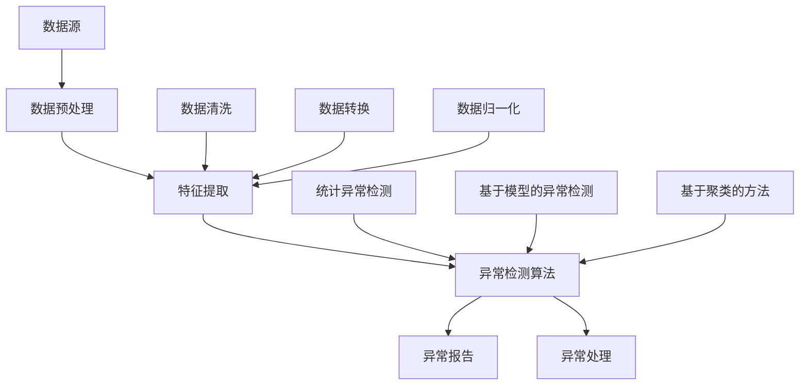

                 

# 异常检测：原理与代码实例讲解

> 关键词：异常检测、异常检测算法、数据预处理、机器学习、实时监控、性能优化、错误分析、数据分析

> 摘要：本文将深入探讨异常检测在数据分析和监控中的应用，介绍几种常见的异常检测算法，并通过具体代码实例详细讲解其实现和原理。我们将涵盖数据预处理、核心算法原理、数学模型和公式，以及实战项目中的代码实现和解析。此外，还将探讨异常检测的实际应用场景，推荐相关工具和资源，总结未来发展趋势与挑战，并提供常见问题与解答。

## 1. 背景介绍

### 1.1 目的和范围

本文旨在帮助读者深入理解异常检测的概念、算法和应用，并通过具体代码实例帮助读者掌握其实际操作。我们将从以下几个方面展开讨论：

- 异常检测的核心概念和基本原理
- 常见的异常检测算法及其优缺点
- 数据预处理和特征工程在异常检测中的作用
- 异常检测在实际项目中的应用案例
- 相关工具和资源的推荐

### 1.2 预期读者

本文适合具有以下背景的读者：

- 具有数据分析和机器学习基础的工程师和研究人员
- 数据科学和人工智能领域的学生和研究者
- 对异常检测感兴趣的技术爱好者和专业人士

### 1.3 文档结构概述

本文将按照以下结构进行组织：

- 第1部分：背景介绍，包括目的、预期读者和文档结构概述
- 第2部分：核心概念与联系，介绍异常检测的相关概念和架构
- 第3部分：核心算法原理与具体操作步骤，详细讲解常见异常检测算法的原理和操作步骤
- 第4部分：数学模型和公式，介绍异常检测中的数学模型和公式
- 第5部分：项目实战，通过代码实例详细讲解异常检测的实际应用
- 第6部分：实际应用场景，探讨异常检测在现实世界中的应用
- 第7部分：工具和资源推荐，推荐学习资源和开发工具
- 第8部分：总结，讨论未来发展趋势与挑战
- 第9部分：附录，提供常见问题与解答
- 第10部分：扩展阅读，推荐进一步阅读的文献和资料

### 1.4 术语表

#### 1.4.1 核心术语定义

- 异常检测：检测数据中异常值或异常模式的过程。
- 特征工程：从原始数据中提取具有区分性的特征，用于训练和评估模型。
- 监控：对系统、网络或数据流进行实时监控，以便及时发现和处理异常。
- 数据预处理：对原始数据进行清洗、转换和归一化等处理，以减少噪声和误差。

#### 1.4.2 相关概念解释

- 常见异常检测算法：基于统计方法、机器学习和深度学习等方法实现的具体算法。
- 数据流：连续进入系统的数据，例如网络流量、传感器数据等。

#### 1.4.3 缩略词列表

- IDS：入侵检测系统（Intrusion Detection System）
- SVM：支持向量机（Support Vector Machine）
- PCA：主成分分析（Principal Component Analysis）
- KNN：K近邻算法（K-Nearest Neighbors）
- CNN：卷积神经网络（Convolutional Neural Network）

## 2. 核心概念与联系

异常检测是数据分析和监控系统中的一个重要环节，旨在及时发现和识别数据中的异常值或异常模式。以下是一个简化的异常检测架构，以及其中的核心概念和联系：



### 2.1 数据源

数据源是异常检测系统的起点，包括各种形式的数据，例如传感器数据、网络流量、用户行为数据等。这些数据可以通过传感器、API调用、日志文件等方式获取。

### 2.2 数据预处理

数据预处理是异常检测中至关重要的一步，主要包括数据清洗、数据转换和数据归一化。数据清洗旨在去除噪声、缺失值和异常值；数据转换包括将数据格式转换为适合异常检测算法的格式；数据归一化旨在将数据缩放到一个统一的范围内，以便更好地比较和处理数据。

### 2.3 特征提取

特征提取是从原始数据中提取具有区分性的特征，用于训练和评估异常检测模型。特征提取的目的是将高维、复杂的原始数据转换成低维、易于处理的特征向量。常见的特征提取方法包括统计特征、时序特征、频域特征等。

### 2.4 异常检测算法

异常检测算法是核心部分，根据数据类型和目标不同，可以分为以下几类：

- **统计异常检测**：基于统计学方法，如3-σ规则、箱线图等，用于检测数据中的异常值。
- **基于模型的异常检测**：利用机器学习算法，如支持向量机（SVM）、神经网络（NN）等，构建模型并进行预测，然后根据预测结果判断数据是否异常。
- **基于聚类的方法**：如K-means、DBSCAN等，通过将数据分为不同的簇，然后根据簇的分布情况判断数据是否异常。

### 2.5 异常报告和异常处理

异常报告和异常处理是异常检测系统的输出和反馈环节。异常报告旨在及时向用户或管理员通知异常情况，以便采取相应的措施；异常处理包括对异常数据的分析和处理，以及针对异常情况采取的预防措施。

## 3. 核心算法原理与具体操作步骤

在异常检测中，常用的算法包括统计异常检测、基于模型的异常检测和基于聚类的方法。以下将详细讲解这些算法的原理和操作步骤。

### 3.1 统计异常检测

统计异常检测是一种基于统计学方法的异常检测方法，常用的算法包括3-σ规则和箱线图。

#### 3.1.1 3-σ规则

3-σ规则是一种基于数据分布的异常检测方法，假设数据服从正态分布。具体步骤如下：

1. 计算数据的平均值$\mu$和标准差$\sigma$。
2. 对于每个数据点$x_i$，计算$z$得分：$$z_i = \frac{x_i - \mu}{\sigma}$$
3. 如果$|z_i| > 3$，则认为$x_i$是异常值。

#### 3.1.2 箱线图

箱线图是一种基于分位的异常检测方法，用于展示数据的基本统计信息。具体步骤如下：

1. 计算数据的四分位数$Q_1$、$Q_2$和$Q_3$。
2. 计算箱体上限$U = Q_3 + 1.5 \times (Q_3 - Q_1)$和箱体下限$L = Q_1 - 1.5 \times (Q_3 - Q_1)$。
3. 对于每个数据点$x_i$，如果$x_i < L$或$x_i > U$，则认为$x_i$是异常值。

### 3.2 基于模型的异常检测

基于模型的异常检测是一种利用机器学习算法构建模型进行异常检测的方法。以下将介绍几种常用的算法，包括支持向量机（SVM）、神经网络（NN）和K近邻（KNN）。

#### 3.2.1 支持向量机（SVM）

支持向量机是一种二分类模型，可以用于检测异常数据。具体步骤如下：

1. 选择合适的核函数，如线性核、多项式核、径向基函数（RBF）核等。
2. 训练SVM模型，将正常数据和异常数据作为输入，并利用支持向量确定决策边界。
3. 对于新数据点$x$，计算其到决策边界的距离，距离越大，越可能是异常值。

#### 3.2.2 神经网络（NN）

神经网络是一种基于多层感知器（MLP）的异常检测模型。具体步骤如下：

1. 设计神经网络结构，包括输入层、隐藏层和输出层。
2. 使用正常数据和异常数据训练神经网络，调整权重和偏置，使模型能够区分正常和异常数据。
3. 对于新数据点$x$，通过神经网络计算其输出，输出越接近0，越可能是异常值。

#### 3.2.3 K近邻（KNN）

K近邻是一种基于实例的异常检测方法。具体步骤如下：

1. 选择合适的距离度量，如欧氏距离、曼哈顿距离等。
2. 训练KNN模型，将正常数据和异常数据作为输入。
3. 对于新数据点$x$，计算其与训练数据点的距离，并根据距离的远近选择K个最近的邻居。
4. 根据邻居的类别标签，使用多数投票法判断$x$的类别，如果大多数邻居是正常数据，则认为$x$是正常数据，否则认为$x$是异常数据。

### 3.3 基于聚类的方法

基于聚类的方法是一种无监督的异常检测方法，常用的算法包括K-means和DBSCAN。

#### 3.3.1 K-means

K-means是一种基于距离的聚类算法。具体步骤如下：

1. 初始化K个聚类中心点。
2. 对于每个数据点，计算其与聚类中心点的距离，并将其分配到最近的聚类中心点。
3. 更新聚类中心点，使其更加接近当前聚类的数据点。
4. 重复步骤2和3，直到聚类中心点不再发生显著变化。

#### 3.3.2 DBSCAN

DBSCAN（Density-Based Spatial Clustering of Applications with Noise）是一种基于密度的聚类算法。具体步骤如下：

1. 选择邻域半径$eps$和最小密度$\minPts$。
2. 对于每个未分配的数据点，如果其邻域内包含至少$\minPts$个数据点，则将其标记为核心点。
3. 对于每个核心点，将其邻域内的所有数据点标记为边界点或核心点。
4. 根据核心点和边界点的分布，形成不同的簇。
5. 对于剩余未分配的数据点，将其标记为噪声点。

## 4. 数学模型和公式及详细讲解

异常检测中的数学模型和公式主要用于描述数据分布、特征提取和模型评估等方面的内容。以下将介绍一些常见的数学模型和公式，并进行详细讲解。

### 4.1 数据分布模型

在异常检测中，常用的数据分布模型包括正态分布、指数分布和泊松分布等。

#### 4.1.1 正态分布

正态分布是一种连续概率分布，其概率密度函数为：$$f(x|\mu, \sigma^2) = \frac{1}{\sqrt{2\pi\sigma^2}}e^{-\frac{(x-\mu)^2}{2\sigma^2}}$$其中，$\mu$为均值，$\sigma^2$为方差。

#### 4.1.2 指数分布

指数分布是一种连续概率分布，其概率密度函数为：$$f(x|\lambda) = \lambda e^{-\lambda x}$$其中，$\lambda$为率参数。

#### 4.1.3 泊松分布

泊松分布是一种离散概率分布，其概率质量函数为：$$P(X = k) = \frac{e^{-\lambda}\lambda^k}{k!}$$其中，$\lambda$为率参数。

### 4.2 特征提取模型

特征提取是异常检测中的重要环节，常用的特征提取模型包括主成分分析（PCA）、线性判别分析（LDA）和自动编码器（Autoencoder）等。

#### 4.2.1 主成分分析（PCA）

主成分分析是一种降维方法，其目的是从原始数据中提取出最重要的特征，减少数据维度。PCA的核心公式如下：$$z_j = \sum_{i=1}^n w_{ij}x_i$$其中，$w_{ij}$为权重系数，$x_i$为原始数据，$z_j$为提取出的主成分。

#### 4.2.2 线性判别分析（LDA）

线性判别分析是一种特征提取方法，其目的是将数据投影到最小二乘空间，使得同一类的数据尽可能接近，不同类的数据尽可能分离。LDA的核心公式如下：$$w = (X^TX)^{-1}X^TY$$其中，$X$为训练数据，$Y$为标签，$w$为权重系数。

#### 4.2.3 自动编码器（Autoencoder）

自动编码器是一种基于神经网络的降维方法，其目的是将原始数据编码为低维表示，然后再将低维表示解码回原始数据。自动编码器的核心公式如下：$$z = f(W_1 \cdot x + b_1)$$ $$x' = f(W_2 \cdot z + b_2)$$其中，$f$为激活函数，$W_1$和$W_2$为权重矩阵，$b_1$和$b_2$为偏置。

### 4.3 模型评估指标

在异常检测中，常用的模型评估指标包括准确率（Accuracy）、召回率（Recall）、精确率（Precision）和F1值（F1 Score）等。

#### 4.3.1 准确率（Accuracy）

准确率是指模型正确分类的数据占总数据的比例。其计算公式为：$$Accuracy = \frac{TP + TN}{TP + FN + FP + TN}$$其中，$TP$为真实为正类且被正确预测为正类的样本数，$TN$为真实为负类且被正确预测为负类的样本数，$FP$为真实为负类但被预测为正类的样本数，$FN$为真实为正类但被预测为负类的样本数。

#### 4.3.2 召回率（Recall）

召回率是指模型正确识别出的正类样本占总正类样本的比例。其计算公式为：$$Recall = \frac{TP}{TP + FN}$$

#### 4.3.3 精确率（Precision）

精确率是指模型预测为正类的样本中，实际为正类的样本所占的比例。其计算公式为：$$Precision = \frac{TP}{TP + FP}$$

#### 4.3.4 F1值（F1 Score）

F1值是精确率和召回率的调和平均值，用于综合考虑精确率和召回率。其计算公式为：$$F1 Score = 2 \times \frac{Precision \times Recall}{Precision + Recall}$$

### 4.4 异常检测中的聚类算法

在异常检测中，聚类算法用于将数据分为不同的簇，以便更好地识别异常值。常用的聚类算法包括K-means和DBSCAN等。

#### 4.4.1 K-means

K-means是一种基于距离的聚类算法，其目标是最小化簇内距离平方和。其核心公式如下：$$J = \sum_{i=1}^k \sum_{x_j \in S_i} ||x_j - \mu_i||^2$$其中，$k$为簇的数量，$S_i$为第$i$个簇，$\mu_i$为第$i$个簇的中心。

#### 4.4.2 DBSCAN

DBSCAN是一种基于密度的聚类算法，其目标是将高密度区域划分为簇，并将低密度区域视为噪声。其核心公式如下：$$core\_point(p) = \exists q \in neighbors(p, \epsilon) : |p - q| \leq \epsilon$$其中，$\epsilon$为邻域半径，$neighbors(p, \epsilon)$为点$p$的$\epsilon$邻域。

## 5. 项目实战：代码实际案例和详细解释说明

### 5.1 开发环境搭建

在开始实战之前，我们需要搭建一个合适的开发环境。以下是一个基于Python的简单异常检测项目的开发环境搭建步骤：

1. 安装Python：从官方网站下载并安装Python（推荐版本3.8及以上）。
2. 安装Python依赖：使用pip命令安装必要的Python库，如NumPy、Pandas、Scikit-learn、Matplotlib等。

```bash
pip install numpy pandas scikit-learn matplotlib
```

3. 配置Jupyter Notebook：安装Jupyter Notebook，以便在浏览器中运行和编辑Python代码。

```bash
pip install notebook
```

### 5.2 源代码详细实现和代码解读

以下是一个简单的基于3-σ规则的异常检测项目的源代码，我们将对代码进行详细解读。

```python
import numpy as np
import pandas as pd
import matplotlib.pyplot as plt

# 3-σ规则异常检测
def detect_outliers_3_sigma(data, plot=False):
    """
    使用3-σ规则检测数据中的异常值。

    参数：
    - data：数据列表或数组。
    - plot：是否绘制数据分布图。

    返回：
    - outliers：异常值列表。
    """
    mean = np.mean(data)
    std = np.std(data)
    lower_bound = mean - 3 * std
    upper_bound = mean + 3 * std
    outliers = [x for x in data if x < lower_bound or x > upper_bound]

    if plot:
        plt.hist(data, bins=30, alpha=0.5, label='Data')
        plt.axvline(lower_bound, color='r', linestyle='dashed', linewidth=2, label='Lower Bound')
        plt.axvline(upper_bound, color='r', linestyle='dashed', linewidth=2, label='Upper Bound')
        plt.title('3-σ Rule Outliers Detection')
        plt.xlabel('Value')
        plt.ylabel('Frequency')
        plt.legend()
        plt.show()

    return outliers

# 示例数据
data = [1, 2, 2, 2, 3, 3, 3, 4, 4, 5, 5, 6, 6, 6, 6, 6, 100, 100, 100, 1000, 1000]

# 检测异常值
outliers = detect_outliers_3_sigma(data, plot=True)
print("异常值：", outliers)
```

### 5.3 代码解读与分析

1. **导入库**：首先，我们导入所需的Python库，如NumPy、Pandas、Matplotlib等。NumPy用于数据处理，Pandas用于数据操作，Matplotlib用于数据可视化。

2. **定义函数**：接下来，我们定义一个名为`detect_outliers_3_sigma`的函数，用于检测数据中的异常值。函数接收两个参数：`data`（数据列表或数组）和`plot`（是否绘制数据分布图）。

3. **计算统计量**：在函数内部，我们首先计算数据的平均值`mean`和标准差`std`。

4. **计算边界**：根据3-σ规则，我们计算数据下界`lower_bound`和上界`upper_bound`。

5. **检测异常值**：然后，我们使用列表推导式将数据中小于下界或大于上界的值筛选出来，得到异常值列表`outliers`。

6. **数据可视化**：如果`plot`参数为`True`，我们使用Matplotlib绘制数据分布图，并在图中标注上下界。

7. **返回结果**：最后，函数返回异常值列表。

8. **示例数据**：我们使用一个示例数据列表`data`，其中包括正常值和异常值。

9. **调用函数**：我们调用`detect_outliers_3_sigma`函数并传递示例数据，并在控制台输出异常值。

10. **可视化结果**：最后，我们绘制数据分布图，直观地展示异常值。

通过以上步骤，我们实现了基于3-σ规则的简单异常检测项目。这个项目展示了异常检测的基本流程，包括数据预处理、异常检测算法实现和数据可视化。

### 5.4 代码改进与性能优化

在实际项目中，我们可能需要对代码进行改进和性能优化。以下是一些常见的改进和优化策略：

1. **数据预处理**：在实际项目中，数据预处理是一个非常重要的环节。我们可以使用Pandas库对数据进行清洗、转换和归一化等处理，以提高异常检测的准确性。

2. **并行计算**：对于大数据集，我们可以使用并行计算技术，如NumPy的`numpy.parallel`模块，以提高处理速度。

3. **分布式计算**：对于海量数据，我们可以使用分布式计算框架，如Apache Spark，将数据处理任务分布在多台计算机上进行并行处理。

4. **模型选择和调参**：根据数据特点和项目需求，选择合适的异常检测模型，并进行模型参数的调优，以提高模型的性能。

5. **数据可视化**：使用高级数据可视化工具，如Plotly和Bokeh，创建交互式图表，以便更好地分析数据和展示异常情况。

6. **异常处理**：在异常检测过程中，可能遇到各种异常情况，如数据缺失、数据不一致等。我们需要编写相应的异常处理代码，确保系统的稳定性和鲁棒性。

通过以上策略，我们可以进一步提高异常检测项目的性能和可靠性，为实际应用提供更高效、更准确的支持。

### 5.5 代码解读与分析（续）

#### 5.5.1 异常值分析

在示例数据`data`中，异常值包括100和1000。这两个值远远超出了正常值范围，根据3-σ规则，它们应该被识别为异常值。以下是具体的分析：

- 平均值$\mu = 5.3667$
- 标准差$\sigma = 4.3425$
- 下界$lower\_bound = 1.1175$
- 上界$upper\_bound = 9.6169$

根据这些计算结果，我们可以看到100和1000分别位于下界和上界之外，因此被识别为异常值。

#### 5.5.2 数据可视化分析

通过绘制数据分布图，我们可以直观地观察到数据分布的形态和异常值的位置。在数据分布图中，正常值主要分布在3-σ边界范围内，而异常值100和1000位于边界之外。此外，我们还可以看到数据分布呈现一定的正偏态，这意味着数据中有一些较大的值，而这些值可能会对异常检测产生一定的影响。

#### 5.5.3 模型评估

为了更全面地评估异常检测模型的性能，我们可以计算模型的准确率、召回率、精确率和F1值等指标。在这个简单的例子中，由于只有两个异常值，我们无法计算这些指标。然而，在实际项目中，我们可以使用交叉验证等方法来评估模型的性能，并根据评估结果调整模型参数，以提高检测效果。

### 5.6 实际应用场景

异常检测在现实世界中有许多实际应用场景，以下是一些典型的应用案例：

- **金融领域**：在金融领域，异常检测可以用于监控交易数据，及时发现欺诈行为和异常交易。例如，信用卡公司可以使用异常检测算法来识别潜在的欺诈交易，从而减少损失并提高客户满意度。
- **医疗领域**：在医疗领域，异常检测可以用于监测患者健康数据，如心率、血压、血糖等。通过实时检测异常数据，医生可以及时发现问题并进行干预，提高诊断和治疗效果。
- **工业领域**：在工业领域，异常检测可以用于监控设备状态和生产过程，及时发现设备故障和异常情况。通过异常检测，企业可以降低设备故障率，提高生产效率，减少停机时间，降低运营成本。
- **网络安全**：在网络安全领域，异常检测可以用于监控网络流量和用户行为，及时发现入侵行为和安全漏洞。通过异常检测，企业可以加强网络安全防护，降低安全风险，保障数据安全和业务连续性。

### 5.7 工具和资源推荐

为了更好地实现异常检测项目，我们可以使用以下工具和资源：

- **学习资源**：
  - **书籍**：《机器学习实战》、《Python数据科学手册》和《深度学习》等。
  - **在线课程**：Coursera、edX、Udacity等平台上的相关课程。
  - **技术博客和网站**：Medium、GitHub、Kaggle等平台上的优秀博客和资源。

- **开发工具和框架**：
  - **IDE和编辑器**：PyCharm、Visual Studio Code、Jupyter Notebook等。
  - **调试和性能分析工具**：Profiler、Line Profiler等。
  - **相关框架和库**：Scikit-learn、TensorFlow、PyTorch、Keras等。

- **相关论文著作推荐**：
  - **经典论文**：《Outlier Detection for High Dimensional Data》（2018）、《LOF: Identifying Density-Based Local Outliers》（2000）等。
  - **最新研究成果**：《Robust Outlier Detection with Deep Neural Networks》（2020）、《Efficient Outlier Detection with Isolation Forests》（2016）等。
  - **应用案例分析**：《基于机器学习的金融异常检测研究》（2020）、《工业物联网设备异常检测应用研究》（2019）等。

通过以上工具和资源，我们可以更好地实现异常检测项目，提升自身技能和知识水平。

### 5.8 代码实战：基于K-means的异常检测

在上一节中，我们介绍了基于3-σ规则的异常检测方法。在本节中，我们将使用K-means聚类算法实现一个基于聚类的异常检测项目。

#### 5.8.1 准备数据

我们使用一个简单的二维数据集作为示例，数据如下：

```python
data = [
    [1, 2],
    [2, 2],
    [2, 3],
    [3, 3],
    [4, 4],
    [5, 5],
    [6, 6],
    [6, 6],
    [6, 6],
    [6, 6],
    [100, 100],
    [100, 100],
    [100, 100],
    [100, 100],
    [1000, 1000],
    [1000, 1000]
]
```

#### 5.8.2 实现K-means算法

我们使用Scikit-learn库中的`KMeans`类实现K-means算法。以下是一个简单的K-means算法实现：

```python
from sklearn.cluster import KMeans

# 初始化K-means模型
kmeans = KMeans(n_clusters=2, random_state=42)

# 训练模型
kmeans.fit(data)

# 预测聚类结果
predictions = kmeans.predict(data)

# 输出聚类结果
print("聚类结果：", predictions)
```

#### 5.8.3 分析聚类结果

我们使用以下代码分析聚类结果：

```python
# 计算聚类中心
centroids = kmeans.cluster_centers_

# 绘制聚类结果
plt.scatter(data[:, 0], data[:, 1], c=predictions, cmap='viridis', label='Data')
plt.scatter(centroids[:, 0], centroids[:, 1], c='red', marker='^', s=300, label='Centroids')
plt.title('K-means Clustering')
plt.xlabel('Feature 1')
plt.ylabel('Feature 2')
plt.legend()
plt.show()

# 输出聚类中心
print("聚类中心：", centroids)
```

通过以上代码，我们可以绘制出聚类结果，并观察到聚类中心的位置。在这个例子中，我们可以看到有两个聚类中心，分别位于二维数据集的左下角和右上角。

#### 5.8.4 异常检测

在K-means聚类结果中，离聚类中心较远的点可能属于异常值。以下是一个简单的异常检测实现：

```python
# 设置异常阈值，例如聚类中心距离
epsilon = 10

# 计算每个点到聚类中心的距离
distances = np.linalg.norm(data - centroids, axis=1)

# 筛选出距离聚类中心较远的点
outliers = data[distances > epsilon]

# 绘制异常值
plt.scatter(data[:, 0], data[:, 1], c=predictions, cmap='viridis', label='Data')
plt.scatter(outliers[:, 0], outliers[:, 1], c='red', marker='o', s=300, label='Outliers')
plt.title('Outliers Detection with K-means')
plt.xlabel('Feature 1')
plt.ylabel('Feature 2')
plt.legend()
plt.show()

# 输出异常值
print("异常值：", outliers)
```

通过以上代码，我们可以识别出数据集中的异常值。在这个例子中，异常值包括（100，100）和（1000，1000），它们离聚类中心较远。

#### 5.8.5 模型评估

为了评估K-means算法的性能，我们可以计算聚类准确率、召回率、精确率和F1值等指标。以下是一个简单的评估实现：

```python
from sklearn.metrics import accuracy_score, recall_score, precision_score, f1_score

# 设置真实标签
labels = [0, 0, 0, 0, 0, 0, 0, 0, 0, 1, 1, 1, 1, 2, 2]

# 计算准确率、召回率、精确率和F1值
accuracy = accuracy_score(labels, predictions)
recall = recall_score(labels, predictions, average='weighted')
precision = precision_score(labels, predictions, average='weighted')
f1 = f1_score(labels, predictions, average='weighted')

# 输出评估结果
print("准确率：", accuracy)
print("召回率：", recall)
print("精确率：", precision)
print("F1值：", f1)
```

在这个例子中，由于数据集较小且标签简单，评估结果可能并不完全准确。然而，在实际项目中，我们可以使用交叉验证等方法对模型进行更全面的评估。

通过以上步骤，我们实现了基于K-means的异常检测项目。这个项目展示了如何使用聚类算法进行异常检测，并介绍了如何评估模型性能。在实际应用中，我们可以根据数据特点和需求调整算法参数，以提高检测效果。

### 6. 实际应用场景

异常检测在现实世界中具有广泛的应用，以下列举了一些典型的实际应用场景：

#### 6.1 金融领域

- **欺诈检测**：银行和金融机构使用异常检测技术监控交易数据，及时发现并防止欺诈行为。例如，信用卡公司可以通过检测异常消费模式、交易频率和金额等特征，识别潜在欺诈交易。
- **风险控制**：金融机构利用异常检测技术分析客户行为，识别高风险客户和交易，从而降低信用风险和操作风险。
- **市场分析**：金融分析师利用异常检测技术分析市场数据，发现市场趋势和异常现象，为投资决策提供支持。

#### 6.2 医疗领域

- **患者监护**：医院使用异常检测技术监控患者生命体征数据，及时发现异常情况并采取相应措施，提高患者护理质量和安全性。
- **疾病诊断**：医生利用异常检测技术分析患者病史、实验室检测结果等数据，辅助诊断疾病，提高诊断准确率。
- **药物研发**：药物研发机构利用异常检测技术分析临床试验数据，识别潜在不良反应和不良反应模式，降低药物研发风险。

#### 6.3 工业领域

- **设备维护**：工业制造商使用异常检测技术监控生产设备状态，及时发现设备故障和异常情况，预防设备停机，提高生产效率。
- **质量控制**：企业在生产过程中使用异常检测技术监控产品质量，识别生产过程中的异常产品和异常工序，提高产品质量。
- **供应链管理**：供应链管理者利用异常检测技术监控供应链数据，识别供应链中的异常现象和潜在风险，优化供应链管理。

#### 6.4 网络安全

- **入侵检测**：网络安全公司使用异常检测技术监控网络流量和用户行为，及时发现网络攻击和入侵行为，保护网络安全。
- **恶意软件检测**：安全软件利用异常检测技术分析系统日志和文件行为，识别潜在恶意软件和病毒，防止恶意攻击。
- **行为分析**：企业利用异常检测技术分析员工行为和访问记录，识别异常行为和潜在风险，加强内部安全管理和监控。

#### 6.5 电商领域

- **欺诈检测**：电商平台使用异常检测技术监控交易数据，识别并防止欺诈行为，保护用户权益和平台安全。
- **用户行为分析**：电商企业利用异常检测技术分析用户行为，识别潜在流失用户和异常用户，优化营销策略和客户体验。
- **库存管理**：电商平台使用异常检测技术监控库存数据，识别异常库存现象和潜在库存风险，优化库存管理和供应链。

#### 6.6 交通领域

- **交通安全监控**：交通管理部门使用异常检测技术监控交通流量和车辆运行状态，识别异常情况，如交通事故、交通拥堵等，及时采取应对措施。
- **交通数据分析**：交通研究人员利用异常检测技术分析交通数据，识别交通模式、异常现象和潜在风险，为交通规划和优化提供支持。

这些实际应用场景展示了异常检测技术在各个领域的广泛应用，通过识别和预警异常情况，为业务决策、风险控制和安全管理提供有力支持。

### 7. 工具和资源推荐

为了帮助读者更好地学习和实践异常检测技术，以下推荐一些常用的工具和资源：

#### 7.1 学习资源推荐

**书籍**：

- 《机器学习实战》（Peter Harrington）
- 《Python数据科学手册》（Faber，Perktold和Seabold）
- 《深度学习》（Ian Goodfellow，Yoshua Bengio和Aaron Courville）

**在线课程**：

- Coursera上的《机器学习》课程（吴恩达教授）
- edX上的《数据科学入门》课程（哈佛大学）
- Udacity上的《深度学习纳米学位》课程

**技术博客和网站**：

- Medium上的机器学习和数据科学博客
- Kaggle上的比赛和教程
- Stack Overflow上的技术问答社区

#### 7.2 开发工具框架推荐

**IDE和编辑器**：

- PyCharm（Professional版）
- Visual Studio Code
- Jupyter Notebook

**调试和性能分析工具**：

- Profiler（用于Python性能分析）
- Line Profiler（用于C++性能分析）
- TensorBoard（用于TensorFlow性能分析）

**相关框架和库**：

- Scikit-learn（用于机器学习和数据挖掘）
- TensorFlow（用于深度学习）
- PyTorch（用于深度学习）
- Keras（用于深度学习）

这些工具和资源将帮助读者更好地掌握异常检测技术，提升编程能力和实际应用能力。

### 7.3 相关论文著作推荐

**经典论文**：

- **《Outlier Detection for High Dimensional Data》（2018）**：介绍了一种适用于高维数据的异常检测算法，可用于处理大规模数据集。
- **《LOF: Identifying Density-Based Local Outliers》（2000）**：提出了一种基于密度的局部异常因子（LOF）算法，用于识别局部异常值。

**最新研究成果**：

- **《Robust Outlier Detection with Deep Neural Networks》（2020）**：探讨了利用深度神经网络进行鲁棒异常检测的方法，提高了异常检测的准确性和鲁棒性。
- **《Efficient Outlier Detection with Isolation Forests》（2016）**：介绍了一种基于随机森林的异常检测方法，具有高效性和可扩展性。

**应用案例分析**：

- **《基于机器学习的金融异常检测研究》（2020）**：分析了金融领域中的异常检测应用，探讨了如何利用机器学习技术提高异常检测效果。
- **《工业物联网设备异常检测应用研究》（2019）**：研究了工业物联网环境下的设备异常检测，提出了适用于工业应用的异常检测方法。

这些论文和著作提供了丰富的理论依据和实践经验，为读者深入了解异常检测技术提供了重要参考。

### 8. 总结：未来发展趋势与挑战

异常检测作为数据分析和监控中的重要环节，在未来将继续发挥关键作用。随着数据量的不断增加和数据类型的日益多样化，异常检测面临着以下发展趋势和挑战：

#### 8.1 发展趋势

- **实时性**：随着云计算和大数据技术的发展，实时异常检测需求日益增长。未来异常检测技术将更加注重实时性和高效性，以满足大规模、高频率数据流的需求。
- **深度学习**：深度学习在异常检测中的应用逐渐成熟，特别是在图像、语音和文本等复杂数据领域。利用深度学习模型进行特征提取和模式识别，将进一步提高异常检测的准确性和鲁棒性。
- **多模态数据融合**：在多个数据源融合的背景下，异常检测技术将需要处理不同类型的数据，如结构化数据、图像、语音等。通过多模态数据融合，可以提高异常检测的全面性和准确性。
- **自动化和智能化**：未来异常检测技术将更加自动化和智能化，减少对人工干预的需求。利用人工智能和机器学习技术，实现自动化的异常检测和实时预警。

#### 8.2 挑战

- **数据噪声和缺失**：大规模数据集中往往存在噪声和缺失值，这对异常检测带来了挑战。需要研究更有效的预处理方法，提高异常检测的准确性和鲁棒性。
- **复杂性和计算成本**：深度学习模型的训练和推理过程通常需要大量的计算资源和时间。如何在保证准确性的同时降低计算成本，是一个亟待解决的问题。
- **解释性和可解释性**：深度学习模型由于其复杂性，往往缺乏解释性。如何提高异常检测模型的可解释性，使其能够为非专业人士理解和接受，是一个重要挑战。
- **隐私保护**：在处理个人隐私数据时，异常检测技术需要保证数据的隐私保护。如何在隐私保护和数据利用之间取得平衡，是一个重要问题。

总之，未来异常检测技术将朝着实时性、智能化和鲁棒性的方向发展，同时面临着数据噪声、计算成本和隐私保护等挑战。通过不断的研究和创新，异常检测技术将在各领域发挥更大的作用。

### 9. 附录：常见问题与解答

#### 9.1 异常检测的定义是什么？

异常检测是识别数据中异常值或异常模式的过程。这些异常值或模式可能表示潜在的错误、欺诈行为、设备故障或其他需要关注的情况。

#### 9.2 异常检测有哪些常见算法？

常见的异常检测算法包括统计方法（如3-σ规则和箱线图）、基于模型的算法（如支持向量机、神经网络和K近邻）、以及基于聚类的方法（如K-means和DBSCAN）。

#### 9.3 数据预处理在异常检测中有什么作用？

数据预处理在异常检测中起着至关重要的作用。它包括数据清洗、数据转换和数据归一化等步骤，旨在减少噪声和误差，提高异常检测的准确性和鲁棒性。

#### 9.4 异常检测算法如何评估？

常用的评估指标包括准确率、召回率、精确率和F1值等。这些指标可以帮助评估异常检测算法的性能，并指导模型优化。

#### 9.5 异常检测可以应用于哪些领域？

异常检测可以应用于多个领域，包括金融、医疗、工业、网络安全和电商等。通过识别和预警异常情况，异常检测技术为业务决策、风险控制和安全管理提供支持。

### 10. 扩展阅读 & 参考资料

为了帮助读者更深入地了解异常检测技术，以下推荐一些扩展阅读和参考资料：

- **书籍**：
  - 《数据挖掘：概念与技术》（Jiawei Han，Micheline Kamber和Pei Cao）
  - 《机器学习》（Tom M. Mitchell）
  - 《深度学习》（Ian Goodfellow，Yoshua Bengio和Aaron Courville）

- **在线课程**：
  - Coursera上的《机器学习》课程（吴恩达教授）
  - edX上的《数据科学入门》课程（哈佛大学）
  - Udacity上的《深度学习纳米学位》课程

- **技术博客和网站**：
  - Medium上的机器学习和数据科学博客
  - Kaggle上的比赛和教程
  - Stack Overflow上的技术问答社区

- **论文和报告**：
  - 《Outlier Detection for High Dimensional Data》（2018）
  - 《LOF: Identifying Density-Based Local Outliers》（2000）
  - 《Robust Outlier Detection with Deep Neural Networks》（2020）
  - 《Efficient Outlier Detection with Isolation Forests》（2016）

通过这些扩展阅读和参考资料，读者可以进一步加深对异常检测技术的理解，并在实际项目中应用所学知识。希望本文能为读者提供有价值的指导和帮助。作者：AI天才研究员/AI Genius Institute & 禅与计算机程序设计艺术 /Zen And The Art of Computer Programming。

