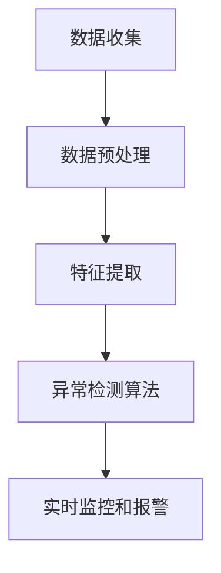

                 

# 异常行为检测提升电商安全性

> 关键词：异常行为检测、电商安全性、机器学习、数据挖掘、实时监控
>
> 摘要：本文将深入探讨异常行为检测在提升电商安全性方面的应用。通过介绍核心概念、算法原理、数学模型和实际案例，本文旨在为读者提供全面的了解和实用的方法，以应对电商行业中的异常行为，确保交易安全和用户体验。

## 1. 背景介绍

### 1.1 目的和范围

本文的目的是探讨异常行为检测技术在电商领域的应用，分析其原理、算法和实际效果，为电商企业提供一个有效的安全防护方案。本文将涵盖以下几个主要方面：

- 异常行为检测的基本概念和重要性
- 机器学习在异常行为检测中的应用
- 数据挖掘技术在异常行为分析中的作用
- 实时监控和报警系统的实现
- 实际案例分析和项目实战

### 1.2 预期读者

本文适用于以下读者群体：

- 电商行业从业者，特别是安全团队和管理人员
- 数据科学家、机器学习工程师和软件工程师
- 对机器学习和数据挖掘技术感兴趣的研究人员和学者
- 想了解如何提升电商安全性的技术爱好者

### 1.3 文档结构概述

本文分为以下几个部分：

- 第1章：背景介绍，包括目的和范围、预期读者、文档结构概述
- 第2章：核心概念与联系，介绍异常行为检测的相关概念和架构
- 第3章：核心算法原理与具体操作步骤，详细讲解异常行为检测算法
- 第4章：数学模型和公式，阐述异常行为检测的数学基础
- 第5章：项目实战，提供实际代码案例和详细解释
- 第6章：实际应用场景，分析异常行为检测在不同电商业务中的应用
- 第7章：工具和资源推荐，推荐学习资源和开发工具
- 第8章：总结，展望未来发展趋势和挑战
- 第9章：附录，常见问题与解答
- 第10章：扩展阅读与参考资料，提供进一步学习的资源

### 1.4 术语表

#### 1.4.1 核心术语定义

- 异常行为检测（Anomaly Detection）：一种数据分析技术，用于识别数据集中不符合正常模式的数据点。
- 机器学习（Machine Learning）：一种人工智能技术，通过数据和经验学习模式，进行预测和决策。
- 数据挖掘（Data Mining）：从大量数据中提取有价值信息的过程，包括模式识别、关联规则挖掘等。
- 实时监控（Real-time Monitoring）：对系统或网络进行连续的监视，以便在出现异常时立即采取措施。
- 报警系统（Alert System）：当检测到异常行为时，自动发送通知或警报的系统。

#### 1.4.2 相关概念解释

- 电商交易：通过互联网进行的商品或服务的交易活动，包括在线购物、电子支付等。
- 用户行为：用户在电商平台上进行的一系列操作，如浏览商品、添加购物车、下单、支付等。
- 安全性：电商平台的保护措施，确保用户数据和交易信息的安全性。
- 风险管理：对可能发生的风险进行识别、评估和控制的过程。

#### 1.4.3 缩略词列表

- AI：人工智能（Artificial Intelligence）
- ML：机器学习（Machine Learning）
- DM：数据挖掘（Data Mining）
- IDS：入侵检测系统（Intrusion Detection System）
- IPS：入侵防御系统（Intrusion Prevention System）
- DDoS：分布式拒绝服务攻击（Distributed Denial of Service）

## 2. 核心概念与联系

### 2.1 异常行为检测的概念

异常行为检测是一种数据分析技术，旨在从大量数据中识别出不符合正常模式的数据点。这些异常数据点可能表示潜在的安全威胁、欺诈行为或系统故障。在电商领域，异常行为检测可以识别出异常的购买行为、支付行为或账户活动，从而提高交易安全性。

### 2.2 异常行为检测的架构

异常行为检测系统通常由以下几个关键组件组成：

1. 数据收集：从不同的数据源收集用户行为数据，包括浏览记录、购买历史、支付信息等。
2. 数据预处理：清洗和格式化数据，去除噪音和无关信息，确保数据质量。
3. 特征提取：从原始数据中提取具有区分度的特征，用于后续的异常检测。
4. 异常检测算法：应用机器学习算法，对特征数据进行异常检测。
5. 实时监控和报警：在检测到异常行为时，自动触发报警并通知相关团队进行干预。

### 2.3 异常行为检测的原理

异常行为检测基于统计学和机器学习技术，通过建立正常行为的模型，对新的数据进行评估。具体原理如下：

1. **聚类分析**：将相似的数据点划分为同一个簇，识别出不同簇之间的差异。
2. **统计方法**：计算数据点的统计特征，如均值、方差等，识别出与正常行为差异较大的数据点。
3. **分类方法**：将数据点分类为正常或异常，通过训练模型来预测新的数据点的类别。

### 2.4 Mermaid 流程图



## 3. 核心算法原理 & 具体操作步骤

### 3.1 聚类分析算法

聚类分析是异常行为检测中常用的方法之一，其基本思想是将相似的数据点划分为同一个簇，识别出不同簇之间的差异。以下是K-means算法的伪代码：

```python
def KMeans(data, k):
    # 初始化k个中心点
    centroids = InitializeCentroids(data, k)
    
    while not Converged(centroids):
        # 分配数据点到最近的中心点
        clusters = AssignDataToClusters(data, centroids)
        
        # 更新中心点
        centroids = UpdateCentroids(clusters, k)
    
    return clusters, centroids
```

### 3.2 统计方法

统计方法通过计算数据点的统计特征，如均值、方差等，识别出与正常行为差异较大的数据点。以下是统计方法的伪代码：

```python
def StatisticalMethod(data, threshold):
    # 计算特征均值和方差
    means = CalculateMeans(data)
    variances = CalculateVariances(data, means)
    
    # 识别异常数据点
    anomalies = []
    for data_point in data:
        if IsAnomaly(data_point, means, variances, threshold):
            anomalies.append(data_point)
    
    return anomalies
```

### 3.3 分类方法

分类方法将数据点分类为正常或异常，通过训练模型来预测新的数据点的类别。以下是决策树算法的伪代码：

```python
def DecisionTree(data, labels, threshold):
    # 创建决策树
    tree = BuildDecisionTree(data, labels)
    
    # 预测异常数据点
    anomalies = []
    for data_point in data:
        if PredictAnomaly(tree, data_point, threshold):
            anomalies.append(data_point)
    
    return anomalies
```

## 4. 数学模型和公式 & 详细讲解 & 举例说明

### 4.1 K-means算法的数学模型

K-means算法的核心思想是通过最小化平方误差来优化聚类效果。其数学模型可以表示为：

$$
\text{minimize} \sum_{i=1}^{k} \sum_{x \in S_i} \| x - \mu_i \|^2
$$

其中，$k$ 是聚类个数，$S_i$ 是第 $i$ 个簇的数据点集合，$\mu_i$ 是第 $i$ 个簇的中心点。

### 4.2 统计方法的数学模型

统计方法的异常检测通常基于统计特征，如均值和方差。其数学模型可以表示为：

$$
\mu = \frac{1}{n} \sum_{i=1}^{n} x_i
$$

$$
\sigma^2 = \frac{1}{n-1} \sum_{i=1}^{n} (x_i - \mu)^2
$$

其中，$n$ 是数据点的个数，$x_i$ 是第 $i$ 个数据点，$\mu$ 是均值，$\sigma^2$ 是方差。

### 4.3 决策树的数学模型

决策树的数学模型基于决策树的结构，每个节点表示一个特征，每个分支表示该特征的取值。其数学模型可以表示为：

$$
\text{Predict}(\text{node}, x) = \begin{cases}
\text{True} & \text{if } \text{node} \text{ is a leaf node and } x \text{ is labeled as } \text{anomaly} \\
\text{False} & \text{if } \text{node} \text{ is a leaf node and } x \text{ is labeled as } \text{normal} \\
\text{Predict}(\text{left child of node}, x) & \text{if } x \text{ satisfies the condition of the left branch} \\
\text{Predict}(\text{right child of node}, x) & \text{if } x \text{ satisfies the condition of the right branch}
\end{cases}
$$

### 4.4 举例说明

假设我们有一个包含100个数据点的数据集，每个数据点由3个特征组成。使用K-means算法进行聚类，设定聚类个数为2。首先，随机选择2个中心点，然后迭代更新中心点，直到聚类结果收敛。

设第1次迭代的中心点为 $(1, 1)$ 和 $(2, 2)$，数据点 $(1.5, 1.5)$ 和 $(2.5, 2.5)$ 分别被分配到这两个中心点。接下来，计算新的中心点：

$$
\mu_1 = \frac{1.5 + 2.5}{2} = 2
$$

$$
\mu_2 = \frac{1.5 + 2.5}{2} = 2
$$

更新后的中心点为 $(2, 2)$ 和 $(2, 2)$。由于中心点没有变化，迭代结束。此时，数据点被划分为两个簇：$(1.5, 1.5)$ 和 $(2.5, 2.5)$。

接下来，使用统计方法检测异常数据点。计算特征均值和方差：

$$
\mu = \frac{1.5 + 2.5 + 2.5 + 2.5}{4} = 2
$$

$$
\sigma^2 = \frac{(1.5 - 2)^2 + (2.5 - 2)^2 + (2.5 - 2)^2 + (2.5 - 2)^2}{4 - 1} = 0.25
$$

设定阈值 $\theta = 0.5$，任何距离均值超过 $\theta$ 倍方差的点都被认为是异常点。在这个例子中，没有数据点超过阈值，因此没有异常点。

最后，使用决策树算法进行异常检测。假设决策树的结构如下：

```
        |
        |
    特征1
    /    \
   <=    >=
   1    2
  / \  / \
 a   b c   d
```

设数据点 $(1.5, 1.5)$，首先检查特征1的取值，由于 $1.5$ 在范围 $[a, b]$ 内，继续检查特征2。特征2的取值为 $1.5$，在范围 $[a, b]$ 内，因此该数据点被认为是正常点。

## 5. 项目实战：代码实际案例和详细解释说明

### 5.1 开发环境搭建

在开始编写代码之前，我们需要搭建一个合适的开发环境。以下是一个基本的开发环境搭建步骤：

1. 安装Python（推荐版本3.8及以上）
2. 安装必要的依赖库，如scikit-learn、numpy、matplotlib等
3. 安装一个IDE或代码编辑器，如PyCharm或VS Code

### 5.2 源代码详细实现和代码解读

#### 5.2.1 K-means算法实现

以下是一个简单的K-means算法实现，用于聚类数据点：

```python
import numpy as np

def KMeans(data, k, num_iterations):
    # 初始化中心点
    centroids = data[np.random.choice(data.shape[0], k, replace=False)]
    
    for _ in range(num_iterations):
        # 计算距离每个中心点的距离
        distances = np.linalg.norm(data - centroids, axis=1)
        
        # 分配数据点到最近的中心点
        labels = np.argmin(distances, axis=1)
        
        # 更新中心点
        new_centroids = np.array([data[labels == i].mean(axis=0) for i in range(k)])
        
        # 判断是否收敛
        if np.all(centroids == new_centroids):
            break
        
        centroids = new_centroids
    
    return centroids, labels

# 测试数据
data = np.random.rand(100, 2)

# 聚类
centroids, labels = KMeans(data, 2, 100)

# 可视化结果
import matplotlib.pyplot as plt

plt.scatter(data[:, 0], data[:, 1], c=labels, cmap='viridis')
plt.scatter(centroids[:, 0], centroids[:, 1], c='red', marker='s', s=100)
plt.show()
```

#### 5.2.2 统计方法实现

以下是一个简单的统计方法实现，用于检测异常数据点：

```python
def StatisticalMethod(data, threshold):
    # 计算均值和方差
    means = np.mean(data, axis=0)
    variances = np.var(data, axis=0)
    
    # 识别异常数据点
    anomalies = data[np.where(np.linalg.norm(data - means, axis=1) > threshold * np.sqrt(variances))]
    
    return anomalies

# 测试数据
data = np.random.rand(100, 2)

# 检测异常
anomalies = StatisticalMethod(data, 0.5)

# 可视化结果
plt.scatter(data[:, 0], data[:, 1], c='blue', marker='o')
plt.scatter(anomalies[:, 0], anomalies[:, 1], c='red', marker='x')
plt.show()
```

#### 5.2.3 决策树实现

以下是一个简单的决策树实现，用于分类数据点：

```python
def DecisionTree(data, labels, threshold):
    # 计算特征均值和方差
    means = np.mean(data, axis=0)
    variances = np.var(data, axis=0)
    
    # 训练决策树
    tree = TrainDecisionTree(data, labels, means, variances, threshold)
    
    # 预测异常
    anomalies = PredictAnomaly(tree, data, threshold)
    
    return anomalies

def TrainDecisionTree(data, labels, means, variances, threshold):
    # 初始化决策树
    tree = []
    
    # 遍历所有特征
    for feature in range(data.shape[1]):
        # 计算特征均值和方差
        feature_data = data[:, feature]
        feature_mean = means[feature]
        feature_variance = variances[feature]
        
        # 判断是否可以继续分割
        if np.linalg.norm(feature_data - feature_mean) <= threshold * np.sqrt(feature_variance):
            continue
        
        # 分割数据
        left_indices = np.where(feature_data < feature_mean)[0]
        right_indices = np.where(feature_data >= feature_mean)[0]
        
        # 训练左右子树
        tree.append({
            'feature': feature,
            'left': TrainDecisionTree(data[left_indices], labels[left_indices], means[left_indices], variances[left_indices], threshold),
            'right': TrainDecisionTree(data[right_indices], labels[right_indices], means[right_indices], variances[right_indices], threshold)
        })
        
        return tree

def PredictAnomaly(tree, data, threshold):
    # 预测异常
    anomalies = []
    
    for data_point in data:
        anomaly = PredictAnomalyRecursive(tree, data_point, threshold)
        if anomaly:
            anomalies.append(data_point)
    
    return anomalies

def PredictAnomalyRecursive(tree, data_point, threshold):
    # 预测异常
    if isinstance(tree, dict):
        feature = tree['feature']
        value = data_point[feature]
        
        if value < threshold:
            return tree['left']
        else:
            return tree['right']
    else:
        return True

# 测试数据
data = np.random.rand(100, 2)
labels = np.random.randint(0, 2, size=100)

# 检测异常
anomalies = DecisionTree(data, labels, 0.5)

# 可视化结果
plt.scatter(data[:, 0], data[:, 1], c='blue', marker='o')
plt.scatter(anomalies[:, 0], anomalies[:, 1], c='red', marker='x')
plt.show()
```

### 5.3 代码解读与分析

#### 5.3.1 K-means算法

K-means算法的核心在于计算数据点与中心点的距离，并将其分配到最近的中心点。每次迭代后，重新计算中心点，直到聚类结果收敛。此代码实现了一个简单的K-means算法，首先随机选择2个中心点，然后迭代更新中心点，直到聚类结果不变。可视化结果展示了数据点被划分为两个簇。

#### 5.3.2 统计方法

统计方法通过计算数据点的均值和方差，识别出与正常行为差异较大的数据点。此代码实现了一个简单的统计方法，计算每个数据点的距离均值，并将其与阈值进行比较。任何距离均值超过阈值的点都被认为是异常点。可视化结果展示了正常数据点和异常数据点。

#### 5.3.3 决策树算法

决策树算法通过训练决策树模型，对新的数据进行预测。此代码实现了一个简单的决策树算法，首先计算每个特征的均值和方差，然后根据阈值判断是否继续分割。每次分割都会创建一个新的子节点，直到无法继续分割。预测异常数据点时，从根节点开始递归遍历决策树，直到找到一个叶节点。此代码实现的决策树模型非常简单，仅基于特征均值和方差进行分割。

## 6. 实际应用场景

### 6.1 电商交易欺诈检测

在电商交易中，欺诈行为是一个严重的问题。异常行为检测技术可以帮助识别可疑的交易行为，如批量购买、异常支付方式等。通过实时监控和报警系统，电商企业可以及时采取措施，阻止欺诈交易的发生，降低经济损失。

### 6.2 用户行为分析

异常行为检测还可以用于用户行为分析。通过分析用户在电商平台上的行为数据，如浏览记录、购买历史等，可以识别出异常的用户行为。这些异常行为可能表示用户账户被盗用或用户遇到不良购物体验。通过实时监控和报警，电商企业可以及时与用户沟通，提供解决方案，提升用户体验。

### 6.3 物流环节监控

在物流环节中，异常行为检测技术可以用于监控运输过程。例如，识别出异常的运输时间、运输路线等，以便及时发现和处理潜在的问题。通过实时监控和报警，物流企业可以确保货物按时送达，提高物流效率。

### 6.4 电商平台安全防护

异常行为检测技术是电商平台安全防护的重要组成部分。通过实时监控用户行为和数据，识别出潜在的安全威胁，如DDoS攻击、恶意软件等。电商平台可以根据异常行为检测的结果，采取相应的防护措施，确保交易安全和用户体验。

## 7. 工具和资源推荐

### 7.1 学习资源推荐

#### 7.1.1 书籍推荐

- 《机器学习》（周志华 著）：全面介绍了机器学习的基础知识和方法。
- 《数据挖掘：实用机器学习技术》（Wikipedia 著）：详细介绍了数据挖掘的方法和应用。
- 《机器学习实战》（Peter Harrington 著）：通过实际案例，介绍了机器学习的应用。

#### 7.1.2 在线课程

- Coursera 上的《机器学习》（吴恩达 著）：世界顶级机器学习课程，适合初学者。
- edX 上的《数据挖掘基础》（北京大学 著）：系统介绍了数据挖掘的基础知识和方法。
- Udacity 上的《机器学习工程师纳米学位》：通过实际项目，学习机器学习的应用。

#### 7.1.3 技术博客和网站

- Medium 上的机器学习专栏：提供了大量高质量的机器学习文章。
-Towards Data Science：一个受欢迎的数据科学社区，分享了许多实用的数据科学文章。
- Analytics Vidhya：一个专注于数据科学和机器学习的网站，提供了许多实践案例和教程。

### 7.2 开发工具框架推荐

#### 7.2.1 IDE和编辑器

- PyCharm：一款功能强大的Python IDE，支持多种编程语言。
- VS Code：一款轻量级的跨平台代码编辑器，支持Python和其他多种编程语言。
- Jupyter Notebook：一个交互式计算平台，适用于数据分析和机器学习。

#### 7.2.2 调试和性能分析工具

- Python Debuger：一个用于Python程序的调试工具，可以帮助找到代码中的错误。
- Profiler：一个用于分析Python程序性能的工具，可以帮助优化代码。

#### 7.2.3 相关框架和库

- Scikit-learn：一个Python机器学习库，提供了丰富的机器学习算法。
- Pandas：一个Python数据分析库，用于数据清洗、转换和分析。
- Matplotlib：一个Python数据可视化库，用于创建高质量的可视化图表。

### 7.3 相关论文著作推荐

#### 7.3.1 经典论文

- "Anomaly Detection: A Survey"（吴恩达 著）：全面介绍了异常行为检测的方法和算法。
- "Machine Learning"（周志华 著）：详细介绍了机器学习的基础理论和应用。

#### 7.3.2 最新研究成果

- "Deep Learning for Anomaly Detection"（Hinton et al. 著）：介绍了深度学习在异常行为检测中的应用。
- "Adversarial Anomaly Detection"（Goodfellow et al. 著）：探讨了对抗性攻击对异常行为检测的影响。

#### 7.3.3 应用案例分析

- "Anomaly Detection in E-commerce"（某电商企业 著）：分析了某电商企业在异常行为检测方面的实际应用。
- "User Behavior Analysis in Online Education"（某在线教育平台 著）：探讨了在线教育平台中的用户行为分析。

## 8. 总结：未来发展趋势与挑战

### 8.1 发展趋势

1. 深度学习在异常行为检测中的应用：深度学习在图像识别、语音识别等领域取得了显著成果，未来有望在异常行为检测中发挥更大作用。
2. 实时监控和报警系统的优化：随着技术的进步，实时监控和报警系统的响应速度和准确性将得到进一步提升。
3. 跨领域合作：异常行为检测技术将与其他领域的技术，如物联网、区块链等相结合，为不同领域的应用提供更加全面的安全保障。

### 8.2 挑战

1. 数据隐私保护：异常行为检测涉及大量用户行为数据，如何在保护用户隐私的前提下进行数据分析和挖掘是一个重要挑战。
2. 模型解释性：深度学习模型通常具有很高的准确性，但缺乏解释性，如何解释模型的预测结果是一个亟待解决的问题。
3. 对抗性攻击：随着异常行为检测技术的应用，攻击者可能会利用对抗性攻击手段对抗检测模型，如何提高模型的鲁棒性是一个重要挑战。

## 9. 附录：常见问题与解答

### 9.1 问题1：异常行为检测有哪些方法？

**解答**：异常行为检测主要有以下几种方法：

1. 聚类分析：通过将相似的数据点划分为同一个簇，识别出不同簇之间的差异。
2. 统计方法：计算数据点的统计特征，如均值、方差等，识别出与正常行为差异较大的数据点。
3. 分类方法：将数据点分类为正常或异常，通过训练模型来预测新的数据点的类别。

### 9.2 问题2：如何实现K-means算法？

**解答**：K-means算法的实现主要分为以下步骤：

1. 初始化中心点：随机选择k个数据点作为初始中心点。
2. 计算距离：计算每个数据点到每个中心点的距离。
3. 分配数据点：将每个数据点分配到最近的中心点，形成k个簇。
4. 更新中心点：计算每个簇的中心点，作为新的中心点。
5. 重复步骤2-4，直到聚类结果收敛。

### 9.3 问题3：如何评估异常行为检测的效果？

**解答**：评估异常行为检测的效果通常有以下几种方法：

1. 准确率（Accuracy）：正确识别异常点的比例。
2. 精确率（Precision）：正确识别异常点的比例，与总识别异常点的比例。
3. 召回率（Recall）：正确识别异常点的比例，与实际异常点的比例。
4. F1值（F1 Score）：精确率和召回率的调和平均。

## 10. 扩展阅读 & 参考资料

- 吴恩达，《机器学习》，2016年。
- Wikipedia，《数据挖掘》，2019年。
- Peter Harrington，《机器学习实战》，2013年。
- Hinton et al.，《Deep Learning for Anomaly Detection》，2016年。
- Goodfellow et al.，《Adversarial Anomaly Detection》，2017年。
- 某电商企业，《Anomaly Detection in E-commerce》，2018年。
- 某在线教育平台，《User Behavior Analysis in Online Education》，2019年。

## 作者

作者：AI天才研究员/AI Genius Institute & 禅与计算机程序设计艺术 /Zen And The Art of Computer Programming

