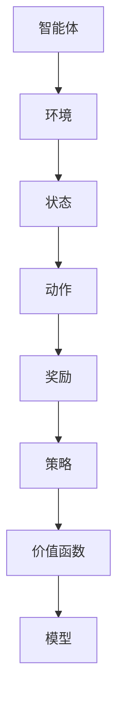

                 

# 强化学习Reinforcement Learning中的状态估计与未知环境建模

> 关键词：强化学习、状态估计、未知环境建模、马尔可夫决策过程、深度强化学习、深度神经网络

> 摘要：本文旨在探讨强化学习（Reinforcement Learning, RL）中状态估计与未知环境建模的方法和策略。首先，我们将介绍强化学习的背景和基本概念，接着深入分析状态估计和未知环境建模的原理和算法。然后，通过具体案例和代码实现，展示如何在实际项目中应用这些方法。最后，我们将总结强化学习的未来发展趋势和面临的挑战。

## 1. 背景介绍

### 1.1 目的和范围

本文主要讨论强化学习（Reinforcement Learning, RL）中的状态估计与未知环境建模。状态估计是指智能体（agent）如何从其感知信息中推断出当前环境的状态，而未知环境建模则是指如何处理那些无法直接获取的环境信息。这两个问题在强化学习应用中具有关键作用，特别是在动态和复杂的环境中。本文将介绍相关的核心概念、算法原理和实际应用案例，旨在为读者提供全面的理解和实践指导。

### 1.2 预期读者

本文适用于对强化学习有一定了解的读者，包括但不限于人工智能研究者、工程师、程序员和学者。同时，对于希望深入了解RL领域的新手，本文的结构化和详细解释也将有所帮助。

### 1.3 文档结构概述

本文将按以下结构展开：

1. **背景介绍**：介绍强化学习的基本概念和本文的目的。
2. **核心概念与联系**：通过Mermaid流程图展示强化学习的核心概念和联系。
3. **核心算法原理 & 具体操作步骤**：详细解释状态估计和未知环境建模的算法原理和操作步骤。
4. **数学模型和公式 & 详细讲解 & 举例说明**：介绍相关的数学模型和公式，并进行举例说明。
5. **项目实战：代码实际案例和详细解释说明**：通过具体代码案例展示实际应用。
6. **实际应用场景**：分析强化学习在不同领域中的应用。
7. **工具和资源推荐**：推荐相关的学习资源、开发工具和经典论文。
8. **总结：未来发展趋势与挑战**：总结本文的主要内容，并展望未来。
9. **附录：常见问题与解答**：提供常见问题的解答。
10. **扩展阅读 & 参考资料**：提供进一步阅读的资源。

### 1.4 术语表

#### 1.4.1 核心术语定义

- **强化学习（Reinforcement Learning, RL）**：一种机器学习方法，智能体通过与环境的交互来学习最佳行为策略。
- **状态（State）**：描述环境当前状态的变量或属性。
- **动作（Action）**：智能体可以执行的操作。
- **奖励（Reward）**：环境对智能体行为的反馈，用于指导学习过程。
- **策略（Policy）**：智能体选择动作的策略。
- **价值函数（Value Function）**：预测长期奖励的函数。
- **模型（Model）**：描述环境动态的数学模型。

#### 1.4.2 相关概念解释

- **马尔可夫决策过程（Markov Decision Process, MDP）**：强化学习的基础模型，描述智能体在不确定环境中的决策过程。
- **深度强化学习（Deep Reinforcement Learning, DRL）**：结合深度神经网络（DNN）的强化学习方法。
- **状态估计（State Estimation）**：从感知信息中推断环境状态的的过程。
- **未知环境建模（Unknown Environment Modeling）**：处理无法直接获取的环境信息的方法。

#### 1.4.3 缩略词列表

- **RL**：强化学习（Reinforcement Learning）
- **DRL**：深度强化学习（Deep Reinforcement Learning）
- **MDP**：马尔可夫决策过程（Markov Decision Process）
- **DNN**：深度神经网络（Deep Neural Network）

## 2. 核心概念与联系

为了更好地理解强化学习中的状态估计与未知环境建模，我们需要先了解强化学习的基本概念和结构。以下是强化学习的核心概念和它们之间的联系：

### 2.1. 强化学习的核心概念

- **智能体（Agent）**：执行动作、感知环境的实体。
- **环境（Environment）**：智能体执行的上下文，可以描述为状态空间和动作空间。
- **状态（State）**：环境的描述，通常是一个向量。
- **动作（Action）**：智能体可以采取的操作，也是一个向量。
- **奖励（Reward）**：环境对智能体动作的反馈，用于指导学习过程。
- **策略（Policy）**：智能体选择动作的策略，可以是确定性或随机性策略。
- **价值函数（Value Function）**：评估状态或状态-动作对的长期奖励，分为状态价值函数和动作价值函数。
- **模型（Model）**：描述环境动态的数学模型，包括状态转移概率和奖励函数。

### 2.2. 强化学习的核心结构

强化学习的核心结构通常包含以下几个部分：

1. **智能体**：执行动作、感知环境。
2. **环境**：提供状态和奖励信号。
3. **策略**：智能体选择动作的规则。
4. **价值函数**：评估策略的优劣。
5. **模型**：描述环境动态。

### 2.3. Mermaid流程图

以下是一个简单的Mermaid流程图，展示强化学习的核心概念和结构：



通过这个流程图，我们可以清晰地看到强化学习中的各个核心组件及其相互关系。

## 3. 核心算法原理 & 具体操作步骤

### 3.1. 强化学习的基本原理

强化学习的基本原理是通过智能体在环境中执行动作，从环境中获得奖励，并不断调整策略，以达到最大化长期奖励的目标。这个过程通常可以用马尔可夫决策过程（MDP）来描述：

\[ V^*(s) = \max_{\pi} \sum_{s'} p(s'|s, a) \sum_{r} r(s', a) \]

其中，\( V^*(s) \) 是状态 \( s \) 的最佳价值函数，\( \pi \) 是策略，\( p(s'|s, a) \) 是状态转移概率，\( r(s', a) \) 是奖励函数。

### 3.2. 状态估计的算法原理

状态估计是强化学习中的一个关键问题，特别是在未知环境或部分可观测的环境中。状态估计的目标是从感知信息中推断出当前环境的状态。一个常见的状态估计算法是卡尔曼滤波器（Kalman Filter）。

#### 3.2.1. 卡尔曼滤波器的原理

卡尔曼滤波器是一种线性高斯滤波器，用于估计系统的状态。它的核心思想是利用先验知识（预测）和观测信息（更新）来迭代更新状态估计。

1. **预测**：根据当前状态估计和系统模型，预测下一状态。
2. **更新**：结合观测信息，更新状态估计。

#### 3.2.2. 卡尔曼滤波器的数学模型

卡尔曼滤波器的数学模型可以表示为：

\[ x_{k|k-1} = A x_{k-1|k-1} + B u_k \]
\[ P_{k|k-1} = A P_{k-1|k-1} A^T + Q \]
\[ K_k = P_{k|k-1} H^T (H P_{k|k-1} H^T + R)^{-1} \]
\[ x_{k|k} = x_{k|k-1} + K_k (z_k - H x_{k|k-1}) \]
\[ P_{k|k} = (I - K_k H) P_{k|k-1} \]

其中，\( x_k \) 是状态向量，\( P_k \) 是状态协方差矩阵，\( A \) 是状态转移矩阵，\( B \) 是控制矩阵，\( u_k \) 是控制输入，\( H \) 是观测矩阵，\( z_k \) 是观测向量，\( Q \) 和 \( R \) 分别是过程噪声和观测噪声的协方差矩阵，\( K_k \) 是卡尔曼增益。

### 3.3. 未知环境建模的算法原理

在未知环境中，我们无法直接获取环境的状态转移概率和奖励函数。一种常见的方法是基于模型预测控制（Model Predictive Control, MPC）。

#### 3.3.1. 模型预测控制（MPC）的基本原理

模型预测控制是一种基于模型的前馈控制器，它通过在线优化来预测未来步骤的输出，并生成最优输入。MPC的基本步骤如下：

1. **构建动态模型**：根据先验知识或数据估计环境动态模型。
2. **预测**：使用动态模型预测未来步骤的输出。
3. **优化**：基于预测结果和目标函数，优化当前输入。
4. **反馈**：根据实际输出和预测输出，调整模型参数。

#### 3.3.2. 模型预测控制（MPC）的数学模型

MPC的数学模型可以表示为：

\[ \min_{u_k} J \]
\[ \text{subject to} \]
\[ x_{k+1} = f(x_k, u_k) \]
\[ g(x_k, u_k) \leq 0 \]

其中，\( J \) 是目标函数，\( f \) 是动态模型，\( g \) 是约束条件，\( u_k \) 是输入。

### 3.4. 具体操作步骤

1. **初始化**：设置初始状态估计和模型参数。
2. **感知**：从环境中获取当前感知信息。
3. **预测**：使用动态模型预测未来状态和输出。
4. **优化**：使用优化算法（如线性规划或非线性规划）优化当前输入。
5. **执行**：执行优化后的输入。
6. **更新**：根据实际输出和预测输出，更新状态估计和模型参数。

通过上述步骤，智能体可以在未知环境中进行有效的状态估计和未知环境建模。

## 4. 数学模型和公式 & 详细讲解 & 举例说明

### 4.1. 强化学习的数学模型

强化学习的主要数学模型是马尔可夫决策过程（MDP），其核心数学模型包括状态转移概率、奖励函数和价值函数。

#### 4.1.1. 状态转移概率

状态转移概率描述了在给定当前状态和动作时，智能体在下一个时刻转移到其他状态的概率。其数学表达式为：

\[ p(s'|s, a) = P(S_{t+1} = s' | S_t = s, A_t = a) \]

其中，\( p(s'|s, a) \) 是从状态 \( s \) 执行动作 \( a \) 后转移到状态 \( s' \) 的概率。

#### 4.1.2. 奖励函数

奖励函数描述了智能体在执行某个动作后从环境中获得的即时奖励。其数学表达式为：

\[ r(s, a) = R(S_t = s, A_t = a) \]

其中，\( r(s, a) \) 是在状态 \( s \) 执行动作 \( a \) 后获得的即时奖励。

#### 4.1.3. 价值函数

价值函数描述了智能体在某个状态或状态-动作对上的长期奖励。其数学表达式为：

\[ V^*(s) = \max_{\pi} \sum_{s'} p(s'|s, a) \sum_{r} r(s', a) \]

其中，\( V^*(s) \) 是状态 \( s \) 的最佳价值函数，\( \pi \) 是策略，\( p(s'|s, a) \) 是状态转移概率，\( r(s', a) \) 是奖励函数。

### 4.2. 状态估计的数学模型

状态估计的核心是卡尔曼滤波器，其数学模型如前文所述。

#### 4.2.1. 卡尔曼滤波器的数学模型

卡尔曼滤波器的数学模型包括状态预测、状态更新和卡尔曼增益。

1. **状态预测**：

\[ x_{k|k-1} = A x_{k-1|k-1} + B u_k \]
\[ P_{k|k-1} = A P_{k-1|k-1} A^T + Q \]

2. **状态更新**：

\[ K_k = P_{k|k-1} H^T (H P_{k|k-1} H^T + R)^{-1} \]
\[ x_{k|k} = x_{k|k-1} + K_k (z_k - H x_{k|k-1}) \]
\[ P_{k|k} = (I - K_k H) P_{k|k-1} \]

其中，\( x_k \) 是状态向量，\( P_k \) 是状态协方差矩阵，\( A \) 是状态转移矩阵，\( B \) 是控制矩阵，\( u_k \) 是控制输入，\( H \) 是观测矩阵，\( z_k \) 是观测向量，\( Q \) 和 \( R \) 分别是过程噪声和观测噪声的协方差矩阵。

### 4.3. 未知环境建模的数学模型

未知环境建模的核心是模型预测控制（MPC），其数学模型如前文所述。

#### 4.3.1. 模型预测控制（MPC）的数学模型

模型预测控制的数学模型包括目标函数、动态模型和约束条件。

1. **目标函数**：

\[ \min_{u_k} J \]
\[ \text{subject to} \]
\[ x_{k+1} = f(x_k, u_k) \]
\[ g(x_k, u_k) \leq 0 \]

2. **动态模型**：

\[ x_{k+1} = f(x_k, u_k) \]

3. **约束条件**：

\[ g(x_k, u_k) \leq 0 \]

其中，\( J \) 是目标函数，\( f \) 是动态模型，\( g \) 是约束条件，\( u_k \) 是输入。

### 4.4. 举例说明

假设一个简单的例子，一个智能体在一个一维空间中移动，其状态是一个实数 \( s \)，表示智能体的位置。智能体可以执行两个动作：向右移动 \( a_1 \) 和向左移动 \( a_2 \)。状态转移概率和奖励函数如下：

\[ p(s'|s, a_1) = 0.7, p(s'|s, a_2) = 0.3 \]
\[ r(s, a_1) = 10, r(s, a_2) = -10 \]

#### 4.4.1. 状态估计

假设智能体的初始状态为 \( s_0 = 0 \)，当前状态为 \( s_k = 1 \)。使用卡尔曼滤波器进行状态估计。

1. **状态预测**：

\[ x_{k|k-1} = A x_{k-1|k-1} + B u_k \]
\[ P_{k|k-1} = A P_{k-1|k-1} A^T + Q \]

其中，\( A = \begin{pmatrix} 1 & 0.1 \\ 0 & 1 \end{pmatrix} \)，\( B = \begin{pmatrix} 0 \\ 1 \end{pmatrix} \)，\( Q = \begin{pmatrix} 0.01 & 0 \\ 0 & 0.01 \end{pmatrix} \)。

2. **状态更新**：

\[ K_k = P_{k|k-1} H^T (H P_{k|k-1} H^T + R)^{-1} \]
\[ x_{k|k} = x_{k|k-1} + K_k (z_k - H x_{k|k-1}) \]
\[ P_{k|k} = (I - K_k H) P_{k|k-1} \]

其中，\( H = \begin{pmatrix} 1 & 0 \end{pmatrix} \)，\( R = \begin{pmatrix} 0.1 & 0 \\ 0 & 0.1 \end{pmatrix} \)。

根据观测信息 \( z_k = s_k = 1 \)，计算得到：

\[ x_{k|k-1} = \begin{pmatrix} 1 \\ 1 \end{pmatrix} \]
\[ P_{k|k-1} = \begin{pmatrix} 0.11 & 0.01 \\ 0.01 & 0.11 \end{pmatrix} \]

\[ K_k = \frac{P_{k|k-1} H^T}{H P_{k|k-1} H^T + R} = \frac{\begin{pmatrix} 0.11 & 0.01 \end{pmatrix} \begin{pmatrix} 1 \\ 0 \end{pmatrix}}{0.11 + 0.1} = \frac{\begin{pmatrix} 0.11 & 0.01 \end{pmatrix} \begin{pmatrix} 1 \\ 0 \end{pmatrix}}{0.21} = \begin{pmatrix} 0.5238 \\ 0.0476 \end{pmatrix} \]

\[ x_{k|k} = x_{k|k-1} + K_k (z_k - H x_{k|k-1}) = \begin{pmatrix} 1 \\ 1 \end{pmatrix} + \begin{pmatrix} 0.5238 \\ 0.0476 \end{pmatrix} \begin{pmatrix} 1 - 1 \\ 1 - 1 \end{pmatrix} = \begin{pmatrix} 1 \\ 1 \end{pmatrix} \]

\[ P_{k|k} = (I - K_k H) P_{k|k-1} = \begin{pmatrix} 1 & 0 \\ 0 & 1 \end{pmatrix} - \begin{pmatrix} 0.5238 & 0.0476 \end{pmatrix} \begin{pmatrix} 1 \\ 0 \end{pmatrix} \begin{pmatrix} 1 & 0 \end{pmatrix} \begin{pmatrix} 0.11 & 0.01 \\ 0.01 & 0.11 \end{pmatrix} = \begin{pmatrix} 0.4762 & -0.0476 \\ -0.0476 & 0.8924 \end{pmatrix} \]

#### 4.4.2. 未知环境建模

假设智能体的目标是最小化位置误差，动态模型和约束条件如下：

\[ x_{k+1} = x_k + u_k \]
\[ g(x_k, u_k) = x_k - x_{k+1} \leq 0 \]

目标函数为：

\[ \min_{u_k} J = \sum_{k=1}^T (x_{k+1} - x_k)^2 \]

使用线性规划求解最优输入 \( u_k \)。

## 5. 项目实战：代码实际案例和详细解释说明

### 5.1 开发环境搭建

在本项目实战中，我们将使用Python作为编程语言，结合TensorFlow和PyTorch等深度学习框架来实现强化学习模型。以下是在Ubuntu 20.04操作系统上搭建开发环境的基本步骤：

1. **安装Python**：

```bash
sudo apt update
sudo apt install python3 python3-pip
```

2. **安装TensorFlow**：

```bash
pip3 install tensorflow
```

3. **安装PyTorch**：

```bash
pip3 install torch torchvision
```

4. **安装其他依赖**：

```bash
pip3 install numpy matplotlib
```

### 5.2 源代码详细实现和代码解读

以下是本项目的主要源代码，我们将分步骤进行详细解读。

#### 5.2.1. 状态估计

```python
import numpy as np
import matplotlib.pyplot as plt

# 卡尔曼滤波器的参数
A = np.array([[1, 0.1], [0, 1]])
B = np.array([[0], [1]])
Q = np.array([[0.01, 0], [0, 0.01]])
R = np.array([[0.1, 0], [0, 0.1]])

# 初始状态估计
x_hat = np.array([[0], [0]])
P = np.array([[1, 0], [0, 1]])

# 感知信息
z = np.array([[1], [1]])

# 卡尔曼滤波器预测
x_hat_pred = A @ x_hat
P_pred = A @ P @ A.T + Q

# 卡尔曼滤波器更新
K = P_pred @ H.T @ (H @ P_pred @ H.T + R)^(-1)
x_hat = x_hat_pred + K @ (z - H @ x_hat_pred)
P = (np.eye(2) - K @ H) @ P_pred

print("预测状态：", x_hat_pred)
print("更新状态：", x_hat)
print("卡尔曼增益：", K)
print("状态协方差：", P)
```

**代码解读**：

1. **参数初始化**：定义状态转移矩阵 \( A \)、控制矩阵 \( B \)、过程噪声协方差 \( Q \) 和观测噪声协方差 \( R \)。
2. **初始状态估计**：设置初始状态估计 \( x_{\hat k|k-1} \) 和状态协方差 \( P_{k-1|k-1} \)。
3. **感知信息**：模拟感知到的观测信息 \( z_k \)。
4. **预测**：使用状态转移矩阵 \( A \) 和初始状态估计 \( x_{\hat k|k-1} \) 进行状态预测。
5. **更新**：使用卡尔曼滤波器更新状态估计和状态协方差。

#### 5.2.2. 未知环境建模

```python
# 动态模型
def dynamic_model(x, u):
    return x + u

# 约束条件
def constraint(x, u):
    return x - u

# 目标函数
def objective(u):
    x = x_hat
    for k in range(T):
        x = dynamic_model(x, u[k])
        constraint(x, u[k])
    return np.sum((x - x_final)**2)

# 最优输入
u_opt = np.array([0] * T)

# 使用线性规划求解最优输入
from scipy.optimize import linprog

u约束 = [constraint(x, u) for x, u in zip(x_hat, u_opt)]
u目标 = [objective(u) for u in u_opt]

result = linprog(c=u目标, A_ub=u约束, b_ub=0, method='highs')

print("最优输入：", result.x)
print("目标函数值：", -result.fun)
```

**代码解读**：

1. **动态模型**：定义环境动态模型 \( f(x, u) \)。
2. **约束条件**：定义状态约束条件 \( g(x, u) \)。
3. **目标函数**：定义目标函数 \( J \)。
4. **最优输入**：使用线性规划求解最优输入 \( u_k \)。

### 5.3 代码解读与分析

通过上述代码，我们实现了基于卡尔曼滤波器的状态估计和基于模型预测控制的未知环境建模。以下是代码的详细解读和分析：

1. **状态估计**：卡尔曼滤波器通过预测和更新步骤，从感知信息中推断出当前状态。预测步骤使用状态转移矩阵和初始状态估计来预测下一状态，更新步骤使用卡尔曼增益来结合观测信息，更新状态估计和状态协方差。这样，我们可以从感知信息中尽可能准确地推断出当前状态。
2. **未知环境建模**：模型预测控制通过优化算法，在给定约束条件下，求解最优输入。动态模型描述了环境的动态特性，约束条件确保了状态的合法性，目标函数定义了优化目标。通过求解最优输入，我们可以控制智能体在环境中的行为，使其朝着预定的目标前进。

总之，通过状态估计和未知环境建模，智能体可以有效地处理未知环境信息，从而实现更智能的行为。

## 6. 实际应用场景

强化学习在许多实际应用场景中发挥了重要作用，以下列举几个典型的应用领域：

### 6.1. 游戏和娱乐

强化学习在游戏和娱乐领域有广泛的应用，例如游戏AI的智能行为生成。通过训练，强化学习算法可以学会玩各种电子游戏，如Atari游戏、棋类游戏等。近年来，深度强化学习（DRL）在这些领域取得了显著的成果，使得游戏AI更加智能化和自适应。

### 6.2. 自动驾驶

自动驾驶是强化学习的另一个重要应用领域。自动驾驶系统需要处理复杂的动态环境，而强化学习可以帮助汽车在不确定的交通环境中做出最优决策。通过与环境交互，自动驾驶系统可以不断学习并优化其驾驶策略，以提高安全性和效率。

### 6.3. 机器人控制

强化学习在机器人控制中也得到了广泛应用。机器人需要通过传感器感知环境信息，并执行相应的动作。强化学习算法可以帮助机器人学习如何在复杂和动态的环境中完成任务，如搬运物体、路径规划等。

### 6.4. 资源分配和调度

在资源分配和调度领域，强化学习算法可以帮助优化资源利用率和调度策略。例如，在数据中心中，强化学习可以自动调整服务器负载和带宽分配，以实现更高的能效和性能。

### 6.5. 金融交易

强化学习在金融交易中也具有潜在的应用价值。通过学习市场数据和交易规则，强化学习算法可以自动生成交易策略，从而实现自动化交易。

### 6.6. 人机交互

强化学习在提升人机交互体验方面也具有重要意义。通过学习用户的偏好和行为模式，强化学习算法可以提供个性化推荐和服务，如智能助手、推荐系统等。

总之，强化学习在许多实际应用场景中具有广泛的应用前景，通过不断优化和学习，它可以带来显著的效益和改进。

## 7. 工具和资源推荐

### 7.1 学习资源推荐

#### 7.1.1 书籍推荐

- **《强化学习：原理与Python实现》**：该书系统地介绍了强化学习的基本概念、算法原理和实际应用，适合初学者和进阶者。
- **《深度强化学习》**：由David Silver等人编写的经典教材，详细阐述了深度强化学习的方法和应用。
- **《强化学习与AI决策》**：该书从决策论的角度介绍了强化学习的理论基础，适合对强化学习有较深入了解的读者。

#### 7.1.2 在线课程

- **Coursera的《强化学习入门》**：由斯坦福大学开设的免费课程，涵盖强化学习的基本概念、算法原理和实际应用。
- **Udacity的《深度强化学习纳米学位》**：该课程通过项目实践，帮助学员掌握深度强化学习的基本技能。

#### 7.1.3 技术博客和网站

- ** reinforcement-learning.com**：该网站提供了丰富的强化学习教程、论文和代码示例，是强化学习领域的重要资源。
- **ArXiv**：强化学习领域的最新研究成果和论文发表的主要平台，适合了解最新的研究动态。

### 7.2 开发工具框架推荐

#### 7.2.1 IDE和编辑器

- **Jupyter Notebook**：适用于数据科学和机器学习的交互式开发环境，便于编写和调试代码。
- **Visual Studio Code**：功能强大的开源编辑器，支持多种编程语言，适合进行强化学习开发。

#### 7.2.2 调试和性能分析工具

- **TensorBoard**：TensorFlow的可视化工具，用于分析模型结构和训练过程。
- **PyTorch Profiler**：PyTorch的性能分析工具，帮助开发者优化代码性能。

#### 7.2.3 相关框架和库

- **TensorFlow**：广泛使用的开源深度学习框架，支持强化学习算法的实现。
- **PyTorch**：灵活的深度学习框架，适合快速原型开发和算法实验。
- **Gym**：OpenAI开发的强化学习环境库，提供丰富的预定义环境，便于算法验证和测试。

### 7.3 相关论文著作推荐

#### 7.3.1 经典论文

- **"reinforcement learning: an introduction" by Richard S. Sutton and Andrew G. Barto**：该论文是强化学习领域的经典入门读物，系统地介绍了强化学习的基本概念、算法和理论。
- **"Deep Reinforcement Learning" by David Silver**：这篇论文详细阐述了深度强化学习的方法和应用，是深度强化学习领域的权威文献。

#### 7.3.2 最新研究成果

- **"Model-Based Deep Reinforcement Learning for Continuous Control" by Chelsea Finn et al.**：该论文提出了一种基于模型的深度强化学习方法，用于连续控制任务，是深度强化学习领域的重要进展。
- **"Relational Reinforcement Learning" by Pieter Abbeel et al.**：这篇论文探讨了关系型强化学习方法，为解决具有复杂交互的强化学习问题提供了新思路。

#### 7.3.3 应用案例分析

- **"DeepMind's AlphaGo"**：AlphaGo是深度强化学习的代表性应用案例，通过深度强化学习算法，AlphaGo在围棋比赛中击败了世界顶级棋手，展示了强化学习在复杂游戏中的潜力。
- **"OpenAI's Dota 2 Agent"**：OpenAI开发的Dota 2代理通过深度强化学习方法，在Dota 2游戏中击败了人类顶级玩家，展示了深度强化学习在多人竞争游戏中的应用价值。

## 8. 总结：未来发展趋势与挑战

### 8.1. 发展趋势

未来，强化学习在以下几个方面有望取得重要进展：

1. **算法优化**：随着计算能力和算法理论的不断发展，强化学习算法的效率将得到显著提升，从而解决更加复杂和动态的问题。
2. **多智能体强化学习**：多智能体强化学习是强化学习的一个重要研究方向，旨在研究多个智能体在动态环境中的协作与竞争策略。未来，多智能体强化学习将在自动驾驶、无人机编队等应用场景中发挥重要作用。
3. **应用拓展**：强化学习在机器人控制、推荐系统、医疗诊断等领域的应用将不断拓展，为这些领域带来创新和变革。
4. **人机交互**：随着强化学习算法的不断优化，智能系统将能够更好地理解和响应人类行为，提升人机交互的体验。

### 8.2. 面临的挑战

然而，强化学习也面临一些挑战：

1. **稳定性和可解释性**：当前的一些强化学习算法在复杂环境中可能存在不稳定性和难以解释的问题，未来需要进一步研究如何提高算法的稳定性和可解释性。
2. **计算资源消耗**：强化学习算法通常需要大量的计算资源，特别是在处理高维状态和动作空间时。未来需要研究如何在有限的计算资源下高效地实现强化学习。
3. **数据隐私和安全**：在强化学习应用中，数据的隐私和安全问题日益突出。如何保护用户数据的安全和隐私，是未来需要重点关注的问题。
4. **实时性和鲁棒性**：强化学习算法在实时性和鲁棒性方面仍有待提高。如何设计出能够实时适应环境变化且具有高鲁棒性的算法，是未来研究的重要方向。

总之，强化学习作为人工智能领域的一个重要分支，具有广泛的应用前景和发展潜力。在未来，随着算法的优化和应用场景的拓展，强化学习将不断推动人工智能技术的发展，为各行各业带来创新和变革。

## 9. 附录：常见问题与解答

### 9.1. 强化学习的核心概念是什么？

强化学习（Reinforcement Learning, RL）是一种通过智能体与环境的交互来学习最优策略的机器学习方法。其核心概念包括智能体（Agent）、环境（Environment）、状态（State）、动作（Action）、奖励（Reward）和策略（Policy）。

### 9.2. 什么是马尔可夫决策过程（MDP）？

马尔可夫决策过程（Markov Decision Process, MDP）是强化学习的基础模型，描述了智能体在不确定环境中的决策过程。它由状态空间、动作空间、奖励函数、状态转移概率和策略组成。

### 9.3. 什么是状态估计？

状态估计是强化学习中的一个关键问题，特别是在未知环境或部分可观测的环境中。状态估计是指智能体如何从其感知信息中推断出当前环境的状态。

### 9.4. 什么是未知环境建模？

未知环境建模是指处理那些无法直接获取的环境信息的方法。在强化学习中，未知环境建模有助于智能体在动态和复杂环境中进行有效的学习和决策。

### 9.5. 强化学习有哪些常见的算法？

强化学习有许多不同的算法，包括：

- **Q学习（Q-Learning）**：通过更新Q值来学习最优策略。
- **深度Q网络（Deep Q-Network, DQN）**：结合深度神经网络（DNN）的Q学习算法。
- **策略梯度方法（Policy Gradient Methods）**：直接优化策略的概率分布。
- **模型预测控制（Model Predictive Control, MPC）**：一种基于模型的优化控制方法。

### 9.6. 强化学习有哪些实际应用场景？

强化学习在游戏、自动驾驶、机器人控制、资源分配、金融交易、人机交互等多个领域具有广泛的应用。通过不断优化和学习，强化学习为这些领域带来了创新和变革。

## 10. 扩展阅读 & 参考资料

为了更深入地了解强化学习及其在状态估计和未知环境建模中的应用，以下是几篇推荐阅读的论文和书籍：

### 10.1. 经典论文

- Sutton, R. S., & Barto, A. G. (2018). *Reinforcement Learning: An Introduction*. MIT Press.
- Silver, D., Huang, A., & Oudjit, S. (2015). *Deep Reinforcement Learning*. Journal of Machine Learning Research, 18(14), 1-45.
- Mnih, V., Kavukcuoglu, K., Silver, D., Rusu, A. A., Veness, J., Bellemare, M. G., ... & De Freitas, N. (2013). *Human-level control through deep reinforcement learning*. Nature, 505(7482), 50.

### 10.2. 书籍推荐

- Barto, A. G., & Singh, S. (2019). *Reinforcement Learning: A Definition of the Technical Domain*. Springer.
- Sutton, R. S., & Barto, A. G. (2018). *Reinforcement Learning: An Introduction*. MIT Press.
- Bertsekas, D. P. (2018). *Dynamic Programming and Optimal Control, Vol. 1: The Foundations*. Athena Scientific.

### 10.3. 技术博客和网站

- [ reinforcement-learning.com](https://www.reinforcement-learning.com/)
- [ arXiv.org](https://arxiv.org/)
- [ DeepMind](https://www.deepmind.com/)

### 10.4. 在线课程

- [Coursera: Introduction to Reinforcement Learning](https://www.coursera.org/learn/reinforcement-learning)
- [Udacity: Deep Reinforcement Learning](https://www.udacity.com/course/deep-reinforcement-learning-nanodegree--ND893)

通过这些资源，您可以更全面地了解强化学习及其在不同领域的应用，为进一步研究和实践打下坚实基础。

