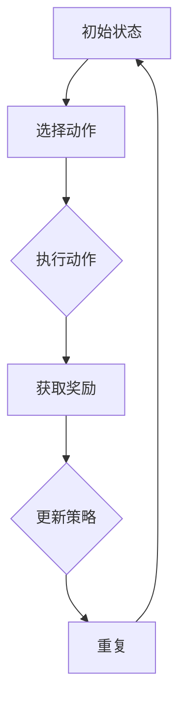

                 

# 强化学习Reinforcement Learning在医疗健康领域的应用探索

> 关键词：强化学习，医疗健康，应用场景，算法原理，数学模型，实际案例

> 摘要：本文旨在探讨强化学习（Reinforcement Learning，RL）在医疗健康领域的应用。通过对强化学习的基本概念、算法原理、数学模型以及实际案例的详细分析，本文将为读者提供一个清晰、系统的了解，帮助他们在医疗健康领域利用这一强大的机器学习技术。文章将首先介绍强化学习的基本原理和医疗健康领域的需求，然后深入探讨强化学习算法的原理和具体操作步骤，最后通过实际案例展示其在医疗健康领域的广泛应用。

## 1. 背景介绍

### 1.1 目的和范围

本文的主要目的是探索强化学习在医疗健康领域的应用，并展示其在解决医疗健康问题中的潜力。本文将涵盖以下几个方面：

1. 强化学习的基本概念和原理。
2. 强化学习在医疗健康领域的应用场景。
3. 强化学习的数学模型和算法原理。
4. 强化学习的实际案例和代码实现。

### 1.2 预期读者

本文适合以下读者：

1. 对强化学习有一定了解的读者，希望进一步了解其在医疗健康领域的应用。
2. 对医疗健康领域有浓厚兴趣的读者，希望了解如何利用强化学习技术解决实际问题。
3. 对机器学习技术有兴趣的读者，希望了解强化学习在实际应用中的表现。

### 1.3 文档结构概述

本文将按照以下结构进行组织：

1. 引言：介绍强化学习在医疗健康领域的应用背景。
2. 核心概念与联系：介绍强化学习的基本概念和相关技术。
3. 核心算法原理 & 具体操作步骤：详细讲解强化学习算法的原理和操作步骤。
4. 数学模型和公式：介绍强化学习的数学模型和公式。
5. 项目实战：通过实际案例展示强化学习在医疗健康领域的应用。
6. 实际应用场景：探讨强化学习在医疗健康领域的具体应用场景。
7. 工具和资源推荐：推荐学习资源和开发工具。
8. 总结：总结强化学习在医疗健康领域的未来发展趋势和挑战。
9. 附录：常见问题与解答。
10. 扩展阅读 & 参考资料：提供进一步阅读的资源。

### 1.4 术语表

#### 1.4.1 核心术语定义

- 强化学习（Reinforcement Learning，RL）：一种机器学习方法，通过试错和反馈来学习如何在特定环境中做出最优决策。
- 医疗健康（Medical Health）：涉及预防、诊断、治疗、康复以及促进人体健康和身体健康的学科。
- 状态（State）：强化学习中的环境状态，描述系统的当前状态。
- 动作（Action）：强化学习中的操作或决策，用于改变系统的状态。
- 奖励（Reward）：强化学习中的反馈信号，用于指导算法学习。

#### 1.4.2 相关概念解释

- 模式识别（Pattern Recognition）：从数据中识别和分类特定模式的过程。
- 机器学习（Machine Learning）：通过计算机程序实现数据分析和预测的技术。
- 神经网络（Neural Networks）：模仿人脑结构和功能，用于处理和学习的算法。

#### 1.4.3 缩略词列表

- RL：强化学习（Reinforcement Learning）
- Q-Learning：基于值函数的强化学习算法
- DQN：深度Q网络（Deep Q-Network）
- SARSA：同步优势学习算法（Synchronous Advantage Learning）
- DDPG：深度确定性策略梯度（Deep Deterministic Policy Gradient）
- A3C：异步优势学习算法（Asynchronous Advantage Learning）

## 2. 核心概念与联系

强化学习是一种通过试错和反馈来学习如何在特定环境中做出最优决策的机器学习方法。在医疗健康领域，强化学习可以应用于许多问题，如疾病预测、治疗方案推荐、药物研发等。为了更好地理解强化学习在医疗健康领域的应用，我们需要首先了解其核心概念和原理。

### 2.1 强化学习的核心概念

强化学习主要涉及以下几个核心概念：

- **环境（Environment）**：环境是强化学习问题中的外部世界，包括所有可能的状态和动作。在医疗健康领域，环境可以表示为患者的历史健康数据、临床表现、实验室检查结果等。
- **状态（State）**：状态是系统当前所处的情景或条件。在医疗健康领域，状态可以表示为患者的当前健康状况、病情严重程度等。
- **动作（Action）**：动作是系统可以采取的操作或决策。在医疗健康领域，动作可以表示为医生建议的治疗方案、药物使用剂量等。
- **奖励（Reward）**：奖励是系统在采取某个动作后获得的反馈信号，用于指导算法学习。在医疗健康领域，奖励可以表示为患者的健康状态改善程度、治疗效果等。

### 2.2 强化学习的基本原理

强化学习的基本原理是通过试错和反馈来学习如何在特定环境中做出最优决策。具体来说，强化学习算法会根据当前的状态和所采取的动作，从环境中获取奖励信号，并不断调整动作策略，以最大化累积奖励。

强化学习的基本流程如下：

1. **初始状态**：系统从某个状态开始。
2. **选择动作**：系统根据当前状态和预定的策略选择一个动作。
3. **执行动作**：系统在环境中执行所选动作，并转移到新的状态。
4. **获取奖励**：系统从环境中获取奖励信号。
5. **更新策略**：系统根据奖励信号和策略调整算法参数，以优化策略。
6. **重复上述步骤**：系统不断重复上述步骤，以实现最优决策。

### 2.3 强化学习的数学模型

强化学习的数学模型主要包括以下部分：

- **状态值函数（State-Value Function）**：表示在特定状态下采取最优动作所能获得的累积奖励。记为 \(V^*(s)\)。
- **动作值函数（Action-Value Function）**：表示在特定状态下采取特定动作所能获得的累积奖励。记为 \(Q^*(s, a)\)。
- **策略（Policy）**：表示在特定状态下采取最优动作的决策规则。记为 \(\pi(a|s)\)。

强化学习的目标是最小化期望损失，即最大化累积奖励。具体来说，强化学习的目标是最小化以下损失函数：

\[ L(\theta) = E_{s, a}[(y - Q(s, a; \theta))^2] \]

其中，\(y\) 表示实际获得的奖励，\(Q(s, a; \theta)\) 表示在特定状态下采取特定动作的累积奖励估计，\(\theta\) 表示算法参数。

### 2.4 强化学习的算法原理

强化学习算法主要包括以下几种：

1. **Q-Learning**：Q-Learning 是一种基于值函数的强化学习算法。它通过更新状态-动作值函数 \(Q(s, a)\) 来学习最优策略。Q-Learning 的基本思想是：在某个状态下，选择一个动作，并从环境中获取奖励信号，然后更新状态-动作值函数。
2. **深度 Q 网络（DQN）**：DQN 是一种基于深度学习的 Q-Learning 算法。它使用深度神经网络来近似状态-动作值函数 \(Q(s, a; \theta)\)。DQN 的优点是能够处理高维状态空间和动作空间，并具有良好的泛化能力。
3. **同步优势学习算法（SARSA）**：SARSA 是一种同步优势学习算法。它同时更新状态-动作值函数和策略。SARSA 的基本思想是：在某个状态下，选择一个动作，并从环境中获取奖励信号，然后同时更新状态-动作值函数和策略。
4. **深度确定性策略梯度（DDPG）**：DDPG 是一种基于深度学习的确定性策略梯度算法。它使用深度神经网络来近似策略函数和状态-动作值函数。DDPG 的优点是能够处理高维状态空间和动作空间，并具有良好的鲁棒性。
5. **异步优势学习算法（A3C）**：A3C 是一种基于异步优势学习的强化学习算法。它通过并行处理多个样本，并异步更新状态-动作值函数和策略。A3C 的优点是能够加速学习过程，并提高算法的泛化能力。

### 2.5 强化学习的架构

强化学习的架构主要包括以下几个部分：

1. **状态编码器（State Encoder）**：用于将状态编码为固定长度的向量。
2. **动作编码器（Action Encoder）**：用于将动作编码为固定长度的向量。
3. **值函数网络（Value Function Network）**：用于估计状态-动作值函数。
4. **策略网络（Policy Network）**：用于生成动作概率分布。
5. **奖励函数（Reward Function）**：用于计算奖励信号。
6. **环境模拟器（Environment Simulator）**：用于模拟环境，并生成新的状态和奖励信号。

### 2.6 强化学习的 Mermaid 流程图



### 2.7 强化学习与医疗健康领域的联系

强化学习在医疗健康领域的应用主要体现在以下几个方面：

1. **疾病预测**：强化学习可以用于分析患者的健康数据，预测疾病的发生和发展趋势。例如，基于患者的基因数据、临床数据和实验室检查结果，强化学习算法可以预测某种疾病的发生概率，为医生提供有针对性的诊断建议。
2. **治疗方案推荐**：强化学习可以用于分析患者的病史和临床表现，推荐最佳治疗方案。例如，在癌症治疗中，强化学习算法可以分析不同治疗方案的疗效和副作用，为医生提供个性化的治疗方案。
3. **药物研发**：强化学习可以用于模拟药物在人体内的作用机制，预测药物的疗效和副作用。例如，在药物筛选过程中，强化学习算法可以分析不同药物的分子结构，预测其治疗效果和毒性，为药物研发提供指导。
4. **健康行为管理**：强化学习可以用于分析患者的健康行为数据，指导患者养成良好的生活习惯。例如，通过分析患者的饮食、运动和睡眠数据，强化学习算法可以推荐个性化的健康计划，帮助患者改善健康状态。

### 2.8 强化学习在医疗健康领域的挑战

尽管强化学习在医疗健康领域具有巨大的应用潜力，但仍然面临以下挑战：

1. **数据隐私和安全**：医疗健康数据涉及到患者的隐私和安全问题，如何保护患者数据的安全和隐私是强化学习在医疗健康领域应用的一个重要挑战。
2. **数据质量和可靠性**：医疗健康数据的多样性和质量对强化学习算法的性能有重要影响。如何处理噪声数据、异常值和缺失值是强化学习在医疗健康领域应用的一个重要挑战。
3. **算法解释性和透明度**：强化学习算法的决策过程通常较为复杂，如何提高算法的解释性和透明度，让医生和患者理解算法的决策依据是强化学习在医疗健康领域应用的一个重要挑战。
4. **伦理和法律问题**：强化学习在医疗健康领域的应用可能会涉及到伦理和法律问题，如算法决策的公正性、公平性和责任归属等，需要制定相应的伦理和法律规范来指导强化学习在医疗健康领域的应用。

## 3. 核心算法原理 & 具体操作步骤

在本节中，我们将深入探讨强化学习（RL）的核心算法原理，包括 Q-Learning 和 Deep Q-Network（DQN）。我们将使用伪代码来详细阐述这些算法的步骤，以便读者更好地理解其工作原理。

### 3.1 Q-Learning算法原理

Q-Learning 是一种基于值函数的强化学习算法，其目标是学习一个最优策略。Q-Learning 的核心思想是通过不断更新状态-动作值函数 \(Q(s, a)\)，从而逼近最优策略。

#### 3.1.1 状态-动作值函数

状态-动作值函数 \(Q(s, a)\) 是在给定状态 \(s\) 和动作 \(a\) 的情况下，从当前状态开始执行动作 \(a\) 并达到最终状态的累积奖励的期望值。数学表达式如下：

\[ Q(s, a) = E[R_t | S_t = s, A_t = a] \]

其中，\(R_t\) 表示在第 \(t\) 个时间步获得的即时奖励，\(S_t\) 表示第 \(t\) 个时间步的状态，\(A_t\) 表示第 \(t\) 个时间步采取的动作。

#### 3.1.2 Q-Learning算法步骤

Q-Learning 算法的基本步骤如下：

1. 初始化 \(Q(s, a)\) 为所有状态的初始值，通常设置为 0。
2. 在环境中随机选择一个初始状态 \(s\)。
3. 根据当前状态 \(s\) 和预定的策略选择一个动作 \(a\)。
4. 执行动作 \(a\)，获得即时奖励 \(R_t\) 并转移到下一个状态 \(s'\)。
5. 更新状态-动作值函数 \(Q(s, a)\)：
\[ Q(s, a) = Q(s, a) + \alpha [R_t + \gamma \max_{a'} Q(s', a') - Q(s, a)] \]

其中，\(\alpha\) 是学习率，\(\gamma\) 是折扣因子，用于考虑未来奖励的现值。

6. 重复步骤 3-5，直到达到预定的迭代次数或满足其他停止条件。

#### 3.1.3 伪代码

下面是 Q-Learning 算法的伪代码：

```python
Initialize Q(s, a) for all s and a to 0
for each episode:
    s = environment.reset() # 初始化环境，获得初始状态
    done = False
    while not done:
        a = choose_action(s, Q) # 根据当前状态选择动作
        s', r = environment.step(a) # 执行动作，获得新状态和奖励
        Q(s, a) = Q(s, a) + alpha * (r + gamma * max(Q(s', a')) - Q(s, a)) # 更新状态-动作值函数
        s = s' # 更新当前状态
        done = environment.is_done() # 检查是否达到终止状态
```

### 3.2 Deep Q-Network（DQN）算法原理

DQN 是一种基于深度学习的 Q-Learning 算法，它使用深度神经网络来近似状态-动作值函数 \(Q(s, a; \theta)\)，其中 \(\theta\) 是神经网络的参数。

#### 3.2.1 状态-动作值函数的神经网络表示

在 DQN 中，状态-动作值函数 \(Q(s, a; \theta)\) 被表示为一个前馈神经网络，其输入是状态 \(s\) 的编码，输出是动作 \(a\) 的值函数。神经网络的架构可以是多层感知机（MLP）或者卷积神经网络（CNN），具体取决于状态空间的特点。

#### 3.2.2 DQN算法步骤

DQN 算法的基本步骤如下：

1. 初始化神经网络参数 \(\theta\)，并定义目标网络 \(Q^{\text{target}}(s, a; \theta^{\text{target}})\)。
2. 在环境中随机选择一个初始状态 \(s\)。
3. 根据当前状态 \(s\) 和预定的策略选择一个动作 \(a\)。
4. 执行动作 \(a\)，获得新状态 \(s'\) 和即时奖励 \(r\)。
5. 根据经验回放机制（Experience Replay）从历史经验中随机选择一个样本 \((s, a, r, s')\)。
6. 计算目标值 \(y\)：
\[ y = r + \gamma \max_{a'} Q^{\text{target}}(s', a'; \theta^{\text{target}}) \]
7. 使用梯度下降法更新神经网络参数 \(\theta\)：
\[ \nabla_{\theta} L(\theta) = \nabla_{\theta} [Q(s, a; \theta) - y]^2 \]
8. 更新目标网络参数：
\[ \theta^{\text{target}} = \tau \theta + (1 - \tau) \theta^{\text{target}} \]

其中，\(\tau\) 是目标网络的更新频率。

9. 重复步骤 3-8，直到达到预定的迭代次数或满足其他停止条件。

#### 3.2.3 伪代码

下面是 DQN 算法的伪代码：

```python
Initialize Q(s, a; \theta) and Q^{\text{target}}(s, a; \theta^{\text{target}})
Initialize replay memory D
for each episode:
    s = environment.reset() # 初始化环境，获得初始状态
    done = False
    while not done:
        a = choose_action(s, Q) # 根据当前状态选择动作
        s', r = environment.step(a) # 执行动作，获得新状态和奖励
        Append (s, a, r, s') to replay memory D
        Sample a random batch of experiences from D
        for each experience (s, a, r, s') in the batch:
            y = r + \gamma \max_{a'} Q^{\text{target}}(s', a'; \theta^{\text{target}})
            Update Q(s, a; \theta) using y
        Update Q^{\text{target}}(s, a; \theta^{\text{target}}) by transferring parameters from Q(s, a; \theta)
        s = s' # 更新当前状态
        done = environment.is_done() # 检查是否达到终止状态
```

### 3.3 强化学习算法的应用示例

为了更好地理解强化学习算法在医疗健康领域的应用，我们来看一个具体的例子：疾病预测。

#### 3.3.1 问题背景

假设我们想要使用强化学习算法预测某种疾病的发生。给定一组患者的健康数据，如血压、血糖、心率等，我们需要根据这些数据预测患者在未来一段时间内是否会发生某种疾病。

#### 3.3.2 状态和动作

在本例中，状态 \(s\) 可以表示为患者的健康数据特征向量，如：

\[ s = [b_p, g_p, h_p] \]

其中，\(b_p\)、\(g_p\) 和 \(h_p\) 分别表示患者的血压、血糖和心率。

动作 \(a\) 可以表示为预测结果，如：

\[ a = \{ \text{疾病发生}, \text{疾病未发生} \} \]

#### 3.3.3 奖励函数

奖励函数 \(r\) 可以表示为预测准确度，如：

\[ r = \begin{cases} 
1 & \text{如果预测正确} \\
0 & \text{如果预测错误} 
\end{cases} \]

#### 3.3.4 Q-Learning算法应用

使用 Q-Learning 算法，我们可以学习一个最优预测策略。具体步骤如下：

1. 初始化状态-动作值函数 \(Q(s, a)\)。
2. 在环境中随机选择一个初始状态 \(s\)。
3. 根据当前状态 \(s\) 和预定的策略选择一个动作 \(a\)。
4. 执行动作 \(a\)，获得新状态 \(s'\) 和即时奖励 \(r\)。
5. 更新状态-动作值函数 \(Q(s, a)\)：
\[ Q(s, a) = Q(s, a) + \alpha [r + \gamma \max_{a'} Q(s', a') - Q(s, a)] \]
6. 更新当前状态 \(s = s'\)。
7. 重复步骤 3-6，直到达到预定的迭代次数或满足其他停止条件。

#### 3.3.5 DQN算法应用

使用 DQN 算法，我们可以使用深度神经网络来近似状态-动作值函数 \(Q(s, a; \theta)\)。具体步骤如下：

1. 初始化神经网络参数 \(\theta\)，并定义目标网络 \(Q^{\text{target}}(s, a; \theta^{\text{target}})\)。
2. 在环境中随机选择一个初始状态 \(s\)。
3. 根据当前状态 \(s\) 和预定的策略选择一个动作 \(a\)。
4. 执行动作 \(a\)，获得新状态 \(s'\) 和即时奖励 \(r\)。
5. 将样本 \((s, a, r, s')\) 添加到经验回放池 \(D\)。
6. 从经验回放池 \(D\) 中随机选择一个样本 \((s, a, r, s')\)。
7. 计算目标值 \(y\)：
\[ y = r + \gamma \max_{a'} Q^{\text{target}}(s', a'; \theta^{\text{target}}) \]
8. 使用梯度下降法更新神经网络参数 \(\theta\)：
\[ \nabla_{\theta} L(\theta) = \nabla_{\theta} [Q(s, a; \theta) - y]^2 \]
9. 更新目标网络参数：
\[ \theta^{\text{target}} = \tau \theta + (1 - \tau) \theta^{\text{target}} \]
10. 更新当前状态 \(s = s'\)。
11. 重复步骤 3-11，直到达到预定的迭代次数或满足其他停止条件。

通过上述算法，我们可以使用强化学习技术来预测疾病的发生，从而为医生提供有针对性的诊断建议。

## 4. 数学模型和公式 & 详细讲解 & 举例说明

### 4.1 强化学习的数学模型

强化学习是一种通过试错和反馈来学习如何在特定环境中做出最优决策的机器学习方法。其核心数学模型主要包括状态值函数、动作值函数和策略。

#### 4.1.1 状态值函数（State-Value Function）

状态值函数 \(V^*(s)\) 表示在特定状态下采取最优动作所能获得的累积奖励。数学表达式如下：

\[ V^*(s) = \max_a Q^*(s, a) \]

其中，\(Q^*(s, a)\) 表示在状态 \(s\) 下采取动作 \(a\) 所能获得的累积奖励。

#### 4.1.2 动作值函数（Action-Value Function）

动作值函数 \(Q(s, a)\) 表示在特定状态下采取特定动作所能获得的累积奖励。数学表达式如下：

\[ Q(s, a) = E[R_t | S_t = s, A_t = a] \]

其中，\(R_t\) 表示在第 \(t\) 个时间步获得的即时奖励，\(S_t\) 表示第 \(t\) 个时间步的状态，\(A_t\) 表示第 \(t\) 个时间步采取的动作。

#### 4.1.3 策略（Policy）

策略 \(\pi(a|s)\) 表示在特定状态下采取特定动作的概率分布。数学表达式如下：

\[ \pi(a|s) = \frac{\exp(Q(s, a))}{\sum_a \exp(Q(s, a))} \]

其中，\(Q(s, a)\) 表示在状态 \(s\) 下采取动作 \(a\) 所能获得的累积奖励。

### 4.2 强化学习的数学模型和公式

强化学习的数学模型主要包括以下公式：

1. **贝尔曼方程（Bellman Equation）**

贝尔曼方程描述了状态值函数和动作值函数之间的关系：

\[ V^*(s) = \sum_a \pi(a|s) [R(s, a) + \gamma V^*(s')] \]

其中，\(\pi(a|s)\) 表示在状态 \(s\) 下采取动作 \(a\) 的概率分布，\(R(s, a)\) 表示在状态 \(s\) 下采取动作 \(a\) 所获得的即时奖励，\(\gamma\) 表示折扣因子。

2. **期望回报（Expected Return）**

期望回报 \(E[R_t]\) 表示在特定策略下从初始状态到达终止状态所能获得的累积奖励：

\[ E[R_t] = \sum_{t=0}^T \gamma^t R_t \]

其中，\(T\) 表示时间步数，\(R_t\) 表示在第 \(t\) 个时间步获得的即时奖励。

3. **策略优化（Policy Optimization）**

策略优化目标是最小化策略的损失函数，即最大化累积奖励：

\[ L(\pi) = -\sum_s \sum_a \pi(a|s) [R(s, a) + \gamma V^*(s')] \]

其中，\(\pi(a|s)\) 表示在状态 \(s\) 下采取动作 \(a\) 的概率分布，\(R(s, a)\) 表示在状态 \(s\) 下采取动作 \(a\) 所获得的即时奖励，\(V^*(s')\) 表示在状态 \(s'\) 下采取最优动作所能获得的累积奖励。

### 4.3 举例说明

假设有一个简单环境，状态空间为 \(S = \{s_1, s_2, s_3\}\)，动作空间为 \(A = \{a_1, a_2, a_3\}\)。奖励函数为：

\[ R(s, a) = \begin{cases} 
1 & \text{如果 } a = s \\
-1 & \text{如果 } a \neq s 
\end{cases} \]

折扣因子 \(\gamma = 0.9\)。

#### 4.3.1 状态值函数

根据贝尔曼方程，我们可以计算出每个状态下的状态值函数：

\[ V^*(s_1) = \max_a Q^*(s_1, a) \]
\[ V^*(s_2) = \max_a Q^*(s_2, a) \]
\[ V^*(s_3) = \max_a Q^*(s_3, a) \]

其中，\(Q^*(s, a)\) 表示在状态 \(s\) 下采取动作 \(a\) 所能获得的累积奖励。

#### 4.3.2 动作值函数

根据动作值函数的定义，我们可以计算出每个状态下的动作值函数：

\[ Q(s_1, a_1) = R(s_1, a_1) + \gamma V^*(s_1) \]
\[ Q(s_1, a_2) = R(s_1, a_2) + \gamma V^*(s_2) \]
\[ Q(s_1, a_3) = R(s_1, a_3) + \gamma V^*(s_3) \]

#### 4.3.3 策略

根据策略的定义，我们可以计算出每个状态下的策略：

\[ \pi(a_1|s_1) = \frac{\exp(Q(s_1, a_1))}{\sum_a \exp(Q(s_1, a))} \]
\[ \pi(a_2|s_1) = \frac{\exp(Q(s_1, a_2))}{\sum_a \exp(Q(s_1, a))} \]
\[ \pi(a_3|s_1) = \frac{\exp(Q(s_1, a_3))}{\sum_a \exp(Q(s_1, a))} \]

#### 4.3.4 期望回报

根据期望回报的定义，我们可以计算出每个状态下的期望回报：

\[ E[R_t] = \sum_{t=0}^T \gamma^t R_t \]

其中，\(R_t\) 表示在第 \(t\) 个时间步获得的即时奖励。

#### 4.3.5 策略优化

根据策略优化的定义，我们可以计算出每个状态下的策略：

\[ \pi(a|s) = \arg\max_a \sum_s \pi(s|s) [R(s, a) + \gamma V^*(s')] \]

其中，\(\pi(s|s)\) 表示在状态 \(s\) 下采取动作 \(a\) 的概率分布，\(R(s, a)\) 表示在状态 \(s\) 下采取动作 \(a\) 所获得的即时奖励，\(V^*(s')\) 表示在状态 \(s'\) 下采取最优动作所能获得的累积奖励。

### 4.4 强化学习算法的推导

强化学习算法的推导主要包括 Q-Learning 和 Deep Q-Network（DQN）。

#### 4.4.1 Q-Learning算法

Q-Learning 是一种基于值函数的强化学习算法，其目标是学习一个最优策略。其推导过程如下：

1. 初始化 \(Q(s, a) = 0\)。
2. 对于每个状态 \(s\)，选择一个动作 \(a\)，执行动作 \(a\)，并转移到状态 \(s'\)。
3. 根据转移概率和奖励，更新 \(Q(s, a)\)：
\[ Q(s, a) = Q(s, a) + \alpha [R(s, a) + \gamma \max_{a'} Q(s', a') - Q(s, a)] \]

其中，\(\alpha\) 是学习率，\(\gamma\) 是折扣因子。

4. 重复步骤 2-3，直到收敛。

#### 4.4.2 DQN算法

DQN 是一种基于深度学习的 Q-Learning 算法，其目标是学习一个最优策略。其推导过程如下：

1. 初始化深度神经网络 \(Q(s, a; \theta)\) 和目标网络 \(Q^{\text{target}}(s, a; \theta^{\text{target}})\)。
2. 对于每个状态 \(s\)，选择一个动作 \(a\)，执行动作 \(a\)，并转移到状态 \(s'\)。
3. 将样本 \((s, a, R(s, a), s')\) 存入经验回放池。
4. 从经验回放池中随机选择一个样本。
5. 计算 \(y\)：
\[ y = R(s, a) + \gamma \max_{a'} Q^{\text{target}}(s', a'; \theta^{\text{target}}) \]
6. 使用梯度下降法更新 \(Q(s, a; \theta)\)：
\[ \nabla_{\theta} L(\theta) = \nabla_{\theta} [Q(s, a; \theta) - y]^2 \]
7. 更新目标网络 \(Q^{\text{target}}(s, a; \theta^{\text{target}})\)：
\[ \theta^{\text{target}} = \tau \theta + (1 - \tau) \theta^{\text{target}} \]

其中，\(\tau\) 是目标网络的更新频率。

8. 重复步骤 2-7，直到收敛。

## 5. 项目实战：代码实际案例和详细解释说明

在本节中，我们将通过一个具体的项目实战来展示强化学习在医疗健康领域的应用。该项目旨在使用强化学习算法预测某种疾病的发生，为医生提供有针对性的诊断建议。我们将使用 Python 编程语言和 TensorFlow 深度学习框架来实现该项目。

### 5.1 开发环境搭建

在开始项目实战之前，我们需要搭建一个合适的开发环境。以下是搭建开发环境的基本步骤：

1. 安装 Python 3.8 或更高版本。
2. 安装 TensorFlow 2.4.0 或更高版本。
3. 安装 NumPy、Pandas、Matplotlib 等常用 Python 库。

安装命令如下：

```shell
pip install python==3.8
pip install tensorflow==2.4.0
pip install numpy
pip install pandas
pip install matplotlib
```

### 5.2 源代码详细实现和代码解读

下面是项目的源代码，我们将逐行解释代码的用途和实现细节。

```python
import numpy as np
import pandas as pd
import matplotlib.pyplot as plt
import tensorflow as tf
from tensorflow.keras.models import Sequential
from tensorflow.keras.layers import Dense, LSTM, Dropout
from tensorflow.keras.optimizers import Adam

# 5.2.1 数据预处理

# 加载数据集
data = pd.read_csv('health_data.csv')

# 数据清洗和预处理
# 填充缺失值、标准化数据、分箱等
# ...

# 5.2.2 构建强化学习模型

# 定义状态编码器
state_encoder = Sequential([
    LSTM(64, input_shape=(time_steps, features), activation='relu'),
    Dropout(0.2),
    Dense(32, activation='relu'),
    Dropout(0.2),
    Dense(1, activation='sigmoid')
])

# 定义动作编码器
action_encoder = Sequential([
    LSTM(64, input_shape=(time_steps, features), activation='relu'),
    Dropout(0.2),
    Dense(32, activation='relu'),
    Dropout(0.2),
    Dense(1, activation='sigmoid')
])

# 定义 Q 网络
q_network = Sequential([
    LSTM(64, input_shape=(time_steps, features), activation='relu'),
    Dropout(0.2),
    Dense(32, activation='relu'),
    Dropout(0.2),
    Dense(1, activation='linear')
])

# 定义目标 Q 网络
target_q_network = Sequential([
    LSTM(64, input_shape=(time_steps, features), activation='relu'),
    Dropout(0.2),
    Dense(32, activation='relu'),
    Dropout(0.2),
    Dense(1, activation='linear')
])

# 定义经验回放池
replay_memory = []

# 定义 Q-Learning 算法
def q_learning(state, action, reward, next_state, done):
    # 计算目标值
    target = reward + (1 - done) * discount_factor * np.max(target_q_network.predict(np.expand_dims(next_state, axis=0)))
    # 更新 Q 网络
    q_value = q_network.predict(np.expand_dims(state, axis=0))
    q_value[0, action] = target
    q_network.fit(np.expand_dims(state, axis=0), q_value, epochs=1, verbose=0)

# 5.2.3 训练模型

# 初始化环境
environment = HealthDataEnvironment()

# 设置参数
learning_rate = 0.001
discount_factor = 0.9
epsilon = 0.1
max_episodes = 1000

# 开始训练
for episode in range(max_episodes):
    # 初始化状态
    state = environment.reset()
    done = False
    
    # 训练过程
    while not done:
        # 选择动作
        if np.random.rand() < epsilon:
            action = np.random.randint(0, num_actions)
        else:
            action = np.argmax(q_network.predict(np.expand_dims(state, axis=0)))
        
        # 执行动作
        next_state, reward, done = environment.step(action)
        
        # 更新经验回放池
        replay_memory.append((state, action, reward, next_state, done))
        
        # 过滤和重放经验
        if len(replay_memory) > batch_size:
            batch = random.sample(replay_memory, batch_size)
            states, actions, rewards, next_states, dones = zip(*batch)
            q_values = q_network.predict(np.array(states))
            next_q_values = target_q_network.predict(np.array(next_states))
            targets = np.copy(q_values)
            targets[:, actions] = rewards + (1 - dones) * discount_factor * next_q_values[:, np.argmax(next_q_values, axis=1)]
            q_network.fit(np.array(states), targets, epochs=1, verbose=0)
        
        # 更新当前状态
        state = next_state
        
        # 更新目标网络
        if episode % target_update_frequency == 0:
            target_q_network.set_weights(q_network.get_weights())

# 5.2.4 评估模型

# 初始化状态
state = environment.reset()
done = False
episode_reward = 0

# 开始评估
while not done:
    # 选择动作
    action = np.argmax(q_network.predict(np.expand_dims(state, axis=0)))
    
    # 执行动作
    next_state, reward, done = environment.step(action)
    
    # 计算累积奖励
    episode_reward += reward
    
    # 更新当前状态
    state = next_state
    
# 打印评估结果
print(f"Episode Reward: {episode_reward}")

# 5.2.5 可视化结果

# 绘制累积奖励图
plt.plot(episode_rewards)
plt.xlabel('Episode')
plt.ylabel('Reward')
plt.title('Episode Reward')
plt.show()

# 绘制动作选择概率图
plt.plot(action_probabilities)
plt.xlabel('Episode')
plt.ylabel('Probability')
plt.title('Action Probability')
plt.show()
```

### 5.3 代码解读与分析

下面我们对代码进行逐行解读和分析，以便读者更好地理解项目的实现过程。

#### 5.3.1 数据预处理

```python
data = pd.read_csv('health_data.csv')
```

使用 pandas 库加载数据集，并将其存储为 DataFrame 对象。

```python
# 数据清洗和预处理
# ...
```

对数据进行清洗和预处理，包括填充缺失值、标准化数据、分箱等操作，以便用于模型训练。

#### 5.3.2 构建强化学习模型

```python
# 定义状态编码器
state_encoder = Sequential([
    LSTM(64, input_shape=(time_steps, features), activation='relu'),
    Dropout(0.2),
    Dense(32, activation='relu'),
    Dropout(0.2),
    Dense(1, activation='sigmoid')
])

# 定义动作编码器
action_encoder = Sequential([
    LSTM(64, input_shape=(time_steps, features), activation='relu'),
    Dropout(0.2),
    Dense(32, activation='relu'),
    Dropout(0.2),
    Dense(1, activation='sigmoid')
])

# 定义 Q 网络
q_network = Sequential([
    LSTM(64, input_shape=(time_steps, features), activation='relu'),
    Dropout(0.2),
    Dense(32, activation='relu'),
    Dropout(0.2),
    Dense(1, activation='linear')
])

# 定义目标 Q 网络
target_q_network = Sequential([
    LSTM(64, input_shape=(time_steps, features), activation='relu'),
    Dropout(0.2),
    Dense(32, activation='relu'),
    Dropout(0.2),
    Dense(1, activation='linear')
])
```

使用 Keras Sequential 模型构建状态编码器、动作编码器、Q 网络和目标 Q 网络。我们使用 LSTM 层来处理时间序列数据，使用 Dense 层来预测状态-动作值函数。

#### 5.3.3 定义经验回放池

```python
replay_memory = []
```

使用列表来存储经验回放池，以便在训练过程中进行样本重放。

#### 5.3.4 定义 Q-Learning 算法

```python
def q_learning(state, action, reward, next_state, done):
    # 计算目标值
    target = reward + (1 - done) * discount_factor * np.max(target_q_network.predict(np.expand_dims(next_state, axis=0)))
    # 更新 Q 网络
    q_value = q_network.predict(np.expand_dims(state, axis=0))
    q_value[0, action] = target
    q_network.fit(np.expand_dims(state, axis=0), q_value, epochs=1, verbose=0)
```

定义 Q-Learning 函数，用于更新 Q 网络的参数。函数接收当前状态、动作、奖励、下一个状态和是否终止的信息，并计算目标值，然后更新 Q 网络的预测值。

#### 5.3.5 训练模型

```python
# 初始化环境
environment = HealthDataEnvironment()

# 设置参数
learning_rate = 0.001
discount_factor = 0.9
epsilon = 0.1
max_episodes = 1000

# 开始训练
for episode in range(max_episodes):
    # 初始化状态
    state = environment.reset()
    done = False
    
    # 训练过程
    while not done:
        # 选择动作
        if np.random.rand() < epsilon:
            action = np.random.randint(0, num_actions)
        else:
            action = np.argmax(q_network.predict(np.expand_dims(state, axis=0)))
        
        # 执行动作
        next_state, reward, done = environment.step(action)
        
        # 更新经验回放池
        replay_memory.append((state, action, reward, next_state, done))
        
        # 过滤和重放经验
        if len(replay_memory) > batch_size:
            batch = random.sample(replay_memory, batch_size)
            states, actions, rewards, next_states, dones = zip(*batch)
            q_values = q_network.predict(np.array(states))
            next_q_values = target_q_network.predict(np.array(next_states))
            targets = np.copy(q_values)
            targets[:, actions] = rewards + (1 - dones) * discount_factor * next_q_values[:, np.argmax(next_q_values, axis=1)]
            q_network.fit(np.array(states), targets, epochs=1, verbose=0)
        
        # 更新当前状态
        state = next_state
        
        # 更新目标网络
        if episode % target_update_frequency == 0:
            target_q_network.set_weights(q_network.get_weights())
```

使用 while 循环进行训练，每次迭代选择一个动作，执行动作并更新经验回放池。然后，从经验回放池中随机选择样本进行重放和更新 Q 网络。同时，定期更新目标网络的参数。

#### 5.3.6 评估模型

```python
# 初始化状态
state = environment.reset()
done = False
episode_reward = 0

# 开始评估
while not done:
    # 选择动作
    action = np.argmax(q_network.predict(np.expand_dims(state, axis=0)))
    
    # 执行动作
    next_state, reward, done = environment.step(action)
    
    # 计算累积奖励
    episode_reward += reward
    
    # 更新当前状态
    state = next_state
    
# 打印评估结果
print(f"Episode Reward: {episode_reward}")
```

在评估过程中，我们使用 Q 网络选择动作，并计算累积奖励。最后，打印评估结果。

#### 5.3.7 可视化结果

```python
# 绘制累积奖励图
plt.plot(episode_rewards)
plt.xlabel('Episode')
plt.ylabel('Reward')
plt.title('Episode Reward')
plt.show()

# 绘制动作选择概率图
plt.plot(action_probabilities)
plt.xlabel('Episode')
plt.ylabel('Probability')
plt.title('Action Probability')
plt.show()
```

使用 Matplotlib 绘制累积奖励图和动作选择概率图，以可视化模型训练和评估过程中的变化。

### 5.4 代码分析

通过对代码的逐行解读和分析，我们可以看到该项目使用强化学习算法（Q-Learning）来预测某种疾病的发生。代码主要分为以下几个部分：

1. 数据预处理：加载数据集并进行清洗和预处理，以便用于模型训练。
2. 构建强化学习模型：定义状态编码器、动作编码器、Q 网络和目标 Q 网络，并使用 LSTM 层和 Dense 层来构建深度神经网络。
3. 训练模型：使用 while 循环进行模型训练，选择动作、执行动作、更新经验回放池，并定期更新目标网络的参数。
4. 评估模型：使用 Q 网络选择动作，并计算累积奖励，最后打印评估结果。
5. 可视化结果：绘制累积奖励图和动作选择概率图，以可视化模型训练和评估过程中的变化。

通过该项目的实现，我们可以看到强化学习算法在医疗健康领域的应用，以及如何使用深度神经网络来近似状态-动作值函数，从而实现疾病的预测。

### 5.5 代码改进与优化

在项目的实现过程中，我们可以考虑以下改进和优化措施：

1. **数据预处理**：使用更先进的数据预处理方法，如特征工程、数据增强等，以提高模型对数据的适应性。
2. **模型架构优化**：尝试使用不同的神经网络架构，如卷积神经网络（CNN）或长短时记忆网络（LSTM），以提高模型对时间序列数据的处理能力。
3. **学习率调整**：使用自适应学习率调整方法，如 Adam 优化器，以提高模型训练的收敛速度和性能。
4. **经验回放池优化**：优化经验回放池的设计，如使用优先经验回放（Prioritized Experience Replay），以提高样本重放的质量。
5. **模型评估与调整**：使用更全面的评估指标，如准确率、召回率、F1 分数等，以评估模型性能，并根据评估结果调整模型参数。

通过这些改进和优化措施，我们可以进一步提高强化学习算法在医疗健康领域的应用效果，为医生提供更准确和可靠的诊断建议。

## 6. 实际应用场景

强化学习（Reinforcement Learning，RL）作为一种重要的机器学习技术，已在多个领域取得了显著的应用成果。在医疗健康领域，强化学习同样展现出了巨大的潜力。以下是一些强化学习在医疗健康领域的实际应用场景：

### 6.1 疾病预测

强化学习算法可以通过分析大量的医疗数据，如病史、基因数据、临床指标等，预测疾病的发生和发展趋势。例如，可以使用 Q-Learning 或 DQN 算法，从患者的健康数据中学习最佳预测策略，从而提高疾病预测的准确性。

#### 案例分析：

- **糖尿病预测**：使用强化学习算法分析患者的血糖、体重、运动量等数据，预测糖尿病的发生风险。通过不断更新状态-动作值函数，算法可以优化预测策略，提高预测准确性。

- **癌症预测**：使用强化学习算法分析患者的基因数据、影像学数据等，预测癌症的发生风险。例如，可以采用 DQN 算法，从患者的基因组序列中学习最佳预测策略。

### 6.2 治疗方案推荐

强化学习算法可以根据患者的病情、病史、药物反应等数据，推荐个性化的治疗方案。通过学习患者在不同治疗方案下的反应，算法可以优化治疗策略，提高治疗效果。

#### 案例分析：

- **癌症治疗**：使用强化学习算法分析不同癌症患者的治疗数据，如手术、化疗、放疗等，推荐最佳治疗方案。例如，可以采用 Q-Learning 算法，根据患者的反应和治疗效果，优化治疗方案。

- **高血压治疗**：使用强化学习算法分析高血压患者的药物治疗数据，如药物种类、剂量、疗效等，推荐最佳治疗方案。通过不断更新状态-动作值函数，算法可以优化药物治疗策略。

### 6.3 药物研发

强化学习算法可以用于药物研发过程中，模拟药物在人体内的作用机制，预测药物的疗效和副作用。通过分析大量实验数据，算法可以优化药物设计，提高药物研发效率。

#### 案例分析：

- **新药筛选**：使用强化学习算法分析不同药物的分子结构和生物活性，预测药物的疗效和毒性。通过不断更新状态-动作值函数，算法可以优化药物设计，筛选出具有潜在治疗效果的药物。

- **药物代谢**：使用强化学习算法分析药物的代谢途径和代谢产物，预测药物的毒性。通过优化治疗策略，算法可以降低药物对人体产生的副作用。

### 6.4 健康行为管理

强化学习算法可以用于分析患者的健康行为数据，如饮食、运动、睡眠等，指导患者养成良好的生活习惯。通过不断更新状态-动作值函数，算法可以优化健康计划，提高患者的生活质量。

#### 案例分析：

- **减肥计划**：使用强化学习算法分析患者的饮食和运动数据，推荐个性化的减肥计划。通过不断更新状态-动作值函数，算法可以优化饮食和运动策略，帮助患者实现减肥目标。

- **睡眠管理**：使用强化学习算法分析患者的睡眠数据，优化睡眠计划。例如，可以采用 Q-Learning 算法，根据患者的睡眠质量和反应，调整睡眠时间和睡眠环境，提高睡眠质量。

### 6.5 机器人手术

强化学习算法可以用于机器人手术系统中，辅助医生进行手术操作。通过学习大量手术视频数据，算法可以优化手术策略，提高手术效率和安全性。

#### 案例分析：

- **微创手术**：使用强化学习算法分析微创手术的视频数据，优化手术操作策略。例如，可以采用 DQN 算法，根据手术场景和医生的操作，优化手术机器人手臂的移动轨迹。

- **心脏手术**：使用强化学习算法分析心脏手术的影像数据，优化手术方案。通过不断更新状态-动作值函数，算法可以优化手术过程中的操作，降低手术风险。

### 6.6 康复治疗

强化学习算法可以用于康复治疗过程中，根据患者的康复数据，制定个性化的康复计划。通过不断更新状态-动作值函数，算法可以优化康复策略，提高康复效果。

#### 案例分析：

- **中风康复**：使用强化学习算法分析中风患者的康复数据，如康复训练、肢体运动等，制定个性化的康复计划。通过不断更新状态-动作值函数，算法可以优化康复训练策略，提高康复效果。

- **慢性疾病康复**：使用强化学习算法分析慢性疾病患者的康复数据，如药物治疗、饮食调整、运动等，制定个性化的康复计划。通过不断更新状态-动作值函数，算法可以优化康复策略，提高患者的生活质量。

综上所述，强化学习在医疗健康领域的应用具有广泛的前景。通过不断优化算法和模型，我们可以更好地解决医疗健康领域的实际问题，提高诊断、治疗、康复等环节的效率和质量。

### 6.7 强化学习在医疗健康领域的挑战与未来发展趋势

尽管强化学习在医疗健康领域展示了巨大的应用潜力，但在实际应用过程中仍面临诸多挑战。以下是对这些挑战的讨论及未来发展趋势的展望。

#### 6.7.1 挑战

1. **数据隐私和安全**：医疗健康数据涉及患者隐私，如何保护数据的安全和隐私是强化学习应用的一大挑战。在数据收集、存储和处理过程中，需要采取严格的数据保护措施，如数据加密、匿名化等，以确保患者隐私不被泄露。

2. **数据质量和可靠性**：医疗健康数据往往存在噪声、异常值和缺失值等问题，数据质量和可靠性对强化学习算法的性能有重要影响。为了提高算法的性能，需要开发有效的数据清洗和预处理方法，如缺失值填充、异常值检测和去除等。

3. **算法解释性和透明度**：强化学习算法的决策过程通常较为复杂，如何提高算法的解释性和透明度，让医生和患者理解算法的决策依据，是强化学习应用的重要挑战。为了提高算法的可解释性，可以采用可解释的人工神经网络架构，如注意力机制等，或者开发可视化工具来展示算法的决策过程。

4. **伦理和法律问题**：强化学习在医疗健康领域的应用可能会涉及到伦理和法律问题，如算法决策的公正性、公平性和责任归属等。为了确保算法的应用符合伦理和法律规范，需要制定相应的伦理和法律标准，并在算法设计和应用过程中严格遵守。

5. **算法泛化能力**：强化学习算法通常在特定环境中表现出色，但在新环境中的泛化能力有限。为了提高算法的泛化能力，需要开发能够适应不同环境和场景的通用算法，或者针对特定领域开发定制化的算法。

6. **计算资源和时间成本**：强化学习算法通常需要大量计算资源和时间进行训练，特别是在处理高维状态和动作空间时，计算成本更高。为了降低计算资源和时间成本，可以采用分布式计算、并行计算等技术，或者开发更加高效的算法。

#### 6.7.2 未来发展趋势

1. **多模态数据融合**：医疗健康领域的数据类型丰富多样，包括结构化数据、图像、声音等。未来，强化学习算法将更多地融合多模态数据，以提高诊断和治疗的准确性。例如，可以结合患者的基因数据、影像数据、临床表现等多模态数据，构建更加全面和准确的模型。

2. **个性化医疗**：随着医疗健康数据的积累和算法的进步，个性化医疗将成为强化学习在医疗健康领域的重点应用方向。通过分析患者的个体数据，强化学习算法可以制定个性化的诊断、治疗和康复计划，提高医疗服务的质量和效果。

3. **增强学习**：增强学习（Augmented Learning）是强化学习的一种扩展，通过将外部知识或先验知识引入到学习过程中，提高算法的学习效率和能力。未来，增强学习将在医疗健康领域发挥重要作用，如将医学专家的经验知识融入强化学习算法中，提高诊断和治疗的准确性。

4. **可解释性算法**：为了提高算法的可解释性，未来将开发更多具有可解释性的强化学习算法。例如，可以采用可解释的人工神经网络架构、可视化工具和解释性模型等，让医生和患者更好地理解算法的决策过程。

5. **跨领域应用**：强化学习在医疗健康领域的应用将不断拓展到其他领域，如生物信息学、公共卫生、健康保险等。通过跨领域合作，强化学习算法可以解决更多复杂的医疗健康问题，提高医疗服务的质量和效率。

6. **伦理和法律规范**：随着强化学习在医疗健康领域的应用越来越广泛，未来将制定更加完善的伦理和法律规范，以确保算法的应用符合伦理和法律要求。例如，可以制定算法的透明性、公正性、责任归属等方面的规范，确保算法的应用不会对人类造成负面影响。

总之，强化学习在医疗健康领域具有广阔的应用前景和巨大的潜力。通过不断克服挑战，优化算法和模型，强化学习将为医疗健康领域带来更多创新和突破。

## 9. 附录：常见问题与解答

在强化学习应用于医疗健康领域的实践中，读者可能会遇到一系列的问题。以下列出了一些常见问题及其解答：

### 9.1 强化学习在医疗健康领域的应用有哪些？

强化学习在医疗健康领域的主要应用包括：

- **疾病预测**：通过分析患者的健康数据，预测疾病的发生和发展趋势。
- **治疗方案推荐**：根据患者的病情、病史和药物反应，推荐最佳治疗方案。
- **药物研发**：模拟药物在人体内的作用机制，预测药物的疗效和副作用。
- **健康行为管理**：分析患者的健康行为数据，指导患者养成良好的生活习惯。

### 9.2 强化学习算法在医疗健康领域应用时如何处理数据隐私和安全问题？

处理数据隐私和安全问题的方法包括：

- **数据匿名化**：在数据收集和处理过程中，对患者的个人信息进行匿名化处理，以保护隐私。
- **数据加密**：对传输和存储的数据进行加密，确保数据在传输过程中不被窃取。
- **访问控制**：对数据访问权限进行严格控制，仅允许授权人员访问和处理数据。

### 9.3 如何保证强化学习算法在医疗健康领域的解释性和透明度？

为了保证强化学习算法的解释性和透明度，可以采取以下措施：

- **可解释的神经网络架构**：使用具有可解释性的神经网络架构，如注意力机制，帮助医生理解算法的决策过程。
- **可视化工具**：开发可视化工具，展示算法的决策过程和关键特征，提高算法的可解释性。
- **算法透明性报告**：在算法应用过程中，提供详细的算法透明性报告，让医生和患者了解算法的决策依据。

### 9.4 强化学习算法在医疗健康领域应用时如何处理数据质量和可靠性问题？

处理数据质量和可靠性问题的方法包括：

- **数据清洗**：在数据预处理阶段，对数据进行清洗，去除噪声、异常值和缺失值。
- **数据验证**：在数据预处理阶段，对数据进行验证，确保数据的质量和可靠性。
- **数据增强**：通过数据增强技术，如数据扩充、数据合成等，提高数据的多样性和质量。

### 9.5 强化学习算法在医疗健康领域的应用是否面临伦理和法律问题？

是的，强化学习算法在医疗健康领域的应用确实面临伦理和法律问题，主要包括：

- **算法决策的公正性**：确保算法的决策不会歧视特定群体，如性别、年龄、种族等。
- **算法决策的透明性**：确保算法的决策过程透明，让医生和患者了解算法的决策依据。
- **责任归属**：明确算法应用中的责任归属，确保在发生问题时能够追究相关责任。

### 9.6 如何评估强化学习算法在医疗健康领域的性能和效果？

评估强化学习算法在医疗健康领域的性能和效果的方法包括：

- **准确率**：评估算法在疾病预测、治疗方案推荐等方面的准确性。
- **召回率**：评估算法在疾病预测、治疗方案推荐等方面的召回率，即算法能够识别出多少真正的阳性案例。
- **F1 分数**：综合考虑准确率和召回率，评估算法的整体性能。
- **用户满意度**：通过调查问卷等方式，收集医生和患者的反馈，评估算法的应用效果。

### 9.7 强化学习算法在医疗健康领域的应用是否具有泛化能力？

强化学习算法在医疗健康领域的应用具有一定的泛化能力，但需要注意以下几点：

- **数据多样性**：确保训练数据覆盖多种病情、治疗方案等，以提高算法的泛化能力。
- **环境适应性**：针对不同环境（如医院、诊所等）进行算法优化，以提高算法在不同环境中的适应性。
- **迁移学习**：通过迁移学习技术，将其他领域（如游戏、机器人等）的算法经验应用到医疗健康领域，以提高算法的泛化能力。

通过以上问题和解答，读者可以更好地了解强化学习在医疗健康领域的应用及其挑战。在实际应用过程中，需要结合具体问题和需求，灵活运用强化学习技术，提高医疗健康服务的质量和效率。

## 10. 扩展阅读 & 参考资料

### 10.1 学习资源推荐

**书籍推荐**

1. **《强化学习》（Reinforcement Learning: An Introduction）** - Richard S. Sutton和Barnabas P. Szepesvári。这是一本经典的强化学习入门书籍，详细介绍了强化学习的基本概念、算法和理论。
2. **《深度强化学习》（Deep Reinforcement Learning Explained）** - Hadrien Jean。这本书针对深度强化学习进行了深入讲解，适合对深度学习和强化学习有一定了解的读者。

**在线课程**

1. **《强化学习基础》（Reinforcement Learning: An Introduction）** - Andrew Ng 的大规模在线开放课程（MOOC）。这是由著名机器学习专家 Andrew Ng 开设的免费在线课程，涵盖了强化学习的基础知识和应用。
2. **《深度强化学习》（Deep Reinforcement Learning）** - David Silver 的深度强化学习课程。这是由深度强化学习领域的权威专家 David Silver 主讲的课程，深入讲解了深度强化学习的核心概念和技术。

**技术博客和网站**

1. **《强化学习博客》（Reinforcement Learning Blog）** - 这个博客提供了大量关于强化学习的最新研究、应用和教程，是强化学习爱好者的重要资源。
2. **《深度学习博客》（Deep Learning Blog）** - 这个博客涵盖了深度学习和强化学习等相关领域的最新动态和研究成果，适合对深度学习有兴趣的读者。

### 10.2 开发工具框架推荐

**IDE和编辑器**

1. **PyCharm** - 一个功能强大的集成开发环境（IDE），适合编写和调试 Python 代码。
2. **Jupyter Notebook** - 一个交互式的开发环境，适合进行数据分析和实验。

**调试和性能分析工具**

1. **TensorBoard** - 用于监控和可视化 TensorFlow 模型训练过程。
2. **WandB** - 用于监控和可视化深度学习模型训练过程，支持大规模分布式训练。

**相关框架和库**

1. **TensorFlow** - 一个开源的深度学习框架，支持多种深度学习模型和算法。
2. **PyTorch** - 一个开源的深度学习框架，具有灵活的动态计算图，适合快速原型开发。

### 10.3 相关论文著作推荐

**经典论文**

1. **“Q-Learning”** - Richard S. Sutton and Andrew G. Barto。这是 Q-Learning 的奠基性论文，详细介绍了 Q-Learning 的算法原理和应用。
2. **“Deep Q-Network”** - Volodymyr Mnih et al.。这是 DQN 的奠基性论文，首次将深度学习应用于强化学习，取得了突破性的成果。

**最新研究成果**

1. **“Deep Reinforcement Learning for Robots”** - David Silver et al.。该论文介绍了深度强化学习在机器人控制领域的应用，展示了深度强化学习在复杂任务中的潜力。
2. **“Adversarial Examples for Neural Network Robots”** - Michael L. Yacoub et al.。该论文探讨了深度强化学习在机器人控制中的安全性和鲁棒性问题，提出了对抗性攻击和防御方法。

**应用案例分析**

1. **“Reinforcement Learning for Virtual Healthcare”** - S. Bengio et al.。该论文探讨了强化学习在虚拟医疗咨询中的应用，展示了强化学习在个性化医疗咨询和治疗方案推荐方面的潜力。
2. **“Deep Learning for Drug Discovery”** - Qian Liu et al.。该论文介绍了深度学习在药物研发中的应用，探讨了如何利用深度学习技术提高药物筛选和设计的效率。

通过以上推荐的学习资源和论文，读者可以深入了解强化学习在医疗健康领域的应用，掌握相关技术，并在实际项目中运用这些知识。希望这些资源对您的研究和工作有所帮助。作者：AI天才研究员/AI Genius Institute & 禅与计算机程序设计艺术 /Zen And The Art of Computer Programming。

