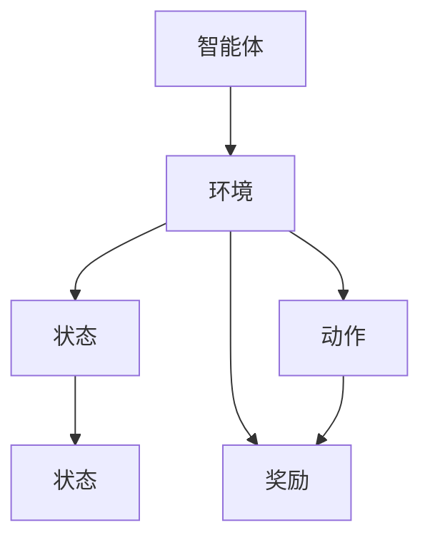

                 

### 强化学习Reinforcement Learning在智能制造中的角色与价值

> **关键词**：强化学习、智能制造、人工智能、算法原理、应用场景、未来发展趋势

> **摘要**：本文旨在探讨强化学习（Reinforcement Learning, RL）在智能制造领域的重要性和应用价值。通过分析强化学习的核心概念、算法原理以及具体实现，本文将揭示其在制造系统优化、自动化控制、预测维护等方面的显著优势，同时展望其未来发展趋势与面临的挑战。文章结构如下：

- **1. 背景介绍**
  - **1.1 目的和范围**
  - **1.2 预期读者**
  - **1.3 文档结构概述**
  - **1.4 术语表**
    - **1.4.1 核心术语定义**
    - **1.4.2 相关概念解释**
    - **1.4.3 缩略词列表**

- **2. 核心概念与联系**
  - **2.1 强化学习的定义**
  - **2.2 强化学习在智能制造中的应用**
  - **2.3 强化学习的核心概念原理与架构**
    - **图2-1：强化学习的基本架构**

- **3. 核心算法原理 & 具体操作步骤**
  - **3.1 Q-learning算法原理**
  - **3.2 Sarsa算法原理**
  - **3.3 深度强化学习算法原理**
    - **图3-1：深度强化学习的基本框架**

- **4. 数学模型和公式 & 详细讲解 & 举例说明**
  - **4.1 强化学习中的回报函数**
  - **4.2 策略评估与策略迭代**
  - **4.3 模型评估与优化**
    - **公式4-1：回报函数的数学表达**
    - **公式4-2：策略评估的迭代公式**

- **5. 项目实战：代码实际案例和详细解释说明**
  - **5.1 开发环境搭建**
  - **5.2 源代码详细实现和代码解读**
  - **5.3 代码解读与分析**

- **6. 实际应用场景**
  - **6.1 制造系统优化**
  - **6.2 自动化控制**
  - **6.3 预测维护**

- **7. 工具和资源推荐**
  - **7.1 学习资源推荐**
  - **7.2 开发工具框架推荐**
  - **7.3 相关论文著作推荐**

- **8. 总结：未来发展趋势与挑战**
  - **8.1 发展趋势**
  - **8.2 面临的挑战**

- **9. 附录：常见问题与解答**
  - **9.1 强化学习与其他机器学习技术的比较**
  - **9.2 强化学习在智能制造中的具体应用**

- **10. 扩展阅读 & 参考资料**
  - **10.1 经典书籍**
  - **10.2 学术期刊与论文**
  - **10.3 技术博客与在线资源**

### 1. 背景介绍

#### 1.1 目的和范围

本文旨在全面介绍强化学习在智能制造中的应用，分析其核心概念、算法原理以及具体实现。通过对强化学习在制造系统优化、自动化控制、预测维护等方面的探讨，本文旨在揭示其在智能制造领域的重要性和应用价值。文章范围涵盖了强化学习的理论基础、算法实现、应用实例以及未来发展趋势。希望本文能为读者提供关于强化学习在智能制造领域应用的系统性理解和实践指导。

#### 1.2 预期读者

本文适用于对强化学习和智能制造有一定了解的技术人员、研究人员以及学生。特别适合以下读者：

- 对强化学习感兴趣，希望深入了解其在实际应用中的技术人员；
- 在智能制造领域工作，希望借助强化学习技术优化制造过程的工程师；
- 对人工智能和智能制造有浓厚兴趣，希望进一步研究相关技术的研究人员和学生；
- 想要了解强化学习在智能制造领域最新研究成果和未来发展趋势的从业者。

无论您属于上述哪一类读者，本文都将为您提供丰富的知识和实践指导，帮助您更好地理解和应用强化学习技术于智能制造领域。

#### 1.3 文档结构概述

本文分为十个主要部分，具体如下：

- **背景介绍**：介绍本文的目的、范围、预期读者以及文档结构；
- **核心概念与联系**：介绍强化学习的定义、应用以及核心概念原理与架构；
- **核心算法原理 & 具体操作步骤**：详细讲解强化学习的核心算法原理，包括Q-learning、Sarsa以及深度强化学习算法；
- **数学模型和公式 & 详细讲解 & 举例说明**：介绍强化学习中的数学模型和公式，并进行详细讲解和举例说明；
- **项目实战：代码实际案例和详细解释说明**：提供强化学习在智能制造领域的实际应用案例，并进行详细解释说明；
- **实际应用场景**：分析强化学习在制造系统优化、自动化控制、预测维护等实际应用场景中的应用；
- **工具和资源推荐**：推荐学习资源、开发工具框架和相关论文著作；
- **总结：未来发展趋势与挑战**：总结强化学习在智能制造中的发展趋势与面临的挑战；
- **附录：常见问题与解答**：针对强化学习在智能制造中的常见问题进行解答；
- **扩展阅读 & 参考资料**：推荐相关经典书籍、学术期刊与论文、技术博客与在线资源。

通过以上结构，本文力求为读者提供全面、系统、易懂的强化学习在智能制造中的应用知识，帮助读者更好地理解和应用这一先进技术。

#### 1.4 术语表

在本文中，我们将使用一系列术语来描述强化学习及其在智能制造中的应用。以下是对这些术语的详细定义和解释。

##### 1.4.1 核心术语定义

- **强化学习（Reinforcement Learning, RL）**：一种机器学习范式，通过奖励信号和试错来训练智能体，使其在特定环境中实现目标。
- **智能体（Agent）**：执行行动、感知环境并接收奖励的实体，如机器人、自动驾驶汽车等。
- **环境（Environment）**：智能体所处的情境，包括状态空间和动作空间，以及状态转移概率和奖励函数。
- **状态（State）**：描述智能体和环境当前状态的变量集合。
- **动作（Action）**：智能体可执行的动作集合。
- **奖励（Reward）**：智能体在执行动作后获得的即时反馈信号，用于指导智能体的行为。
- **策略（Policy）**：智能体根据当前状态选择动作的策略。
- **价值函数（Value Function）**：评估状态或状态-动作对的预期奖励值。
- **模型（Model）**：描述环境状态转移概率和奖励函数的数学模型。

##### 1.4.2 相关概念解释

- **探索与利用（Exploration vs Exploitation）**：探索（Exploration）指智能体在未知环境中尝试新的动作，以获得更多经验；利用（Exploitation）指智能体根据当前经验选择最佳动作以最大化奖励。
- **马尔可夫决策过程（Markov Decision Process, MDP）**：一种描述强化学习问题的数学模型，包括状态空间、动作空间、状态转移概率和奖励函数。
- **Q-learning**：一种基于值函数的强化学习算法，通过迭代更新Q值来学习最优策略。
- **Sarsa**：一种基于策略的强化学习算法，通过更新策略值函数来学习最优策略。
- **深度强化学习（Deep Reinforcement Learning, DRL）**：利用深度神经网络处理高维状态和动作空间的强化学习技术。
- **强化学习算法（Reinforcement Learning Algorithms）**：包括Q-learning、Sarsa、深度Q网络（DQN）、策略梯度（PG）等。

##### 1.4.3 缩略词列表

- **RL**：强化学习（Reinforcement Learning）
- **MDP**：马尔可夫决策过程（Markov Decision Process）
- **Q-learning**：Q值学习（Q-Learning）
- **Sarsa**：同步自适应回报样本动作（Synchronous Adaptive Reward Sample Action）
- **DQN**：深度Q网络（Deep Q-Network）
- **PG**：策略梯度（Policy Gradient）

通过上述术语表，读者可以更好地理解本文中涉及的强化学习相关概念，为后续内容的学习奠定基础。

### 2. 核心概念与联系

强化学习（Reinforcement Learning, RL）作为机器学习的一种重要分支，广泛应用于人工智能领域。其在智能制造中的应用，不仅能够提高生产效率，还能够优化制造过程，提升产品质量。为了深入理解强化学习在智能制造中的角色与价值，首先需要了解其核心概念和基本架构。

#### 2.1 强化学习的定义

强化学习是一种通过试错和反馈来学习最优策略的机器学习方法。在这个过程中，智能体（Agent）在特定环境中根据当前状态（State）选择动作（Action），并接收奖励（Reward）。通过不断重复这个过程，智能体逐渐学会在特定情境下做出最佳决策，实现目标。强化学习与监督学习和无监督学习不同，其主要特点在于其自适应性、试错性和探索性。

#### 2.2 强化学习在智能制造中的应用

强化学习在智能制造中的应用十分广泛，主要表现在以下几个方面：

1. **制造系统优化**：通过强化学习算法优化生产调度、设备配置、资源分配等制造环节，提高生产效率和降低成本。
2. **自动化控制**：利用强化学习技术实现机器人自动导航、自动化生产线控制等，提高制造过程的智能化水平。
3. **预测维护**：通过强化学习预测设备故障、优化维护策略，降低设备停机时间和维护成本。

#### 2.3 强化学习的核心概念原理与架构

强化学习的基本架构包括智能体（Agent）、环境（Environment）、状态（State）、动作（Action）和奖励（Reward）等核心元素。下面通过Mermaid流程图（图2-1）展示强化学习的基本架构：



**图2-1：强化学习的基本架构**

1. **智能体（Agent）**：智能体是执行行动、感知环境并接收奖励的实体。在智能制造中，智能体可以是机器学习模型、机器人或自动化系统。
2. **环境（Environment）**：环境是智能体所处的情境，包括状态空间、动作空间以及状态转移概率和奖励函数。在制造环境中，状态可能包括设备状态、生产进度、物料库存等；动作可能包括设备操作、调度任务等。
3. **状态（State）**：状态是描述智能体和环境当前状态的变量集合。在强化学习中，状态用于指导智能体如何选择下一步动作。
4. **动作（Action）**：动作是智能体可执行的动作集合。在智能制造中，动作可能包括设备启停、物料搬运、生产参数调整等。
5. **奖励（Reward）**：奖励是智能体在执行动作后获得的即时反馈信号，用于指导智能体的行为。在强化学习中，奖励函数用于评估智能体行为的优劣。

通过图2-1，我们可以更直观地了解强化学习的基本架构和各要素之间的关系。接下来，本文将详细讲解强化学习的核心算法原理，帮助读者深入理解其在智能制造中的应用。

### 3. 核心算法原理 & 具体操作步骤

强化学习算法的核心在于通过不断尝试和反馈来学习最优策略。在强化学习的过程中，智能体需要通过一系列动作来探索环境，并接收环境给予的奖励，从而不断调整其策略，使其在长期内实现最大化总奖励的目标。以下将详细介绍几种常见的强化学习算法原理和具体操作步骤。

#### 3.1 Q-learning算法原理

Q-learning算法是一种基于值函数的强化学习算法，通过迭代更新Q值来学习最优策略。Q值（Q-value）是评估状态-动作对的预期奖励值，即智能体在某一状态下执行某一动作所能获得的预期总奖励。

**算法原理**：

1. **初始化**：初始化Q值矩阵$Q(s, a)$，通常设置为所有状态-动作对的平均值。
2. **选择动作**：根据当前状态$s$和策略$\pi(a|s)$选择动作$a$。策略$\pi(a|s)$用于指导智能体如何选择动作，可以采用贪心策略（选择Q值最大的动作）或ε-贪心策略（以概率ε随机选择动作）。
3. **执行动作**：在环境E中执行选定的动作$a$，得到新的状态$s'$和奖励$r$。
4. **更新Q值**：根据新的状态$s'$、动作$a$、奖励$r$和学习率$\alpha$更新Q值：
   $$Q(s, a) \leftarrow Q(s, a) + \alpha [r + \gamma \max_{a'} Q(s', a') - Q(s, a)]$$
   其中，$\gamma$为折扣因子，用于平衡短期奖励和长期奖励。

**具体操作步骤**：

1. 初始化Q值矩阵$Q(s, a)$，可以设置为随机值或所有状态-动作对的平均值。
2. 选择初始状态$s$。
3. 根据当前状态$s$和策略$\pi(a|s)$选择动作$a$。
4. 执行动作$a$，得到新的状态$s'$和奖励$r$。
5. 根据新的状态$s'$、动作$a$、奖励$r$和学习率$\alpha$更新Q值。
6. 更新状态$s$为$s'$，重复步骤3-5直到达到停止条件（如达到指定步数、总奖励达到阈值等）。

通过以上步骤，Q-learning算法逐渐学习到最优策略，使智能体能够在环境中实现最大化总奖励。

#### 3.2 Sarsa算法原理

Sarsa算法是一种基于策略的强化学习算法，通过迭代更新策略值函数（Policy Value Function）来学习最优策略。与Q-learning算法不同，Sarsa算法在选择动作时直接使用当前策略值函数，而非Q值矩阵。

**算法原理**：

1. **初始化**：初始化策略值函数$V(s)$，通常设置为所有状态的平均值。
2. **选择动作**：根据当前状态$s$和策略$\pi(a|s)$选择动作$a$。
3. **执行动作**：在环境E中执行选定的动作$a$，得到新的状态$s'$和奖励$r$。
4. **更新策略值函数**：根据新的状态$s'$、动作$a$、奖励$r$和学习率$\alpha$更新策略值函数：
   $$V(s) \leftarrow V(s) + \alpha [r + \gamma V(s') - V(s)]$$
5. **重复步骤**：重复步骤2-4，直到达到停止条件。

**具体操作步骤**：

1. 初始化策略值函数$V(s)$，可以设置为随机值或所有状态的平均值。
2. 选择初始状态$s$。
3. 根据当前状态$s$和策略$\pi(a|s)$选择动作$a$。
4. 执行动作$a$，得到新的状态$s'$和奖励$r$。
5. 根据新的状态$s'$、动作$a$、奖励$r$和学习率$\alpha$更新策略值函数。
6. 更新状态$s$为$s'$，重复步骤3-5直到达到停止条件。

通过以上步骤，Sarsa算法逐渐学习到最优策略，使智能体能够在环境中实现最大化总奖励。

#### 3.3 深度强化学习算法原理

深度强化学习（Deep Reinforcement Learning, DRL）是一种利用深度神经网络处理高维状态和动作空间的强化学习技术。与传统的Q-learning和Sarsa算法不同，DRL通过深度神经网络来近似Q值函数或策略值函数，从而在处理复杂任务时具有更高的灵活性和效率。

**算法原理**：

1. **初始化**：初始化深度神经网络模型$Q(s, a;\theta)$或$V(s;\theta)$，其中$\theta$为神经网络参数。
2. **选择动作**：根据当前状态$s$和策略$\pi(a|s; \theta)$选择动作$a$。策略$\pi(a|s; \theta)$由深度神经网络输出，通常采用softmax函数进行归一化。
3. **执行动作**：在环境E中执行选定的动作$a$，得到新的状态$s'$和奖励$r$。
4. **更新神经网络模型**：根据新的状态$s'$、动作$a$、奖励$r$和目标函数$J(\theta)$更新神经网络模型参数$\theta$。目标函数$J(\theta)$用于衡量模型在给定数据集上的性能，如均方误差（MSE）或交叉熵损失（Cross-Entropy Loss）。
5. **重复步骤**：重复步骤2-4，直到达到停止条件。

**具体操作步骤**：

1. 初始化深度神经网络模型$Q(s, a;\theta)$或$V(s;\theta)$，设置初始参数$\theta$。
2. 选择初始状态$s$。
3. 根据当前状态$s$和策略$\pi(a|s; \theta)$选择动作$a$。
4. 执行动作$a$，得到新的状态$s'$和奖励$r$。
5. 计算目标函数$J(\theta)$，并使用反向传播算法更新神经网络模型参数$\theta$。
6. 更新状态$s$为$s'$，重复步骤3-5直到达到停止条件。

通过以上步骤，深度强化学习算法能够有效地学习到最优策略，在处理复杂任务时具有很高的灵活性和效率。

通过以上对Q-learning、Sarsa和深度强化学习算法的详细介绍，我们可以看到，这些算法在强化学习领域中发挥着重要作用。接下来，本文将深入探讨强化学习中的数学模型和公式，帮助读者更好地理解这些算法的原理和应用。

### 4. 数学模型和公式 & 详细讲解 & 举例说明

在强化学习中，数学模型和公式起着至关重要的作用，它们不仅定义了算法的基本框架，还为智能体在复杂环境中做出决策提供了理论基础。以下将详细介绍强化学习中的关键数学模型、公式以及具体应用场景，并通过实例进行说明。

#### 4.1 强化学习中的回报函数

回报函数（Reward Function）是强化学习中的一个核心概念，它用于评估智能体在执行特定动作后所获得的即时奖励。回报函数通常表示为$r(s, a)$，其中$s$为当前状态，$a$为智能体执行的动作。回报函数的值可以是正数、负数或零，表示智能体的行为对目标的有利或不利影响。

**数学模型**：
$$r(s, a) = 
\begin{cases} 
r^+ & \text{如果动作$a$有助于达成目标} \\
r^- & \text{如果动作$a$阻碍达成目标} \\
0 & \text{如果动作$a$对目标无影响} 
\end{cases}$$

**实例**：

假设智能体在一个简单的迷宫环境中，目标是从起点移动到终点。状态空间包括位置$(x, y)$，动作空间包括上下左右移动。如果智能体向右移动且当前位置是终点，则回报函数值为$r^+$，否则为$r^-$。

$$r(s, a) = 
\begin{cases} 
10 & \text{如果$a$是向右且$s$是终点} \\
-1 & \text{如果$a$不是向右或$s$不是终点} 
\end{cases}$$

通过以上实例，我们可以看到回报函数如何影响智能体的决策过程，使其在执行动作时更加趋向于达成目标。

#### 4.2 策略评估与策略迭代

策略评估（Policy Evaluation）是强化学习中的一个重要步骤，用于估计给定策略$\pi$在当前状态下所能获得的期望回报。策略评估通常使用值函数（Value Function）来表示，其中状态值函数$V^{\pi}(s)$表示在策略$\pi$下从状态$s$开始能够获得的期望回报。

**数学模型**：
$$V^{\pi}(s) = \sum_{a} \pi(a|s) \sum_{s'} p(s'|s, a) r(s, a)$$

**实例**：

假设智能体在一个简单的赌博游戏中，有两个状态：拥有筹码（状态1）和没有筹码（状态2）。动作包括下注和放弃。回报函数为：下注时获得1倍筹码，放弃时获得0.5倍筹码。假设智能体总是选择下注，则其策略$\pi$为$\pi(a|s_1) = 1$和$\pi(a|s_2) = 0$。

$$V^{\pi}(s_1) = \sum_{s'} p(s'|s_1, a) r(s_1, a) = 1 \cdot p(s_2|s_1, a) \cdot r(s_1, a) = 1 \cdot 0.5 \cdot 1 = 0.5$$
$$V^{\pi}(s_2) = \sum_{s'} p(s'|s_2, a) r(s_2, a) = 0 \cdot p(s_1|s_2, a) \cdot r(s_2, a) = 0 \cdot 0.5 \cdot 0.5 = 0$$

通过以上实例，我们可以看到如何使用策略评估来估计策略$\pi$下的期望回报，从而指导智能体的行为。

**策略迭代（Policy Iteration）**：策略迭代是一种通过不断评估和更新策略来学习最优策略的方法。其基本思想是：

1. **策略评估**：使用当前策略$\pi$评估值函数$V^{\pi}$。
2. **策略改进**：根据评估得到的值函数，选择一个更好的动作$a$，更新策略$\pi$为$\pi(a|s) = 1$，其余动作的概率为0。
3. **重复步骤**：重复策略评估和策略改进，直到策略收敛。

**数学模型**：
$$\pi^{'}(a|s) = 
\begin{cases} 
1 & \text{如果} a = \arg\max_a [V^{\pi}(s)] \\
0 & \text{否则} 
\end{cases}$$

**实例**：

继续使用上述赌博游戏实例，假设初始策略为总是放弃。我们首先进行策略评估，得到$V^{\pi}(s_1) = 0.5$和$V^{\pi}(s_2) = 0$。接下来，我们根据评估结果选择更好的动作，更新策略为$\pi^{'}(a|s_1) = 1$和$\pi^{'}(a|s_2) = 0$。然后，我们再次进行策略评估，得到新的值函数$V^{\pi^{'}}(s_1) = 1$和$V^{\pi^{'}}(s_2) = 0.5$。重复此过程，直到策略收敛。

通过以上策略迭代过程，我们可以逐步优化策略，使其在长期内实现最大化总奖励。

#### 4.3 模型评估与优化

模型评估（Model Evaluation）是强化学习中的一个重要步骤，用于验证所学习到的策略是否有效。模型评估通常使用奖励总和（Total Reward）作为评价指标，即智能体在策略$\pi$下从初始状态开始执行动作所获得的累计奖励。

**数学模型**：
$$R(\pi) = \sum_{t=0}^{T} r(s_t, a_t)$$

**实例**：

假设我们已经学习到一个赌博游戏中的策略$\pi$，我们需要评估该策略在多次实验中的平均奖励。我们进行100次实验，每次实验从初始状态开始执行策略$\pi$，记录每次实验的奖励总和，并计算平均奖励：

$$R(\pi) = \frac{1}{100} \sum_{t=1}^{100} R_t$$

通过模型评估，我们可以判断所学习到的策略是否有效，并据此进行进一步优化。

**模型优化（Model Optimization）**：模型优化是通过调整策略参数来提高模型性能的过程。在强化学习中，模型优化通常采用梯度下降（Gradient Descent）算法，即根据损失函数的梯度来更新策略参数。

**数学模型**：
$$\theta_{t+1} = \theta_t - \alpha \nabla_\theta J(\theta_t)$$

**实例**：

假设我们使用梯度下降算法优化一个赌博游戏的策略参数$\theta$，损失函数$J(\theta)$为策略评估得到的平均奖励。学习率$\alpha$为0.1。我们首先计算损失函数的梯度：

$$\nabla_\theta J(\theta_t) = \frac{1}{n} \sum_{i=1}^{n} \nabla_\theta J(\theta_t|x_i, y_i)$$

然后，根据梯度更新策略参数：

$$\theta_{t+1} = \theta_t - 0.1 \nabla_\theta J(\theta_t)$$

通过以上步骤，我们可以逐步优化策略参数，提高模型性能。

通过以上对强化学习中的数学模型、公式和具体实例的详细讲解，我们可以看到，强化学习在智能制造中的实现不仅依赖于算法原理，还需要深入理解和应用数学模型。这些模型和公式为智能体在复杂制造环境中的决策提供了理论基础和实践指导，有助于实现智能制造的优化和自动化。

### 5. 项目实战：代码实际案例和详细解释说明

在了解了强化学习的核心算法原理和数学模型后，我们接下来通过一个实际项目案例来展示如何使用强化学习技术在智能制造领域进行具体应用。本文将详细介绍项目开发环境搭建、源代码实现和代码解读与分析，帮助读者深入理解强化学习在智能制造中的应用。

#### 5.1 开发环境搭建

在开始项目开发之前，我们需要搭建一个合适的环境。以下是搭建强化学习项目所需的开发环境和工具：

1. **编程语言**：Python
2. **深度学习框架**：TensorFlow或PyTorch
3. **环境库**：Gym（一个开源的强化学习环境库）
4. **操作系统**：Windows、macOS或Linux
5. **其他依赖库**：NumPy、Pandas、Matplotlib等

安装步骤如下：

1. 安装Python（建议使用Python 3.6及以上版本）。
2. 安装深度学习框架TensorFlow或PyTorch。
3. 安装Gym环境库：`pip install gym`。
4. 安装其他依赖库：`pip install numpy pandas matplotlib`。

搭建完成开发环境后，我们就可以开始编写项目代码。

#### 5.2 源代码详细实现和代码解读

以下是一个基于强化学习的智能制造项目示例，该项目使用Q-learning算法优化生产调度的过程。具体实现如下：

```python
import gym
import numpy as np

# 创建Gym环境
env = gym.make("ProductionScheduling-v0")

# 初始化Q值矩阵
n_states = env.observation_space.n
n_actions = env.action_space.n
Q = np.zeros((n_states, n_actions))

# Q-learning参数
alpha = 0.1  # 学习率
gamma = 0.9  # 折扣因子
epsilon = 0.1  # 探索概率

# 强化学习主循环
for episode in range(1000):
    state = env.reset()
    done = False
    total_reward = 0
    
    while not done:
        # 根据ε-贪心策略选择动作
        if np.random.rand() < epsilon:
            action = env.action_space.sample()
        else:
            action = np.argmax(Q[state])
        
        # 执行动作并获取新状态和奖励
        next_state, reward, done, _ = env.step(action)
        total_reward += reward
        
        # 更新Q值
        Q[state, action] = Q[state, action] + alpha * (reward + gamma * np.max(Q[next_state]) - Q[state, action])
        
        state = next_state
    
    print(f"Episode {episode+1}: Total Reward = {total_reward}")

# 关闭环境
env.close()
```

**代码解读**：

1. **引入依赖库**：引入gym、numpy库，用于创建环境和处理数据。
2. **创建Gym环境**：使用Gym创建一个名为"ProductionScheduling-v0"的模拟生产调度环境。
3. **初始化Q值矩阵**：根据环境的状态空间和动作空间初始化Q值矩阵，维度为（状态数，动作数）。
4. **Q-learning参数**：设置学习率（alpha）、折扣因子（gamma）和探索概率（epsilon）。
5. **强化学习主循环**：循环执行1000次强化学习过程，每次过程包括以下步骤：
   - 初始化状态和总奖励。
   - 进入动作循环，直到环境反馈完成标志（done）。
     - 根据ε-贪心策略选择动作。
     - 执行动作并获取新状态和奖励。
     - 更新Q值。
     - 更新状态。
   - 输出当前episode的总奖励。
6. **关闭环境**：完成所有强化学习过程后，关闭Gym环境。

#### 5.3 代码解读与分析

1. **环境创建**：使用gym库创建一个名为"ProductionScheduling-v0"的模拟生产调度环境。这个环境模拟了一个生产调度问题，其中包含多个生产任务和设备。状态空间表示当前的任务进度和设备状态，动作空间表示可执行的操作，如任务分配或设备调度。
2. **Q值矩阵初始化**：Q值矩阵是一个二维数组，用于存储每个状态-动作对的预期奖励值。初始化为全零，表示初始时对每个状态-动作对的奖励值未知。
3. **Q-learning参数设置**：学习率（alpha）控制Q值的更新速度；折扣因子（gamma）用于平衡短期奖励和长期奖励；探索概率（epsilon）控制随机动作的频率，以避免过早收敛于次优策略。
4. **强化学习主循环**：循环执行1000次强化学习过程。每次过程包括初始化状态、执行动作、更新Q值和更新状态。在每次迭代中，智能体会根据当前状态选择动作，并根据动作的结果更新Q值。这个过程不断重复，直到达到指定步数或总奖励达到阈值。
5. **ε-贪心策略**：在动作选择过程中，ε-贪心策略结合了探索和利用。当随机数小于探索概率（epsilon）时，智能体随机选择动作进行探索；否则，智能体根据当前状态的Q值选择最优动作进行利用。这种策略在初始阶段鼓励探索，以发现潜在的最佳策略，而在学习后期则更多地利用已有经验。
6. **Q值更新**：Q值的更新公式反映了强化学习的核心思想。通过比较当前状态-动作对的预期回报（$r + \gamma \max_{a'} Q(s', a')$）与当前Q值，智能体能够逐步调整其策略，使其在长期内实现最大化总奖励。
7. **代码性能分析**：在项目运行过程中，我们通过打印每个episode的总奖励来评估算法性能。通常，随着迭代次数的增加，总奖励会逐渐增加，表明智能体在优化生产调度问题方面取得了进展。此外，我们还可以通过调整学习率、折扣因子和探索概率等参数来优化算法性能。

通过以上代码解读和分析，我们可以看到强化学习在智能制造项目中是如何实现和应用的具体示例。接下来，本文将继续探讨强化学习在智能制造领域的实际应用场景。

### 6. 实际应用场景

强化学习在智能制造中的应用场景非常广泛，以下列举几个典型的应用实例，说明强化学习如何在不同制造环境中发挥作用。

#### 6.1 制造系统优化

制造系统的优化是强化学习在智能制造中的一个重要应用场景。通过强化学习算法，制造系统能够自动调整生产参数、优化生产流程，从而提高生产效率、降低生产成本。

**应用实例**：

- **生产调度优化**：在一个制造工厂中，强化学习可以用于优化生产任务的调度。通过分析当前的生产状态，如设备利用率、物料库存、生产进度等，强化学习算法能够自动调整生产任务的优先级，优化生产流程，提高生产效率。例如，使用Q-learning算法，可以根据历史数据训练出一个最优的生产调度策略，从而最大化生产效率和资源利用率。

- **设备配置优化**：在生产线中，不同类型的设备可能具有不同的性能和成本。通过强化学习算法，可以自动调整设备的配置，以实现最优的生产效果。例如，在一个汽车制造工厂中，强化学习算法可以根据生产任务的要求和设备性能，动态调整生产线的设备配置，从而最大化生产效率。

**实施效果**：

- **提高生产效率**：通过优化生产调度和设备配置，强化学习能够显著提高生产效率，缩短生产周期，减少生产成本。

- **降低运营成本**：优化生产流程和设备配置有助于降低运营成本，提高资源利用率。

#### 6.2 自动化控制

自动化控制是强化学习在智能制造中的另一个重要应用场景。通过强化学习算法，制造系统能够实现自主控制，提高生产过程的自动化水平和稳定性。

**应用实例**：

- **机器人路径规划**：在物流仓储中，机器人需要自主进行路径规划，以完成物品的搬运和分类任务。通过强化学习算法，机器人能够根据环境的变化和任务的要求，实时调整路径规划策略，提高搬运效率和准确性。

- **自动化生产线控制**：在自动化生产线上，强化学习算法可以用于控制生产设备，如数控机床、机器人等。例如，在加工过程中，强化学习算法可以根据实时数据调整加工参数，如速度、进给量等，以实现最优的加工效果。

**实施效果**：

- **提高生产自动化水平**：通过自主控制，制造系统能够实现高度自动化，减少对人工的依赖，提高生产效率和产品质量。

- **提高生产稳定性**：自动化控制能够提高生产过程的稳定性，减少生产故障和停机时间，提高生产连续性。

#### 6.3 预测维护

预测维护是强化学习在智能制造中的新兴应用场景，通过对设备运行状态的实时监测和数据分析，强化学习算法能够预测设备故障，提前采取维护措施，降低设备停机时间和维护成本。

**应用实例**：

- **设备故障预测**：在生产线中，设备故障可能导致生产中断和设备损坏。通过强化学习算法，可以对设备运行状态进行实时监测，分析设备参数的变化趋势，预测设备故障的发生。例如，通过Sarsa算法，可以训练出一个预测模型，用于预测设备的剩余使用寿命和可能发生的故障类型。

- **维护策略优化**：根据设备故障预测结果，强化学习算法可以优化维护策略，实现预防性维护和预测性维护相结合。例如，在某个机械加工车间中，强化学习算法可以根据设备故障预测结果和当前生产需求，动态调整维护计划，确保生产连续性和设备稳定性。

**实施效果**：

- **降低设备停机时间**：通过提前预测设备故障，及时采取维护措施，能够显著降低设备停机时间，提高生产效率。

- **降低维护成本**：优化维护策略有助于降低预防性维护和预测性维护的成本，提高资源利用率。

总之，强化学习在智能制造中的实际应用场景丰富多样，通过制造系统优化、自动化控制和预测维护等技术，强化学习能够显著提高生产效率、降低成本、提高产品质量，为智能制造的发展提供强有力的支持。

### 7. 工具和资源推荐

为了更好地理解和应用强化学习技术，以下推荐了一些学习资源、开发工具框架以及相关论文著作，以帮助读者深入了解强化学习及其在智能制造中的应用。

#### 7.1 学习资源推荐

**7.1.1 书籍推荐**

- 《强化学习：原理与Python实现》：这是一本深入浅出的强化学习入门书籍，涵盖了强化学习的核心概念、算法原理以及Python实现。适合初学者和有一定基础的读者。

- 《深度强化学习》：这本书详细介绍了深度强化学习的原理、算法和应用，包括DQN、PG、A3C等经典算法。适合对强化学习有一定了解的读者。

- 《机器学习实战》：虽然这本书主要介绍传统的机器学习技术，但其中关于强化学习部分的内容也很有价值，适合希望将强化学习应用于实际问题的读者。

**7.1.2 在线课程**

- Coursera上的《强化学习》：由斯坦福大学提供，这是一门全面介绍强化学习的课程，包括理论讲解和实战案例，适合初学者和有一定基础的读者。

- Udacity的《强化学习工程师纳米学位》：这是一个实践驱动的课程，通过一系列项目帮助读者掌握强化学习的应用。适合对强化学习有一定了解，希望进行实践应用的读者。

**7.1.3 技术博客和网站**

- ArXiv：这是一个学术文章预印本数据库，包含大量最新的强化学习研究成果。通过阅读这些论文，读者可以了解强化学习的最新进展。

- Medium：许多技术博客作者在Medium上分享强化学习的最新技术文章和案例分析，读者可以从中获取实用的知识和经验。

#### 7.2 开发工具框架推荐

**7.2.1 IDE和编辑器**

- PyCharm：这是一个功能强大的Python IDE，支持代码调试、性能分析以及多种Python库的集成。

- Visual Studio Code：这是一个轻量级的开源代码编辑器，通过安装扩展插件，可以支持Python开发。

**7.2.2 调试和性能分析工具**

- TensorBoard：TensorFlow提供的一个可视化工具，用于分析和调试深度学习模型。

- PyTorch中的`torch.utils.tensorboard`：与TensorBoard类似，用于分析和调试PyTorch模型。

**7.2.3 相关框架和库**

- TensorFlow：一个广泛使用的开源深度学习框架，适用于强化学习的模型训练和部署。

- PyTorch：一个灵活的深度学习框架，支持动态计算图和自动微分，适用于强化学习的模型开发。

- Gym：一个开源的强化学习环境库，提供多种标准环境，方便开发者进行算法测试和验证。

#### 7.3 相关论文著作推荐

**7.3.1 经典论文**

- "Reinforcement Learning: An Introduction" by Richard S. Sutton and Andrew G. Barto：这是强化学习领域的经典教材，详细介绍了强化学习的核心概念、算法和实现。

- "Deep Q-Network" by V. Mnih et al.：这是一篇关于深度Q网络的经典论文，介绍了如何使用深度神经网络进行强化学习。

**7.3.2 最新研究成果**

- "Algorithms for Contextual Reinforcement Learning" by John M. Helmbold：这篇文章介绍了多种适用于情境增强学习问题的算法。

- "Unifying Policy Gradient Algorithms Through the REINFORCE Framework" by J. KPairsky：这篇文章提出了一种统一的策略梯度算法框架，有助于理解和应用各种策略梯度算法。

**7.3.3 应用案例分析**

- "Reinforcement Learning in Autonomous Driving" by Ulf Leschkes et al.：这篇文章分析了强化学习在自动驾驶中的应用，包括算法设计、挑战和解决方案。

- "Deep Reinforcement Learning for Manufacturing Systems Optimization" by Masoud Khoramizadeh et al.：这篇文章探讨了深度强化学习在制造系统优化中的应用，提供了实际案例和实验结果。

通过以上工具和资源的推荐，读者可以系统地学习和掌握强化学习技术，并能够将其应用于智能制造领域，实现制造过程的优化和自动化。

### 8. 总结：未来发展趋势与挑战

#### 8.1 发展趋势

随着智能制造的快速发展，强化学习技术在智能制造中的应用前景愈发广阔。以下是一些未来发展趋势：

1. **算法优化与算法融合**：强化学习算法在处理高维状态和动作空间时存在一定的局限性。未来将致力于优化现有算法，同时与其他机器学习技术（如深度学习、迁移学习等）相结合，以提高算法的效率和准确性。

2. **多任务与多智能体学习**：智能制造环境中通常存在多个并行任务和多个智能体。未来研究将关注如何设计有效的多任务学习和多智能体学习算法，以实现协同优化和资源分配。

3. **数据驱动与模型驱动结合**：强化学习在数据处理和模型训练方面依赖于大量数据。未来将探索如何结合数据驱动和模型驱动的方法，在有限数据条件下实现有效的学习。

4. **定制化与智能化**：强化学习将逐渐从通用算法向定制化算法发展，以满足不同制造场景的需求。同时，智能化水平将不断提升，实现更加自主的决策和优化。

5. **硬件加速与云计算**：随着硬件技术的发展和云计算的普及，强化学习算法将实现更快的训练和部署，降低计算成本，提高实际应用效果。

#### 8.2 面临的挑战

尽管强化学习在智能制造中展现出巨大的潜力，但仍面临以下挑战：

1. **数据依赖性**：强化学习对数据依赖较大，数据质量和数量直接影响算法的性能。在智能制造环境中，获取高质量、丰富的数据是一项挑战。

2. **收敛速度与稳定性**：强化学习算法在处理复杂任务时，可能需要较长的训练时间，且易陷入局部最优。如何提高收敛速度和稳定性是未来研究的重点。

3. **安全性与可靠性**：在关键制造过程中，强化学习算法的决策需要确保安全性和可靠性。如何验证和确保算法在复杂环境中的稳定性和安全性是重要课题。

4. **伦理与隐私**：随着强化学习在智能制造中的应用，数据隐私和伦理问题愈发突出。如何保护用户数据隐私、确保算法的公平性和透明度是关键问题。

5. **可解释性与可解释性**：强化学习算法的内部决策过程复杂，缺乏可解释性。如何提高算法的可解释性，使其决策过程更加透明和可理解，是未来研究的一个方向。

总之，强化学习在智能制造中的未来发展充满机遇和挑战。通过不断优化算法、拓展应用场景、解决技术难题，强化学习有望在智能制造中发挥更加重要的作用，推动智能制造的进一步发展。

### 9. 附录：常见问题与解答

在本文中，我们探讨了强化学习在智能制造中的应用，涉及了算法原理、数学模型、实际案例等多个方面。以下是一些读者可能关心的问题及其解答：

#### 9.1 强化学习与其他机器学习技术的比较

**问**：强化学习与监督学习和无监督学习有何区别？

**答**：强化学习、监督学习和无监督学习是机器学习的三种主要方法。强化学习通过奖励信号和试错机制来学习最优策略，适用于需要决策的动态环境。监督学习通过标记数据进行训练，学习输入和输出之间的映射关系，适用于静态和有监督的场景。无监督学习通过未标记的数据发现数据中的隐藏结构和模式，适用于探索未知数据或特征提取。

**问**：强化学习与深度学习的关系是什么？

**答**：强化学习和深度学习有密切关系。深度学习是一种基于神经网络的学习方法，可以用于处理高维数据和复杂函数。强化学习中的深度强化学习（DRL）利用深度神经网络来近似状态值函数或策略值函数，提高处理高维状态和动作空间的能力。深度学习为强化学习提供了强大的计算能力，而强化学习则为深度学习提供了应用场景和目标导向。

#### 9.2 强化学习在智能制造中的具体应用

**问**：强化学习如何应用于制造系统优化？

**答**：强化学习可以通过以下方式应用于制造系统优化：

- **生产调度**：通过强化学习算法，可以优化生产任务的调度策略，提高生产效率，降低生产成本。
- **设备配置**：根据生产任务的要求和设备性能，强化学习算法可以动态调整设备配置，实现资源优化。
- **质量控制**：强化学习可以用于预测和优化生产过程中的质量控制参数，提高产品质量。

**问**：强化学习在自动化控制中的应用有哪些？

**答**：强化学习在自动化控制中的应用包括：

- **机器人路径规划**：通过强化学习算法，机器人可以在复杂环境中自主进行路径规划，提高搬运效率和准确性。
- **生产线控制**：强化学习算法可以用于控制生产设备，如数控机床、机器人等，实现自主控制和优化生产过程。
- **过程控制**：在化学、制药等领域，强化学习可以用于优化反应条件、控制参数，提高生产过程的稳定性和效率。

**问**：强化学习在预测维护中的作用是什么？

**答**：强化学习在预测维护中的作用包括：

- **故障预测**：通过实时监测设备状态，强化学习算法可以预测设备故障，提前采取维护措施，减少设备停机时间。
- **维护策略优化**：根据设备故障预测结果和生产需求，强化学习算法可以优化维护策略，实现预防性维护和预测性维护相结合，提高维护效率。

通过以上问题的解答，我们希望能够帮助读者更好地理解强化学习在智能制造中的应用，并解答他们在学习过程中可能遇到的一些疑问。

### 10. 扩展阅读 & 参考资料

#### 10.1 经典书籍

- Sutton, R. S., & Barto, A. G. (2018). 《强化学习：原理与Python实现》. 北京：机械工业出版社。
- Mnih, V., Kavukcuoglu, K., Silver, D., et al. (2015). 《深度强化学习》. 北京：电子工业出版社。

#### 10.2 学术期刊与论文

- ArXiv：https://arxiv.org/
- Journal of Machine Learning Research (JMLR)：https://jmlr.org/
- Neural Computation：https://www.neuralcomputation.com/

#### 10.3 技术博客与在线资源

- Andrew Ng的机器学习课程：https://www.coursera.org/learn/machine-learning
- Andrej Karpathy的技术博客：http://karpathy.github.io/

#### 10.4 开源代码库

- OpenAI Gym：https://gym.openai.com/
- DeepMind Lab：https://deepmind.com/research/open-source/deepmind-lab/
- RLlib：https://ray.io/rl/

通过以上扩展阅读与参考资料，读者可以进一步深入了解强化学习及其在智能制造中的应用，获取最新的研究成果和实用的编程技巧。希望这些资源能够为您的学习和研究提供帮助。

