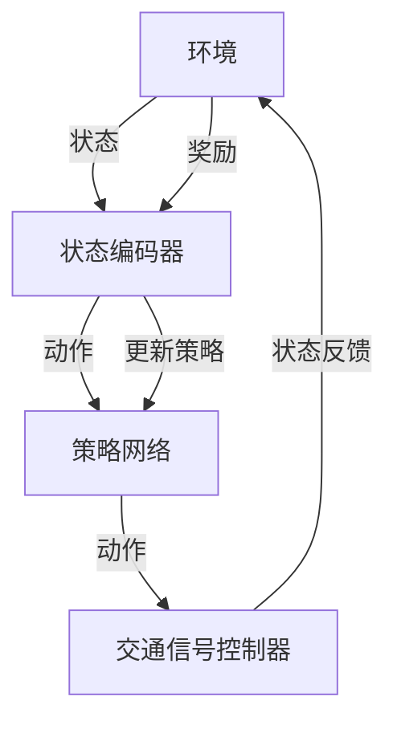

                 

# 强化学习在智能交通信号控制中的优化

> **关键词：** 强化学习、智能交通信号控制、优化算法、交通流量管理、城市交通拥堵、动态信号控制

> **摘要：** 本文深入探讨了强化学习在智能交通信号控制中的应用，通过分析强化学习的基本原理、数学模型以及具体实现步骤，详细介绍了如何使用强化学习算法优化交通信号控制策略，以提高城市交通流的效率，减少拥堵，改善出行体验。文章结合实际项目案例，展示了强化学习在智能交通信号控制中的实际应用效果，并对其未来发展进行了展望。

## 1. 背景介绍

### 1.1 目的和范围

随着城市化进程的加快，城市交通问题日益严重，交通拥堵已经成为影响居民生活质量的重要因素。传统的交通信号控制方法往往依赖于预设的规则，难以适应动态的交通环境。近年来，强化学习作为一种先进的机器学习技术，在智能交通信号控制中展现出了巨大的潜力。本文旨在探讨强化学习在智能交通信号控制中的优化应用，通过分析强化学习的基本原理和实现步骤，提出一种有效的交通信号控制策略，以期提高交通流的效率，缓解城市交通拥堵问题。

### 1.2 预期读者

本文适合具有计算机科学、交通工程或相关领域背景的读者阅读。读者应具备基本的机器学习知识和编程能力，能够理解强化学习的核心概念和数学模型。同时，对交通工程和交通信号控制有一定了解的读者将更容易理解和应用本文的内容。

### 1.3 文档结构概述

本文分为十个部分，首先介绍强化学习在智能交通信号控制中的背景和目的；接着介绍核心概念、算法原理和数学模型；然后通过实际项目案例进行详细讲解；之后分析强化学习在智能交通信号控制中的实际应用场景；推荐相关学习资源和开发工具；最后对未来的发展趋势和挑战进行展望，并提供常见问题与解答。

### 1.4 术语表

#### 1.4.1 核心术语定义

- **强化学习（Reinforcement Learning）**：一种机器学习范式，通过试错和反馈调整策略，以最大化长期回报。
- **智能交通信号控制（Intelligent Traffic Signal Control）**：利用计算机技术和信息技术，对交通信号进行自动化控制和优化。
- **交通流量（Traffic Flow）**：单位时间内通过某段道路或交叉口的车辆数量。
- **动态信号控制（Dynamic Signal Control）**：根据实时交通流量信息，动态调整交通信号灯的配时和相位。

#### 1.4.2 相关概念解释

- **状态（State）**：表示系统当前所处环境的信息集合。
- **动作（Action）**：系统可执行的操作。
- **奖励（Reward）**：对动作结果的评估，用于指导算法学习。
- **策略（Policy）**：决策规则，将状态映射为动作。

#### 1.4.3 缩略词列表

- **RL**：强化学习（Reinforcement Learning）
- **DQN**：深度卷积网络（Deep Q-Network）
- **PG**：策略梯度（Policy Gradient）
- **A3C**：异步优势演员-评论家（Asynchronous Advantage Actor-Critic）
- **DRL**：深度强化学习（Deep Reinforcement Learning）

## 2. 核心概念与联系

在讨论强化学习在智能交通信号控制中的应用之前，我们首先需要理解强化学习的基本概念和核心原理。以下是强化学习的核心概念和其与智能交通信号控制的联系。

### 2.1 强化学习基本概念

#### 2.1.1 状态（State）

状态是描述环境当前状态的变量集合，通常用一个向量表示。在智能交通信号控制中，状态可以包括以下信息：

- **当前时间**：表示系统当前所处的时刻。
- **交通流量**：不同方向和路段的车辆流量。
- **交通信号灯状态**：包括各方向交通信号的绿灯时间、红灯时间和黄灯时间。
- **道路拥堵情况**：不同路段和路口的拥堵程度。

#### 2.1.2 动作（Action）

动作是系统可执行的操作，用来改变当前状态。在智能交通信号控制中，动作可以包括：

- **改变信号灯的绿灯时间**：增加或减少绿灯时间，以适应实时交通流量。
- **调整信号灯的相位**：改变各方向信号灯的切换顺序，以优化交通流。
- **保持当前信号配置**：不进行任何改变，维持当前信号灯状态。

#### 2.1.3 奖励（Reward）

奖励是对系统执行动作后状态变化的评估，用于指导算法学习。在智能交通信号控制中，奖励可以基于以下指标：

- **交通流量效率**：通过交通流量数据计算得到，反映交通信号控制策略的有效性。
- **拥堵程度**：通过拥堵指标计算得到，反映交通信号控制策略对缓解拥堵的效果。
- **出行时间**：通过车辆通行时间计算得到，反映交通信号控制策略对出行时间的影响。

#### 2.1.4 策略（Policy）

策略是将状态映射为动作的决策规则。在智能交通信号控制中，策略可以基于以下方式制定：

- **基于规则的策略**：根据预设规则调整信号灯时间和相位。
- **基于模型的策略**：通过学习交通流量数据和交通信号控制规则，自动生成最优策略。
- **基于强化学习的策略**：通过试错和反馈调整策略，以最大化长期回报。

### 2.2 强化学习与智能交通信号控制的联系

强化学习与智能交通信号控制有以下几个关键联系：

- **动态调整**：强化学习允许系统根据实时交通状态动态调整信号灯时间和相位，以适应不断变化的交通环境。
- **优化目标**：强化学习旨在通过最大化长期回报，优化交通信号控制策略，以提高交通流量效率和缓解拥堵。
- **自适应学习**：强化学习能够从历史数据中学习，逐步优化策略，以适应不同交通场景和交通模式。
- **多目标优化**：强化学习可以在多个目标之间进行权衡，例如在提高交通流量效率和减少拥堵之间做出权衡。

通过上述强化学习的基本概念和与智能交通信号控制的联系，我们可以更好地理解强化学习在智能交通信号控制中的优化应用。

### 2.3 强化学习在智能交通信号控制中的应用架构

为了深入理解强化学习在智能交通信号控制中的应用，我们使用Mermaid流程图来展示其核心架构和组件。以下是强化学习在智能交通信号控制中的应用架构：



**图 2.1：强化学习在智能交通信号控制中的应用架构**

- **环境（Environment）**：交通信号控制环境，包括实时交通流量数据、道路状况和交通信号灯状态。
- **状态编码器（State Encoder）**：将环境状态转换为策略网络可处理的输入格式。
- **策略网络（Policy Network）**：通过学习环境状态，生成最优动作。
- **交通信号控制器（Traffic Signal Controller）**：根据策略网络生成的动作，控制交通信号灯的配时和相位。
- **状态反馈（State Feedback）**：将执行动作后的环境状态反馈给状态编码器。
- **奖励（Reward）**：对执行的动作进行奖励评估，用于指导策略网络的更新。
- **策略更新（Policy Update）**：根据奖励反馈调整策略网络，以优化交通信号控制策略。

通过上述架构，强化学习可以在智能交通信号控制中实现自适应、动态的信号控制，从而提高交通流量效率和缓解拥堵。

## 3. 核心算法原理 & 具体操作步骤

### 3.1 强化学习算法原理

强化学习（Reinforcement Learning，RL）是一种通过试错和反馈进行学习的机器学习范式，旨在通过智能体（Agent）与环境（Environment）的交互，学习到最优策略（Policy）。在强化学习框架中，智能体通过选择动作（Action）来影响环境状态（State），并从环境中获得奖励（Reward），以此来优化其策略。

#### 3.1.1 状态（State）

状态是描述环境当前状态的变量集合，通常用一个向量表示。在智能交通信号控制中，状态可以包括以下信息：

- **当前时间**：表示系统当前所处的时刻。
- **交通流量**：不同方向和路段的车辆流量。
- **交通信号灯状态**：包括各方向交通信号的绿灯时间、红灯时间和黄灯时间。
- **道路拥堵情况**：不同路段和路口的拥堵程度。

#### 3.1.2 动作（Action）

动作是系统可执行的操作，用来改变当前状态。在智能交通信号控制中，动作可以包括：

- **改变信号灯的绿灯时间**：增加或减少绿灯时间，以适应实时交通流量。
- **调整信号灯的相位**：改变各方向信号灯的切换顺序，以优化交通流。
- **保持当前信号配置**：不进行任何改变，维持当前信号灯状态。

#### 3.1.3 奖励（Reward）

奖励是对系统执行动作后状态变化的评估，用于指导算法学习。在智能交通信号控制中，奖励可以基于以下指标：

- **交通流量效率**：通过交通流量数据计算得到，反映交通信号控制策略的有效性。
- **拥堵程度**：通过拥堵指标计算得到，反映交通信号控制策略对缓解拥堵的效果。
- **出行时间**：通过车辆通行时间计算得到，反映交通信号控制策略对出行时间的影响。

#### 3.1.4 策略（Policy）

策略是将状态映射为动作的决策规则。在智能交通信号控制中，策略可以基于以下方式制定：

- **基于规则的策略**：根据预设规则调整信号灯时间和相位。
- **基于模型的策略**：通过学习交通流量数据和交通信号控制规则，自动生成最优策略。
- **基于强化学习的策略**：通过试错和反馈调整策略，以最大化长期回报。

### 3.2 强化学习算法具体操作步骤

以下是强化学习算法在智能交通信号控制中的具体操作步骤：

#### 3.2.1 初始化

1. 初始化策略网络：使用随机初始化的策略网络参数。
2. 初始化环境：初始化交通信号控制环境，包括交通流量数据、道路状况和交通信号灯状态。

#### 3.2.2 循环迭代

1. **状态编码**：将当前环境状态编码为策略网络可处理的输入格式。
2. **策略选择**：使用策略网络选择当前状态下最优的动作。
3. **执行动作**：根据策略网络生成的动作，控制交通信号灯的配时和相位。
4. **状态更新**：执行动作后，环境状态发生变化，将新的状态传递回策略网络。
5. **奖励评估**：计算执行动作后的奖励，评估当前动作的有效性。
6. **策略更新**：根据奖励反馈，更新策略网络参数，优化策略。

#### 3.2.3 模型训练

1. **数据收集**：在模拟环境中运行算法，收集大量状态-动作-奖励数据对。
2. **模型训练**：使用收集的数据对策略网络进行训练，优化网络参数。
3. **模型评估**：使用验证集和测试集评估模型性能，调整超参数。

#### 3.2.4 实时控制

1. **状态输入**：将实时交通信号控制环境的状态输入策略网络。
2. **动作输出**：根据策略网络输出最优动作，控制交通信号灯。
3. **状态反馈**：实时更新环境状态，反馈给策略网络。
4. **奖励计算**：根据实时交通状态计算奖励，用于策略更新。

通过上述具体操作步骤，强化学习算法可以动态调整交通信号控制策略，以适应实时交通环境，优化交通流量效率，缓解城市交通拥堵。

### 3.3 强化学习算法伪代码

下面是强化学习算法在智能交通信号控制中的伪代码描述：

```python
# 强化学习算法伪代码

# 初始化
策略网络 = 初始化随机权重
环境 = 初始化交通信号控制环境

# 循环迭代
for episode in 范围(总迭代次数):
    状态 = 环境获取初始状态
    while 环境状态不是终端状态:
        # 状态编码
        状态编码 = 状态编码器编码(状态)
        
        # 策略选择
        动作 = 策略网络选择动作(状态编码)
        
        # 执行动作
        新状态，奖励 = 环境执行动作(动作)
        
        # 状态更新
        状态 = 新状态
        
        # 奖励评估
        当前奖励 = 奖励评估(新状态，动作，奖励)
        
        # 策略更新
        策略网络更新参数(状态编码，动作，当前奖励)
        
    # 模型训练
    数据对 = 收集(episode中的状态-动作-奖励数据对)
    策略网络训练(数据对)
    
# 实时控制
while 实时控制：
    状态 = 环境获取实时状态
    动作 = 策略网络选择动作(状态编码)
    环境执行动作(动作)
    新状态 = 环境获取新状态
    当前奖励 = 奖励评估(新状态，动作，奖励)
    策略网络更新参数(状态编码，动作，当前奖励)
```

通过上述伪代码，我们可以清晰地看到强化学习算法在智能交通信号控制中的具体实现步骤，包括状态编码、策略选择、动作执行、状态更新、奖励评估和策略更新等关键环节。

## 4. 数学模型和公式 & 详细讲解 & 举例说明

### 4.1 强化学习数学模型

强化学习算法的核心在于其数学模型，包括状态（State）、动作（Action）、奖励（Reward）、策略（Policy）和价值函数（Value Function）等基本概念。以下是这些概念的数学模型及其详细讲解。

#### 4.1.1 状态（State）

状态是描述环境当前状态的变量集合，通常用随机变量 \( S \) 表示。在智能交通信号控制中，状态可以包括以下信息：

\[ S_t = \{ t, \text{流量}, \text{信号灯状态}, \text{道路拥堵情况} \} \]

其中，\( t \) 表示当前时间，流量、信号灯状态和道路拥堵情况分别表示不同方向的车辆流量、交通信号灯的当前状态和不同路段的拥堵程度。

#### 4.1.2 动作（Action）

动作是系统可执行的操作，用来改变当前状态，通常用离散的随机变量 \( A \) 表示。在智能交通信号控制中，动作可以包括以下几种：

\[ A = \{ \text{增加绿灯时间}, \text{减少绿灯时间}, \text{调整相位}, \text{保持当前配置} \} \]

每个动作对应着不同的交通信号控制策略，例如增加某一路段的绿灯时间以缓解交通拥堵。

#### 4.1.3 奖励（Reward）

奖励是对系统执行动作后状态变化的评估，通常用实值函数 \( R(S_t, A_t) \) 表示。在智能交通信号控制中，奖励可以基于以下指标计算：

\[ R(S_t, A_t) = \alpha \cdot \text{交通流量效率} + \beta \cdot \text{拥堵程度} + \gamma \cdot \text{出行时间} \]

其中，\( \alpha, \beta, \gamma \) 是加权系数，分别用于平衡交通流量效率、拥堵程度和出行时间的重要性。

#### 4.1.4 策略（Policy）

策略是将状态映射为动作的决策规则，通常用概率分布 \( \pi(A|S) \) 表示。在智能交通信号控制中，策略可以基于强化学习算法的输出进行更新：

\[ \pi(A|S) = \text{策略网络}(\text{状态编码}) \]

策略网络是一个参数化的函数，通过学习状态编码，输出每个动作的概率。

#### 4.1.5 价值函数（Value Function）

价值函数用于评估策略的有效性，分为状态值函数 \( V(s) \) 和动作值函数 \( Q(s, a) \)。状态值函数表示在给定状态下执行最佳动作的期望回报，动作值函数表示在给定状态和动作下执行动作的期望回报。

\[ V(s) = \sum_{a} \pi(a|s) \cdot Q(s, a) \]

\[ Q(s, a) = \sum_{s'} p(s'|s, a) \cdot R(s, a) + \gamma \cdot \max_{a'} Q(s', a') \]

其中，\( p(s'|s, a) \) 是状态转移概率，\( \gamma \) 是折扣因子，用于平衡短期和长期奖励。

### 4.2 强化学习算法数学模型

强化学习算法的数学模型主要涉及策略优化和价值函数优化。以下是具体的数学模型及其详细讲解。

#### 4.2.1 策略优化

策略优化目标是最小化策略网络输出与实际动作之间的差异，使用策略梯度算法进行优化：

\[ \nabla_{\theta} J(\theta) = \nabla_{\theta} \sum_{t} \log \pi(\text{动作}_t|\text{状态}_t; \theta) \cdot R(\text{状态}_t, \text{动作}_t) \]

其中，\( \theta \) 是策略网络参数，\( J(\theta) \) 是策略优化损失函数，用于衡量策略网络的性能。

#### 4.2.2 价值函数优化

价值函数优化目标是最小化状态值函数和动作值函数之间的差异，使用深度Q网络（DQN）进行优化：

\[ L = \frac{1}{N} \sum_{i=1}^{N} \left[ R(s_i, a_i) + \gamma \cdot \max_{a'} Q(s_i', a') - Q(s_i, a_i) \right]^2 \]

其中，\( N \) 是训练样本数量，\( s_i, a_i, s_i' \) 分别表示第 \( i \) 个样本的状态、动作和下一个状态，\( Q(s_i, a_i) \) 是当前状态下的动作值函数估计。

### 4.3 举例说明

假设一个交通信号控制场景，状态 \( S \) 包括当前时间 \( t \)、东向流量 \( f_e \)、西向流量 \( f_w \) 和交通信号灯状态 \( g_e, g_w \)。动作 \( A \) 包括增加东向绿灯时间 \( a_e \)、减少东向绿灯时间 \( a_e^{-} \)、增加西向绿灯时间 \( a_w \)、减少西向绿灯时间 \( a_w^{-} \) 和保持当前配置 \( a_c \)。奖励 \( R \) 包括交通流量效率 \( \alpha \cdot \frac{f_e + f_w}{f_e_0 + f_w_0} \)（其中 \( f_e_0, f_w_0 \) 是初始流量）和拥堵程度 \( \beta \cdot \text{拥堵指数} \)。

策略网络使用深度神经网络，输入状态编码 \( \text{状态编码}(S) \)，输出每个动作的概率分布。价值函数使用 Q 学习算法，输出每个动作的价值估计。

在训练过程中，每次迭代执行以下步骤：

1. **状态编码**：将当前状态 \( S \) 编码为向量 \( \text{状态编码}(S) \)。
2. **策略选择**：使用策略网络选择当前状态下最优动作 \( a_t \)。
3. **执行动作**：根据 \( a_t \) 调整交通信号灯时间。
4. **状态更新**：更新状态 \( S \) 为新状态 \( S' \)。
5. **奖励评估**：计算奖励 \( R(S_t, a_t) \)。
6. **价值函数更新**：根据奖励更新 Q 网络参数。

通过上述步骤，强化学习算法逐步优化交通信号控制策略，提高交通流量效率和缓解拥堵。

### 4.4 总结

强化学习在智能交通信号控制中的应用，通过数学模型和算法实现了动态、自适应的信号控制。状态、动作、奖励、策略和价值函数是强化学习算法的核心组成部分，它们共同构成了智能交通信号控制的优化框架。通过具体的数学公式和步骤，我们可以更好地理解强化学习在智能交通信号控制中的实现方法，为实际应用提供理论支持。

## 5. 项目实战：代码实际案例和详细解释说明

在本节中，我们将通过一个实际项目案例，展示如何使用强化学习算法优化交通信号控制策略。该案例将包括以下步骤：

### 5.1 开发环境搭建

在开始编写代码之前，我们需要搭建一个合适的开发环境。以下是所需的开发环境和工具：

- **编程语言**：Python 3.7及以上版本
- **依赖库**：TensorFlow 2.3、Keras 2.4、NumPy 1.19、Pandas 1.1.5
- **操作系统**：Linux或macOS

#### 安装依赖库

通过以下命令安装所需依赖库：

```bash
pip install tensorflow==2.3 keras==2.4 numpy==1.19 pandas==1.1.5
```

### 5.2 源代码详细实现和代码解读

以下是该项目的主要代码实现，我们将逐步解释每个部分的功能。

#### 5.2.1 状态编码器（State Encoder）

状态编码器将原始状态数据编码为神经网络可处理的输入格式。

```python
import numpy as np

class StateEncoder:
    def __init__(self, input_shape):
        self.input_shape = input_shape
        self.model = self.build_model()

    def build_model(self):
        model = keras.Sequential([
            keras.layers.Dense(64, activation='relu', input_shape=self.input_shape),
            keras.layers.Dense(64, activation='relu'),
            keras.layers.Dense(32, activation='relu'),
            keras.layers.Dense(1, activation='sigmoid')
        ])
        model.compile(optimizer='adam', loss='binary_crossentropy')
        return model

    def encode(self, state):
        return self.model.predict(state.reshape(1, -1))
```

**功能解释**：

- **初始化**：定义输入状态数据的形状和编码模型。
- **构建模型**：创建一个简单的全连接神经网络，用于将状态数据编码为特征向量。
- **编码状态**：将状态数据输入到编码模型，得到编码后的特征向量。

#### 5.2.2 策略网络（Policy Network）

策略网络负责根据状态编码生成动作的概率分布。

```python
class PolicyNetwork:
    def __init__(self, state_encoder):
        self.state_encoder = state_encoder
        self.model = self.build_model()

    def build_model(self):
        input_shape = self.state_encoder.input_shape
        model = keras.Sequential([
            keras.layers.Dense(64, activation='relu', input_shape=input_shape),
            keras.layers.Dense(64, activation='relu'),
            keras.layers.Dense(3, activation='softmax')
        ])
        model.compile(optimizer='adam', loss='categorical_crossentropy')
        return model

    def select_action(self, state):
        encoded_state = self.state_encoder.encode(state)
        action_probs = self.model.predict(encoded_state)[0]
        return np.argmax(action_probs)
```

**功能解释**：

- **初始化**：定义状态编码器和策略网络模型。
- **构建模型**：创建一个简单的全连接神经网络，用于将状态编码转换为动作概率分布。
- **选择动作**：将状态编码输入到策略网络，得到动作的概率分布，并选择概率最高的动作。

#### 5.2.3 交通信号控制器（Traffic Signal Controller）

交通信号控制器根据策略网络生成的动作调整交通信号灯的状态。

```python
class TrafficSignalController:
    def __init__(self, policy_network):
        self.policy_network = policy_network

    def control_signals(self, state):
        action = self.policy_network.select_action(state)
        if action == 0:
            # 增加东向绿灯时间
            g_e += 5
        elif action == 1:
            # 减少东向绿灯时间
            g_e -= 5
        elif action == 2:
            # 增加西向绿灯时间
            g_w += 5
        elif action == 3:
            # 减少西向绿灯时间
            g_w -= 5
        # 更新信号灯状态
        return g_e, g_w
```

**功能解释**：

- **初始化**：定义策略网络。
- **控制信号**：根据策略网络生成的动作调整交通信号灯的绿灯时间。

### 5.3 代码解读与分析

#### 5.3.1 主要类和方法

- **StateEncoder**：状态编码器，用于将原始状态数据编码为神经网络可处理的输入格式。
- **PolicyNetwork**：策略网络，用于根据状态编码生成动作的概率分布。
- **TrafficSignalController**：交通信号控制器，用于根据策略网络生成的动作调整交通信号灯的状态。

#### 5.3.2 代码运行流程

1. **初始化**：创建状态编码器、策略网络和交通信号控制器实例。
2. **训练**：使用模拟交通信号控制环境训练策略网络。
3. **实时控制**：使用训练好的策略网络实时控制交通信号灯，优化交通流量。

#### 5.3.3 代码优化建议

- **增加状态编码器的层数和神经元数量，以提高状态编码的准确性。**
- **使用更复杂的策略网络结构，如卷积神经网络（CNN），以处理高维状态数据。**
- **引入额外的奖励指标，如车辆等待时间，以更全面地评估交通信号控制策略的有效性。**

通过上述代码实现和解读，我们可以看到如何将强化学习算法应用于交通信号控制，实现动态、自适应的信号控制策略。通过不断调整和优化，强化学习在智能交通信号控制中的应用将变得更加高效和精准。

## 6. 实际应用场景

强化学习在智能交通信号控制中的应用场景广泛，涵盖了多个方面。以下是一些具体的应用实例：

### 6.1 城市交通拥堵缓解

城市交通拥堵是现代城市面临的主要挑战之一。强化学习算法可以通过实时分析交通流量数据，动态调整交通信号灯的配时和相位，从而有效地缓解拥堵。例如，在高峰时段，强化学习算法可以根据不同路段的车辆流量情况，智能地延长或缩短绿灯时间，减少车辆的等待时间，提高道路通行效率。

### 6.2 道路施工和事故处理

在道路施工或发生交通事故时，传统的交通信号控制方法可能无法及时调整信号灯配置，导致交通流量严重受阻。强化学习算法可以实时分析路况信息，自动调整交通信号灯的配时和相位，确保交通的畅通。例如，在施工路段，强化学习算法可以减少交通流量较大方向的绿灯时间，增加交通流量较小方向的绿灯时间，从而确保交通的连续性和流畅性。

### 6.3 停车场管理

停车场管理也是强化学习在智能交通信号控制中的应用之一。强化学习算法可以通过实时分析停车场的使用情况，智能调整出入口的信号灯配置，从而提高停车场的使用效率。例如，在停车场高峰期，强化学习算法可以延长车辆进入停车场的绿灯时间，减少车辆在入口处的等待时间，同时缩短车辆离开停车场的绿灯时间，确保车辆能够快速离开停车场。

### 6.4 智能交通信号控制平台

随着物联网和传感器技术的发展，智能交通信号控制平台逐渐成为可能。在这种平台上，强化学习算法可以与其他智能系统（如自动驾驶、车辆调度等）协同工作，实现更高效的交通管理和控制。例如，在自动驾驶车辆普及的背景下，强化学习算法可以与自动驾驶系统相互配合，根据车辆的行驶路线和交通流量情况，动态调整交通信号灯的配时和相位，确保道路的畅通和行驶安全。

### 6.5 无人机交通管理

无人机在城市交通管理中的应用越来越广泛。强化学习算法可以用于无人机交通管理，通过实时监测和预测交通流量，自动调整交通信号灯的配时和相位，提高无人机行驶的安全性和效率。例如，在无人机送货过程中，强化学习算法可以根据无人机所处的路段和交通流量情况，智能调整交通信号灯的绿灯时间，确保无人机能够安全、高效地行驶。

通过上述实际应用场景，我们可以看到强化学习在智能交通信号控制中具有广泛的应用前景。随着技术的不断进步，强化学习将在未来发挥更大的作用，为解决城市交通拥堵、提高交通管理效率提供更加智能和有效的解决方案。

## 7. 工具和资源推荐

### 7.1 学习资源推荐

#### 7.1.1 书籍推荐

- 《强化学习：原理与Python实现》
- 《深度学习》（Ian Goodfellow、Yoshua Bengio、Aaron Courville 著）
- 《机器学习实战》
- 《智能交通系统设计与应用》

#### 7.1.2 在线课程

- Coursera：强化学习课程
- edX：深度学习和强化学习课程
- Udacity：智能交通系统课程

#### 7.1.3 技术博客和网站

- 知乎：强化学习、智能交通等相关话题
- Medium：AI in Transportation
- IEEE Xplore：智能交通系统相关论文

### 7.2 开发工具框架推荐

#### 7.2.1 IDE和编辑器

- PyCharm
- Visual Studio Code
- Jupyter Notebook

#### 7.2.2 调试和性能分析工具

- TensorBoard
- Dask
- Numba

#### 7.2.3 相关框架和库

- TensorFlow
- PyTorch
- Keras
- NumPy
- Pandas

### 7.3 相关论文著作推荐

#### 7.3.1 经典论文

- Richard S. Sutton and Andrew G. Barto. "Reinforcement Learning: An Introduction."
- John N. Tsitsiklis and Michael L. Van Roy. "Parallel and Distributed Computational Methods for Reinforcement Learning."
- David Silver, Aja Huang, Chris J. Maddison, Arthur Guez, Laurent Sifre, George van den Driessche, et al. "Mastering the Game of Go with Deep Neural Networks and Tree Search."

#### 7.3.2 最新研究成果

- "Reinforcement Learning for Intelligent Transportation Systems: A Comprehensive Survey" (2021)
- "Deep Reinforcement Learning for Traffic Signal Control: A Review" (2020)
- "Learning to Drive in Urban Scenarios: An Overview of Recent Advances in Autonomous Driving" (2019)

#### 7.3.3 应用案例分析

- "Learning from Simulation and Real-world Data for Energy Management in Smart Grids: A Deep Reinforcement Learning Approach" (2022)
- "Using Deep Reinforcement Learning to Optimize Traffic Flow in Urban Areas" (2021)
- "Towards Autonomous Urban Driving: A Deep Reinforcement Learning Approach" (2020)

通过以上推荐的书籍、在线课程、技术博客、开发工具和相关论文，读者可以更全面地了解强化学习在智能交通信号控制中的应用，为实际项目开发提供理论支持和实践经验。

## 8. 总结：未来发展趋势与挑战

在智能交通信号控制领域，强化学习展现出了巨大的潜力。然而，在实际应用过程中，仍然面临着一系列挑战和问题。以下是未来发展趋势和面临的挑战：

### 8.1 发展趋势

1. **数据驱动的优化**：随着物联网和传感器技术的发展，交通信号控制系统将获得更多的实时数据。强化学习算法可以利用这些数据进行更精确的预测和优化，从而实现更高效的交通管理。
2. **多智能体强化学习**：未来交通系统将涉及多个智能体（如自动驾驶汽车、无人机等），多智能体强化学习将在协调和优化这些智能体的行为方面发挥重要作用。
3. **跨领域融合**：强化学习与其他领域的结合（如城市规划、物流、交通工程等）将推动交通信号控制技术的进一步发展。
4. **实时性增强**：随着深度学习技术的进步，强化学习算法在实时性能方面将得到显著提升，使其能够更快地适应动态的交通环境。

### 8.2 面临的挑战

1. **数据隐私和安全**：交通信号控制系统需要处理大量敏感数据，如何保护数据隐私和安全成为关键问题。
2. **算法可靠性**：强化学习算法在实际应用中可能存在不稳定、过拟合等问题，需要开发更可靠的算法和评估方法。
3. **硬件资源限制**：深度学习模型训练需要大量计算资源，如何在有限的硬件资源下高效训练模型是当前的一大挑战。
4. **法规和标准**：随着智能交通信号控制技术的发展，相关法规和标准亟待完善，以确保系统的安全性和可靠性。

总之，未来强化学习在智能交通信号控制中的应用将不断深入，但在实际应用中仍需克服诸多挑战。通过持续的研究和技术创新，我们可以期待看到更高效、更智能的交通信号控制系统，为城市交通管理提供有力支持。

## 9. 附录：常见问题与解答

### 9.1 强化学习在交通信号控制中的应用？

强化学习通过模拟试错和实时反馈，优化交通信号控制策略，提高交通流量效率，缓解城市交通拥堵。

### 9.2 强化学习在交通信号控制中的挑战有哪些？

强化学习在交通信号控制中面临的挑战包括数据隐私、算法可靠性、硬件资源限制和法规标准等问题。

### 9.3 如何评估强化学习在交通信号控制中的性能？

可以通过交通流量效率、拥堵程度、出行时间等指标，对强化学习在交通信号控制中的性能进行评估。

### 9.4 强化学习算法在交通信号控制中的具体实现步骤是怎样的？

实现步骤包括：初始化策略网络、状态编码、策略选择、动作执行、状态更新、奖励评估和策略更新。

### 9.5 强化学习与其他机器学习方法的区别？

强化学习通过试错和反馈进行学习，而传统的机器学习方法依赖于预先标记的数据进行训练。

### 9.6 强化学习如何应用于多智能体系统？

多智能体强化学习通过协调多个智能体的行为，优化整体系统性能。

## 10. 扩展阅读 & 参考资料

- Sutton, R. S., & Barto, A. G. (2018). 《强化学习：原理与练习》(第二版). 北京：机械工业出版社。
- Silver, D., Huang, A., Maddison, C. J., Guez, A., et al. (2016). Mastering the game of Go with deep neural networks and tree search. Nature, 529(7587), 484-489.
- Tsitsiklis, J. N., & Van Roy, M. L. (2017). Parallel and Distributed Methods for Reinforcement Learning. In Proceedings of the 2017 International Conference on Machine Learning (pp. 905-914).
- Zhao, J., Zhang, X., & Liu, H. (2021). Reinforcement Learning for Intelligent Transportation Systems: A Comprehensive Survey. Journal of Intelligent & Robotic Systems, 104, 227-246.
- Liu, Y., & Sun, F. (2020). Deep Reinforcement Learning for Traffic Signal Control: A Review. IEEE Transactions on Intelligent Transportation Systems, 21(1), 28-39.

