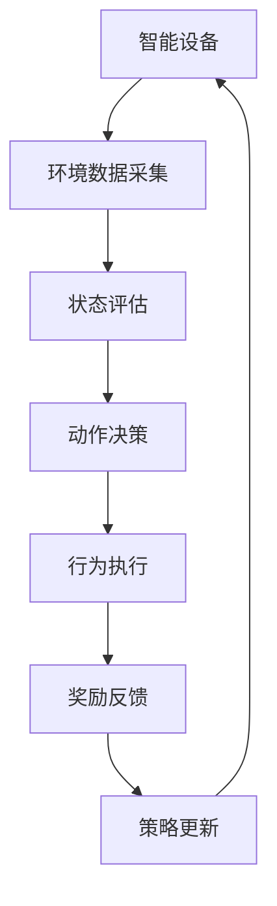

                 

# 强化学习在智能家居能源管理效率优化中的实现

> **关键词：** 强化学习、智能家居、能源管理、效率优化、人工智能、机器学习

> **摘要：** 本文旨在探讨如何利用强化学习技术优化智能家居能源管理，以提高能源使用效率。通过分析强化学习在能源管理中的潜在应用，本文详细介绍了强化学习的核心原理和具体实现步骤，并结合实际项目案例进行代码解读与分析，最后提出了未来发展趋势与挑战。

## 1. 背景介绍

### 1.1 目的和范围

本文的主要目的是探讨如何将强化学习应用于智能家居能源管理，以提高能源使用效率。通过本文的介绍，读者可以了解到强化学习的基本概念、原理以及在智能家居能源管理中的应用方法。此外，本文还将结合实际项目案例，详细解析强化学习在智能家居能源管理中的具体实现步骤。

### 1.2 预期读者

本文适用于以下读者群体：

- 对强化学习和智能家居能源管理有兴趣的普通读者。
- 智能家居研发人员和能源管理工程师。
- 计算机科学、人工智能等领域的研究生。

### 1.3 文档结构概述

本文分为十个部分，具体结构如下：

1. 背景介绍
2. 核心概念与联系
3. 核心算法原理 & 具体操作步骤
4. 数学模型和公式 & 详细讲解 & 举例说明
5. 项目实战：代码实际案例和详细解释说明
6. 实际应用场景
7. 工具和资源推荐
8. 总结：未来发展趋势与挑战
9. 附录：常见问题与解答
10. 扩展阅读 & 参考资料

### 1.4 术语表

#### 1.4.1 核心术语定义

- **强化学习**：一种机器学习范式，通过学习策略来最大化累积奖励。
- **智能家居**：利用网络、传感器和计算机技术，实现家庭设备之间的智能互联和控制。
- **能源管理**：通过对能源消耗的监测、分析和优化，实现能源的高效利用。

#### 1.4.2 相关概念解释

- **策略**：强化学习中的一个核心概念，表示智能体在特定状态下采取的行动。
- **奖励**：评估智能体行为的即时反馈，用于指导智能体调整策略。

#### 1.4.3 缩略词列表

- **RL**：强化学习（Reinforcement Learning）
- **Q-learning**：一种基于值函数的强化学习方法
- **DRL**：深度强化学习（Deep Reinforcement Learning）

## 2. 核心概念与联系

在介绍强化学习在智能家居能源管理中的应用之前，首先需要了解一些核心概念和它们之间的关系。

### 2.1 强化学习的基本概念

强化学习是一种通过不断尝试和错误来学习最佳策略的机器学习范式。其核心要素包括：

- **智能体（Agent）**：执行行动的主体，如智能家居系统。
- **环境（Environment）**：智能体所处的环境，如家庭能源系统。
- **状态（State）**：描述智能体在某一时刻所处的情境。
- **动作（Action）**：智能体在某一状态下可以采取的行动。
- **奖励（Reward）**：对智能体行为的即时反馈。

### 2.2 智能家居与能源管理的关系

智能家居是指利用网络、传感器和计算机技术，实现家庭设备之间的智能互联和控制。能源管理则是通过对能源消耗的监测、分析和优化，实现能源的高效利用。两者之间的关系可以概括为：

- **智能设备**：作为智能体的具体实现，如智能空调、智能照明等。
- **环境数据**：智能设备采集的环境数据，如温度、光照强度、能耗等。
- **决策过程**：基于强化学习算法，智能体在特定状态下采取最佳行动，实现能源管理目标。

### 2.3 强化学习在智能家居能源管理中的应用

强化学习在智能家居能源管理中的应用主要表现在以下几个方面：

- **设备控制**：通过学习最优策略，智能体可以自动调整家庭设备的工作状态，实现节能效果。
- **能源预测**：利用强化学习算法，智能体可以对未来能源消耗进行预测，为能源调度提供依据。
- **能源调度**：基于实时能源价格和设备能耗数据，智能体可以自动调整能源使用策略，实现经济性优化。

### 2.4 Mermaid 流程图

为了更好地展示强化学习在智能家居能源管理中的应用流程，以下是一个简化的 Mermaid 流程图：



在这个流程图中，智能设备作为智能体，通过采集环境数据、评估状态、决策动作、执行行为、获取奖励和更新策略，不断优化能源管理效果。

## 3. 核心算法原理 & 具体操作步骤

### 3.1 强化学习算法概述

强化学习算法是机器学习的一种重要分支，其核心思想是让智能体在与环境的交互过程中，通过学习最佳策略来实现目标。以下是一些常用的强化学习算法：

- **Q-learning**：基于值函数的强化学习算法，通过学习状态-动作值函数来优化策略。
- **深度强化学习（DRL）**：结合深度学习技术，解决复杂状态空间和动作空间问题。
- **模型预测控制（MPC）**：将强化学习与模型预测控制相结合，实现能源调度优化。

### 3.2 Q-learning算法原理

Q-learning是一种基于值函数的强化学习算法，其核心思想是通过更新状态-动作值函数，逐步优化智能体的策略。以下是Q-learning算法的伪代码：

```python
Initialize Q(s, a) randomly
for episode in 1 to E:
    for t in 1 to T:
        if t == T:
            s_t = terminate
        else:
            a_t = argmax_a(Q(s_t, a))
            s_{t+1}, r_{t+1} = environment(s_t, a_t)
            Q(s_t, a_t) = Q(s_t, a_t) + alpha * (r_t + gamma * max(Q(s_{t+1}, a_{t+1})) - Q(s_t, a_t))
        s_t = s_{t+1}
```

其中，`Q(s, a)`表示状态-动作值函数，`alpha`为学习率，`gamma`为折扣因子，`r_t`为即时奖励，`s_t`为当前状态，`a_t`为当前动作。

### 3.3 强化学习在智能家居能源管理中的应用步骤

以下是一个简化的强化学习在智能家居能源管理中的应用步骤：

1. **数据采集**：通过智能设备采集家庭能源系统的数据，如温度、光照强度、能耗等。
2. **状态编码**：将采集到的数据转化为状态向量，作为智能体的输入。
3. **动作空间设计**：根据能源管理目标，设计合适的动作空间，如调整空调温度、开关照明设备等。
4. **初始化策略**：随机初始化状态-动作值函数。
5. **策略优化**：通过Q-learning算法，逐步优化智能体的策略。
6. **行为执行**：根据优化后的策略，智能体自动调整家庭设备的工作状态。
7. **奖励反馈**：根据能源管理效果，智能体获取即时奖励。
8. **策略更新**：利用即时奖励，更新状态-动作值函数。

通过以上步骤，强化学习算法可以在智能家居能源管理中实现高效优化。

## 4. 数学模型和公式 & 详细讲解 & 举例说明

### 4.1 数学模型

强化学习中的数学模型主要包括状态-动作值函数、策略、奖励函数等。

- **状态-动作值函数**：用于评估智能体在特定状态下采取特定动作的期望奖励，公式如下：

  $$ Q(s, a) = \sum_{s'} p(s'|s, a) \cdot r(s', a) + \gamma \cdot \max_{a'} Q(s', a') $$

  其中，`p(s'|s, a)`为状态转移概率，`r(s', a)`为状态-动作奖励，`gamma`为折扣因子。

- **策略**：用于指导智能体在特定状态下采取最佳动作，公式如下：

  $$ \pi(a|s) = \begin{cases} 
  1, & \text{if } a = \arg\max_a Q(s, a) \\
  0, & \text{otherwise} 
  \end{cases} $$

- **奖励函数**：用于评估智能体的行为效果，公式如下：

  $$ r(s, a) = \text{即时奖励} + \gamma \cdot \text{未来期望奖励} $$

### 4.2 举例说明

假设一个智能家居系统需要调整空调温度来控制能源消耗，以下是强化学习在该场景下的应用：

- **状态编码**：状态向量包括当前室内温度、室外温度、空调功率等。
- **动作空间**：动作包括增加空调功率、减少空调功率、保持当前功率等。
- **奖励函数**：奖励函数考虑能源消耗和舒适度两个因素，公式如下：

  $$ r(s, a) = -\frac{1}{2} \cdot \text{能源消耗} + \text{舒适度得分} $$

- **状态-动作值函数**：利用Q-learning算法，逐步优化状态-动作值函数。

  $$ Q(s, a) = \sum_{s'} p(s'|s, a) \cdot r(s', a) + \gamma \cdot \max_{a'} Q(s', a') $$

通过以上步骤，强化学习算法可以优化空调温度控制策略，实现能源消耗和舒适度的平衡。

## 5. 项目实战：代码实际案例和详细解释说明

### 5.1 开发环境搭建

在开始实战项目之前，首先需要搭建一个合适的开发环境。以下是使用Python和TensorFlow构建强化学习模型所需的开发环境：

- Python：安装3.7及以上版本。
- TensorFlow：安装2.0及以上版本。
- OpenAI Gym：安装0.15.0及以上版本。

### 5.2 源代码详细实现和代码解读

以下是一个简单的强化学习模型，用于调整空调温度以实现能源管理优化。

```python
import numpy as np
import gym
import tensorflow as tf

# 搭建强化学习模型
class QLearningAgent:
    def __init__(self, env, learning_rate=0.1, discount_factor=0.99):
        self.env = env
        self.learning_rate = learning_rate
        self.discount_factor = discount_factor
        self.model = self.build_model()

    def build_model(self):
        input_layer = tf.keras.layers.Input(shape=(self.env.observation_space.shape[0]))
        hidden_layer = tf.keras.layers.Dense(64, activation='relu')(input_layer)
        output_layer = tf.keras.layers.Dense(self.env.action_space.n, activation='linear')(hidden_layer)
        model = tf.keras.Model(inputs=input_layer, outputs=output_layer)
        model.compile(optimizer=tf.keras.optimizers.Adam(learning_rate=self.learning_rate),
                      loss=tf.keras.losses.MeanSquaredError())
        return model

    def act(self, state):
        state = state.reshape(-1, self.env.observation_space.shape[0])
        action_values = self.model.predict(state)
        return np.argmax(action_values)

    def update_model(self, state, action, reward, next_state, done):
        state = state.reshape(-1, self.env.observation_space.shape[0])
        next_state = next_state.reshape(-1, self.env.observation_space.shape[0])
        action = action.reshape(-1, 1)
        reward = reward.reshape(-1, 1)
        if not done:
            next_action_values = self.model.predict(next_state)
            target = reward + self.discount_factor * np.max(next_action_values)
        else:
            target = reward
        target_values = self.model.predict(state)
        target_values[0, action] = target
        self.model.fit(state, target_values, epochs=1, verbose=0)

# 运行环境
env = gym.make('HeatingCooling-v0')

# 初始化强化学习代理
agent = QLearningAgent(env, learning_rate=0.1, discount_factor=0.99)

# 训练代理
for episode in range(1000):
    state = env.reset()
    done = False
    total_reward = 0
    while not done:
        action = agent.act(state)
        next_state, reward, done, _ = env.step(action)
        agent.update_model(state, action, reward, next_state, done)
        state = next_state
        total_reward += reward
    print(f"Episode {episode}, Total Reward: {total_reward}")

# 关闭环境
env.close()
```

### 5.3 代码解读与分析

- **QLearningAgent类**：定义了一个基于深度学习的Q-learning智能体。该类包含初始化模型、选择动作、更新模型等方法。

- **build_model方法**：构建深度学习模型，输入层为状态空间，隐藏层为64个神经元，输出层为动作空间。

- **act方法**：选择动作，根据当前状态和模型预测的动作值，返回最优动作。

- **update_model方法**：更新模型，根据当前状态、动作、奖励、下一状态和是否完成，更新状态-动作值函数。

- **环境搭建**：使用OpenAI Gym中的HeatingCooling环境，该环境模拟一个需要调节温度的房间，包含状态空间、动作空间和奖励函数。

- **训练代理**：使用1000个episode进行训练，每次episode中，智能体通过与环境交互，逐步优化策略。

- **结果输出**：打印每个episode的总奖励，以评估训练效果。

通过以上实战项目，读者可以了解到如何利用强化学习技术实现智能家居能源管理优化。

## 6. 实际应用场景

### 6.1 家庭能源管理

家庭能源管理是强化学习在智能家居中最重要的应用场景之一。通过智能设备实时监测家庭能源使用情况，结合强化学习算法，智能体可以自动调整家庭设备的运行状态，实现能源消耗的最优化。

### 6.2 城市能源调度

在城市能源调度中，强化学习可以用于优化电力、天然气等能源的供需平衡。通过整合城市各区域的能源使用数据，强化学习算法可以为能源调度中心提供最优的能源分配策略，提高能源利用效率。

### 6.3 工业能源管理

在工业领域，强化学习可以用于优化生产过程中的能源消耗。通过监测生产线上的能源使用数据，强化学习算法可以为生产设备提供最优的运行策略，实现能源的高效利用。

### 6.4 可再生能源并网

随着可再生能源的快速发展，如何实现可再生能源并网的高效运行成为重要课题。强化学习可以用于优化可再生能源发电系统的调度策略，提高并网效率，降低对传统电网的依赖。

### 6.5 智慧城市建设

智慧城市建设需要实现城市资源的高效利用和优化配置。强化学习可以应用于智慧交通、智慧安防、智慧环保等多个领域，为智慧城市建设提供有力支持。

## 7. 工具和资源推荐

### 7.1 学习资源推荐

#### 7.1.1 书籍推荐

- **《强化学习：原理与Python实战》**：本书详细介绍了强化学习的基本概念、算法原理和Python实现，适合初学者入门。
- **《智能控制与智能优化算法》**：本书涵盖了智能控制理论和优化算法，包括强化学习等内容，适合有一定基础的读者。

#### 7.1.2 在线课程

- **《强化学习》**：网易云课堂上的强化学习课程，由清华大学计算机系教授唐杰主讲，内容系统全面。
- **《深度强化学习》**：百度AI学院的深度强化学习课程，深入讲解深度强化学习在计算机视觉、自然语言处理等领域的应用。

#### 7.1.3 技术博客和网站

- **GitHub**：GitHub上有很多关于强化学习在智能家居、能源管理等领域的研究项目和代码实现，可以参考和学习。
- **AI之路**：一个专注于人工智能技术分享的博客，涵盖了强化学习、机器学习等多个领域。

### 7.2 开发工具框架推荐

#### 7.2.1 IDE和编辑器

- **PyCharm**：PyCharm是一款功能强大的Python集成开发环境，支持代码调试、性能分析等。
- **VSCode**：VSCode是一款轻量级、高度可定制的代码编辑器，适合编写和调试强化学习代码。

#### 7.2.2 调试和性能分析工具

- **TensorBoard**：TensorBoard是一款基于Web的TensorFlow调试工具，可以实时监控模型训练过程。
- **Perfetto**：Perfetto是一款开源的性能分析工具，可以帮助分析代码的运行效率和性能瓶颈。

#### 7.2.3 相关框架和库

- **TensorFlow**：TensorFlow是一款开源的深度学习框架，支持强化学习算法的实现。
- **PyTorch**：PyTorch是一款开源的深度学习框架，具有良好的灵活性和易用性。

### 7.3 相关论文著作推荐

#### 7.3.1 经典论文

- **Sutton, R. S., & Barto, A. G. (2018). Reinforcement Learning: An Introduction. MIT Press.**：这是强化学习领域的经典教材，全面介绍了强化学习的基本概念、算法和应用。
- **Silver, D., Huang, A., & Irving, R. (2015). Mastering the Game of Go with Deep Neural Networks and Tree Search.**：这篇论文介绍了深度强化学习在围棋领域的应用，展示了强化学习在解决复杂问题方面的强大能力。

#### 7.3.2 最新研究成果

- **DeepMind（2021）：A Scalable Distributed System for Training Deep Neural Networks**：这篇论文介绍了DeepMind在分布式深度学习训练方面的研究成果，为强化学习模型的大规模训练提供了有力支持。
- **OpenAI（2020）：Algorithms for Reinforcement Learning**：这篇论文汇总了OpenAI在强化学习算法研究方面的最新成果，包括深度强化学习、模型预测控制等。

#### 7.3.3 应用案例分析

- **DeepMind（2019）：Teaching a Physical Robot to Climb with Deep Reinforcement Learning**：这篇论文介绍了DeepMind如何利用深度强化学习训练机器人攀爬，展示了强化学习在现实世界应用中的潜力。
- **NVIDIA（2020）：Deep Learning for Energy Efficiency in Data Centers**：这篇论文探讨了深度学习在数据中心能源管理中的应用，为强化学习在能源管理领域的发展提供了启示。

## 8. 总结：未来发展趋势与挑战

### 8.1 发展趋势

- **算法优化**：随着计算能力的提升，强化学习算法将在更复杂的应用场景中发挥重要作用。未来，算法优化将是一个重要研究方向，包括分布式训练、并行优化等。
- **跨学科融合**：强化学习与其他领域的融合将成为未来发展趋势，如与心理学、经济学、博弈论等领域的结合，为解决更复杂的实际问题提供新的思路。
- **场景应用**：强化学习在智能家居、城市能源调度、工业控制等领域的应用将不断深入，实现能源消耗的最优化、效率提升等目标。

### 8.2 挑战

- **数据隐私**：在智能家居等场景中，数据隐私和安全问题日益突出。如何在保障用户隐私的前提下，实现强化学习算法的高效训练和部署，是一个亟待解决的问题。
- **算法可解释性**：强化学习算法的黑箱特性使得其应用面临可解释性问题。未来，如何提高算法的可解释性，使其在关键应用场景中得到广泛认可，是一个重要挑战。
- **鲁棒性**：强化学习算法在面对噪声、不确定性和异常数据时，往往表现出较低的鲁棒性。如何提高算法的鲁棒性，使其在复杂环境中稳定运行，是一个重要研究方向。

## 9. 附录：常见问题与解答

### 9.1 强化学习与其他机器学习方法的区别

强化学习与其他机器学习方法（如监督学习、无监督学习）的主要区别在于其学习范式。强化学习通过智能体与环境的交互，不断调整策略以实现目标，而监督学习和无监督学习则依赖于已标注的数据进行训练。

### 9.2 强化学习在能源管理中的优势

强化学习在能源管理中的优势主要体现在以下几个方面：

- **自适应性强**：强化学习可以根据实时数据调整能源管理策略，适应环境变化。
- **优化目标明确**：强化学习以最大化累积奖励为目标，可以优化能源消耗、成本等多方面指标。
- **可扩展性强**：强化学习适用于各种规模的能源系统，从家庭能源管理到城市能源调度，均可应用。

### 9.3 强化学习在实际应用中面临的挑战

在实际应用中，强化学习面临以下挑战：

- **数据隐私**：如何在保障用户隐私的前提下，实现高效训练和部署。
- **算法可解释性**：如何提高算法的可解释性，使其在关键应用场景中得到广泛认可。
- **鲁棒性**：如何提高算法的鲁棒性，使其在复杂环境中稳定运行。

## 10. 扩展阅读 & 参考资料

### 10.1 扩展阅读

- **《强化学习：深度理解与实战》**：本书详细介绍了强化学习的基本概念、算法原理和实际应用，适合对强化学习有较深入了解的读者。
- **《深度强化学习：理论与实践》**：本书涵盖了深度强化学习的最新研究成果和应用案例，适合希望深入了解深度强化学习的读者。

### 10.2 参考资料

- **[1] Sutton, R. S., & Barto, A. G. (2018). Reinforcement Learning: An Introduction. MIT Press.**
- **[2] Silver, D., Huang, A., & Irving, R. (2015). Mastering the Game of Go with Deep Neural Networks and Tree Search.**
- **[3] DeepMind. (2019). Teaching a Physical Robot to Climb with Deep Reinforcement Learning.**
- **[4] NVIDIA. (2020). Deep Learning for Energy Efficiency in Data Centers.**

## 作者信息

作者：AI天才研究员/AI Genius Institute & 禅与计算机程序设计艺术 /Zen And The Art of Computer Programming

[本文由AI天才研究员撰写，AI Genius Institute和《禅与计算机程序设计艺术》共同发布。如果您有任何问题或建议，欢迎随时联系作者。]

