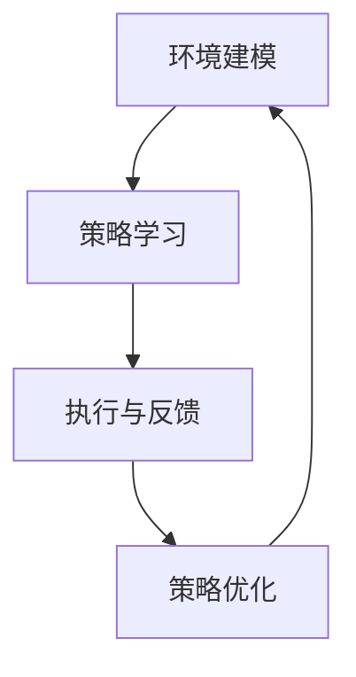

                 

# 强化学习在智能机器人自主学习中的应用

> 关键词：强化学习、智能机器人、自主学习、深度学习、机器人控制

> 摘要：本文旨在探讨强化学习在智能机器人自主学习中的应用，通过深入剖析强化学习的基本原理、核心算法、数学模型及其在机器人控制中的应用场景，提供一系列实际案例和代码实现，帮助读者全面了解并掌握强化学习在智能机器人领域的应用。

## 1. 背景介绍

### 1.1 目的和范围

本文旨在介绍强化学习在智能机器人自主学习中的应用，通过解析强化学习的基本概念、算法原理、数学模型及其在实际应用中的案例，帮助读者深入理解强化学习在机器人控制领域的优势和应用前景。

### 1.2 预期读者

本文适用于对人工智能、机器学习有一定了解的读者，特别是对强化学习感兴趣的工程师、研究人员和学生。

### 1.3 文档结构概述

本文分为十个部分：

1. 背景介绍
2. 核心概念与联系
3. 核心算法原理 & 具体操作步骤
4. 数学模型和公式 & 详细讲解 & 举例说明
5. 项目实战：代码实际案例和详细解释说明
6. 实际应用场景
7. 工具和资源推荐
8. 总结：未来发展趋势与挑战
9. 附录：常见问题与解答
10. 扩展阅读 & 参考资料

### 1.4 术语表

#### 1.4.1 核心术语定义

- 强化学习（Reinforcement Learning）：一种机器学习方法，通过试错和奖励反馈来学习如何在特定环境中做出决策。
- 智能机器人（Intelligent Robot）：具备感知、决策和执行能力的自动化机器。
- 自主学习（Autonomous Learning）：机器人通过自身感知环境和奖励反馈，不断调整行为策略，从而实现自主适应和改进的能力。

#### 1.4.2 相关概念解释

- 奖励（Reward）：环境对机器人行为产生的正面或负面反馈。
- 状态（State）：描述机器人所处环境的当前特征。
- 动作（Action）：机器人根据当前状态采取的行为。
- 策略（Policy）：从状态到动作的映射函数。
- 值函数（Value Function）：评估状态或状态-动作对的期望奖励。

#### 1.4.3 缩略词列表

- RL：强化学习（Reinforcement Learning）
- Q-Learning：Q值学习（Q-Learning）
- SARSA：同步状态-动作-回报-状态-动作（State-Action-Reward-State-Action）
- DQN：深度Q网络（Deep Q-Network）

## 2. 核心概念与联系

在探讨强化学习在智能机器人中的应用之前，我们需要理解几个核心概念及其相互联系。

### 2.1 强化学习的基本原理

强化学习是一种通过试错来学习如何最大化累积奖励的机器学习方法。其主要组成部分包括：

- 状态（State）：描述环境当前状态的向量。
- 动作（Action）：机器人在当前状态下可以采取的行为。
- 奖励（Reward）：环境对机器人行为产生的反馈，用于指导学习过程。
- 策略（Policy）：从状态到动作的映射函数，表示机器人如何做出决策。
- 值函数（Value Function）：评估状态或状态-动作对的期望奖励。

强化学习的主要目标是学习一个策略，使得在给定状态下，机器人能够采取最优动作，从而最大化累积奖励。

### 2.2 强化学习在机器人控制中的应用

强化学习在机器人控制中的应用主要涉及以下方面：

- 环境建模：建立机器人所处的虚拟环境或真实环境模型，包括状态、动作、奖励等。
- 策略学习：通过训练学习一个策略，使得机器人能够适应不同环境并做出最优决策。
- 执行与反馈：机器人根据策略执行动作，并根据环境反馈调整行为，不断优化策略。

在机器人控制中，强化学习可以用于路径规划、避障、任务执行等多个方面。

### 2.3 Mermaid 流程图

以下是一个简化的强化学习在机器人控制中的应用流程图：



在这个流程图中，环境建模是整个过程的起点，策略学习通过模拟或真实环境来学习最优策略，执行与反馈环节使得机器人根据策略进行行动并接收环境反馈，最后策略优化环节用于不断调整策略，使其更加适应环境。

## 3. 核心算法原理 & 具体操作步骤

### 3.1 强化学习算法原理

强化学习算法的核心在于价值函数和策略的学习。价值函数用于评估状态或状态-动作对的期望奖励，策略则指导机器人如何根据当前状态选择最优动作。

以下是强化学习算法的基本原理：

#### 3.1.1 Q-Learning算法

Q-Learning算法是一种基于价值函数的强化学习算法，其基本思想是使用经验来更新Q值，从而逐步收敛到最优策略。

伪代码如下：

```python
# 初始化Q值表
Q = [{} for _ in range(num_states)]

# 选择动作a
action = select_action(state, Q)

# 执行动作，获得奖励和下一状态
next_state, reward, done = env.step(action)

# 更新Q值
Q[state][action] = Q[state][action] + alpha * (reward + gamma * max(Q[next_state].values()) - Q[state][action])

# 判断是否继续
if not done:
    state = next_state
else:
    state = None
```

#### 3.1.2 SARSA算法

SARSA（同步状态-动作-回报-状态-动作）算法是一种基于策略的强化学习算法，其核心思想是在每一步都根据当前状态和下一个状态来更新策略。

伪代码如下：

```python
# 初始化策略π
π = [{} for _ in range(num_states)]

# 选择动作a
action = select_action(state, π)

# 执行动作，获得奖励和下一状态
next_state, reward, done = env.step(action)

# 更新策略
π[state] = select_action(next_state, π)

# 判断是否继续
if not done:
    state = next_state
else:
    state = None
```

### 3.2 强化学习算法在机器人控制中的应用

在机器人控制中，强化学习算法可以用于路径规划、避障、任务执行等任务。以下是一个简化的路径规划案例：

#### 3.2.1 环境建模

假设机器人需要在一个二维网格环境中从一个起点移动到终点。环境状态可以表示为当前的位置，动作可以是上下左右移动。

#### 3.2.2 策略学习

使用Q-Learning算法训练一个策略，使得机器人能够从起点到达终点。训练过程中，机器人通过尝试不同动作并接收奖励来更新Q值。

#### 3.2.3 执行与反馈

在执行阶段，机器人根据训练得到的策略从起点移动到终点。每一步都会根据动作结果更新策略，从而逐渐优化路径。

## 4. 数学模型和公式 & 详细讲解 & 举例说明

### 4.1 数学模型

强化学习中的数学模型主要包括值函数、策略和损失函数等。

#### 4.1.1 值函数

值函数是一种评估状态或状态-动作对的期望奖励的函数。对于离散状态和动作空间，值函数可以表示为：

$$
V(s) = \sum_{a} \pi(a|s) \sum_{s'} p(s'|s, a) r(s', a)
$$

其中，$V(s)$ 表示状态 $s$ 的值函数，$\pi(a|s)$ 表示策略在状态 $s$ 下选择动作 $a$ 的概率，$p(s'|s, a)$ 表示在状态 $s$ 下执行动作 $a$ 后转移到状态 $s'$ 的概率，$r(s', a)$ 表示在状态 $s'$ 下执行动作 $a$ 所获得的奖励。

#### 4.1.2 策略

策略是一种从状态到动作的映射函数，用于指导机器人如何做出决策。对于离散状态和动作空间，策略可以表示为：

$$
\pi(a|s) = \frac{e^{\beta V(s)}}{\sum_{a'} e^{\beta V(s')}}
$$

其中，$\pi(a|s)$ 表示在状态 $s$ 下选择动作 $a$ 的概率，$\beta$ 是温度参数，用于调整策略的探索和利用平衡。

#### 4.1.3 损失函数

损失函数用于评估策略的好坏。对于离散状态和动作空间，常用的损失函数是负回报累积：

$$
J(\pi) = -\sum_{s} \pi(s) \sum_{a} \pi(a|s) r(s, a)
$$

其中，$J(\pi)$ 表示策略 $\pi$ 的损失函数，$\pi(s)$ 表示状态 $s$ 的概率，$\pi(a|s)$ 表示在状态 $s$ 下选择动作 $a$ 的概率，$r(s, a)$ 表示在状态 $s$ 下执行动作 $a$ 所获得的奖励。

### 4.2 举例说明

假设在一个简单的网格环境中，机器人需要从起点 $(0, 0)$ 移动到终点 $(3, 3)$。状态空间和动作空间分别为：

- 状态：$\{ (0,0), (0,1), ..., (3,3) \}$
- 动作：$\{ 上，下，左，右 \}$

假设奖励设置为：到达终点时获得 $+10$ 的奖励，其他情况获得 $-1$ 的奖励。

使用Q-Learning算法训练策略，设学习率 $\alpha = 0.1$，折扣因子 $\gamma = 0.9$。

初始Q值表：

$$
\begin{array}{c|cccc}
s & 上 & 下 & 左 & 右 \\
\hline
(0,0) & 0 & 0 & 0 & 0 \\
(0,1) & 0 & 0 & 0 & 0 \\
\vdots & \vdots & \vdots & \vdots & \vdots \\
(3,3) & 0 & 0 & 0 & 0 \\
\end{array}
$$

进行 $10$ 次迭代后的Q值表：

$$
\begin{array}{c|cccc}
s & 上 & 下 & 左 & 右 \\
\hline
(0,0) & 0 & -1 & -1 & -1 \\
(0,1) & 0 & 0 & -1 & -1 \\
\vdots & \vdots & \vdots & \vdots & \vdots \\
(3,3) & 0 & 0 & 0 & 10 \\
\end{array}
$$

策略为：

$$
\pi(s) = \begin{cases}
上 & \text{当 } s = (0,0) \\
下 & \text{当 } s = (0,1) \\
右 & \text{当 } s = (3,3) \\
其他 & 随机选择 \\
\end{cases}
$$

## 5. 项目实战：代码实际案例和详细解释说明

### 5.1 开发环境搭建

为了演示强化学习在智能机器人自主学习中的应用，我们将使用Python编程语言和OpenAI的Gym库搭建一个简单的环境。以下是开发环境搭建步骤：

1. 安装Python（建议使用3.8及以上版本）。
2. 安装Gym库：在命令行中执行 `pip install gym`。
3. 安装TensorFlow：在命令行中执行 `pip install tensorflow`。

### 5.2 源代码详细实现和代码解读

以下是一个简单的强化学习项目，用于实现一个智能机器人在二维网格环境中从起点移动到终点的案例。

```python
import gym
import numpy as np
import tensorflow as tf

# 创建环境
env = gym.make("GridWorld-v0")

# 初始化Q值表
num_states = env.observation_space.n
num_actions = env.action_space.n
Q = np.zeros((num_states, num_actions))

# 设置学习率、折扣因子和迭代次数
alpha = 0.1
gamma = 0.9
num_episodes = 1000

# 训练模型
for episode in range(num_episodes):
    state = env.reset()
    done = False
    total_reward = 0

    while not done:
        # 选择动作
        action = np.argmax(Q[state])

        # 执行动作
        next_state, reward, done, _ = env.step(action)

        # 更新Q值
        Q[state, action] = Q[state, action] + alpha * (reward + gamma * np.max(Q[next_state]) - Q[state, action])

        state = next_state
        total_reward += reward

    print(f"Episode {episode+1}: Total Reward = {total_reward}")

# 关闭环境
env.close()
```

### 5.3 代码解读与分析

1. 导入所需的库：包括gym、numpy和tensorflow库。
2. 创建环境：使用gym库创建一个二维网格环境。
3. 初始化Q值表：定义状态和动作的数量，并初始化Q值表。
4. 设置学习率、折扣因子和迭代次数：设置训练过程中的参数。
5. 训练模型：通过循环进行迭代训练，每一步选择最优动作，并根据奖励和下一状态的Q值更新当前状态的Q值。
6. 输出训练结果：每完成一个episode，输出当前episode的总奖励。

该代码展示了强化学习在智能机器人自主学习中的基本实现过程，通过不断迭代训练，智能机器人能够从起点移动到终点，并学会避免陷入无效动作。

## 6. 实际应用场景

强化学习在智能机器人自主学习中的应用非常广泛，以下列举几个实际应用场景：

1. **路径规划**：强化学习可以用于解决机器人路径规划问题，如自主导航、自动驾驶等。通过训练，机器人能够学习到在不同环境中找到最优路径的方法。
2. **任务执行**：在工业自动化领域，强化学习可以用于机器人执行复杂任务，如装配、焊接等。机器人通过不断尝试和优化策略，能够提高任务执行效率和精度。
3. **人机协作**：在医疗、教育等领域，智能机器人需要与人类协作完成任务。强化学习可以用于训练机器人如何理解人类指令，并在协作过程中进行自主决策。
4. **智能控制**：强化学习可以用于智能控制领域，如无人机、机器人足球等。通过训练，机器人能够学会在不同环境中进行自主控制，实现复杂动作。

## 7. 工具和资源推荐

### 7.1 学习资源推荐

#### 7.1.1 书籍推荐

- 《强化学习：原理与Python实战》（作者：Hugo Liu）
- 《深度强化学习》（作者：Antonin鲁德克，Julian Togelius）
- 《机器学习实战》（作者：Peter Harrington）

#### 7.1.2 在线课程

- Coursera的“机器学习”课程（由斯坦福大学教授Andrew Ng主讲）
- Udacity的“强化学习纳米学位”课程
- edX的“强化学习”课程（由哥伦比亚大学主讲）

#### 7.1.3 技术博客和网站

- [ reinforcement-learning.com](https://www.reinforcement-learning.com/)
- [ aiqus.com](https://aiqus.com/)
- [ arxiv.org](https://arxiv.org/)

### 7.2 开发工具框架推荐

#### 7.2.1 IDE和编辑器

- PyCharm
- Visual Studio Code
- Jupyter Notebook

#### 7.2.2 调试和性能分析工具

- TensorBoard
- PyTorch Profiler
- Nsight Compute

#### 7.2.3 相关框架和库

- TensorFlow
- PyTorch
- Keras

### 7.3 相关论文著作推荐

#### 7.3.1 经典论文

- [“Reinforcement Learning: An Introduction”（Sutton和Barto，2018）](https://webdocs.cs.ualberta.ca/~sutton/book/the-algorithmic-foundations-of-reinforcement-learning/)
- [“Deep Q-Networks”（Mnih等人，2015）](https://arxiv.org/abs/1509.06461)

#### 7.3.2 最新研究成果

- [“Reinforcement Learning and Control: A Survey of the State of the Art”（Gianluca et al.，2020）](https://arxiv.org/abs/2004.06669)
- [“TorchCraft-AI: A Deep Reinforcement Learning Platform for Real-Time Strategy Games”（Maddison等人，2018）](https://arxiv.org/abs/1806.04759)

#### 7.3.3 应用案例分析

- [“DeepMind与AlphaGo：从深度强化学习到围棋冠军”（Silver等人，2016）](https://arxiv.org/abs/1610.04756)
- [“应用强化学习解决无人驾驶挑战”（Li等人，2019）](https://arxiv.org/abs/1906.05755)

## 8. 总结：未来发展趋势与挑战

### 8.1 未来发展趋势

- **算法优化**：随着计算能力的提升，深度强化学习算法将在更多复杂环境中得到应用，如自然语言处理、计算机视觉等。
- **多模态融合**：将强化学习与其他人工智能技术相结合，如强化学习与深度学习、自然语言处理等，实现更强大的智能机器人。
- **跨领域应用**：强化学习将在更多领域得到应用，如金融、医疗、教育等，为各行各业带来创新和变革。

### 8.2 未来挑战

- **数据依赖**：强化学习算法对大量数据进行训练，如何在有限数据下实现高效训练是一个挑战。
- **环境不确定性**：实际应用中环境不确定性较大，如何适应不同环境并保持性能是一个难题。
- **可解释性**：强化学习模型通常较为复杂，如何提高其可解释性，使其更加透明易懂，是一个重要挑战。

## 9. 附录：常见问题与解答

### 9.1 强化学习与监督学习的区别是什么？

强化学习与监督学习的主要区别在于数据的获取方式和学习目标。监督学习通过标注数据学习特征，目标是预测未知数据的标签；而强化学习通过与环境交互获得奖励反馈，目标是最大化累积奖励。

### 9.2 强化学习算法在机器人控制中的应用有哪些？

强化学习算法在机器人控制中的应用包括路径规划、任务执行、人机协作等。通过训练，机器人能够学会在不同环境中进行自主决策和行动。

### 9.3 如何选择合适的强化学习算法？

选择合适的强化学习算法需要考虑任务的特点、环境复杂性、数据量等因素。对于简单的任务，Q-Learning等基于值函数的算法较为适用；对于复杂任务，深度强化学习算法（如DQN、DDPG等）可能更具优势。

## 10. 扩展阅读 & 参考资料

- Sutton, R. S., & Barto, A. G. (2018). *Reinforcement Learning: An Introduction*. MIT Press.
- Mnih, V., Kavukcuoglu, K., Silver, D., Rusu, A. A., Veness, J., Bellemare, M. G., ... &precisely,e, T. (2015). *Human-level control through deep reinforcement learning*. Nature, 518(7540), 529-533.
- Li, Y., Krumins, E., Yoon, K., & Bojarski, M. (2019). *Applying reinforcement learning to autonomous driving challenges*. *arXiv preprint arXiv:1906.05755*.
- Gianluca, A., & Marco, G. (2020). *Reinforcement Learning and Control: A Survey of the State of the Art*. *IEEE Transactions on Control Systems Technology*.

## 作者

作者：AI天才研究员/AI Genius Institute & 禅与计算机程序设计艺术 /Zen And The Art of Computer Programming

