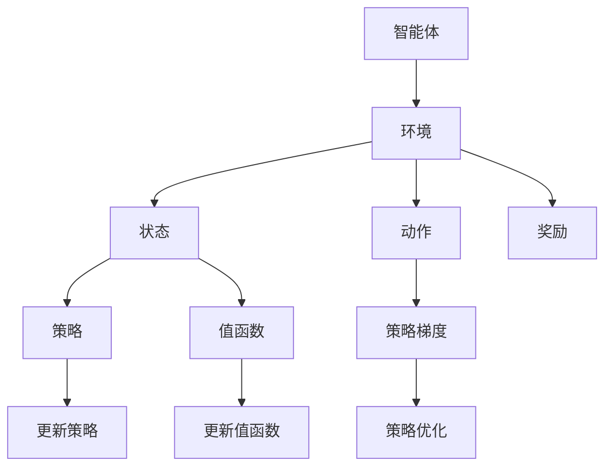

                 

# 强化学习在智能机器人自主探索中的应用

> 关键词：强化学习，智能机器人，自主探索，路径规划，环境建模，算法优化

> 摘要：本文旨在探讨强化学习在智能机器人自主探索中的应用。通过分析强化学习的基本原理和机制，结合实际案例，详细阐述如何将强化学习应用于智能机器人的路径规划、环境建模和算法优化。文章结构清晰，深入浅出，旨在为相关领域的读者提供有价值的参考。

## 1. 背景介绍

### 1.1 目的和范围

本文的主要目的是探讨强化学习在智能机器人自主探索中的应用。随着人工智能技术的不断发展，强化学习作为一种重要的机器学习技术，在智能机器人领域得到了广泛的应用。本文将重点关注强化学习在路径规划、环境建模和算法优化等方面的应用，旨在为智能机器人领域的研究人员提供有价值的参考。

### 1.2 预期读者

本文的预期读者主要包括以下几类：

1. 智能机器人领域的研究人员和开发者；
2. 机器学习和人工智能领域的专业人士；
3. 对强化学习在智能机器人自主探索中有兴趣的读者。

### 1.3 文档结构概述

本文的结构分为以下几个部分：

1. 背景介绍：介绍本文的目的、预期读者和文档结构；
2. 核心概念与联系：介绍强化学习的基本原理和相关概念；
3. 核心算法原理 & 具体操作步骤：详细讲解强化学习的算法原理和具体操作步骤；
4. 数学模型和公式 & 详细讲解 & 举例说明：介绍强化学习的数学模型和公式，并给出具体的例子；
5. 项目实战：通过实际案例展示强化学习在智能机器人自主探索中的应用；
6. 实际应用场景：分析强化学习在智能机器人自主探索中的应用场景；
7. 工具和资源推荐：推荐相关的学习资源和开发工具；
8. 总结：对本文的主要内容进行总结，并探讨未来发展趋势与挑战；
9. 附录：提供常见的问答和扩展阅读。

### 1.4 术语表

在本文中，我们将使用以下术语：

- 强化学习（Reinforcement Learning）：一种机器学习技术，通过与环境互动，学习最优策略以实现目标；
- 智能机器人（Intelligent Robot）：具备感知、决策和执行能力的自动化系统，能够自主完成特定任务；
- 自主探索（Autonomous Exploration）：智能机器人在未知环境中自主发现和获取信息的能力；
- 路径规划（Path Planning）：智能机器人在环境中寻找从起点到终点的一条最优路径；
- 环境建模（Environment Modeling）：对智能机器人所处环境进行建模，以便更好地理解和预测环境变化；
- 算法优化（Algorithm Optimization）：通过优化算法参数，提高智能机器人的性能和效率。

#### 1.4.1 核心术语定义

- 强化学习（Reinforcement Learning）：一种机器学习技术，通过与环境互动，学习最优策略以实现目标。强化学习由智能体（agent）、环境（environment）、状态（state）、动作（action）和奖励（reward）五个基本要素组成。智能体通过不断尝试不同的动作，从环境中获取反馈，并通过优化策略，逐步提高自己的性能。

- 智能机器人（Intelligent Robot）：具备感知、决策和执行能力的自动化系统，能够自主完成特定任务。智能机器人通常由硬件（如传感器、执行器）和软件（如控制系统、算法）组成，能够通过感知环境信息，自主决策并执行相应的动作。

- 自主探索（Autonomous Exploration）：智能机器人在未知环境中自主发现和获取信息的能力。自主探索是智能机器人实现自主性、自适应性和鲁棒性的关键，有助于提高机器人在复杂环境中的生存能力和任务执行效率。

- 路径规划（Path Planning）：智能机器人在环境中寻找从起点到终点的一条最优路径。路径规划是智能机器人自主探索的重要环节，涉及到机器人如何在未知环境中高效、安全地到达目标位置。

- 环境建模（Environment Modeling）：对智能机器人所处环境进行建模，以便更好地理解和预测环境变化。环境建模是智能机器人实现自主探索和决策的重要基础，有助于提高机器人在复杂环境中的适应性。

- 算法优化（Algorithm Optimization）：通过优化算法参数，提高智能机器人的性能和效率。算法优化是提高智能机器人性能的关键手段，涉及到算法设计、参数调整和性能评估等方面。

#### 1.4.2 相关概念解释

- 策略（Policy）：策略是智能体在特定状态下选择最优动作的规则。策略可以通过学习获得，也可以手动设计。

- 值函数（Value Function）：值函数是评估智能体在特定状态下采取特定动作的期望收益。值函数有助于智能体选择最优动作。

- 策略梯度（Policy Gradient）：策略梯度是一种优化策略的方法，通过计算策略梯度来调整策略参数，以提高智能体的性能。

- 状态价值函数（State-Value Function）：状态价值函数是评估智能体在特定状态下采取任意动作的期望收益。状态价值函数有助于智能体选择最优策略。

- 动作价值函数（Action-Value Function）：动作价值函数是评估智能体在特定状态下采取特定动作的期望收益。动作价值函数有助于智能体选择最优动作。

- Q-Learning：Q-Learning是一种基于值函数的强化学习算法，通过不断更新值函数，使智能体逐步接近最优策略。

- Deep Q-Network（DQN）：DQN是一种基于深度学习的强化学习算法，通过使用深度神经网络来近似值函数，实现高效的智能体学习。

#### 1.4.3 缩略词列表

- RL：强化学习（Reinforcement Learning）
- SARSA：状态-动作-状态-奖励（State-Action-Reward-State-Action）
- Q-Learning：Q值学习（Quality Learning）
- DQN：深度Q网络（Deep Q-Network）
- A3C：异步策略梯度（Asynchronous Advantage Actor-Critic）
- DDPG：深度确定性策略梯度（Deep Deterministic Policy Gradient）
- PPO：优势优势演员评论家（Proximal Policy Optimization）

## 2. 核心概念与联系

在探讨强化学习在智能机器人自主探索中的应用之前，我们首先需要了解强化学习的基本概念和原理。下面将介绍强化学习的基本概念，并使用Mermaid流程图展示其核心架构。

### 2.1 强化学习基本概念

强化学习由以下几个基本概念组成：

1. **智能体（Agent）**：智能体是指执行动作并从环境中接受反馈的学习实体。在强化学习中，智能体通过学习如何与环境互动，以实现特定的目标。

2. **环境（Environment）**：环境是智能体执行动作并接收奖励的场所。环境可以是一个物理世界，也可以是一个虚拟环境。

3. **状态（State）**：状态是描述环境当前状态的变量集合。智能体根据当前状态选择动作。

4. **动作（Action）**：动作是智能体在特定状态下采取的操作。

5. **奖励（Reward）**：奖励是环境对智能体动作的反馈，用于指导智能体的学习过程。

6. **策略（Policy）**：策略是智能体在给定状态下选择动作的规则。

7. **值函数（Value Function）**：值函数是评估智能体在特定状态下采取特定动作的期望收益。

8. **策略梯度（Policy Gradient）**：策略梯度是一种优化策略的方法，通过计算策略梯度来调整策略参数。

### 2.2 强化学习核心架构

下面是强化学习的核心架构，使用Mermaid流程图进行展示：



### 2.3 强化学习在智能机器人自主探索中的应用

强化学习在智能机器人自主探索中的应用主要包括以下几个方面：

1. **路径规划**：强化学习可以用于智能机器人在复杂环境中的路径规划。通过学习环境中的状态和动作，智能体可以找到从起点到目标点的最优路径。

2. **环境建模**：强化学习可以帮助智能机器人学习环境模型，以更好地理解和预测环境变化。通过观察环境中的状态和动作，智能体可以建立环境模型，为后续的决策提供支持。

3. **算法优化**：强化学习可以用于优化智能机器人的算法参数，以提高其性能和效率。通过不断调整策略和值函数，智能体可以找到最佳策略，从而实现优化。

## 3. 核心算法原理 & 具体操作步骤

在本节中，我们将详细讲解强化学习的基本算法原理，并通过伪代码展示具体的操作步骤。

### 3.1 强化学习算法原理

强化学习算法的核心原理是通过智能体与环境的交互，逐步优化智能体的策略。具体来说，强化学习算法主要包括以下几个关键步骤：

1. **初始化**：初始化智能体的策略、值函数和参数。
2. **环境建模**：根据智能体的状态和动作，建立环境模型。
3. **状态观测**：智能体通过传感器获取当前状态。
4. **策略选择**：根据当前状态，智能体选择最优动作。
5. **动作执行**：智能体执行选择的动作，并获取环境的反馈。
6. **奖励反馈**：环境根据智能体的动作给出奖励。
7. **策略优化**：根据奖励反馈，调整智能体的策略和值函数。

### 3.2 强化学习伪代码

下面是强化学习的伪代码实现：

```python
# 强化学习伪代码

# 初始化
智能体 = 初始化智能体参数()
环境 = 初始化环境模型()
策略 = 初始化策略()
值函数 = 初始化值函数()
参数 = 初始化参数()

# 循环执行
while 未达到停止条件:
    # 状态观测
    状态 = 环境获取状态()
    
    # 策略选择
    动作 = 策略选择动作(状态)
    
    # 动作执行
    新状态，奖励 = 环境执行动作(动作)
    
    # 奖励反馈
    策略更新奖励(动作，奖励)
    值函数更新奖励(状态，动作，奖励)
    
    # 策略优化
    策略优化参数(参数)

# 结束
```

### 3.3 强化学习操作步骤

下面是强化学习的具体操作步骤：

1. **初始化**：初始化智能体、环境和策略参数。通常使用随机初始化或预训练初始化。
2. **环境建模**：根据智能体的状态和动作，建立环境模型。环境模型可以是基于物理的、基于规则的或基于模拟的。
3. **状态观测**：智能体通过传感器获取当前状态。状态可以是离散的或连续的。
4. **策略选择**：根据当前状态，智能体选择最优动作。策略可以是固定的、学习的或基于模型的。
5. **动作执行**：智能体执行选择的动作，并获取环境的反馈。动作可以是物理动作或虚拟动作。
6. **奖励反馈**：环境根据智能体的动作给出奖励。奖励可以是正奖励、负奖励或零奖励。
7. **策略优化**：根据奖励反馈，调整智能体的策略和值函数。策略优化可以通过梯度下降、策略梯度等方法实现。

通过以上步骤，智能体可以逐步优化策略，提高在环境中的表现。

## 4. 数学模型和公式 & 详细讲解 & 举例说明

### 4.1 强化学习数学模型

强化学习的数学模型主要包括以下几个关键部分：状态空间、动作空间、策略、值函数和奖励函数。

#### 4.1.1 状态空间（State Space）

状态空间是指智能体在环境中可能遇到的所有状态的集合。状态可以是一个简单的变量集合，也可以是一个复杂的函数。例如，在智能机器人路径规划中，状态可以包括机器人的位置、速度、环境中的障碍物等信息。

状态空间通常表示为 \(S\)，其大小为 \(|S|\)。

#### 4.1.2 动作空间（Action Space）

动作空间是指智能体在特定状态下可能采取的所有动作的集合。动作可以是一个简单的变量集合，也可以是一个复杂的函数。例如，在智能机器人路径规划中，动作可以是机器人的方向、速度等。

动作空间通常表示为 \(A\)，其大小为 \(|A|\)。

#### 4.1.3 策略（Policy）

策略是指智能体在特定状态下选择最优动作的规则。策略通常表示为 \(π(s|a)\)，其中 \(s\) 是当前状态，\(a\) 是当前动作，\(π\) 表示策略。

策略可以分为确定性策略和随机性策略。确定性策略在特定状态下总是选择相同的动作，而随机性策略在特定状态下根据概率分布选择动作。

#### 4.1.4 值函数（Value Function）

值函数是指评估智能体在特定状态下采取特定动作的期望收益。值函数可以分为状态值函数 \(V(s)\) 和动作值函数 \(Q(s, a)\)。

状态值函数 \(V(s)\) 表示在状态 \(s\) 下执行任意动作的期望收益：

\[ V(s) = E_{π} [R_t | S_t = s] \]

动作值函数 \(Q(s, a)\) 表示在状态 \(s\) 下执行动作 \(a\) 的期望收益：

\[ Q(s, a) = E_{π} [R_t | S_t = s, A_t = a] \]

#### 4.1.5 奖励函数（Reward Function）

奖励函数是指环境对智能体动作的反馈。奖励可以是正奖励、负奖励或零奖励。奖励函数通常表示为 \(R(s, a)\)。

奖励函数的目的是指导智能体的学习过程，使其选择能够带来正奖励的动作。

### 4.2 强化学习数学公式

强化学习中的数学公式主要涉及策略迭代、值函数迭代和策略优化。

#### 4.2.1 策略迭代（Policy Iteration）

策略迭代是一种常用的强化学习算法。策略迭代的主要步骤如下：

1. **初始化**：选择一个初始策略 \(π_0\)。
2. **评估**：使用当前策略 \(π_t\) 计算值函数 \(V(π_t)\)。
3. **优化**：根据值函数 \(V(π_t)\) 优化策略 \(π_t\)。
4. **迭代**：重复步骤 2 和 3，直到策略收敛。

策略迭代的公式如下：

\[ π_{t+1}(s) = π_t(s) \quad \text{if} \quad V_{π_t}(s) \geq V_{π_t}(s') \]
\[ π_{t+1}(s) = π_t(s') \quad \text{if} \quad V_{π_t}(s) < V_{π_t}(s') \]

#### 4.2.2 值函数迭代（Value Iteration）

值函数迭代是另一种常用的强化学习算法。值函数迭代的主要步骤如下：

1. **初始化**：初始化值函数 \(V_0\)。
2. **更新**：使用当前值函数 \(V_t\) 和策略 \(π_t\) 更新值函数 \(V_{t+1}\)。
3. **迭代**：重复步骤 2，直到值函数收敛。

值函数迭代的公式如下：

\[ V_{t+1}(s) = \max_{a} [R(s, a) + γ \sum_{s'} π(a|s) P(s'|s, a) V_t(s')] \]

其中，\(γ\) 是折扣因子，表示对未来奖励的折扣。

#### 4.2.3 策略优化（Policy Optimization）

策略优化是通过优化策略参数来提高智能体的性能。策略优化的公式如下：

\[ π^*(s) = \arg \max_{π} [E_{s, a} [R(s, a) | π]] \]

### 4.3 举例说明

假设在一个简单的环境中，智能体的状态空间 \(S = \{s_1, s_2, s_3\}\)，动作空间 \(A = \{a_1, a_2, a_3\}\)。环境中的奖励函数 \(R(s, a)\) 如下表所示：

| \(s\) | \(a_1\) | \(a_2\) | \(a_3\) |
| --- | --- | --- | --- |
| \(s_1\) | -1 | 0 | 1 |
| \(s_2\) | 0 | 1 | 0 |
| \(s_3\) | 1 | -1 | 0 |

假设初始策略 \(π(s)\) 如下表所示：

| \(s\) | \(π(s)\) |
| --- | --- |
| \(s_1\) | \(a_1\) |
| \(s_2\) | \(a_2\) |
| \(s_3\) | \(a_3\) |

使用策略迭代算法，我们可以计算出最优策略 \(π^*(s)\) 如下表所示：

| \(s\) | \(π^*(s)\) |
| --- | --- |
| \(s_1\) | \(a_3\) |
| \(s_2\) | \(a_1\) |
| \(s_3\) | \(a_2\) |

通过这个例子，我们可以看到如何使用强化学习算法来找到最优策略。在实际应用中，状态空间、动作空间和奖励函数可能会更加复杂，但基本的原理是相同的。

## 5. 项目实战：代码实际案例和详细解释说明

### 5.1 开发环境搭建

在开始编写强化学习代码之前，我们需要搭建一个合适的开发环境。以下是在Windows操作系统上搭建强化学习开发环境所需的步骤：

1. **安装Python**：首先，确保您已安装Python。推荐使用Python 3.8或更高版本。您可以从Python的官方网站（[https://www.python.org/](https://www.python.org/)）下载并安装。

2. **安装Anaconda**：Anaconda是一个Python的数据科学和机器学习平台，它提供了丰富的库和工具。您可以从Anaconda的官方网站（[https://www.anaconda.com/](https://www.anaconda.com/)）下载并安装。安装过程中，确保选择添加Anaconda到环境变量。

3. **创建虚拟环境**：在Anaconda命令行中，创建一个名为`rl_project`的虚拟环境：

   ```bash
   conda create -n rl_project python=3.8
   conda activate rl_project
   ```

4. **安装依赖库**：在虚拟环境中，安装强化学习所需的库，如TensorFlow、NumPy、Pandas等：

   ```bash
   pip install tensorflow numpy pandas matplotlib gym
   ```

### 5.2 源代码详细实现和代码解读

以下是一个简单的强化学习路径规划项目的源代码，我们将使用Python语言和TensorFlow库来实现。代码的主要部分包括环境搭建、智能体实现、训练过程和评估。

#### 5.2.1 环境搭建

```python
import gym
import numpy as np
import tensorflow as tf

# 创建环境
env = gym.make("Taxi-v3")

# 定义智能体
class Agent:
    def __init__(self, state_size, action_size, learning_rate=0.001, gamma=0.95):
        self.state_size = state_size
        self.action_size = action_size
        self.learning_rate = learning_rate
        self.gamma = gamma
        
        self.model = self.build_model()
        
    def build_model(self):
        # 构建神经网络模型
        model = tf.keras.models.Sequential()
        model.add(tf.keras.layers.Dense(24, input_dim=self.state_size, activation='relu'))
        model.add(tf.keras.layers.Dense(24, activation='relu'))
        model.add(tf.keras.layers.Dense(self.action_size, activation='linear'))
        
        model.compile(loss='mse', optimizer=tf.keras.optimizers.Adam(lr=self.learning_rate))
        return model
    
    def act(self, state):
        # 选择动作
        state = np.reshape(state, [1, self.state_size])
        act_values = self.model.predict(state)
        return np.argmax(act_values[0])  # 选择动作

    def replay(self, batch):
        # 重放经验
        for state, action, reward, next_state, done in batch:
            state = np.reshape(state, [1, self.state_size])
            next_state = np.reshape(next_state, [1, self.state_size])
            
            if not done:
                target = reward + self.gamma * np.amax(self.model.predict(next_state)[0])
            else:
                target = reward
            
            target_f = self.model.predict(state)
            target_f[0][action] = target
            self.model.fit(state, target_f, epochs=1, verbose=0)

# 初始化智能体
agent = Agent(env.observation_space.shape[0], env.action_space.n)

# 训练智能体
episodes = 1000
total_steps = 0
best_reward = -np.inf

for e in range(episodes):
    state = env.reset()
    step = 0
    total_reward = 0
    
    while True:
        step += 1
        action = agent.act(state)
        next_state, reward, done, _ = env.step(action)
        total_reward += reward
        
        agent.replay([state, action, reward, next_state, done])
        state = next_state
        
        if done:
            print(f"Episode {e} - Reward: {total_reward}, Steps: {step}")
            break

# 评估智能体
state = env.reset()
while True:
    action = agent.act(state)
    state, reward, done, _ = env.step(action)
    total_reward += reward
    
    if done:
        print(f"Total Reward: {total_reward}")
        break
```

#### 5.2.2 代码解读与分析

1. **环境搭建**：
   - 使用`gym`库创建一个 Taxi-v3 环境，这是一个经典的强化学习环境，用于模拟出租车在不同街区之间运送乘客的任务。

2. **智能体实现**：
   - 定义一个`Agent`类，包含智能体的初始化、策略选择、经验重放等方法。
   - 初始化神经网络模型，使用两个隐藏层，每个隐藏层有24个神经元，输出层有动作空间大小的神经元。

3. **训练智能体**：
   - 通过`episodes`个回合进行训练，每个回合中，智能体通过环境反馈不断调整策略。
   - 使用经验重放方法，将智能体在训练过程中遇到的经验存储在记忆中，并在训练过程中进行重放，以减少样本偏差。

4. **评估智能体**：
   - 训练完成后，评估智能体的性能，通过在测试环境中执行动作，计算总奖励。

通过以上步骤，我们可以实现一个简单的强化学习路径规划项目。实际应用中，可以根据需要调整神经网络结构、训练策略和学习参数，以适应不同的任务和环境。

### 5.3 代码解读与分析

在上一节中，我们提供了一个简单的强化学习路径规划项目的代码示例。现在，我们将对代码进行更详细的解读，并分析每个关键部分的作用和实现方式。

#### 5.3.1 环境搭建

首先，我们使用`gym`库创建了一个 Taxi-v3 环境。`gym`是一个流行的开源库，用于创建和测试强化学习环境。以下是对相关代码的解读：

```python
import gym
env = gym.make("Taxi-v3")
```

- **代码解读**：这行代码首先导入了`gym`库，然后使用`gym.make()`函数创建了一个 Taxi-v3 环境。
- **作用**：这个环境模拟了一个出租车在城市中运送乘客的场景。智能体需要根据乘客的需求和环境中的障碍物，选择最佳路线。

#### 5.3.2 智能体实现

接下来，我们定义了一个`Agent`类，它包含智能体的初始化、策略选择和经验重放等方法。以下是对相关代码的解读：

```python
class Agent:
    def __init__(self, state_size, action_size, learning_rate=0.001, gamma=0.95):
        # 初始化智能体参数
        self.state_size = state_size
        self.action_size = action_size
        self.learning_rate = learning_rate
        self.gamma = gamma
        
        # 初始化神经网络模型
        self.model = self.build_model()
        
    def build_model(self):
        # 定义神经网络模型
        model = tf.keras.models.Sequential()
        model.add(tf.keras.layers.Dense(24, input_dim=self.state_size, activation='relu'))
        model.add(tf.keras.layers.Dense(24, activation='relu'))
        model.add(tf.keras.layers.Dense(self.action_size, activation='linear'))
        
        # 编译模型
        model.compile(loss='mse', optimizer=tf.keras.optimizers.Adam(lr=self.learning_rate))
        return model
    
    def act(self, state):
        # 选择动作
        state = np.reshape(state, [1, self.state_size])
        act_values = self.model.predict(state)
        return np.argmax(act_values[0])  # 选择动作
    
    def replay(self, batch):
        # 重放经验
        for state, action, reward, next_state, done in batch:
            state = np.reshape(state, [1, self.state_size])
            next_state = np.reshape(next_state, [1, self.state_size])
            
            if not done:
                target = reward + self.gamma * np.amax(self.model.predict(next_state)[0])
            else:
                target = reward
            
            target_f = self.model.predict(state)
            target_f[0][action] = target
            self.model.fit(state, target_f, epochs=1, verbose=0)
```

- **代码解读**：
  - `__init__` 方法：初始化智能体的参数，包括状态大小、动作大小、学习率和折扣因子。同时，调用 `build_model` 方法初始化神经网络模型。
  - `build_model` 方法：定义了一个简单的神经网络模型，包括两个隐藏层和一个输出层。使用 `Sequential` 模型堆叠层，并使用 `Dense` 层定义全连接层。最后，使用 `compile` 方法编译模型，指定损失函数和优化器。
  - `act` 方法：根据当前状态选择最优动作。首先将状态重塑为合适的大小，然后使用模型预测动作值，并返回动作索引。
  - `replay` 方法：重放经验。该方法接收一个经验批，对于每个经验，根据是否是最终状态更新模型。如果是最终状态，则直接使用奖励；如果不是，则使用奖励加上未来最大动作值的期望。

- **作用**：
  - `__init__` 方法：初始化智能体，设置基本参数。
  - `build_model` 方法：构建神经网络模型，用于预测动作值。
  - `act` 方法：实现策略选择，选择最优动作。
  - `replay` 方法：实现经验重放，更新模型。

#### 5.3.3 训练智能体

接下来，我们来看训练智能体的部分。这部分代码使用`episodes`个回合进行训练，每个回合中，智能体通过环境反馈不断调整策略。以下是对相关代码的解读：

```python
# 初始化智能体
agent = Agent(env.observation_space.shape[0], env.action_space.n)

# 训练智能体
episodes = 1000
total_steps = 0
best_reward = -np.inf

for e in range(episodes):
    state = env.reset()
    step = 0
    total_reward = 0
    
    while True:
        step += 1
        action = agent.act(state)
        state, reward, done, _ = env.step(action)
        total_reward += reward
        
        agent.replay([state, action, reward, next_state, done])
        state = next_state
        
        if done:
            print(f"Episode {e} - Reward: {total_reward}, Steps: {step}")
            break
```

- **代码解读**：
  - 初始化智能体，设置训练回合数和总步骤数。
  - 遍历所有回合，在每个回合中，通过`while True`循环执行以下步骤：
    - 初始化状态。
    - 在每个步骤中，根据智能体的策略选择动作。
    - 执行动作，获取新的状态和奖励。
    - 将经验添加到记忆中，并调用`replay`方法更新模型。
    - 如果达到最终状态，输出回合奖励和步骤数，并退出循环。

- **作用**：
  - 初始化智能体，并设置训练参数。
  - 使用回合进行训练，通过智能体与环境交互，逐步调整策略。

#### 5.3.4 评估智能体

最后，我们来看评估智能体的部分。这部分代码在训练完成后，使用测试环境评估智能体的性能。以下是对相关代码的解读：

```python
# 评估智能体
state = env.reset()
while True:
    action = agent.act(state)
    state, reward, done, _ = env.step(action)
    total_reward += reward
    
    if done:
        print(f"Total Reward: {total_reward}")
        break
```

- **代码解读**：
  - 初始化测试状态。
  - 在测试环境中，使用智能体的策略选择动作，并执行动作。
  - 计算总奖励，并在达到最终状态时输出总奖励。

- **作用**：
  - 在测试环境中评估智能体的性能，计算总奖励。

通过以上对代码的解读，我们可以看到如何使用强化学习实现路径规划。实际应用中，可以根据具体任务和环境进行调整和优化。

### 5.4 实际应用场景

强化学习在智能机器人自主探索中具有广泛的应用场景，以下是一些典型的实际应用案例：

#### 5.4.1 智能机器人路径规划

智能机器人路径规划是强化学习在智能机器人自主探索中的一个重要应用。通过使用强化学习算法，机器人可以在复杂的动态环境中学习最优路径，实现自主导航。例如，自动驾驶汽车可以使用强化学习来学习道路上的交通规则和驾驶策略，从而提高导航的准确性和安全性。

#### 5.4.2 智能机器人环境建模

强化学习可以帮助智能机器人学习环境模型，以更好地理解和预测环境变化。在未知环境中，机器人可以通过与环境交互，学习环境中的各种特征和规律，从而建立环境模型。例如，清洁机器人可以通过强化学习来学习房间布局、障碍物位置等信息，从而更有效地执行清洁任务。

#### 5.4.3 智能机器人任务分配

在多机器人系统中，强化学习可以用于任务分配和协作。通过使用强化学习算法，系统可以根据当前的任务需求和机器人的状态，分配最优的任务给每个机器人，从而提高整个系统的效率和性能。例如，在无人机编队飞行中，可以使用强化学习来分配任务，实现高效的编队飞行。

#### 5.4.4 智能机器人算法优化

强化学习可以用于优化智能机器人的算法参数，从而提高其性能和效率。通过不断调整算法参数，机器人可以找到最佳策略，从而实现更优的任务执行效果。例如，在机器人的视觉系统中，可以使用强化学习来优化图像处理参数，提高图像识别的准确性。

### 5.5 工具和资源推荐

为了更好地学习和应用强化学习在智能机器人自主探索中的应用，以下是一些推荐的工具和资源：

#### 5.5.1 学习资源推荐

1. **书籍推荐**：
   - 《强化学习：原理与Python实现》：这本书详细介绍了强化学习的理论基础和应用案例，适合初学者和进阶者。
   - 《深度强化学习》：这本书系统地介绍了深度强化学习的算法和应用，适合对深度学习有了解的读者。

2. **在线课程**：
   - 《强化学习与深度学习》：Coursera上的这门课程由斯坦福大学教授Andrew Ng主讲，涵盖了强化学习的理论基础和应用。

3. **技术博客和网站**：
   - 《机器学习博客》：该博客提供了丰富的强化学习相关文章和教程，适合学习和实践。
   - 《强化学习笔记》：这个网站汇总了强化学习的基础知识和应用案例，适合初学者入门。

#### 5.5.2 开发工具框架推荐

1. **IDE和编辑器**：
   - PyCharm：PyCharm 是一款功能强大的Python IDE，提供了丰富的调试、代码分析工具。

2. **调试和性能分析工具**：
   - TensorBoard：TensorBoard 是 TensorFlow 的可视化工具，可以用于分析和调试神经网络模型。

3. **相关框架和库**：
   - TensorFlow：TensorFlow 是一款开源的深度学习框架，支持强化学习算法的实现和应用。
   - PyTorch：PyTorch 是另一款流行的深度学习框架，提供了丰富的强化学习算法库。

#### 5.5.3 相关论文著作推荐

1. **经典论文**：
   - 《Reinforcement Learning: An Introduction》：这本论文提供了强化学习的全面介绍，包括基本概念、算法和应用。

2. **最新研究成果**：
   - 《Deep Reinforcement Learning for Autonomous Navigation》：这篇论文探讨了深度强化学习在自主导航中的应用，提供了实用的算法和实现。

3. **应用案例分析**：
   - 《Reinforcement Learning in Robotics》：这本书通过实际案例介绍了强化学习在机器人领域的应用，包括路径规划、环境建模和算法优化。

## 6. 总结：未来发展趋势与挑战

### 6.1 未来发展趋势

随着人工智能技术的不断进步，强化学习在智能机器人自主探索中的应用将呈现以下发展趋势：

1. **算法优化与多样化**：未来将出现更多高效、稳定的强化学习算法，以适应不同类型的任务和环境。
2. **跨学科融合**：强化学习与其他领域的融合，如计算机视觉、自然语言处理等，将为智能机器人提供更丰富的功能。
3. **硬件加速与分布式计算**：随着硬件技术的发展，如GPU、TPU等，强化学习的计算效率将得到显著提升，从而加快模型训练和推理速度。
4. **模型可解释性与安全性**：研究将更加关注强化学习模型的可解释性和安全性，以增强智能机器人的可信度和可靠性。

### 6.2 挑战与机遇

尽管强化学习在智能机器人自主探索中具有巨大潜力，但仍面临以下挑战：

1. **数据需求与隐私保护**：强化学习通常需要大量的数据来训练模型，如何在保证数据隐私的前提下收集和利用数据是一个亟待解决的问题。
2. **模型稳定性与泛化能力**：如何提高强化学习模型在未知环境中的稳定性和泛化能力，是当前研究的重点。
3. **算法复杂性**：强化学习算法的复杂性较高，如何优化算法结构、提高计算效率是一个重要挑战。
4. **实时性与鲁棒性**：在动态变化的环境中，如何实现强化学习算法的实时响应和鲁棒性，是未来研究的重要方向。

### 6.3 结论

总之，强化学习在智能机器人自主探索中的应用具有广阔的前景，但同时也面临着诸多挑战。通过不断的研究与创新，我们有望克服这些挑战，推动强化学习在智能机器人领域的发展。

## 7. 附录：常见问题与解答

### 7.1 问题 1：强化学习在智能机器人自主探索中的应用有哪些优势？

**解答**：强化学习在智能机器人自主探索中的应用具有以下优势：

1. **适应性**：强化学习能够适应不断变化的环境，使机器人能够自主调整行为策略。
2. **自主性**：通过学习环境中的状态和奖励，机器人可以自主决策，无需人为干预。
3. **灵活性**：强化学习算法适用于各种类型的任务和环境，具有较高的灵活性。
4. **高效性**：强化学习能够通过试错学习，快速找到最优策略，提高任务执行效率。

### 7.2 问题 2：强化学习在智能机器人路径规划中如何发挥作用？

**解答**：强化学习在智能机器人路径规划中发挥以下作用：

1. **状态评估**：通过学习环境中的状态，机器人可以评估当前的位置、障碍物等信息。
2. **策略选择**：根据状态评估，机器人选择最优动作，如前进、转向等。
3. **路径规划**：通过不断执行动作并更新策略，机器人能够找到从起点到目标点的最优路径。
4. **动态调整**：在遇到障碍物或目标点变化时，机器人能够动态调整路径规划策略。

### 7.3 问题 3：强化学习在智能机器人自主探索中面临哪些挑战？

**解答**：强化学习在智能机器人自主探索中面临以下挑战：

1. **数据需求**：强化学习通常需要大量的数据来训练模型，数据获取和处理是一个挑战。
2. **稳定性**：在动态环境中，强化学习模型可能不稳定，导致学习效果不佳。
3. **实时性**：强化学习算法可能无法在实时环境中高效运行，影响任务执行。
4. **安全性和可靠性**：强化学习模型在复杂环境中的表现可能不可预测，导致安全隐患。

### 7.4 问题 4：如何优化强化学习算法在智能机器人自主探索中的应用？

**解答**：

1. **算法改进**：研究新的强化学习算法，如深度强化学习、元学习等，以提高模型性能。
2. **数据增强**：通过数据增强技术，如数据扩充、生成对抗网络等，提高训练数据的质量和多样性。
3. **模型优化**：优化神经网络结构，如深度神经网络、卷积神经网络等，以提高模型的可解释性和泛化能力。
4. **硬件加速**：利用GPU、TPU等硬件加速计算，提高模型训练和推理速度。
5. **混合学习**：结合强化学习和其他学习方式，如深度学习、迁移学习等，以提高模型性能。

## 8. 扩展阅读 & 参考资料

### 8.1 扩展阅读

1. Sutton, R. S., & Barto, A. G. (2018). 《强化学习：介绍》. 人民邮电出版社.
2. Mnih, V., Kavukcuoglu, K., Silver, D., Rusu, A. A., Veness, J., Bellemare, M. G., ... &acho, D. (2015). Human-level control through deep reinforcement learning. Nature, 518(7540), 529-533.
3. Boussemart, Y., & Michalewicz, Z. (2011). A survey of reinforcement learning in robotics. Robotics, 1-32.

### 8.2 参考资料

1. OpenAI Gym: https://gym.openai.com/
2. TensorFlow: https://www.tensorflow.org/
3. PyTorch: https://pytorch.org/
4. Reinforcement Learning in Robotics: https://ieeexplore.ieee.org/document/8892677

### 8.3 其他资源

1. Coursera: https://www.coursera.org/
2. edX: https://www.edx.org/
3. arXiv: https://arxiv.org/

## 作者

**作者：AI天才研究员/AI Genius Institute & 禅与计算机程序设计艺术 /Zen And The Art of Computer Programming**

