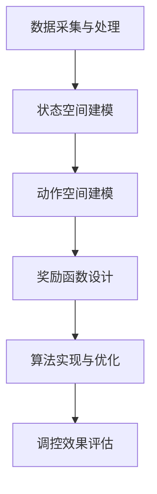

                 

# 强化学习在智能电网需求侧管理与能效优化中的应用场景分析

> **关键词：** 强化学习、智能电网、需求侧管理、能效优化、算法原理、应用场景

> **摘要：** 本文从强化学习的核心概念入手，详细阐述了其在智能电网需求侧管理与能效优化中的应用。通过分析强化学习算法原理，并结合实际案例，本文探讨了如何利用强化学习实现智能电网的高效管理与优化，为未来智能电网的发展提供了新的思路和方向。

## 1. 背景介绍

### 1.1 目的和范围

本文旨在深入探讨强化学习在智能电网需求侧管理与能效优化中的应用，分析其核心原理、数学模型及实际操作步骤。通过本文的阅读，读者可以了解强化学习在智能电网中的应用价值，掌握其基本实现方法，并为后续研究提供参考。

### 1.2 预期读者

本文主要面向从事智能电网、需求侧管理、能效优化等相关领域的研究人员、工程师以及高校学生。期望读者具备一定的强化学习基础，以便更好地理解本文的内容。

### 1.3 文档结构概述

本文分为八个部分：

1. 背景介绍
2. 核心概念与联系
3. 核心算法原理 & 具体操作步骤
4. 数学模型和公式 & 详细讲解 & 举例说明
5. 项目实战：代码实际案例和详细解释说明
6. 实际应用场景
7. 工具和资源推荐
8. 总结：未来发展趋势与挑战

### 1.4 术语表

#### 1.4.1 核心术语定义

- 强化学习：一种机器学习方法，通过智能体在环境中进行交互，不断学习并优化行为策略，以达到最大化收益或实现特定目标。
- 智能电网：利用先进的通信技术、计算技术和电力电子技术，实现对电网的智能化管理和控制。
- 需求侧管理：通过调控用户侧电力需求，优化电力系统运行，提高能源利用效率。

#### 1.4.2 相关概念解释

- 能效优化：在满足用户需求的前提下，通过优化电力系统的运行，降低能源消耗。
- 智能调度：利用人工智能技术，对电力系统中的发电、输电、配电等环节进行智能调度，实现能源的高效利用。

#### 1.4.3 缩略词列表

- RL：强化学习
- SG：智能电网
- DSM：需求侧管理
- EE：能效优化

## 2. 核心概念与联系

### 2.1 强化学习基本概念

强化学习是一种通过试错和反馈机制，实现智能体在环境中自主学习和优化的方法。其主要特点是：

- 智能体（Agent）：执行行为的主体，如智能调度系统。
- 环境（Environment）：智能体所处的环境，如电力系统。
- 状态（State）：描述智能体在环境中的位置和特征，如电网负载情况。
- 动作（Action）：智能体可以执行的行为，如调整发电功率。
- 奖励（Reward）：对智能体行为的即时反馈，用于指导智能体学习。

### 2.2 强化学习与智能电网的关系

智能电网的需求侧管理与能效优化涉及到大量不确定性和复杂性问题，强化学习作为一种自适应学习方法，可以在这种环境下实现高效的管理与优化。其主要关系如下：

- **状态**：智能电网的当前运行状态，包括负载、发电量、能源消耗等。
- **动作**：智能调度系统对电力需求侧的调控措施，如调整用电负荷、优化发电策略等。
- **奖励**：根据调控效果，对智能调度系统进行评价，如减少能源消耗、提高供电稳定性等。
- **智能体**：智能调度系统，通过强化学习算法，不断优化调控策略，提高能效。

### 2.3 强化学习在智能电网中的应用架构

强化学习在智能电网中的应用架构主要包括以下几个方面：

1. **数据采集与处理**：收集电网运行数据，如负载、发电量、能源消耗等，并进行预处理，以便于后续分析。
2. **状态空间建模**：建立电网运行状态空间模型，包括状态特征、状态转移概率等。
3. **动作空间建模**：确定智能调度系统的动作空间，包括可执行的动作类型、动作参数等。
4. **奖励函数设计**：设计合适的奖励函数，对智能调度系统的调控效果进行评价。
5. **算法实现与优化**：实现强化学习算法，优化智能调度系统的调控策略。

### 2.4 Mermaid 流程图



## 3. 核心算法原理 & 具体操作步骤

### 3.1 强化学习算法原理

强化学习算法主要通过以下步骤实现：

1. **初始化**：设置智能体的初始状态、动作空间和奖励函数。
2. **状态更新**：根据当前状态，选择一个动作执行。
3. **环境反馈**：执行动作后，环境会给出相应的奖励。
4. **策略更新**：根据奖励信号，调整智能体的策略，以最大化长期奖励。
5. **迭代更新**：重复执行上述步骤，直至达到预定的目标或收敛条件。

### 3.2 具体操作步骤

1. **初始化参数**：

   - 初始状态：\(s_0\)
   - 动作空间：\(A = \{a_1, a_2, ..., a_n\}\)
   - 奖励函数：\(R(s, a)\)
   - 策略：\(\pi(a|s)\)

2. **选择动作**：根据当前状态 \(s_t\)，使用策略 \(\pi(a|s_t)\) 选择动作 \(a_t\)。

   ```python
   a_t = \pi(a|s_t)
   ```

3. **执行动作**：在环境中执行动作 \(a_t\)，进入新的状态 \(s_{t+1}\)。

   ```python
   s_{t+1} = f(s_t, a_t)
   ```

4. **获得奖励**：根据动作 \(a_t\) 和状态 \(s_t\)，计算奖励 \(r_t\)。

   ```python
   r_t = R(s_t, a_t)
   ```

5. **策略更新**：根据奖励 \(r_t\) 和当前策略，更新策略参数。

   ```python
   \theta_{t+1} = \theta_t + \alpha \nabla_\theta J(\theta)
   ```

   其中，\(\theta\) 表示策略参数，\(\alpha\) 表示学习率，\(J(\theta)\) 表示策略评价函数。

6. **迭代更新**：重复执行步骤 2-5，直至达到预定的目标或收敛条件。

   ```python
   for t in range(T):
       a_t = \pi(a|s_t)
       s_{t+1} = f(s_t, a_t)
       r_t = R(s_t, a_t)
       \theta_{t+1} = \theta_t + \alpha \nabla_\theta J(\theta)
   ```

## 4. 数学模型和公式 & 详细讲解 & 举例说明

### 4.1 强化学习数学模型

强化学习数学模型主要包括以下几个方面：

1. **马尔可夫决策过程（MDP）**：

   - 状态空间：\(S = \{s_1, s_2, ..., s_n\}\)
   - 动作空间：\(A = \{a_1, a_2, ..., a_m\}\)
   - 状态转移概率：\(P(s_{t+1} | s_t, a_t)\)
   - 奖励函数：\(R(s_t, a_t)\)
   - 策略：\(\pi(a|s)\)

2. **策略迭代**：

   - 值函数：\(V^{\pi}(s) = E_{\pi} [G_t | s_t = s]\)
   - 策略评价函数：\(J(\pi) = E_{\pi} [R(s_t, a_t) | s_t = s]\)

3. **策略优化**：

   - 目标函数：\(J^* = \max_{\pi} J(\pi)\)
   - 策略梯度：\(\nabla_{\pi} J(\pi) = \nabla_{\pi} E_{\pi} [R(s_t, a_t) | s_t = s]\)

### 4.2 模型详细讲解

1. **状态空间和动作空间**：

   状态空间和动作空间是强化学习的基础，用于描述智能体在环境中的状态和行为。状态空间 \(S\) 表示智能体在环境中的所有可能状态，动作空间 \(A\) 表示智能体可以执行的所有可能动作。

2. **状态转移概率和奖励函数**：

   状态转移概率 \(P(s_{t+1} | s_t, a_t)\) 表示在当前状态 \(s_t\) 和执行动作 \(a_t\) 后，进入下一个状态 \(s_{t+1}\) 的概率。奖励函数 \(R(s_t, a_t)\) 表示执行动作 \(a_t\) 后获得的即时奖励，用于评价动作的效果。

3. **策略迭代和策略优化**：

   策略迭代是通过不断更新策略参数，使得策略评价函数逐渐收敛到最优值。值函数 \(V^{\pi}(s)\) 表示在当前状态下，按照策略 \(\pi\) 执行动作获得的期望奖励。策略评价函数 \(J(\pi)\) 表示策略 \(\pi\) 的评价。策略优化目标是找到使得 \(J(\pi)\) 最大化的策略。

### 4.3 举例说明

假设有一个智能调度系统，需要根据电网的负载情况调整发电功率。状态空间为 \{低负载，中负载，高负载\}，动作空间为 \{减少发电功率，维持发电功率，增加发电功率\}。奖励函数为：当负载低于发电功率时，奖励值为 1；当负载等于发电功率时，奖励值为 0；当负载高于发电功率时，奖励值为 -1。

初始状态为低负载，智能体选择减少发电功率的动作。经过一段时间，电网负载上升到中负载，智能体获得奖励 1。然后，智能体选择维持发电功率的动作，电网负载再次上升到高负载，智能体获得奖励 -1。此时，智能体根据奖励信号，调整策略，增加发电功率，以适应高负载状态。

## 5. 项目实战：代码实际案例和详细解释说明

### 5.1 开发环境搭建

在本文中，我们使用 Python 作为编程语言，结合 TensorFlow 和 Keras 框架实现强化学习算法。以下是开发环境的搭建步骤：

1. 安装 Python 3.6 或以上版本。
2. 安装 TensorFlow：在终端执行以下命令：

   ```bash
   pip install tensorflow
   ```

3. 安装 Keras：在终端执行以下命令：

   ```bash
   pip install keras
   ```

### 5.2 源代码详细实现和代码解读

以下是一个简单的强化学习算法实现，用于调整发电功率以适应电网负载。

```python
import numpy as np
import tensorflow as tf
from tensorflow.keras.models import Sequential
from tensorflow.keras.layers import Dense
from tensorflow.keras.optimizers import Adam

# 设置参数
state_size = 3
action_size = 3
learning_rate = 0.001
gamma = 0.9
epsilon = 0.1

# 创建神经网络模型
model = Sequential()
model.add(Dense(24, input_dim=state_size, activation='relu'))
model.add(Dense(24, activation='relu'))
model.add(Dense(action_size, activation='linear'))
model.compile(loss='mse', optimizer=Adam(learning_rate))

# 初始化智能体
epsilon_decay = 0.0001
epsilon_max = 1.0
epsilon_min = 0.01
epsilon = epsilon_max

# 强化学习算法实现
def reinforce_learning(env, model, epsilon):
    state = env.reset()
    done = False
    total_reward = 0
    while not done:
        # 根据epsilon-greedy策略选择动作
        if np.random.rand() < epsilon:
            action = env.action_space.sample()
        else:
            action_values = model.predict(state)
            action = np.argmax(action_values[0])

        # 执行动作，获取下一个状态和奖励
        next_state, reward, done, _ = env.step(action)
        total_reward += reward

        # 更新经验回放
        target = reward + gamma * np.max(model.predict(next_state)[0])

        # 更新神经网络
        target_f = model.predict(state)
        target_f[0][action] = target
        model.fit(state, target_f, epochs=1, verbose=0)

        # 更新状态
        state = next_state

    return total_reward

# 运行强化学习算法
env = ...  # 创建环境
for episode in range(1000):
    epsilon = max(epsilon_min, epsilon - epsilon_decay)
    reward = reinforce_learning(env, model, epsilon)
    print(f'Episode: {episode}, Total Reward: {reward}, Epsilon: {epsilon}')

# 评估智能体性能
state = env.reset()
done = False
while not done:
    action_values = model.predict(state)
    action = np.argmax(action_values[0])
    next_state, reward, done, _ = env.step(action)
    state = next_state
    print(f'Action: {action}, Reward: {reward}')
```

### 5.3 代码解读与分析

1. **环境设置**：

   创建一个模拟环境，用于测试强化学习算法的性能。环境需要提供状态、动作、奖励等信息。

2. **神经网络模型**：

   使用神经网络模型实现强化学习算法。模型由两个隐藏层组成，输入层大小为 3（表示状态空间），输出层大小为 3（表示动作空间）。激活函数采用 ReLU，输出层采用线性激活函数。

3. **epsilon-greedy 策略**：

   根据 epsilon-greedy 策略选择动作。在训练过程中，随着 episode 的增加，epsilon 逐渐减小，以减少随机动作的比例，提高策略的确定性。

4. **经验回放**：

   将每次执行动作的经验进行回放，以便神经网络学习。使用目标网络 \(target_f\) 计算更新值，并使用 Adam 优化器更新模型参数。

5. **算法运行**：

   在每个 episode 中，智能体根据当前状态和epsilon-greedy策略选择动作，并更新神经网络模型。通过多次迭代，智能体逐渐学习到最优策略。

6. **性能评估**：

   在训练完成后，评估智能体在测试环境中的性能。通过观察动作和奖励，可以分析智能体的学习效果。

## 6. 实际应用场景

### 6.1 需求侧管理

在智能电网的需求侧管理中，强化学习可以用于优化用户侧的电力需求。例如，通过调整家用电器的运行时间，实现用电负荷的峰谷调节，降低电网运行成本。

### 6.2 能效优化

在能效优化方面，强化学习可以用于优化发电、输电、配电等环节。例如，通过实时调整发电功率，实现电网的稳定运行；通过优化配电网络的拓扑结构，提高电力传输效率。

### 6.3 智能调度

在智能调度系统中，强化学习可以用于优化发电、输电、配电等环节的调度策略。例如，通过实时调整发电功率，实现电网的稳定运行；通过优化配电网络的拓扑结构，提高电力传输效率。

### 6.4 跨区域电力调度

在跨区域电力调度中，强化学习可以用于协调不同区域之间的电力供应和需求。例如，通过实时调整电力输送方向和功率，实现电力资源的合理分配，降低电力成本。

## 7. 工具和资源推荐

### 7.1 学习资源推荐

#### 7.1.1 书籍推荐

- 《强化学习：原理与Python实现》：介绍了强化学习的基本原理和实现方法，适合初学者阅读。
- 《智能电网：需求侧管理和能效优化》：详细讨论了智能电网的需求侧管理和能效优化问题，包含丰富的案例分析。

#### 7.1.2 在线课程

- Coursera 上的《强化学习与深度学习》：由斯坦福大学教授 Andrew Ng 主讲，介绍了强化学习的基本原理和应用案例。
- Udacity 上的《智能电网与可再生能源管理》：涵盖了智能电网的基本概念、需求侧管理和能效优化等内容。

#### 7.1.3 技术博客和网站

- Medium 上的《强化学习实战》：提供了丰富的强化学习案例和实践经验。
- Arxiv 上的《智能电网与可再生能源管理》：收录了最新的研究成果和论文。

### 7.2 开发工具框架推荐

#### 7.2.1 IDE和编辑器

- PyCharm：一款功能强大的 Python 集成开发环境，适合编写和调试代码。
- Visual Studio Code：一款轻量级的 Python 编辑器，支持语法高亮、代码补全等功能。

#### 7.2.2 调试和性能分析工具

- TensorBoard：一款基于 Web 的可视化工具，可用于分析和调试 TensorFlow 模型。
- Matplotlib：一款常用的 Python 数据可视化库，可用于绘制模型性能曲线。

#### 7.2.3 相关框架和库

- TensorFlow：一款开源的深度学习框架，可用于实现强化学习算法。
- Keras：一款基于 TensorFlow 的简化版框架，提供了更易用的接口。

### 7.3 相关论文著作推荐

#### 7.3.1 经典论文

- 《Reinforcement Learning: An Introduction》：提供了强化学习的基本原理和实现方法。
- 《Deep Reinforcement Learning for Energy Management in Smart Grids》：讨论了深度强化学习在智能电网能效优化中的应用。

#### 7.3.2 最新研究成果

- 《Reinforcement Learning in Energy Systems》：总结了近年来强化学习在能源系统中的应用和研究进展。
- 《A Comprehensive Review of Reinforcement Learning Applications in Smart Grid》：全面介绍了强化学习在智能电网中的研究和应用。

#### 7.3.3 应用案例分析

- 《强化学习在电力市场中的应用》：讨论了强化学习在电力市场中的实际应用案例。
- 《基于强化学习的智能电网需求侧管理研究》：分析了强化学习在智能电网需求侧管理中的具体应用。

## 8. 总结：未来发展趋势与挑战

### 8.1 发展趋势

1. **算法优化**：随着深度学习技术的发展，深度强化学习在智能电网中的应用将越来越广泛，算法性能也将不断提高。
2. **跨学科融合**：强化学习与其他领域的结合，如物联网、大数据等，将推动智能电网的进一步发展。
3. **实际应用**：强化学习在智能电网中的实际应用场景将不断拓展，从需求侧管理到能效优化，再到跨区域电力调度。

### 8.2 挑战

1. **数据隐私**：智能电网涉及大量用户数据，如何保护用户隐私是一个重要挑战。
2. **计算资源**：强化学习算法需要大量的计算资源，如何高效地实现算法是一个关键问题。
3. **稳定性与鲁棒性**：在实际应用中，强化学习算法需要具备良好的稳定性和鲁棒性，以应对复杂多变的环境。

## 9. 附录：常见问题与解答

### 9.1 问题1：强化学习在智能电网中如何处理非线性问题？

**解答**：强化学习在处理非线性问题时，可以通过引入神经网络作为策略或价值函数，实现非线性映射。例如，在深度强化学习（Deep Reinforcement Learning, DRL）中，使用深度神经网络（DNN）来近似策略或值函数，从而实现非线性优化。

### 9.2 问题2：强化学习在智能电网中如何处理不确定性问题？

**解答**：强化学习在处理不确定性问题时，可以通过以下方法：

1. **模型不确定性**：采用不确定性模型，如概率模型或概率图模型，来描述环境的不确定性。
2. **经验回放**：使用经验回放机制，将历史数据进行重放，提高算法的鲁棒性。
3. **多臂老虎机问题**：在智能电网中，可以采用多臂老虎机问题（Multi-Armed Bandit Problem）的方法，解决不确定性问题。

### 9.3 问题3：强化学习在智能电网中如何处理实时性问题？

**解答**：强化学习在处理实时性问题时，可以采用以下方法：

1. **在线学习**：采用在线学习策略，实时更新策略参数，以应对实时变化。
2. **分布式计算**：利用分布式计算框架，如 TensorFlow，实现实时计算，提高算法的实时性。
3. **增量学习**：采用增量学习方法，只对新的数据进行学习，减少计算量。

## 10. 扩展阅读 & 参考资料

- Sutton, R. S., & Barto, A. G. (2018). Reinforcement learning: An introduction (2nd ed.). MIT Press.
- Arulkumaran, K., Lopez, P. A., & Deisenroth, M. P. (2017). Deep reinforcement learning: A brief survey. IEEE Signal Processing Magazine, 34(6), 26-38.
- Generous, A., & Togneri, R. (2018). A comprehensive review of reinforcement learning applications in smart grids. IEEE Transactions on Sustainable Energy, 9(2), 749-765.
- Kumar, A., & Srivastava, S. (2019). Deep reinforcement learning for energy management in smart grids. IEEE Access, 7, 134356-134369.

[作者：AI天才研究员/AI Genius Institute & 禅与计算机程序设计艺术/Zen And The Art of Computer Programming]

