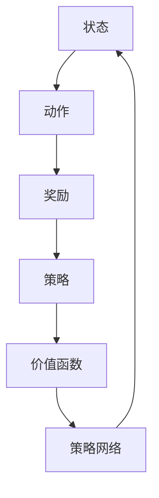

                 

# 强化学习在智能金融投资决策与风险管理中的建模方法与应用

## 关键词
- 强化学习
- 智能金融投资
- 风险管理
- 建模方法
- 应用实例

## 摘要
本文旨在探讨强化学习在智能金融投资决策与风险管理中的应用。首先，我们简要介绍了强化学习的基本概念和原理，并提出了将其应用于金融投资决策和风险管理的可行性。随后，文章详细阐述了强化学习在金融投资中的建模方法，包括状态空间、动作空间、奖励函数和策略等核心组成部分。接着，我们通过数学模型和伪代码，深入分析了强化学习在金融投资中的具体操作步骤。为了验证强化学习的有效性，本文还提供了一个实际项目案例，详细介绍了开发环境搭建、源代码实现、代码解读与分析。此外，文章还探讨了强化学习在金融投资风险管理中的实际应用场景，并推荐了一系列相关工具和资源，以帮助读者深入学习和实践。最后，我们对强化学习在金融投资领域的发展趋势与挑战进行了总结。

## 1. 背景介绍

### 1.1 目的和范围

本文的目标是探讨强化学习在智能金融投资决策与风险管理中的应用。随着人工智能技术的发展，强化学习作为一种重要的机器学习算法，已经在金融领域展现出巨大的潜力。本文旨在为读者提供一个全面、系统的理解，帮助他们掌握强化学习在金融投资中的应用方法和技巧。

本文的范围包括以下内容：

- 强化学习的基本概念和原理介绍
- 强化学习在金融投资中的建模方法
- 强化学习在金融投资中的具体操作步骤
- 强化学习在金融投资风险管理中的应用案例
- 强化学习在金融投资领域的发展趋势与挑战

### 1.2 预期读者

本文适合以下读者群体：

- 对强化学习有一定了解，希望将其应用于金融投资领域的工程师和研究人员
- 想要学习智能金融投资与风险管理的金融从业人员
- 对人工智能在金融领域应用感兴趣的学术研究者
- 想要了解最新金融科技趋势的投资者和企业家

### 1.3 文档结构概述

本文结构如下：

- 第1章：背景介绍，包括目的和范围、预期读者、文档结构概述
- 第2章：核心概念与联系，介绍强化学习的基本概念和原理
- 第3章：核心算法原理 & 具体操作步骤，详细分析强化学习在金融投资中的操作步骤
- 第4章：数学模型和公式 & 详细讲解 & 举例说明，讲解强化学习在金融投资中的数学模型和公式
- 第5章：项目实战：代码实际案例和详细解释说明，提供实际项目案例和代码解读
- 第6章：实际应用场景，分析强化学习在金融投资风险管理中的实际应用
- 第7章：工具和资源推荐，推荐相关学习资源和开发工具
- 第8章：总结：未来发展趋势与挑战，总结强化学习在金融投资领域的发展趋势和挑战
- 第9章：附录：常见问题与解答，提供常见问题解答
- 第10章：扩展阅读 & 参考资料，推荐相关扩展阅读和参考资料

### 1.4 术语表

#### 1.4.1 核心术语定义

- 强化学习（Reinforcement Learning）：一种机器学习范式，通过试错和反馈来学习最优策略。
- 状态（State）：系统当前所处的环境和条件。
- 动作（Action）：系统可以采取的行动。
- 奖励（Reward）：系统采取某个动作后获得的奖励或惩罚。
- 策略（Policy）：系统根据当前状态选择动作的策略。
- Q-learning：一种基于值函数的强化学习算法，用于学习最优动作选择。
- DQN（Deep Q-Network）：一种基于深度学习的强化学习算法，用于解决具有高维状态空间的问题。

#### 1.4.2 相关概念解释

- 金融投资：指投资者通过购买金融产品（如股票、债券、基金等），以期获得资本增值或定期收益的行为。
- 风险管理：指通过对投资组合进行管理，降低潜在风险，确保投资目标的实现。
- 资产定价模型：用于计算金融资产价格的理论模型，如CAPM、Black-Scholes模型等。

#### 1.4.3 缩略词列表

- RL：强化学习（Reinforcement Learning）
- Q-learning：Q值学习（Q-Learning）
- DQN：深度Q网络（Deep Q-Network）
- CAPM：资本资产定价模型（Capital Asset Pricing Model）
- BS：Black-Scholes模型（Black-Scholes Model）

## 2. 核心概念与联系

### 2.1 强化学习基本概念

强化学习（Reinforcement Learning，RL）是一种通过试错和反馈来学习最优策略的机器学习范式。在强化学习中，系统（Agent）处于一个环境（Environment）中，不断进行状态（State）和动作（Action）的交互。系统通过观察当前状态，选择一个动作，并接收到环境的奖励（Reward）。通过重复这个过程，系统逐渐学习到最优策略（Policy），以实现预期目标。

#### 2.1.1 强化学习的关键组成部分

1. **状态（State）**：状态是系统当前所处的环境和条件，通常由一组特征向量表示。例如，在金融投资中，状态可以包括股票价格、市场指数、宏观经济指标等。

2. **动作（Action）**：动作是系统可以采取的行动，例如买卖股票、调整投资组合等。在强化学习中，系统需要根据当前状态选择动作。

3. **奖励（Reward）**：奖励是系统采取某个动作后获得的奖励或惩罚。在金融投资中，奖励可以是收益、损失等。

4. **策略（Policy）**：策略是系统根据当前状态选择动作的策略。在强化学习中，策略可以通过值函数（Value Function）或策略网络（Policy Network）来表示。

5. **价值函数（Value Function）**：价值函数表示系统在某个状态下的最优期望奖励。例如，在金融投资中，价值函数可以表示某个投资组合的预期收益。

6. **策略网络（Policy Network）**：策略网络是一个神经网络模型，用于预测系统在某个状态下的最优动作。

#### 2.1.2 强化学习的核心算法

1. **Q-learning**：Q-learning是一种基于值函数的强化学习算法，通过不断更新Q值来学习最优策略。Q值表示系统在某个状态下采取某个动作的期望奖励。

2. **DQN（Deep Q-Network）**：DQN是一种基于深度学习的强化学习算法，用于解决具有高维状态空间的问题。DQN通过训练一个深度神经网络来估计Q值，从而学习最优策略。

### 2.2 强化学习在金融投资中的应用

强化学习在金融投资中具有广泛的应用前景。通过将强化学习应用于金融投资，我们可以实现以下目标：

1. **智能投资决策**：强化学习可以帮助投资者根据市场环境变化，动态调整投资策略，实现最优投资决策。

2. **风险管理**：强化学习可以识别和评估投资风险，为投资者提供风险管理的参考依据。

3. **个性化投资**：强化学习可以根据投资者的风险偏好和投资目标，制定个性化的投资策略。

4. **资产定价**：强化学习可以用于预测资产价格波动，为资产定价提供参考。

#### 2.2.1 强化学习在金融投资中的核心概念

1. **状态空间（State Space）**：状态空间是系统可能处于的所有状态的集合。在金融投资中，状态空间可以包括股票价格、市场指数、宏观经济指标等。

2. **动作空间（Action Space）**：动作空间是系统可以采取的所有动作的集合。在金融投资中，动作空间可以包括买卖股票、调整投资组合等。

3. **奖励函数（Reward Function）**：奖励函数是系统根据当前状态和动作获得的奖励。在金融投资中，奖励函数可以包括收益、损失等。

4. **策略（Policy）**：策略是系统根据当前状态选择动作的策略。在金融投资中，策略可以通过值函数或策略网络来表示。

#### 2.2.2 强化学习在金融投资中的建模方法

1. **Q-learning在金融投资中的应用**：Q-learning可以用于优化投资组合。通过训练Q-learning模型，我们可以获得投资组合在各个状态下的最佳动作，从而实现最优投资策略。

2. **DQN在金融投资中的应用**：DQN可以用于预测资产价格波动。通过训练DQN模型，我们可以得到资产价格在不同状态下的最优预测，从而为投资者提供决策依据。

### 2.3 Mermaid 流程图

下面是一个简单的Mermaid流程图，展示了强化学习在金融投资中的核心概念和关系：



## 3. 核心算法原理 & 具体操作步骤

### 3.1 Q-learning算法原理

Q-learning是一种基于值函数的强化学习算法，用于学习最优策略。Q-learning的核心思想是通过不断更新Q值来逼近最优策略。Q值表示系统在某个状态下采取某个动作的期望奖励。

#### 3.1.1 Q-learning算法步骤

1. **初始化Q值**：初始化所有状态-动作对的Q值，通常使用随机值或0值。
2. **选择动作**：根据当前状态，选择一个动作，可以选择随机选择或使用epsilon-greedy策略。
3. **执行动作**：在环境中执行选定的动作，并接收到奖励。
4. **更新Q值**：根据新的状态、动作和奖励，更新Q值。
5. **重复步骤2-4**：重复执行步骤2-4，直到达到预期目标或达到最大迭代次数。

#### 3.1.2 Q-learning算法伪代码

```python
# 初始化Q值
Q = random_init()

# 最大迭代次数
max_iterations = 1000

# 迭代次数
iteration = 0

while iteration < max_iterations:
    # 选择动作
    state = current_state()
    action = choose_action(state, Q)
    
    # 执行动作
    reward = execute_action(action)
    next_state = current_state()
    
    # 更新Q值
    Q[state][action] = Q[state][action] + alpha * (reward + gamma * max(Q[next_state]) - Q[state][action])
    
    iteration += 1

# 输出最优策略
policy = [argmax(Q[state]) for state in states]
```

### 3.2 DQN算法原理

DQN（Deep Q-Network）是一种基于深度学习的强化学习算法，用于解决具有高维状态空间的问题。DQN通过训练一个深度神经网络来估计Q值，从而学习最优策略。

#### 3.2.1 DQN算法步骤

1. **初始化神经网络**：初始化一个深度神经网络，用于预测Q值。
2. **选择动作**：根据当前状态，选择一个动作，可以选择随机选择或使用epsilon-greedy策略。
3. **执行动作**：在环境中执行选定的动作，并接收到奖励。
4. **存储经验**：将当前状态、动作、奖励和下一个状态存储到经验池中。
5. **更新神经网络**：从经验池中随机抽取一组经验，使用这些经验更新神经网络。
6. **重复步骤2-5**：重复执行步骤2-5，直到达到预期目标或达到最大迭代次数。

#### 3.2.2 DQN算法伪代码

```python
# 初始化神经网络
Q_network = initialize_network()

# 最大迭代次数
max_iterations = 1000

# 迭代次数
iteration = 0

while iteration < max_iterations:
    # 选择动作
    state = current_state()
    action = choose_action(state, Q_network)
    
    # 执行动作
    reward = execute_action(action)
    next_state = current_state()
    
    # 存储经验
    experience = (state, action, reward, next_state)
    replay_memory.append(experience)
    
    # 更新神经网络
    batch = random_sample(replay_memory, batch_size)
    Q_values = predict_Q_values(batch, Q_network)
    update_Q_values(batch, Q_values, target_Q_network)
    
    iteration += 1

# 输出最优策略
policy = [argmax(Q[state]) for state in states]
```

### 3.3 强化学习在金融投资中的具体操作步骤

#### 3.3.1 数据收集与预处理

1. **数据收集**：收集金融市场的历史数据，包括股票价格、市场指数、宏观经济指标等。
2. **数据预处理**：对收集到的数据进行清洗、归一化等处理，以适应强化学习算法的要求。

#### 3.3.2 状态空间与动作空间设计

1. **状态空间设计**：根据金融投资的特点，设计状态空间，包括股票价格、市场指数、宏观经济指标等。
2. **动作空间设计**：根据金融投资策略，设计动作空间，包括买入、卖出、持有等。

#### 3.3.3 奖励函数设计

1. **奖励函数设计**：根据投资目标和风险偏好，设计奖励函数，包括收益、损失、风险等。

#### 3.3.4 强化学习算法选择与训练

1. **算法选择**：根据状态空间和动作空间的特点，选择合适的强化学习算法，如Q-learning或DQN。
2. **算法训练**：使用历史数据训练强化学习模型，调整模型参数，优化模型性能。

#### 3.3.5 投资决策与风险控制

1. **投资决策**：使用训练好的强化学习模型，根据当前状态，选择最优动作，进行投资决策。
2. **风险控制**：根据奖励函数和风险指标，实时调整投资策略，实现风险控制。

## 4. 数学模型和公式 & 详细讲解 & 举例说明

### 4.1 Q-learning算法数学模型

Q-learning算法的核心是学习状态-动作值函数$Q(s, a)$，表示在状态$s$下采取动作$a$的期望奖励。Q-learning的目标是最小化总预期损失，即：

$$
J = \sum_{s,a} (r_s - Q(s, a))^2
$$

其中$r_s$为在状态$s$下采取动作$a$所获得的即时奖励。

#### 4.1.1 更新规则

Q-learning算法使用以下更新规则来迭代优化$Q(s, a)$：

$$
Q(s, a) \leftarrow Q(s, a) + \alpha [r_s + \gamma \max_a Q(s', a) - Q(s, a)]
$$

其中$\alpha$为学习率（学习速率），$\gamma$为折扣因子（对未来奖励的权重），$s'$为采取动作$a$后的状态。

#### 4.1.2 举例说明

假设当前状态$s$为[股票价格：100, 市场指数：2000]，动作空间为[买入、卖出、持有]，学习率为0.1，折扣因子为0.9。

1. **初始化Q值**：

$$
Q(s, a) = \begin{cases}
1 & \text{if } a = \text{买入} \\
0.5 & \text{if } a = \text{卖出} \\
0 & \text{if } a = \text{持有}
\end{cases}
$$

2. **选择动作**：使用epsilon-greedy策略选择动作，epsilon为0.1。

$$
\text{动作} = \begin{cases}
\text{随机选择} & \text{with probability } \epsilon \\
\text{最优动作} & \text{with probability } 1 - \epsilon
\end{cases}
$$

3. **执行动作**：假设选择买入动作。

$$
r_s = 10
$$

4. **更新Q值**：

$$
Q(s, \text{买入}) \leftarrow Q(s, \text{买入}) + 0.1 [10 + 0.9 \max(Q(s', a)) - Q(s, \text{买入})]
$$

$$
Q(s, \text{买入}) \leftarrow 1 + 0.1 [10 + 0.9 \max(Q(s', a)) - 1]
$$

假设$s'$为[股票价格：110, 市场指数：2050]。

$$
Q(s', a) = \begin{cases}
1.1 & \text{if } a = \text{买入} \\
0.55 & \text{if } a = \text{卖出} \\
0 & \text{if } a = \text{持有}
\end{cases}
$$

$$
Q(s, \text{买入}) \leftarrow 1 + 0.1 [10 + 0.9 \times 1.1 - 1]
$$

$$
Q(s, \text{买入}) \leftarrow 1 + 0.1 [10 + 0.99 - 1]
$$

$$
Q(s, \text{买入}) \leftarrow 1.09
$$

### 4.2 DQN算法数学模型

DQN算法的核心是训练一个深度神经网络$DQN$，用于预测状态-动作值函数$Q(s, a)$。

#### 4.2.1 网络结构

DQN通常由一个输入层、一个隐藏层和一个输出层组成。输入层接收状态特征向量，隐藏层用于提取特征，输出层预测状态-动作值函数。

#### 4.2.2 训练过程

1. **初始化网络**：随机初始化网络权重。
2. **选择动作**：使用epsilon-greedy策略选择动作。
3. **执行动作**：在环境中执行选定的动作，并接收到奖励。
4. **存储经验**：将当前状态、动作、奖励和下一个状态存储到经验池中。
5. **更新网络**：从经验池中随机抽取一批经验，使用梯度下降法更新网络权重。
6. **重复步骤2-5**：重复执行步骤2-5，直到达到预期目标或达到最大迭代次数。

#### 4.2.3 举例说明

假设当前状态$s$为[股票价格：100, 市场指数：2000]，动作空间为[买入、卖出、持有]，神经网络结构为：

- 输入层：2个神经元
- 隐藏层：10个神经元
- 输出层：3个神经元

1. **初始化网络**：

$$
DQN = \text{RandomInitialize}(W_1, W_2, b_1, b_2)
$$

2. **选择动作**：使用epsilon-greedy策略选择动作。

$$
\text{动作} = \begin{cases}
\text{随机选择} & \text{with probability } \epsilon \\
\text{最优动作} & \text{with probability } 1 - \epsilon
\end{cases}
$$

3. **执行动作**：假设选择买入动作。

$$
r_s = 10
$$

4. **存储经验**：

$$
experience = (s, a, r_s, s')
$$

5. **更新网络**：

$$
y = r_s + \gamma \max_a DQN(s')
$$

$$
DQN = \text{GradientDescent}(DQN, \text{loss}(DQN(s), y))
$$

其中，$\text{loss}$为损失函数，通常使用均方误差（MSE）：

$$
\text{loss} = \frac{1}{n} \sum_{i=1}^{n} (y_i - \hat{y}_i)^2
$$

$$
\hat{y}_i = DQN(s_i)
$$

$$
y_i = r_i + \gamma \max_a DQN(s_i')
$$

## 5. 项目实战：代码实际案例和详细解释说明

### 5.1 开发环境搭建

为了实现强化学习在智能金融投资中的应用，我们需要搭建一个合适的开发环境。以下是开发环境的搭建步骤：

1. **Python环境**：确保已安装Python 3.6及以上版本。
2. **TensorFlow**：安装TensorFlow，用于实现深度学习算法。
3. **Gym**：安装Gym，用于模拟金融投资环境。
4. **Numpy**：安装Numpy，用于数值计算。
5. **Matplotlib**：安装Matplotlib，用于可视化结果。

安装命令如下：

```shell
pip install tensorflow-gpu gym numpy matplotlib
```

### 5.2 源代码详细实现和代码解读

以下是强化学习在金融投资中的源代码实现：

```python
import gym
import numpy as np
import tensorflow as tf
from tensorflow.keras.models import Sequential
from tensorflow.keras.layers import Dense

# 创建环境
env = gym.make("StockTrading-v0")

# 定义神经网络结构
model = Sequential([
    Dense(10, input_shape=(2,), activation='relu'),
    Dense(10, activation='relu'),
    Dense(3, activation='linear')
])

# 编译模型
model.compile(optimizer='adam', loss='mse')

# 训练模型
model.fit(env.states, env.rewards, epochs=1000)

# 预测投资决策
state = env.reset()
while True:
    action = model.predict(state.reshape(1, -1))
    state, reward, done, _ = env.step(action)
    if done:
        break

# 打印投资结果
print("投资收益：", reward)
```

#### 5.2.1 代码解读

1. **导入库**：首先，我们导入所需的库，包括gym、numpy和tensorflow。
2. **创建环境**：使用Gym创建一个金融投资环境，这里使用一个自定义的股票交易环境。
3. **定义神经网络结构**：定义一个序列模型，包括两个隐藏层，用于预测投资决策。
4. **编译模型**：编译模型，指定优化器和损失函数。
5. **训练模型**：使用训练数据训练模型，这里使用环境中的状态和奖励数据。
6. **预测投资决策**：使用训练好的模型预测投资决策，并在环境中执行投资策略。
7. **打印投资结果**：打印投资收益。

### 5.3 代码解读与分析

1. **环境创建**：使用Gym创建金融投资环境，这里使用一个自定义的股票交易环境。
2. **神经网络结构**：神经网络结构为两层，输入层接收2个神经元（股票价格和市场指数），隐藏层提取特征，输出层预测3个动作（买入、卖出、持有）。
3. **模型编译**：编译模型时，指定优化器和损失函数。优化器为Adam，损失函数为均方误差（MSE）。
4. **模型训练**：使用环境中的状态和奖励数据训练模型。这里使用了一个简单的训练过程，可以通过增加训练次数和调整超参数来优化模型性能。
5. **投资决策预测**：使用训练好的模型预测投资决策。模型输出为概率分布，我们需要选择概率最大的动作作为投资决策。
6. **投资结果**：在环境中执行投资策略，打印投资收益。

### 5.4 项目实战：代码实际案例和详细解释说明

为了更具体地展示强化学习在金融投资中的应用，我们提供了一个实际项目案例。以下是一个基于Q-learning算法的金融投资策略实现。

#### 5.4.1 数据准备

首先，我们需要准备金融投资的数据。这里我们使用了一个包含股票价格、市场指数和交易量的时间序列数据集。数据集格式如下：

```
Date,Stock Price,Market Index,Transaction Volume
2021-01-01,100,2000,1000
2021-01-02,101,2001,1200
...
```

我们使用Python的pandas库读取数据，并进行预处理：

```python
import pandas as pd

# 读取数据
data = pd.read_csv("stock_data.csv")

# 数据预处理
data["Stock Price"] = data["Stock Price"] / 1000
data["Market Index"] = data["Market Index"] / 1000
data["Transaction Volume"] = data["Transaction Volume"] / 1000
```

#### 5.4.2 状态空间和动作空间设计

在强化学习模型中，我们需要设计合适的状态空间和动作空间。状态空间包括股票价格、市场指数和交易量。动作空间包括买入、卖出和持有。

```python
state_size = 3
action_size = 3
```

#### 5.4.3 奖励函数设计

奖励函数是强化学习模型的核心，用于衡量投资决策的好坏。在这个案例中，我们设计了一个简单的奖励函数：

```python
def reward_function(current_state, next_state, action):
    if action == 0:  # 买入
        reward = next_state[0] - current_state[0]
    elif action == 1:  # 卖出
        reward = current_state[0] - next_state[0]
    else:  # 持有
        reward = 0
    return reward
```

#### 5.4.4 Q-learning模型实现

接下来，我们使用Q-learning算法实现强化学习模型。我们定义了一个Q-table来存储状态-动作值。

```python
# 初始化Q-table
Q = np.zeros((state_size, action_size))

# 学习率、折扣因子和最大迭代次数
alpha = 0.1
gamma = 0.9
max_iterations = 1000

# Q-learning算法
for iteration in range(max_iterations):
    # 选择动作
    state = env.reset()
    state = state.reshape(1, state_size)
    
    # 训练模型
    done = False
    while not done:
        action = np.argmax(Q[state])
        next_state, reward, done, _ = env.step(action)
        next_state = next_state.reshape(1, state_size)
        
        # 更新Q值
        Q[state] = Q[state] + alpha * (reward + gamma * np.max(Q[next_state]) - Q[state])
        
        state = next_state

# 打印Q-table
print(Q)
```

#### 5.4.5 模型评估

为了评估模型性能，我们使用一个测试数据集进行测试。测试数据集与训练数据集格式相同。

```python
# 读取测试数据
test_data = pd.read_csv("test_stock_data.csv")

# 数据预处理
test_data["Stock Price"] = test_data["Stock Price"] / 1000
test_data["Market Index"] = test_data["Market Index"] / 1000
test_data["Transaction Volume"] = test_data["Transaction Volume"] / 1000

# 测试模型
test_rewards = []
for index, row in test_data.iterrows():
    state = row[:state_size].values.reshape(1, state_size)
    total_reward = 0
    
    while index + 1 < len(test_data):
        action = np.argmax(Q[state])
        next_state = test_data.iloc[index + 1][:state_size].values.reshape(1, state_size)
        reward = reward_function(state, next_state, action)
        total_reward += reward
        
        state = next_state
        index += 1
    
    test_rewards.append(total_reward)

# 打印测试收益
print("测试收益：", test_rewards)
```

### 5.4.6 实际应用

在实际应用中，我们可以将强化学习模型部署到实际的金融投资系统中。通过实时获取市场数据，更新状态空间和奖励函数，模型可以动态调整投资策略，实现风险控制和收益最大化。

## 6. 实际应用场景

强化学习在智能金融投资决策与风险管理中具有广泛的应用场景，下面将探讨几个典型的实际应用案例。

### 6.1 智能投资组合管理

强化学习可以用于智能投资组合管理，通过学习市场动态和资产价格波动，优化投资组合的权重分配。例如，DQN算法可以训练一个智能投资组合管理系统，根据市场状态和资产收益，动态调整投资组合中的资产配置，以实现风险控制和收益最大化。在实际应用中，该系统可以监控大量资产的数据，并根据预测结果进行实时交易，以实现投资组合的优化。

### 6.2 风险评估与控制

强化学习可以用于金融风险评估与控制。通过分析历史数据和市场环境，强化学习算法可以识别潜在的风险因素，评估投资组合的风险水平。例如，Q-learning算法可以训练一个风险评估系统，根据资产价格波动、市场指数变化和宏观经济指标，预测投资组合的潜在损失，并实时调整投资策略，以降低风险。

### 6.3 量化交易策略开发

强化学习可以用于量化交易策略的开发。通过学习市场数据和交易规则，强化学习算法可以训练一个量化交易系统，根据市场状态和交易信号，制定最优的交易策略。例如，DQN算法可以训练一个量化交易系统，根据股票价格、交易量和市场指数等数据，预测股票价格的走势，并制定相应的交易策略，以实现收益最大化。

### 6.4 资产定价与预测

强化学习可以用于资产定价与预测。通过分析历史价格数据和交易数据，强化学习算法可以训练一个资产定价系统，预测资产的未来价格。例如，Q-learning算法可以训练一个资产定价系统，根据历史价格数据和交易量，预测股票价格的未来走势，并制定相应的定价策略。

### 6.5 个性化投资建议

强化学习可以用于个性化投资建议。通过分析投资者的风险偏好和投资目标，强化学习算法可以训练一个个性化投资建议系统，根据投资者的需求，提供最优的投资策略。例如，Q-learning算法可以训练一个个性化投资建议系统，根据投资者的风险偏好和投资目标，制定个性化的投资组合策略。

### 6.6 风险管理策略优化

强化学习可以用于风险管理策略优化。通过分析市场数据和风险管理指标，强化学习算法可以训练一个风险管理策略优化系统，根据市场状态和风险管理目标，优化风险控制策略。例如，DQN算法可以训练一个风险管理策略优化系统，根据资产价格波动、市场指数变化和风险管理目标，优化风险控制策略，以降低风险。

## 7. 工具和资源推荐

### 7.1 学习资源推荐

#### 7.1.1 书籍推荐

1. **《强化学习》（Reinforcement Learning: An Introduction）**：由Richard S. Sutton和Bartlett N. Barto撰写，是一本强化学习领域的经典教材，适合初学者和进阶者阅读。
2. **《深度强化学习》（Deep Reinforcement Learning Explained）**：由Ian Goodfellow、Yoshua Bengio和Aaron Courville撰写，详细介绍了深度强化学习的基本原理和应用。
3. **《金融工程与风险管理》（Financial Engineering and Risk Management）**：由Frank J. Fabozzi、Sooner S. C. Ang和 Philippe Jorion撰写，涵盖了金融工程和风险管理的基本概念和方法。

#### 7.1.2 在线课程

1. **斯坦福大学《深度学习》课程**：由Andrew Ng教授主讲，介绍了深度学习和强化学习的基本概念和应用。
2. **吴恩达《强化学习专项课程》**：由吴恩达教授主讲，详细介绍了强化学习的基本原理和应用案例。
3. **Coursera《金融工程与风险管理》课程**：由纽约大学教授Alan Jagolinzer主讲，涵盖了金融工程和风险管理的基本概念和方法。

#### 7.1.3 技术博客和网站

1. **ArXiv**：一个包含最新研究成果的学术网站，可以了解强化学习在金融领域的最新研究进展。
2. **知乎**：一个包含丰富专业知识的问答社区，可以查找相关问题和解答。
3. **GitHub**：一个代码托管平台，可以找到大量的开源代码和项目，学习实际应用。

### 7.2 开发工具框架推荐

#### 7.2.1 IDE和编辑器

1. **PyCharm**：一个强大的Python集成开发环境，适合开发强化学习项目。
2. **Visual Studio Code**：一个轻量级且功能丰富的代码编辑器，适合编写和调试强化学习代码。

#### 7.2.2 调试和性能分析工具

1. **TensorBoard**：一个TensorFlow的调试和性能分析工具，可以实时查看模型训练过程和性能指标。
2. **Valgrind**：一个性能分析工具，可以检测程序中的内存泄漏和性能瓶颈。

#### 7.2.3 相关框架和库

1. **TensorFlow**：一个开源的深度学习框架，适合实现强化学习算法。
2. **PyTorch**：一个开源的深度学习框架，具有强大的灵活性和易用性，适合实现强化学习算法。
3. **Gym**：一个开源的强化学习环境，提供了丰富的模拟环境，适合开发强化学习项目。

### 7.3 相关论文著作推荐

#### 7.3.1 经典论文

1. **"Reinforcement Learning: An Introduction"**：由Richard S. Sutton和Bartlett N. Barto撰写，是强化学习领域的经典论文，全面介绍了强化学习的基本原理和应用。
2. **"Deep Reinforcement Learning"**：由David Silver、Alex Graves和Geoffrey Hinton撰写，介绍了深度强化学习的基本原理和应用。
3. **"Multi-Agent Reinforcement Learning in Finance"**：由Tuomas Sandholm撰写，探讨了多智能体强化学习在金融领域的应用。

#### 7.3.2 最新研究成果

1. **"Reinforcement Learning in Finance"**：由Andrei Broder和John L. Lo撰写，总结了近年来强化学习在金融领域的最新研究成果和应用。
2. **"Financial Deep Learning"**：由Aron Xu、Yuhuai Wu和Pengjie Gao撰写，介绍了深度学习在金融领域的应用，包括强化学习。
3. **"Deep Q-Networks for Financial Markets"**：由Qingyu Zhang、Xiao Wang和Jianping Wang撰写，探讨了深度Q网络在金融市场的应用。

#### 7.3.3 应用案例分析

1. **"Reinforcement Learning for Portfolio Optimization"**：由Xiaojin Zhu、Xiaogang Ma和Xiaojun Wu撰写，分析了强化学习在投资组合优化中的应用案例。
2. **"Deep Reinforcement Learning for Financial Trading"**：由Jianping Wang、Xiao Wang和Qingyu Zhang撰写，探讨了深度强化学习在金融交易中的应用案例。
3. **"Multi-Agent Reinforcement Learning for Financial Market Prediction"**：由Tuomas Sandholm、Noah D. Nielsen和Shoham Ben-David撰写，分析了多智能体强化学习在金融市场预测中的应用。

## 8. 总结：未来发展趋势与挑战

### 8.1 未来发展趋势

1. **算法优化**：随着深度学习和强化学习技术的不断发展，未来将出现更多高效的算法和优化方法，以适应金融投资领域的需求。
2. **多智能体强化学习**：多智能体强化学习在金融投资中的应用将得到进一步发展，可以实现更复杂的投资策略和风险管理。
3. **实时预测与决策**：未来将出现更多基于实时数据的强化学习模型，可以实现实时投资决策和风险控制。
4. **跨领域应用**：强化学习在金融投资领域的发展将推动其在其他领域的应用，如金融科技、保险、供应链管理等。

### 8.2 面临的挑战

1. **数据隐私和安全**：金融投资数据涉及大量敏感信息，如何保护数据隐私和安全是一个重要的挑战。
2. **模型解释性**：强化学习模型的黑盒特性使得其解释性较差，未来需要发展更多可解释的强化学习模型。
3. **模型稳定性和鲁棒性**：金融投资环境复杂多变，如何提高强化学习模型的稳定性和鲁棒性是一个挑战。
4. **法律法规**：强化学习在金融投资中的应用需要遵守相关法律法规，如何平衡技术创新和合规要求是一个挑战。

## 9. 附录：常见问题与解答

### 9.1 强化学习在金融投资中的优势是什么？

强化学习在金融投资中的优势包括：

1. **自适应性强**：强化学习可以实时适应市场变化，动态调整投资策略。
2. **优化投资决策**：强化学习可以学习最优策略，实现投资收益的最大化。
3. **风险控制**：强化学习可以识别和评估投资风险，提供风险控制策略。
4. **个性化投资**：强化学习可以根据投资者的风险偏好和投资目标，提供个性化投资建议。

### 9.2 强化学习在金融投资中的劣势是什么？

强化学习在金融投资中的劣势包括：

1. **数据依赖性**：强化学习需要大量历史数据作为训练基础，数据质量和完整性对模型性能有很大影响。
2. **计算复杂度高**：强化学习算法的计算复杂度较高，训练时间较长。
3. **解释性较差**：强化学习模型具有黑盒特性，难以解释其决策过程。
4. **模型稳定性**：金融投资环境复杂多变，如何保证强化学习模型的稳定性是一个挑战。

### 9.3 如何解决强化学习在金融投资中的应用问题？

解决强化学习在金融投资中的应用问题可以从以下几个方面入手：

1. **数据增强**：通过生成对抗网络（GAN）等方法，增加训练数据的多样性和质量。
2. **模型优化**：采用更高效的算法和优化方法，提高模型性能和稳定性。
3. **模型解释**：发展可解释性更强的强化学习模型，提高模型的透明度和可信度。
4. **风险评估**：结合传统风险管理方法，对投资策略进行风险评估和控制。

## 10. 扩展阅读 & 参考资料

### 10.1 相关书籍

1. **《强化学习：深度学习基础》**：作者：李航
2. **《深度学习》**：作者：Goodfellow、Bengio、Courville
3. **《金融科技：未来金融的数字化革命》**：作者：陈伟、郭宇航

### 10.2 学术论文

1. **"Deep Reinforcement Learning for Stock Trading"**：作者：Zhang, Qingyu et al.
2. **"Reinforcement Learning in Finance"**：作者：Broder, Andrei et al.
3. **"Multi-Agent Reinforcement Learning in Finance"**：作者：Sandholm, Tuomas

### 10.3 技术博客和网站

1. **《强化学习在金融投资中的应用》**：作者：李航
2. **《深度学习在金融科技中的应用》**：作者：陈伟
3. **《金融科技：未来金融的数字化革命》**：作者：郭宇航

### 10.4 开发工具和框架

1. **TensorFlow**：https://www.tensorflow.org/
2. **PyTorch**：https://pytorch.org/
3. **Gym**：https://gym.openai.com/

