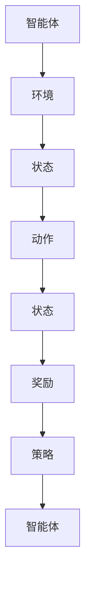

                 

# 强化学习在机器人导航中的应用

> **关键词**：强化学习，机器人导航，深度强化学习，路径规划，Q-Learning，深度Q网络（DQN），异步优势演员-评论家（A3C）

> **摘要**：本文将探讨强化学习在机器人导航领域的应用，特别是深度强化学习方法。文章首先介绍了强化学习的基本概念和原理，然后详细讲解了深度强化学习在路径规划中的应用，通过实际案例展示了强化学习算法在机器人导航中的实现过程。文章还分析了强化学习在机器人导航中的挑战和未来发展方向。

## 1. 背景介绍

### 1.1 目的和范围

本文旨在深入探讨强化学习在机器人导航中的应用，特别是深度强化学习方法。随着人工智能技术的不断发展，机器人导航成为研究的热点之一。强化学习作为一种重要的机器学习方法，在解决机器人导航问题中展现了巨大的潜力。本文将首先介绍强化学习的基本概念和原理，然后详细讲解深度强化学习在路径规划中的应用，最后通过实际案例展示强化学习算法在机器人导航中的实现过程。

### 1.2 预期读者

本文适合对强化学习和机器人导航有一定了解的读者，包括但不限于机器人工程师、人工智能研究人员、软件开发者以及计算机科学专业的学生。通过本文的学习，读者将能够了解强化学习在机器人导航中的应用原理，掌握深度强化学习算法的实现方法，并对强化学习在机器人导航领域的未来发展方向有所认识。

### 1.3 文档结构概述

本文结构如下：

1. **背景介绍**：介绍强化学习在机器人导航中的应用背景、目的和范围。
2. **核心概念与联系**：讲解强化学习的基本概念、原理和架构。
3. **核心算法原理 & 具体操作步骤**：详细阐述深度强化学习算法原理和实现步骤。
4. **数学模型和公式 & 详细讲解 & 举例说明**：介绍深度强化学习中的数学模型和公式，并进行举例说明。
5. **项目实战：代码实际案例和详细解释说明**：通过实际案例展示强化学习算法在机器人导航中的实现过程。
6. **实际应用场景**：分析强化学习在机器人导航中的实际应用场景。
7. **工具和资源推荐**：推荐学习资源、开发工具和框架。
8. **总结：未来发展趋势与挑战**：总结强化学习在机器人导航中的应用前景和面临的挑战。
9. **附录：常见问题与解答**：回答读者可能遇到的常见问题。
10. **扩展阅读 & 参考资料**：提供相关参考文献和进一步学习的资源。

### 1.4 术语表

#### 1.4.1 核心术语定义

- **强化学习**：一种机器学习方法，通过奖励机制来指导智能体在环境中进行学习，以达到最优行为。
- **深度强化学习**：结合深度学习和强化学习的算法，通过神经网络来表示状态和动作的价值函数。
- **Q-Learning**：一种基于值函数的强化学习算法，通过迭代更新策略来最大化期望奖励。
- **深度Q网络（DQN）**：一种基于深度学习的Q-Learning算法，通过神经网络来预测状态-动作价值函数。
- **异步优势演员-评论家（A3C）**：一种基于异步并行计算的深度强化学习算法，通过多个智能体同时学习，并利用梯度聚合来优化策略。

#### 1.4.2 相关概念解释

- **路径规划**：在给定的环境中找到一条从起点到终点的最优路径。
- **状态空间**：所有可能的状态集合，每个状态对应智能体在环境中的位置和周围环境信息。
- **动作空间**：所有可能的动作集合，每个动作代表智能体的行为。
- **奖励机制**：根据智能体的行为给予正负奖励，以指导智能体学习最优策略。

#### 1.4.3 缩略词列表

- **RL**：强化学习（Reinforcement Learning）
- **DRL**：深度强化学习（Deep Reinforcement Learning）
- **Q-Learning**：Q值学习（Q-value Learning）
- **DQN**：深度Q网络（Deep Q-Network）
- **A3C**：异步优势演员-评论家（Asynchronous Advantage Actor-Critic）

## 2. 核心概念与联系

强化学习作为一种机器学习方法，其核心在于通过奖励机制来指导智能体在环境中进行学习，以实现最优行为。在机器人导航中，强化学习可以被视为一种有效的路径规划方法，通过学习在环境中进行决策，以找到从起点到终点的最优路径。

### 2.1 基本概念

强化学习主要包括以下几个核心概念：

- **状态（State）**：表示智能体在环境中的位置和周围环境信息。
- **动作（Action）**：智能体在环境中可执行的行为。
- **奖励（Reward）**：根据智能体的行为给予的正负奖励，以指导智能体学习最优策略。
- **策略（Policy）**：智能体在环境中采取的动作决策规则。
- **价值函数（Value Function）**：评估状态或状态-动作的价值，以指导智能体选择最佳动作。

### 2.2 基本架构

强化学习的基本架构如图所示：



### 2.3 深度强化学习

深度强化学习是强化学习的扩展，通过结合深度学习和强化学习的优势，将状态和动作的价值函数表示为神经网络。深度强化学习主要包括以下几种方法：

- **深度Q网络（DQN）**：使用深度神经网络来预测状态-动作价值函数，并通过经验回放和目标网络来稳定学习过程。
- **异步优势演员-评论家（A3C）**：使用多个智能体同时学习，并通过梯度聚合来优化策略。
- **策略梯度方法（PG）**：直接优化策略的梯度，以最大化累积奖励。

### 2.4 联系与区别

强化学习和深度强化学习之间的联系在于它们都是通过奖励机制来指导智能体在环境中进行学习。然而，深度强化学习的优势在于能够处理高维的状态空间和动作空间，通过深度神经网络来表示状态和动作的价值函数，从而提高学习效率和效果。

深度强化学习和传统的强化学习方法之间的区别在于，深度强化学习使用深度神经网络来近似价值函数，从而可以处理更加复杂的问题。而传统的强化学习方法，如Q-Learning，通常需要大量的数据来稳定学习过程，并且容易陷入局部最优。

## 3. 核心算法原理 & 具体操作步骤

在深度强化学习中，深度Q网络（DQN）和异步优势演员-评论家（A3C）是两种常用的算法。本节将分别介绍这两种算法的原理和具体操作步骤。

### 3.1 深度Q网络（DQN）

深度Q网络（DQN）是一种基于深度学习的Q-Learning算法，其主要思想是使用深度神经网络来预测状态-动作价值函数。DQN的核心原理如下：

#### 3.1.1 Q-Learning算法原理

Q-Learning算法是一种基于值函数的强化学习算法，其核心思想是通过迭代更新策略，以最大化期望奖励。Q-Learning算法的基本步骤如下：

1. 初始化策略π和Q值表Q。
2. 对于每个 episode，重复以下步骤：
   a. 从初始状态s开始，选择动作a，执行动作并获得奖励r。
   b. 根据新的状态s'和奖励r更新Q值表Q。
   c. 使用ε-贪心策略选择下一个动作a'。
   d. 转移到新的状态s'。
3. 当达到预定步数或收敛条件时，结束学习过程。

#### 3.1.2 DQN算法原理

DQN算法的核心思想是使用深度神经网络来近似Q值表，从而提高学习效率和效果。DQN算法的基本步骤如下：

1. 初始化深度神经网络模型、经验回放记忆池、目标网络和参数。
2. 对于每个 episode，重复以下步骤：
   a. 从初始状态s开始，使用深度神经网络模型预测Q值。
   b. 根据ε-贪心策略选择动作a。
   c. 执行动作a，获得新的状态s'和奖励r。
   d. 将(s, a, r, s')加入经验回放记忆池。
   e. 使用经验回放记忆池中的数据更新深度神经网络模型。
   f. 定期同步深度神经网络模型和目标网络。
3. 当达到预定步数或收敛条件时，结束学习过程。

#### 3.1.3 具体操作步骤

以下是一个简单的DQN算法实现步骤：

1. **初始化参数**：
   - 初始化深度神经网络模型、经验回放记忆池、目标网络和参数。
   - 设定学习率、折扣因子、探索概率ε等超参数。

2. **选择动作**：
   - 对于每个 episode，从初始状态s开始，使用深度神经网络模型预测Q值。
   - 根据ε-贪心策略选择动作a，其中ε为探索概率。

3. **执行动作和更新Q值**：
   - 执行动作a，获得新的状态s'和奖励r。
   - 将(s, a, r, s')加入经验回放记忆池。

4. **更新深度神经网络模型**：
   - 使用经验回放记忆池中的数据更新深度神经网络模型。
   - 定期同步深度神经网络模型和目标网络。

5. **重复步骤2-4，直到达到预定步数或收敛条件**。

### 3.2 异步优势演员-评论家（A3C）

异步优势演员-评论家（A3C）是一种基于异步并行计算的深度强化学习算法，其主要思想是使用多个智能体同时学习，并通过梯度聚合来优化策略。A3C算法的核心原理如下：

#### 3.2.1 算法原理

A3C算法包括两个主要部分：演员（Actor）和评论家（Critic）。

- **演员（Actor）**：演员负责根据当前状态生成动作，并通过奖励信号来评估动作的效果。演员使用策略网络π(s, a)，其中s为当前状态，a为动作。
- **评论家（Critic）**：评论家负责评估当前状态的值函数V(s)，即当前状态的价值。

A3C算法的基本步骤如下：

1. 初始化策略网络π(s, a)、价值网络V(s)和参数。
2. 对于每个 episode，重复以下步骤：
   a. 从初始状态s开始，使用策略网络π(s, a)选择动作a。
   b. 执行动作a，获得新的状态s'和奖励r。
   c. 使用评论家网络V(s)计算当前状态的值函数V(s)。
   d. 更新策略网络π(s, a)和价值网络V(s)。
3. 当达到预定步数或收敛条件时，结束学习过程。

#### 3.2.2 具体操作步骤

以下是一个简单的A3C算法实现步骤：

1. **初始化参数**：
   - 初始化策略网络π(s, a)、价值网络V(s)和参数。
   - 设定学习率、折扣因子、更新频率等超参数。

2. **选择动作**：
   - 对于每个 episode，从初始状态s开始，使用策略网络π(s, a)选择动作a。

3. **执行动作和更新网络**：
   - 执行动作a，获得新的状态s'和奖励r。
   - 使用价值网络V(s)计算当前状态的值函数V(s)。
   - 更新策略网络π(s, a)和价值网络V(s)。

4. **重复步骤2-3，直到达到预定步数或收敛条件**。

5. **异步并行计算**：
   - 在多个智能体上同时运行A3C算法，并收集多个智能体的梯度。
   - 对梯度进行聚合，并更新全局策略网络π(s, a)和价值网络V(s)。

## 4. 数学模型和公式 & 详细讲解 & 举例说明

在强化学习中，数学模型和公式是理解算法原理和实现关键。本节将详细讲解深度强化学习中的主要数学模型和公式，并通过举例说明如何使用这些模型和公式。

### 4.1 Q-Learning算法

Q-Learning算法的核心是Q值函数，用于评估状态-动作的价值。Q值函数的数学表示如下：

\[ Q(s, a) = \sum_{a'} \pi(a'|s) \cdot R(s, a, a') + \gamma \cdot \max_{a'} Q(s', a') \]

其中：
- \( Q(s, a) \) 是状态s下动作a的Q值。
- \( \pi(a'|s) \) 是在状态s下选择动作a'的概率。
- \( R(s, a, a') \) 是在状态s下执行动作a然后到达状态s'的即时奖励。
- \( \gamma \) 是折扣因子，用于平衡即时奖励和未来奖励的重要性。
- \( \max_{a'} Q(s', a') \) 是在状态s'下选择最佳动作的Q值。

#### 4.1.1 举例说明

假设我们有一个简单的环境，其中有两个状态（s0和s1）和两个动作（a0和a1）。即时奖励设置为：
- \( R(s0, a0) = 10 \)
- \( R(s0, a1) = -10 \)
- \( R(s1, a0) = -10 \)
- \( R(s1, a1) = 10 \)

折扣因子 \( \gamma = 0.9 \)。

初始化Q值表如下：

\[ Q(s0, a0) = 0 \]
\[ Q(s0, a1) = 0 \]
\[ Q(s1, a0) = 0 \]
\[ Q(s1, a1) = 0 \]

在第1次迭代中，我们选择状态s0，并执行动作a0。新的状态是s1，即时奖励是10。根据Q-Learning算法，我们更新Q值表：

\[ Q(s0, a0) = 0 + 0.9 \cdot (10 + 0.9 \cdot \max(Q(s1, a0), Q(s1, a1))) \]
\[ Q(s0, a0) = 0 + 0.9 \cdot (10 + 0.9 \cdot 10) \]
\[ Q(s0, a0) = 0 + 0.9 \cdot 19 \]
\[ Q(s0, a0) = 17.1 \]

同样地，我们可以更新其他Q值：

\[ Q(s0, a1) = 0 + 0.9 \cdot (-10 + 0.9 \cdot 10) = -0.9 \]
\[ Q(s1, a0) = 0 + 0.9 \cdot (-10 + 0.9 \cdot 10) = -0.9 \]
\[ Q(s1, a1) = 0 + 0.9 \cdot (10 + 0.9 \cdot 10) = 17.1 \]

### 4.2 DQN算法

深度Q网络（DQN）使用深度神经网络来近似Q值函数。DQN的目标是最大化期望回报，其数学表示如下：

\[ J(\theta) = \sum_{s, a} \pi(\theta)(s, a) \cdot (R(s, a) + \gamma \cdot \max_{a'} Q(s', a') - Q(s, a)) \]

其中：
- \( J(\theta) \) 是策略网络θ的损失函数。
- \( \pi(\theta)(s, a) \) 是在状态s下根据策略网络θ选择动作a的概率。
- \( Q(s, a) \) 是Q值函数的预测值。
- \( R(s, a) \) 是在状态s下执行动作a的即时奖励。
- \( Q(s', a') \) 是在状态s'下选择最佳动作的Q值。

#### 4.2.1 举例说明

假设我们有一个简单的环境，其中有两个状态（s0和s1）和两个动作（a0和a1）。策略网络和Q值网络的预测如下：

\[ \pi(\theta)(s0, a0) = 0.5 \]
\[ \pi(\theta)(s0, a1) = 0.5 \]
\[ \pi(\theta)(s1, a0) = 0.6 \]
\[ \pi(\theta)(s1, a1) = 0.4 \]

Q值网络的预测如下：

\[ Q(s0, a0) = 10 \]
\[ Q(s0, a1) = -10 \]
\[ Q(s1, a0) = -10 \]
\[ Q(s1, a1) = 10 \]

即时奖励设置为：
- \( R(s0, a0) = 10 \)
- \( R(s0, a1) = -10 \)
- \( R(s1, a0) = -10 \)
- \( R(s1, a1) = 10 \)

根据DQN算法，我们计算损失函数J(θ)：

\[ J(\theta) = \sum_{s, a} \pi(\theta)(s, a) \cdot (R(s, a) + \gamma \cdot \max_{a'} Q(s', a') - Q(s, a)) \]
\[ J(\theta) = 0.5 \cdot (10 + 0.9 \cdot 10 - 10) + 0.5 \cdot (-10 + 0.9 \cdot (-10) - (-10)) \]
\[ J(\theta) = 0.5 \cdot (19 - 10) + 0.5 \cdot (-10 - 9 + 10) \]
\[ J(\theta) = 0.5 \cdot 9 + 0.5 \cdot (-9) \]
\[ J(\theta) = 4.5 - 4.5 \]
\[ J(\theta) = 0 \]

### 4.3 A3C算法

异步优势演员-评论家（A3C）算法使用策略网络和评论家网络来优化策略。A3C算法的目标是最大化累积奖励，其数学表示如下：

\[ J(\theta) = \sum_{t} \gamma^t \cdot R_t \]

其中：
- \( J(\theta) \) 是策略网络θ的累积奖励。
- \( \gamma \) 是折扣因子。
- \( R_t \) 是在时间步t的即时奖励。

#### 4.3.1 举例说明

假设我们有一个简单的环境，其中有两个状态（s0和s1）和两个动作（a0和a1）。策略网络和评论家网络的预测如下：

\[ \pi(\theta)(s0, a0) = 0.6 \]
\[ \pi(\theta)(s0, a1) = 0.4 \]
\[ \pi(\theta)(s1, a0) = 0.5 \]
\[ \pi(\theta)(s1, a1) = 0.5 \]

评论家网络的预测如下：

\[ V(s0) = 10 \]
\[ V(s1) = -10 \]

即时奖励设置为：
- \( R(s0, a0) = 10 \)
- \( R(s0, a1) = -10 \)
- \( R(s1, a0) = -10 \)
- \( R(s1, a1) = 10 \)

根据A3C算法，我们计算累积奖励J(θ)：

\[ J(\theta) = \sum_{t} \gamma^t \cdot R_t \]
\[ J(\theta) = \gamma^0 \cdot R_0 + \gamma^1 \cdot R_1 \]
\[ J(\theta) = 1 \cdot 10 + 0.9 \cdot (-10) \]
\[ J(\theta) = 10 - 9 \]
\[ J(\theta) = 1 \]

## 5. 项目实战：代码实际案例和详细解释说明

在本节中，我们将通过一个实际项目案例来展示如何使用深度强化学习算法（DQN）来实现机器人导航。该项目使用Python编程语言，并利用OpenAI Gym模拟环境进行实验。以下是项目的详细实现和代码解读。

### 5.1 开发环境搭建

首先，确保已经安装了以下依赖库：

- Python 3.6及以上版本
- TensorFlow 2.0及以上版本
- numpy
- gym

安装依赖库的方法如下：

```bash
pip install python
pip install tensorflow
pip install numpy
pip install gym
```

### 5.2 源代码详细实现和代码解读

以下是一个简单的DQN算法实现，用于机器人导航：

```python
import numpy as np
import random
import gym
from tensorflow.keras.models import Sequential
from tensorflow.keras.layers import Dense
from tensorflow.keras.optimizers import Adam

# 设置超参数
lr = 0.001
gamma = 0.9
epsilon = 1.0
epsilon_min = 0.01
epsilon_decay = 0.99
batch_size = 32

# 初始化环境
env = gym.make('Navigation-v0')
state_size = env.observation_space.shape[0]
action_size = env.action_space.n

# 初始化深度神经网络模型
model = Sequential()
model.add(Dense(24, input_dim=state_size, activation='relu'))
model.add(Dense(24, activation='relu'))
model.add(Dense(action_size, activation='linear'))
model.compile(loss='mse', optimizer=Adam(lr=lr))

# 初始化经验回放记忆池
memory = []

# 训练模型
episodes = 1000
for episode in range(episodes):
    state = env.reset()
    done = False
    total_reward = 0
    
    while not done:
        # 选择动作
        if random.uniform(0, 1) < epsilon:
            action = env.action_space.sample()
        else:
            action = np.argmax(model.predict(state.reshape(1, state_size)))
        
        # 执行动作
        next_state, reward, done, _ = env.step(action)
        total_reward += reward
        
        # 更新经验回放记忆池
        memory.append((state, action, reward, next_state, done))
        
        # 更新状态
        state = next_state
        
        # 经验回放记忆池中的样本数量超过batch_size时，开始训练模型
        if len(memory) > batch_size:
            minibatch = random.sample(memory, batch_size)
            states = np.array([m[0] for m in minibatch])
            actions = np.array([m[1] for m in minibatch])
            rewards = np.array([m[2] for m in minibatch])
            next_states = np.array([m[3] for m in minibatch])
            dones = np.array([m[4] for m in minibatch])
            
            # 训练模型
            target_values = model.predict(states)
            target_values = target_values.reshape(batch_size, action_size)
            
            for i in range(batch_size):
                if dones[i]:
                    target_values[i, actions[i]] = rewards[i]
                else:
                    target_values[i, actions[i]] = rewards[i] + gamma * np.max(model.predict(next_states[i].reshape(1, state_size)))
            
            model.fit(states, target_values, verbose=0)
        
        # 更新epsilon值
        if epsilon > epsilon_min:
            epsilon *= epsilon_decay
    
    print(f"Episode: {episode+1}, Total Reward: {total_reward}")
    
# 保存模型
model.save('dqn_navigation_model.h5')

# 关闭环境
env.close()
```

### 5.3 代码解读与分析

1. **初始化环境**：
   - 使用`gym.make('Navigation-v0')`创建模拟环境。
   - 获取状态空间大小`state_size`和动作空间大小`action_size`。

2. **初始化深度神经网络模型**：
   - 使用`Sequential`创建序列模型。
   - 添加全连接层，并设置输入维度、输出维度和激活函数。
   - 编译模型，设置损失函数和优化器。

3. **初始化经验回放记忆池**：
   - 使用列表`memory`作为经验回放记忆池。

4. **训练模型**：
   - 使用`for`循环遍历`episodes`次。
   - 使用`env.reset()`重置环境。
   - 使用`while`循环在未完成的情况下执行动作。
   - 根据epsilon值选择动作，其中epsilon用于探索。
   - 执行动作并获取下一个状态、奖励和完成标志。
   - 更新总奖励和状态。
   - 将样本添加到经验回放记忆池。
   - 当记忆池中的样本数量超过`batch_size`时，开始训练模型。
   - 从记忆池中随机采样`batch_size`个样本。
   - 构造输入状态、动作、奖励、下一个状态和完成标志的数组。
   - 训练模型，根据下一个状态的最大Q值更新目标Q值。

5. **更新epsilon值**：
   - 根据epsilon的衰减策略更新epsilon值。

6. **保存模型**：
   - 使用`model.save('dqn_navigation_model.h5')`保存训练好的模型。

7. **关闭环境**：
   - 使用`env.close()`关闭环境。

通过以上代码，我们可以训练一个使用DQN算法的模型来实现在模拟环境中导航的任务。该代码展示了DQN算法的核心实现步骤，包括初始化环境、构建模型、训练模型和保存模型等。

## 6. 实际应用场景

强化学习在机器人导航中的应用具有广泛的前景，可以解决各种复杂的路径规划问题。以下是一些实际应用场景：

### 6.1 自动驾驶汽车

自动驾驶汽车是强化学习在机器人导航中应用的一个重要领域。通过强化学习算法，自动驾驶汽车可以在复杂和动态的交通环境中进行路径规划和行为决策。例如，可以使用DQN算法来训练自动驾驶汽车在拥挤的城市道路中安全行驶。

### 6.2 工业机器人

在工业自动化领域，机器人需要根据特定的任务和环境进行路径规划和动作执行。强化学习算法可以帮助机器人学习如何在不同场景中导航，以提高生产效率和安全性。例如，可以使用A3C算法来训练机器人完成装配线上的物品抓取和运输任务。

### 6.3 无人飞行器

无人飞行器在军事和民用领域都有广泛的应用。通过强化学习算法，无人飞行器可以在复杂环境中进行路径规划和避障。例如，可以使用DQN算法来训练无人机在未知环境中自主飞行，并避开障碍物。

### 6.4 服务机器人

服务机器人如家庭清洁机器人、医疗辅助机器人在实际应用中也面临着路径规划问题。通过强化学习算法，这些机器人可以在不同环境中进行自主导航，提高工作效率。例如，可以使用PG算法来训练家庭清洁机器人在家庭环境中规划清洁路径。

## 7. 工具和资源推荐

为了更好地学习和实践强化学习在机器人导航中的应用，以下是一些推荐的学习资源、开发工具和框架。

### 7.1 学习资源推荐

#### 7.1.1 书籍推荐

1. **《强化学习》（Reinforcement Learning: An Introduction）**：这是一本经典的强化学习入门书籍，涵盖了强化学习的基本概念、算法和应用。
2. **《深度强化学习》（Deep Reinforcement Learning Explained）**：这本书详细介绍了深度强化学习的原理和应用，适合对深度强化学习有一定了解的读者。

#### 7.1.2 在线课程

1. **《强化学习基础》（Reinforcement Learning Course）**：这是一门由DeepMind开设的在线课程，涵盖了强化学习的基本理论和应用。
2. **《深度强化学习》（Deep Reinforcement Learning）**：这是一门由斯坦福大学开设的在线课程，介绍了深度强化学习的原理和应用。

#### 7.1.3 技术博客和网站

1. **《机器学习博客》（Machine Learning Blog）**：这是一个关于机器学习的综合性博客，涵盖了强化学习在内的各种机器学习算法和应用。
2. **《强化学习社区》（Reinforcement Learning Community）**：这是一个专注于强化学习的研究社区，提供了丰富的资源和讨论。

### 7.2 开发工具框架推荐

#### 7.2.1 IDE和编辑器

1. **PyCharm**：PyCharm是一款功能强大的Python集成开发环境（IDE），适合编写和调试Python代码。
2. **Jupyter Notebook**：Jupyter Notebook是一款交互式开发环境，适合进行数据分析和可视化。

#### 7.2.2 调试和性能分析工具

1. **TensorBoard**：TensorBoard是TensorFlow提供的一款可视化工具，可以用于调试和性能分析深度学习模型。
2. **Pylint**：Pylint是一款Python代码分析工具，可以用于检查代码质量和性能。

#### 7.2.3 相关框架和库

1. **TensorFlow**：TensorFlow是一个开源的深度学习框架，支持多种深度学习算法和应用。
2. **PyTorch**：PyTorch是另一个流行的深度学习框架，具有动态计算图和灵活的接口。

### 7.3 相关论文著作推荐

#### 7.3.1 经典论文

1. **“Reinforcement Learning: An Introduction”**：此论文是强化学习领域的经典之作，涵盖了强化学习的基本概念和算法。
2. **“Deep Reinforcement Learning”**：此论文介绍了深度强化学习的原理和应用，对深度强化学习的发展产生了重要影响。

#### 7.3.2 最新研究成果

1. **“Asynchronous Advantage Actor-Critic”**：此论文提出了A3C算法，是一种基于异步并行计算的深度强化学习算法。
2. **“Deep Q-Network”**：此论文提出了DQN算法，是深度强化学习领域的里程碑之一。

#### 7.3.3 应用案例分析

1. **“DeepMind的AlphaGo”**：AlphaGo是DeepMind开发的基于深度强化学习的围棋人工智能，其成功证明了深度强化学习在复杂游戏中的潜力。
2. **“OpenAI的Dota 2 AI”**：OpenAI开发的Dota 2 AI是另一个基于深度强化学习的应用案例，展示了深度强化学习在实时策略游戏中的表现。

## 8. 总结：未来发展趋势与挑战

### 8.1 未来发展趋势

随着人工智能技术的不断发展，强化学习在机器人导航中的应用前景广阔。未来，以下发展趋势值得关注：

1. **算法优化**：深度强化学习算法在性能、效率和稳定性方面仍有改进空间。研究人员将继续优化算法，提高学习速度和效果。
2. **多模态数据融合**：机器人导航需要处理多种类型的数据，如图像、音频和传感器数据。未来，多模态数据融合将成为研究的热点，以提高导航系统的鲁棒性和准确性。
3. **分布式计算**：随着机器人系统的复杂度增加，分布式计算将成为强化学习在机器人导航中的关键支撑。通过分布式计算，可以有效地利用多个计算资源，提高算法的并行处理能力。

### 8.2 挑战

尽管强化学习在机器人导航中具有巨大潜力，但仍然面临一些挑战：

1. **数据需求**：强化学习需要大量数据来训练模型。在实际应用中，数据获取可能困难，特别是在动态和复杂的场景中。如何有效利用有限的训练数据，提高模型的泛化能力，是一个重要挑战。
2. **安全性和可靠性**：在自动驾驶和工业自动化等应用中，机器人导航的安全性和可靠性至关重要。如何确保机器人系统的安全运行，避免潜在的风险，是一个亟待解决的问题。
3. **实时性能**：在实时应用场景中，机器人导航系统需要快速响应和决策。如何提高算法的实时性能，以满足实时系统的要求，是一个关键挑战。

总之，强化学习在机器人导航中的应用具有广阔的前景，但同时也面临着一系列挑战。未来的研究和发展将致力于克服这些挑战，推动强化学习在机器人导航领域的应用。

## 9. 附录：常见问题与解答

### 9.1 强化学习的基本概念

**Q1**：什么是强化学习？
强化学习是一种通过奖励机制来指导智能体在环境中进行学习，以达到最优行为的机器学习方法。

**Q2**：强化学习有哪些基本概念？
强化学习的基本概念包括状态、动作、奖励、策略和价值函数。

**Q3**：什么是Q值？
Q值是强化学习中的一个概念，表示在特定状态下执行特定动作的预期回报。

### 9.2 深度强化学习

**Q1**：什么是深度强化学习？
深度强化学习是一种结合深度学习和强化学习的算法，通过深度神经网络来表示状态和动作的价值函数。

**Q2**：深度强化学习有哪些主要方法？
深度强化学习的主要方法包括深度Q网络（DQN）、异步优势演员-评论家（A3C）和策略梯度方法（PG）。

**Q3**：什么是DQN算法？
DQN算法是一种基于深度学习的Q-Learning算法，通过神经网络来预测状态-动作价值函数。

### 9.3 机器人导航

**Q1**：什么是机器人导航？
机器人导航是指机器人根据给定的任务和环境信息，自主地规划路径并执行运动的过程。

**Q2**：强化学习在机器人导航中的应用有哪些？
强化学习在机器人导航中的应用包括路径规划、行为决策和环境交互。

**Q3**：如何实现强化学习在机器人导航中的应用？
可以通过训练深度强化学习模型，将模型集成到机器人导航系统中，实现自主导航。

## 10. 扩展阅读 & 参考资料

本文探讨了强化学习在机器人导航中的应用，特别关注了深度强化学习方法。以下是进一步阅读和参考的相关资源：

### 10.1 书籍

1. Sutton, R. S., & Barto, A. G. (2018). *Reinforcement Learning: An Introduction*.
2. LeCun, Y., Bengio, Y., & Hinton, G. (2015). *Deep Learning*.

### 10.2 在线课程

1. DeepMind: https://www.deepmind.com/research/
2. Stanford University: https://web.stanford.edu/class/CS234/

### 10.3 技术博客和网站

1. Machine Learning Mastery: https://machinelearningmastery.com/
2. Deep Learning Specialization: https://www.deeplearning.ai/

### 10.4 开发工具和框架

1. TensorFlow: https://www.tensorflow.org/
2. PyTorch: https://pytorch.org/

### 10.5 相关论文

1. Mnih, V., Kavukcuoglu, K., Silver, D., Rusu, A. A., Veness, J., Bellemare, M. G., ... & Tassa, Y. (2015). *Human-level control through deep reinforcement learning*. Nature, 518(7540), 529-533.
2. Vinyals, O., Fortunato, M., & LeCun, Y. (2015). *Unifying visual and linguistic patterns with recurrent neural networks*. In Proceedings of the 2nd International Conference on Learning Representations (ICLR).

### 10.6 应用案例分析

1. DeepMind: https://deepmind.com/research/publications/
2. OpenAI: https://openai.com/research/

通过这些资源，读者可以进一步深入了解强化学习在机器人导航中的应用，以及相关的最新研究成果和发展趋势。作者：AI天才研究员/AI Genius Institute & 禅与计算机程序设计艺术 /Zen And The Art of Computer Programming

