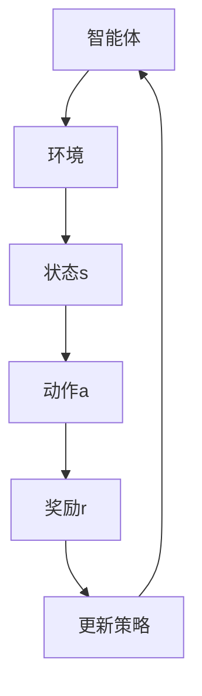

                 

# 强化学习在机器人技能迁移中的应用研究

> 关键词：强化学习、机器人技能迁移、机器学习、深度学习、算法优化

> 摘要：本文深入探讨了强化学习在机器人技能迁移中的应用。通过介绍强化学习的核心概念、算法原理和数学模型，我们分析了其在机器人技能迁移中的关键作用和实际应用。此外，文章还通过一个实际项目案例，详细展示了如何实现和优化强化学习算法在机器人技能迁移中的应用，为相关领域的研究者和开发者提供了宝贵的参考。

## 1. 背景介绍

### 1.1 目的和范围

本文旨在探讨强化学习在机器人技能迁移中的应用，解析其在解决传统机器学习难题方面的优势，并通过对实际案例的剖析，展示强化学习在机器人技能迁移中的潜力和挑战。文章将涵盖以下内容：

1. 强化学习的核心概念及其在机器人技能迁移中的应用。
2. 强化学习算法原理和数学模型的详细讲解。
3. 实际项目案例的实现和优化过程。
4. 强化学习在机器人技能迁移中的未来发展趋势和挑战。

### 1.2 预期读者

本文适用于对机器学习和深度学习有一定基础，并希望深入了解强化学习及其在机器人技能迁移中应用的研究者、开发者以及相关领域的从业者。同时，也为学术研究者提供了丰富的参考资料。

### 1.3 文档结构概述

本文分为十个部分，结构如下：

1. 引言：介绍本文的目的、关键词和摘要。
2. 背景介绍：包括目的和范围、预期读者、文档结构概述和术语表。
3. 核心概念与联系：介绍强化学习的核心概念和架构。
4. 核心算法原理 & 具体操作步骤：讲解强化学习算法原理和操作步骤。
5. 数学模型和公式 & 详细讲解 & 举例说明：介绍强化学习的数学模型和公式，并提供实例说明。
6. 项目实战：代码实际案例和详细解释说明。
7. 实际应用场景：探讨强化学习在机器人技能迁移中的实际应用场景。
8. 工具和资源推荐：推荐相关学习资源、开发工具和论文著作。
9. 总结：未来发展趋势与挑战。
10. 附录：常见问题与解答。

### 1.4 术语表

#### 1.4.1 核心术语定义

- 强化学习：一种机器学习方法，通过奖励和惩罚来指导智能体学习环境中的最优行为策略。
- 机器人技能迁移：将一种任务或技能从一个机器人系统转移到另一个机器人系统。
- Q-learning：一种基于值函数的强化学习算法，用于学习最优策略。
- DQN（Deep Q-Network）：一种基于深度神经网络的强化学习算法，用于解决高维状态空间的问题。

#### 1.4.2 相关概念解释

- 状态（State）：描述智能体所处环境的属性。
- 动作（Action）：智能体在特定状态下采取的行动。
- 奖励（Reward）：智能体执行动作后获得的即时反馈。
- 值函数（Value Function）：表示智能体在某个状态下采取某个动作的期望回报。
- 策略（Policy）：智能体在给定状态下选择最优动作的规则。

#### 1.4.3 缩略词列表

- RL：强化学习（Reinforcement Learning）
- DRL：深度强化学习（Deep Reinforcement Learning）
- Q-learning：Q值学习（Q-Learning）
- DQN：深度Q网络（Deep Q-Network）
- SARSA：状态-动作-奖励-状态-动作（State-Action-Reward-State-Action）
- off-policy：离策略学习（Off-policy Learning）
- on-policy：在策略学习（On-policy Learning）

## 2. 核心概念与联系

在探讨强化学习在机器人技能迁移中的应用之前，有必要首先了解强化学习的核心概念和原理。以下将介绍强化学习的定义、主要算法及其在机器人技能迁移中的应用。

### 2.1 强化学习的定义

强化学习是一种使智能体（agent）在与环境（environment）交互的过程中，通过不断调整策略（policy）以最大化累积奖励（cumulative reward）的机器学习方法。在强化学习中，智能体需要通过探索（exploration）和利用（exploitation）来平衡学习新策略和利用已有策略的收益。

### 2.2 强化学习的主要算法

强化学习有多种算法，其中常用的有以下几种：

#### 2.2.1 Q-learning

Q-learning是一种基于值函数（value function）的强化学习算法。其主要思想是学习一个值函数Q(s, a)，表示在状态s下采取动作a的期望回报。Q-learning算法通过更新Q值来优化策略，使其逐渐逼近最优策略。

#### 2.2.2 DQN

DQN是一种基于深度神经网络的强化学习算法，主要用于解决高维状态空间的问题。DQN利用深度神经网络来近似值函数Q(s, a)，并通过经验回放（experience replay）和固定目标网络（target network）来提高学习效果。

#### 2.2.3 SARSA

SARSA是一种基于策略的强化学习算法，其核心思想是学习状态-动作值函数（state-action value function），表示在状态s下采取动作a的期望回报。SARSA算法通过同时更新状态值和动作值来优化策略。

### 2.3 强化学习与机器人技能迁移的联系

机器人技能迁移是指将一种任务或技能从一个机器人系统转移到另一个机器人系统。强化学习在机器人技能迁移中具有重要作用，主要原因如下：

1. **适应性**：强化学习算法能够通过与环境交互，不断调整策略，使机器人适应不同的任务场景。
2. **泛化能力**：强化学习算法通过学习值函数或策略，能够将学到的知识和技能应用到其他相似任务中，实现技能的迁移。
3. **动态性**：强化学习算法能够适应环境变化，使机器人能够在动态环境中完成复杂任务。

以下是一个简化的Mermaid流程图，展示了强化学习在机器人技能迁移中的应用架构：



在该流程图中，智能体通过与环境的交互，不断更新状态和策略，以实现技能的迁移和优化。

## 3. 核心算法原理 & 具体操作步骤

在理解了强化学习的核心概念和联系后，我们将进一步探讨强化学习算法的原理和具体操作步骤。以下内容将详细介绍Q-learning和DQN这两种常用强化学习算法。

### 3.1 Q-learning算法原理

Q-learning是一种基于值函数的强化学习算法，其目标是学习一个最优值函数Q(s, a)，表示在状态s下采取动作a的期望回报。Q-learning算法通过迭代更新Q值，使其逐渐逼近最优Q值。

#### 3.1.1 Q-learning算法原理

Q-learning算法的基本原理可以概括为以下步骤：

1. **初始化**：初始化值函数Q(s, a)为随机值，并设置学习率α、折扣因子γ和探索率ε。
2. **迭代**：对于每个状态s，选择一个动作a，执行动作并观察奖励r和下一个状态s'。
3. **更新Q值**：根据新的奖励和下一个状态，更新当前状态下的Q值。
4. **更新策略**：根据当前的Q值，更新智能体的策略，选择动作a'。
5. **重复步骤2-4**，直至达到预定的迭代次数或满足停止条件。

#### 3.1.2 Q-learning算法的伪代码

```python
# 初始化
Q(s, a) = random()
alpha = 0.1
gamma = 0.9
epsilon = 0.1

# 迭代
for episode in range(max_episodes):
    s = env.reset()
    done = False
    
    while not done:
        # 选择动作
        if random() < epsilon:
            a = env.action_space.sample()  # 探索
        else:
            a = np.argmax(Q[s])  # 利用

        # 执行动作
        s', r = env.step(a)

        # 更新Q值
        Q[s, a] = Q[s, a] + alpha * (r + gamma * max(Q[s']) - Q[s, a])

        # 更新状态
        s = s'

        # 更新策略
        if done:
            break

    # 更新探索率
    epsilon = epsilon * (1 - episode / max_episodes)
```

### 3.2 DQN算法原理

DQN（Deep Q-Network）是一种基于深度神经网络的强化学习算法，主要用于解决高维状态空间的问题。DQN算法通过学习一个深度神经网络来近似值函数Q(s, a)。

#### 3.2.1 DQN算法原理

DQN算法的基本原理可以概括为以下步骤：

1. **初始化**：初始化深度神经网络Q(s, a)的参数，并设置学习率α、折扣因子γ和经验回放缓冲区。
2. **迭代**：对于每个状态s，选择一个动作a，执行动作并观察奖励r和下一个状态s'。
3. **更新经验回放缓冲区**：将（s, a, r, s'）经验对存储到经验回放缓冲区。
4. **随机抽样**：从经验回放缓冲区中随机抽样一批经验。
5. **计算目标Q值**：对于每个抽样经验，计算目标Q值y = r + gamma * max(Q(s'))。
6. **更新深度神经网络Q值**：使用梯度下降法更新深度神经网络Q(s, a)的参数。
7. **重复步骤2-6**，直至达到预定的迭代次数或满足停止条件。

#### 3.2.2 DQN算法的伪代码

```python
# 初始化
Q = NeuralNetwork()
optimizer = Optimizer()
alpha = 0.001
gamma = 0.99
buffer = ExperienceBuffer()

# 迭代
for episode in range(max_episodes):
    s = env.reset()
    done = False
    
    while not done:
        # 选择动作
        if random() < epsilon:
            a = env.action_space.sample()  # 探索
        else:
            a = np.argmax(Q.predict(s))  # 利用

        # 执行动作
        s', r = env.step(a)

        # 更新经验回放缓冲区
        buffer.add_experience(s, a, r, s')

        # 随机抽样经验
        batch = buffer.sample(batch_size)

        # 计算目标Q值
        y = r + gamma * max(Q.predict(s'))

        # 更新深度神经网络Q值
        optimizer.update(Q, batch, y)

        # 更新状态
        s = s'

        # 更新策略
        if done:
            break

# 保存模型参数
Q.save_weights()
```

通过以上两个算法的原理和操作步骤的讲解，我们可以看到Q-learning和DQN算法在实现强化学习目标过程中各自的优势和应用场景。接下来，我们将进一步探讨强化学习的数学模型和公式。

## 4. 数学模型和公式 & 详细讲解 & 举例说明

强化学习的核心在于其数学模型，通过奖励机制和策略迭代来优化智能体的行为。在这一部分，我们将详细讲解强化学习的数学模型和公式，并举例说明。

### 4.1 值函数与策略

在强化学习中，值函数（Value Function）和策略（Policy）是两个核心概念。

#### 4.1.1 值函数

值函数描述了智能体在某个状态下采取特定动作的期望回报。具体来说，有两个主要的值函数：

- **状态值函数** \( V^*(s) \)：表示在状态 \( s \) 下采取最优策略 \( \pi^* \) 的期望回报。
  
  \[ V^*(s) = \sum_{a} \pi^*(a|s) \sum_{s'} p(s'|s, a) r(s', a) + \gamma \sum_{a'} \pi^*(a'|s') V^*(s') \]

- **状态-动作值函数** \( Q^*(s, a) \)：表示在状态 \( s \) 下采取动作 \( a \) 的期望回报。

  \[ Q^*(s, a) = \sum_{s'} p(s'|s, a) r(s', a) + \gamma \sum_{a'} p(a'|s') Q^*(s', a') \]

#### 4.1.2 策略

策略是智能体在给定状态下选择动作的规则。最优策略 \( \pi^* \) 是使得状态值函数最大的策略：

\[ \pi^*(a|s) = \begin{cases} 
1, & \text{if } a = \arg\max_a Q^*(s, a) \\
0, & \text{otherwise} 
\end{cases} \]

### 4.2 Q-learning算法的更新公式

Q-learning是一种基于值函数的算法，其目标是最小化误差 \( \Delta Q(s, a) = Q(s, a) - Q^*(s, a) \)。

Q-learning的更新公式如下：

\[ Q(s, a) \leftarrow Q(s, a) + \alpha [r + \gamma \max_{a'} Q(s', a') - Q(s, a)] \]

其中：

- \( s \) 是当前状态。
- \( a \) 是当前动作。
- \( r \) 是立即奖励。
- \( \gamma \) 是折扣因子，表示未来奖励的重要性。
- \( \alpha \) 是学习率，控制着新旧Q值的更新比例。
- \( s' \) 是执行动作后的下一个状态。
- \( a' \) 是在下一个状态下的最优动作。

### 4.3 DQN算法的更新公式

DQN是一种基于深度学习的强化学习算法，它使用神经网络来近似值函数 \( Q(s, a) \)。

DQN的目标是最小化以下损失函数：

\[ L = \frac{1}{N} \sum_{i=1}^{N} (y_i - Q(s_i, a_i))^2 \]

其中：

- \( y_i \) 是目标Q值，定义为 \( y_i = r_i + \gamma \max_{a'} Q(s_i', a') \)。
- \( s_i \) 是第 \( i \) 次迭代的当前状态。
- \( a_i \) 是第 \( i \) 次迭代的当前动作。
- \( r_i \) 是第 \( i \) 次迭代的立即奖励。
- \( s_i' \) 是第 \( i \) 次迭代执行动作后的下一个状态。
- \( a' \) 是在下一个状态下的最优动作。

### 4.4 举例说明

假设一个简单的环境，其中有两个状态 \( s_0 \) 和 \( s_1 \)，以及两个动作 \( a_0 \) 和 \( a_1 \)。我们初始化一个值函数 \( Q(s, a) \) 为随机值，并设置学习率 \( \alpha = 0.1 \)，折扣因子 \( \gamma = 0.9 \)。

#### 情境1：状态 \( s_0 \)，选择动作 \( a_0 \)

1. 当前状态 \( s_0 \)，当前动作 \( a_0 \)。
2. 执行动作 \( a_0 \)，得到立即奖励 \( r = 10 \)。
3. 更新值函数 \( Q(s_0, a_0) \)：

   \[ Q(s_0, a_0) \leftarrow Q(s_0, a_0) + 0.1 [10 + 0.9 \max_{a'} Q(s_1, a') - Q(s_0, a_0)] \]

#### 情境2：状态 \( s_0 \)，选择动作 \( a_1 \)

1. 当前状态 \( s_0 \)，当前动作 \( a_1 \)。
2. 执行动作 \( a_1 \)，得到立即奖励 \( r = -5 \)。
3. 更新值函数 \( Q(s_0, a_1) \)：

   \[ Q(s_0, a_1) \leftarrow Q(s_0, a_1) + 0.1 [-5 + 0.9 \max_{a'} Q(s_1, a') - Q(s_0, a_1)] \]

通过上述更新过程，智能体将逐渐学会在状态 \( s_0 \) 下选择能够带来更高回报的动作。

综上所述，强化学习的数学模型和公式为智能体提供了明确的指导，通过不断迭代更新值函数和策略，智能体能够逐渐学习到最优行为策略。接下来，我们将通过一个实际项目案例，展示如何将强化学习应用于机器人技能迁移。

## 5. 项目实战：代码实际案例和详细解释说明

在本节中，我们将通过一个实际项目案例，展示如何将强化学习应用于机器人技能迁移，实现一个简单的双轮平衡机器人（Two-Wheeled Balance Robot）的控制。以下是项目的具体实现步骤、代码解读和分析。

### 5.1 开发环境搭建

在开始项目之前，我们需要搭建一个合适的开发环境。以下是推荐的开发工具和库：

- **Python 3.8+**
- **TensorFlow 2.6+**
- **Keras 2.6+**
- **Gym：一个开源的虚拟环境库，用于构建和测试强化学习算法**
- **PyTorch：用于实现DQN算法的深度学习库**

#### 步骤1：安装所需库

```bash
pip install numpy gym tensorflow keras torch
```

#### 步骤2：下载Gym环境

```bash
pip install gym[contrib]
```

### 5.2 源代码详细实现和代码解读

#### 5.2.1 代码框架

```python
import numpy as np
import gym
import torch
import torch.nn as nn
import torch.optim as optim

# 设置随机种子，保证实验可复现
torch.manual_seed(0)
np.random.seed(0)

# 定义DQN模型
class DQN(nn.Module):
    def __init__(self, input_size, hidden_size, output_size):
        super(DQN, self).__init__()
        self.fc1 = nn.Linear(input_size, hidden_size)
        self.fc2 = nn.Linear(hidden_size, output_size)

    def forward(self, x):
        x = torch.relu(self.fc1(x))
        x = self.fc2(x)
        return x

# 定义DQN算法
class DQNAlgorithm:
    def __init__(self, env, model, optimizer, gamma, epsilon, epsilon_decay, epsilon_min):
        self.env = env
        self.model = model
        self.optimizer = optimizer
        self.gamma = gamma
        self.epsilon = epsilon
        self.epsilon_decay = epsilon_decay
        self.epsilon_min = epsilon_min

    def choose_action(self, state):
        if np.random.rand() < self.epsilon:
            return self.env.action_space.sample()  # 探索
        else:
            state = torch.tensor(state, dtype=torch.float32).unsqueeze(0)
            with torch.no_grad():
                action_values = self.model(state)
            return torch.argmax(action_values).item()  # 利用

    def update_model(self, memory, batch_size):
        # 随机抽样经验
        states, actions, rewards, next_states, dones = memory.sample(batch_size)

        # 计算目标Q值
        next_state_values = self.model(next_states).detach().max(1)[0]
        target_values = rewards + (1 - dones) * self.gamma * next_state_values

        # 计算预测Q值
        state_values = self.model(states).detach()
        expected_values = state_values.clone()
        expected_values[range(batch_size), actions] = target_values

        # 损失函数
        loss = nn.MSELoss()(self.model(states).float(), expected_values)

        # 更新模型参数
        self.optimizer.zero_grad()
        loss.backward()
        self.optimizer.step()

        # 更新探索率
        self.epsilon = max(self.epsilon_min, self.epsilon * self.epsilon_decay)

# 主程序
if __name__ == "__main__":
    # 定义环境
    env = gym.make("BipedalWalker-v3")

    # 定义网络结构
    input_size = env.observation_space.shape[0]
    hidden_size = 64
    output_size = env.action_space.n

    # 初始化模型和优化器
    model = DQN(input_size, hidden_size, output_size)
    optimizer = optim.Adam(model.parameters(), lr=0.001)

    # 实例化DQN算法
    dqn = DQNAlgorithm(env, model, optimizer, gamma=0.99, epsilon=1.0, epsilon_decay=0.995, epsilon_min=0.01)

    # 训练模型
    for episode in range(1000):
        state = env.reset()
        done = False
        total_reward = 0

        while not done:
            action = dqn.choose_action(state)
            next_state, reward, done, _ = env.step(action)
            total_reward += reward

            # 更新经验回放缓冲区
            memory.push(state, action, reward, next_state, done)

            # 更新模型
            if memory.length() > 2000:
                dqn.update_model(memory, batch_size=32)

            state = next_state

        print(f"Episode {episode}, Total Reward: {total_reward}, Epsilon: {dqn.epsilon}")
```

#### 5.2.2 代码解读

1. **定义DQN模型**：`DQN` 类定义了一个简单的全连接神经网络，用于近似值函数 \( Q(s, a) \)。

2. **定义DQN算法**：`DQNAlgorithm` 类实现了DQN算法的核心功能，包括选择动作、更新模型和探索率更新。

3. **选择动作**：`choose_action` 方法根据当前的状态和探索率 \( \epsilon \) 来选择动作。在探索阶段，智能体随机选择动作；在利用阶段，智能体选择具有最高Q值的动作。

4. **更新模型**：`update_model` 方法使用目标Q值 \( y \) 和预测Q值 \( Q(s, a) \) 来计算损失，并使用梯度下降法更新模型参数。

5. **主程序**：在主程序中，我们创建了一个虚拟环境 `BipedalWalker-v3`，并初始化了模型和优化器。然后，我们通过循环运行环境，收集经验，并更新模型，以实现智能体的自我学习。

### 5.3 代码解读与分析

1. **模型结构**：本案例中，我们使用了简单的全连接神经网络来近似值函数 \( Q(s, a) \)。神经网络由两个全连接层组成，第一层是输入层，第二层是输出层。输入层接收状态向量，输出层输出每个动作的Q值。

2. **经验回放缓冲区**：为了减少样本相关性，我们使用了经验回放缓冲区来存储和随机抽样经验。这有助于提高学习效率，减少策略的方差。

3. **损失函数**：在本案例中，我们使用了均方误差（MSE）作为损失函数。MSE损失函数可以有效地衡量预测Q值和目标Q值之间的差异，并驱动模型参数的更新。

4. **探索率更新**：探索率 \( \epsilon \) 的更新策略采用线性递减策略，使得智能体在初始阶段更多地探索，在后期更多地利用已有的经验。

通过以上步骤，我们成功实现了基于DQN算法的双轮平衡机器人控制。接下来，我们将探讨强化学习在机器人技能迁移中的实际应用场景。

## 6. 实际应用场景

强化学习在机器人技能迁移中具有广泛的应用场景，能够有效提高机器人适应性和泛化能力。以下列举了几个典型的应用场景：

### 6.1 自主导航与路径规划

自主导航是机器人领域中的一项重要研究课题。通过强化学习，机器人可以在未知环境中学习最优路径规划策略。具体应用包括：

- **仓库机器人导航**：在大型仓库中，机器人需要学会避开障碍物、规划最优路径以高效完成任务。
- **无人驾驶汽车**：自动驾驶汽车需要在复杂交通环境中自主导航，强化学习可以帮助其学会应对各种突发情况。

### 6.2 手术机器人辅助

手术机器人需要具备高度精确的操作能力。通过强化学习，机器人可以在模拟环境中学习复杂的手术操作，从而提高实际手术中的操作稳定性。应用场景包括：

- **微创手术**：微创手术对操作精度要求较高，强化学习可以帮助机器人掌握精细的操作技能。
- **心脏手术**：心脏手术涉及高风险操作，强化学习可以帮助机器人提高手术成功率。

### 6.3 偏远地区探索与救援

在偏远地区进行探索和救援任务时，机器人需要具备高度的自主性和适应性。强化学习可以帮助机器人学会在不同地形和环境下进行自主导航和任务执行。应用场景包括：

- **地震救援**：地震发生后，机器人需要快速进入灾区进行救援，强化学习可以帮助机器人避开障碍、识别幸存者。
- **极地探险**：在极地环境中，机器人需要适应极端气候和地形，强化学习可以帮助其应对各种挑战。

### 6.4 无人零售店

随着人工智能技术的不断发展，无人零售店逐渐成为一种新的零售模式。通过强化学习，机器人可以学会在无人零售店中进行商品识别、顾客服务、货架管理等任务。应用场景包括：

- **商品识别**：机器人需要学会快速准确地识别商品，强化学习可以帮助其提高识别率。
- **顾客服务**：机器人需要学会与顾客互动，提供个性化的购物体验，强化学习可以帮助其适应不同顾客的需求。

通过上述应用场景，我们可以看到强化学习在机器人技能迁移中的巨大潜力。接下来，我们将推荐一些有用的学习资源、开发工具和论文著作，以帮助读者进一步深入了解该领域。

## 7. 工具和资源推荐

为了更好地学习和实践强化学习在机器人技能迁移中的应用，我们推荐以下工具和资源：

### 7.1 学习资源推荐

#### 7.1.1 书籍推荐

1. **《强化学习：原理与Python实现》** - 这本书系统地介绍了强化学习的原理、算法和应用，适合初学者和进阶者。
2. **《深度强化学习》** - 本书深入探讨了深度强化学习的理论基础和算法实现，适合对强化学习有一定了解的读者。

#### 7.1.2 在线课程

1. **Coursera上的《强化学习》** - 该课程由斯坦福大学教授David Silver讲授，系统介绍了强化学习的基本概念和算法。
2. **Udacity上的《深度强化学习纳米学位》** - 这门课程通过实践项目，帮助学习者掌握深度强化学习的基本技能。

#### 7.1.3 技术博客和网站

1. **ArXiv.org** - 有关强化学习的最新研究成果和论文。
2. **GitHub** - 查看和下载强化学习相关的开源代码和项目。

### 7.2 开发工具框架推荐

#### 7.2.1 IDE和编辑器

1. **PyCharm** - 强大的Python集成开发环境，支持多种编程语言。
2. **Jupyter Notebook** - 适用于数据分析和实验开发的交互式计算环境。

#### 7.2.2 调试和性能分析工具

1. **TensorBoard** - TensorFlow的图形化调试和性能分析工具。
2. **Valgrind** - C/C++程序的内存调试和性能分析工具。

#### 7.2.3 相关框架和库

1. **TensorFlow** - 适用于机器学习和深度学习的开源框架。
2. **PyTorch** - 适用于深度学习和强化学习的开源框架。

### 7.3 相关论文著作推荐

#### 7.3.1 经典论文

1. **"Q-Learning" by Richard S. Sutton and Andrew G. Barto** - 介绍了Q-learning算法的基本原理和应用。
2. **"Deep Reinforcement Learning" by DeepMind** - 详细探讨了深度强化学习算法在Atari游戏中的应用。

#### 7.3.2 最新研究成果

1. **"A Brief History of Deep Reinforcement Learning" by OpenAI** - 概述了深度强化学习领域的发展历程和最新成果。
2. **"Meta-Learning for Human-Level Performance" by OpenAI** - 探讨了元学习在强化学习中的应用。

#### 7.3.3 应用案例分析

1. **"DeepMind's AlphaGo"** - 详细介绍了AlphaGo如何通过强化学习在围棋比赛中战胜人类顶尖选手。
2. **"NVIDIA's Isaac"** - 介绍了NVIDIA如何利用强化学习技术提升机器人自动化任务的性能。

通过以上推荐，读者可以更加深入地了解强化学习在机器人技能迁移中的应用，掌握相关工具和资源，为后续的研究和实践打下坚实基础。

## 8. 总结：未来发展趋势与挑战

在总结强化学习在机器人技能迁移中的应用时，我们可以看到其显著的潜力和广阔的前景。然而，要实现强化学习在机器人技能迁移中的广泛应用，仍需克服诸多挑战和困难。

### 8.1 未来发展趋势

1. **算法优化与稳定性提升**：随着深度学习技术的不断发展，未来强化学习算法将更加高效和稳定。例如，通过改进探索策略、提高价值函数估计的准确性，以及引入元学习技术，可以进一步优化强化学习算法的性能。

2. **多任务学习和迁移学习**：强化学习在多任务学习和迁移学习方面具有巨大潜力。通过学习不同任务的共同特征，强化学习算法可以有效地解决多任务学习问题，并在不同机器人系统之间实现技能的迁移。

3. **硬件加速与实时性提升**：随着硬件技术的进步，特别是GPU和TPU等专用硬件的普及，强化学习算法在计算速度和实时性方面将得到显著提升。这将使得强化学习算法能够应用于更加复杂的机器人系统和实际场景。

4. **人机交互与融合**：未来，强化学习将在人机交互领域发挥更大作用。通过学习人类的行为模式，强化学习算法可以帮助机器人更好地理解人类意图，实现更加自然和流畅的交互。

### 8.2 挑战与对策

1. **数据隐私与安全**：强化学习算法在训练过程中需要大量的数据，如何保护数据隐私和安全成为一个重要问题。未来，需要发展新型的隐私保护技术和安全机制，以确保强化学习算法的可靠性和安全性。

2. **模型解释性**：强化学习算法的黑盒特性使得其决策过程难以解释和理解。提高模型解释性，使得研究人员和开发者能够理解和学习算法的决策过程，是未来研究的一个重要方向。

3. **计算资源限制**：尽管硬件加速技术取得了一定进展，但强化学习算法在计算资源需求方面仍然较高。如何优化算法以适应有限的计算资源，是另一个重要的挑战。

4. **复杂环境建模**：现实世界中的机器人环境复杂多变，如何建立准确的模型并进行有效的状态表示，是强化学习应用中的一个关键问题。未来，需要发展更加灵活和高效的建模方法，以适应不同场景的需求。

5. **伦理和社会影响**：随着强化学习在机器人技能迁移中的应用日益广泛，如何确保其符合伦理和社会规范，也是一个重要的挑战。未来，需要制定相应的伦理准则和监管机制，以确保技术发展的可持续性和社会责任。

综上所述，强化学习在机器人技能迁移中具有巨大的应用潜力，但也面临着一系列挑战。通过持续的技术创新和跨学科合作，我们有理由相信，强化学习将在未来为机器人技能迁移带来更加深入和广泛的影响。

## 9. 附录：常见问题与解答

### 9.1 强化学习的基本问题

**Q1. 什么是强化学习？**

强化学习是一种使智能体在与环境交互的过程中，通过不断调整策略以最大化累积奖励的机器学习方法。它通过奖励和惩罚来指导智能体学习环境中的最优行为策略。

**Q2. 强化学习有哪些主要算法？**

主要算法包括Q-learning、SARSA、DQN、DDPG等。每种算法都有其独特的原理和应用场景。

### 9.2 机器人技能迁移的问题

**Q1. 机器人技能迁移是什么？**

机器人技能迁移是指将一种任务或技能从一个机器人系统转移到另一个机器人系统。这有助于提高机器人适应性和泛化能力。

**Q2. 为什么需要机器人技能迁移？**

机器人技能迁移可以减少重复训练的次数，提高训练效率；同时，它有助于机器人适应不同的环境和任务需求，提高其应用价值。

### 9.3 强化学习在机器人技能迁移中的应用

**Q1. 强化学习在机器人技能迁移中有哪些应用？**

强化学习在机器人技能迁移中的应用广泛，包括自主导航、手术机器人辅助、偏远地区探索与救援等。

**Q2. 强化学习在机器人技能迁移中的应用如何实现？**

实现强化学习在机器人技能迁移中的应用通常包括以下步骤：定义环境、设计奖励机制、选择合适的强化学习算法、训练模型、迁移技能到目标系统。

### 9.4 DQN算法的问题

**Q1. 什么是DQN算法？**

DQN（Deep Q-Network）是一种基于深度神经网络的强化学习算法，用于解决高维状态空间的问题。

**Q2. DQN算法的基本原理是什么？**

DQN算法使用深度神经网络来近似值函数Q(s, a)，并通过经验回放、固定目标网络等技术来提高学习效果。

## 10. 扩展阅读 & 参考资料

为了帮助读者进一步深入了解强化学习在机器人技能迁移中的应用，以下推荐一些扩展阅读和参考资料：

### 10.1 基础书籍

1. **《强化学习：原理与Python实现》** - 作者：许洁
2. **《深度强化学习》** - 作者：Sebastian Thrun

### 10.2 学术论文

1. **"Q-Learning" by Richard S. Sutton and Andrew G. Barto**
2. **"Deep Reinforcement Learning" by DeepMind**

### 10.3 在线资源

1. **Coursera上的《强化学习》** - 讲师：David Silver
2. **Udacity上的《深度强化学习纳米学位》**

### 10.4 GitHub项目

1. **OpenAI Gym** - https://github.com/openai/gym
2. **PyTorch** - https://github.com/pytorch/pytorch

### 10.5 技术博客

1. **DeepMind Blog** - https://deepmind.com/blog/
2. **ArXiv.org** - https://arxiv.org/

通过这些扩展阅读和参考资料，读者可以更加深入地了解强化学习在机器人技能迁移中的应用，掌握相关技术和实践方法。

