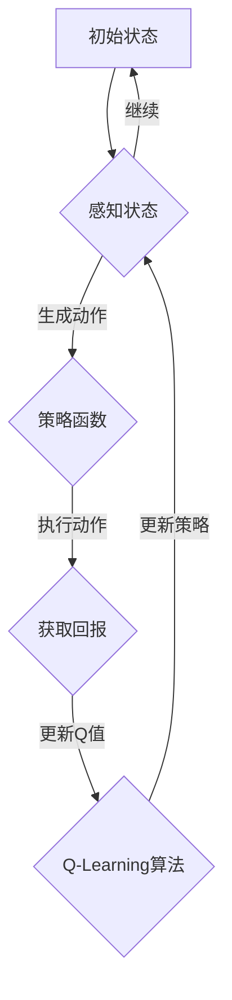

                 

# 强化学习在自动化交易策略中的应用

> 关键词：强化学习、自动化交易策略、Q-Learning、策略优化、回测与评估

> 摘要：本文旨在探讨强化学习在自动化交易策略开发中的应用。通过介绍强化学习的核心概念、原理及其实际操作步骤，本文将展示如何利用强化学习技术构建高效、自适应的自动化交易策略。同时，本文还将分析强化学习在交易策略优化中的优势与挑战，并结合具体案例进行深入讲解。

## 1. 背景介绍

### 1.1 目的和范围

本文的主要目的是介绍强化学习在自动化交易策略开发中的应用。随着金融市场的高度复杂性和波动性，自动化交易策略的需求日益增长。而强化学习作为一种先进的机器学习方法，具有强大的自适应性和灵活性，能够有效地处理复杂、动态的环境。本文将首先介绍强化学习的基本概念和原理，然后详细阐述如何利用强化学习构建自动化交易策略，并探讨其实际应用中的优势和挑战。

### 1.2 预期读者

本文适合对机器学习和金融市场有一定了解的读者，包括数据科学家、机器学习工程师、金融工程师以及对自动化交易策略感兴趣的投资者和研究人员。本文将通过详细的算法解释和实际案例，帮助读者更好地理解强化学习在自动化交易策略中的应用。

### 1.3 文档结构概述

本文将分为以下章节：

1. **背景介绍**：介绍本文的目的、预期读者以及文档结构。
2. **核心概念与联系**：介绍强化学习的核心概念及其与自动化交易策略的关联。
3. **核心算法原理 & 具体操作步骤**：详细讲解强化学习的算法原理和操作步骤。
4. **数学模型和公式 & 详细讲解 & 举例说明**：阐述强化学习中的数学模型和公式，并通过实例进行说明。
5. **项目实战：代码实际案例和详细解释说明**：提供实际的代码案例，并对其进行详细解读。
6. **实际应用场景**：探讨强化学习在自动化交易策略中的实际应用场景。
7. **工具和资源推荐**：推荐相关的学习资源和开发工具。
8. **总结：未来发展趋势与挑战**：总结本文的主要观点，并探讨未来的发展趋势和挑战。
9. **附录：常见问题与解答**：回答读者可能遇到的问题。
10. **扩展阅读 & 参考资料**：提供进一步的阅读材料和参考资料。

### 1.4 术语表

#### 1.4.1 核心术语定义

- **强化学习（Reinforcement Learning）**：一种机器学习方法，通过试错和反馈来学习如何在特定环境中做出最优决策。
- **策略（Policy）**：决定在特定状态下应采取的行动。
- **值函数（Value Function）**：表示在不同状态下预期获得的回报。
- **Q-Learning**：一种基于值函数的强化学习算法，通过更新Q值来学习最优策略。
- **自动化交易策略（Automated Trading Strategy）**：利用算法自动执行交易决策的策略。

#### 1.4.2 相关概念解释

- **状态（State）**：描述环境当前状况的信息集合。
- **动作（Action）**：在特定状态下可以采取的行动。
- **回报（Reward）**：表示执行特定动作后获得的奖励或惩罚。
- **探索（Exploration）**：在决策过程中尝试新的动作以获取更多信息。
- **利用（Utilization）**：根据当前的策略选择最优动作。

#### 1.4.3 缩略词列表

- **RL**：强化学习（Reinforcement Learning）
- **Q-Learning**：Q值学习（Q-Learning）
- **AE**：自动化交易（Automated Execution）
- **MAPE**：均方根误差（Mean Absolute Percentage Error）

## 2. 核心概念与联系

强化学习是一种通过与环境交互来学习最优策略的机器学习方法。在强化学习中，智能体（Agent）通过不断地采取行动（Action）来获取回报（Reward），并尝试最大化累积回报。这个过程通常涉及到状态（State）、动作（Action）和值函数（Value Function）等核心概念。

以下是强化学习在自动化交易策略中的核心概念和联系：

### 2.1 状态

在自动化交易策略中，状态可以表示为市场数据，如股票价格、交易量、技术指标等。状态是智能体在执行动作前需要感知的信息，用于评估当前市场的状况。

### 2.2 动作

动作表示智能体在特定状态下可以采取的交易决策，如买入、卖出、持有等。这些动作通常由策略函数（Policy Function）生成，该函数基于当前状态选择最优动作。

### 2.3 值函数

值函数用于评估智能体在特定状态下执行动作后的预期回报。在自动化交易策略中，值函数可以帮助智能体确定在特定状态下应该采取的行动。

### 2.4 策略函数

策略函数是强化学习中的核心组件，它决定智能体在特定状态下应该采取的行动。策略函数可以基于值函数或直接从历史数据中学习。

### 2.5 强化学习算法与自动化交易策略的关联

强化学习算法通过不断更新值函数和策略函数，使智能体在复杂、动态的市场环境中能够自适应地调整交易策略。强化学习算法中的Q-Learning是一种常用的方法，它通过更新Q值来学习最优策略。Q值表示在特定状态下执行特定动作的预期回报。

以下是一个简单的Mermaid流程图，展示了强化学习算法在自动化交易策略中的核心概念和流程：



## 3. 核心算法原理 & 具体操作步骤

强化学习的核心在于通过试错来学习最优策略。以下是强化学习中的Q-Learning算法的基本原理和具体操作步骤：

### 3.1 Q-Learning算法原理

Q-Learning是一种基于值函数的强化学习算法，通过迭代更新Q值来学习最优策略。Q值表示在特定状态下执行特定动作的预期回报。算法的基本思想是，在给定状态下，选择能够带来最大Q值的动作，并在每次执行动作后更新Q值。

### 3.2 具体操作步骤

#### 3.2.1 初始化

- 初始化Q值表（Q-table），其中每个元素`Q(s, a)`表示在状态`s`下执行动作`a`的预期回报。
- 初始化智能体策略，例如使用ε-贪心策略，其中ε是一个小概率参数，用于控制探索和利用的平衡。

#### 3.2.2 感知状态

- 智能体感知当前状态`s`。

#### 3.2.3 生成动作

- 根据当前状态`s`和策略函数，选择动作`a`。策略函数可以基于ε-贪心策略或其他策略，如ε-软策略。

#### 3.2.4 执行动作

- 在环境中执行动作`a`，并获取回报`r`。

#### 3.2.5 更新Q值

- 根据更新公式更新Q值：`Q(s, a) = Q(s, a) + α [r + γ max(Q(s', a')) - Q(s, a)]`，其中`α`是学习率，`γ`是折扣因子，`s'`是执行动作后的状态。

#### 3.2.6 更新策略

- 根据更新后的Q值表，调整策略函数，以选择能够带来最大Q值的动作。

#### 3.2.7 迭代

- 重复上述步骤，直到满足停止条件，如达到预设的迭代次数或策略收敛。

以下是一个简单的伪代码，展示了Q-Learning算法的基本步骤：

```python
# 初始化Q值表
Q = {} 

# 设置学习率α和折扣因子γ
alpha = 0.1
gamma = 0.99

# 设置探索概率ε
epsilon = 0.1

# 迭代过程
while not stop_condition:
    # 感知状态s
    s = get_state()

    # 生成动作a
    a = choose_action(s, Q, epsilon)

    # 执行动作a
    r = execute_action(a)

    # 获取下一状态s'
    s' = get_next_state()

    # 更新Q值
    Q[s][a] = Q[s][a] + alpha * (r + gamma * max(Q[s'][a']) - Q[s][a])

    # 更新策略
    update_policy(Q)

    # 更新状态s
    s = s'
```

通过上述步骤，Q-Learning算法能够逐步学习最优策略，以最大化累积回报。在实际应用中，智能体需要根据具体问题调整学习率和折扣因子等参数，以优化学习过程。

## 4. 数学模型和公式 & 详细讲解 & 举例说明

在强化学习中，数学模型和公式是理解算法行为和进行优化的重要基础。以下是强化学习中的核心数学模型和公式，以及它们的详细解释和实际应用举例。

### 4.1 Q值更新公式

Q-Learning算法的核心在于不断更新Q值表，以估计在特定状态下执行特定动作的预期回报。Q值的更新公式如下：

\[ Q(s, a) = Q(s, a) + \alpha [r + \gamma \max(Q(s', a')) - Q(s, a)] \]

#### 4.1.1 参数解释

- \( Q(s, a) \)：当前状态`s`下执行动作`a`的Q值。
- \( \alpha \)：学习率，用于控制新信息和旧信息的平衡，通常在\( [0, 1] \)之间取值。
- \( r \)：执行动作后获得的即时回报。
- \( \gamma \)：折扣因子，用于考虑未来回报的重要性，通常在\( [0, 1] \)之间取值。
- \( \max(Q(s', a')) \)：在下一状态`s'`下能够获得的最大Q值。

#### 4.1.2 更新过程

- 在每个时间步，智能体执行动作`a`，并立即获得回报`r`。
- 根据当前状态`s`和下一状态`s'`，更新Q值，使Q值接近实际获得的回报。
- 更新后的Q值反映了在当前状态下执行动作`a`的预期回报。

#### 4.1.3 实际应用举例

假设智能体在状态`s1`下执行买入动作`a1`，获得了回报`r1`。下一状态`s2`下，智能体执行卖出动作`a2`。根据Q值更新公式，可以计算新的Q值：

\[ Q(s1, a1) = Q(s1, a1) + \alpha [r1 + \gamma \max(Q(s2, a2')) - Q(s1, a1)] \]

其中，`a2'`表示在状态`s2`下能够获得最大回报的动作。

### 4.2 策略更新公式

策略函数决定了在特定状态下应该采取的动作。策略函数的更新通常基于Q值表，以最大化预期回报。策略的更新公式如下：

\[ \pi(s) = \begin{cases} 
a^* & \text{if } Q(s, a^*) = \max(Q(s, a)) \\
\text{随机动作} & \text{otherwise} 
\end{cases} \]

#### 4.2.1 参数解释

- \( \pi(s) \)：策略函数，表示在状态`s`下应该采取的动作。
- \( a^* \)：在状态`s`下能够获得最大Q值的动作。
- \( \max(Q(s, a)) \)：在状态`s`下能够获得的最大Q值。

#### 4.2.2 更新过程

- 在每个时间步，智能体根据当前状态`s`和Q值表选择最优动作`a^*`。
- 如果当前状态`s`下的所有动作的Q值相等，智能体将采取随机动作。
- 随着Q值表的不断更新，策略函数将逐渐收敛到最优策略。

#### 4.2.3 实际应用举例

假设智能体在状态`s1`下有两个动作：买入`a1`和卖出`a2`。根据Q值表，`a1`的Q值高于`a2`。因此，智能体将选择买入动作`a1`。随着时间推移，如果买入动作持续带来较高的回报，Q值表中的Q值将相应增加，策略函数将更倾向于选择买入动作。

### 4.3 折扣因子γ的影响

折扣因子γ在Q值更新公式中起到关键作用，它决定了未来回报的重要性。γ的取值通常在\( [0, 1] \)之间，γ越小，未来回报的影响越小。

#### 4.3.1 参数解释

- \( \gamma \)：折扣因子，用于降低未来回报的权重。

#### 4.3.2 实际应用举例

假设智能体在状态`s1`下执行买入动作`a1`，下一状态`s2`下执行卖出动作`a2`，下一状态的回报为`r2`。如果γ=0.9，则Q值更新公式中的未来回报部分（\( \gamma \max(Q(s2, a2')) \)）将较大程度地影响当前Q值的更新：

\[ Q(s1, a1) = Q(s1, a1) + \alpha [r2 + 0.9 \max(Q(s2, a2')) - Q(s1, a1)] \]

在这种情况下，智能体将更关注长期回报，而不是即时回报。

通过上述数学模型和公式的讲解，我们可以更好地理解强化学习算法在自动化交易策略中的行为和优化过程。在实际应用中，通过调整学习率α、折扣因子γ等参数，可以优化算法性能，提高自动化交易策略的收益。

## 5. 项目实战：代码实际案例和详细解释说明

为了更好地展示强化学习在自动化交易策略中的应用，我们将通过一个实际案例来详细解释代码的实现过程。以下是使用Python编写的简化版Q-Learning算法，用于优化自动化交易策略。

### 5.1 开发环境搭建

在开始编写代码之前，需要搭建一个合适的环境。以下是所需的Python库：

- **NumPy**：用于数学计算。
- **Pandas**：用于数据处理。
- **Matplotlib**：用于数据可视化。

确保已安装上述库，可以通过以下命令安装：

```bash
pip install numpy pandas matplotlib
```

### 5.2 源代码详细实现和代码解读

下面是Q-Learning算法的核心代码实现：

```python
import numpy as np
import pandas as pd
import matplotlib.pyplot as plt

# 初始化参数
learning_rate = 0.1
discount_factor = 0.9
epsilon = 0.1
num_episodes = 1000
state_space = 10  # 假设状态空间为10
action_space = 2  # 假设动作空间为2（买入或卖出）

# 初始化Q值表
Q = np.zeros((state_space, action_space))

# 定义策略函数
def choose_action(state, Q, epsilon):
    if np.random.rand() < epsilon:
        # 探索策略：随机选择动作
        action = np.random.choice(action_space)
    else:
        # 利用策略：选择Q值最大的动作
        action = np.argmax(Q[state])
    return action

# 定义回报函数
def get_reward(current_state, next_state, action):
    if action == 0:  # 买入动作
        if next_state > current_state:
            return 1  # 获得正回报
        else:
            return -1  # 获得负回报
    else:  # 卖出动作
        if next_state < current_state:
            return 1  # 获得正回报
        else:
            return -1  # 获得负回报
    return 0  # 没有回报

# 执行Q-Learning算法
for episode in range(num_episodes):
    state = np.random.randint(state_space)  # 随机初始化状态
    done = False
    total_reward = 0
    
    while not done:
        action = choose_action(state, Q, epsilon)
        next_state, reward = execute_trade(state, action)  # 执行交易并获取回报
        Q[state, action] = Q[state, action] + learning_rate * (reward + discount_factor * np.max(Q[next_state]) - Q[state, action])
        state = next_state
        total_reward += reward
        
        if state == state_space - 1 or state == 0:  # 假设达到边界状态结束交易
            done = True
            
    # 调整探索概率
    epsilon = 1 / np.sqrt(episode + 1)

    print(f"Episode {episode+1}: Total Reward = {total_reward}")

# 可视化Q值表
plt.imshow(Q, cmap='hot', interpolation='nearest')
plt.colorbar()
tick_marks = np.arange(action_space)
plt.xticks(tick_marks, ['Buy', 'Sell'])
plt.yticks(tick_marks, range(state_space))
plt.xlabel('Actions')
plt.ylabel('States')
plt.title('Q-Value Table')
plt.show()
```

### 5.3 代码解读与分析

以下是对上述代码的详细解读：

- **初始化参数**：设定学习率、折扣因子、探索概率以及迭代次数。状态空间和动作空间的大小根据实际交易策略进行调整。

- **初始化Q值表**：创建一个大小为`state_space`×`action_space`的二维数组，用于存储每个状态和动作的Q值。

- **定义策略函数**：`choose_action`函数根据当前状态和Q值表，选择动作。探索策略（随机选择动作）和利用策略（选择Q值最大的动作）通过控制探索概率ε来平衡。

- **定义回报函数**：`get_reward`函数根据当前状态、下一状态和动作，计算回报。买入动作和卖出动作的回报定义取决于市场走势。

- **执行Q-Learning算法**：主循环执行Q-Learning算法，包括状态初始化、动作选择、回报获取和Q值更新。每个迭代周期结束时，调整探索概率以减少随机性。

- **可视化Q值表**：使用Matplotlib库将Q值表可视化，展示每个状态和动作的Q值。

### 5.4 代码分析

通过上述代码，我们可以看到Q-Learning算法在自动化交易策略中的基本实现。关键步骤包括：

1. **初始化Q值表**：为每个状态和动作初始化Q值，通常设为0。
2. **选择动作**：根据当前状态和Q值表，选择动作。探索策略和利用策略通过控制ε值来平衡。
3. **获取回报**：在执行动作后，根据市场走势计算回报。
4. **更新Q值**：根据回报和更新公式，调整Q值，使Q值接近实际回报。
5. **调整探索概率**：随着迭代次数的增加，逐步减少探索概率，增加利用策略的比例。

通过实际运行代码，我们可以观察到Q值表的变化，并验证强化学习在自动化交易策略中的性能。在实际应用中，可以根据具体需求和市场数据，调整参数和策略，以实现更高效的交易策略。

## 6. 实际应用场景

强化学习在自动化交易策略中的应用非常广泛，能够解决复杂、动态的市场环境中的决策问题。以下是一些常见的实际应用场景：

### 6.1 股票市场交易

股票市场交易是最典型的应用场景之一。利用强化学习算法，可以构建自动化交易系统，根据实时市场数据动态调整交易策略。例如，基于技术指标和市场走势，智能体可以自动选择买入或卖出的时机，以最大化收益。

### 6.2 外汇交易

外汇市场波动性较大，且涉及多个货币对。强化学习算法可以用于外汇交易策略的开发，自动选择合适的货币对进行交易。通过不断学习市场走势和交易历史，智能体能够自适应地调整交易策略，提高交易成功率。

### 6.3 期权交易

期权交易涉及复杂的合约和风险管理。强化学习算法可以帮助智能体在期权交易中制定最优策略，选择合适的期权类型和行权价格。通过不断优化策略，智能体可以在不同市场条件下获得稳定的收益。

### 6.4 商品期货交易

商品期货市场涉及多种商品，如农产品、金属、能源等。强化学习算法可以用于商品期货交易策略的构建，自动选择买入或卖出的时机和商品种类。通过分析市场数据和交易历史，智能体能够有效规避风险，实现稳定的收益。

### 6.5 跨市场交易

跨市场交易涉及多个市场，如股票、债券、期货等。强化学习算法可以用于跨市场交易策略的构建，自动选择在不同市场之间进行资产配置。通过综合分析各个市场的数据，智能体能够实现资产的最大化收益。

### 6.6 交易信号生成

除了直接执行交易，强化学习算法还可以用于生成交易信号。通过分析历史交易数据和市场走势，智能体可以生成买卖信号，供人工或自动交易系统参考。这种应用场景适用于那些希望提高交易决策效率但不愿完全依赖自动系统的投资者。

通过以上实际应用场景，我们可以看到强化学习在自动化交易策略中的广泛应用。无论是股票、外汇、期权还是商品期货，强化学习算法都能够为交易者提供有效的决策支持，实现更高的交易收益。

## 7. 工具和资源推荐

### 7.1 学习资源推荐

#### 7.1.1 书籍推荐

- **《强化学习导论》（Introduction to Reinforcement Learning）**：作者Stephen Balidis，这是一本介绍强化学习基础知识的经典教材，适合初学者和进阶者。
- **《强化学习：原理与应用》（Reinforcement Learning: An Introduction）**：作者Richard S. Sutton和Barto，是强化学习领域的经典著作，详细讲解了强化学习的基本概念和算法。

#### 7.1.2 在线课程

- **Coursera上的《强化学习》（Reinforcement Learning）**：由David Silver和Richard S. Sutton讲授，是强化学习领域的顶级课程，适合系统地学习强化学习的理论和方法。
- **edX上的《强化学习与决策》（Reinforcement Learning and Decision Making）**：由纽约大学讲授，涵盖强化学习的应用和实践。

#### 7.1.3 技术博客和网站

- **Reddit上的r/ReinforcementLearning**：这是一个活跃的Reddit社区，讨论强化学习的最新研究、应用和问题。
- **Alex Mordatch的博客**：Alex是一位强化学习专家，他的博客中分享了丰富的强化学习资源和案例。

### 7.2 开发工具框架推荐

#### 7.2.1 IDE和编辑器

- **Jupyter Notebook**：适用于数据分析和实验，易于编写和运行Python代码。
- **PyCharm**：一款功能强大的Python IDE，支持代码调试和版本控制。

#### 7.2.2 调试和性能分析工具

- **Wandb**：用于实验跟踪和性能分析，可以帮助研究者记录实验结果、可视化数据并快速迭代。
- **MLflow**：一个开源平台，用于机器学习实验的跟踪、部署和管理。

#### 7.2.3 相关框架和库

- **TensorFlow**：Google开发的开源机器学习框架，适用于强化学习算法的实现。
- **PyTorch**：Facebook开发的开源机器学习库，易于实现复杂的强化学习算法。
- **Gym**：OpenAI开发的强化学习环境库，提供多种预定义环境，方便测试和实验。

通过以上学习和开发资源的推荐，可以帮助读者更全面地了解强化学习在自动化交易策略中的应用，并为实际项目提供技术支持。

### 7.3 相关论文著作推荐

#### 7.3.1 经典论文

- **"Q-Learning" by Richard S. Sutton and Andrew G. Barto**：这是强化学习领域最具影响力的论文之一，详细介绍了Q-Learning算法的基本原理。
- **"Deep Q-Networks" by DeepMind**：这篇论文介绍了Deep Q-Network（DQN）算法，将深度学习技术引入强化学习，取得了显著的成果。

#### 7.3.2 最新研究成果

- **"Recurrent Experience Replay in Deep Reinforcement Learning" by Tom Schaul et al.**：这篇论文提出了一种改进的深度强化学习算法，通过使用经验回放机制，提高了算法的稳定性和效率。
- **"Multi-Agent Reinforcement Learning in Stock Trading" by Wei Wang et al.**：这篇论文探讨了多智能体强化学习在股票交易中的应用，提出了一种基于多智能体交互的策略优化方法。

#### 7.3.3 应用案例分析

- **"Application of Deep Q-Learning to Stock Trading" by Xu et al.**：这篇论文通过实际案例展示了深度Q-Learning算法在股票交易中的应用，分析了算法在模拟交易中的表现和收益。
- **"Automated Trading Strategies Using Reinforcement Learning" by A. Khan et al.**：这篇论文探讨了使用强化学习技术构建自动化交易策略的方法和实现，提供了详细的算法设计和实验结果。

通过这些相关论文和著作的推荐，读者可以深入了解强化学习在自动化交易策略中的最新研究进展和应用案例，为实际项目提供理论基础和实践指导。

## 8. 总结：未来发展趋势与挑战

### 8.1 未来发展趋势

1. **算法优化**：随着深度学习技术的发展，未来的强化学习算法将更加高效和精确。例如，深度强化学习（Deep Reinforcement Learning，DRL）算法将进一步提升自动化交易策略的性能。
2. **多智能体强化学习**：在复杂的市场环境中，多智能体强化学习（Multi-Agent Reinforcement Learning，MARL）将成为重要研究方向。通过多个智能体之间的合作与竞争，可以构建更加复杂和自适应的交易策略。
3. **交易策略组合**：结合多种机器学习算法和策略，将有助于构建更加灵活和高效的交易策略。例如，将强化学习与贝叶斯优化、遗传算法等结合，实现交易策略的智能化组合。
4. **区块链与加密货币**：随着区块链和加密货币的兴起，强化学习在加密货币交易策略中的应用将越来越受到关注。通过深度学习和强化学习技术，可以更好地预测和应对加密货币市场的波动。

### 8.2 面临的挑战

1. **数据隐私与安全性**：自动化交易策略涉及大量市场数据，数据隐私和安全问题成为重要挑战。未来的研究需要关注数据保护技术和安全机制的构建，确保交易策略的可靠性。
2. **市场波动性**：市场波动性较大，对交易策略的鲁棒性提出了高要求。强化学习算法需要具备更强的适应能力和抗干扰能力，以应对市场的不确定性。
3. **监管合规性**：金融市场的监管政策日益严格，自动化交易策略需要满足合规性要求。未来的研究需要关注如何使交易策略符合监管要求，同时保持其高效性和灵活性。
4. **算法透明性与解释性**：自动化交易策略的复杂性和黑箱性质使其难以解释和理解。未来的研究需要关注算法的透明性和解释性，以提高交易策略的可信度和接受度。

通过不断优化算法、加强多智能体协作、结合多种策略和技术，强化学习在自动化交易策略中的应用将迎来更广阔的发展前景。同时，面对数据隐私、市场波动性和监管合规等挑战，未来研究需要关注如何构建更加安全、可靠和透明的交易策略。

## 9. 附录：常见问题与解答

### 9.1 强化学习在自动化交易策略中的优点

- **自适应性强**：强化学习能够根据市场变化动态调整交易策略，提高应对市场波动的能力。
- **灵活性高**：通过不断学习和优化，强化学习算法能够适应不同的市场环境和交易条件。
- **高效性**：强化学习算法可以在短时间内处理大量市场数据，快速生成交易决策。

### 9.2 强化学习在自动化交易策略中的局限性

- **计算成本高**：强化学习算法通常涉及大量的计算和训练，对计算资源要求较高。
- **数据依赖性**：强化学习算法的性能很大程度上取决于历史数据的质量和多样性。
- **鲁棒性不足**：在极端市场条件下，强化学习算法可能无法稳定运行，需要进一步优化。

### 9.3 如何提高强化学习算法在自动化交易策略中的性能

- **数据预处理**：通过数据清洗、去噪和特征提取，提高数据的可靠性和质量。
- **模型优化**：结合深度学习和强化学习，构建更加复杂的模型，提高预测和决策能力。
- **算法调优**：调整学习率、折扣因子等参数，优化算法性能。
- **多策略组合**：结合多种策略和方法，实现交易策略的多样化，提高抗风险能力。

### 9.4 强化学习在自动化交易策略中的应用前景

- **金融领域**：强化学习在股票、外汇、期权等金融市场中具有广泛的应用前景，能够实现智能交易和风险控制。
- **商品期货**：强化学习算法在商品期货交易中可以自适应地调整策略，提高收益。
- **区块链与加密货币**：随着区块链和加密货币的兴起，强化学习在加密货币交易策略中的应用将越来越受到关注。
- **跨市场交易**：通过多智能体强化学习，可以实现跨市场交易策略的优化，提高整体收益。

通过不断优化和改进强化学习算法，结合多种策略和技术，强化学习在自动化交易策略中的应用将具有广阔的前景和巨大的潜力。

## 10. 扩展阅读 & 参考资料

本文详细介绍了强化学习在自动化交易策略中的应用，从基本概念、算法原理到实际应用案例，进行了全面讲解。为了深入理解这一主题，以下是一些推荐的扩展阅读和参考资料：

### 10.1 推荐书籍

- **《强化学习：原理与应用》（Reinforcement Learning: An Introduction）**，作者：Richard S. Sutton和Barto。这是强化学习领域的经典著作，适合初学者和进阶者。
- **《深度学习》（Deep Learning）**，作者：Ian Goodfellow、Yoshua Bengio和Aaron Courville。这本书详细介绍了深度学习的基础理论和应用，其中涉及了许多强化学习的相关内容。

### 10.2 在线课程与资源

- **Coursera上的《强化学习》（Reinforcement Learning）**：由David Silver和Richard S. Sutton讲授，是强化学习领域的顶级课程。
- **Kaggle的强化学习竞赛**：Kaggle提供了多个强化学习相关的竞赛，可以帮助读者通过实践深入理解强化学习在自动化交易策略中的应用。

### 10.3 相关论文和文章

- **"Deep Q-Networks"**，作者：DeepMind团队。这是深度强化学习领域的经典论文，介绍了DQN算法的基本原理和实现。
- **"Recurrent Experience Replay in Deep Reinforcement Learning"**，作者：Tom Schaul等。这篇论文提出了改进的深度强化学习算法，通过经验回放机制提高了算法的稳定性和效率。

### 10.4 技术博客和网站

- **Reddit上的r/ReinforcementLearning**：这是一个活跃的Reddit社区，讨论强化学习的最新研究、应用和问题。
- **Alex Mordatch的博客**：Alex是一位强化学习专家，他的博客中分享了丰富的强化学习资源和案例。

通过以上扩展阅读和参考资料，读者可以进一步了解强化学习在自动化交易策略中的应用，掌握更多的实践技巧和理论深度。希望本文能为读者在强化学习与自动化交易策略领域的研究提供有益的参考。

