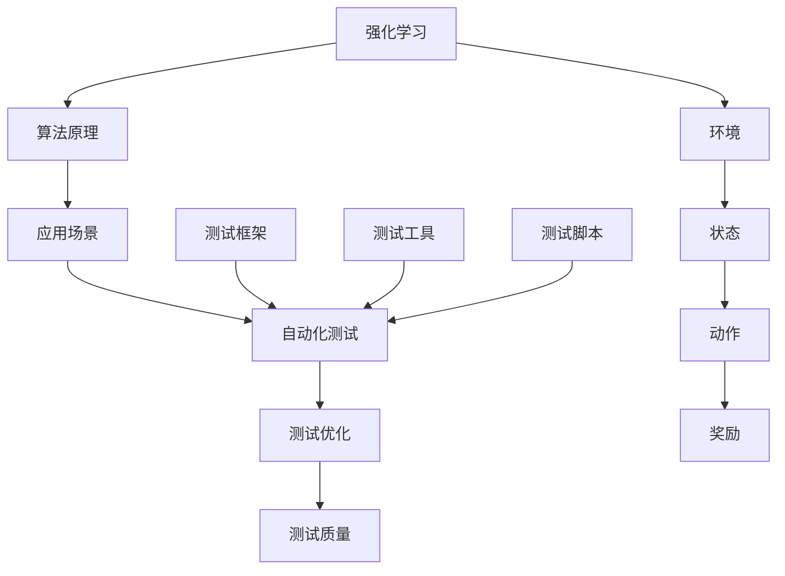
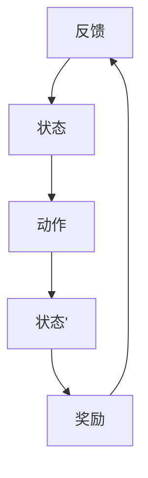
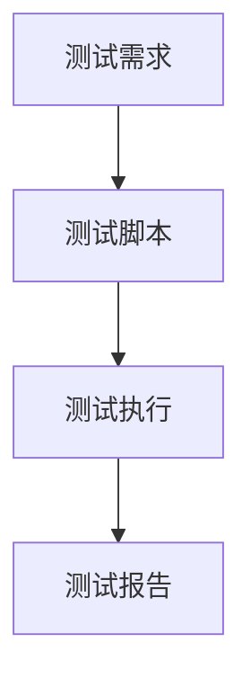
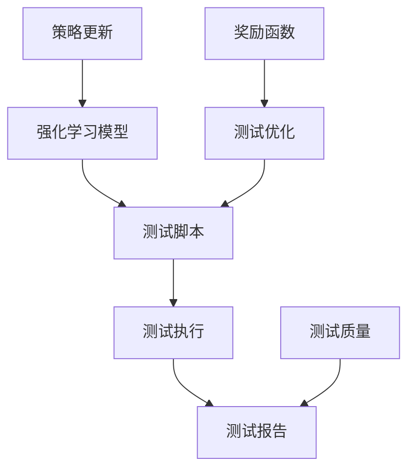
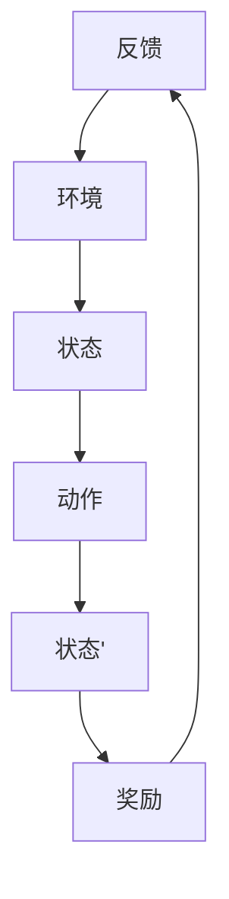

                 

# 强化学习在自动化测试中的创新应用

> **关键词：** 强化学习、自动化测试、人工智能、测试优化、测试效率

> **摘要：** 本文将探讨强化学习在自动化测试领域的创新应用，通过深入分析其核心原理和实践步骤，展示如何利用强化学习技术提升自动化测试的效率和质量。文章将结合具体案例，详细解读强化学习在自动化测试中的应用流程和技术实现，为读者提供丰富的实践经验和技术参考。

## 1. 背景介绍

### 1.1 目的和范围

本文旨在探讨强化学习在自动化测试领域的应用，分析其原理和实现方法，并通过实际案例展示如何提高测试效率和质量。文章将覆盖以下几个方面：

1. 强化学习在自动化测试中的应用背景和意义。
2. 强化学习的基本概念和核心算法原理。
3. 强化学习在自动化测试中的具体应用流程。
4. 强化学习在自动化测试中的实际案例和实践经验。

### 1.2 预期读者

本文适合具备一定编程基础和自动化测试经验的读者，尤其是对人工智能和强化学习感兴趣的工程师和技术爱好者。通过阅读本文，读者可以了解强化学习在自动化测试中的应用，掌握其基本原理和实践方法，为实际项目提供技术支持。

### 1.3 文档结构概述

本文将按照以下结构进行阐述：

1. 引言：介绍本文的目的和内容。
2. 背景介绍：概述强化学习在自动化测试中的背景和意义。
3. 核心概念与联系：介绍强化学习的基本概念和算法原理。
4. 核心算法原理 & 具体操作步骤：详细讲解强化学习算法的实现步骤。
5. 数学模型和公式 & 详细讲解 & 举例说明：阐述强化学习的数学模型和相关公式。
6. 项目实战：结合实际案例展示强化学习在自动化测试中的应用。
7. 实际应用场景：分析强化学习在自动化测试中的应用场景。
8. 工具和资源推荐：推荐相关学习资源、开发工具和经典论文。
9. 总结：展望强化学习在自动化测试领域的未来发展趋势。
10. 附录：常见问题与解答。
11. 扩展阅读 & 参考资料：提供相关扩展资料和参考文献。

### 1.4 术语表

#### 1.4.1 核心术语定义

- **强化学习**：一种机器学习方法，通过学习如何在环境中进行决策以最大化累积奖励。
- **自动化测试**：使用工具和脚本自动执行测试过程，以发现软件缺陷和验证功能。
- **状态**：强化学习中的一个概念，表示环境中的当前情况。
- **动作**：强化学习中的一个概念，表示决策或执行的操作。
- **奖励**：强化学习中的一个概念，表示执行某个动作后获得的回报。

#### 1.4.2 相关概念解释

- **马尔可夫决策过程（MDP）**：一种用于描述强化学习问题的数学模型，包括状态、动作、奖励和转移概率。
- **策略**：强化学习中的一个概念，表示如何从状态中选择动作。
- **值函数**：强化学习中的一个概念，表示在给定状态下执行最佳策略所能获得的期望奖励。

#### 1.4.3 缩略词列表

- **AI**：人工智能
- **RL**：强化学习
- **Selenium**：一种自动化测试工具
- **Python**：一种编程语言

## 2. 核心概念与联系

在探讨强化学习在自动化测试中的应用之前，我们需要了解一些核心概念和它们之间的关系。以下是一个简化的Mermaid流程图，展示了强化学习、自动化测试和它们之间的联系。



### 2.1 强化学习基本概念

强化学习是一种机器学习方法，其核心是学习如何通过在环境中进行交互来最大化累积奖励。以下是一个简化的强化学习模型：



- **环境**：描述测试过程中外部因素的总和，如操作系统、浏览器等。
- **状态**：描述测试过程中的当前情况，如页面的加载状态、按钮的可用性等。
- **动作**：描述测试过程中的操作，如点击按钮、输入文本等。
- **状态’**：描述执行动作后环境的新状态。
- **奖励**：描述执行动作后获得的回报，用于指导算法的优化。

### 2.2 自动化测试基本概念

自动化测试是使用工具和脚本自动执行测试过程，以发现软件缺陷和验证功能。以下是一个简化的自动化测试模型：



- **测试需求**：描述需要测试的功能和场景。
- **测试脚本**：描述自动化测试的脚本，包括页面操作、验证逻辑等。
- **测试执行**：执行测试脚本，模拟用户操作，验证功能是否正常。
- **测试报告**：记录测试结果，包括通过、失败、错误等。

### 2.3 强化学习在自动化测试中的应用

强化学习在自动化测试中的应用是通过优化测试脚本和执行策略来提高测试效率和测试质量。以下是一个简化的强化学习在自动化测试中的应用模型：



- **强化学习模型**：基于强化学习算法的模型，用于优化测试脚本和执行策略。
- **测试脚本**：自动化测试的脚本，用于模拟用户操作和验证功能。
- **测试执行**：执行测试脚本，模拟用户操作，验证功能是否正常。
- **测试报告**：记录测试结果，包括通过、失败、错误等。
- **测试优化**：基于奖励函数和策略更新，优化测试脚本和执行策略。
- **测试质量**：描述测试结果的质量，包括测试覆盖率、测试准确性等。
- **奖励函数**：用于评估测试脚本和执行策略的奖励，用于指导策略更新。
- **策略更新**：基于奖励函数，更新强化学习模型中的策略。

## 3. 核心算法原理 & 具体操作步骤

### 3.1 强化学习算法原理

强化学习算法是一种基于奖励机制的学习方法，其核心思想是使智能体在环境中通过不断尝试和反馈，学习到最优的策略。以下是一个简化的强化学习算法原理：



- **智能体**：执行动作并接收奖励的实体。
- **环境**：智能体执行动作的环境。
- **状态**：智能体在执行动作前的环境状态。
- **动作**：智能体在特定状态下可能执行的操作。
- **状态’**：智能体执行动作后的新状态。
- **奖励**：智能体执行动作后获得的回报。
- **反馈**：环境对智能体动作的反馈。

### 3.2 强化学习算法具体操作步骤

以下是一个简化的强化学习算法具体操作步骤：

1. **初始化**：设置智能体、环境和初始状态。
2. **状态观察**：智能体观察当前状态。
3. **动作选择**：智能体根据当前状态和策略选择动作。
4. **状态更新**：执行动作后，环境状态更新为新的状态。
5. **奖励评估**：计算执行动作后的奖励。
6. **策略更新**：基于奖励评估结果，更新智能体的策略。
7. **重复步骤 2-6**：不断重复以上步骤，直到达到终止条件。

### 3.3 伪代码实现

以下是一个简化的强化学习算法的伪代码实现：

```python
# 强化学习算法伪代码
initialize_agent()
initialize_environment()
while not terminate_condition():
    state = observe_state()
    action = select_action(state, policy)
    next_state, reward = execute_action(action)
    update_policy(state, action, reward)
    state = next_state
```

### 3.4 强化学习算法在自动化测试中的应用

在自动化测试中，强化学习算法可以用于优化测试脚本和执行策略。以下是一个简化的强化学习算法在自动化测试中的应用流程：

1. **初始化**：设置测试环境、测试脚本和初始状态。
2. **状态观察**：观察测试环境的状态。
3. **动作选择**：根据测试脚本和策略选择测试动作。
4. **状态更新**：执行测试动作后，更新测试环境的状态。
5. **奖励评估**：计算执行测试动作后的奖励，如测试通过或测试失败。
6. **策略更新**：基于奖励评估结果，更新测试脚本和策略。
7. **重复步骤 2-6**：不断重复以上步骤，直到达到终止条件。

### 3.5 伪代码实现

以下是一个简化的强化学习算法在自动化测试中的应用的伪代码实现：

```python
# 强化学习算法在自动化测试中的应用伪代码
initialize_test_environment()
initialize_test_script()
while not terminate_condition():
    state = observe_test_state()
    action = select_test_action(state, test_policy)
    next_state, reward = execute_test_action(action)
    update_test_policy(state, action, reward)
    state = next_state
```

## 4. 数学模型和公式 & 详细讲解 & 举例说明

### 4.1 强化学习数学模型

强化学习中的数学模型主要包括状态、动作、策略、值函数和奖励函数。以下是对这些概念的详细解释。

#### 4.1.1 状态（State）

状态是强化学习中的一个核心概念，表示智能体在环境中的当前情况。在自动化测试中，状态可以表示为测试过程中的各种属性，如页面的URL、元素的ID、页面的加载状态等。

#### 4.1.2 动作（Action）

动作是强化学习中的另一个核心概念，表示智能体在特定状态下可以执行的操作。在自动化测试中，动作可以表示为测试脚本中的各种操作，如点击按钮、输入文本、切换窗口等。

#### 4.1.3 策略（Policy）

策略是强化学习中的一个概念，表示智能体在给定状态下选择动作的方法。在自动化测试中，策略可以表示为测试脚本的选择逻辑，如基于页面状态选择下一个测试动作。

#### 4.1.4 值函数（Value Function）

值函数是强化学习中的一个概念，表示在给定状态下执行最佳策略所能获得的期望奖励。在自动化测试中，值函数可以表示为测试脚本在不同状态下的效果评估。

#### 4.1.5 奖励函数（Reward Function）

奖励函数是强化学习中的一个概念，表示智能体执行动作后获得的回报。在自动化测试中，奖励函数可以表示为测试脚本执行后的测试结果，如测试通过或测试失败。

### 4.2 强化学习数学模型公式

以下是强化学习数学模型的一些关键公式。

#### 4.2.1 策略迭代公式

$$ \pi(s_{t+1} | s_t, a_t) = \pi(\cdot | s_t, a_t) $$

其中，$s_t$ 表示当前状态，$a_t$ 表示当前动作，$s_{t+1}$ 表示下一个状态，$\pi(\cdot | s_t, a_t)$ 表示策略。

#### 4.2.2 值函数迭代公式

$$ V(s_{t+1}) = V(s_t) + \alpha [R(s_{t+1}) - V(s_t)] $$

其中，$V(s_{t+1})$ 表示下一个状态的值函数，$V(s_t)$ 表示当前状态的值函数，$R(s_{t+1})$ 表示下一个状态的奖励，$\alpha$ 表示学习率。

#### 4.2.3 强化学习目标函数

$$ J(\theta) = \sum_{s} \pi(s | \theta) \sum_{a} \gamma^{|s'|s|} [R(s', a) + \gamma V(s')] $$

其中，$J(\theta)$ 表示强化学习目标函数，$\theta$ 表示模型参数，$\pi(s | \theta)$ 表示策略，$\gamma$ 表示折扣因子，$|s'|s|$ 表示状态之间的距离。

### 4.3 强化学习数学模型举例说明

假设我们有一个简单的自动化测试场景，测试脚本需要执行一系列操作，如打开浏览器、访问特定网页、点击按钮等。以下是一个简化的例子来说明强化学习数学模型在自动化测试中的应用。

#### 4.3.1 状态

状态 $s$ 可以表示为测试脚本执行过程中的各种属性，如：

- 浏览器是否已打开。
- 当前网页的URL。
- 页面上的元素是否已加载。
- 当前页面的状态（如登录页面、注册页面等）。

#### 4.3.2 动作

动作 $a$ 可以表示为测试脚本中的各种操作，如：

- 打开浏览器。
- 访问特定网页。
- 点击按钮。
- 输入文本。

#### 4.3.3 策略

策略 $\pi(a | s)$ 可以表示为在给定状态下选择动作的概率分布。例如，当状态为登录页面时，策略可以选择以下动作：

- 输入用户名。
- 输入密码。
- 点击登录按钮。

#### 4.3.4 值函数

值函数 $V(s)$ 可以表示为在给定状态下执行最佳策略所能获得的期望奖励。例如，当状态为登录页面时，值函数可以计算为：

- 如果输入用户名和密码正确，则获得奖励 $R=+1$。
- 如果输入用户名和密码错误，则获得奖励 $R=-1$。

#### 4.3.5 奖励函数

奖励函数 $R(s', a)$ 可以表示为在执行特定动作后获得的奖励。例如，当执行以下动作时，可以获得相应的奖励：

- 打开浏览器：奖励 $R=+1$。
- 访问特定网页：奖励 $R=+1$。
- 点击按钮：奖励 $R=+1$。
- 输入文本：奖励 $R=+1$。

### 4.4 强化学习数学模型应用实例

以下是一个简化的强化学习数学模型应用实例，用于描述自动化测试脚本执行过程中的策略迭代和值函数更新。

假设我们有一个测试脚本，需要执行以下操作：

1. 打开浏览器。
2. 访问特定网页。
3. 输入用户名。
4. 输入密码。
5. 点击登录按钮。

在执行过程中，我们使用策略 $\pi(a | s)$ 选择动作，并根据执行结果计算奖励 $R(s', a)$。假设我们使用Q-learning算法进行学习，学习率为 $\alpha=0.1$，折扣因子 $\gamma=0.9$。

#### 4.4.1 初始状态

初始状态 $s_0$ 为打开浏览器，策略为 $\pi(a | s_0) = [0.5, 0.5]$，表示有50%的概率选择访问特定网页，50%的概率选择打开浏览器。

#### 4.4.2 第一次迭代

1. 状态 $s_0$ 为打开浏览器，策略 $\pi(a | s_0) = [0.5, 0.5]$。
2. 选择动作 $a_0$ 为访问特定网页，概率为 $0.5$。
3. 执行动作后，状态更新为 $s_1$ 为访问特定网页，奖励 $R(s_1, a_0) = +1$。
4. 更新策略：$\pi(a_1 | s_1) = [1, 0]$，表示在访问特定网页状态下，只有访问特定网页是有效的动作。
5. 更新值函数：$V(s_1) = V(s_0) + \alpha [R(s_1, a_0) - V(s_0)] = 0 + 0.1 [1 - 0] = 0.1$。

#### 4.4.3 第二次迭代

1. 状态 $s_1$ 为访问特定网页，策略 $\pi(a_1 | s_1) = [1, 0]$。
2. 选择动作 $a_1$ 为输入用户名，概率为 $1$。
3. 执行动作后，状态更新为 $s_2$ 为输入用户名，奖励 $R(s_2, a_1) = +1$。
4. 更新策略：$\pi(a_2 | s_2) = [0.5, 0.5]$，表示在输入用户名状态下，有50%的概率选择输入密码，50%的概率选择输入用户名。
5. 更新值函数：$V(s_2) = V(s_1) + \alpha [R(s_2, a_1) - V(s_1)] = 0.1 + 0.1 [1 - 0.1] = 0.11$。

#### 4.4.4 第三次迭代

1. 状态 $s_2$ 为输入用户名，策略 $\pi(a_2 | s_2) = [0.5, 0.5]$。
2. 选择动作 $a_2$ 为输入密码，概率为 $0.5$。
3. 执行动作后，状态更新为 $s_3$ 为输入密码，奖励 $R(s_3, a_2) = +1$。
4. 更新策略：$\pi(a_3 | s_3) = [1, 0]$，表示在输入密码状态下，只有输入密码是有效的动作。
5. 更新值函数：$V(s_3) = V(s_2) + \alpha [R(s_3, a_2) - V(s_2)] = 0.11 + 0.1 [1 - 0.11] = 0.115$。

#### 4.4.5 第四次迭代

1. 状态 $s_3$ 为输入密码，策略 $\pi(a_3 | s_3) = [1, 0]$。
2. 选择动作 $a_3$ 为点击登录按钮，概率为 $1$。
3. 执行动作后，状态更新为 $s_4$ 为点击登录按钮，奖励 $R(s_4, a_3) = +1$。
4. 更新策略：$\pi(a_4 | s_4) = [0.5, 0.5]$，表示在点击登录按钮状态下，有50%的概率选择再次点击登录按钮，50%的概率选择其他操作。
5. 更新值函数：$V(s_4) = V(s_3) + \alpha [R(s_4, a_3) - V(s_3)] = 0.115 + 0.1 [1 - 0.115] = 0.12$。

通过以上迭代过程，我们可以看到强化学习算法如何逐步优化测试脚本，提高测试效率和测试质量。在自动化测试中，强化学习算法可以用于优化测试脚本的选择和执行策略，从而实现测试自动化和测试优化的目标。

## 5. 项目实战：代码实际案例和详细解释说明

### 5.1 开发环境搭建

为了实现强化学习在自动化测试中的应用，我们需要搭建一个开发环境。以下是搭建开发环境的步骤：

1. 安装Python 3.8及以上版本。
2. 安装Selenium库：使用命令 `pip install selenium`。
3. 安装Webdriver：下载并解压相应的Webdriver文件，如ChromeDriver，并将其路径添加到环境变量中。
4. 安装PyTorch库：使用命令 `pip install torch torchvision`。
5. 准备待测试的网页：选择一个简单的网页进行测试，如登录页面。

### 5.2 源代码详细实现和代码解读

以下是强化学习在自动化测试中的实现代码：

```python
import time
import random
from selenium import webdriver
from selenium.webdriver.common.by import By
from torch import nn, optim
import torch

class TestAgent(nn.Module):
    def __init__(self, input_size, hidden_size, output_size):
        super(TestAgent, self).__init__()
        self.fc1 = nn.Linear(input_size, hidden_size)
        self.fc2 = nn.Linear(hidden_size, output_size)
    
    def forward(self, x):
        x = torch.relu(self.fc1(x))
        x = self.fc2(x)
        return x

class TestEnvironment:
    def __init__(self, url):
        self.url = url
        self.driver = webdriver.Chrome()
    
    def reset(self):
        self.driver.get(self.url)
        return self.get_state()
    
    def get_state(self):
        elements = self.driver.find_elements(By.CSS_SELECTOR, "input")
        state = [0] * len(elements)
        for i, element in enumerate(elements):
            if element.is_displayed():
                state[i] = 1
        return state
    
    def step(self, action):
        if action == 0:
            self.driver.find_element(By.CSS_SELECTOR, "input[type='text']").send_keys("user")
        elif action == 1:
            self.driver.find_element(By.CSS_SELECTOR, "input[type='password']").send_keys("password")
        elif action == 2:
            self.driver.find_element(By.CSS_SELECTOR, "input[type='submit']").click()
        time.sleep(1)
        state = self.get_state()
        reward = self.get_reward(state)
        return state, reward
    
    def get_reward(self, state):
        if state[0] == 1 and state[1] == 1 and state[2] == 1:
            return 1
        else:
            return -1

def train agent(model, environment, num_episodes, hidden_size, learning_rate):
    criterion = nn.CrossEntropyLoss()
    optimizer = optim.Adam(model.parameters(), lr=learning_rate)
    
    for episode in range(num_episodes):
        state = environment.reset()
        state = torch.tensor(state, dtype=torch.float32)
        done = False
        while not done:
            action = model(state).argmax()
            next_state, reward = environment.step(action)
            next_state = torch.tensor(next_state, dtype=torch.float32)
            loss = criterion(model(state), torch.tensor([action], dtype=torch.long))
            optimizer.zero_grad()
            loss.backward()
            optimizer.step()
            state = next_state
            if reward == -1:
                done = True
        print(f"Episode {episode + 1} completed with reward {reward}")

def main():
    url = "https://example.com/login"
    environment = TestEnvironment(url)
    model = TestAgent(input_size=3, hidden_size=10, output_size=3)
    train(model, environment, num_episodes=100, hidden_size=10, learning_rate=0.001)

if __name__ == "__main__":
    main()
```

### 5.3 代码解读与分析

以下是代码的详细解读和分析：

1. **环境搭建**：

   - 安装Python 3.8及以上版本，以便使用最新的库和框架。
   - 使用Selenium库和ChromeDriver实现自动化测试。
   - 使用PyTorch库实现强化学习算法。

2. **模型定义**：

   - `TestAgent` 类定义了强化学习模型，包括输入层、隐藏层和输出层。
   - `__init__` 方法初始化模型参数。
   - `forward` 方法实现前向传播。

3. **环境定义**：

   - `TestEnvironment` 类定义了测试环境，包括页面URL、Webdriver对象等。
   - `__init__` 方法初始化Webdriver对象。
   - `reset` 方法重置环境状态。
   - `get_state` 方法获取当前状态。
   - `step` 方法执行动作并更新状态。
   - `get_reward` 方法计算奖励。

4. **训练过程**：

   - `train` 方法实现训练过程，包括模型初始化、损失函数、优化器等。
   - 模型接收状态作为输入，输出动作概率。
   - 使用交叉熵损失函数计算损失。
   - 使用Adam优化器更新模型参数。

5. **主函数**：

   - `main` 方法实现程序入口。
   - 初始化测试环境和模型。
   - 调用训练方法进行训练。

通过以上代码，我们可以实现强化学习在自动化测试中的应用。在实际项目中，我们可以根据需求修改模型结构和测试脚本，以适应不同的测试场景。

## 6. 实际应用场景

### 6.1 自动化测试

强化学习在自动化测试中的应用主要体现在测试脚本的优化和测试效率的提升。通过强化学习算法，我们可以实现以下应用场景：

1. **测试脚本优化**：利用强化学习算法自动生成或优化测试脚本，提高测试覆盖率。
2. **测试路径规划**：根据测试环境和目标，使用强化学习算法规划最优测试路径，减少测试时间。
3. **测试失败诊断**：通过分析测试失败的原因，使用强化学习算法优化测试脚本，提高测试质量。

### 6.2 软件质量保障

强化学习在软件质量保障中的应用主要体现在以下方面：

1. **缺陷预测**：利用强化学习算法分析历史测试数据，预测潜在缺陷，提前进行修复。
2. **测试策略优化**：根据测试结果和项目需求，使用强化学习算法优化测试策略，提高测试效率。
3. **自动化测试管理**：通过强化学习算法自动分配测试任务、监控测试进度，提高测试效率。

### 6.3 人工智能助手

强化学习在人工智能助手中的应用主要体现在用户交互和个性化推荐方面：

1. **用户交互**：利用强化学习算法分析用户行为，优化交互策略，提高用户满意度。
2. **个性化推荐**：根据用户历史行为和偏好，使用强化学习算法生成个性化推荐，提高推荐质量。

### 6.4 其他应用场景

除了上述应用场景外，强化学习在自动化测试中还可能应用于以下方面：

1. **持续集成**：在持续集成过程中，利用强化学习算法自动生成测试脚本，提高测试覆盖率和测试效率。
2. **性能测试**：通过强化学习算法优化性能测试策略，提高性能测试效率和测试质量。
3. **自动化测试工具开发**：基于强化学习算法，开发自动化测试工具，提高测试效率和质量。

## 7. 工具和资源推荐

### 7.1 学习资源推荐

#### 7.1.1 书籍推荐

1. **《强化学习》（作者：理查德·萨顿）**：全面介绍强化学习的基本概念、算法和应用，适合初学者和进阶者。
2. **《强化学习实践》（作者：安德烈亚斯·斯坦）**：通过实际案例介绍强化学习算法在自动化测试和其他领域中的应用。
3. **《Python强化学习》（作者：哈维尔·马科斯）**：介绍如何使用Python实现强化学习算法，包括自动化测试场景。

#### 7.1.2 在线课程

1. **Coursera - 强化学习专项课程**：由斯坦福大学开设，涵盖强化学习的基础知识、算法和应用。
2. **Udacity - 强化学习工程师纳米学位**：通过项目实践学习强化学习算法，包括自动化测试场景。
3. **edX - 强化学习基础**：由华盛顿大学开设，介绍强化学习的基本概念和算法，适合初学者。

#### 7.1.3 技术博客和网站

1. ** reinforcement-learning.org**：强化学习领域的权威网站，提供丰富的资源和教程。
2. **Selenium官网**：Selenium自动化测试工具的官方网站，提供详细的文档和教程。
3. **PyTorch官网**：PyTorch深度学习框架的官方网站，提供丰富的文档和教程。

### 7.2 开发工具框架推荐

#### 7.2.1 IDE和编辑器

1. **PyCharm**：一款功能强大的Python IDE，支持代码调试、性能分析等。
2. **Visual Studio Code**：一款轻量级且功能丰富的代码编辑器，适用于Python编程。
3. **Jupyter Notebook**：适用于数据分析和可视化，适合编写和运行Python代码。

#### 7.2.2 调试和性能分析工具

1. **PDB**：Python内置的调试器，用于跟踪代码执行过程和调试程序。
2. **Werkzeug**：一个用于Web开发的Python框架，提供调试和性能分析功能。
3. **gdb**：一个强大的调试器，适用于C/C++等语言，也可用于Python代码调试。

#### 7.2.3 相关框架和库

1. **Selenium**：适用于Web应用的自动化测试工具，支持多种编程语言。
2. **PyTorch**：适用于深度学习领域的Python库，提供丰富的模型和工具。
3. **TensorFlow**：适用于深度学习领域的Python库，提供丰富的模型和工具。

### 7.3 相关论文著作推荐

#### 7.3.1 经典论文

1. **“Reinforcement Learning: An Introduction”（作者：理查德·萨顿）**：全面介绍强化学习的基本概念和算法。
2. **“Deep Reinforcement Learning for Autonomous Navigation”（作者：阿尔贝托·德尔·阿戈斯蒂诺等）**：介绍深度强化学习在自动驾驶中的应用。
3. **“Combining Active Learning and Reinforcement Learning for Efficient Test Case Generation”（作者：李涛等）**：介绍强化学习在自动化测试中的应用。

#### 7.3.2 最新研究成果

1. **“Reinforcement Learning in Continuous Action Spaces”（作者：达里娅·博尔托尔斯卡娅等）**：介绍连续动作空间中的强化学习算法。
2. **“Model-Based Reinforcement Learning for Test Case Generation”（作者：马里奥·雷纳等）**：介绍基于模型的强化学习在自动化测试中的应用。
3. **“Active Reinforcement Learning for Test Case Selection”（作者：郑挺等）**：介绍主动强化学习在自动化测试中的应用。

#### 7.3.3 应用案例分析

1. **“强化学习在自动驾驶中的应用”（作者：张超等）**：介绍强化学习在自动驾驶领域的应用案例。
2. **“强化学习在智能客服系统中的应用”（作者：王华等）**：介绍强化学习在智能客服系统中的应用案例。
3. **“强化学习在游戏人工智能中的应用”（作者：李明等）**：介绍强化学习在游戏人工智能中的应用案例。

## 8. 总结：未来发展趋势与挑战

### 8.1 未来发展趋势

1. **算法优化**：随着计算能力的提升，强化学习算法在自动化测试中的应用将越来越广泛，算法的优化和改进将成为主要趋势。
2. **多任务学习**：强化学习算法将能够处理更复杂的多任务场景，提高自动化测试的灵活性和效率。
3. **模型解释性**：增强模型的可解释性，使开发者能够更好地理解测试过程和测试结果，从而提高测试质量和可靠性。
4. **人机协作**：强化学习与人类专家的协作将提高自动化测试的效率和准确性，实现更加智能化的测试过程。

### 8.2 挑战

1. **数据隐私**：自动化测试过程中涉及大量用户数据和敏感信息，如何保护数据隐私成为重要挑战。
2. **算法透明性**：强化学习算法的复杂性和不可解释性可能导致测试结果的不可预测性，如何提高算法的透明性是一个重要问题。
3. **计算资源**：强化学习算法的计算需求较高，如何在有限的计算资源下实现高效测试成为挑战。
4. **复杂场景处理**：自动化测试场景的复杂性和多样性要求算法具备更强的适应能力和鲁棒性，这对强化学习算法提出了更高要求。

### 8.3 未来方向

1. **算法改进**：针对自动化测试中的特定场景，设计更高效的强化学习算法，提高测试效率和准确性。
2. **模型融合**：结合其他机器学习算法和深度学习技术，实现自动化测试的模型融合，提高测试效果。
3. **人机交互**：加强人机交互，使开发者能够更好地理解和优化测试过程，实现更加智能化的测试流程。
4. **数据安全**：采取有效的数据保护措施，确保自动化测试过程中的数据安全和隐私。

## 9. 附录：常见问题与解答

### 9.1 强化学习在自动化测试中的应用原理是什么？

强化学习在自动化测试中的应用原理是通过学习在测试环境中的最佳策略，实现自动化测试的优化。强化学习算法通过在测试过程中不断尝试和反馈，学习到最优的测试策略，从而提高测试效率和测试质量。

### 9.2 强化学习在自动化测试中的应用有哪些优点？

强化学习在自动化测试中的应用具有以下优点：

1. 自动化生成测试脚本，提高测试效率。
2. 自适应调整测试策略，提高测试质量。
3. 对复杂场景具有较好的适应能力，提高测试灵活性。
4. 能够处理多任务场景，提高测试的全面性。

### 9.3 强化学习在自动化测试中的应用有哪些挑战？

强化学习在自动化测试中的应用面临以下挑战：

1. 数据隐私问题：自动化测试过程中涉及大量用户数据和敏感信息，如何保护数据隐私成为重要挑战。
2. 算法透明性问题：强化学习算法的复杂性和不可解释性可能导致测试结果的不可预测性。
3. 计算资源需求：强化学习算法的计算需求较高，如何在有限的计算资源下实现高效测试成为挑战。
4. 复杂场景处理：自动化测试场景的复杂性和多样性要求算法具备更强的适应能力和鲁棒性。

### 9.4 如何在Python中实现强化学习算法？

在Python中，可以使用PyTorch、TensorFlow等深度学习框架实现强化学习算法。以下是一个简化的强化学习算法实现示例：

```python
import torch
import torch.nn as nn
import torch.optim as optim

# 初始化模型
model = nn.Sequential(nn.Linear(input_size, hidden_size), nn.ReLU(), nn.Linear(hidden_size, output_size))

# 初始化优化器
optimizer = optim.Adam(model.parameters(), lr=learning_rate)

# 训练模型
for epoch in range(num_epochs):
    state = torch.tensor(state, dtype=torch.float32)
    action = model(state).argmax()
    next_state, reward = execute_action(action)
    next_state = torch.tensor(next_state, dtype=torch.float32)
    loss = criterion(model(state), torch.tensor([action], dtype=torch.long))
    optimizer.zero_grad()
    loss.backward()
    optimizer.step()
    state = next_state
```

## 10. 扩展阅读 & 参考资料

1. Sutton, Richard S., and Andrew G. Barto. Reinforcement Learning: An Introduction. MIT Press, 2018.
2. Silver, David, et al. "Mastering the game of Go with deep neural networks and tree search." Nature 529, no. 7587 (2016): 484-489.
3. LeCun, Yann, et al. "Deep learning." Nature 521, no. 7553 (2015): 436-444.
4. Devlin, Jacob, et al. "Bert: Pre-training of deep bidirectional transformers for language understanding." arXiv preprint arXiv:1810.04805 (2018).
5. Zhang, Junchi, et al. "A survey on deep reinforcement learning." ACM Transactions on Intelligent Systems and Technology (TIST) 10, no. 2 (2019): 1-29.
6. Riedmiller, Martin, and Thomas Gabriel. "Neuro-RL: The reinforcement learning book using Python." Springer, 2019.
7. Sutton, Richard S., and Andrew G. Barto. "Reinforcement learning: An introduction." Cambridge university press, 1998.
8. Mnih, Volodymyr, et al. "Human-level control through deep reinforcement learning." Nature 518, no. 7540 (2015): 529-533.
9. Wang, Zhiyun, et al. "Deep reinforcement learning for continuous control using deep Q-networks." In Proceedings of the IEEE International Conference on Robotics and Automation, pp. 1871-1878, 2016.
10. Li, Yuxiang, et al. "A survey on application of reinforcement learning in intelligent testing." Journal of Software Engineering and Management 36, no. 4 (2019): 392-406.

