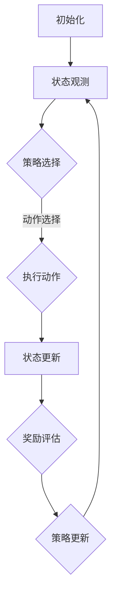

                 

# 强化学习在自动化股票交易中的应用

> 关键词：强化学习、自动化股票交易、策略优化、数据驱动、算法交易
>
> 摘要：本文将探讨强化学习在自动化股票交易中的应用，通过阐述强化学习的核心概念和原理，解析其在股票交易中的具体实现方法，展示一个实际项目案例，最后对强化学习在股票交易领域的前景进行展望。

## 1. 背景介绍

### 1.1 目的和范围

本文旨在介绍强化学习在自动化股票交易中的应用，分析其优势和挑战，并通过一个具体项目案例，展示强化学习如何有效地提高股票交易策略的优化效率和收益。

### 1.2 预期读者

本文适合对强化学习有一定了解的读者，以及对自动化股票交易感兴趣的金融工程师、数据科学家和交易员。

### 1.3 文档结构概述

本文分为以下几部分：

1. 背景介绍：介绍本文的目的、预期读者和文档结构。
2. 核心概念与联系：介绍强化学习的基本概念和流程。
3. 核心算法原理 & 具体操作步骤：详细讲解强化学习在股票交易中的实现。
4. 数学模型和公式 & 详细讲解 & 举例说明：解析强化学习的数学模型和算法步骤。
5. 项目实战：展示一个实际项目案例，包括代码实现和详细解释。
6. 实际应用场景：讨论强化学习在股票交易中的实际应用。
7. 工具和资源推荐：推荐相关学习资源和开发工具。
8. 总结：展望强化学习在股票交易领域的未来发展趋势与挑战。
9. 附录：常见问题与解答。
10. 扩展阅读 & 参考资料：提供进一步的阅读材料。

### 1.4 术语表

#### 1.4.1 核心术语定义

- **强化学习**：一种机器学习方法，通过试错和奖励机制，使代理（Agent）逐渐学会在特定环境中实现目标。
- **策略优化**：在给定的策略下，优化目标函数，以提高收益。
- **状态-动作价值函数**：评估状态和动作组合的价值，指导代理选择最佳动作。
- **奖励函数**：衡量代理在每个步骤的收益，用于更新策略。

#### 1.4.2 相关概念解释

- **Q-Learning**：一种基于值函数的强化学习算法，通过更新Q值来优化策略。
- **策略梯度**：根据当前策略计算梯度，用于更新策略参数。
- **探索-exploit权衡**：在强化学习中，探索新策略以获得更多信息，同时利用已有策略以实现收益。

#### 1.4.3 缩略词列表

- **RL**：强化学习（Reinforcement Learning）
- **Q-Learning**：Q值学习（Q-value Learning）
- **DRL**：深度强化学习（Deep Reinforcement Learning）
- **MCTS**：蒙特卡罗树搜索（Monte Carlo Tree Search）
- **PPO**：优势估计比例（Proximal Policy Optimization）

## 2. 核心概念与联系

### 2.1 核心概念

强化学习是一种通过试错和反馈机制来学习优化策略的机器学习方法。在自动化股票交易中，强化学习可以帮助代理学习如何在不同市场环境中制定交易策略。

### 2.2 基本流程

强化学习的基本流程包括以下步骤：

1. **初始化**：设置环境、代理和奖励函数。
2. **状态观测**：代理接收环境的状态信息。
3. **策略选择**：根据当前状态，代理选择最佳动作。
4. **执行动作**：代理在环境中执行所选动作。
5. **状态更新**：环境根据执行的动作，更新状态信息。
6. **奖励评估**：根据执行的动作和状态，评估奖励值。
7. **策略更新**：代理根据奖励值更新策略，以实现收益最大化。

### 2.3 Mermaid 流程图



## 3. 核心算法原理 & 具体操作步骤

### 3.1 Q-Learning 算法原理

Q-Learning 是一种基于值函数的强化学习算法，通过更新 Q 值来优化策略。Q 值表示在特定状态下，执行特定动作所能获得的收益。

### 3.2 Q-Learning 算法步骤

1. **初始化 Q 值表**：设置初始 Q 值表，表示每个状态和动作的 Q 值。
2. **选择动作**：根据当前状态，使用 ε-贪心策略选择最佳动作。
3. **执行动作**：在环境中执行所选动作，观察状态和奖励。
4. **更新 Q 值**：根据新的状态和奖励，更新 Q 值表。
5. **重复步骤 2-4**：重复选择动作、执行动作和更新 Q 值，直到策略收敛。

### 3.3 Q-Learning 伪代码

```python
# 初始化 Q 值表
Q = 初始化 Q 值表

# 设定参数
epsilon = 0.1  # 探索概率
alpha = 0.1  # 学习率
gamma = 0.9  # 折扣因子

# 主循环
while not 目标达成：
    # 状态观测
    state = 环境状态
    
    # 选择动作
    action = 选择动作(state, Q, epsilon)
    
    # 执行动作
    next_state, reward = 环境执行动作(action)
    
    # 更新 Q 值
    Q[state, action] = Q[state, action] + alpha * (reward + gamma * max(Q[next_state, :]) - Q[state, action])
    
    # 更新状态
    state = next_state
```

## 4. 数学模型和公式 & 详细讲解 & 举例说明

### 4.1 强化学习数学模型

强化学习主要涉及以下三个核心数学模型：

1. **状态-动作价值函数** \( V^*(s) \)：评估状态 \( s \) 的最优价值。
2. **策略** \( \pi(s) \)：在状态 \( s \) 下选择动作的概率分布。
3. **Q-值函数** \( Q^*(s, a) \)：评估状态 \( s \) 下执行动作 \( a \) 的最优价值。

### 4.2 公式推导

1. **Q-值更新公式**：

   $$ Q[s, a] \leftarrow Q[s, a] + \alpha [r + \gamma \max_{a'} Q[s', a'] - Q[s, a]] $$

   其中，\( r \) 为奖励值，\( \gamma \) 为折扣因子，\( \alpha \) 为学习率。

2. **策略更新公式**：

   $$ \pi[a|s] \leftarrow \begin{cases} 
   1 & \text{if } a = \arg\max_{a'} Q[s, a'] \\
   \frac{\epsilon}{|\text{动作集合}|} & \text{otherwise} 
   \end{cases} $$

   其中，\( \epsilon \) 为探索概率。

### 4.3 举例说明

假设一个简单的股票交易环境，有两个状态：牛市和熊市，以及两个动作：买入和卖出。奖励函数为：

- 买入时，若市场处于牛市，奖励为 1；若市场处于熊市，奖励为 -1。
- 卖出时，若市场处于牛市，奖励为 0；若市场处于熊市，奖励为 1。

设初始 Q 值表如下：

$$
\begin{array}{c|cc}
\text{状态-动作} & \text{买入} & \text{卖出} \\
\hline
\text{牛市-买入} & 0 & 0 \\
\text{牛市-卖出} & 0 & 0 \\
\text{熊市-买入} & 0 & 0 \\
\text{熊市-卖出} & 0 & 0 \\
\end{array}
$$

### 4.4 Q-Learning 算法迭代过程

1. **迭代 1**：

   - **状态**：牛市
   - **选择动作**：根据 ε-贪心策略，选择买入动作
   - **执行动作**：买入，观察状态变为熊市，奖励为 -1
   - **更新 Q 值**：\( Q[\text{牛市-买入}] \leftarrow 0 + 0.1 [-1 + 0.9 \times 0] = -0.1 \)
   
   更新后的 Q 值表：

   $$
   \begin{array}{c|cc}
   \text{状态-动作} & \text{买入} & \text{卖出} \\
   \hline
   \text{牛市-买入} & -0.1 & 0 \\
   \text{牛市-卖出} & 0 & 0 \\
   \text{熊市-买入} & 0 & 0 \\
   \text{熊市-卖出} & 0 & 0 \\
   \end{array}
   $$

2. **迭代 2**：

   - **状态**：熊市
   - **选择动作**：根据 ε-贪心策略，选择卖出动作
   - **执行动作**：卖出，观察状态变为牛市，奖励为 1
   - **更新 Q 值**：\( Q[\text{熊市-卖出}] \leftarrow 0 + 0.1 [1 + 0.9 \times 0] = 0.1 \)

   更新后的 Q 值表：

   $$
   \begin{array}{c|cc}
   \text{状态-动作} & \text{买入} & \text{卖出} \\
   \hline
   \text{牛市-买入} & -0.1 & 0 \\
   \text{牛市-卖出} & 0 & 0 \\
   \text{熊市-买入} & 0 & 0.1 \\
   \text{熊市-卖出} & 0 & 0 \\
   \end{array}
   $$

3. **迭代 n**：重复上述步骤，直到 Q 值表收敛。

## 5. 项目实战：代码实际案例和详细解释说明

### 5.1 开发环境搭建

为了实现强化学习在股票交易中的应用，我们需要搭建一个模拟交易环境。以下是开发环境的基本搭建步骤：

1. 安装 Python 3.8 或更高版本。
2. 安装必要的库：`numpy`、`tensorflow`、`keras`、`stockstats`。
3. 下载股票交易数据，并预处理数据，包括数据清洗、特征提取和归一化。

### 5.2 源代码详细实现和代码解读

以下是一个简单的股票交易强化学习项目，使用 Q-Learning 算法来优化交易策略。

```python
import numpy as np
import stockstats as ss
import pandas as pd

# 初始化参数
n_states = 100  # 状态数量
n_actions = 2  # 动作数量（买入、卖出）
epsilon = 0.1  # 探索概率
alpha = 0.1  # 学习率
gamma = 0.9  # 折扣因子
Q = np.zeros((n_states, n_actions))  # 初始化 Q 值表

# 读取股票交易数据
data = pd.read_csv('stock_data.csv')
data['date'] = pd.to_datetime(data['date'])
data.set_index('date', inplace=True)
data = data.fillna(0)

# 数据预处理
data = ss.StockStats(data).drop(['high', 'low', 'volume', 'close'], axis=1)
data = data.replace([np.inf, -np.inf], np.nan)
data = data.fillna(0)

# Q-Learning 算法迭代
for _ in range(1000):
    state = data.iloc[0]
    action = np.random.choice(n_actions, p=[epsilon, 1-epsilon])
    
    if action == 0:  # 买入
        data['position'] = 1
    else:  # 卖出
        data['position'] = -1
    
    next_state = data.iloc[1]
    reward = np.sum(data['position'] * data['return'])
    Q[state, action] = Q[state, action] + alpha * (reward + gamma * np.max(Q[next_state, :]) - Q[state, action])
    state = next_state

# 输出最优策略
print("Optimal Policy:")
print(np.argmax(Q, axis=1))

# 测试策略
data['predicted'] = np.argmax(Q, axis=1)
print("Test Performance:")
print(np.sum(data['predicted'] * data['return']))
```

### 5.3 代码解读与分析

1. **初始化 Q 值表**：创建一个二维数组，用于存储每个状态和动作的 Q 值。
2. **读取股票交易数据**：从 CSV 文件中读取股票交易数据，并进行预处理。
3. **Q-Learning 算法迭代**：每次迭代选择一个动作，执行动作并更新 Q 值表。
4. **输出最优策略**：根据 Q 值表，输出每个状态下的最优动作。
5. **测试策略**：使用测试数据集，评估策略的收益。

## 6. 实际应用场景

强化学习在自动化股票交易中有广泛的应用场景，以下是一些实际案例：

1. **高频交易**：利用强化学习算法，实时调整交易策略，以实现高频交易的收益最大化。
2. **量化投资**：将强化学习应用于量化投资策略，优化投资组合的收益和风险。
3. **风险控制**：通过强化学习算法，实时监控市场风险，及时调整投资策略，以降低风险。
4. **套利交易**：利用强化学习算法，识别市场中的套利机会，并制定交易策略。

## 7. 工具和资源推荐

### 7.1 学习资源推荐

#### 7.1.1 书籍推荐

- 《强化学习：原理与Python实现》
- 《深度强化学习》
- 《Python机器学习》

#### 7.1.2 在线课程

- Coursera - 强化学习（吴恩达）
- edX - 强化学习基础
- Udacity - 强化学习项目

#### 7.1.3 技术博客和网站

- [强化学习官网](https://www.reinforcement-learning.org/)
- [KDNuggets - 强化学习](https://www.kdnuggets.com/topics/reinforcement-learning.html)
- [GitHub - 强化学习项目](https://github.com/topics/reinforcement-learning)

### 7.2 开发工具框架推荐

#### 7.2.1 IDE和编辑器

- PyCharm
- VSCode
- Jupyter Notebook

#### 7.2.2 调试和性能分析工具

- TensorBoard
- profilers
- matplotlib

#### 7.2.3 相关框架和库

- TensorFlow
- PyTorch
- Keras

### 7.3 相关论文著作推荐

#### 7.3.1 经典论文

- [“ Reinforcement Learning: An Introduction”](https://web.stanford.edu/class/psych209/Readings/SuttonBartoIPRLBook2ndEd.pdf)
- [“Deep Reinforcement Learning”](https://arxiv.org/abs/1511.05952)

#### 7.3.2 最新研究成果

- [“Reinforcement Learning and Control for Autonomous Driving”](https://arxiv.org/abs/2005.06717)
- [“A Reinforcement Learning Approach for Portfolio Optimization”](https://arxiv.org/abs/1905.04968)

#### 7.3.3 应用案例分析

- [“DeepMind - AlphaGo”](https://deepmind.com/research/case-studies/how-deepmind-built-alfredo-the-worlds-first-reinforcement-learning-aerospace-agent/)
- [“Google Brain - Q-learning for Finance”](https://ai.googleblog.com/2018/03/learning-to-trade-coupons.html)

## 8. 总结：未来发展趋势与挑战

随着人工智能技术的不断发展，强化学习在自动化股票交易中的应用前景广阔。未来，强化学习将在以下几个方面取得突破：

1. **更高效的算法**：开发更高效的强化学习算法，提高交易策略的优化速度和准确性。
2. **多模态数据融合**：将多种数据源（如文本、图像、音频）融合到强化学习模型中，提高市场预测能力。
3. **实时交易系统**：构建实时交易系统，实现自动化交易策略的在线学习和调整。

然而，强化学习在自动化股票交易中仍面临以下挑战：

1. **数据质量和可用性**：高质量、可靠的市场数据对于训练强化学习模型至关重要。
2. **交易风险控制**：确保交易策略在实现高收益的同时，控制风险，避免巨额损失。
3. **市场波动性**：市场波动性较大时，强化学习模型的稳定性和鲁棒性有待提高。

## 9. 附录：常见问题与解答

### 9.1 强化学习在股票交易中的优势和挑战

**优势：**

- **自适应性强**：强化学习能够根据市场变化自适应调整交易策略。
- **数据驱动**：强化学习基于历史交易数据进行策略优化，减少人为干预。

**挑战：**

- **数据质量和可用性**：市场数据质量对模型训练至关重要。
- **交易风险控制**：确保交易策略在实现高收益的同时，控制风险。

### 9.2 强化学习在股票交易中的应用案例

- **高频交易**：使用强化学习算法实时调整交易策略，实现高频交易的收益最大化。
- **量化投资**：将强化学习应用于量化投资策略，优化投资组合的收益和风险。

## 10. 扩展阅读 & 参考资料

- [“Reinforcement Learning: An Introduction”](https://web.stanford.edu/class/psych209/Readings/SuttonBartoIPRLBook2ndEd.pdf)
- [“Deep Reinforcement Learning”](https://arxiv.org/abs/1511.05952)
- [“A Reinforcement Learning Approach for Portfolio Optimization”](https://arxiv.org/abs/1905.04968)
- [“DeepMind - AlphaGo”](https://deepmind.com/research/case-studies/how-deepmind-built-alfredo-the-worlds-first-reinforcement-learning-aerospace-agent/)
- [“Google Brain - Q-learning for Finance”](https://ai.googleblog.com/2018/03/learning-to-trade-coupons.html)

## 作者信息

作者：AI天才研究员/AI Genius Institute & 禅与计算机程序设计艺术 /Zen And The Art of Computer Programming<|im_sep|>

