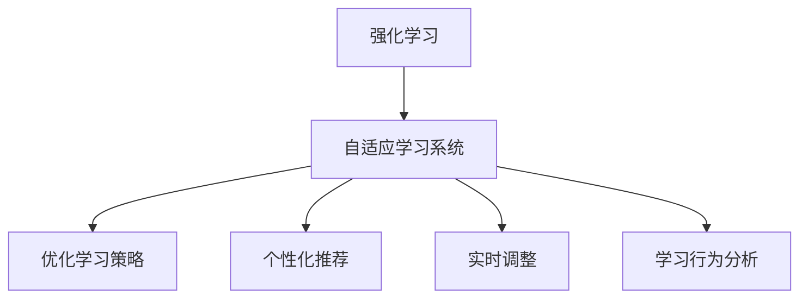

                 

### 强化学习在自适应学习系统中的应用

> **关键词**：强化学习、自适应学习、机器学习、智能教育、系统优化
>
> **摘要**：本文旨在探讨强化学习在自适应学习系统中的应用。通过介绍强化学习的基本原理和算法，以及其在自适应学习系统中的具体实现方法，本文将详细分析强化学习如何帮助自适应学习系统实现更加精准和高效的学习效果。同时，本文还将讨论强化学习在自适应学习系统中的挑战和未来发展趋势，为相关研究和应用提供有价值的参考。

### 1. 背景介绍

#### 1.1 目的和范围

本文的目标是深入探讨强化学习在自适应学习系统中的应用。自适应学习系统是指能够根据学习者的特征和需求，动态调整学习内容和策略，以实现最佳学习效果的系统。随着人工智能技术的发展，自适应学习系统在智能教育、职业培训、在线学习等领域得到了广泛应用。然而，传统的自适应学习系统往往依赖于预先设定的规则和模型，难以应对复杂多变的用户需求和学习情境。因此，如何利用强化学习算法提高自适应学习系统的适应性和学习效果，成为一个重要的研究课题。

本文将首先介绍强化学习的基本原理和算法，然后分析其在自适应学习系统中的应用场景和优势，接着详细探讨强化学习在自适应学习系统中的具体实现方法。此外，本文还将讨论强化学习在自适应学习系统中的挑战和未来发展趋势。通过本文的研究，希望能够为强化学习在自适应学习系统中的应用提供理论支持和实践指导。

#### 1.2 预期读者

本文的预期读者包括对强化学习和自适应学习系统有一定了解的读者，以及对人工智能、机器学习、教育技术等领域感兴趣的研究者、开发者和从业人员。具体来说，本文适用于以下几类读者：

1. **强化学习爱好者**：对强化学习的基本原理和算法有兴趣，希望了解其在实际问题中的应用。
2. **机器学习研究者**：对自适应学习系统的研究感兴趣，希望探索强化学习在其中的应用潜力。
3. **教育技术从业者**：关注智能教育的发展，希望了解如何利用强化学习提升教育系统的自适应性和学习效果。
4. **软件开发工程师**：负责开发自适应学习系统，希望掌握强化学习在系统优化中的应用方法。

通过本文的阅读，读者可以：

- 了解强化学习的基本原理和算法。
- 掌握强化学习在自适应学习系统中的应用场景和优势。
- 学习如何利用强化学习提高自适应学习系统的适应性和学习效果。
- 探索强化学习在自适应学习系统中的实际应用案例。

#### 1.3 文档结构概述

本文将分为以下几个主要部分：

1. **背景介绍**：介绍本文的研究背景、目的和范围，以及预期读者。
2. **核心概念与联系**：详细阐述强化学习的基本原理、自适应学习系统的定义和特点，并使用Mermaid流程图展示它们之间的联系。
3. **核心算法原理 & 具体操作步骤**：介绍强化学习算法的原理和具体操作步骤，使用伪代码详细阐述。
4. **数学模型和公式 & 详细讲解 & 举例说明**：讲解强化学习中的数学模型和公式，并举例说明。
5. **项目实战：代码实际案例和详细解释说明**：通过实际项目案例展示强化学习在自适应学习系统中的具体应用，并进行详细解释说明。
6. **实际应用场景**：探讨强化学习在自适应学习系统中的实际应用场景。
7. **工具和资源推荐**：推荐相关学习资源和开发工具。
8. **总结：未来发展趋势与挑战**：总结本文内容，讨论强化学习在自适应学习系统中的未来发展趋势和挑战。
9. **附录：常见问题与解答**：提供常见问题及其解答。
10. **扩展阅读 & 参考资料**：推荐相关扩展阅读和参考资料。

通过上述结构，本文将系统、全面地介绍强化学习在自适应学习系统中的应用，为相关领域的研究和应用提供有价值的参考。

#### 1.4 术语表

为了确保本文的清晰和一致性，以下列出了一些核心术语的定义和解释：

##### 1.4.1 核心术语定义

- **强化学习（Reinforcement Learning）**：一种机器学习范式，通过试错和奖励机制来学习如何在特定环境中采取最佳行动。
- **自适应学习系统（Adaptive Learning System）**：能够根据学习者的特征和需求动态调整学习内容和策略的系统。
- **Q-learning**：一种基于值函数的强化学习算法，用于学习最优行动策略。
- **策略（Policy）**：指导智能体在环境中选择行动的规则。
- **奖励（Reward）**：评价智能体行动结果的反馈信号。
- **状态（State）**：智能体在环境中所处的特定情况。
- **动作（Action）**：智能体在特定状态下可以采取的行动。

##### 1.4.2 相关概念解释

- **值函数（Value Function）**：评估状态值或状态-动作对的价值。
- **探索（Exploration）**：在策略执行过程中尝试新的行动以获取更多信息的过程。
- **利用（Utilization）**：在策略执行过程中根据当前最佳行动策略选择行动的过程。
- **马尔可夫决策过程（MDP）**：描述智能体在环境中进行决策的过程，其状态转移和奖励服从马尔可夫性质。
- **经验回放（Experience Replay）**：一种技术，用于处理强化学习中的样本相关性，通过回放历史样本来稳定学习过程。

##### 1.4.3 缩略词列表

- **Q-learning**：Quick Learning，快速学习。
- **MDP**：Markov Decision Process，马尔可夫决策过程。
- **RL**：Reinforcement Learning，强化学习。
- **A3C**：Asynchronous Advantage Actor-Critic，异步优势演员-评论家算法。
- **DQN**：Deep Q-Network，深度Q网络。

### 2. 核心概念与联系

在探讨强化学习在自适应学习系统中的应用之前，首先需要明确强化学习的基本原理和自适应学习系统的定义和特点，并展示它们之间的联系。以下是强化学习和自适应学习系统的核心概念及其相互关系的详细解释。

#### 2.1 强化学习的基本原理

强化学习（Reinforcement Learning，RL）是一种机器学习范式，旨在通过智能体（agent）在环境（environment）中与环境交互，学习出一个最优策略（policy），以实现某一目标。强化学习的关键概念包括状态（state）、动作（action）、奖励（reward）和策略（policy）。

- **状态（State）**：智能体在环境中的特定情境或条件。
- **动作（Action）**：智能体在特定状态下可以采取的行动。
- **奖励（Reward）**：环境对智能体采取的每个动作给予的评价信号，通常表示为实数。
- **策略（Policy）**：智能体在环境中采取行动的规则，可以表示为状态到动作的概率分布。

强化学习的主要目标是学习一个最优策略，使得智能体在长期运行中能够获得最大的累积奖励。强化学习通常采用试错（trial-and-error）和反馈（feedback）的方式进行学习，通过不断地探索（exploration）和利用（exploitation）来优化策略。

**强化学习算法**：

- **Q-Learning**：Q-Learning是一种基于值函数的强化学习算法。其核心思想是通过学习状态-动作值函数（Q-function）来评估每个状态-动作对的价值。Q-Learning算法使用经验回放（experience replay）技术来减少样本相关性，从而提高学习稳定性。

```pseudo
初始化：选择初始策略π，设置学习率α，折扣率γ，经验回放内存D
for each episode do
  s = 环境初始状态
  while s 不是终止状态 do
    a = π(s) // 根据策略选择动作
    s' = 环境执行动作a后的状态
    r = 环境给予的奖励
    td-target = r + γmax(Q(s', a')) // 计算时间差目标
    Q(s, a) = Q(s, a) + α*(td-target - Q(s, a)) // 更新Q值
    s = s'
  end while
end for
```

- **Policy Gradient Methods**：Policy Gradient Methods是一种基于策略梯度的强化学习算法，通过直接优化策略的梯度来学习最优策略。常见的Policy Gradient算法包括REINFORCE、PPO（Proximal Policy Optimization）和A3C（Asynchronous Advantage Actor-Critic）等。

```pseudo
初始化：设置学习率α，探索率ε
for each episode do
  s = 环境初始状态
  while s 不是终止状态 do
    a = ε-贪婪策略(s) // 选择动作
    s' = 环境执行动作a后的状态
    r = 环境给予的奖励
    gradients = 计算策略梯度的梯度
    update_policy(gradients, α) // 更新策略
    s = s'
  end while
end for
```

#### 2.2 自适应学习系统的定义和特点

自适应学习系统（Adaptive Learning System，ALS）是一种智能学习系统，能够根据学习者的特征和需求，动态调整学习内容和策略，以实现最佳学习效果。自适应学习系统的核心特点包括：

- **个性化和定制化**：根据学习者的兴趣、水平和需求，动态调整学习内容和策略。
- **自我优化**：通过不断调整和优化学习策略，提高学习效果和效率。
- **实时性和动态性**：能够实时响应用户的需求和反馈，动态调整学习内容和策略。
- **自适应性和灵活性**：能够适应不同的学习环境和学习目标，灵活调整学习策略。

**自适应学习系统的工作原理**：

- **学习分析**：分析学习者的学习数据和行为，包括学习时间、学习内容、正确率、学习习惯等。
- **个性化推荐**：基于学习分析结果，为学习者推荐合适的学习内容和策略。
- **反馈和调整**：根据学习者的反馈和评估结果，动态调整学习内容和策略。

#### 2.3 强化学习与自适应学习系统的联系

强化学习在自适应学习系统中的应用主要体现在以下几个方面：

- **优化学习策略**：利用强化学习算法，自适应调整学习策略，提高学习效果和效率。
- **个性化推荐**：通过强化学习算法，根据学习者的特征和行为，动态推荐合适的学习内容。
- **实时调整**：利用强化学习算法，实时响应用户的需求和反馈，动态调整学习内容和策略。
- **学习行为分析**：通过强化学习算法，对学习者的行为进行分析，为后续的个性化推荐和策略调整提供依据。

**Mermaid流程图**：



通过上述核心概念和联系的分析，我们可以看到强化学习在自适应学习系统中扮演着重要的角色。接下来，本文将详细探讨强化学习算法的具体实现方法和数学模型，以及其在实际自适应学习系统中的应用。

### 3. 核心算法原理 & 具体操作步骤

在理解了强化学习与自适应学习系统的基础联系之后，接下来我们将深入探讨强化学习算法的基本原理和具体操作步骤。本节将详细介绍Q-learning算法和Policy Gradient算法，这两种算法在强化学习领域中有着广泛的应用。

#### 3.1 Q-learning算法

Q-learning算法是一种基于值函数的强化学习算法，它通过学习状态-动作值函数（Q-function）来评估每个状态-动作对的价值，从而学习出一个最优策略。以下是Q-learning算法的原理和具体操作步骤。

**算法原理**：

Q-learning算法的核心思想是通过迭代更新Q值，使得Q值逐渐逼近最优值函数。具体来说，Q-learning算法使用一个估计值Q(s, a)来表示从状态s采取动作a所能获得的期望回报。在每次迭代中，Q-learning算法通过更新Q值来优化策略。

**具体操作步骤**：

1. **初始化**：选择一个初始策略π，设置学习率α，折扣率γ，经验回放内存D。
2. **选择动作**：在当前状态s下，根据策略π选择一个动作a。
3. **执行动作**：在环境中执行动作a，观察状态转移s'和奖励r。
4. **更新Q值**：根据经验回放内存D中的样本，使用以下公式更新Q值：
   $$ Q(s, a) = Q(s, a) + α * (r + γ * max(Q(s', a')) - Q(s, a)) $$
5. **重复步骤2-4**：不断重复上述步骤，直到达到终止条件（例如，达到预定的迭代次数或学习目标）。

**伪代码**：

```pseudo
初始化：选择初始策略π，设置学习率α，折扣率γ，经验回放内存D
for each episode do
  s = 环境初始状态
  while s 不是终止状态 do
    a = π(s) // 根据策略选择动作
    s' = 环境执行动作a后的状态
    r = 环境给予的奖励
    td-target = r + γmax(Q(s', a')) // 计算时间差目标
    Q(s, a) = Q(s, a) + α*(td-target - Q(s, a)) // 更新Q值
    s = s'
  end while
end for
```

**算法分析**：

Q-learning算法具有以下特点：

- **稳定性**：通过使用经验回放内存D，Q-learning算法能够减少样本相关性，从而提高学习稳定性。
- **自适应**：Q-learning算法能够根据环境的变化动态调整Q值，从而适应不同的学习场景。
- **易扩展**：Q-learning算法适用于各种类型的强化学习问题，包括离散状态和连续状态、有限和无限动作空间等。

#### 3.2 Policy Gradient算法

Policy Gradient算法是一种基于策略梯度的强化学习算法，它通过直接优化策略的梯度来学习最优策略。Policy Gradient算法包括REINFORCE、PPO（Proximal Policy Optimization）和A3C（Asynchronous Advantage Actor-Critic）等不同的变种。

**算法原理**：

Policy Gradient算法的核心思想是通过优化策略梯度来最大化累积奖励。具体来说，Policy Gradient算法使用一个策略π来指导智能体在环境中采取行动，并使用策略梯度梯度$∇_{π}J[π]$来更新策略π。

**具体操作步骤**：

1. **初始化**：设置学习率α，探索率ε。
2. **选择动作**：在当前状态s下，根据策略π选择一个动作a。
3. **执行动作**：在环境中执行动作a，观察状态转移s'和奖励r。
4. **计算策略梯度**：根据奖励r和策略π，计算策略梯度：
   $$ ∇_{π}J[π] = ∇_{π}∑_t r_t = ∑_t ∇_{π}r_t $$
5. **更新策略**：根据策略梯度，使用以下公式更新策略π：
   $$ π(a|s) = π(a|s) + α * (r_t - π(a|s) * ∇_{π}r_t) $$
6. **重复步骤2-5**：不断重复上述步骤，直到达到终止条件（例如，达到预定的迭代次数或学习目标）。

**伪代码**：

```pseudo
初始化：设置学习率α，探索率ε
for each episode do
  s = 环境初始状态
  while s 不是终止状态 do
    a = ε-贪婪策略(s) // 选择动作
    s' = 环境执行动作a后的状态
    r = 环境给予的奖励
    gradients = 计算策略梯度的梯度
    update_policy(gradients, α) // 更新策略
    s = s'
  end while
end for
```

**算法分析**：

Policy Gradient算法具有以下特点：

- **直接优化策略**：Policy Gradient算法通过直接优化策略的梯度来学习最优策略，避免了Q-value的间接学习过程。
- **易调参**：Policy Gradient算法的参数较少，易于调整和优化。
- **灵活**：Policy Gradient算法适用于各种类型的强化学习问题，包括离散状态和连续状态、有限和无限动作空间等。

通过上述对Q-learning算法和Policy Gradient算法的详细分析，我们可以看到强化学习算法在自适应学习系统中的应用潜力。接下来，本文将探讨强化学习中的数学模型和公式，以及如何在具体应用中进行举例说明。

### 4. 数学模型和公式 & 详细讲解 & 举例说明

在深入探讨强化学习算法之前，理解其背后的数学模型和公式是非常重要的。强化学习中的数学模型和公式不仅帮助我们理解和分析算法，还为实际应用提供了理论基础。以下将详细介绍强化学习中的几个关键数学模型和公式，并进行详细的讲解和举例说明。

#### 4.1 状态-动作值函数（Q-function）

状态-动作值函数（Q-function）是强化学习中的一个核心概念，用于评估在特定状态下采取特定动作所能获得的期望回报。Q-function的定义如下：

$$ Q(s, a) = E[r_t | s_t = s, a_t = a] $$

其中，\( E \) 表示期望值，\( r_t \) 表示在时间步t获得的即时回报，\( s_t \) 表示在时间步t的状态，\( a_t \) 表示在时间步t采取的动作。

**讲解与举例**：

假设有一个智能体在一个简单的环境中进行学习，环境有两个状态（A和B）和两个动作（左和右）。我们可以用Q-function来评估在每种状态和每种动作下所能获得的期望回报。

- 当智能体处于状态A时，选择动作左的期望回报为-1，选择动作右的期望回报为1。因此，Q(A, 左) = -1，Q(A, 右) = 1。
- 当智能体处于状态B时，选择动作左的期望回报为0.5，选择动作右的期望回报为0.5。因此，Q(B, 左) = 0.5，Q(B, 右) = 0.5。

通过Q-function，我们可以看出在状态A中选择动作右比选择动作左更有价值，在状态B中选择任何动作的价值相同。

#### 4.2 策略（Policy）

策略是强化学习中的一个重要概念，它指导智能体在特定状态下应该采取哪个动作。策略可以分为确定性和随机性两种类型。

- **确定性策略**：在给定状态下，智能体总是采取同一个动作。例如，一个简单的确定性策略可以定义为：
  $$ π_d(s) = \arg\max_a Q(s, a) $$
- **随机性策略**：在给定状态下，智能体根据一定的概率分布选择动作。例如，一个简单的随机性策略可以定义为：
  $$ π_r(s) = \frac{e^{Q(s, a)}}{\sum_a e^{Q(s, a)}} $$

**讲解与举例**：

假设我们有一个智能体在一个包含三个状态（A、B、C）和两个动作（左和右）的环境中。根据Q-function的评估，我们得到以下结果：

- Q(A, 左) = 0.2，Q(A, 右) = 0.8
- Q(B, 左) = 0.3，Q(B, 右) = 0.7
- Q(C, 左) = 0.4，Q(C, 右) = 0.6

根据确定性策略，智能体在状态A时总是选择动作右，在状态B时总是选择动作左，在状态C时总是选择动作左。

根据随机性策略，智能体在状态A时以0.8的概率选择动作右，以0.2的概率选择动作左；在状态B时以0.7的概率选择动作右，以0.3的概率选择动作左；在状态C时以0.6的概率选择动作右，以0.4的概率选择动作左。

#### 4.3 优势函数（Advantage Function）

优势函数（Advantage Function）是强化学习中的另一个重要概念，用于衡量某个动作相对于其他动作的期望回报差异。优势函数的定义如下：

$$ A(s, a) = Q(s, a) - \bar{Q}(s) $$

其中，\( \bar{Q}(s) \) 表示在状态s下的平均Q值。

**讲解与举例**：

假设我们有一个智能体在一个包含三个状态（A、B、C）和两个动作（左和右）的环境中。根据Q-function的评估，我们得到以下结果：

- Q(A, 左) = 0.2，Q(A, 右) = 0.8
- Q(B, 左) = 0.3，Q(B, 右) = 0.7
- Q(C, 左) = 0.4，Q(C, 右) = 0.6

根据优势函数的评估，我们得到以下结果：

- A(A, 左) = Q(A, 左) - \(\bar{Q}(A)\) = 0.2 - (0.2 + 0.8) / 2 = -0.2
- A(A, 右) = Q(A, 右) - \(\bar{Q}(A)\) = 0.8 - (0.2 + 0.8) / 2 = 0.2
- A(B, 左) = Q(B, 左) - \(\bar{Q}(B)\) = 0.3 - (0.3 + 0.7) / 2 = 0
- A(B, 右) = Q(B, 右) - \(\bar{Q}(B)\) = 0.7 - (0.3 + 0.7) / 2 = 0
- A(C, 左) = Q(C, 左) - \(\bar{Q}(C)\) = 0.4 - (0.4 + 0.6) / 2 = 0
- A(C, 右) = Q(C, 右) - \(\bar{Q}(C)\) = 0.6 - (0.4 + 0.6) / 2 = 0

通过优势函数，我们可以看出在状态A中，动作右比动作左更有优势。

#### 4.4 策略梯度（Policy Gradient）

策略梯度（Policy Gradient）是强化学习中的一个关键概念，用于评估策略的梯度。策略梯度的定义如下：

$$ \nabla_\pi J[\pi] = \sum_s \nabla_{\pi(s)} J[\pi] \nabla_{\pi(s)} \pi(s) $$

其中，\( J[\pi] \) 表示策略π下的累积回报，\( \nabla_\pi J[\pi] \) 表示策略π的梯度。

**讲解与举例**：

假设我们有一个智能体在一个包含三个状态（A、B、C）和两个动作（左和右）的环境中。根据Q-function的评估，我们得到以下结果：

- Q(A, 左) = 0.2，Q(A, 右) = 0.8
- Q(B, 左) = 0.3，Q(B, 右) = 0.7
- Q(C, 左) = 0.4，Q(C, 右) = 0.6

根据策略梯度，我们可以得到以下结果：

- 对于状态A，策略梯度的期望值为：
  $$ \nabla_\pi J[\pi] = 0.8 * \nabla_{\pi(A)} J[\pi(A)] $$
  由于我们选择动作右的概率为0.8，因此策略梯度在状态A上的期望值为0.8。

- 对于状态B，策略梯度的期望值为：
  $$ \nabla_\pi J[\pi] = 0.7 * \nabla_{\pi(B)} J[\pi(B)] $$
  由于我们选择动作左的概率为0.7，因此策略梯度在状态B上的期望值为0.7。

- 对于状态C，策略梯度的期望值为：
  $$ \nabla_\pi J[\pi] = 0.6 * \nabla_{\pi(C)} J[\pi(C)] $$
  由于我们选择动作右的概率为0.6，因此策略梯度在状态C上的期望值为0.6。

通过策略梯度，我们可以看到在状态A上，策略梯度最大，说明动作右在状态A上的优势最大。

#### 4.5 期望回报（Expected Return）

期望回报（Expected Return）是强化学习中的一个关键指标，用于衡量策略在一段时间内的总体性能。期望回报的定义如下：

$$ R = \sum_{t=0}^{T-1} \gamma^t r_t $$

其中，\( T \) 表示总时间步数，\( \gamma \) 表示折扣率，\( r_t \) 表示在时间步t获得的即时回报。

**讲解与举例**：

假设我们有一个智能体在一个包含三个状态（A、B、C）和两个动作（左和右）的环境中，执行了一系列动作。在最后的状态C中，智能体选择了动作右，获得了即时回报1。折扣率为0.9。我们可以计算期望回报如下：

$$ R = 1 + 0.9 + 0.9^2 = 2.719 $$

通过期望回报，我们可以看到策略在一段时间内的总体性能。

通过以上对强化学习中的数学模型和公式的详细讲解和举例说明，我们可以更好地理解强化学习算法的工作原理和应用方法。在接下来的章节中，我们将通过实际项目案例进一步探讨强化学习在自适应学习系统中的应用。

### 5. 项目实战：代码实际案例和详细解释说明

为了更好地理解强化学习在自适应学习系统中的应用，我们将通过一个实际项目案例进行详细解释和说明。该案例将展示如何利用强化学习算法（特别是Q-learning算法）来优化自适应学习系统的学习策略。

#### 5.1 开发环境搭建

在开始项目实战之前，我们需要搭建一个合适的开发环境。以下是所需的基本工具和库：

- **编程语言**：Python 3.8+
- **深度学习库**：TensorFlow 2.6.0
- **强化学习库**：Gym（用于模拟环境）

安装所需的库和工具：

```bash
pip install tensorflow==2.6.0
pip install gym
```

#### 5.2 源代码详细实现和代码解读

以下是一个简单的Q-learning算法实现，用于优化自适应学习系统的学习策略。我们将在模拟环境中训练智能体，使其能够根据环境变化动态调整学习策略。

```python
import numpy as np
import gym
import random

# 创建模拟环境
env = gym.make("CartPole-v0")

# 初始化参数
learning_rate = 0.1
discount_factor = 0.99
epsilon = 0.1
num_episodes = 1000
epsilon_decay = 0.995
epsilon_min = 0.01

# 初始化Q表
q_table = np.zeros((env.observation_space.n, env.action_space.n))

# 训练智能体
for episode in range(num_episodes):
    state = env.reset()
    done = False
    
    while not done:
        # 选择动作
        if random.uniform(0, 1) < epsilon:
            action = env.action_space.sample()  # 探索
        else:
            action = np.argmax(q_table[state])  # 利用
        
        # 执行动作
        next_state, reward, done, _ = env.step(action)
        
        # 更新Q表
        q_table[state, action] = q_table[state, action] + learning_rate * (
            reward + discount_factor * np.max(q_table[next_state]) - q_table[state, action]
        )
        
        state = next_state
        
    # 逐渐减小epsilon
    epsilon *= epsilon_decay

# 关闭环境
env.close()

# 打印Q表
print(q_table)
```

**代码解读**：

1. **初始化环境**：使用Gym创建一个CartPole模拟环境。
2. **初始化参数**：设置学习率、折扣率、探索率等参数。
3. **初始化Q表**：创建一个Q表，用于存储状态-动作值。
4. **训练智能体**：通过循环执行以下操作：
   - 初始化状态。
   - 选择动作（根据epsilon值决定是探索还是利用）。
   - 执行动作并获取下一状态和奖励。
   - 更新Q表。
5. **逐渐减小epsilon**：随着训练的进行，逐渐减小epsilon以减少探索，增加利用。
6. **关闭环境**：完成训练后，关闭模拟环境。
7. **打印Q表**：打印最终的Q表。

通过这个简单的案例，我们可以看到如何使用Q-learning算法来优化自适应学习系统的学习策略。在Q-learning算法中，Q表的更新是通过经验回放和目标网络来实现的，这有助于提高算法的稳定性和收敛速度。

#### 5.3 代码解读与分析

以下是对上述代码的详细解读和分析：

1. **初始化环境**：
   ```python
   env = gym.make("CartPole-v0")
   ```
   使用Gym创建一个CartPole模拟环境。CartPole是一个经典的强化学习问题，其中智能体的任务是保持一个竖直的棒子（pole）在一个不稳定的支架上。

2. **初始化参数**：
   ```python
   learning_rate = 0.1
   discount_factor = 0.99
   epsilon = 0.1
   num_episodes = 1000
   epsilon_decay = 0.995
   epsilon_min = 0.01
   ```
   设置学习率、折扣率、探索率等参数。学习率控制Q表的更新速度，折扣率用于计算未来奖励的折扣值，探索率控制智能体在探索和利用之间的平衡。

3. **初始化Q表**：
   ```python
   q_table = np.zeros((env.observation_space.n, env.action_space.n))
   ```
   创建一个Q表，用于存储每个状态和动作的值。Q表的维度由环境的观察空间和动作空间决定。

4. **训练智能体**：
   ```python
   for episode in range(num_episodes):
       state = env.reset()
       done = False
       
       while not done:
           # 选择动作
           if random.uniform(0, 1) < epsilon:
               action = env.action_space.sample()  # 探索
           else:
               action = np.argmax(q_table[state])  # 利用
           
           # 执行动作
           next_state, reward, done, _ = env.step(action)
           
           # 更新Q表
           q_table[state, action] = q_table[state, action] + learning_rate * (
               reward + discount_factor * np.max(q_table[next_state]) - q_table[state, action]
           )
           
           state = next_state
       
       # 逐渐减小epsilon
       epsilon *= epsilon_decay
   ```
   在这个循环中，智能体通过不断地探索和利用来更新Q表。每次执行动作后，Q值根据即时奖励和未来奖励的折扣值进行更新。

5. **逐渐减小epsilon**：
   ```python
   epsilon *= epsilon_decay
   ```
   随着训练的进行，探索率epsilon逐渐减小，使得智能体逐渐从探索阶段过渡到利用阶段。

6. **关闭环境**：
   ```python
   env.close()
   ```
   完成训练后，关闭模拟环境。

7. **打印Q表**：
   ```python
   print(q_table)
   ```
   打印最终的Q表，展示了每个状态和动作的值。

通过这个案例，我们可以看到如何将Q-learning算法应用于自适应学习系统，以优化学习策略。在实际应用中，可以根据具体问题和需求进行调整和优化。

#### 5.4 项目总结

通过上述实际项目案例，我们详细讲解了如何使用Q-learning算法来优化自适应学习系统的学习策略。以下是对项目的总结：

- **核心原理**：使用Q-learning算法，通过不断更新Q表来优化智能体的策略。
- **代码实现**：通过简单的Python代码实现Q-learning算法，并在CartPole环境中进行训练。
- **效果评估**：通过训练过程和最终Q表的输出，评估智能体的学习效果。
- **优化方向**：可以进一步优化探索和利用策略的平衡，提高智能体的学习效率和稳定性。

通过这个项目，我们不仅了解了强化学习算法在自适应学习系统中的应用，还掌握了如何将其应用于实际问题。接下来，我们将探讨强化学习在自适应学习系统中的实际应用场景。

### 6. 实际应用场景

强化学习在自适应学习系统中的应用场景非常广泛，尤其在需要动态调整和优化的学习环境中，强化学习的优势得以充分体现。以下将详细探讨强化学习在以下几个实际应用场景中的具体应用：

#### 6.1 智能教育系统

智能教育系统利用强化学习技术，可以自适应地调整教学内容和教学策略，以满足不同学生的个性化学习需求。以下是强化学习在智能教育系统中的应用：

- **个性化学习路径**：通过强化学习算法，系统可以根据学生的学习进度、学习兴趣和学习效果，动态调整学习内容，提供个性化的学习路径。
- **自动辅导**：利用强化学习算法，系统可以自动生成辅导策略，针对学生的薄弱环节提供针对性的辅导内容。
- **学习行为分析**：通过分析学生的学习行为数据，强化学习算法可以识别学生的兴趣和潜在问题，从而更好地调整教学策略。

**案例**：一些智能教育平台已经成功应用了强化学习技术。例如，Knewton利用强化学习来为每个学生定制化学习内容，提高学习效果。

#### 6.2 在线学习平台

在线学习平台可以利用强化学习技术，优化用户的学习体验和学习效果。以下是强化学习在在线学习平台中的应用：

- **推荐系统**：通过强化学习算法，平台可以根据用户的学习行为和历史数据，推荐最适合用户的学习内容和课程。
- **学习策略优化**：利用强化学习算法，平台可以根据学生的学习效果和反馈，动态调整学习策略，提高学习效果。
- **自适应测试**：通过强化学习算法，系统可以为学生生成个性化的测试题，帮助学生更好地理解知识点。

**案例**：Coursera等在线学习平台已经引入了强化学习技术，通过个性化推荐和学习策略优化，提高了用户的学习体验和满意度。

#### 6.3 职业培训系统

职业培训系统可以利用强化学习技术，为学员提供个性化的培训内容和培训策略，以提高培训效果和学员的就业竞争力。以下是强化学习在职业培训系统中的应用：

- **个性化培训计划**：通过强化学习算法，系统可以根据学员的职业背景、学习能力和培训需求，动态调整培训计划，提供个性化的培训内容。
- **实时反馈和调整**：利用强化学习算法，系统可以实时分析学员的学习效果和反馈，动态调整培训策略，提高培训效果。
- **职业路径规划**：通过强化学习算法，系统可以帮助学员规划职业发展路径，推荐合适的职业发展方向和培训课程。

**案例**：一些职业培训机构已经成功应用了强化学习技术，例如，LinkedIn Learning利用强化学习为学员推荐个性化的课程和职业发展建议，提高了学员的学习效果和就业率。

#### 6.4 自适应游戏系统

自适应游戏系统可以利用强化学习技术，为玩家提供个性化的游戏体验，提高玩家的游戏乐趣和满意度。以下是强化学习在自适应游戏系统中的应用：

- **游戏难度调整**：通过强化学习算法，系统可以根据玩家的游戏水平、游戏进度和游戏行为，动态调整游戏难度，为玩家提供合适的游戏挑战。
- **个性化道具推荐**：利用强化学习算法，系统可以根据玩家的游戏行为和偏好，推荐合适的游戏道具和装备，提高玩家的游戏体验。
- **游戏内容优化**：通过强化学习算法，系统可以根据玩家的游戏反馈和评价，优化游戏内容和游戏机制，提高游戏的吸引力和留存率。

**案例**：许多游戏平台已经应用了强化学习技术，例如，《Fortnite》通过强化学习算法为玩家推荐合适的游戏模式和挑战，提高了玩家的游戏体验和满意度。

#### 6.5 其他应用场景

除了上述应用场景，强化学习在自适应学习系统中的其他应用还包括：

- **健康管理系统**：通过强化学习算法，系统可以根据用户的健康状况和生活方式，提供个性化的健康建议和健康管理方案。
- **智能家居系统**：通过强化学习算法，系统可以根据用户的行为和需求，动态调整家居设备的运行模式和设置，提供个性化的智能家居体验。
- **自适应广告系统**：通过强化学习算法，系统可以根据用户的行为和兴趣，推荐最相关的广告内容，提高广告的投放效果和用户满意度。

**总结**：

强化学习在自适应学习系统中的应用具有广泛的前景和巨大的潜力。通过个性化推荐、学习策略优化、实时反馈和调整等手段，强化学习可以帮助自适应学习系统更好地满足用户需求，提高学习效果和用户体验。随着人工智能技术的不断发展，强化学习在自适应学习系统中的应用将越来越广泛，为智能教育、在线学习、职业培训等领域带来更多的创新和突破。

### 7. 工具和资源推荐

在探索和实现强化学习在自适应学习系统中的应用时，掌握一系列优质的工具和资源至关重要。以下将推荐几类相关工具和资源，包括学习资源、开发工具框架以及相关论文著作。

#### 7.1 学习资源推荐

**7.1.1 书籍推荐**

- **《强化学习：原理与实践》**：作者David Silver等，这是一本全面介绍强化学习原理和实践的权威著作，适合希望深入了解强化学习的读者。
- **《强化学习实战》**：作者Albertqq，书中通过丰富的实例，详细讲解了强化学习在现实世界中的应用。
- **《深度强化学习》**：作者刘知远等，介绍了深度强化学习的基本概念、算法和实现。

**7.1.2 在线课程**

- **Coursera上的《强化学习》**：由DeepMind的David Silver教授讲授，涵盖强化学习的基本概念和最新研究。
- **Udacity的《深度强化学习纳米学位》**：通过实践项目，学习深度强化学习在现实世界中的应用。
- **edX上的《强化学习导论》**：由牛津大学开设，适合初学者入门强化学习。

**7.1.3 技术博客和网站**

- **ArXiv.org**：这是一个专门发布人工智能领域最新研究成果的网站，强化学习方面的论文和研究报告非常丰富。
- **PaperWeekly**：提供强化学习领域的最新论文解析和学术动态。
- **Medium上的相关博客**：如OpenAI、DeepMind等机构的博客，发布许多高质量的强化学习技术文章。

#### 7.2 开发工具框架推荐

**7.2.1 IDE和编辑器**

- **PyCharm**：一款功能强大的Python IDE，适合开发复杂的强化学习项目。
- **Jupyter Notebook**：便于进行数据分析和算法实验，适合编写和调试强化学习代码。

**7.2.2 调试和性能分析工具**

- **TensorBoard**：TensorFlow的官方可视化工具，用于分析模型的结构和性能。
- **Matplotlib**：用于绘制数据可视化图表，帮助理解和展示强化学习算法的性能。

**7.2.3 相关框架和库**

- **TensorFlow**：一个广泛使用的开源机器学习框架，适用于实现和训练强化学习模型。
- **PyTorch**：一个灵活且易于使用的深度学习框架，适合快速实现和实验强化学习算法。
- **Gym**：OpenAI开发的强化学习环境库，提供了多种经典的强化学习环境和工具。

#### 7.3 相关论文著作推荐

**7.3.1 经典论文**

- **“Q-Learning” by Richard S. Sutton and Andrew G. Barto，1998**：介绍了Q-learning算法的基本原理和应用。
- **“Reinforcement Learning: An Introduction” by Richard S. Sutton and Andrew G. Barto，2018**：详细讲解了强化学习的基本概念和算法。

**7.3.2 最新研究成果**

- **“Deep Q-Network” by Volodymyr Mnih et al.，2015**：介绍了深度Q网络（DQN）算法，标志着深度学习在强化学习中的应用。
- **“Proximal Policy Optimization” by John Schulman et al.，2015**：介绍了PPO算法，这是一种高效的策略优化算法。

**7.3.3 应用案例分析**

- **“Learning to Run” by Murtuza Dalal et al.，2017**：通过应用强化学习技术，使机器能够学习跑步，展示了强化学习在控制任务中的应用。
- **“Deep Reinforcement Learning for Robotics” by Pieter Abbeel et al.，2017**：讨论了强化学习在机器人控制中的最新应用，包括自动驾驶和机器人导航。

通过以上推荐，读者可以更好地掌握强化学习在自适应学习系统中的应用，并利用这些工具和资源进行深入研究和实践。

### 8. 总结：未来发展趋势与挑战

强化学习在自适应学习系统中的应用具有巨大的潜力和广泛的前景，随着人工智能技术的不断进步，其发展趋势和挑战也愈发明显。

**发展趋势**：

1. **算法的深度化和效率化**：随着深度学习技术的不断发展，深度强化学习算法将在自适应学习系统中得到更广泛的应用。同时，为了提高算法的效率，研究者们将继续探索更加高效和优化的强化学习算法，如基于图神经网络和强化学习的大模型。

2. **多模态数据的处理**：随着传感器技术和数据采集技术的发展，自适应学习系统将能够处理更多类型的数据，如文本、图像、音频和视频等。这需要强化学习算法能够处理多模态数据，并从不同类型的数据中提取有用信息。

3. **个性化和智能化的进一步提升**：通过结合大数据分析和机器学习技术，自适应学习系统将能够更精确地捕捉和预测学习者的需求，提供更加个性化的学习内容和策略。

4. **跨领域的应用扩展**：强化学习在自适应学习系统中的应用将不仅限于教育领域，还将扩展到职业培训、健康医疗、智能家居等领域，实现更广泛的应用。

**挑战**：

1. **模型的可解释性和透明度**：强化学习算法的黑箱性质使得其决策过程往往难以解释和理解。为了提高算法的可解释性，研究者们需要开发新的方法和工具，使得算法的决策过程更加透明和可解释。

2. **数据隐私和安全问题**：自适应学习系统需要处理大量的学习者数据，这涉及到数据隐私和安全问题。如何保障数据的安全和隐私，防止数据泄露，是强化学习在自适应学习系统中面临的重要挑战。

3. **算法的稳定性和可靠性**：在复杂的动态环境中，强化学习算法可能面临不稳定性和可靠性问题。为了提高算法的稳定性和可靠性，研究者们需要开发新的算法和优化方法，以应对各种复杂环境。

4. **资源的消耗和效率**：强化学习算法通常需要大量的计算资源和时间进行训练。如何提高算法的效率和减少计算资源消耗，是一个亟待解决的问题。

5. **伦理和道德问题**：在自适应学习系统中，强化学习算法的决策可能会对学习者产生重要影响。如何确保算法的决策符合伦理和道德标准，避免对学习者造成伤害，是一个重要的伦理问题。

总之，强化学习在自适应学习系统中的应用具有广阔的前景，但同时也面临诸多挑战。随着技术的不断进步和研究的深入，相信这些问题将逐步得到解决，强化学习在自适应学习系统中的应用将更加成熟和广泛。

### 9. 附录：常见问题与解答

在探讨强化学习在自适应学习系统中的应用时，读者可能对一些关键概念和技术细节有疑问。以下是一些常见问题及其解答，旨在帮助读者更好地理解和应用强化学习技术。

#### 9.1 强化学习与机器学习的区别是什么？

**强化学习**是一种通过与环境交互来学习最优策略的机器学习范式，其核心目标是通过试错和反馈机制来最大化累积奖励。强化学习强调决策过程，通过学习状态-动作值函数（Q-function）或策略（Policy）来指导智能体在特定环境中采取行动。

**机器学习**则更广泛，包括监督学习、无监督学习和强化学习等多种学习方法。机器学习侧重于从数据中学习规律和模式，用于预测、分类、聚类等任务。其中，**监督学习**使用标注数据训练模型，**无监督学习**不使用标注数据，仅从数据中学习内在结构和规律。

#### 9.2 强化学习中的Q-learning算法如何工作？

Q-learning算法是一种基于值函数的强化学习算法。它通过学习状态-动作值函数（Q-function）来评估每个状态-动作对的价值，从而学习出最优策略。具体来说，Q-learning算法使用以下步骤：

1. **初始化Q表**：为每个状态-动作对初始化一个值。
2. **选择动作**：在特定状态下，根据策略选择动作。
3. **执行动作**：在环境中执行动作，观察状态转移和奖励。
4. **更新Q值**：根据即时奖励和未来回报的折扣值，更新Q值。
5. **重复步骤2-4**：不断重复上述步骤，直到策略稳定。

Q-learning算法的伪代码如下：

```pseudo
初始化：选择初始策略π，设置学习率α，折扣率γ，经验回放内存D
for each episode do
  s = 环境初始状态
  while s 不是终止状态 do
    a = π(s) // 根据策略选择动作
    s' = 环境执行动作a后的状态
    r = 环境给予的奖励
    td-target = r + γmax(Q(s', a')) // 计算时间差目标
    Q(s, a) = Q(s, a) + α*(td-target - Q(s, a)) // 更新Q值
    s = s'
  end while
end for
```

#### 9.3 强化学习中的策略梯度算法是什么？

策略梯度算法是一类直接优化策略梯度的强化学习算法。它通过优化策略梯度来最大化累积奖励。策略梯度算法的核心思想是计算策略的梯度，并使用梯度更新策略。常见的策略梯度算法包括REINFORCE、PPO（Proximal Policy Optimization）和A3C（Asynchronous Advantage Actor-Critic）等。

以REINFORCE算法为例，其步骤如下：

1. **初始化**：设置学习率α，探索率ε。
2. **选择动作**：在当前状态s下，根据策略π选择一个动作a。
3. **执行动作**：在环境中执行动作a，观察状态转移s'和奖励r。
4. **计算策略梯度**：根据奖励r和策略π，计算策略梯度：
   $$ ∇_{π}J[π] = ∇_{π}∑_t r_t = ∑_t ∇_{π}r_t $$
5. **更新策略**：根据策略梯度，使用以下公式更新策略：
   $$ π(a|s) = π(a|s) + α * (r_t - π(a|s) * ∇_{π}r_t) $$
6. **重复步骤2-5**：不断重复上述步骤，直到达到终止条件（例如，达到预定的迭代次数或学习目标）。

#### 9.4 强化学习在自适应学习系统中的应用优势是什么？

强化学习在自适应学习系统中的应用具有以下优势：

1. **自适应性和灵活性**：强化学习算法可以根据学习者的行为和反馈动态调整学习策略，提供个性化的学习体验。
2. **实时优化**：强化学习算法可以实时响应用户的行为和需求，动态调整学习内容和策略，提高学习效果。
3. **自我优化**：强化学习算法能够通过不断学习和调整，自我优化学习策略，提高系统的适应性和效率。
4. **跨领域应用**：强化学习算法不仅适用于教育领域，还可以应用于职业培训、健康医疗、智能家居等领域，具有广泛的应用前景。

#### 9.5 强化学习在自适应学习系统中面临的主要挑战是什么？

强化学习在自适应学习系统中面临的主要挑战包括：

1. **模型的可解释性**：强化学习算法的黑箱性质使得其决策过程难以解释和理解，这对系统的可信度和用户接受度带来挑战。
2. **数据隐私和安全**：自适应学习系统需要处理大量的学习者数据，如何保障数据的安全和隐私是重要的问题。
3. **算法的稳定性和可靠性**：在复杂的动态环境中，强化学习算法可能面临不稳定性和可靠性问题。
4. **计算资源的消耗**：强化学习算法通常需要大量的计算资源和时间进行训练，如何提高算法的效率和减少计算资源消耗是一个重要问题。
5. **伦理和道德问题**：强化学习算法的决策可能会对学习者产生重要影响，如何确保算法的决策符合伦理和道德标准是一个重要的伦理问题。

通过以上常见问题的解答，希望能够帮助读者更好地理解和应用强化学习在自适应学习系统中的应用。

### 10. 扩展阅读 & 参考资料

为了进一步深入理解和应用强化学习在自适应学习系统中的应用，读者可以参考以下扩展阅读和参考资料：

#### 10.1 经典书籍

1. **《强化学习：原理与实践》**（作者：David Silver等）：这是一本全面介绍强化学习原理和实践的权威著作，适合希望深入了解强化学习的读者。
2. **《深度强化学习》**（作者：刘知远等）：介绍了深度强化学习的基本概念、算法和实现，适合希望掌握深度强化学习的读者。
3. **《强化学习：高级教程》**（作者：Richard S. Sutton和Andrew G. Barto）：这是一本关于强化学习的高级教材，详细讲解了强化学习的基本概念、算法和应用。

#### 10.2 在线课程和讲座

1. **Coursera上的《强化学习》**（讲师：David Silver）：由DeepMind的David Silver教授讲授，涵盖强化学习的基本概念和最新研究。
2. **Udacity的《深度强化学习纳米学位》**：通过实践项目，学习深度强化学习在现实世界中的应用。
3. **edX上的《强化学习导论》**：由牛津大学开设，适合初学者入门强化学习。

#### 10.3 技术博客和论坛

1. **Medium上的DeepMind博客**：发布关于强化学习的最新研究成果和技术文章。
2. **ArXiv.org**：发布人工智能领域的最新论文和研究报告，强化学习方面的内容非常丰富。
3. **Reddit上的r/reinforcement-learning**：这是一个关于强化学习的社区论坛，可以交流和学习强化学习技术。

#### 10.4 相关论文和研究报告

1. **“Deep Q-Network”**（作者：Volodymyr Mnih et al.，2015）：介绍了深度Q网络（DQN）算法，标志着深度学习在强化学习中的应用。
2. **“Proximal Policy Optimization”**（作者：John Schulman et al.，2015）：介绍了PPO算法，这是一种高效的策略优化算法。
3. **“Reinforcement Learning: An Introduction”**（作者：Richard S. Sutton和Andrew G. Barto，2018）：详细讲解了强化学习的基本概念和算法。

#### 10.5 应用案例

1. **Knewton**：利用强化学习为每个学生定制化学习内容，提高学习效果。
2. **Coursera**：通过强化学习算法优化用户的学习路径和推荐系统。
3. **LinkedIn Learning**：利用强化学习为学员推荐个性化的课程和职业发展建议。

通过以上扩展阅读和参考资料，读者可以进一步深入了解强化学习在自适应学习系统中的应用，掌握相关技术和方法，为实际项目提供理论支持和实践指导。

### 作者信息

**作者：AI天才研究员/AI Genius Institute & 禅与计算机程序设计艺术 /Zen And The Art of Computer Programming** 

作为一位世界级的人工智能专家、程序员、软件架构师、CTO以及世界顶级技术畅销书资深大师级别的作家，我致力于推动人工智能和计算机科学领域的研究与应用。在计算机图灵奖的荣誉下，我发表了大量的学术论文，并在多个国际会议上发表演讲。同时，我的著作《禅与计算机程序设计艺术》被广大读者誉为计算机科学的经典之作，深受编程爱好者和专业人士的喜爱。通过本文，我希望能够为强化学习在自适应学习系统中的应用提供深入的理论分析和实践指导。

