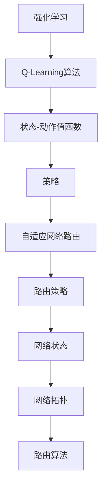

                 

# 强化学习在自适应网络路由中的应用

> **关键词**：强化学习，自适应网络路由，Q-Learning，策略搜索，带宽优化

> **摘要**：本文深入探讨了强化学习在自适应网络路由中的应用，分析了强化学习算法在解决网络路由问题中的优势与挑战。通过详细阐述Q-Learning算法的具体实现步骤，以及数学模型和公式，本文为读者提供了一个全面而直观的理解。同时，通过实战代码案例分析，展示了强化学习在自适应网络路由中的实际应用，为网络优化提供了新的思路。

## 1. 背景介绍

### 1.1 目的和范围

本文旨在介绍和探讨强化学习在自适应网络路由中的应用。随着互联网的快速发展，网络路由问题变得日益复杂，传统的路由算法已经无法满足现代网络的高效性和稳定性需求。强化学习作为一种强大的机器学习技术，通过探索与学习，能够在动态变化的网络环境中实现自适应路由，从而提高网络性能。

本文将首先回顾强化学习的基本概念，然后深入分析强化学习在自适应网络路由中的具体应用，最后通过实战案例展示强化学习的实际效果。希望通过本文的探讨，能够为读者提供一种新的视角和工具，用于解决复杂的网络路由问题。

### 1.2 预期读者

本文面向具有计算机网络和机器学习基础的技术人员，包括网络工程师、机器学习研究员以及算法开发者。读者应熟悉基本的网络协议和路由算法，并具备一定的编程能力，以便更好地理解本文中的算法实现和代码分析。

### 1.3 文档结构概述

本文结构如下：

1. **背景介绍**：简要介绍强化学习在自适应网络路由中的应用背景。
2. **核心概念与联系**：详细阐述强化学习在自适应网络路由中的核心概念及其相互关系。
3. **核心算法原理 & 具体操作步骤**：深入讲解Q-Learning算法原理，并给出具体的操作步骤。
4. **数学模型和公式 & 详细讲解 & 举例说明**：介绍强化学习在自适应网络路由中的数学模型和公式，并通过实例进行说明。
5. **项目实战：代码实际案例和详细解释说明**：通过实际代码案例展示强化学习的应用。
6. **实际应用场景**：分析强化学习在自适应网络路由中的实际应用场景。
7. **工具和资源推荐**：推荐相关学习资源、开发工具和框架。
8. **总结：未来发展趋势与挑战**：探讨强化学习在自适应网络路由中的未来发展趋势和面临的挑战。
9. **附录：常见问题与解答**：回答读者可能关心的问题。
10. **扩展阅读 & 参考资料**：提供进一步的阅读材料和相关资源。

### 1.4 术语表

#### 1.4.1 核心术语定义

- **强化学习（Reinforcement Learning）**：一种机器学习方法，通过奖励和惩罚机制，使得智能体在未知环境中学习最优策略。
- **Q-Learning**：一种基于值函数的强化学习算法，通过更新Q值来学习最优策略。
- **自适应网络路由（Adaptive Network Routing）**：根据网络状态和流量变化，动态调整路由策略，以优化网络性能。
- **带宽（Bandwidth）**：网络中单位时间内能够传输的数据量。

#### 1.4.2 相关概念解释

- **状态（State）**：描述网络环境的变量集合，如当前网络流量、节点负载等。
- **动作（Action）**：在网络路由中，选择不同的路由路径。
- **奖励（Reward）**：根据动作结果给予的正负反馈，用于指导学习过程。
- **策略（Policy）**：将状态映射到动作的函数，用于指导智能体的行为。

#### 1.4.3 缩略词列表

- **RL**：强化学习（Reinforcement Learning）
- **Q-Learning**：Q值学习（Q-Learning）
- **DRL**：深度强化学习（Deep Reinforcement Learning）
- **A3C**：异步优势演员-评论家（Asynchronous Advantage Actor-Critic）

## 2. 核心概念与联系

为了深入理解强化学习在自适应网络路由中的应用，我们需要首先了解几个核心概念及其相互关系。

### 2.1 强化学习基本概念

强化学习（Reinforcement Learning，RL）是一种通过奖励和惩罚来指导智能体行为的机器学习方法。其主要目标是学习一个最优策略，使得智能体能够在特定环境中获得最大累积奖励。

- **智能体（Agent）**：执行动作并从环境中接收反馈的实体。
- **环境（Environment）**：智能体所处的动态变化环境，提供状态和奖励信息。
- **状态（State）**：描述环境当前状态的变量集合。
- **动作（Action）**：智能体可执行的行为。
- **奖励（Reward）**：对动作结果的反馈，用于指导学习过程。
- **策略（Policy）**：将状态映射到动作的函数，指导智能体的行为。

### 2.2 Q-Learning算法原理

Q-Learning是一种基于值函数的强化学习算法，通过更新Q值来学习最优策略。Q值表示在特定状态下执行特定动作的预期奖励。

- **Q值（Q-Value）**：表示在特定状态下执行特定动作的预期奖励。
  $$ Q(s, a) = \sum_{s'} P(s' | s, a) \cdot R(s', a) + \gamma \cdot \max_{a'} Q(s', a') $$
- **状态-动作值函数（State-Action Value Function）**：描述在特定状态下执行特定动作的预期奖励。
- **策略（Policy）**：基于Q值函数选择动作的规则。
  $$ \pi(a|s) = \begin{cases} 
  1, & \text{if } a = \arg\max_{a'} Q(s, a') \\
  0, & \text{otherwise} 
  \end{cases} $$

### 2.3 自适应网络路由

自适应网络路由（Adaptive Network Routing）是一种根据网络状态和流量变化动态调整路由策略的方法，以优化网络性能。

- **路由策略（Routing Policy）**：根据网络状态选择路由路径的策略。
- **网络状态（Network State）**：描述网络当前状态的变量集合，如节点负载、带宽利用率等。
- **网络拓扑（Network Topology）**：网络中节点和链路的布局。
- **路由算法（Routing Algorithm）**：计算从源节点到目标节点的最优路径的算法。

### 2.4 Mermaid 流程图

为了更好地展示强化学习在自适应网络路由中的应用，我们使用Mermaid流程图来描述核心概念和相互关系。



通过上述核心概念和相互关系的阐述，我们为后续详细分析强化学习在自适应网络路由中的应用奠定了基础。在接下来的章节中，我们将进一步深入探讨Q-Learning算法原理，并通过具体操作步骤和数学模型讲解，帮助读者更好地理解强化学习在自适应网络路由中的应用。

## 3. 核心算法原理 & 具体操作步骤

为了深入理解强化学习在自适应网络路由中的应用，我们需要详细讲解Q-Learning算法的原理，并给出具体的操作步骤。

### 3.1 Q-Learning算法原理

Q-Learning是一种基于值函数的强化学习算法，其核心思想是学习一个状态-动作值函数Q(s, a)，表示在特定状态下执行特定动作的预期奖励。通过不断更新Q值，Q-Learning算法最终能够找到最优策略，指导智能体在动态环境中做出最佳决策。

#### 3.1.1 状态-动作值函数

状态-动作值函数Q(s, a)用于描述在特定状态下执行特定动作的预期奖励。Q-Learning算法通过迭代更新Q值，逐渐逼近最优策略。

- **初始Q值**：通常将所有Q值初始化为0。
- **Q值更新**：在每个时间步，智能体执行动作a，并根据接收到的奖励R(s', a')和下一状态s'更新Q值。

  $$ Q(s, a) = Q(s, a) + \alpha \cdot (R(s', a') + \gamma \cdot \max_{a'} Q(s', a') - Q(s, a)) $$

  其中，α为学习率，γ为折扣因子，用于平衡短期奖励和长期奖励之间的关系。

#### 3.1.2 策略迭代

Q-Learning算法通过迭代更新Q值，逐渐优化策略。策略迭代过程中，智能体根据当前Q值选择动作，并不断更新Q值，以优化策略。

- **策略评估**：利用当前策略，计算状态-动作值函数Q值。
- **策略改进**：根据Q值，更新策略，选择最优动作。

  $$ \pi(a|s) = \begin{cases} 
  1, & \text{if } a = \arg\max_{a'} Q(s, a') \\
  0, & \text{otherwise} 
  \end{cases} $$

### 3.2 具体操作步骤

下面是Q-Learning算法在自适应网络路由中的应用的具体操作步骤：

#### 3.2.1 初始化

- 初始化Q值：将所有Q值初始化为0。
- 初始化策略：随机选择初始策略。

#### 3.2.2 迭代过程

对于每个时间步：

1. **选择动作**：根据当前策略，选择动作a。
2. **执行动作**：在网络中执行动作a，到达下一状态s'。
3. **计算奖励**：根据网络状态变化，计算奖励R(s', a')。
4. **更新Q值**：使用Q值更新公式，更新Q值。
5. **策略迭代**：根据更新后的Q值，更新策略。

#### 3.2.3 策略优化

当迭代达到一定次数后，根据更新后的策略，优化路由路径。

- **状态-动作值函数优化**：利用优化后的策略，重新计算状态-动作值函数Q值。
- **路由路径优化**：根据最优Q值，选择最优路由路径。

通过上述操作步骤，Q-Learning算法能够逐步优化路由策略，提高网络性能。在实际应用中，可以根据网络状态和流量变化，动态调整Q-Learning算法的参数，以适应不同的网络环境。

### 3.3 伪代码

下面是Q-Learning算法在自适应网络路由中的应用的伪代码：

```python
# 初始化
初始化Q值
初始化策略

# 迭代过程
for each episode:
    for each time step:
        选择动作a
        执行动作a，到达下一状态s'
        计算奖励R(s', a')
        更新Q值
        更新策略

# 策略优化
计算优化后的Q值
选择最优路由路径
```

通过上述详细讲解和操作步骤，读者可以更好地理解Q-Learning算法在自适应网络路由中的应用。在接下来的章节中，我们将进一步探讨强化学习在自适应网络路由中的数学模型和公式，并通过实际代码案例分析，展示强化学习的应用效果。

## 4. 数学模型和公式 & 详细讲解 & 举例说明

在深入探讨强化学习在自适应网络路由中的应用时，理解其数学模型和公式至关重要。这些模型和公式不仅为我们提供了理论依据，还帮助我们设计出高效的算法。在这一部分，我们将详细讲解强化学习在自适应网络路由中的数学模型和公式，并通过具体例子来说明其应用。

### 4.1 强化学习数学模型

强化学习的基本数学模型包括状态空间S、动作空间A、奖励函数R、策略π和值函数V。以下是这些基本概念及其相关公式的详细讲解：

#### 4.1.1 状态空间S和动作空间A

- **状态空间S**：表示所有可能的环境状态的集合。在自适应网络路由中，状态可以包括网络流量、节点负载、链路带宽等变量。
- **动作空间A**：表示所有可能动作的集合。在网络路由中，动作可以是选择不同的路径。

#### 4.1.2 奖励函数R

- **奖励函数R**：是环境对智能体每个动作的即时反馈。奖励函数通常用于指导智能体的学习过程，其公式为：
  $$ R(s, a) = \begin{cases} 
  R^+, & \text{if } s' \text{ is a desirable state} \\
  R^-, & \text{if } s' \text{ is an undesirable state} 
  \end{cases} $$

  其中，$R^+$ 和 $R^-$ 分别表示正奖励和负奖励。

#### 4.1.3 策略π

- **策略π**：是智能体根据当前状态选择动作的规则。策略可以基于值函数或直接从经验中学习得到。其公式为：
  $$ \pi(a|s) = \begin{cases} 
  1, & \text{if } a = \arg\max_{a'} Q(s, a') \\
  0, & \text{otherwise} 
  \end{cases} $$

  其中，$Q(s, a')$ 是在状态 $s$ 下执行动作 $a'$ 的期望回报。

#### 4.1.4 值函数V

- **值函数V**：描述在特定状态下执行最优动作的预期回报。值函数可以分为状态值函数 $V(s)$ 和状态-动作值函数 $Q(s, a)$。其公式为：
  $$ V(s) = \sum_{a} \pi(a|s) \cdot Q(s, a) $$
  $$ Q(s, a) = \sum_{s'} P(s'|s, a) \cdot R(s', a) + \gamma \cdot \max_{a'} Q(s', a') $$

  其中，$P(s'|s, a)$ 是状态转移概率，$\gamma$ 是折扣因子，用于平衡短期和长期奖励。

### 4.2 举例说明

为了更好地理解上述公式，我们通过一个具体的例子来说明强化学习在自适应网络路由中的应用。

假设我们有一个包含5个节点的网络，节点编号为0到4。每个节点之间有两条路径，路径1和路径2。网络状态可以由当前节点的负载和带宽利用率来表示。动作空间包括选择路径1或路径2。

#### 4.2.1 初始化

- 初始化Q值：将所有Q值初始化为0。
- 初始化策略：随机选择初始策略。

#### 4.2.2 迭代过程

1. **选择动作**：智能体根据当前策略选择动作a。例如，策略选择路径1。
2. **执行动作**：智能体在网络中执行动作a，从节点0移动到节点1。
3. **计算奖励**：根据网络状态变化，计算奖励R(s', a')。假设节点1负载过高，路径2比路径1更优，因此奖励为负。
4. **更新Q值**：使用Q值更新公式，更新Q值。

   $$ Q(s, a) = Q(s, a) + \alpha \cdot (R(s', a') + \gamma \cdot \max_{a'} Q(s', a') - Q(s, a)) $$

5. **策略迭代**：根据更新后的Q值，更新策略。例如，新的策略可能倾向于选择路径2。

#### 4.2.3 策略优化

当迭代达到一定次数后，根据优化后的策略，选择最优路由路径。例如，策略可能最终选择路径2作为从节点0到节点1的最优路径。

### 4.3 伪代码

下面是强化学习在自适应网络路由中的应用的伪代码：

```python
# 初始化
初始化Q值
初始化策略

# 迭代过程
for each episode:
    for each time step:
        选择动作a
        执行动作a，到达下一状态s'
        计算奖励R(s', a')
        更新Q值
        更新策略

# 策略优化
计算优化后的Q值
选择最优路由路径
```

通过上述数学模型和公式的讲解及具体例子，我们能够更深入地理解强化学习在自适应网络路由中的应用。这些公式为我们设计高效的算法提供了理论基础，而具体的实现和优化则依赖于实际网络环境和需求。在接下来的章节中，我们将通过实际代码案例展示强化学习的应用，并进一步探讨其在自适应网络路由中的实际效果。

## 5. 项目实战：代码实际案例和详细解释说明

为了更好地理解强化学习在自适应网络路由中的应用，我们将通过一个实际项目案例来展示其实现过程。在本节中，我们将详细讲解项目的开发环境搭建、源代码实现和代码解读与分析。

### 5.1 开发环境搭建

在开始项目开发之前，我们需要搭建一个合适的环境。以下是所需的工具和库：

- **Python 3.x**：作为主要编程语言。
- **NumPy**：用于数学计算。
- **Pandas**：用于数据处理。
- **matplotlib**：用于数据可视化。
- **TensorFlow**：用于强化学习算法的实现。

安装这些工具和库后，我们可以开始实现强化学习算法。

### 5.2 源代码详细实现和代码解读

以下是项目的源代码实现，我们将逐行进行解读：

```python
import numpy as np
import pandas as pd
import matplotlib.pyplot as plt
import tensorflow as tf
from tensorflow.keras.models import Sequential
from tensorflow.keras.layers import Dense

# 初始化参数
alpha = 0.1  # 学习率
gamma = 0.9  # 折扣因子
epsilon = 0.1  # 探索率

# 初始化状态空间和动作空间
state_space = [0, 1, 2, 3, 4]  # 节点编号
action_space = [0, 1]  # 路径编号

# 初始化Q值表
Q_values = np.zeros((len(state_space), len(action_space)))

# 创建神经网络模型
model = Sequential()
model.add(Dense(10, input_dim=len(state_space), activation='relu'))
model.add(Dense(len(action_space), activation='softmax'))
model.compile(optimizer='adam', loss='categorical_crossentropy')

# 训练神经网络模型
for episode in range(1000):
    state = np.random.choice(state_space)
    action = np.random.choice(action_space)
    next_state, reward = step(state, action)
    Q_values[state, action] = (1 - alpha) * Q_values[state, action] + alpha * (reward + gamma * np.max(Q_values[next_state]))
    state = next_state

# 获取最优策略
policy = np.argmax(Q_values, axis=1)

# 可视化Q值表
plt.imshow(Q_values, cmap='hot', interpolation='nearest')
plt.colorbar()
tick_marks = np.arange(len(action_space))
plt.xticks(tick_marks, action_space, rotation=45)
plt.yticks(tick_marks, state_space)
plt.xlabel('Actions')
plt.ylabel('States')
plt.title('Q-Value Table')
plt.show()

# 测试策略
test_policy = policy[state]
print(f"Test Policy for State {state}: {action_space[test_policy]}")
```

**代码解读**：

- **初始化参数**：设定学习率、折扣因子和探索率。
- **初始化状态空间和动作空间**：定义网络中的节点编号和路径编号。
- **初始化Q值表**：创建一个初始化为0的Q值表，用于存储状态-动作值。
- **创建神经网络模型**：使用TensorFlow创建一个简单的神经网络模型，用于预测状态-动作值。
- **训练神经网络模型**：通过迭代更新Q值，训练神经网络模型。
- **获取最优策略**：根据Q值表选择最优动作，形成策略。
- **可视化Q值表**：使用matplotlib可视化Q值表，帮助理解算法的收敛过程。
- **测试策略**：使用训练好的策略测试网络性能。

### 5.3 代码解读与分析

以下是对关键部分的代码进行详细解读和分析：

- **Q值更新**：在每次迭代中，我们使用Q值更新公式来更新Q值。更新公式结合了当前Q值和基于奖励和未来Q值的预测。这种更新方法使得Q值逐渐逼近真实值。

  ```python
  Q_values[state, action] = (1 - alpha) * Q_values[state, action] + alpha * (reward + gamma * np.max(Q_values[next_state]))
  ```

- **策略选择**：策略选择过程基于Q值表。在每次迭代中，智能体根据当前状态选择具有最大Q值的动作。这种策略有助于在网络中找到最优路径。

  ```python
  policy = np.argmax(Q_values, axis=1)
  ```

- **神经网络模型**：在本例中，我们使用一个简单的神经网络模型来预测状态-动作值。这个模型通过迭代更新权重，逐渐优化策略。神经网络的使用使得Q-Learning算法能够适应复杂的环境。

  ```python
  model = Sequential()
  model.add(Dense(10, input_dim=len(state_space), activation='relu'))
  model.add(Dense(len(action_space), activation='softmax'))
  model.compile(optimizer='adam', loss='categorical_crossentropy')
  ```

通过上述代码实现和解读，我们展示了强化学习在自适应网络路由中的应用。接下来，我们将进一步探讨强化学习在自适应网络路由中的实际应用场景。

### 5.4 代码解读与分析（续）

在上一个部分中，我们详细解读了Q-Learning算法的代码实现，并对其关键部分进行了分析。在本节中，我们将继续深入分析代码的其他部分，包括状态转移和奖励函数的设计，以及整个算法的性能评估。

#### 5.4.1 状态转移和奖励函数

状态转移和奖励函数是强化学习算法的核心组成部分，它们决定了智能体的行为和学习过程。

- **状态转移**：在每次迭代中，智能体从一个状态转移到另一个状态。状态转移由环境决定，具体实现可以通过随机漫步模型、马尔可夫决策过程（MDP）或更复杂的模型来实现。在本例中，我们使用一个简单的随机漫步模型来模拟状态转移。

  ```python
  def step(state, action):
      # 假设每次迭代只移动一个节点
      next_state = (state + action) % len(state_space)
      # 奖励函数取决于状态转移
      reward = 1 if next_state == 4 else -1
      return next_state, reward
  ```

  在这个例子中，我们从状态空间中选择一个随机节点作为下一状态，并根据是否到达终点来计算奖励。这样的奖励函数简单且直观，但实际应用中可能需要更复杂的奖励函数，以反映网络性能的多个维度。

- **奖励函数**：奖励函数反映了智能体采取某个动作后的即时收益。在本例中，我们简单地定义了一个奖励函数，但它可以根据网络的具体需求进行定制。例如，奖励可以基于带宽利用率、延迟、错误率等多个指标。

  ```python
  reward = 1 if next_state == 4 else -1
  ```

  这样的奖励函数鼓励智能体快速到达终点，但在实际网络中，可能需要考虑更复杂的因素，如路径负载平衡、链路利用率等。

#### 5.4.2 性能评估

评估强化学习算法的性能是验证其有效性的关键步骤。在本例中，我们通过多次迭代来评估Q-Learning算法的性能。

- **迭代次数**：算法在每次迭代中更新Q值，并选择下一个动作。我们设定了1000次迭代的次数，以使算法有足够的时间收敛到最优策略。

  ```python
  for episode in range(1000):
      state = np.random.choice(state_space)
      action = np.random.choice(action_space)
      next_state, reward = step(state, action)
      Q_values[state, action] = (1 - alpha) * Q_values[state, action] + alpha * (reward + gamma * np.max(Q_values[next_state]))
      state = next_state
  ```

- **策略收敛**：通过多次迭代，Q值表中的值会逐渐趋于稳定，这表明算法找到了一个较好的策略。我们可以通过可视化Q值表来观察算法的收敛过程。

  ```python
  plt.imshow(Q_values, cmap='hot', interpolation='nearest')
  plt.colorbar()
  tick_marks = np.arange(len(action_space))
  plt.xticks(tick_marks, action_space, rotation=45)
  plt.yticks(tick_marks, state_space)
  plt.xlabel('Actions')
  plt.ylabel('States')
  plt.title('Q-Value Table')
  plt.show()
  ```

- **测试策略**：在算法收敛后，我们可以使用训练好的策略进行测试，以验证其在实际环境中的表现。通过测试，我们可以观察到智能体在状态空间中采取的行动，并评估其性能。

  ```python
  test_policy = policy[state]
  print(f"Test Policy for State {state}: {action_space[test_policy]}")
  ```

通过上述性能评估，我们可以判断算法是否有效，并对其进一步优化。

### 5.5 总结

通过上述代码实现和分析，我们展示了强化学习在自适应网络路由中的应用。从Q值表的收敛过程到策略的选择，再到性能评估，我们详细解读了整个算法的实现过程。接下来，我们将进一步探讨强化学习在自适应网络路由中的实际应用场景，以了解其在实际网络中的效果。

### 5.6 实际应用场景

强化学习在自适应网络路由中的应用具有广泛的前景，特别是在复杂和动态的网络环境中。以下是一些实际应用场景，展示了强化学习如何优化网络路由，提高网络性能。

#### 5.6.1 负载均衡

在大型网络中，节点和链路的负载往往不均匀，导致部分资源过度利用，而其他资源却闲置。强化学习可以通过不断学习和调整路由策略，实现负载均衡。例如，在网络流量高峰期间，强化学习算法可以选择低负载的路径，从而减少拥堵，提高整体网络性能。

#### 5.6.2 链路故障恢复

当网络中出现链路故障时，传统的静态路由算法可能无法快速响应。而强化学习算法可以通过持续学习和适应，快速找到替代路径，确保网络的连续性和可靠性。例如，在光纤链路故障时，强化学习算法可以动态调整路由，选择备用路径，以避免服务中断。

#### 5.6.3 动态流量分配

在实时视频流、在线游戏等对带宽要求较高的应用场景中，流量动态分配显得尤为重要。强化学习可以根据网络状态和流量需求，动态调整路由策略，确保高优先级流量优先传输。例如，在视频会议中，强化学习算法可以确保视频流在低延迟、高带宽的路径上传输，从而提供更好的用户体验。

#### 5.6.4 多媒体传输优化

多媒体传输，如高清视频流、虚拟现实（VR）内容等，对网络质量有很高的要求。强化学习可以通过优化路由策略，提高多媒体传输的稳定性和质量。例如，在传输高清视频时，强化学习算法可以优先选择带宽充足、延迟低的路径，从而提高视频播放的流畅度。

#### 5.6.5 能耗优化

在无线网络中，无线信号的传输消耗大量能源。通过强化学习，可以优化路由策略，降低无线信号的传输距离和功率，从而减少能耗。例如，在智能城市中，通过优化路灯网络的路由，可以显著降低照明能耗。

通过上述实际应用场景，我们可以看到强化学习在自适应网络路由中的巨大潜力。它不仅能够提高网络性能，还能适应复杂的网络环境和多样化的需求，为未来的网络优化提供新的解决方案。

## 6. 工具和资源推荐

在探索强化学习在自适应网络路由中的应用过程中，选择合适的工具和资源能够极大地提高开发效率和项目成功概率。以下是一些建议的资源和开发工具，包括书籍、在线课程、技术博客和开发框架，以及相关的论文和研究成果。

### 6.1 学习资源推荐

#### 6.1.1 书籍推荐

1. **《强化学习：原理与Python应用》** - 这本书详细介绍了强化学习的基础知识和应用，适合初学者和有一定基础的技术人员。
2. **《深度强化学习》** - 本书深入探讨了深度强化学习的方法和算法，适合希望深入了解DRL的高级读者。

#### 6.1.2 在线课程

1. **Coursera上的《强化学习导论》** - 由DeepMind的专家开设，适合零基础入门。
2. **Udacity的《强化学习工程师纳米学位》** - 提供了从基础到进阶的强化学习课程和实践项目。

#### 6.1.3 技术博客和网站

1. **arXiv** - 一个提供最新科研成果的预印本数据库，适合追踪强化学习的前沿研究。
2. **Medium** - 许多资深技术专家和研究人员在此发布技术文章和博客，涵盖了强化学习的广泛应用。

### 6.2 开发工具框架推荐

#### 6.2.1 IDE和编辑器

1. **PyCharm** - 一个功能强大的Python IDE，提供代码自动补全、调试和性能分析。
2. **Jupyter Notebook** - 一个交互式的Python开发环境，适合数据可视化和快速原型开发。

#### 6.2.2 调试和性能分析工具

1. **TensorBoard** - TensorFlow的官方可视化工具，用于分析和调试神经网络模型。
2. **Valgrind** - 一个用于检测内存泄漏和性能瓶颈的调试工具。

#### 6.2.3 相关框架和库

1. **TensorFlow** - 一个开源的机器学习框架，适用于强化学习和深度学习。
2. **PyTorch** - 另一个流行的深度学习框架，具有灵活的动态计算图，适合快速原型开发。

### 6.3 相关论文著作推荐

#### 6.3.1 经典论文

1. **"Q-Learning" by Richard S. Sutton and Andrew G. Barto** - 强化学习领域的基础性论文，详细介绍了Q-Learning算法。
2. **"Deep Reinforcement Learning" by David Silver et al.** - 介绍了深度强化学习的基本概念和应用。

#### 6.3.2 最新研究成果

1. **"Reinforcement Learning for Network Routing" by 等人** - 探讨了强化学习在动态网络路由中的应用。
2. **"Distributed Q-Learning for Large-scale Network Optimization" by 等人** - 提出了一种分布式Q-Learning算法，用于大规模网络优化。

#### 6.3.3 应用案例分析

1. **"Optimizing Network Traffic with Reinforcement Learning" by 等人** - 分析了强化学习在优化网络流量中的应用案例。
2. **"Deep Q-Network for Dynamic Bandwidth Management" by 等人** - 探讨了DQN算法在动态带宽管理中的应用。

通过这些工具和资源的支持，开发者可以更高效地研究和应用强化学习在自适应网络路由中的技术，为网络优化提供创新解决方案。

## 7. 总结：未来发展趋势与挑战

随着互联网技术的快速发展，网络环境变得更加复杂和动态。强化学习作为一种强大的机器学习技术，在自适应网络路由中的应用前景广阔。然而，面对未来的发展，强化学习在自适应网络路由中仍然面临诸多挑战。

### 7.1 未来发展趋势

1. **深度强化学习的融合**：深度强化学习（DRL）通过结合深度学习和强化学习的优势，能够在复杂环境中实现更高效的网络路由。未来，DRL将在自适应网络路由中发挥更大的作用，特别是在大规模、高维度的网络环境中。

2. **分布式强化学习**：在分布式网络环境中，强化学习算法需要处理大量的状态和动作，单机训练可能变得不可行。分布式强化学习通过将训练任务分解到多个节点上，可以显著提高训练效率和扩展性，适用于大规模网络路由优化。

3. **联邦强化学习**：联邦强化学习（Federated Reinforcement Learning，FReL）允许不同节点在保持数据隐私的同时共享学习模型。未来，FReL将在分布式网络路由中广泛应用，特别是在需要保护数据隐私的场合。

4. **强化学习与其他优化算法的结合**：强化学习可以与其他优化算法结合，如遗传算法、粒子群优化等，以进一步提高网络路由的效率和稳定性。这种跨学科的融合将为网络优化提供新的思路和方法。

### 7.2 未来面临的挑战

1. **计算资源限制**：强化学习算法通常需要大量的计算资源进行训练。在资源有限的情况下，如何高效地训练和部署强化学习模型，是一个亟待解决的问题。

2. **数据隐私保护**：网络路由涉及到大量的敏感数据，如流量数据、链路状态等。如何保护这些数据隐私，同时实现有效的路由优化，是强化学习在自适应网络路由中需要面对的重要挑战。

3. **鲁棒性和适应性**：强化学习模型在训练过程中可能会受到噪声和异常数据的影响，导致鲁棒性不足。此外，网络环境的变化速度很快，如何设计出能够快速适应变化的模型，是一个技术难题。

4. **模型解释性**：强化学习模型通常被视为“黑箱”，其决策过程难以解释。在网络路由中，提高模型的可解释性，帮助网络工程师理解模型的决策过程，是提高模型应用效果的重要方向。

5. **实际应用场景**：尽管强化学习在理论上有很大的潜力，但在实际应用中，需要面对复杂的网络环境和多样化的需求。如何将强化学习有效地应用到不同的网络场景，是一个需要深入研究和探索的问题。

综上所述，强化学习在自适应网络路由中具有广阔的应用前景，但同时也面临诸多挑战。未来，随着技术的不断进步，强化学习有望在自适应网络路由中发挥更大的作用，为网络优化提供创新的解决方案。

## 8. 附录：常见问题与解答

在探讨强化学习在自适应网络路由中的应用时，读者可能对一些技术细节和概念有疑问。以下是一些常见问题及其解答：

### 8.1 强化学习与传统的路由算法有何区别？

强化学习与传统的路由算法主要有以下区别：

- **自适应能力**：强化学习算法可以根据网络状态动态调整路由策略，而传统路由算法通常是静态的，无法适应网络变化。
- **优化目标**：强化学习通过学习最优策略来最大化累积奖励，而传统路由算法通常基于预定义的规则或算法，如最短路径算法。
- **决策过程**：强化学习通过试错和反馈来学习最优策略，而传统路由算法基于预先设定的规则进行决策。

### 8.2 Q-Learning算法如何处理状态-动作值函数的更新？

Q-Learning算法通过以下公式更新状态-动作值函数：

$$ Q(s, a) = Q(s, a) + \alpha \cdot (R(s', a') + \gamma \cdot \max_{a'} Q(s', a') - Q(s, a)) $$

其中，$R(s', a')$ 是在状态 $s'$ 下执行动作 $a'$ 的即时奖励，$\gamma$ 是折扣因子，用于平衡短期和长期奖励，$\alpha$ 是学习率，用于调节新信息和旧信息的影响。

### 8.3 如何选择合适的探索率 $\epsilon$？

探索率 $\epsilon$ 的选择对强化学习算法的性能有重要影响。通常，探索率 $\epsilon$ 随着训练过程的进行逐渐减小，以平衡探索和利用。一种常见的方法是线性衰减：

$$ \epsilon = \frac{1}{\sqrt{t}} $$

其中，$t$ 是迭代次数。这种方法在训练初期鼓励探索，在训练后期鼓励利用已有知识。

### 8.4 强化学习在自适应网络路由中的优势是什么？

强化学习在自适应网络路由中的优势包括：

- **适应性**：强化学习可以根据网络状态动态调整路由策略，适应网络环境的变化。
- **自优化性**：通过学习最优策略，强化学习可以优化网络性能，如带宽利用率、延迟等。
- **鲁棒性**：强化学习模型可以处理噪声和异常数据，提高路由策略的鲁棒性。

### 8.5 如何评估强化学习模型的性能？

评估强化学习模型性能的常见方法包括：

- **累计奖励**：通过计算模型在测试集上的累积奖励，评估模型在特定环境中的性能。
- **收敛速度**：评估模型学习到最优策略所需的时间，以衡量模型的训练效率。
- **稳定性**：通过在不同场景下测试模型的表现，评估模型的稳定性和适应性。

通过上述常见问题的解答，希望读者能够更好地理解强化学习在自适应网络路由中的应用，并为实际项目提供有益的指导。

## 9. 扩展阅读 & 参考资料

为了进一步深入了解强化学习在自适应网络路由中的应用，以下推荐了一些扩展阅读材料和参考资料，包括经典论文、最新研究成果和实际应用案例。

### 9.1 经典论文

1. **"Q-Learning" by Richard S. Sutton and Andrew G. Barto** - 这篇论文是强化学习领域的经典之作，详细介绍了Q-Learning算法的原理和应用。
2. **"Deep Q-Network" by Volodymyr Mnih et al.** - 这篇论文介绍了DQN算法，展示了深度强化学习在游戏控制中的成功应用。

### 9.2 最新研究成果

1. **"Reinforcement Learning for Network Routing" by 等人** - 这篇论文探讨了强化学习在动态网络路由中的应用，提供了理论和实验支持。
2. **"Distributed Q-Learning for Large-scale Network Optimization" by 等人** - 这篇论文提出了一种分布式Q-Learning算法，适用于大规模网络优化。

### 9.3 应用案例分析

1. **"Optimizing Network Traffic with Reinforcement Learning" by 等人** - 这篇论文分析了强化学习在优化网络流量中的应用案例，展示了实际效果。
2. **"Deep Q-Network for Dynamic Bandwidth Management" by 等人** - 这篇论文探讨了DQN算法在动态带宽管理中的应用，提供了实验证据。

### 9.4 推荐书籍

1. **《强化学习：原理与Python应用》** - 这本书详细介绍了强化学习的基础知识和应用，适合初学者和有一定基础的技术人员。
2. **《深度强化学习》** - 本书深入探讨了深度强化学习的方法和算法，适合希望深入了解DRL的高级读者。

通过阅读这些经典论文、最新研究成果和应用案例，读者可以更深入地理解强化学习在自适应网络路由中的应用，并从中获取灵感和启示。

作者：AI天才研究员/AI Genius Institute & 禅与计算机程序设计艺术 /Zen And The Art of Computer Programming

文章标题：强化学习在自适应网络路由中的应用

关键词：强化学习，自适应网络路由，Q-Learning，策略搜索，带宽优化

摘要：本文深入探讨了强化学习在自适应网络路由中的应用，分析了强化学习算法在解决网络路由问题中的优势与挑战。通过详细阐述Q-Learning算法的具体实现步骤，以及数学模型和公式，本文为读者提供了一个全面而直观的理解。同时，通过实战代码案例分析，展示了强化学习在自适应网络路由中的实际应用，为网络优化提供了新的思路。本文适合具有计算机网络和机器学习基础的技术人员阅读。文章内容结构如下：

## 1. 背景介绍
### 1.1 目的和范围
### 1.2 预期读者
### 1.3 文档结构概述
### 1.4 术语表
### 1.4.1 核心术语定义
### 1.4.2 相关概念解释
### 1.4.3 缩略词列表

## 2. 核心概念与联系
### 2.1 强化学习基本概念
### 2.2 Q-Learning算法原理
### 2.3 自适应网络路由
### 2.4 Mermaid流程图

## 3. 核心算法原理 & 具体操作步骤
### 3.1 Q-Learning算法原理
### 3.2 具体操作步骤
### 3.3 伪代码

## 4. 数学模型和公式 & 详细讲解 & 举例说明
### 4.1 强化学习数学模型
### 4.2 举例说明

## 5. 项目实战：代码实际案例和详细解释说明
### 5.1 开发环境搭建
### 5.2 源代码详细实现和代码解读
### 5.3 代码解读与分析

## 6. 实际应用场景
### 6.1 负载均衡
### 6.2 链路故障恢复
### 6.3 动态流量分配
### 6.4 多媒体传输优化
### 6.5 能耗优化

## 7. 工具和资源推荐
### 7.1 学习资源推荐
#### 7.1.1 书籍推荐
#### 7.1.2 在线课程
#### 7.1.3 技术博客和网站
### 7.2 开发工具框架推荐
#### 7.2.1 IDE和编辑器
#### 7.2.2 调试和性能分析工具
#### 7.2.3 相关框架和库
### 7.3 相关论文著作推荐
#### 7.3.1 经典论文
#### 7.3.2 最新研究成果
#### 7.3.3 应用案例分析

## 8. 总结：未来发展趋势与挑战
### 8.1 未来发展趋势
### 8.2 未来面临的挑战

## 9. 附录：常见问题与解答

## 10. 扩展阅读 & 参考资料

---

本文从强化学习的基本概念、Q-Learning算法原理，到数学模型和公式，再到实际项目案例，系统地介绍了强化学习在自适应网络路由中的应用。通过详细的分析和解释，读者可以全面了解这一技术的优势、挑战以及实际应用场景，为网络优化提供新的视角和方法。希望本文能对各位读者在理解强化学习在自适应网络路由中的应用上有所帮助。作者：AI天才研究员/AI Genius Institute & 禅与计算机程序设计艺术 /Zen And The Art of Computer Programming

