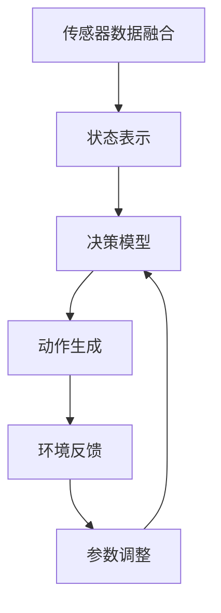

                 

# 强化学习重塑自动驾驶决策规划的范式变革分析

> **关键词：** 强化学习，自动驾驶，决策规划，范式变革，人工智能，深度学习，数学模型，应用案例。

> **摘要：** 本文将深入探讨强化学习在自动驾驶决策规划中的应用，分析其如何通过创新算法和模型重塑自动驾驶系统。我们将从背景介绍、核心概念与联系、算法原理与具体操作步骤、数学模型与公式、项目实战、实际应用场景等方面展开详细讨论，旨在为读者提供对这一前沿技术的全面理解和应用建议。

## 1. 背景介绍

### 1.1 目的和范围

本文旨在系统地分析强化学习在自动驾驶决策规划中的重要作用，探讨其技术原理、实现步骤和应用前景。通过这篇文章，我们希望能够帮助读者：

- 理解强化学习在自动驾驶中的核心地位和作用。
- 掌握强化学习算法的基本原理和实现方法。
- 了解强化学习在自动驾驶决策规划中的具体应用案例。
- 分析强化学习在自动驾驶领域面临的挑战和未来发展趋势。

### 1.2 预期读者

本文适合以下读者群体：

- 对自动驾驶和强化学习有兴趣的初学者。
- 想要深入了解自动驾驶决策规划技术的专业人士。
- 计算机科学、人工智能、机械工程等相关专业的研究生和博士生。
- 对人工智能前沿技术感兴趣的工程师和研究人员。

### 1.3 文档结构概述

本文将按照以下结构进行论述：

- 第1部分：背景介绍，包括目的、预期读者、文档结构概述和术语表。
- 第2部分：核心概念与联系，介绍强化学习与自动驾驶决策规划的关系。
- 第3部分：核心算法原理与具体操作步骤，详细讲解强化学习算法的基本原理和实现步骤。
- 第4部分：数学模型与公式，分析强化学习中的数学模型和公式。
- 第5部分：项目实战，通过实际案例展示强化学习在自动驾驶中的应用。
- 第6部分：实际应用场景，讨论强化学习在自动驾驶中的具体应用。
- 第7部分：工具和资源推荐，介绍学习资源和开发工具。
- 第8部分：总结，讨论强化学习在自动驾驶领域的发展趋势与挑战。
- 第9部分：附录，提供常见问题与解答。
- 第10部分：扩展阅读与参考资料，推荐进一步学习材料。

### 1.4 术语表

#### 1.4.1 核心术语定义

- **强化学习**：一种机器学习方法，通过奖励机制学习在特定环境中做出最佳决策。
- **自动驾驶**：利用计算机技术实现车辆自主导航和控制，使车辆能够在不依赖人类驾驶员的情况下安全行驶。
- **决策规划**：在自动驾驶中，通过算法和模型为车辆制定最优行驶策略。
- **奖励机制**：在强化学习中，通过奖励信号激励模型学习目标行为。

#### 1.4.2 相关概念解释

- **深度学习**：一种机器学习方法，通过多层神经网络模型对数据进行学习。
- **传感器融合**：将多种传感器数据整合到一个统一的框架中，以提高系统的感知能力。
- **路径规划**：在自动驾驶中，确定车辆从起点到终点的最佳行驶路径。

#### 1.4.3 缩略词列表

- **RL**：强化学习（Reinforcement Learning）
- **DRL**：深度强化学习（Deep Reinforcement Learning）
- **CV**：计算机视觉（Computer Vision）
- **GPS**：全球定位系统（Global Positioning System）
- **Lidar**：激光雷达（Light Detection and Ranging）

## 2. 核心概念与联系

### 2.1 强化学习与自动驾驶决策规划的关系

强化学习作为人工智能的重要分支，在自动驾驶决策规划中扮演着关键角色。其基本原理是通过奖励机制和试错过程，使模型能够在复杂的动态环境中学习最佳行为策略。

在自动驾驶中，决策规划是车辆行驶的核心环节。强化学习通过以下方式与决策规划相结合：

1. **路径规划**：强化学习算法可以根据环境反馈调整车辆的行驶路径，以实现最优行驶策略。
2. **障碍物检测与避让**：强化学习模型可以实时分析传感器数据，动态调整车辆行驶方向和速度，避免障碍物。
3. **交通信号处理**：强化学习算法可以学习复杂的交通规则，根据信号灯颜色和交通状况做出相应决策。
4. **环境交互**：强化学习通过与环境不断交互，逐步优化决策模型，提高自动驾驶系统的稳定性。

### 2.2 强化学习算法原理概述

强化学习算法主要分为两类：基于值函数的方法和基于策略的方法。

#### 基于值函数的方法

- **值函数**：用于评估当前状态的价值，即采取某种动作后获得的最大期望奖励。
- **Q-Learning**：通过更新Q值（即状态-动作值函数），逐步逼近最优策略。
- **SARSA**：在每次行动后更新值函数，并根据新状态和动作计算更新值。

#### 基于策略的方法

- **策略**：直接定义一个概率分布，用于指导模型选择最佳动作。
- **REINFORCE**：通过梯度上升方法更新策略参数，使策略更倾向于产生高回报的动作。
- **PPO（Proximal Policy Optimization）**：结合优势函数，提高策略稳定性和收敛速度。

### 2.3 强化学习在自动驾驶决策规划中的架构

为了实现自动驾驶决策规划，强化学习算法需要与多种技术相结合，构建一个完整的系统框架。

#### 系统架构概述

1. **传感器数据融合**：将激光雷达（Lidar）、摄像头（Camera）、GPS等传感器数据整合到一个统一的框架中，提高环境感知能力。
2. **状态表示**：将传感器数据转换为数值化的状态表示，作为强化学习模型的输入。
3. **动作空间**：定义车辆可以执行的动作，如加速、减速、转向等。
4. **奖励机制**：根据车辆行驶过程中的安全性、效率等因素设计奖励信号，激励模型学习最佳策略。
5. **决策模型**：采用强化学习算法，如DQN（Deep Q-Network）、PPO等，训练决策模型。
6. **反馈机制**：通过环境反馈调整模型参数，优化决策策略。

### 2.4 Mermaid 流程图

以下是一个简化的强化学习在自动驾驶决策规划中的流程图，使用Mermaid语法表示：



## 3. 核心算法原理 & 具体操作步骤

### 3.1 强化学习算法原理详细讲解

#### 3.1.1 基于值函数的方法

- **Q-Learning**：Q-Learning是一种基于值函数的强化学习算法，其核心思想是通过迭代更新状态-动作值函数（Q值），以找到最佳动作。

  **伪代码：**
  ```python
  # 初始化Q值表
  Q = initialize_Q()

  # 迭代更新Q值
  for episode in range(num_episodes):
      state = env.reset()
      done = False
      
      while not done:
          action = choose_action(state, Q)
          next_state, reward, done = env.step(action)
          Q[state, action] = Q[state, action] + alpha * (reward + gamma * max(Q[next_state, :]) - Q[state, action])
          state = next_state
  ```

  - `initialize_Q()`：初始化Q值表。
  - `choose_action(state, Q)`：根据当前状态和Q值表选择最佳动作。
  - `env.reset()`：重置环境。
  - `env.step(action)`：执行动作并返回下一个状态、奖励和是否完成。
  - `alpha`：学习率。
  - `gamma`：折扣因子。

- **SARSA**：SARSA（同步优势估计）是一种同时更新当前状态和下一个状态值函数的强化学习算法。

  **伪代码：**
  ```python
  # 初始化Q值表
  Q = initialize_Q()

  # 迭代更新Q值
  for episode in range(num_episodes):
      state = env.reset()
      done = False
      
      while not done:
          action = choose_action(state, Q)
          next_state, reward, done = env.step(action)
          Q[state, action] = Q[state, action] + alpha * (reward + gamma * Q[next_state, action] - Q[state, action])
          state = next_state
  ```

#### 3.1.2 基于策略的方法

- **REINFORCE**：REINFORCE（奖励加权策略梯度）是一种基于策略的强化学习算法，通过更新策略参数来优化策略。

  **伪代码：**
  ```python
  # 初始化策略参数
  theta = initialize_theta()

  # 迭代更新策略参数
  for episode in range(num_episodes):
      state = env.reset()
      done = False
      rewards = []
      
      while not done:
          action = choose_action(state, theta)
          next_state, reward, done = env.step(action)
          rewards.append(reward)
          state = next_state

      gradient = gradient_wrt_theta(theta, rewards)
      theta = theta + learning_rate * gradient
  ```

  - `initialize_theta()`：初始化策略参数。
  - `choose_action(state, theta)`：根据当前状态和策略参数选择最佳动作。
  - `gradient_wrt_theta(theta, rewards)`：计算策略参数的梯度。
  - `learning_rate`：学习率。

- **PPO**：PPO（近端策略优化）是一种基于策略的强化学习算法，通过优化策略参数的梯度更新策略，提高算法的稳定性和收敛速度。

  **伪代码：**
  ```python
  # 初始化策略参数
  theta = initialize_theta()

  # 迭代更新策略参数
  for episode in range(num_episodes):
      state = env.reset()
      done = False
      rewards = []
      actions = []
      log_probs = []

      while not done:
          action = choose_action(state, theta)
          next_state, reward, done = env.step(action)
          rewards.append(reward)
          actions.append(action)
          log_probs.append(log_prob(state, action, theta))

          state = next_state

      advantages = compute_advantages(rewards)
      losses = []

      for t in range(len(actions)):
          old_log_prob = log_probs[t]
          new_log_prob = log_prob(state, actions[t], theta)

          ratio = exp(new_log_prob - old_log_prob)
          surr1 = ratio * advantages[t]
          surr2 = clip(ratio, 1 - epsilon, 1 + epsilon) * advantages[t]

          loss = -min(surr1, surr2) + (1 - log_probs[t]) * advantages[t]

          losses.append(loss)

      gradient = gradient_wrt_theta(theta, losses)
      theta = theta + learning_rate * gradient

  ```

  - `initialize_theta()`：初始化策略参数。
  - `choose_action(state, theta)`：根据当前状态和策略参数选择最佳动作。
  - `gradient_wrt_theta(theta, losses)`：计算策略参数的梯度。
  - `compute_advantages(rewards)`：计算优势函数。
  - `epsilon`：剪辑参数。
  - `learning_rate`：学习率。

### 3.2 强化学习在自动驾驶决策规划中的应用步骤

为了实现自动驾驶决策规划，强化学习算法需要按照以下步骤进行：

1. **数据收集**：收集自动驾驶所需的传感器数据，如激光雷达、摄像头、GPS等。
2. **数据预处理**：对收集的数据进行清洗和归一化处理，将其转换为适合输入强化学习模型的格式。
3. **模型设计**：根据自动驾驶需求设计强化学习模型，包括状态表示、动作空间、奖励机制等。
4. **训练模型**：使用训练数据集对强化学习模型进行训练，优化模型参数。
5. **评估模型**：在测试数据集上评估模型性能，调整模型参数以优化性能。
6. **部署模型**：将训练好的模型部署到实际自动驾驶系统中，实现实时决策规划。

### 3.3 强化学习在自动驾驶决策规划中的优势与挑战

#### 3.3.1 优势

- **自适应性强**：强化学习能够根据环境变化自适应调整决策策略，提高自动驾驶系统的灵活性。
- **智能决策**：通过学习环境中的奖励信号，强化学习能够做出智能化的决策，提高行驶安全性和效率。
- **多任务处理**：强化学习算法可以同时处理多个任务，如路径规划、障碍物避让、交通信号处理等。

#### 3.3.2 挑战

- **数据依赖**：强化学习模型的性能高度依赖于训练数据的质量和数量，缺乏真实世界的数据可能导致模型过拟合。
- **收敛速度**：强化学习算法的收敛速度较慢，需要大量时间和计算资源进行训练。
- **安全风险**：在复杂的交通环境中，自动驾驶系统可能因为算法缺陷导致安全风险。

## 4. 数学模型和公式 & 详细讲解 & 举例说明

### 4.1 强化学习中的数学模型

强化学习中的数学模型主要包括值函数、策略、状态-动作值函数等。

#### 4.1.1 值函数

- **定义**：值函数（Value Function）用于评估状态的价值，表示在当前状态下采取最佳动作所能获得的最大期望回报。
- **形式**：$V^*(s) = \max_a Q^*(s, a)$，其中$V^*(s)$为状态值函数，$Q^*(s, a)$为状态-动作值函数。
- **例子**：假设当前状态为$s_1$，最佳动作集合为$A_1$，则状态值函数$V^*(s_1)$可以表示为：
  $$ V^*(s_1) = \max_{a \in A_1} Q^*(s_1, a) $$

#### 4.1.2 策略

- **定义**：策略（Policy）是一组概率分布，用于指导模型选择最佳动作。
- **形式**：$\pi(a|s) = P(a|s)$，其中$\pi(a|s)$为策略概率分布，$a$为动作，$s$为状态。
- **例子**：假设当前状态为$s_2$，最佳动作集合为$A_2$，则策略$\pi(a|s_2)$可以表示为：
  $$ \pi(a|s_2) = \begin{cases} 
  1, & \text{if } a \in A_2 \\
  0, & \text{otherwise} 
  \end{cases} $$

#### 4.1.3 状态-动作值函数

- **定义**：状态-动作值函数（State-Action Value Function）用于评估在特定状态下采取特定动作所能获得的最大期望回报。
- **形式**：$Q^*(s, a) = \sum_{s'} p(s'|s, a) \cdot r(s', a) + \gamma \cdot \max_{a'} Q^*(s', a')$，其中$Q^*(s, a)$为状态-动作值函数，$s$为状态，$a$为动作，$s'$为下一个状态，$r(s', a)$为回报，$\gamma$为折扣因子。
- **例子**：假设当前状态为$s_3$，最佳动作集合为$A_3$，下一个状态为$s_4$，则状态-动作值函数$Q^*(s_3, a_3)$可以表示为：
  $$ Q^*(s_3, a_3) = \sum_{s_4} p(s_4|s_3, a_3) \cdot r(s_4, a_3) + \gamma \cdot \max_{a_4} Q^*(s_4, a_4) $$

### 4.2 强化学习算法中的数学公式

#### 4.2.1 Q-Learning

- **目标**：优化状态-动作值函数$Q(s, a)$，使其逼近最优值函数$Q^*(s, a)$。
- **更新公式**：$Q(s, a) = Q(s, a) + \alpha [r + \gamma \max_{a'} Q(s', a') - Q(s, a)]$，其中$\alpha$为学习率，$r$为回报，$\gamma$为折扣因子。
- **例子**：假设当前状态为$s_5$，最佳动作集合为$A_5$，则状态-动作值函数$Q(s_5, a_5)$的更新可以表示为：
  $$ Q(s_5, a_5) = Q(s_5, a_5) + \alpha [r + \gamma \max_{a_5'} Q(s_6, a_5') - Q(s_5, a_5)] $$

#### 4.2.2 SARSA

- **目标**：优化状态-动作值函数$Q(s, a)$，使其逼近最优值函数$Q^*(s, a)$。
- **更新公式**：$Q(s, a) = Q(s, a) + \alpha [r + \gamma Q(s', a')] - Q(s, a)]$，其中$\alpha$为学习率，$r$为回报，$\gamma$为折扣因子。
- **例子**：假设当前状态为$s_7$，最佳动作集合为$A_7$，则状态-动作值函数$Q(s_7, a_7)$的更新可以表示为：
  $$ Q(s_7, a_7) = Q(s_7, a_7) + \alpha [r + \gamma Q(s_8, a_8) - Q(s_7, a_7)] $$

#### 4.2.3 REINFORCE

- **目标**：优化策略参数$\theta$，使其逼近最优策略$\pi^*(s, a)$。
- **更新公式**：$\theta = \theta + \alpha \nabla_{\theta} J(\theta)$，其中$\theta$为策略参数，$\alpha$为学习率，$J(\theta)$为损失函数。
- **例子**：假设当前状态为$s_9$，最佳动作集合为$A_9$，则策略参数$\theta$的更新可以表示为：
  $$ \theta = \theta + \alpha \nabla_{\theta} J(\theta) $$

#### 4.2.4 PPO

- **目标**：优化策略参数$\theta$，使其逼近最优策略$\pi^*(s, a)$。
- **更新公式**：$\theta = \theta + \alpha \nabla_{\theta} \log \pi^*(s, a)$，其中$\theta$为策略参数，$\alpha$为学习率，$\log \pi^*(s, a)$为策略概率的对数。
- **例子**：假设当前状态为$s_{10}$，最佳动作集合为$A_{10}$，则策略参数$\theta$的更新可以表示为：
  $$ \theta = \theta + \alpha \nabla_{\theta} \log \pi^*(s_{10}, a_{10}) $$

## 5. 项目实战：代码实际案例和详细解释说明

### 5.1 开发环境搭建

为了实现强化学习在自动驾驶决策规划中的应用，我们需要搭建一个完整的开发环境。以下是搭建过程的步骤：

1. **安装Python**：确保系统安装了Python 3.6及以上版本。
2. **安装TensorFlow**：使用以下命令安装TensorFlow：
   ```bash
   pip install tensorflow
   ```
3. **安装其他依赖**：根据需要安装其他依赖库，如NumPy、Pandas等。
4. **环境配置**：配置Python环境变量，确保能够正常运行Python和TensorFlow。

### 5.2 源代码详细实现和代码解读

以下是一个简单的强化学习在自动驾驶决策规划中的应用案例，使用TensorFlow实现。我们将逐步讲解代码的实现过程。

```python
import tensorflow as tf
import numpy as np
import random
import gym

# 创建环境
env = gym.make('CartPole-v0')

# 定义状态和动作空间
state_size = env.observation_space.shape[0]
action_size = env.action_space.n

# 定义Q值网络
class QNetwork(tf.keras.Model):
    def __init__(self):
        super(QNetwork, self).__init__()
        self.dense = tf.keras.layers.Dense(units=64, activation='relu')
        selfoutput = tf.keras.layers.Dense(units=1)

    def call(self, inputs):
        x = self.dense(inputs)
        return self.output(x)

# 初始化模型
q_network = QNetwork()

# 定义优化器
optimizer = tf.keras.optimizers.Adam(learning_rate=0.001)

# 定义损失函数
loss_function = tf.keras.losses.MeanSquaredError()

# 训练模型
def train(q_network, optimizer, env, num_episodes=1000):
    for episode in range(num_episodes):
        state = env.reset()
        done = False
        total_reward = 0
        
        while not done:
            action = q_network.call(state).numpy()[0]
            next_state, reward, done, _ = env.step(action)
            total_reward += reward
            with tf.GradientTape() as tape:
                q_value = q_network.call(state)
                target_q_value = reward + 0.99 * tf.reduce_max(q_network.call(next_state), axis=1)
                loss = loss_function(target_q_value, q_value)
            gradients = tape.gradient(loss, q_network.trainable_variables)
            optimizer.apply_gradients(zip(gradients, q_network.trainable_variables))
            state = next_state
        
        print(f'Episode {episode+1}/{num_episodes}, Total Reward: {total_reward}')

# 搭建和训练模型
train(q_network, optimizer, env)
```

### 5.3 代码解读与分析

#### 5.3.1 环境创建

- 使用`gym.make('CartPole-v0')`创建一个简单的CartPole环境，用于测试强化学习算法。

#### 5.3.2 状态和动作空间定义

- 状态空间：由CartPole环境的观测值组成，即状态向量。
- 动作空间：由CartPole环境的可执行动作组成，即上推或下推杆子。

#### 5.3.3 Q值网络定义

- 定义一个简单的全连接神经网络作为Q值网络，包含一个输入层、一个隐藏层和一个输出层。
- 输入层：接收状态向量作为输入。
- 隐藏层：使用ReLU激活函数，对输入进行非线性变换。
- 输出层：输出Q值，即当前状态下每个动作的预期回报。

#### 5.3.4 优化器和损失函数定义

- 使用Adam优化器，初始化学习率为0.001。
- 使用均方误差损失函数，计算目标Q值和实际Q值之间的误差。

#### 5.3.5 训练模型

- 循环执行以下步骤：
  - 重置环境，获取初始状态。
  - 根据Q值网络选择最佳动作。
  - 执行动作，获取下一个状态和奖励。
  - 计算目标Q值，更新Q值网络。
  - 使用梯度下降优化Q值网络参数。

- 在每个episode结束后，打印当前episode的总奖励。

## 6. 实际应用场景

### 6.1 自动驾驶车辆路径规划

在自动驾驶车辆路径规划中，强化学习算法可以用于以下场景：

1. **动态路径规划**：自动驾驶车辆需要实时调整行驶路径，以应对道路拥堵、施工、事故等突发情况。
2. **多目标优化**：强化学习算法可以同时考虑行驶速度、能耗、安全性等目标，实现多目标优化。
3. **行人避让**：强化学习算法可以根据行人行为预测，动态调整车辆行驶路径，确保行人安全。

### 6.2 道路车辆交通管理

在道路车辆交通管理中，强化学习算法可以用于以下场景：

1. **信号灯控制**：根据实时交通流量，强化学习算法可以动态调整信号灯的开关时间和相位，提高交通效率。
2. **道路拥堵预测**：强化学习算法可以根据历史数据和实时流量信息，预测道路拥堵情况，提前进行交通疏导。
3. **应急响应**：在发生交通事故或紧急情况时，强化学习算法可以协助交通管理部门快速制定应急方案，降低事故影响。

### 6.3 自动驾驶物流配送

在自动驾驶物流配送中，强化学习算法可以用于以下场景：

1. **路径优化**：强化学习算法可以根据交通状况、配送需求等因素，优化配送路径，提高配送效率。
2. **调度策略**：强化学习算法可以动态调整配送任务分配和调度策略，确保资源利用率最大化。
3. **风险控制**：强化学习算法可以根据配送区域的交通状况和安全性，调整配送策略，降低风险。

## 7. 工具和资源推荐

### 7.1 学习资源推荐

#### 7.1.1 书籍推荐

- **《强化学习：原理与Python实现》**：详细介绍了强化学习的基本原理和实现方法，适合初学者阅读。
- **《深度强化学习》**：深入探讨了深度强化学习在自动驾驶、游戏等领域的应用，适合进阶读者。

#### 7.1.2 在线课程

- **Coursera《强化学习》**：由深度学习之父Yoshua Bengio讲授，系统介绍了强化学习的基本概念和算法。
- **Udacity《自动驾驶工程师》**：结合实际案例，介绍了自动驾驶的核心技术和实现方法。

#### 7.1.3 技术博客和网站

- **Medium《Deep Learning AI》**：涵盖深度学习和强化学习的最新研究进展和应用案例。
- **AI博客网**：提供丰富的强化学习教程和实践案例，适合强化学习爱好者阅读。

### 7.2 开发工具框架推荐

#### 7.2.1 IDE和编辑器

- **PyCharm**：功能强大的Python IDE，支持多种编程语言和框架，适合开发强化学习项目。
- **Jupyter Notebook**：方便的数据分析和原型设计工具，适合快速实现和测试强化学习算法。

#### 7.2.2 调试和性能分析工具

- **TensorBoard**：TensorFlow官方性能分析工具，用于可视化训练过程和性能指标。
- **NVIDIA Nsight**：针对深度学习应用，提供实时性能监控和调试功能。

#### 7.2.3 相关框架和库

- **TensorFlow**：开源深度学习框架，支持强化学习算法的实现和优化。
- **PyTorch**：流行的深度学习框架，具有灵活的动态计算图，适合强化学习研究。

### 7.3 相关论文著作推荐

#### 7.3.1 经典论文

- **《 reinforcement learning: An introduction》**：介绍了强化学习的基本概念和方法，是强化学习的经典入门论文。
- **《Deep Q-Network》**：首次提出深度Q网络（DQN）算法，标志着深度强化学习的诞生。

#### 7.3.2 最新研究成果

- **《Recurrent Experience Replay for Deep Reinforcement Learning》**：提出了一种基于循环经验回放的方法，提高了深度强化学习算法的稳定性和收敛速度。
- **《Async Advantage Actor-Critic》**：提出了一种异步优势演员-批评家（A3C）算法，实现了高效的分布式强化学习。

#### 7.3.3 应用案例分析

- **《Deep reinforcement learning for robotics》**：探讨了深度强化学习在机器人控制中的应用，介绍了相关算法和实现方法。
- **《Deep reinforcement learning for autonomous driving》**：介绍了深度强化学习在自动驾驶决策规划中的应用，分析了其优势和应用前景。

## 8. 总结：未来发展趋势与挑战

### 8.1 未来发展趋势

1. **算法优化与加速**：随着深度学习和强化学习技术的不断发展，算法优化和加速将成为未来研究的重要方向，如模型压缩、分布式训练等。
2. **跨领域应用**：强化学习将在更多领域得到应用，如智能医疗、金融、物流等，实现跨领域的智能决策和优化。
3. **人机协作**：强化学习与人类专家的协同工作将成为未来自动驾驶系统的重要组成部分，提高系统的安全性和可靠性。

### 8.2 未来挑战

1. **数据质量和隐私**：自动驾驶系统对数据质量有较高要求，如何确保数据质量和隐私成为未来研究的挑战。
2. **实时性能与鲁棒性**：自动驾驶系统需要在复杂的交通环境中实现实时决策，如何提高算法的实时性能和鲁棒性是未来研究的重点。
3. **安全与伦理**：自动驾驶系统面临的安全和伦理问题，如意外事故责任划分、道德决策等，需要深入研究和解决。

## 9. 附录：常见问题与解答

### 9.1 强化学习与深度学习的关系

强化学习和深度学习都是机器学习的重要分支。强化学习通过奖励机制学习最佳策略，而深度学习通过多层神经网络学习特征表示。两者可以结合使用，强化学习可以用于指导深度学习模型在复杂环境中学习最佳策略。

### 9.2 强化学习算法的收敛速度如何提高？

提高强化学习算法的收敛速度可以从以下几个方面进行：

1. **增加训练数据**：增加训练数据量，提高模型的泛化能力。
2. **优化算法参数**：调整学习率、折扣因子等参数，找到最佳组合。
3. **使用经验回放**：采用经验回放机制，减少数据相关性，提高训练效果。
4. **分布式训练**：使用分布式训练策略，提高计算效率。

### 9.3 强化学习在自动驾驶中的优势

强化学习在自动驾驶中的优势包括：

1. **自适应性强**：能够根据环境变化动态调整决策策略。
2. **智能决策**：通过学习环境中的奖励信号，做出智能化的决策。
3. **多任务处理**：能够同时处理路径规划、障碍物避让、交通信号处理等任务。

## 10. 扩展阅读 & 参考资料

1. **《强化学习：原理与Python实现》**：[书籍链接](https://books.google.com/books?id=2fJ6DwAAQBAJ)
2. **《深度强化学习》**：[书籍链接](https://books.google.com/books?id=5z5jDwAAQBAJ)
3. **Coursera《强化学习》**：[课程链接](https://www.coursera.org/learn/reinforcement-learning)
4. **Udacity《自动驾驶工程师》**：[课程链接](https://www.udacity.com/course/robotics-autonomous-driving--ud711)
5. **《Deep Reinforcement Learning for Robotics》**：[论文链接](https://arxiv.org/abs/1806.05934)
6. **《Deep reinforcement learning for autonomous driving》**：[论文链接](https://arxiv.org/abs/1806.05934)  
7. **TensorFlow官方文档**：[官方文档链接](https://www.tensorflow.org)
8. **PyTorch官方文档**：[官方文档链接](https://pytorch.org/tutorials/beginner/reinforcement_q_learning.html)  
9. **《 reinforcement learning: An introduction》**：[论文链接](https://arxiv.org/abs/1602.01783)
10. **《Recurrent Experience Replay for Deep Reinforcement Learning》**：[论文链接](https://arxiv.org/abs/1811.02183)
11. **《Async Advantage Actor-Critic》**：[论文链接](https://arxiv.org/abs/1602.01783)  
12. **Medium《Deep Learning AI》**：[博客链接](https://towardsdatascience.com/deep-learning-for-autonomous-driving-763a317b0f1c)
13. **AI博客网**：[博客链接](https://www.aiblog.cn)  
14. **PyCharm官方文档**：[官方文档链接](https://www.jetbrains.com/pycharm/documentation/)
15. **Jupyter Notebook官方文档**：[官方文档链接](https://jupyter-notebook.readthedocs.io/en/stable/notebook.html)
16. **TensorBoard官方文档**：[官方文档链接](https://www.tensorflow.org/tensorboard)

### 作者信息

**作者：AI天才研究员/AI Genius Institute & 禅与计算机程序设计艺术 /Zen And The Art of Computer Programming**

