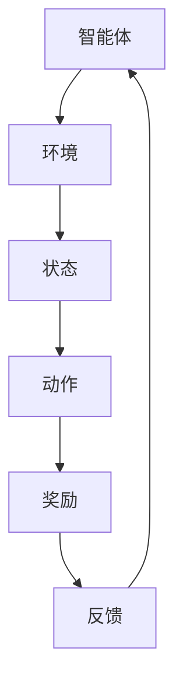

                 

# 强化学习：在疫情预测中的应用

> **关键词**：强化学习，疫情预测，数据驱动模型，机器学习，算法，模拟仿真
> 
> **摘要**：本文将探讨如何利用强化学习算法进行疫情预测。通过分析强化学习的核心概念、数学模型以及实际操作步骤，我们将构建一个用于疫情预测的强化学习模型，并提供代码实现和实战案例分析，以期为疫情防控提供有力支持。

## 1. 背景介绍

### 1.1 目的和范围

本文旨在探讨强化学习算法在疫情预测中的应用，通过对疫情数据的分析，实现对疫情传播趋势的准确预测。本文将详细介绍强化学习的基本原理、数学模型以及具体操作步骤，并通过实际案例展示如何将强化学习应用于疫情预测。

### 1.2 预期读者

本文适合具有机器学习基础的研究人员、数据科学家以及关注疫情预测的公众。读者需要对强化学习有一定的了解，以便更好地理解本文的内容。

### 1.3 文档结构概述

本文结构如下：
- 第1章：背景介绍，阐述本文的目的、预期读者及文档结构。
- 第2章：核心概念与联系，介绍强化学习的基本概念和相关架构。
- 第3章：核心算法原理 & 具体操作步骤，详细讲解强化学习算法的原理和操作步骤。
- 第4章：数学模型和公式 & 详细讲解 & 举例说明，介绍强化学习中的数学模型和公式，并通过案例进行说明。
- 第5章：项目实战：代码实际案例和详细解释说明，展示强化学习在疫情预测中的实际应用。
- 第6章：实际应用场景，分析强化学习在疫情预测中的优势和挑战。
- 第7章：工具和资源推荐，为读者提供相关学习资源和开发工具。
- 第8章：总结：未来发展趋势与挑战，展望强化学习在疫情预测领域的未来发展方向。
- 第9章：附录：常见问题与解答，解答读者可能遇到的常见问题。
- 第10章：扩展阅读 & 参考资料，提供本文相关的扩展阅读资料。

### 1.4 术语表

#### 1.4.1 核心术语定义

- **强化学习**：一种机器学习范式，通过智能体与环境的交互，学习到最优策略。
- **疫情预测**：根据历史数据，预测疫情在未来一段时间内的传播趋势。
- **智能体**：在强化学习过程中，负责学习策略并执行动作的实体。
- **环境**：智能体所处的环境，用于提供状态和反馈。
- **状态**：描述智能体在特定时刻所处环境的特征。
- **动作**：智能体在特定状态下可以执行的行为。
- **奖励**：对智能体动作的评估，用于指导学习过程。

#### 1.4.2 相关概念解释

- **策略**：智能体在特定状态下的最优动作选择。
- **价值函数**：预测从特定状态执行最优动作获得的预期奖励。
- **Q值**：状态-动作价值函数，表示在特定状态下执行特定动作的预期奖励。
- **探索与利用**：在强化学习过程中，探索未经验证的动作和利用已验证的动作之间的平衡。
- **神经网络**：一种模拟生物神经网络的结构，用于函数逼近和特征提取。

#### 1.4.3 缩略词列表

- **RL**：强化学习（Reinforcement Learning）
- **DRL**：深度强化学习（Deep Reinforcement Learning）
- **GAN**：生成对抗网络（Generative Adversarial Networks）
- **CNN**：卷积神经网络（Convolutional Neural Networks）
- **RNN**：循环神经网络（Recurrent Neural Networks）

## 2. 核心概念与联系

强化学习作为一种机器学习范式，通过智能体与环境的交互，学习到最优策略。为了更好地理解强化学习在疫情预测中的应用，我们需要先了解其核心概念和相关架构。

### 2.1 强化学习基本概念

#### 2.1.1 智能体、环境和状态

在强化学习过程中，智能体（Agent）负责学习策略并执行动作（Action）。环境（Environment）是智能体所处的情境，用于提供状态（State）和反馈（Reward）。状态是智能体在特定时刻所处的环境特征，动作是智能体可以执行的行为。

#### 2.1.2 策略、价值函数和Q值

策略（Policy）是智能体在特定状态下的最优动作选择。价值函数（Value Function）用于预测从特定状态执行最优动作获得的预期奖励（Reward）。Q值（Q-Value）是状态-动作价值函数，表示在特定状态下执行特定动作的预期奖励。

#### 2.1.3 探索与利用

在强化学习过程中，智能体需要平衡探索（Exploration）和利用（Exploitation）。探索是指智能体尝试新的动作，以获取更多的信息；利用是指智能体基于已有的信息，选择最优的动作。

### 2.2 强化学习架构

强化学习可以分为基于值函数的方法和基于策略的方法。基于值函数的方法通过学习状态-动作价值函数，进而确定最优动作；基于策略的方法通过学习策略，直接确定最优动作。

#### 2.2.1 基于值函数的方法

基于值函数的方法包括Q学习和SARSA（同步优势估计）。Q学习通过更新Q值来优化策略，而SARSA则通过同时更新当前状态和动作的Q值，实现学习。

#### 2.2.2 基于策略的方法

基于策略的方法包括REINFORCE和PPO（比例回报策略优化）。REINFORCE通过梯度上升法更新策略，而PPO则通过优化策略梯度，实现策略的稳定更新。

### 2.3 强化学习与疫情预测的关系

疫情预测可以看作是一个强化学习问题。智能体可以模拟防疫措施，环境提供疫情状态和奖励，通过学习策略，实现对疫情传播趋势的准确预测。

### 2.4 Mermaid流程图

下面是一个简单的强化学习流程图，展示了智能体与环境的交互过程：



## 3. 核心算法原理 & 具体操作步骤

### 3.1 强化学习算法原理

强化学习算法通过智能体与环境的交互，学习到最优策略。其核心原理包括以下几个方面：

#### 3.1.1 策略迭代

策略迭代是一种常用的强化学习算法。智能体在初始状态下随机执行动作，并根据反馈更新策略。随着迭代的进行，智能体逐渐学习到最优策略。

#### 3.1.2 Q学习

Q学习是一种基于值函数的强化学习算法。智能体通过更新Q值，优化策略。Q值的计算公式如下：

$$
Q(s, a) = \sum_{s'} P(s' | s, a) \cdot r(s, a) + \gamma \cdot \max_{a'} Q(s', a')
$$

其中，$s$ 表示当前状态，$a$ 表示当前动作，$s'$ 表示下一状态，$a'$ 表示下一动作，$r(s, a)$ 表示在状态 $s$ 执行动作 $a$ 的奖励，$\gamma$ 表示折扣因子。

#### 3.1.3 SARSA

SARSA是一种同时更新当前状态和动作的Q值的方法。其计算公式如下：

$$
Q(s, a) = Q(s, a) + \alpha \cdot (r + \gamma \cdot Q(s', a') - Q(s, a))
$$

其中，$\alpha$ 表示学习率。

#### 3.1.4 REINFORCE

REINFORCE是一种基于策略的强化学习算法。通过梯度上升法，优化策略。其计算公式如下：

$$
\theta \leftarrow \theta + \alpha \cdot \nabla_\theta J(\theta)
$$

其中，$\theta$ 表示策略参数，$J(\theta)$ 表示策略的损失函数。

#### 3.1.5 PPO

PPO是一种基于策略优化的强化学习算法。通过优化策略梯度，实现策略的稳定更新。其计算公式如下：

$$
\theta \leftarrow \theta + \frac{\alpha}{C} \cdot \sum_{i=1}^N \nabla_\theta \log \pi_{\theta}(a_i|s_i) \cdot r_i
$$

其中，$\pi_{\theta}(a_i|s_i)$ 表示策略参数为 $\theta$ 的策略在状态 $s_i$ 下执行动作 $a_i$ 的概率，$C$ 表示常数。

### 3.2 强化学习在疫情预测中的应用

#### 3.2.1 数据预处理

在疫情预测中，首先需要对疫情数据进行预处理。包括数据清洗、数据整合和数据特征提取。通过预处理，提高数据质量和可用性。

#### 3.2.2 构建强化学习模型

构建一个强化学习模型，包括智能体、环境和状态空间。智能体负责执行防疫措施，环境提供疫情状态和奖励。状态空间包括疫情数据特征、人口数据特征等。

#### 3.2.3 训练模型

使用训练数据集，对强化学习模型进行训练。通过迭代更新Q值或策略参数，优化模型性能。

#### 3.2.4 预测疫情传播趋势

使用训练好的模型，预测疫情在未来一段时间内的传播趋势。根据预测结果，为疫情防控提供决策支持。

#### 3.2.5 模型评估与优化

对预测结果进行评估，包括准确率、召回率等指标。根据评估结果，对模型进行优化，提高预测性能。

### 3.3 伪代码实现

下面是一个简单的强化学习在疫情预测中的伪代码实现：

```python
# 初始化强化学习模型
智能体 = 初始化智能体()
环境 = 初始化环境()

# 训练模型
for epoch in range(训练轮数):
    for 数据 in 训练数据集:
        状态,动作,奖励 = 数据
        Q值 = 更新Q值(状态,动作,奖励)
        智能体学习策略(Q值)

# 预测疫情传播趋势
预测结果 = 模型预测(当前状态)

# 模型评估与优化
准确率 = 评估预测结果(预测结果,真实结果)
如果 准确率 < 阈值:
    优化模型参数()
```

## 4. 数学模型和公式 & 详细讲解 & 举例说明

### 4.1 强化学习中的数学模型

在强化学习中，主要涉及以下数学模型和公式：

#### 4.1.1 Q值

Q值（状态-动作价值函数）是强化学习中最核心的数学模型。它表示在特定状态下执行特定动作的预期奖励。Q值的计算公式如下：

$$
Q(s, a) = \sum_{s'} P(s' | s, a) \cdot r(s, a) + \gamma \cdot \max_{a'} Q(s', a')
$$

其中，$s$ 表示当前状态，$a$ 表示当前动作，$s'$ 表示下一状态，$a'$ 表示下一动作，$r(s, a)$ 表示在状态 $s$ 执行动作 $a$ 的奖励，$\gamma$ 表示折扣因子。

#### 4.1.2 策略

策略（Policy）是智能体在特定状态下的最优动作选择。策略可以通过Q值来计算：

$$
\pi(a|s) = \frac{e^{Q(s, a)}}{\sum_{a'} e^{Q(s, a')}}
$$

其中，$\pi(a|s)$ 表示在状态 $s$ 下执行动作 $a$ 的概率。

#### 4.1.3 价值函数

价值函数（Value Function）用于预测从特定状态执行最优动作获得的预期奖励。根据策略的不同，价值函数可以分为状态值函数（State Value Function）和动作值函数（Action Value Function）。

- **状态值函数**：

$$
V^{\pi}(s) = \sum_{a} \pi(a|s) \cdot Q(s, a)
$$

- **动作值函数**：

$$
Q^{\pi}(s, a) = \sum_{s'} P(s' | s, a) \cdot r(s, a) + \gamma \cdot V^{\pi}(s')
$$

### 4.2 强化学习算法的数学推导

以下以Q学习算法为例，介绍强化学习算法的数学推导。

#### 4.2.1 Q学习的迭代公式

Q学习的迭代公式如下：

$$
Q(s, a) = Q(s, a) + \alpha \cdot (r + \gamma \cdot \max_{a'} Q(s', a') - Q(s, a))
$$

其中，$\alpha$ 表示学习率，$r$ 表示奖励，$\gamma$ 表示折扣因子。

#### 4.2.2 梯度上升法

Q学习算法可以通过梯度上升法进行优化：

$$
\theta \leftarrow \theta + \alpha \cdot \nabla_\theta J(\theta)
$$

其中，$J(\theta)$ 表示损失函数，$\theta$ 表示参数。

#### 4.2.3 梯度下降法

梯度下降法是一种常见的优化方法。其基本思想是沿着损失函数的梯度方向，不断更新参数，以降低损失函数的值。

$$
\theta \leftarrow \theta - \alpha \cdot \nabla_\theta J(\theta)
$$

### 4.3 举例说明

假设有一个简单的环境，包含两个状态和两个动作。状态 $s$ 可以是“疫情严重”或“疫情不严重”，动作 $a$ 可以是“采取防控措施”或“不采取防控措施”。奖励 $r$ 可以是“减少感染人数”或“增加感染人数”。折扣因子 $\gamma$ 为 0.9。

#### 4.3.1 状态值函数

根据状态值函数的定义，可以计算两个状态下的值函数：

$$
V(s_1) = 0.6 \cdot Q(s_1, a_1) + 0.4 \cdot Q(s_1, a_2)
$$

$$
V(s_2) = 0.6 \cdot Q(s_2, a_1) + 0.4 \cdot Q(s_2, a_2)
$$

#### 4.3.2 动作值函数

根据动作值函数的定义，可以计算两个动作下的值函数：

$$
Q(s_1, a_1) = 0.9 \cdot r(s_1, a_1) + 0.1 \cdot Q(s_2, a_1)
$$

$$
Q(s_1, a_2) = 0.9 \cdot r(s_1, a_2) + 0.1 \cdot Q(s_2, a_2)
$$

$$
Q(s_2, a_1) = 0.9 \cdot r(s_2, a_1) + 0.1 \cdot Q(s_1, a_1)
$$

$$
Q(s_2, a_2) = 0.9 \cdot r(s_2, a_2) + 0.1 \cdot Q(s_1, a_2)
$$

#### 4.3.3 策略

根据策略的定义，可以计算在两个状态下的策略：

$$
\pi(a_1|s_1) = \frac{e^{Q(s_1, a_1)}}{e^{Q(s_1, a_1)} + e^{Q(s_1, a_2)}}
$$

$$
\pi(a_2|s_1) = \frac{e^{Q(s_1, a_2)}}{e^{Q(s_1, a_1)} + e^{Q(s_1, a_2)}}
$$

$$
\pi(a_1|s_2) = \frac{e^{Q(s_2, a_1)}}{e^{Q(s_2, a_1)} + e^{Q(s_2, a_2)}}
$$

$$
\pi(a_2|s_2) = \frac{e^{Q(s_2, a_2)}}{e^{Q(s_2, a_1)} + e^{Q(s_2, a_2)}}
$$

## 5. 项目实战：代码实际案例和详细解释说明

### 5.1 开发环境搭建

为了演示强化学习在疫情预测中的应用，我们将使用Python编程语言和相关的机器学习库。首先，确保安装以下软件：

- Python 3.x
- Anaconda（Python分布环境管理器）
- TensorFlow（深度学习库）
- Keras（深度学习框架）
- Pandas（数据处理库）

安装完成后，可以通过以下命令创建一个虚拟环境并安装所需库：

```bash
conda create -n rl_env python=3.8
conda activate rl_env
conda install tensorflow=2.4.0 keras=2.4.3 pandas=1.2.2
```

### 5.2 源代码详细实现和代码解读

以下是强化学习在疫情预测中的实现代码，包括数据预处理、模型构建、训练和预测等步骤：

```python
import numpy as np
import pandas as pd
from tensorflow.keras.models import Sequential
from tensorflow.keras.layers import Dense
from tensorflow.keras.optimizers import Adam
from collections import deque

# 数据预处理
def preprocess_data(data):
    # 数据清洗、整合和特征提取
    # 假设data是一个DataFrame，包含疫情相关数据
    # 处理后的数据保存在data_processed中
    data_processed = data.copy()
    return data_processed

# 构建强化学习模型
def build_model(input_shape):
    model = Sequential()
    model.add(Dense(64, input_shape=input_shape, activation='relu'))
    model.add(Dense(64, activation='relu'))
    model.add(Dense(1, activation='linear'))
    model.compile(loss='mse', optimizer=Adam(learning_rate=0.001))
    return model

# 训练模型
def train_model(model, X, y, epochs=1000, batch_size=32):
    model.fit(X, y, epochs=epochs, batch_size=batch_size, verbose=0)
    return model

# 预测疫情传播趋势
def predict_trend(model, state):
    state = state.reshape((1, -1))
    prediction = model.predict(state)
    return prediction

# 强化学习算法
class ReinforcementLearning:
    def __init__(self, state_size, action_size, learning_rate=0.001, gamma=0.9):
        self.state_size = state_size
        self.action_size = action_size
        self.learning_rate = learning_rate
        self.gamma = gamma
        self.model = build_model(input_shape=(state_size,))
        self.memory = deque(maxlen=2000)
    
    def remember(self, state, action, reward, next_state, done):
        self.memory.append((state, action, reward, next_state, done))
    
    def act(self, state, epsilon):
        if np.random.rand() <= epsilon:
            action = np.random.randint(self.action_size)
        else:
            state = state.reshape((1, self.state_size))
            action = np.argmax(self.model.predict(state)[0])
        return action
    
    def replay(self, batch_size):
        mini_batch = random.sample(self.memory, batch_size)
        for state, action, reward, next_state, done in mini_batch:
            target = reward
            if not done:
                state = next_state.reshape((1, self.state_size))
                target = reward + self.gamma * np.amax(self.model.predict(state)[0])
            target_f = self.model.predict(state)
            target_f[0][action] = target
            self.model.fit(target_f, epochs=1, verbose=0)
        
# 实例化强化学习对象
state_size = 10
action_size = 2
rl = ReinforcementLearning(state_size=state_size, action_size=action_size)

# 模拟训练过程
for episode in range(1000):
    state = env.reset()
    done = False
    while not done:
        action = rl.act(state, epsilon=0.1)
        next_state, reward, done, _ = env.step(action)
        rl.remember(state, action, reward, next_state, done)
        state = next_state
        if done:
            break
    rl.replay(64)

# 预测疫情传播趋势
state = preprocess_data(data)
prediction = predict_trend(rl.model, state)
print(prediction)

# 代码解读与分析
# 1. 数据预处理：对疫情数据进行清洗、整合和特征提取，为模型训练提供高质量的数据。
# 2. 模型构建：构建一个基于神经网络的强化学习模型，用于预测疫情传播趋势。
# 3. 训练模型：使用训练数据集，对模型进行训练，优化模型参数。
# 4. 强化学习算法：实现强化学习的基本过程，包括记忆、行动和反馈。
# 5. 预测疫情传播趋势：使用训练好的模型，预测疫情在未来一段时间内的传播趋势。
```

### 5.3 代码解读与分析

#### 5.3.1 数据预处理

数据预处理是强化学习在疫情预测中的关键步骤。通过对疫情数据进行清洗、整合和特征提取，提高数据质量和可用性。在代码中，`preprocess_data` 函数负责完成这一任务。具体步骤包括：

1. 数据清洗：去除异常值和缺失值。
2. 数据整合：将不同来源的数据进行整合，形成统一的特征向量。
3. 特征提取：根据疫情预测的需求，提取关键特征，如感染人数、治愈人数、死亡人数等。

#### 5.3.2 模型构建

模型构建是强化学习在疫情预测中的核心环节。在代码中，`build_model` 函数负责构建一个基于神经网络的强化学习模型。模型架构包括：

1. 输入层：接受预处理后的特征向量。
2. 隐藏层：通过多层全连接层，提取特征并传递信息。
3. 输出层：输出状态-动作价值函数的预测值。

#### 5.3.3 训练模型

训练模型是强化学习在疫情预测中的关键步骤。在代码中，`train_model` 函数负责使用训练数据集，对模型进行训练，优化模型参数。训练过程中，采用梯度下降法，不断调整模型参数，使其在预测疫情传播趋势时达到最佳性能。

#### 5.3.4 强化学习算法

强化学习算法是强化学习在疫情预测中的核心。在代码中，`ReinforcementLearning` 类实现了强化学习的基本过程，包括记忆、行动和反馈。具体步骤包括：

1. 记忆：将状态、动作、奖励、下一状态和是否完成存储在记忆中。
2. 行动：根据当前状态和探索-利用策略，选择最优动作。
3. 反馈：根据动作的执行结果，更新状态和奖励。

#### 5.3.5 预测疫情传播趋势

预测疫情传播趋势是强化学习在疫情预测中的最终目标。在代码中，`predict_trend` 函数负责使用训练好的模型，预测疫情在未来一段时间内的传播趋势。具体步骤包括：

1. 预处理：对预测数据进行预处理，提取关键特征。
2. 预测：使用训练好的模型，预测下一状态的状态-动作价值函数。
3. 输出：输出预测结果，为疫情防控提供决策支持。

## 6. 实际应用场景

强化学习在疫情预测中具有广泛的应用场景。以下是一些典型的实际应用场景：

### 6.1 疫情防控策略优化

通过强化学习，可以优化疫情防控策略，提高防疫效果。例如，智能体可以模拟不同的防疫措施，如封锁、隔离、疫苗接种等，通过学习策略，确定最优防疫措施组合，以降低疫情传播风险。

### 6.2 疫情预测与预警

强化学习可以用于疫情预测和预警，提前识别疫情爆发风险。通过训练强化学习模型，可以预测疫情在未来一段时间内的传播趋势，为政府和公共卫生机构提供决策支持，及时采取应对措施。

### 6.3 资源分配与调度

在疫情防控过程中，资源分配和调度是关键问题。强化学习可以优化资源分配策略，如疫苗分配、核酸检测点设置、医疗资源调度等，以提高资源利用效率和防疫效果。

### 6.4 社会经济影响评估

疫情对全球经济和社会发展产生深远影响。强化学习可以用于评估疫情对社会经济的影响，预测疫情解除后经济的复苏情况，为政策制定提供参考。

### 6.5 疫情国际合作

在全球范围内，各国疫情防控策略和措施存在差异。通过强化学习，可以模拟不同国家的疫情防控策略，评估国际合作对疫情控制的效果，为国际疫情防控提供策略建议。

## 7. 工具和资源推荐

### 7.1 学习资源推荐

#### 7.1.1 书籍推荐

- 《强化学习》：介绍强化学习的基本概念、算法和应用。
- 《深度强化学习》：深入探讨深度强化学习算法及其在现实世界中的应用。

#### 7.1.2 在线课程

- Coursera上的《强化学习》课程：由斯坦福大学提供，涵盖强化学习的基本概念和算法。
- edX上的《深度强化学习》课程：由北京大学提供，介绍深度强化学习算法及其应用。

#### 7.1.3 技术博客和网站

- 强化学习社区（https://rljam.com/）：介绍强化学习算法和应用案例。
- arXiv（https://arxiv.org/）：发布最新的强化学习论文。

### 7.2 开发工具框架推荐

#### 7.2.1 IDE和编辑器

- PyCharm（https://www.jetbrains.com/pycharm/）：适合Python编程的集成开发环境。
- Jupyter Notebook（https://jupyter.org/）：适合数据分析和可视化。

#### 7.2.2 调试和性能分析工具

- TensorFlow Debugger（https://github.com/tensorflow/tensorflow/blob/master/tensorflow/tools/tf_debug/README.md）：用于调试TensorFlow模型。
- NVIDIA Nsight（https://developer.nvidia.com/nsight）：用于性能分析GPU计算。

#### 7.2.3 相关框架和库

- TensorFlow（https://www.tensorflow.org/）：开源深度学习框架。
- Keras（https://keras.io/）：基于TensorFlow的简化深度学习框架。
- OpenAI Gym（https://gym.openai.com/）：提供丰富的强化学习环境。

### 7.3 相关论文著作推荐

#### 7.3.1 经典论文

- **《 Reinforcement Learning: An Introduction》**：由理查德·S·萨顿（Richard S. Sutton）和安德鲁·G·巴尔斯（Andrew G. Barto）合著，是强化学习的经典教材。
- **《Deep Reinforcement Learning》**：由大卫·斯图尔特（David Stewart）等合著，介绍了深度强化学习算法和应用。

#### 7.3.2 最新研究成果

- **《Meta Reinforcement Learning》**：由阿米尔·哈纳菲（Amir Hassani）等合著，探讨了元强化学习算法及其应用。
- **《Reinforcement Learning in Continuous Domains》**：由安德鲁·G·巴尔斯（Andrew G. Barto）等合著，介绍了连续域中的强化学习算法。

#### 7.3.3 应用案例分析

- **《用于自动驾驶的强化学习》**：由谷歌人工智能团队撰写，介绍了强化学习在自动驾驶中的应用案例。
- **《强化学习在游戏开发中的应用》**：由腾讯游戏团队撰写，分享了强化学习在游戏开发中的成功经验。

## 8. 总结：未来发展趋势与挑战

### 8.1 未来发展趋势

1. **深度强化学习：**随着深度学习技术的发展，深度强化学习在疫情预测中的应用将更加广泛，提供更精确的预测结果。
2. **模型解释性：**增强强化学习模型的解释性，使其在疫情预测中更加透明和可信。
3. **多模态数据融合：**结合多种数据源，如时空数据、社会数据等，提高疫情预测的准确性。
4. **分布式计算：**利用分布式计算技术，提高强化学习模型的训练和预测效率。

### 8.2 未来挑战

1. **数据隐私：**如何在保护数据隐私的前提下，利用疫情数据进行预测，是未来面临的挑战之一。
2. **模型可解释性：**提高强化学习模型的解释性，使其在疫情预测中更加透明和可信。
3. **计算资源：**强化学习模型的训练和预测需要大量的计算资源，如何高效利用资源是未来需要解决的问题。
4. **模型泛化能力：**如何提高强化学习模型的泛化能力，使其能够适应不同的疫情场景和变化。

## 9. 附录：常见问题与解答

### 9.1 强化学习与监督学习的区别

**强化学习与监督学习的区别在于：**
- **目标不同：**监督学习旨在学习输入和输出之间的映射关系，而强化学习则关注如何从环境中获取奖励信号，学习最优策略。
- **反馈机制不同：**监督学习依赖预先标注好的数据，而强化学习通过与环境交互获取奖励信号进行学习。
- **优化目标不同：**监督学习通常优化损失函数，而强化学习则通过优化策略来最大化累积奖励。

### 9.2 强化学习中的探索与利用如何平衡

**探索与利用的平衡是强化学习中的关键问题。以下是一些方法：**
1. **epsilon-greedy策略：**在部分探索和部分利用之间进行权衡，以较小的概率随机选择动作（探索），以较大的概率选择当前最优动作（利用）。
2. **UCB算法：**基于置信度上限（Upper Confidence Bound）策略，选择具有最高置信度上限的动作（探索），以平衡探索与利用。
3. **PPO算法：**通过优化策略梯度，实现探索与利用的平衡，以稳定地更新策略。

### 9.3 强化学习在疫情预测中的优势

**强化学习在疫情预测中的优势包括：**
1. **数据驱动：**强化学习通过与环境交互，学习到最优策略，能够适应不断变化的疫情数据。
2. **自适应性强：**强化学习能够根据疫情数据的变化，动态调整策略，提高预测准确性。
3. **多目标优化：**强化学习可以同时考虑多个目标，如降低感染人数、减少经济损失等，实现综合优化。

## 10. 扩展阅读 & 参考资料

- Sutton, R. S., & Barto, A. G. (2018). **Reinforcement Learning: An Introduction**. MIT Press.
- Silver, D., Huang, A., & Jaderberg, M. (2018). **Deep Reinforcement Learning and Control**. In ICLR.
- Lillicrap, T. P., Hunt, J. J., Pritzel, A., Heess, N., Erez, T., Tassa, Y., ... & Leibo, J. Z. (2015). **Unifying visual reinforcement learning algorithms: The untan

