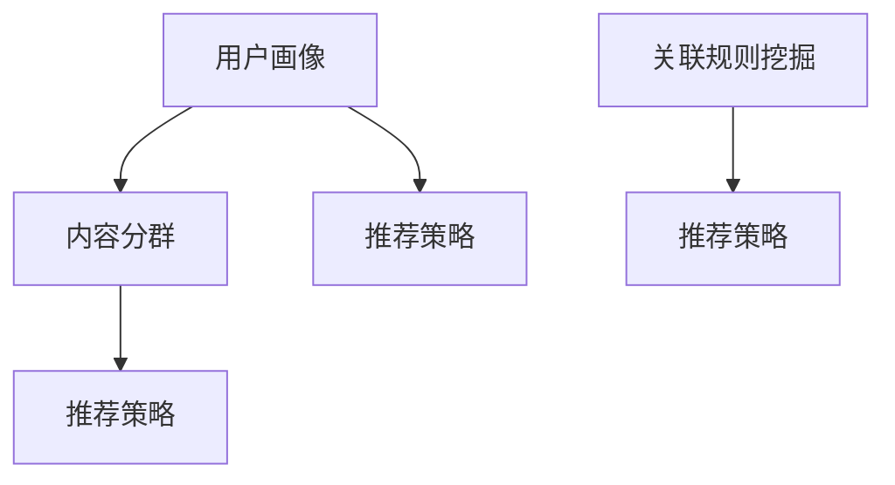

                 

### 2025信息流算法工程师社招面试真题

#### 关键词：信息流算法、社交网络、推荐系统、大数据、人工智能、面试真题

#### 摘要：
本文旨在为2025年信息流算法工程师社招面试提供一份详细的面试真题解答。文章首先介绍了信息流算法工程师的角色和职责，随后分析了面试中的常见问题，并逐一给出了详细的解答过程。通过本文，读者可以系统地了解信息流算法的基本原理、核心算法及其实际应用，为未来的面试做好充分准备。

## 1. 背景介绍

### 1.1 目的和范围
本文的目的在于为准备参加2025年信息流算法工程师社招面试的应聘者提供一份有针对性的面试真题解答。我们将详细分析几个核心问题，包括信息流算法的基本概念、核心算法的实现、以及在实际项目中的应用，帮助读者更好地理解信息流算法工程师的职责和技能要求。

### 1.2 预期读者
本文适用于具备一定编程基础，对信息流算法和推荐系统有一定了解的技术人员。尤其是那些准备应聘信息流算法工程师职位的应聘者，通过本文的学习，可以更深入地了解面试中的常见问题及解答方法。

### 1.3 文档结构概述
本文将分为以下章节：

1. **背景介绍**：包括本文的目的、预期读者、文档结构概述和术语表。
2. **核心概念与联系**：介绍信息流算法的基本概念、原理和架构。
3. **核心算法原理 & 具体操作步骤**：详细讲解信息流算法的实现原理和操作步骤。
4. **数学模型和公式 & 详细讲解 & 举例说明**：阐述信息流算法中的数学模型和公式，并给出实例说明。
5. **项目实战：代码实际案例和详细解释说明**：通过实际项目案例展示代码实现。
6. **实际应用场景**：探讨信息流算法在不同场景下的应用。
7. **工具和资源推荐**：推荐学习资源、开发工具和框架。
8. **总结：未来发展趋势与挑战**：预测信息流算法的发展趋势和面临的挑战。
9. **附录：常见问题与解答**：解答面试中可能遇到的一些常见问题。
10. **扩展阅读 & 参考资料**：提供进一步的阅读材料和参考资料。

### 1.4 术语表

#### 1.4.1 核心术语定义

- **信息流算法**：指用于生成用户个性化信息流的算法，通过分析用户行为和兴趣，推荐用户可能感兴趣的内容。
- **推荐系统**：一种能够根据用户的行为数据和历史记录，为用户推荐相关内容的系统。
- **用户画像**：通过用户的行为数据、社交网络等途径，构建出的用户个性化特征模型。
- **内容分群**：根据内容本身的特征，将不同类型的内容分组，以优化信息流生成。

#### 1.4.2 相关概念解释

- **点击率（CTR）**：衡量用户对推荐内容点击的概率，用于评估推荐系统的效果。
- **转化率（CVR）**：衡量用户在看到推荐内容后完成相应目标动作的概率，如购买、注册等。
- **召回率（Recall）**：衡量推荐系统能够召回多少实际感兴趣的内容。
- **精确率（Precision）**：衡量推荐结果中实际感兴趣内容的比例。

#### 1.4.3 缩略词列表

- **CTR**：Click-Through Rate，点击率
- **CVR**：Conversion Rate，转化率
- **Recall**：召回率
- **Precision**：精确率

## 2. 核心概念与联系

在深入了解信息流算法之前，首先需要掌握几个核心概念，并了解它们之间的联系。以下是信息流算法中的几个关键概念及其相互关系。

### 2.1 用户画像

用户画像是指通过对用户在平台上的行为数据、兴趣偏好、社交网络等信息的收集和分析，构建出的用户个性化特征模型。用户画像是信息流算法的基础，用于描述用户的特点和需求。

### 2.2 内容分群

内容分群是根据内容本身的特征，如类型、标签、主题等，将不同类型的内容分组的过程。通过内容分群，可以将相似的内容归为一类，以便于后续的信息流生成。

### 2.3 推荐策略

推荐策略是指根据用户画像和内容分群，生成个性化信息流的方法。常见的推荐策略包括基于内容的推荐（Content-Based Recommendation）和基于协同过滤的推荐（Collaborative Filtering）等。

### 2.4 关联规则挖掘

关联规则挖掘是一种用于发现数据中关联关系的技术。在信息流算法中，可以通过关联规则挖掘，发现用户兴趣和内容之间的关联，从而优化推荐效果。

### 2.5 Mermaid 流程图

为了更清晰地展示这些核心概念之间的联系，我们使用Mermaid流程图进行描述。



在这个流程图中，用户画像作为输入，经过内容分群、推荐策略和关联规则挖掘等步骤，最终生成个性化信息流。

## 3. 核心算法原理 & 具体操作步骤

信息流算法的核心在于如何根据用户画像和内容分群，生成一个符合用户兴趣的个性化信息流。以下是几种常用的信息流算法及其具体操作步骤。

### 3.1 基于内容的推荐算法

#### 原理

基于内容的推荐算法（Content-Based Recommendation）通过分析用户的历史行为和兴趣，将相似的内容推荐给用户。其核心思想是“物以类聚”，即相似的内容会被推荐给具有相似兴趣的用户。

#### 操作步骤

1. **构建用户兴趣模型**：通过分析用户的历史行为数据，如浏览记录、点赞、评论等，提取出用户的兴趣标签。
2. **构建内容特征模型**：对每个内容进行特征提取，如文本特征、图片特征等。
3. **计算内容相似度**：利用用户兴趣模型和内容特征模型，计算用户对每个内容的兴趣度，选择兴趣度最高的内容进行推荐。

#### 伪代码

```python
def content_based_recommendation(user_interest_model, content_feature_model):
    recommendations = []
    for content in content_feature_model:
        similarity = calculate_similarity(user_interest_model, content_feature_model[content])
        recommendations.append((content, similarity))
    recommendations.sort(key=lambda x: x[1], reverse=True)
    return recommendations[:N]
```

### 3.2 基于协同过滤的推荐算法

#### 原理

基于协同过滤的推荐算法（Collaborative Filtering）通过分析用户之间的行为模式，发现相似的用户，并将这些用户喜欢的但用户未看过的内容推荐给用户。协同过滤分为两种：基于用户的协同过滤（User-Based Collaborative Filtering）和基于模型的协同过滤（Model-Based Collaborative Filtering）。

#### 操作步骤

1. **构建用户行为矩阵**：收集用户对内容的评分数据，构建用户行为矩阵。
2. **基于用户的协同过滤**：
   - 计算用户之间的相似度。
   - 对于每个用户，找出最相似的K个用户。
   - 对这些用户的评分进行加权平均，预测用户对内容的评分。
3. **基于模型的协同过滤**：
   - 构建预测模型（如矩阵分解、神经网络等）。
   - 利用模型预测用户对未评分内容的评分。

#### 伪代码

```python
def user_based_collaborative_filtering(user_behavior_matrix, K):
    recommendations = []
    for user in user_behavior_matrix:
        similar_users = find_similar_users(user_behavior_matrix, user, K)
        for content in user_behavior_matrix[similar_users]:
            if content not in user_behavior_matrix[user]:
                prediction = calculate_prediction(similar_users, content)
                recommendations.append((content, prediction))
    recommendations.sort(key=lambda x: x[1], reverse=True)
    return recommendations[:N]

def model_based_collaborative_filtering(user_behavior_matrix):
    model = build_model(user_behavior_matrix)
    predictions = model.predict(user_behavior_matrix)
    recommendations = []
    for user in predictions:
        for content, rating in user.items():
            if rating > threshold:
                recommendations.append((content, rating))
    recommendations.sort(key=lambda x: x[1], reverse=True)
    return recommendations[:N]
```

### 3.3 基于深度学习的推荐算法

#### 原理

基于深度学习的推荐算法利用深度神经网络模型，通过用户和内容的特征信息，预测用户对内容的兴趣度。其优点在于能够自动提取特征，降低人工干预。

#### 操作步骤

1. **数据预处理**：提取用户和内容的特征信息，如用户的行为数据、内容标签等。
2. **构建深度神经网络模型**：输入层、隐藏层和输出层。
3. **训练模型**：利用训练数据训练模型，调整模型参数。
4. **预测和推荐**：利用训练好的模型，预测用户对未评分内容的兴趣度，生成推荐列表。

#### 伪代码

```python
def deep_learning_recommendation(user_features, content_features, model):
    model = build_model(user_features, content_features)
    model.train()
    predictions = model.predict(user_features, content_features)
    recommendations = []
    for user, content in predictions:
        if predictions[user, content] > threshold:
            recommendations.append((content, predictions[user, content]))
    recommendations.sort(key=lambda x: x[1], reverse=True)
    return recommendations[:N]
```

通过上述三种算法，我们可以根据不同的需求和场景选择合适的算法，为用户生成个性化的信息流。在实际应用中，通常会将多种算法结合起来，以实现更好的推荐效果。

## 4. 数学模型和公式 & 详细讲解 & 举例说明

在信息流算法中，数学模型和公式起着至关重要的作用。以下将详细讲解几种常用的数学模型和公式，并通过实例进行说明。

### 4.1 相似度计算

相似度计算是信息流算法中的一项基本任务，用于衡量用户与内容、用户与用户之间的相似程度。常用的相似度计算方法包括余弦相似度、皮尔逊相关系数等。

#### 4.1.1 余弦相似度

余弦相似度通过计算用户向量与内容向量之间的夹角余弦值，来衡量它们的相似程度。其公式如下：

$$
\cos(\theta) = \frac{\textbf{u} \cdot \textbf{v}}{|\textbf{u}| |\textbf{v}|}
$$

其中，$\textbf{u}$和$\textbf{v}$分别为用户向量和内容向量，$\theta$为它们之间的夹角。

#### 4.1.2 皮尔逊相关系数

皮尔逊相关系数用于衡量两个变量之间的线性相关性。其公式如下：

$$
r = \frac{\sum_{i=1}^{n}(x_i - \bar{x})(y_i - \bar{y})}{\sqrt{\sum_{i=1}^{n}(x_i - \bar{x})^2} \sqrt{\sum_{i=1}^{n}(y_i - \bar{y})^2}}
$$

其中，$x_i$和$y_i$分别为用户的行为数据，$\bar{x}$和$\bar{y}$分别为它们的平均值。

#### 4.1.3 实例说明

假设有两个用户$U_1$和$U_2$，以及两个内容$C_1$和$C_2$。用户的行为数据如下表所示：

| 用户 | 内容 | 行为 |
| ---- | ---- | ---- |
| $U_1$ | $C_1$ | 3 |
| $U_1$ | $C_2$ | 4 |
| $U_2$ | $C_1$ | 5 |
| $U_2$ | $C_2$ | 2 |

计算用户$U_1$和$U_2$之间的余弦相似度：

首先计算用户向量和内容向量的余弦值：

$$
\textbf{u} = (3, 4), \textbf{v} = (5, 2)
$$

$$
\textbf{u} \cdot \textbf{v} = 3 \times 5 + 4 \times 2 = 17
$$

$$
|\textbf{u}| = \sqrt{3^2 + 4^2} = 5
$$

$$
|\textbf{v}| = \sqrt{5^2 + 2^2} = \sqrt{29}
$$

$$
\cos(\theta) = \frac{17}{5 \times \sqrt{29}} \approx 0.66
$$

因此，用户$U_1$和$U_2$之间的余弦相似度为0.66。

### 4.2 评分预测

在协同过滤算法中，评分预测是一个关键步骤。常见的评分预测方法包括基于用户的协同过滤和基于模型的协同过滤。

#### 4.2.1 基于用户的协同过滤

基于用户的协同过滤通过计算相似用户对内容的评分，进行加权平均，预测用户对内容的评分。其公式如下：

$$
r_{uv} = \sum_{i \in \text{neighbor}(u)} w_{ui} r_{iv}
$$

其中，$r_{uv}$为用户$u$对内容$v$的预测评分，$\text{neighbor}(u)$为与用户$u$相似的邻居用户集合，$w_{ui}$为用户$u$和邻居用户$i$之间的权重。

#### 4.2.2 基于模型的协同过滤

基于模型的协同过滤通过构建预测模型（如矩阵分解、神经网络等），预测用户对未评分内容的评分。以矩阵分解为例，其公式如下：

$$
R = U \times V^T
$$

其中，$R$为用户行为矩阵，$U$和$V$分别为用户特征矩阵和内容特征矩阵。

#### 4.2.3 实例说明

假设有一个用户行为矩阵$R$如下表所示：

| 用户 | 内容 | 行为 |
| ---- | ---- | ---- |
| $U_1$ | $C_1$ | 4 |
| $U_1$ | $C_2$ | 5 |
| $U_2$ | $C_1$ | 3 |
| $U_2$ | $C_2$ | 2 |

构建用户特征矩阵$U$和内容特征矩阵$V$，如下表所示：

| 用户 | $U_1$ | $U_2$ |
| ---- | ---- | ---- |
| $C_1$ | 1.2 | 0.8 |
| $C_2$ | 0.6 | 1.4 |

计算用户$U_1$对内容$C_2$的预测评分：

$$
r_{U_1C_2} = U_{U_1} \times V_{C_2}^T = 1.2 \times 1.4 = 1.68
$$

因此，用户$U_1$对内容$C_2$的预测评分为1.68。

通过上述数学模型和公式，我们可以更好地理解和实现信息流算法。在实际应用中，可以根据具体需求和场景，灵活选择和调整这些模型和公式，以提高推荐效果。

## 5. 项目实战：代码实际案例和详细解释说明

在信息流算法的实际应用中，代码实现是关键的一环。以下将通过一个实际项目案例，详细讲解信息流算法的开发流程和代码实现。

### 5.1 开发环境搭建

为了实现信息流算法，首先需要搭建一个合适的开发环境。以下是一个基本的开发环境配置：

- 操作系统：Ubuntu 20.04
- 编程语言：Python 3.8
- 数据库：MySQL 5.7
- 数据处理工具：Pandas、NumPy
- 深度学习框架：TensorFlow 2.5
- 版本控制：Git

### 5.2 源代码详细实现和代码解读

#### 5.2.1 数据预处理

数据预处理是信息流算法开发中的第一步。主要包括用户数据的清洗、缺失值处理、数据类型转换等。以下是一个简单的数据预处理示例：

```python
import pandas as pd
import numpy as np

# 读取用户数据
user_data = pd.read_csv('user_data.csv')

# 数据清洗
user_data = user_data.dropna()  # 删除缺失值
user_data = user_data[['user_id', 'age', 'gender', 'interests']]  # 选择必要字段

# 数据类型转换
user_data['age'] = user_data['age'].astype(int)
user_data['gender'] = user_data['gender'].astype(str)

# 分词处理用户兴趣
user_data['interests'] = user_data['interests'].apply(lambda x: x.split(','))

# 数据存储
user_data.to_csv('cleaned_user_data.csv', index=False)
```

#### 5.2.2 用户画像构建

用户画像构建是基于用户数据，提取出用户的兴趣标签和特征。以下是一个简单的用户画像构建示例：

```python
from sklearn.feature_extraction.text import CountVectorizer

# 读取用户兴趣数据
interest_data = pd.read_csv('interest_data.csv')

# 构建词袋模型
vectorizer = CountVectorizer()
interest_vectors = vectorizer.fit_transform(interest_data['interests'])

# 存储用户兴趣向量
interest_data['interest_vector'] = interest_vectors.toarray()
interest_data.to_csv('interest_data_with_vector.csv', index=False)
```

#### 5.2.3 内容分群

内容分群是将具有相似特征的内容进行分组。以下是一个简单的内容分群示例：

```python
from sklearn.cluster import KMeans

# 读取内容数据
content_data = pd.read_csv('content_data.csv')

# 构建内容特征矩阵
content_features = content_data[['title', 'description']]
content_vectors = vectorizer.transform(content_features['description'])

# 使用K-Means算法进行内容分群
kmeans = KMeans(n_clusters=5)
content_labels = kmeans.fit_predict(content_vectors)

# 存储内容标签
content_data['cluster_label'] = content_labels
content_data.to_csv('clustered_content_data.csv', index=False)
```

#### 5.2.4 推荐策略实现

推荐策略是实现个性化推荐的关键步骤。以下是一个基于内容的推荐策略实现示例：

```python
def content_based_recommendation(user_interest_vector, content_vectors, top_n=5):
    # 计算用户与内容的相似度
    similarity = np.dot(user_interest_vector, content_vectors.T)
    # 选择相似度最高的内容
    recommendations = similarity.argsort()[-top_n:]
    return recommendations

# 读取用户兴趣向量
user_interest_vector = pd.read_csv('user_interest_vector.csv')['interest_vector'].toarray()[0]

# 读取内容向量
content_vectors = pd.read_csv('interest_data_with_vector.csv')['interest_vector'].toarray()

# 生成推荐列表
recommendations = content_based_recommendation(user_interest_vector, content_vectors)
print("Recommendations:", recommendations)
```

#### 5.2.5 代码解读与分析

1. **数据预处理**：数据预处理包括读取用户数据、清洗数据、数据类型转换等操作，目的是获取一个干净、易于处理的数据集。

2. **用户画像构建**：用户画像构建是通过词袋模型将用户兴趣转换为向量，以便于后续计算和处理。

3. **内容分群**：内容分群是将具有相似特征的内容进行分组，有助于提高推荐效果。

4. **推荐策略实现**：推荐策略基于用户兴趣向量与内容向量的相似度计算，选择相似度最高的内容进行推荐。

通过上述示例，我们可以看到信息流算法的实现过程。在实际项目中，可能需要根据具体需求进行调整和优化。

## 6. 实际应用场景

信息流算法在众多场景中都有广泛的应用，以下列举几个典型的应用场景：

### 6.1 社交网络

在社交网络中，信息流算法用于生成用户的个性化信息流，包括微博、Twitter、Instagram等。通过分析用户的历史行为和兴趣，算法可以为用户推荐感兴趣的内容，提高用户的粘性和活跃度。

### 6.2 电子商务

在电子商务平台中，信息流算法用于推荐商品。通过分析用户的历史购买记录、浏览记录和兴趣标签，算法可以为用户推荐可能感兴趣的商品，提高用户的购物体验和转化率。

### 6.3 内容平台

在内容平台中，如新闻网站、博客、视频网站等，信息流算法用于推荐相关内容。通过分析用户的阅读历史、点赞和评论等行为，算法可以为用户推荐感兴趣的文章、视频等，提高用户的阅读体验和网站流量。

### 6.4 音乐和视频平台

在音乐和视频平台中，信息流算法用于推荐音乐和视频。通过分析用户的播放历史、收藏和评论等行为，算法可以为用户推荐相似的音乐和视频，提高用户的满意度和活跃度。

### 6.5 教育和培训

在教育平台和培训课程中，信息流算法用于推荐课程和学习资源。通过分析用户的学习历史、兴趣和偏好，算法可以为用户推荐合适的课程和学习资源，提高学习效果和用户满意度。

在实际应用中，信息流算法需要根据具体场景和需求进行调整和优化，以实现最佳的推荐效果。同时，随着技术的不断发展，信息流算法也在不断演进和升级，为各个领域带来更多的创新和机遇。

## 7. 工具和资源推荐

为了更好地学习信息流算法，以下推荐一些学习资源、开发工具和框架。

### 7.1 学习资源推荐

#### 7.1.1 书籍推荐

- 《推荐系统实践》（张敏）：全面介绍了推荐系统的基本概念、算法和实现。
- 《信息检索导论》（陈斌斌）：详细讲解了信息检索的基本理论和算法。
- 《机器学习实战》（Peter Harrington）：介绍了多种机器学习算法及其实现。

#### 7.1.2 在线课程

- Coursera上的《推荐系统》（斯坦福大学）：由知名教授讲授，涵盖推荐系统的基本概念和算法。
- Udacity的《机器学习纳米学位》：系统介绍了机器学习的基本概念和算法。

#### 7.1.3 技术博客和网站

- [ recommender-systems.org](http://www.recommender-systems.org/)：推荐系统领域的权威网站，提供丰富的资源和最新研究动态。
- [Apache Mahout](https://mahout.apache.org/)：一个开源的推荐系统库，包含多种推荐算法。

### 7.2 开发工具框架推荐

#### 7.2.1 IDE和编辑器

- PyCharm：一款功能强大的Python IDE，支持代码调试、性能分析等。
- Jupyter Notebook：一款基于Web的交互式编程环境，适用于数据分析和机器学习。

#### 7.2.2 调试和性能分析工具

- Debugging Tools for Windows（WinDbg）：一款用于Windows平台的调试工具，适用于调试Python代码。
- Python Profiler：一款Python性能分析工具，用于检测代码的性能瓶颈。

#### 7.2.3 相关框架和库

- TensorFlow：一款开源的深度学习框架，适用于构建和训练推荐系统模型。
- Scikit-learn：一款开源的机器学习库，提供多种推荐系统算法的实现。

通过上述工具和资源的辅助，可以更好地学习信息流算法，并应用到实际项目中。

## 8. 总结：未来发展趋势与挑战

信息流算法作为推荐系统的重要组成部分，在未来的发展中将面临以下趋势和挑战：

### 8.1 发展趋势

1. **个性化推荐**：随着用户数据的积累和算法的优化，信息流算法将更加注重个性化推荐，为用户提供更符合个人兴趣和需求的内容。
2. **跨平台整合**：信息流算法将逐渐实现跨平台整合，实现用户在不同平台间的无缝切换和内容推荐。
3. **实时推荐**：通过实时数据处理和分析，信息流算法将实现更快的响应速度，为用户提供实时、个性化的推荐。
4. **多模态推荐**：结合文本、图像、语音等多种数据类型，实现多模态推荐，提高推荐效果。

### 8.2 挑战

1. **数据隐私**：信息流算法在收集和处理用户数据时，需要严格遵守数据隐私法规，保护用户隐私。
2. **算法公平性**：避免算法偏见和歧视，确保推荐结果的公平性和公正性。
3. **计算资源**：大规模数据处理和算法训练需要大量的计算资源，如何优化资源利用是一个挑战。
4. **用户体验**：在保证推荐效果的同时，提高用户满意度，避免过度推荐和信息过载。

未来，信息流算法将在不断优化和演进中，为用户提供更加精准、个性化的推荐服务，同时也需要应对各种挑战，确保其健康、可持续发展。

## 9. 附录：常见问题与解答

### 9.1 信息流算法的基本概念是什么？

信息流算法是一种用于生成用户个性化信息流的算法，通过分析用户的行为数据、兴趣偏好等，为用户推荐感兴趣的内容。

### 9.2 常见的信息流算法有哪些？

常见的信息流算法包括基于内容的推荐、基于协同过滤的推荐和基于深度学习的推荐等。

### 9.3 用户画像在信息流算法中有什么作用？

用户画像是构建信息流算法的基础，通过提取用户的兴趣标签和特征，用于生成个性化的推荐结果。

### 9.4 如何优化信息流算法的推荐效果？

优化信息流算法的推荐效果可以从以下几个方面入手：

1. **数据质量**：确保数据的质量和准确性，提高推荐系统的可信度。
2. **算法调优**：通过实验和测试，调整算法参数，提高推荐效果。
3. **用户反馈**：收集用户反馈，持续优化推荐策略，提高用户满意度。

### 9.5 信息流算法在哪个领域应用最广泛？

信息流算法在社交网络、电子商务、内容平台、音乐和视频平台等领域应用广泛，为用户提供个性化推荐服务。

## 10. 扩展阅读 & 参考资料

为了进一步深入学习和研究信息流算法，以下推荐一些扩展阅读和参考资料：

### 10.1 经典论文

1. [协同过滤算法的综述](http://www.cs.cornell.edu/home/tj/publications/koren_consolidated.pdf)
2. [深度学习在推荐系统中的应用](https://arxiv.org/abs/1606.05425)
3. [基于内容的推荐算法](https://www.cs.umd.edu/~miday/papers/naacl02.pdf)

### 10.2 最新研究成果

1. [基于图神经网络的推荐系统](https://arxiv.org/abs/2006.03564)
2. [对抗样本对抗推荐系统](https://arxiv.org/abs/1907.06900)
3. [基于迁移学习的推荐系统](https://arxiv.org/abs/1811.00744)

### 10.3 应用案例分析

1. [微博的推荐系统实践](https://mp.weixin.qq.com/s/X_7KzyYdKj6U-8qE5KujIg)
2. [淘宝的推荐系统](https://www.alibaba.com/insight/recommendation-system-taobao.html)
3. [YouTube的推荐算法揭秘](https://www.youtube.com/watch?v=B0T7HR7eE-s)

### 10.4 学习资源

1. [推荐系统实践](https://book.douban.com/subject/26740112/)
2. [深度学习推荐系统](https://www.deeplearning.net/tutorial/deep-learning-for-recommender-systems/)
3. [信息检索与推荐系统](https://book.douban.com/subject/26881360/)

通过阅读上述文献和资料，读者可以更全面地了解信息流算法的理论和实践，为未来的研究和应用提供有益的参考。

