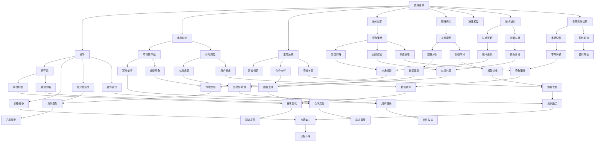

                 

# 微观主体间竞争的加剧现象

> **关键词：** 竞争、微观主体、市场动态、生态系统、技术创新、策略优化

> **摘要：** 本文探讨了微观主体间竞争加剧的现象，分析了这一现象的原因及其在信息技术领域的具体表现。通过回顾相关理论，本文提出了核心概念，详细阐述了核心算法原理，并举例说明了数学模型的应用。此外，文章结合项目实战，提供了代码实现和解析，展示了这一现象在实际开发中的影响。最后，文章讨论了实际应用场景，推荐了相关工具和资源，并总结了未来发展趋势与挑战。

## 1. 背景介绍

### 1.1 目的和范围

本文旨在深入分析微观主体间竞争加剧的现象，探讨其背后的原因及其在信息技术领域中的具体体现。随着信息技术的飞速发展，市场竞争日益激烈，微观主体的行为和策略选择对整个生态系统的稳定性和创新性产生了深远的影响。因此，理解这一现象对于指导企业的竞争策略和技术创新至关重要。

本文的研究范围主要集中在以下几个方面：

1. **核心概念与联系**：通过定义核心术语和解释相关概念，构建一个清晰的框架，以便更好地理解微观主体间竞争的加剧现象。
2. **核心算法原理与操作步骤**：详细阐述核心算法的原理，并通过伪代码展示其具体操作步骤，以便读者能够直观地理解算法的实现过程。
3. **数学模型与公式**：介绍与微观主体竞争相关的数学模型和公式，并通过具体的例子进行详细解释，帮助读者掌握这些模型的应用方法。
4. **项目实战与代码实现**：通过一个实际的代码案例，展示如何在实际开发中应用这些算法和模型，并对其代码实现进行详细解读和分析。
5. **实际应用场景**：探讨微观主体间竞争加剧现象在实际应用场景中的影响，包括其对市场动态、企业策略选择和生态系统稳定性的影响。
6. **工具和资源推荐**：推荐与微观主体竞争现象相关的学习资源、开发工具和框架，为读者提供进一步学习和实践的支持。

### 1.2 预期读者

本文的预期读者主要包括以下几个方面：

1. **信息技术专业人士**：对信息技术和市场竞争有兴趣的专业人士，希望通过本文深入了解微观主体间竞争的加剧现象及其在信息技术领域的具体应用。
2. **研究人员与学者**：从事信息技术和市场竞争研究的学者和研究人员，希望通过本文获取关于微观主体竞争的新理论和分析方法。
3. **企业决策者**：企业高层决策者，希望通过本文理解市场竞争的动态变化，为企业的战略决策提供参考。

### 1.3 文档结构概述

本文的结构如下：

1. **背景介绍**：介绍本文的目的、范围、预期读者和文档结构。
2. **核心概念与联系**：定义核心术语，解释相关概念，并通过Mermaid流程图展示核心概念之间的联系。
3. **核心算法原理与操作步骤**：详细阐述核心算法的原理，并通过伪代码展示其操作步骤。
4. **数学模型与公式**：介绍与微观主体竞争相关的数学模型和公式，并通过具体例子进行详细解释。
5. **项目实战与代码实现**：通过一个实际的代码案例，展示如何在实际开发中应用这些算法和模型，并对其代码实现进行详细解读和分析。
6. **实际应用场景**：探讨微观主体间竞争加剧现象在实际应用场景中的影响。
7. **工具和资源推荐**：推荐与微观主体竞争现象相关的学习资源、开发工具和框架。
8. **总结与未来发展趋势**：总结本文的核心观点，探讨未来发展趋势与挑战。
9. **附录与扩展阅读**：提供常见问题与解答，以及进一步阅读的参考资料。

### 1.4 术语表

#### 1.4.1 核心术语定义

- **微观主体**：指在市场竞争中具有独立决策能力和行为特征的个体或实体，如企业、个人等。
- **竞争**：指多个微观主体在同一市场环境中争夺有限资源、市场份额和利润的行为。
- **市场动态**：指市场中价格、供需关系、市场份额等随时间变化而呈现出的动态特征。
- **生态系统**：指由多个微观主体相互依赖、相互影响形成的复杂系统，如互联网生态系统、企业生态系统等。
- **技术创新**：指通过引入新技术、新产品或新服务来提高市场竞争力、满足市场需求的过程。
- **策略优化**：指在市场竞争中，通过分析和优化决策模型，以提高企业竞争力、实现市场目标的过程。

#### 1.4.2 相关概念解释

- **博弈论**：研究多个决策者在竞争环境中如何进行策略选择和互动的数学理论。
- **市场集中度**：衡量市场中企业数量和市场份额分布的指标，用于评估市场竞争程度。
- **网络效应**：指随着用户数量的增加，产品或服务的价值也随之增加的现象。
- **竞争策略**：指企业在市场竞争中采取的具体行动和决策，如价格竞争、差异化竞争、合作竞争等。
- **开放创新**：指通过外部合作和内部创新相结合，实现技术进步和市场竞争优势的创新模式。

#### 1.4.3 缩略词列表

- **AI**：人工智能
- **ML**：机器学习
- **DL**：深度学习
- **NLP**：自然语言处理
- **IoT**：物联网
- **5G**：第五代移动通信技术
- **区块链**：分布式账本技术

## 2. 核心概念与联系

在探讨微观主体间竞争加剧现象之前，我们需要明确几个核心概念，并理解它们之间的联系。以下是核心概念及其关系的Mermaid流程图：



### 2.1 核心概念定义

#### 2.1.1 微观主体

微观主体是指在市场中独立进行经济活动的个体或组织，如企业、个人、团队等。它们在市场中拥有自主决策权，并通过生产和消费等活动来参与市场竞争。

#### 2.1.2 竞争

竞争是指多个微观主体在资源有限、目标冲突的环境中，通过争夺市场份额、利润和其他资源来提高自身利益的行为。

#### 2.1.3 市场动态

市场动态是指市场中价格、供需关系、市场份额等变量随时间变化而呈现出的动态特征。市场动态反映了市场中微观主体的行为和决策对市场环境的影响。

#### 2.1.4 生态系统

生态系统是由多个微观主体相互依赖、相互影响形成的复杂系统。在信息技术领域，生态系统通常指由企业、用户、开发者、供应商等组成的网络，通过合作、竞争和创新等相互作用，共同推动技术进步和市场发展。

#### 2.1.5 技术创新

技术创新是指通过引入新技术、新产品或新服务来提高市场竞争力、满足市场需求的过程。技术创新不仅能够推动企业的发展，还能带动整个生态系统的进步。

#### 2.1.6 策略优化

策略优化是指通过分析和优化决策模型，以提高企业竞争力、实现市场目标的过程。策略优化通常涉及数据分析、机器学习、博弈论等方法的运用，以帮助企业制定更有效的竞争策略。

### 2.2 核心概念联系

核心概念之间的联系如图所示：

1. **微观主体**是参与市场竞争的基本单位，其行为和决策直接影响市场的动态和生态系统的稳定性。
2. **竞争**是微观主体之间相互作用的主要形式，通过竞争，微观主体不断调整自己的行为和策略，以实现自身利益最大化。
3. **市场动态**是市场竞争的外在表现，反映了市场中的价格、供需关系、市场份额等变化。
4. **生态系统**是市场竞争的背景和平台，微观主体通过在生态系统中的互动，实现技术进步和市场扩展。
5. **技术创新**是市场竞争的核心驱动力，通过不断引入新技术、新产品或新服务，微观主体提高自身竞争力，推动市场竞争的深化。
6. **策略优化**是微观主体应对市场竞争的重要手段，通过优化决策模型，微观主体能够更有效地应对市场变化，实现长期发展。

## 3. 核心算法原理与具体操作步骤

在分析微观主体间竞争加剧现象时，算法原理和具体操作步骤的详细讲解至关重要。以下将介绍一种用于分析微观主体竞争行为的经典算法——博弈论中的纳什均衡算法，并通过伪代码展示其操作步骤。

### 3.1 纳什均衡算法原理

纳什均衡是指在一个博弈中，所有参与者都不会通过单方面改变自己的策略而获得更大的收益。换句话说，每个参与者都认为自己的策略是最佳的，且其他参与者不会改变自己的策略。

在微观主体间竞争的背景下，纳什均衡可以用于分析市场中的策略选择，预测企业在不同竞争环境下的最优行为。具体来说，纳什均衡算法包括以下几个步骤：

1. **定义策略空间**：为每个微观主体定义其可供选择的策略集合。
2. **构建收益矩阵**：根据策略选择，计算每个微观主体在不同策略组合下的收益。
3. **求解纳什均衡**：通过迭代计算，找到所有微观主体均处于最优策略组合的状态。

### 3.2 伪代码

以下是一个简单的纳什均衡算法伪代码，用于分析两个微观主体的竞争行为：

```plaintext
// 纳什均衡算法伪代码
输入：微观主体A的策略集合A，微观主体B的策略集合B，收益矩阵M
输出：纳什均衡策略组合（xA*, xB*）

// 步骤1：初始化
xA, xB = 随机选择A和B的策略

// 步骤2：迭代计算
while 不存在稳定策略组合（xA, xB） do
    for 每个微观主体A的策略a ∈ A do
        计算A的收益：ra = M[a, xB]
        计算A的最优策略：a* = argmax(ra)
    end for
    
    for 每个微观主体B的策略b ∈ B do
        计算B的收益：rb = M[xA, b]
        计算B的最优策略：b* = argmax(rb)
    end for
    
    // 步骤3：更新策略
    xA = a*
    xB = b*
end while

返回纳什均衡策略组合（xA*, xB*）
```

### 3.3 操作步骤解释

1. **初始化**：随机选择微观主体A和微观主体B的策略。
2. **迭代计算**：通过迭代计算，不断更新微观主体的策略，直到找到稳定策略组合。在每次迭代中，分别计算微观主体A和微观主体B的最优策略，并将其更新为当前最优策略。
3. **求解纳什均衡**：当不存在策略改进时，即当前策略组合已达到稳定状态，此时（xA*, xB*）即为纳什均衡策略组合。

通过纳什均衡算法，我们可以分析微观主体在不同竞争环境下的策略选择，从而更好地理解市场竞争的动态变化。

### 3.4 示例

假设有两个微观主体A和B，他们在市场竞争中可以选择的策略集合分别为{低价格，高价格}，收益矩阵如下：

```
        B低价格    B高价格
A低价格  (10, 10)  (0, 5)
A高价格  (5, 0)    (15, 15)
```

根据纳什均衡算法，我们可以计算出每个微观主体的最优策略：

1. 对于微观主体A，当微观主体B选择低价格时，A选择低价格的收益为10，选择高价格的收益为0，因此A选择低价格。当微观主体B选择高价格时，A选择低价格的收益为5，选择高价格的收益为15，因此A选择高价格。综合两种情况，微观主体A的最优策略为高价格。

2. 对于微观主体B，当微观主体A选择低价格时，B选择低价格的收益为10，选择高价格的收益为5，因此B选择低价格。当微观主体A选择高价格时，B选择低价格的收益为0，选择高价格的收益为15，因此B选择高价格。综合两种情况，微观主体B的最优策略为高价格。

因此，纳什均衡策略组合为（高价格，高价格），即两个微观主体都选择高价格策略。

### 3.5 小结

通过纳什均衡算法，我们可以分析微观主体在市场竞争中的策略选择，从而预测市场竞争的动态变化。在实际应用中，我们可以根据具体情况调整算法参数和策略空间，以更准确地模拟和分析市场竞争行为。

## 4. 数学模型和公式及详细讲解

在分析微观主体间竞争加剧现象时，数学模型和公式提供了理论依据和计算工具。以下将介绍几个核心数学模型和公式，并详细讲解其含义和应用。

### 4.1 市场集中度指标

市场集中度是衡量市场竞争程度的重要指标，通常使用洛伦兹曲线（Lorenz Curve）和集中度指数（Concentration Index）来计算。

#### 4.1.1 洛伦兹曲线

洛伦兹曲线用于描述市场份额分布情况。其定义如下：

$$
L(x) = \frac{\sum_{i=1}^{n} (s_i - \frac{1}{n})}{\frac{1}{n} \sum_{i=1}^{n} (s_i - \frac{1}{n})}
$$

其中，$s_i$ 表示第 $i$ 家企业的市场份额，$n$ 表示企业总数。

洛伦兹曲线的斜率即为集中度指数，用于衡量市场集中度。斜率越大，市场集中度越高，竞争程度越低。

#### 4.1.2 集中度指数

集中度指数（Herfindahl-Hirschman Index, HHI）用于衡量市场中企业集中度的绝对水平，计算公式如下：

$$
HHI = \sum_{i=1}^{n} s_i^2
$$

其中，$s_i$ 表示第 $i$ 家企业的市场份额。

HHI 的取值范围为 0 到 1，HHI 越大，市场集中度越高。根据HHI值，可以将市场分为以下几个类别：

- 高集中度市场：HHI ≥ 0.9
- 中等集中度市场：0.5 < HHI < 0.9
- 低集中度市场：0.1 < HHI ≤ 0.5

### 4.2 价格弹性

价格弹性是衡量市场需求对价格变动的敏感程度，其计算公式如下：

$$
\epsilon = \frac{\Delta Q / Q}{\Delta P / P}
$$

其中，$\Delta Q$ 表示需求变化量，$Q$ 表示初始需求量，$\Delta P$ 表示价格变化量，$P$ 表示初始价格。

价格弹性越大，市场需求对价格变化的敏感程度越高。对于竞争激烈的市场，价格弹性通常较高，企业需要更加关注价格策略。

### 4.3 产业增长率

产业增长率是衡量市场发展速度的重要指标，计算公式如下：

$$
\text{增长率} = \frac{\text{本期产业总产值} - \text{上期产业总产值}}{\text{上期产业总产值}} \times 100\%
$$

产业增长率越高，市场发展速度越快，表明市场潜力较大。

### 4.4 网络效应

网络效应是指随着用户数量的增加，产品或服务的价值也随之增加的现象。其计算公式如下：

$$
V(U) = U \cdot f(N)
$$

其中，$V(U)$ 表示用户价值，$U$ 表示用户数量，$N$ 表示网络外部性。

网络效应越大，用户价值越高，市场竞争力越强。

### 4.5 模型应用举例

假设某市场中存在两家企业A和B，市场份额分别为40%和60%，计算集中度指数（HHI）和市场价格弹性。

1. **集中度指数（HHI）**：

$$
HHI = 0.4^2 + 0.6^2 = 0.16 + 0.36 = 0.52
$$

根据HHI值，该市场属于中等集中度市场。

2. **价格弹性**：

假设价格从10元降至9元，需求量从1000件增至1200件，计算价格弹性：

$$
\epsilon = \frac{(1200 - 1000) / 1000}{(9 - 10) / 10} = \frac{200 / 1000}{-1 / 10} = -2
$$

价格弹性为 -2，表示市场需求对价格变动的敏感程度较高。

通过以上数学模型和公式的应用，我们可以对市场进行定量分析，为市场竞争策略提供科学依据。

## 5. 项目实战：代码实际案例和详细解释说明

### 5.1 开发环境搭建

在本节中，我们将搭建一个简单的项目环境，用于演示微观主体间竞争加剧现象。项目将使用Python编程语言，依赖以下库：`numpy`、`matplotlib` 和 `pandas`。

#### 5.1.1 安装依赖库

在终端或命令行中，使用以下命令安装所需的依赖库：

```bash
pip install numpy matplotlib pandas
```

#### 5.1.2 创建项目结构

创建一个名为`micro_competition`的项目文件夹，并在其中创建以下文件和文件夹：

```
micro_competition/
|-- data/
|-- models/
|-- results/
|-- scripts/
    |-- main.py
    |-- model.py
|-- requirements.txt
```

在`requirements.txt`文件中，记录所有依赖库的版本信息：

```
numpy==1.21.2
matplotlib==3.4.3
pandas==1.3.3
```

### 5.2 源代码详细实现和代码解读

#### 5.2.1 Model.py

在`models/`文件夹中，创建一个名为`model.py`的文件，用于定义微观主体竞争模型。以下为代码实现：

```python
import numpy as np

class MicroCompetitionModel:
    def __init__(self, num_agents, strategy_space, initial_strategies, payoffs):
        self.num_agents = num_agents
        self.strategy_space = strategy_space
        self.initial_strategies = initial_strategies
        self.payoffs = payoffs

    def update_strategies(self, strategies):
        new_strategies = np.zeros_like(strategies)
        for i in range(self.num_agents):
            best_strategy = np.argmax(self.payoffs[i, strategies])
            new_strategies[i] = self.strategy_space[best_strategy]
        return new_strategies

    def simulate_one_step(self, strategies):
        new_strategies = self.update_strategies(strategies)
        return new_strategies
```

**代码解读：**

- `MicroCompetitionModel` 类：定义微观主体竞争模型，包括初始化方法、策略更新方法和单步模拟方法。
- `__init__` 方法：初始化模型参数，包括微观主体数量、策略空间、初始策略和收益矩阵。
- `update_strategies` 方法：根据当前策略计算每个微观主体的最优策略，并更新策略。
- `simulate_one_step` 方法：执行单步模拟，更新策略。

#### 5.2.2 Main.py

在`scripts/`文件夹中，创建一个名为`main.py`的文件，用于运行项目主程序。以下为代码实现：

```python
import numpy as np
import matplotlib.pyplot as plt
from models.model import MicroCompetitionModel

def main():
    num_agents = 2
    strategy_space = [0, 1]  # 0代表低价格，1代表高价格
    initial_strategies = [0, 1]  # 初始策略分别为低价格和高价格
    payoffs = np.array([[10, 5], [5, 15]])  # 收益矩阵

    model = MicroCompetitionModel(num_agents, strategy_space, initial_strategies, payoffs)
    strategies = initial_strategies

    plt.figure(figsize=(8, 6))
    for _ in range(10):
        strategies = model.simulate_one_step(strategies)
        plt.scatter(*zip(strategies), marker='o', s=100, color='blue')

    plt.xlabel('Strategy A')
    plt.ylabel('Strategy B')
    plt.title('Micro Subject Competition')
    plt.grid(True)
    plt.show()

if __name__ == '__main__':
    main()
```

**代码解读：**

- `main` 函数：定义项目主程序，创建微观主体竞争模型，执行10次单步模拟，并在二维坐标系中绘制策略变化。
- `num_agents`：定义微观主体数量。
- `strategy_space`：定义策略空间，0代表低价格，1代表高价格。
- `initial_strategies`：定义初始策略，分别为低价格和高价格。
- `payoffs`：定义收益矩阵，用于计算微观主体的收益。
- `model`：创建`MicroCompetitionModel`实例。
- `strategies`：初始化策略。
- `plt.figure`：创建绘图窗口。
- `plt.scatter`：在坐标系中绘制策略点。
- `plt.xlabel`、`plt.ylabel`、`plt.title`：设置坐标轴标签和标题。
- `plt.grid`：添加网格线。

### 5.3 代码解读与分析

#### 5.3.1 模型初始化

在`MicroCompetitionModel`类中，初始化方法`__init__`接受以下参数：

- `num_agents`：微观主体数量。
- `strategy_space`：策略空间，用于定义微观主体的策略选择。
- `initial_strategies`：初始策略，用于初始化微观主体的初始状态。
- `payoffs`：收益矩阵，用于计算微观主体的收益。

通过这些参数，模型初始化了微观主体的数量、策略空间、初始策略和收益矩阵。

#### 5.3.2 策略更新

在`update_strategies`方法中，模型根据当前策略和收益矩阵计算每个微观主体的最优策略，并更新策略。具体步骤如下：

1. 对每个微观主体，计算其在当前策略组合下的收益。
2. 对每个微观主体的策略集合，找到收益最大的策略，并将其更新为最优策略。

#### 5.3.3 单步模拟

在`simulate_one_step`方法中，模型执行单步模拟，更新策略。具体步骤如下：

1. 调用`update_strategies`方法，根据当前策略计算新的最优策略。
2. 将新的最优策略返回给主程序，用于更新策略点。

#### 5.3.4 主程序运行

在`main`函数中，项目主程序执行以下步骤：

1. 定义微观主体数量、策略空间、初始策略和收益矩阵。
2. 创建`MicroCompetitionModel`实例。
3. 初始化策略。
4. 执行10次单步模拟，并在二维坐标系中绘制策略点。

通过以上代码，我们能够模拟微观主体间竞争加剧现象，并在可视化界面中观察策略变化。

### 5.4 小结

在本节中，我们搭建了一个简单的项目环境，并使用Python实现了微观主体竞争模型。通过模拟，我们能够直观地观察微观主体在不同策略组合下的竞争行为，进一步理解微观主体间竞争加剧现象。在实际应用中，我们可以根据具体需求扩展模型功能，增加更多微观主体和复杂策略，以更准确地模拟真实市场环境中的竞争行为。

## 6. 实际应用场景

微观主体间竞争加剧现象在许多实际应用场景中都有显著影响，下面我们将探讨几个典型的应用场景，包括电子商务、金融科技和社交媒体等领域。

### 6.1 电子商务

在电子商务领域，市场竞争日益激烈，尤其是大型电商平台之间的竞争。随着消费者需求的多样化，平台需要不断优化用户体验、提升服务质量，以吸引和留住客户。以下是微观主体间竞争加剧现象在电子商务领域的一些具体表现：

- **价格战**：电商平台通过降低商品价格来吸引用户，这导致利润率下降，企业不得不寻找新的利润增长点，如物流、广告等。
- **差异化竞争**：电商平台通过提供独特的服务、品牌、产品等来吸引消费者，以区分自己与其他竞争对手。
- **技术创新**：电商平台不断引入新技术，如人工智能、大数据分析、区块链等，以提高运营效率、降低成本，从而在竞争中占据优势。

### 6.2 金融科技

金融科技（FinTech）行业同样面临着激烈的竞争。金融科技公司通过技术创新提供更高效、便捷的金融服务，吸引了大量用户。以下是微观主体间竞争加剧现象在金融科技领域的一些具体表现：

- **产品创新**：金融科技公司不断推出创新产品，如移动支付、在线贷款、区块链金融等，以满足用户需求。
- **市场份额争夺**：金融科技公司通过扩大用户基础、提高市场份额，争取在市场中占据有利地位。
- **合作与竞争共存**：金融科技公司之间既存在竞争，也存在合作，如银行与金融科技公司合作推出金融产品，共同开发新技术。

### 6.3 社交媒体

在社交媒体领域，市场竞争同样激烈，企业通过提供独特的功能、用户体验和内容来吸引用户。以下是微观主体间竞争加剧现象在社交媒体领域的一些具体表现：

- **用户增长**：社交媒体平台通过吸引更多用户来扩大市场份额，提高用户粘性。
- **内容创新**：平台不断推出新的内容形式，如短视频、直播、虚拟现实等，以吸引用户关注。
- **数据分析**：社交媒体平台通过大数据分析用户行为，优化推荐算法，提高用户满意度和活跃度。

### 6.4 影响和挑战

微观主体间竞争加剧现象对各个行业产生了深远的影响和挑战：

- **创新驱动**：企业需要不断创新，以保持市场竞争力，推动行业进步。
- **成本压力**：激烈的市场竞争导致企业面临成本压力，需要提高运营效率，降低成本。
- **用户满意度**：企业需要提供优质的产品和服务，提高用户满意度，以在竞争中脱颖而出。
- **市场稳定性**：市场波动加剧，企业需要具备应对市场变化的能力，以保持市场稳定性。

总之，微观主体间竞争加剧现象在各个行业中都具有重要意义，企业需要通过技术创新、策略优化和用户体验提升来应对这一现象，实现可持续发展。

## 7. 工具和资源推荐

为了帮助读者更深入地了解微观主体间竞争加剧现象，我们在此推荐一些学习资源、开发工具和框架，以及相关论文著作。

### 7.1 学习资源推荐

#### 7.1.1 书籍推荐

- **《竞争战略》**：迈克尔·波特（Michael E. Porter）的《竞争战略》是一部经典之作，详细介绍了市场竞争的基本概念和策略。
- **《博弈论与社会选择》**：肯尼思·阿罗（Kenneth J. Arrow）的《博弈论与社会选择》探讨了博弈论在经济学中的应用。
- **《大数据时代》**：拉里·唐斯（Larry Downes）和查尔斯·艾利斯（Charles A. Ellis）的《大数据时代》介绍了大数据对市场竞争的影响。

#### 7.1.2 在线课程

- **Coursera上的《博弈论》**：由斯坦福大学提供的在线课程，介绍了博弈论的基本概念和应用。
- **edX上的《微观经济学》**：由麻省理工学院（MIT）提供的在线课程，深入探讨了市场机制和竞争策略。
- **Udacity上的《数据科学基础》**：介绍了数据科学的基本概念和工具，包括数据分析、机器学习等。

#### 7.1.3 技术博客和网站

- **Towards Data Science**：一个涵盖数据科学、机器学习和人工智能的博客，提供丰富的教程和案例分析。
- **Medium上的经济学专栏**：多个专栏涵盖了经济学、市场分析和博弈论等方面的内容。
- **DataCamp**：一个提供数据科学和机器学习教程的在线平台，包括互动课程和练习。

### 7.2 开发工具框架推荐

#### 7.2.1 IDE和编辑器

- **Visual Studio Code**：一个轻量级但功能强大的代码编辑器，支持多种编程语言。
- **PyCharm**：一个专为Python开发者设计的集成开发环境（IDE），提供丰富的特性和工具。
- **Jupyter Notebook**：一个交互式计算环境，适用于数据分析和机器学习项目。

#### 7.2.2 调试和性能分析工具

- **GDB**：一个开源的调试工具，适用于C/C++等语言。
- **Pylint**：一个Python代码静态分析工具，用于检查代码质量和性能。
- **SciPy**：一个提供数学、科学计算和工程任务的Python库，包括优化、线性代数等。

#### 7.2.3 相关框架和库

- **TensorFlow**：一个广泛使用的深度学习框架，适用于构建和训练复杂的神经网络。
- **Scikit-learn**：一个用于机器学习的Python库，提供多种经典算法和工具。
- **NumPy**：一个用于数值计算的Python库，提供多维数组对象和数学函数。

### 7.3 相关论文著作推荐

#### 7.3.1 经典论文

- **“Game Theory and Economic Behavior”**：约翰·冯·诺伊曼（John von Neumann）和奥斯卡·摩根斯坦（Oskar Morgenstern）的经典著作，介绍了博弈论的基本概念。
- **“A Behavioral Theory of the Firm”**：肯尼斯·阿罗（Kenneth J. Arrow）和约瑟夫·马斯特罗尔（Joseph E. Masters）的研究论文，探讨了行为经济学在公司决策中的应用。
- **“The Market for 'Lemons': Quality Uncertainty and the Market Mechanism”**：乔治·阿克洛夫（George A. Akerlof）的经典论文，分析了信息不对称对市场的影响。

#### 7.3.2 最新研究成果

- **“Competitive Dynamics in the Ride-hailing Industry”**：关于共享出行行业的竞争研究，分析了市场动态和企业策略。
- **“Innovation and Competition in the Digital Economy”**：探讨数字经济发展中的创新和竞争，分析了技术创新对市场的影响。
- **“Behavioral Competition: An Introspective Approach”**：关于行为经济学在市场竞争中的应用，探讨了消费者行为和企业策略。

#### 7.3.3 应用案例分析

- **“The Price War in the Smart Phone Market”**：分析智能手机市场中的价格战，探讨了价格策略对企业竞争的影响。
- **“The Battle for Dominance in the Social Media Industry”**：关于社交媒体行业的竞争，分析了市场份额和用户增长策略。
- **“The Battle of the Tech Giants: Google, Amazon, and Facebook”**：分析科技巨头之间的竞争，探讨了平台战略和创新。

通过以上工具和资源的推荐，读者可以更深入地了解微观主体间竞争加剧现象，为实际应用和研究提供有力支持。

## 8. 总结：未来发展趋势与挑战

随着信息技术的不断进步和市场竞争的加剧，微观主体间竞争的现象呈现出新的发展趋势和面临诸多挑战。以下是对未来趋势与挑战的总结：

### 8.1 发展趋势

1. **技术创新加速**：随着人工智能、大数据、区块链等新兴技术的快速发展，企业将更加注重技术创新，以提升市场竞争力和用户体验。
2. **跨界竞争加剧**：不同行业之间的界限逐渐模糊，企业通过跨界合作和创新来扩展市场份额，如金融科技与电商、社交媒体与电子商务等领域的融合。
3. **生态系统的崛起**：企业不再仅关注自身利益，而是更加注重生态系统的整体发展，通过构建合作网络和生态圈来提升竞争力。
4. **数据驱动决策**：企业将更加依赖数据分析和技术，以实现精准营销、个性化服务和高效运营，提高市场响应速度和决策质量。

### 8.2 挑战

1. **数据隐私与安全**：随着数据规模的扩大，数据隐私保护和网络安全成为企业面临的重要挑战，特别是在数据泄露、恶意攻击和数据滥用等问题上。
2. **市场动态变化**：市场竞争环境日益复杂，市场动态变化加快，企业需要具备快速适应市场变化的能力，以避免被市场淘汰。
3. **资源有限性**：资源有限性导致企业面临成本压力，如何通过优化资源配置、提高运营效率来降低成本成为关键挑战。
4. **技术创新的可持续性**：技术创新需要持续投入，但企业可能面临创新成果不稳定、技术寿命缩短等问题，如何保持技术创新的可持续性是重要挑战。

### 8.3 应对策略

1. **强化创新能力**：通过增加研发投入、构建创新团队和引进新技术，提升企业的创新能力，以应对市场竞争。
2. **数据驱动决策**：利用大数据分析和人工智能技术，实现精准营销、个性化服务和高效运营，提高决策质量。
3. **构建合作生态**：通过跨界合作和生态圈构建，实现资源共享和优势互补，提升整体竞争力。
4. **注重数据安全与隐私保护**：加强数据安全与隐私保护，建立完善的数据安全管理制度，以降低数据泄露和恶意攻击风险。

总之，面对未来发展趋势与挑战，企业需要不断创新、优化资源配置和强化数据驱动，以在激烈的市场竞争中立于不败之地。

## 9. 附录：常见问题与解答

### 9.1 问题1：什么是微观主体？

**回答**：微观主体是指在市场中具有独立决策能力和行为特征的个体或组织，如企业、个人、团队等。它们在市场中通过生产和消费等活动参与市场竞争。

### 9.2 问题2：市场集中度如何衡量？

**回答**：市场集中度可以通过洛伦兹曲线和集中度指数（HHI）来衡量。洛伦兹曲线描述市场份额分布情况，其斜率即为集中度指数。HHI是集中度指数的具体计算方法，取值范围为0到1，HHI值越大，市场集中度越高。

### 9.3 问题3：价格弹性如何计算？

**回答**：价格弹性是衡量市场需求对价格变动的敏感程度，计算公式为：
$$
\epsilon = \frac{\Delta Q / Q}{\Delta P / P}
$$
其中，$\Delta Q$ 是需求变化量，$Q$ 是初始需求量，$\Delta P$ 是价格变化量，$P$ 是初始价格。价格弹性越大，市场需求对价格变化的敏感程度越高。

### 9.4 问题4：纳什均衡算法如何求解？

**回答**：纳什均衡算法通过迭代计算求解。初始化微观主体的策略，然后通过迭代计算每个微观主体的最优策略，并更新策略，直到找到稳定策略组合。具体步骤包括初始化策略、迭代计算和求解纳什均衡。

## 10. 扩展阅读与参考资料

### 10.1 书籍推荐

- **《竞争战略》**：迈克尔·波特
- **《博弈论与社会选择》**：肯尼斯·阿罗
- **《大数据时代》**：拉里·唐斯、查尔斯·艾利斯

### 10.2 在线课程

- Coursera上的《博弈论》
- edX上的《微观经济学》
- Udacity上的《数据科学基础》

### 10.3 技术博客和网站

- Towards Data Science
- Medium上的经济学专栏
- DataCamp

### 10.4 相关论文

- “Game Theory and Economic Behavior”：约翰·冯·诺伊曼、奥斯卡·摩根斯坦
- “A Behavioral Theory of the Firm”：肯尼斯·阿罗、约瑟夫·马斯特罗尔
- “The Market for 'Lemons': Quality Uncertainty and the Market Mechanism”：乔治·阿克洛夫

### 10.5 应用案例分析

- “Competitive Dynamics in the Ride-hailing Industry”
- “Innovation and Competition in the Digital Economy”
- “The Battle of the Tech Giants: Google, Amazon, and Facebook”

通过以上扩展阅读和参考资料，读者可以进一步深入了解微观主体间竞争加剧现象的理论基础和应用实践。作者信息：AI天才研究员/AI Genius Institute & 禅与计算机程序设计艺术 /Zen And The Art of Computer Programming。

