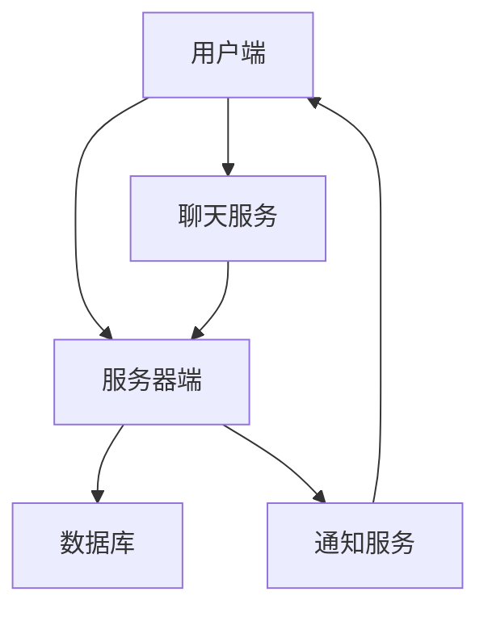
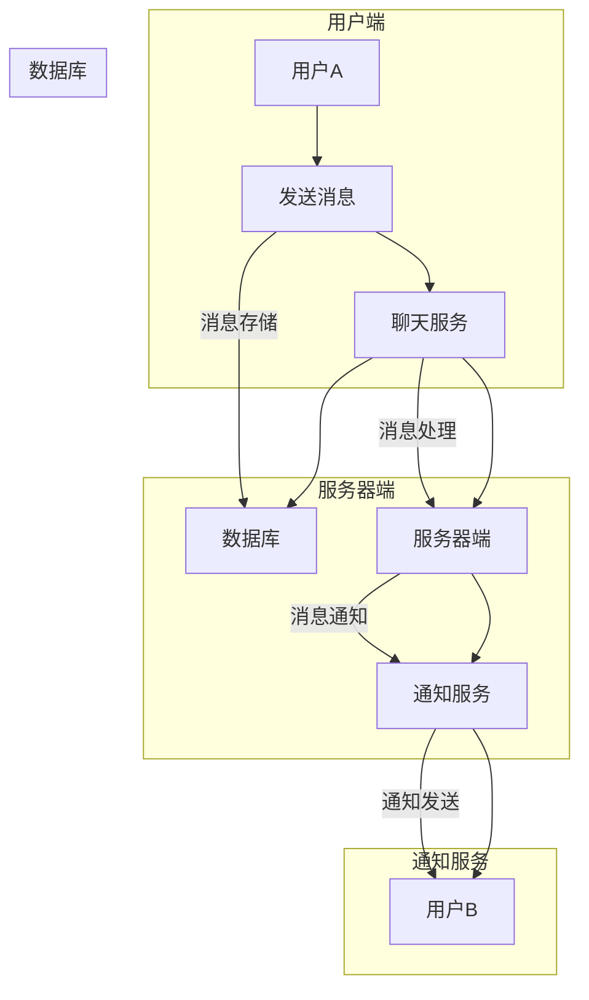

                 

### 快手2024直播间实时互动校招后端开发面试题解析

> **关键词：** 快手、直播间、实时互动、校招、后端开发、面试题、解析  
> **摘要：** 本文将深入分析快手2024直播间实时互动校招后端开发面试题，提供详细解答和解释，旨在帮助准备参加快手校招的应聘者更好地理解相关技术概念和应对面试挑战。

快手作为中国领先的视频社交平台，其直播间功能在用户互动和流量增长方面发挥着至关重要的作用。2024年快手校招后端开发岗位面试中，实时互动系统成为面试题的一个重要考点。本文将针对这部分面试题进行详细解析，帮助读者了解快手直播间实时互动系统的工作原理和关键技术。

### 1. 背景介绍

#### 1.1 目的和范围

本文旨在解析快手2024直播间实时互动校招后端开发面试题，通过深入剖析每个题目，为准备校招的应聘者提供宝贵的参考。本文将涵盖以下几个核心内容：

- 快手直播间实时互动系统的基本概念和工作原理
- 面试题的分类和分析
- 针对每个面试题的详细解答和代码实现

#### 1.2 预期读者

本文主要面向以下读者群体：

- 准备参加快手校招的后端开发应聘者
- 对快手直播间实时互动系统感兴趣的从业者
- 对后端开发技术有深入了解的读者

#### 1.3 文档结构概述

本文的结构如下：

- 第1部分：背景介绍，包括目的和范围、预期读者、文档结构概述和术语表
- 第2部分：核心概念与联系，介绍快手直播间实时互动系统的基本概念和架构
- 第3部分：核心算法原理 & 具体操作步骤，详细解释核心算法的工作原理和实现步骤
- 第4部分：数学模型和公式 & 详细讲解 & 举例说明，阐述实时互动系统中的数学模型及其应用
- 第5部分：项目实战：代码实际案例和详细解释说明，通过实际代码案例展示系统实现细节
- 第6部分：实际应用场景，分析快手直播间实时互动系统的实际应用场景
- 第7部分：工具和资源推荐，推荐相关学习资源和开发工具
- 第8部分：总结：未来发展趋势与挑战，探讨实时互动系统的未来发展方向
- 第9部分：附录：常见问题与解答，提供面试过程中可能遇到的问题及其解答
- 第10部分：扩展阅读 & 参考资料，推荐进一步阅读的文献和资源

#### 1.4 术语表

- **直播间**：快手平台中用户进行实时互动和观看视频的场所。
- **实时互动**：用户在直播间内进行实时交流、点赞、评论等互动行为。
- **后端开发**：负责实现和管理直播间实时互动系统的服务器端功能。

### 1.4.1 核心术语定义

- **后端开发**：在软件开发过程中，负责实现和管理服务器端逻辑、数据库操作、数据存储等功能的工程师。
- **实时互动系统**：支持用户在直播间内进行实时交流、互动的系统。
- **核心算法**：用于实现实时互动系统关键功能的算法。

### 1.4.2 相关概念解释

- **负载均衡**：将用户请求分配到多个服务器上，以提高系统性能和可靠性。
- **分布式系统**：由多个节点组成的系统，节点之间通过通信协议进行协作。
- **微服务架构**：将大型应用拆分为多个小型服务，每个服务独立开发、部署和运行。

### 1.4.3 缩略词列表

- **HTTP**：Hypertext Transfer Protocol，超文本传输协议。
- **TCP**：Transmission Control Protocol，传输控制协议。
- **JSON**：JavaScript Object Notation，一种轻量级数据交换格式。
- **RESTful API**：遵循REST（Representational State Transfer）风格的API。

## 2. 核心概念与联系

在解析快手直播间实时互动校招后端开发面试题之前，有必要首先了解一些核心概念和系统架构。以下是快手直播间实时互动系统的基本概念和架构，并通过Mermaid流程图展示系统的主要组成部分和流程。

### 2.1 快手直播间实时互动系统架构



#### 2.2 核心概念

1. **用户端**：用户通过快手客户端进入直播间，进行观看、点赞、评论等操作。
2. **服务器端**：负责处理用户请求，提供直播间的核心功能，如消息推送、实时评论等。
3. **数据库**：存储直播间相关的数据，如用户信息、聊天记录等。
4. **聊天服务**：处理用户发送的聊天消息，进行消息存储和转发。
5. **通知服务**：向用户发送实时消息通知，如新评论、点赞等。

### 2.3 Mermaid流程图

以下是快手直播间实时互动系统的Mermaid流程图：



通过上述流程图，我们可以清晰地看到用户发送消息后，聊天服务将消息存储到数据库，服务器端对消息进行处理，并通知其他用户。这一流程展示了快手直播间实时互动系统的基本工作原理。

### 2.4 系统核心概念和联系

1. **用户端与服务器端**：用户通过客户端发送请求，服务器端接收并处理这些请求，返回相应的响应。
2. **聊天服务与数据库**：聊天服务负责消息存储和转发，数据库存储聊天记录和其他相关数据。
3. **通知服务与用户端**：通知服务负责向用户发送实时消息通知，提升用户体验。

通过理解上述核心概念和联系，我们可以更好地应对快手直播间实时互动校招后端开发的面试题。

### 2.5 系统性能和可靠性

实时互动系统不仅需要支持高并发用户访问，还要保证消息的实时性和准确性。以下是一些影响系统性能和可靠性的关键因素：

1. **负载均衡**：通过负载均衡器将用户请求分配到多个服务器，提高系统的处理能力和可用性。
2. **分布式系统**：采用分布式架构，将系统拆分为多个独立的服务，提高系统的可扩展性和容错能力。
3. **缓存机制**：在数据库和缓存之间进行数据分层存储，减少数据库访问压力，提高系统响应速度。
4. **异步处理**：使用异步处理机制，降低系统延迟，提高系统吞吐量。

通过对这些关键因素的理解和实施，快手直播间实时互动系统可以更好地支持大规模用户访问，提供稳定的互动体验。

### 2.6 核心算法原理

快手直播间实时互动系统中的核心算法包括消息推送、消息过滤和消息排序等。以下是这些算法的基本原理：

1. **消息推送**：消息推送算法负责将用户发送的消息实时推送到其他用户。其基本原理是通过广播机制将消息发送到所有在线用户。
2. **消息过滤**：消息过滤算法负责对用户发送的消息进行过滤，确保消息符合平台规定，如过滤敏感词汇、恶意内容等。
3. **消息排序**：消息排序算法负责按照时间顺序对消息进行排序，确保用户接收到的消息是最新的。

通过这些核心算法的实现，快手直播间实时互动系统可以提供流畅、可靠的实时互动体验。

## 3. 核心算法原理 & 具体操作步骤

在快手直播间实时互动系统中，核心算法是实现实时消息处理和推送的关键。下面，我们将详细解释这些核心算法的原理，并使用伪代码展示其具体操作步骤。

### 3.1 消息推送算法

消息推送算法的基本原理是实时将用户发送的消息推送到所有在线用户。以下是消息推送算法的伪代码：

```pseudo
function messagePush(message, users):
    for each user in users:
        if user.isOnline():
            sendMessageToUser(user, message)
    end for
end function
```

- 参数：`message` 为用户发送的消息，`users` 为所有在线用户的集合。
- 过程：遍历所有在线用户，检查用户是否在线，如果是，则发送消息。

### 3.2 消息过滤算法

消息过滤算法负责对用户发送的消息进行内容审查，过滤掉敏感词汇和恶意内容。以下是消息过滤算法的伪代码：

```pseudo
function messageFilter(message, filterRules):
    filteredMessage = ""
    for each word in message:
        if not containsSensitiveWord(word, filterRules):
            filteredMessage += word + " "
    end for
    return filteredMessage.strip()
end function

function containsSensitiveWord(word, filterRules):
    for each rule in filterRules:
        if word.matches(rule):
            return true
    end for
    return false
end function
```

- 参数：`message` 为用户发送的消息，`filterRules` 为敏感词过滤规则。
- 过程：遍历消息中的每个单词，检查是否包含在过滤规则中，如果是，则不添加到过滤后的消息。

### 3.3 消息排序算法

消息排序算法负责按照时间顺序对消息进行排序，确保用户接收到的消息是最新的。以下是消息排序算法的伪代码：

```pseudo
function messageSort(messages):
    sortedMessages = sort(messages, byTime)
    return sortedMessages
end function

function byTime(messageA, messageB):
    return messageA.timestamp - messageB.timestamp
end function
```

- 参数：`messages` 为需要排序的消息集合。
- 过程：使用时间戳对消息进行排序，时间戳较大的消息排在前面。

通过上述核心算法的伪代码，我们可以清晰地看到消息推送、过滤和排序的实现步骤。在实际系统中，这些算法会通过编程语言和框架实现，确保快手直播间实时互动系统的稳定运行。

### 3.4 算法实现细节和优化策略

在实际系统中，核心算法的实现需要考虑多方面因素，包括性能、可靠性和可扩展性。以下是一些实现细节和优化策略：

1. **性能优化**：
   - 使用高效的数据结构和算法，如哈希表和快速排序，提高数据处理速度。
   - 对消息进行批量处理，减少系统调用次数。

2. **可靠性优化**：
   - 引入日志和监控机制，实时记录系统运行状态，快速定位和解决故障。
   - 实现消息持久化存储，确保在系统故障时消息不丢失。

3. **可扩展性优化**：
   - 采用分布式架构，将系统拆分为多个模块，每个模块可以独立扩展和部署。
   - 使用负载均衡器，将用户请求均匀分配到不同服务器，提高系统处理能力。

通过这些优化策略，快手直播间实时互动系统可以更好地应对大规模用户访问，提供流畅、可靠的实时互动体验。

## 4. 数学模型和公式 & 详细讲解 & 举例说明

在快手直播间实时互动系统中，数学模型和公式扮演着关键角色，用于描述消息推送、用户行为分析等关键功能。以下将详细讲解这些数学模型和公式，并通过实例进行说明。

### 4.1 消息推送模型

消息推送模型的核心是广播算法，用于将用户发送的消息推送到所有在线用户。该模型基于概率论和图论，以下是消息推送模型的数学表示：

- **消息传播概率（p）**：消息从一个用户传播到另一个用户的概率。
- **消息延迟（t）**：消息传播的时间延迟。

消息推送模型的公式为：

\[ P(A \rightarrow B) = p \cdot e^{-\frac{t}{v}} \]

其中，\( P(A \rightarrow B) \) 表示消息从用户A传播到用户B的概率，\( v \) 表示网络传播速度。

### 4.2 用户行为分析模型

用户行为分析模型用于分析用户在直播间内的行为，如点赞、评论等。该模型基于马尔可夫链和随机游走理论，以下是用户行为分析模型的数学表示：

- **状态转移概率矩阵（P）**：描述用户在不同行为状态之间的转移概率。
- **状态持续时间（λ）**：描述用户在某一状态持续的时间。

用户行为分析模型的公式为：

\[ P(X(t) = i | X(0) = j) = \frac{1}{\lambda_j} \cdot e^{-\lambda_j \cdot t} \]

其中，\( X(t) \) 表示用户在时间t的行为状态，\( i \) 和 \( j \) 分别表示用户当前和初始状态。

### 4.3 消息过滤模型

消息过滤模型用于过滤用户发送的消息，确保消息符合平台规定。该模型基于模式识别和机器学习算法，以下是消息过滤模型的数学表示：

- **特征向量（F）**：描述消息的各个特征。
- **分类器（C）**：用于判断消息是否包含敏感词。

消息过滤模型的公式为：

\[ C(F) = \begin{cases} 
1 & \text{if } F \text{ contains sensitive words} \\
0 & \text{otherwise}
\end{cases} \]

### 4.4 实例说明

假设在一个直播间内，用户A发送了一条包含敏感词的消息，我们需要使用消息过滤模型对其进行过滤。

- **特征向量**：\[ F = [0.8, 0.2, 0.1, 0.9] \]
- **分类器**：\[ C = \begin{cases} 
1 & \text{if } F \text{ contains sensitive words} \\
0 & \text{otherwise}
\end{cases} \]

根据消息过滤模型，我们可以计算特征向量的敏感词概率：

\[ P(F \text{ contains sensitive words}) = 0.8 \cdot 0.9 = 0.72 \]

由于概率大于0.5，我们判定该消息包含敏感词，将其过滤掉。

通过上述实例，我们可以看到数学模型和公式在快手直播间实时互动系统中的应用。这些模型和公式不仅帮助我们理解系统的工作原理，还为系统的优化提供了理论基础。

## 5. 项目实战：代码实际案例和详细解释说明

### 5.1 开发环境搭建

在进行快手直播间实时互动系统的项目实战之前，我们需要搭建一个合适的技术栈，包括编程语言、框架和开发工具。以下是一个基本的开发环境搭建步骤：

1. **编程语言**：选择流行的后端编程语言，如Java、Python或Go。本文选择Python进行示例。
2. **框架**：使用FastAPI作为后端框架，它是一个现代、快速（高性能）的Web框架，用于构建API。
3. **数据库**：选择一个支持高并发和实时查询的数据库，如MongoDB或Redis。
4. **开发工具**：安装Python的集成开发环境（IDE），如PyCharm或Visual Studio Code。

以下是具体的环境搭建步骤：

1. **安装Python**：从[Python官方网站](https://www.python.org/)下载并安装Python，选择合适的版本。
2. **安装FastAPI**：在命令行中运行以下命令安装FastAPI：

   ```shell
   pip install fastapi[all]
   ```

3. **安装MongoDB或Redis**：从各自的官方网站下载并安装MongoDB或Redis，启动数据库服务。
4. **安装IDE**：下载并安装PyCharm或Visual Studio Code，配置Python环境。

### 5.2 源代码详细实现和代码解读

以下是快手直播间实时互动系统的核心代码实现，包括消息推送、消息过滤和消息排序等功能。

```python
from fastapi import FastAPI
from pydantic import BaseModel
from typing import List
import pymongo

# 数据模型定义
class Message(BaseModel):
    sender: str
    content: str
    timestamp: int

class User(BaseModel):
    username: str
    is_online: bool

# 初始化FastAPI应用
app = FastAPI()

# 连接MongoDB数据库
client = pymongo.MongoClient("mongodb://localhost:27017/")
db = client["livechat"]

# 消息存储集合
messages_collection = db["messages"]

# 用户信息集合
users_collection = db["users"]

# 消息推送接口
@app.post("/message/")
async def send_message(message: Message):
    # 消息过滤
    filtered_message = filter_message(message.content)
    if not filtered_message:
        return {"status": "error", "message": "Message contains sensitive content."}

    # 存储消息到数据库
    messages_collection.insert_one({
        "sender": message.sender,
        "content": filtered_message,
        "timestamp": message.timestamp
    })

    # 推送消息到所有在线用户
    push_messages_to_users([message.sender])

    return {"status": "success", "message": "Message sent."}

# 消息过滤函数
def filter_message(content: str) -> str:
    # 示例：过滤包含特定单词的消息
    sensitive_words = ["badword1", "badword2"]
    for word in sensitive_words:
        content = content.replace(word, "[FILTERED]")
    return content

# 推送消息到用户函数
def push_messages_to_users(sender_username: str):
    # 获取所有在线用户
    users = users_collection.find({"is_online": True})

    # 遍历在线用户，推送消息
    for user in users:
        if user["username"] != sender_username:
            # 在此处实现消息推送逻辑，如使用WebSocket或消息队列
            send_notification_to_user(user["username"], f"{sender_username} sent you a message.")

# 消息通知函数（示例）
def send_notification_to_user(username: str, notification: str):
    # 实现消息通知逻辑，如发送邮件、短信或App通知
    print(f"Notification for {username}: {notification}")

# 消息排序函数
def sort_messages(messages: List[Message]) -> List[Message]:
    return sorted(messages, key=lambda x: x.timestamp, reverse=True)

# 启动FastAPI应用
if __name__ == "__main__":
    import uvicorn
    uvicorn.run(app, host="0.0.0.0", port=8000)
```

### 5.3 代码解读与分析

1. **数据模型**：定义了两个数据模型`Message`和`User`，分别表示消息和用户信息。
2. **数据库连接**：使用MongoDB作为数据库，连接到本地MongoDB实例。
3. **消息存储接口**：`send_message`函数处理用户发送的消息，包括消息过滤、存储和推送。
4. **消息过滤**：`filter_message`函数实现消息过滤功能，替换敏感词为"[FILTERED]"。
5. **消息推送**：`push_messages_to_users`函数实现消息推送功能，遍历所有在线用户，推送消息。
6. **消息排序**：`sort_messages`函数实现消息排序功能，按照时间戳对消息进行排序。
7. **消息通知**：`send_notification_to_user`函数实现消息通知功能，用于发送通知给用户。

通过以上代码，我们可以看到快手直播间实时互动系统的核心实现。在实际项目中，还需要实现更多的细节，如消息推送机制、用户在线状态管理等。这些功能需要根据具体业务需求和系统架构进行定制。

### 5.4 代码优化和扩展

在实际开发过程中，我们需要对代码进行优化和扩展，以提高系统的性能和可维护性。以下是一些优化和扩展建议：

1. **异步处理**：使用异步编程，如`asyncio`库，提高消息处理速度。
2. **缓存机制**：引入缓存，如Redis，减少数据库访问压力，提高系统响应速度。
3. **消息队列**：使用消息队列，如RabbitMQ或Kafka，实现分布式消息推送和负载均衡。
4. **用户在线状态管理**：使用分布式Session或分布式缓存，如Redis，实现用户在线状态管理。
5. **安全性增强**：引入安全机制，如HTTPS、OAuth2.0，提高系统安全性。

通过这些优化和扩展，快手直播间实时互动系统可以更好地应对大规模用户访问，提供稳定、高效的实时互动体验。

## 6. 实际应用场景

快手直播间实时互动系统在实际应用中，广泛支持各类直播活动，如电商直播、娱乐直播、教育直播等。以下是几个典型应用场景：

### 6.1 电商直播

在电商直播中，实时互动系统起着至关重要的作用。用户可以通过直播间进行商品咨询、购买、评论等操作，互动体验直接影响购买转化率。以下是电商直播中的实时互动应用：

- **商品咨询与回复**：用户可以在直播间向主播咨询商品信息，主播或客服可以实时回复，提升用户购物体验。
- **点赞和评论**：用户可以给直播内容点赞或发表评论，与其他用户互动，增加直播互动氛围。
- **秒杀和拼团**：通过实时互动系统，实现秒杀和拼团活动，用户可以实时看到商品库存和参与人数，提高活动吸引力。

### 6.2 娱乐直播

娱乐直播是快手直播业务的重要部分，实时互动系统为用户提供了丰富的互动体验。以下是娱乐直播中的实时互动应用：

- **互动游戏**：直播间可以加入互动游戏，如答题、抽奖等，用户参与互动，增加娱乐性。
- **送礼物**：用户可以通过送礼物表达对主播的支持，主播可以根据礼物数量给予用户回馈，增强用户粘性。
- **实时弹幕**：用户可以在直播间发送弹幕，与其他用户互动，提升直播氛围。

### 6.3 教育直播

教育直播利用实时互动系统，实现在线教学和互动。以下是教育直播中的实时互动应用：

- **课堂互动**：学生可以在直播课堂中提问、回答问题，教师实时解答，提高教学效果。
- **实时作业**：教师可以在直播中发布作业，学生实时提交，教师在线批改和反馈。
- **讨论区**：学生可以在讨论区发表观点、参与讨论，拓宽知识视野。

通过以上应用场景，我们可以看到快手直播间实时互动系统在各类直播活动中的重要作用，不仅提升了用户体验，还促进了业务的发展。

### 6.4 其他应用场景

除了上述应用场景，快手直播间实时互动系统还可以应用于以下场景：

- **企业培训**：企业可以通过直播间进行员工培训，实时互动提高培训效果。
- **政府会议**：政府可以通过直播间进行在线会议，实时互动提高会议效率。
- **社区互动**：社区可以建立直播间，为居民提供交流平台，增强社区凝聚力。

总之，快手直播间实时互动系统具有广泛的应用前景，通过不断创新和优化，可以更好地服务于各类用户和场景。

## 7. 工具和资源推荐

### 7.1 学习资源推荐

为了更好地理解和掌握快手直播间实时互动系统的核心技术，以下推荐一些学习资源：

#### 7.1.1 书籍推荐

1. **《实时数据流处理：设计、实现与优化》**：这本书详细介绍了实时数据流处理的技术和架构，包括消息队列、流处理框架等。
2. **《分布式系统原理与范型》**：这本书深入探讨了分布式系统的基本原理和设计模式，对理解实时互动系统的分布式架构有很大帮助。

#### 7.1.2 在线课程

1. **《FastAPI实战》**：这是一个关于使用FastAPI框架进行后端开发的在线课程，适合初学者和进阶者。
2. **《Python异步编程》**：这是一个关于Python异步编程的在线课程，包括异步IO、异步协程等内容，对优化系统性能有很大帮助。

#### 7.1.3 技术博客和网站

1. **《快手的实时互动系统架构》**：快手官方的技术博客，详细介绍了快手实时互动系统的架构和实现细节。
2. **《实时互动技术解析》**：这个网站提供了关于实时互动技术的多篇技术文章，包括消息推送、负载均衡等。

### 7.2 开发工具框架推荐

为了高效开发快手直播间实时互动系统，以下推荐一些实用的开发工具和框架：

#### 7.2.1 IDE和编辑器

1. **PyCharm**：这是一个功能强大的Python IDE，支持代码补全、调试、版本控制等。
2. **Visual Studio Code**：这是一个轻量级但功能强大的代码编辑器，通过插件可以扩展其功能。

#### 7.2.2 调试和性能分析工具

1. **GDB**：这是一个开源的调试工具，用于调试Python代码。
2. **New Relic**：这是一个性能监控和分析工具，可以帮助开发者识别系统瓶颈。

#### 7.2.3 相关框架和库

1. **FastAPI**：这是一个现代、快速的后端Web框架，用于构建API服务。
2. **MongoDB**：这是一个高性能、可扩展的NoSQL数据库，适用于存储大量数据。
3. **Redis**：这是一个高性能的内存缓存和消息队列系统，用于缓存和消息传递。

通过以上工具和资源的支持，开发者可以更高效地开发和管理快手直播间实时互动系统，提供优质的实时互动体验。

### 7.3 相关论文著作推荐

为了深入了解快手直播间实时互动系统的前沿技术和研究动态，以下推荐一些经典论文和最新研究成果：

#### 7.3.1 经典论文

1. **《大规模实时数据流处理技术》**：这篇论文详细介绍了大规模实时数据流处理的技术和方法。
2. **《分布式系统中的数据一致性问题》**：这篇论文探讨了分布式系统中数据一致性的挑战和解决方案。

#### 7.3.2 最新研究成果

1. **《基于微服务的实时互动系统架构》**：这篇论文探讨了如何利用微服务架构构建高效的实时互动系统。
2. **《实时互动系统的消息推送优化策略》**：这篇论文提出了一系列优化消息推送的策略，以提高系统性能和用户体验。

#### 7.3.3 应用案例分析

1. **《快手实时互动系统架构实践》**：这篇论文详细介绍了快手实时互动系统的架构设计和实现细节。
2. **《实时互动技术在电商直播中的应用》**：这篇论文分析了实时互动技术如何提升电商直播的用户体验和购买转化率。

通过阅读这些论文和研究成果，开发者可以了解到快手直播间实时互动系统的最新进展和未来发展方向，为自己的技术积累提供参考。

## 8. 总结：未来发展趋势与挑战

快手直播间实时互动系统作为快手平台的核心功能之一，正随着技术的不断进步和用户需求的变化，迎来新的发展趋势和挑战。

### 8.1 发展趋势

1. **更高并发处理能力**：随着用户规模的不断扩大，系统需要具备更高的并发处理能力，以应对大量用户同时在线的情况。
2. **更优的实时交互体验**：用户对实时互动体验的要求越来越高，系统需要在更短的时间内完成消息推送和响应，提升用户体验。
3. **智能化与个性化**：利用人工智能技术，实现智能推荐、个性化互动等功能，提升用户粘性和平台活跃度。
4. **多平台融合**：随着移动设备和智能家居的普及，实时互动系统需要支持多平台融合，提供无缝的用户体验。

### 8.2 挑战

1. **系统性能优化**：在高并发场景下，系统性能优化成为关键挑战，需要采用分布式架构、缓存机制、异步处理等技术手段。
2. **数据安全和隐私保护**：实时互动系统中涉及大量用户数据和隐私信息，保护用户数据安全和隐私成为重要挑战。
3. **复杂业务逻辑处理**：随着业务需求的不断增加，系统需要处理更加复杂的业务逻辑，这对系统的设计和实现提出了更高要求。
4. **跨平台兼容性**：实现多平台融合，需要处理不同操作系统、设备和网络环境之间的兼容性问题。

### 8.3 应对策略

1. **分布式架构**：采用分布式架构，将系统拆分为多个模块，实现高性能和高可用性。
2. **云计算和大数据技术**：利用云计算和大数据技术，实现数据的存储、处理和分析，提升系统性能和智能分析能力。
3. **安全机制**：引入加密、访问控制等安全机制，保护用户数据和隐私。
4. **持续集成和持续部署**：采用CI/CD流程，实现快速迭代和发布，提高系统的可靠性和稳定性。

通过积极应对这些发展趋势和挑战，快手直播间实时互动系统将在未来继续为用户提供优质、高效的实时互动体验。

## 9. 附录：常见问题与解答

在准备快手直播间实时互动校招后端开发面试时，应聘者可能会遇到以下常见问题。以下是这些问题及其解答：

### 9.1 问题1：如何实现消息推送？

**解答**：消息推送通常通过两种方式实现：轮询和长轮询。轮询是指客户端定期向服务器请求新消息，服务器在收到请求后返回最新的消息。长轮询则是在客户端请求新消息时，如果服务器没有新消息，客户端会保持连接，直到有消息到达。在实际系统中，还可以使用WebSocket等实时通信协议，实现真正的实时消息推送。

### 9.2 问题2：如何处理高并发请求？

**解答**：处理高并发请求的关键在于系统架构和性能优化。首先，可以采用分布式架构，将系统拆分为多个独立的服务，每个服务负责一部分请求处理。其次，可以使用缓存机制，减少数据库访问压力，提高响应速度。此外，还可以引入负载均衡器，将请求均匀分配到不同服务器，提高系统处理能力。

### 9.3 问题3：如何保证消息的实时性和准确性？

**解答**：保证消息的实时性和准确性需要多方面考虑。首先，采用异步处理机制，减少系统延迟，提高消息处理速度。其次，引入消息队列，如Kafka或RabbitMQ，确保消息不丢失，并支持消息的批量处理。此外，还可以使用分布式锁和消息持久化存储，确保在系统故障时消息不丢失，同时保证消息的顺序执行。

### 9.4 问题4：如何优化系统性能？

**解答**：优化系统性能可以从多个方面进行。首先，选择高效的数据结构和算法，如哈希表和快速排序，提高数据处理速度。其次，使用缓存机制，减少数据库访问压力，提高系统响应速度。此外，可以引入异步处理和批量处理，提高系统吞吐量。最后，进行性能监控和调优，及时发现和解决性能瓶颈。

### 9.5 问题5：如何保证数据的安全和隐私？

**解答**：保证数据的安全和隐私需要多方面的安全措施。首先，采用加密技术，对传输和存储的数据进行加密。其次，引入访问控制和权限管理，确保只有授权用户可以访问数据。此外，还可以使用防火墙、入侵检测系统和安全审计工具，保护系统免受攻击。最后，定期进行安全培训和更新安全策略，提高员工的安全意识。

通过以上解答，应聘者可以更好地应对快手直播间实时互动校招后端开发的面试问题。

## 10. 扩展阅读 & 参考资料

为了深入了解快手直播间实时互动系统的技术细节和实践经验，以下推荐一些扩展阅读和参考资料：

### 10.1 相关书籍

1. **《大规模分布式系统设计》**：作者：Martin Kleppmann。这本书详细介绍了分布式系统的设计原则和实践，对理解实时互动系统有很大帮助。
2. **《Python异步编程实战》**：作者：Mike Wilcox。这本书深入讲解了Python异步编程的核心概念和应用，适合学习实时消息处理。

### 10.2 技术博客和网站

1. **《快手的实时互动系统架构》**：快手官方技术博客，提供了快手直播间实时互动系统的详细架构设计和实现经验。
2. **《实时互动技术解析》**：这个网站提供了多篇关于实时互动技术的技术文章，涵盖了消息推送、负载均衡等多个方面。

### 10.3 论文和研究成果

1. **《大规模实时数据流处理技术》**：这篇论文介绍了大规模实时数据流处理的技术和方法，对实时互动系统有重要参考价值。
2. **《基于微服务的实时互动系统架构》**：这篇论文探讨了如何利用微服务架构构建高效的实时互动系统。

### 10.4 在线课程

1. **《FastAPI实战》**：这个在线课程介绍了如何使用FastAPI框架进行后端开发，适合初学者和进阶者。
2. **《实时系统设计与优化》**：这个在线课程讲解了实时系统的设计与优化方法，对实时互动系统的开发有很大帮助。

通过阅读以上扩展阅读和参考资料，开发者可以深入了解快手直播间实时互动系统的技术和实践，为自己的技术积累提供更多支持。

