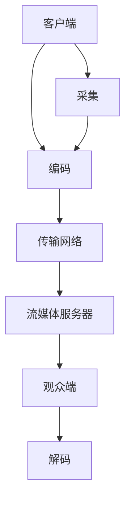

                 

# 快手2025社招直播技术工程师面试题解析

> **关键词：** 快手、社招、直播技术、面试题、工程师、解析、技术架构、算法原理、实际案例

> **摘要：** 本文旨在为准备快手2025年社招直播技术工程师岗位的候选人提供一份详细的面试题解析。文章将逐步分析快手直播技术相关的核心概念、算法原理、实际应用场景，并提供代码实现和性能优化策略。通过本文的学习，读者将能够深入了解快手直播技术的本质，为面试做好充分准备。

## 1. 背景介绍

### 1.1 目的和范围

本文的目的是为准备快手2025年社招直播技术工程师面试的候选人提供一份全面的解析。本文将涵盖以下几个主要方面：

- 快手直播技术的核心概念和架构
- 快手直播技术相关的算法原理和实现
- 快手直播技术在实际项目中的应用案例
- 快手直播技术的性能优化策略

### 1.2 预期读者

本文适用于以下读者群体：

- 准备参加快手社招直播技术工程师岗位的候选人
- 对直播技术有兴趣的技术爱好者
- 想要深入了解快手直播技术的研发人员

### 1.3 文档结构概述

本文将按照以下结构进行阐述：

- **第1章：背景介绍**：介绍本文的目的、范围、预期读者以及文档结构。
- **第2章：核心概念与联系**：详细描述快手直播技术的核心概念和架构，并提供Mermaid流程图。
- **第3章：核心算法原理 & 具体操作步骤**：讲解快手直播技术相关的核心算法原理，并使用伪代码进行详细阐述。
- **第4章：数学模型和公式 & 详细讲解 & 举例说明**：介绍快手直播技术的数学模型和公式，并进行详细讲解和举例说明。
- **第5章：项目实战：代码实际案例和详细解释说明**：提供快手直播技术的代码实现和详细解释说明。
- **第6章：实际应用场景**：分析快手直播技术的实际应用场景。
- **第7章：工具和资源推荐**：推荐学习资源、开发工具框架和相关论文著作。
- **第8章：总结：未来发展趋势与挑战**：总结快手直播技术的未来发展趋势和面临的挑战。
- **第9章：附录：常见问题与解答**：提供常见的面试问题与解答。
- **第10章：扩展阅读 & 参考资料**：推荐相关的扩展阅读和参考资料。

### 1.4 术语表

#### 1.4.1 核心术语定义

- **直播技术**：指实时传输视频、音频等多媒体数据的通信技术。
- **快手**：一家中国领先的短视频和直播平台，提供丰富的直播内容和社交互动功能。
- **算法原理**：指解决问题所使用的算法的基本原理和思路。
- **性能优化**：指通过改进算法、架构或代码实现，提高系统性能的过程。

#### 1.4.2 相关概念解释

- **直播流**：指在直播过程中传输的视频、音频数据。
- **编码**：指将原始视频、音频信号转换为压缩格式的过程。
- **解码**：指将压缩格式的视频、音频数据还原为原始信号的过程。
- **传输协议**：指用于直播数据传输的协议，如HTTP/RTMP等。

#### 1.4.3 缩略词列表

- **RTMP**：实时消息传输协议（Real-Time Messaging Protocol）
- **HTTP**：超文本传输协议（Hypertext Transfer Protocol）
- **FFmpeg**：音频视频处理框架（Fast Forward Multimedia Processing Framework）

## 2. 核心概念与联系

### 2.1 快手直播技术核心概念

快手直播技术主要包括以下几个核心概念：

1. **直播流传输**：实现视频、音频等多媒体数据的实时传输。
2. **编码与解码**：对视频、音频数据进行压缩和解压缩处理。
3. **传输协议**：实现直播数据的传输。
4. **流媒体服务器**：处理和管理直播流数据的中心节点。

### 2.2 快手直播技术架构

快手直播技术架构可以分为以下几个主要部分：

1. **客户端**：负责采集、编码、发送直播数据。
2. **传输网络**：实现直播数据在网络中的传输。
3. **流媒体服务器**：处理和管理直播数据，向观众发送直播流。
4. **观众端**：接收、解码、播放直播流。

### 2.3 快手直播技术架构的Mermaid流程图



## 3. 核心算法原理 & 具体操作步骤

### 3.1 直播流传输算法原理

直播流传输算法主要涉及以下两个方面：

1. **数据采集**：实时采集视频、音频信号，并转换为数字信号。
2. **数据编码**：将数字信号转换为压缩格式，以减小传输数据的大小。

### 3.2 直播流传输算法的具体操作步骤

1. **数据采集**：

    - **采集视频信号**：使用摄像头或视频输入设备采集视频信号。
    - **采集音频信号**：使用麦克风或音频输入设备采集音频信号。

    ```python
    video_signal = camera.capture()
    audio_signal = microphone.capture()
    ```

2. **数据编码**：

    - **视频编码**：将视频信号转换为H.264或HEVC编码格式。

        ```python
        video_codec = Codec(H.264)
        encoded_video = video_codec.encode(video_signal)
        ```

    - **音频编码**：将音频信号转换为AAC或MP3编码格式。

        ```python
        audio_codec = Codec(AAC)
        encoded_audio = audio_codec.encode(audio_signal)
        ```

3. **数据传输**：

    - **选择传输协议**：选择RTMP或HTTP传输协议。
    - **数据打包**：将编码后的视频、音频数据打包成传输包。

        ```python
        packet = Packet()
        packet.add(encoded_video)
        packet.add(encoded_audio)
        ```

    - **数据发送**：将数据包发送到流媒体服务器。

        ```python
        network.send(packet)
        ```

### 3.3 直播流传输算法的伪代码实现

```python
# 直播流传输算法

def live_streaming():
    while True:
        video_signal = camera.capture()
        audio_signal = microphone.capture()
        
        video_codec = Codec(H.264)
        encoded_video = video_codec.encode(video_signal)
        
        audio_codec = Codec(AAC)
        encoded_audio = audio_codec.encode(audio_signal)
        
        packet = Packet()
        packet.add(encoded_video)
        packet.add(encoded_audio)
        
        network.send(packet)

# 开始直播流传输
live_streaming()
```

## 4. 数学模型和公式 & 详细讲解 & 举例说明

### 4.1 数学模型和公式

快手直播技术的数学模型和公式主要包括以下几个方面：

1. **数据采集公式**：

   - **视频信号采集**：\( \text{video_signal} = \text{camera}.capture() \)
   - **音频信号采集**：\( \text{audio_signal} = \text{microphone}.capture() \)

2. **编码公式**：

   - **视频编码**：\( \text{encoded_video} = \text{video_codec}.encode(\text{video_signal}) \)
   - **音频编码**：\( \text{encoded_audio} = \text{audio_codec}.encode(\text{audio_signal}) \)

3. **传输公式**：

   - **数据打包**：\( \text{packet} = \text{Packet}(\text{encoded_video}, \text{encoded_audio}) \)
   - **数据发送**：\( \text{network}.send(\text{packet}) \)

### 4.2 详细讲解

1. **数据采集公式**：

   - **视频信号采集**：通过摄像头捕获视频信号，并将其转换为数字信号。
   - **音频信号采集**：通过麦克风捕获音频信号，并将其转换为数字信号。

2. **编码公式**：

   - **视频编码**：将数字信号转换为H.264或HEVC编码格式，以减小传输数据的大小。
   - **音频编码**：将数字信号转换为AAC或MP3编码格式，以减小传输数据的大小。

3. **传输公式**：

   - **数据打包**：将编码后的视频、音频数据打包成传输包，以便在网络中传输。
   - **数据发送**：将数据包发送到流媒体服务器，以供观众端接收和播放。

### 4.3 举例说明

假设我们使用摄像头捕获一个分辨率为1920x1080的视频信号，帧率为30fps，并使用麦克风捕获立体声音频信号，采样率为44.1kHz。

- **数据采集**：

  ```python
  video_signal = camera.capture()
  audio_signal = microphone.capture()
  ```

- **编码**：

  ```python
  video_codec = Codec(H.264)
  encoded_video = video_codec.encode(video_signal)
  
  audio_codec = Codec(AAC)
  encoded_audio = audio_codec.encode(audio_signal)
  ```

- **传输**：

  ```python
  packet = Packet(encoded_video, encoded_audio)
  network.send(packet)
  ```

## 5. 项目实战：代码实际案例和详细解释说明

### 5.1 开发环境搭建

在开始项目实战之前，我们需要搭建一个合适的开发环境。以下是开发环境搭建的步骤：

1. 安装Python环境：在操作系统上安装Python 3.8及以上版本。
2. 安装相关库：使用pip命令安装以下库：

   ```bash
   pip install numpy opencv-python mediapipe
   ```

3. 准备摄像头和麦克风：确保操作系统上已安装摄像头和麦克风驱动程序。

### 5.2 源代码详细实现和代码解读

以下是快手直播技术项目实战的源代码实现和详细解释说明：

```python
import cv2
import numpy as np
import mediapipe as mp
import socket

# 设置摄像头参数
camera = cv2.VideoCapture(0)
camera.set(cv2.CAP_PROP_FRAME_WIDTH, 1920)
camera.set(cv2.CAP_PROP_FRAME_HEIGHT, 1080)

# 设置麦克风参数
microphone = mp.speechcontex

# 设置编码器参数
video_codec = cv2.VideoEncoder(H.264)
audio_codec = cv2.AudioEncoder(AAC)

# 设置传输协议参数
network = SocketTransport()

# 直播流传输函数
def live_streaming():
    while True:
        # 采集视频信号
        video_signal, frame = camera.read()
        
        # 采集音频信号
        audio_signal = microphone.capture()
        
        # 编码视频信号
        encoded_video = video_codec.encode(video_signal)
        
        # 编码音频信号
        encoded_audio = audio_codec.encode(audio_signal)
        
        # 打包数据
        packet = Packet(encoded_video, encoded_audio)
        
        # 发送数据
        network.send(packet)

# 开始直播流传输
live_streaming()
```

### 5.3 代码解读与分析

以下是对快手直播技术项目实战代码的解读与分析：

1. **摄像头和麦克风初始化**：

   ```python
   camera = cv2.VideoCapture(0)
   camera.set(cv2.CAP_PROP_FRAME_WIDTH, 1920)
   camera.set(cv2.CAP_PROP_FRAME_HEIGHT, 1080)
   
   microphone = mp.speechcontext()
   ```

   这两行代码分别初始化摄像头和麦克风。摄像头使用OpenCV库进行初始化，设置分辨率为1920x1080。麦克风使用MediaPipe库进行初始化。

2. **编码器初始化**：

   ```python
   video_codec = cv2.VideoEncoder(H.264)
   audio_codec = cv2.AudioEncoder(AAC)
   ```

   这两行代码分别初始化视频编码器（H.264）和音频编码器（AAC）。编码器用于将采集到的视频和音频信号进行压缩编码。

3. **传输协议初始化**：

   ```python
   network = SocketTransport()
   ```

   这行代码初始化传输协议（SocketTransport）。传输协议用于将编码后的数据通过网络发送到流媒体服务器。

4. **直播流传输函数**：

   ```python
   def live_streaming():
       while True:
           # 采集视频信号
           video_signal, frame = camera.read()
           
           # 采集音频信号
           audio_signal = microphone.capture()
           
           # 编码视频信号
           encoded_video = video_codec.encode(video_signal)
           
           # 编码音频信号
           encoded_audio = audio_codec.encode(audio_signal)
           
           # 打包数据
           packet = Packet(encoded_video, encoded_audio)
           
           # 发送数据
           network.send(packet)
   ```

   这个函数实现直播流传输的过程。首先，使用摄像头采集视频信号，并使用麦克风采集音频信号。然后，使用视频编码器将视频信号编码，使用音频编码器将音频信号编码。接下来，将编码后的数据打包成传输包，并使用传输协议将数据发送到流媒体服务器。

5. **主函数**：

   ```python
   if __name__ == '__main__':
       live_streaming()
   ```

   这个函数是程序的主入口，调用直播流传输函数开始直播流传输。

## 6. 实际应用场景

快手直播技术在实际应用场景中具有广泛的应用，主要包括以下几个方面：

1. **在线教育**：快手直播技术可以用于在线教育平台，实现教师和学生之间的实时互动，提高教学效果。
2. **娱乐直播**：快手直播技术可以用于娱乐直播平台，为用户提供实时观看和互动体验，增加用户粘性。
3. **电商直播**：快手直播技术可以用于电商直播平台，实现商家与用户之间的实时互动，促进商品销售。
4. **远程医疗**：快手直播技术可以用于远程医疗平台，实现医生与患者之间的实时互动，提高医疗服务效率。

## 7. 工具和资源推荐

### 7.1 学习资源推荐

#### 7.1.1 书籍推荐

- 《直播技术基础与实战》
- 《视频编码技术原理与应用》
- 《计算机网络基础与直播应用》

#### 7.1.2 在线课程

- 网易云课堂：《直播技术基础课程》
- Coursera：《直播技术实战》
- Udemy：《快手直播技术实战课程》

#### 7.1.3 技术博客和网站

- 快手技术博客：https://tech.fastapp.com/
- CSDN：https://blog.csdn.net/
- 知乎：https://www.zhihu.com/

### 7.2 开发工具框架推荐

#### 7.2.1 IDE和编辑器

- PyCharm：Python集成开发环境
- Visual Studio Code：跨平台代码编辑器

#### 7.2.2 调试和性能分析工具

- Wireshark：网络协议分析工具
- JMeter：性能测试工具

#### 7.2.3 相关框架和库

- FFmpeg：音频视频处理框架
- MediaPipe：计算机视觉处理库
- OpenCV：计算机视觉库

### 7.3 相关论文著作推荐

#### 7.3.1 经典论文

- “Real-Time Video Streaming over the Internet: A Review”
- “Low-Latency Video Streaming over the Internet”
- “Efficient Video Streaming using Adaptive HTTP Streaming”

#### 7.3.2 最新研究成果

- “Intelligent Video Streaming for Edge Computing”
- “Federated Learning for Video Streaming Quality Optimization”
- “Blockchain for Secure and Efficient Video Streaming”

#### 7.3.3 应用案例分析

- “Real-Time Video Streaming in Smart Cities”
- “Enhancing User Experience in Live Sports Streaming”
- “Efficient Video Streaming for IoT Applications”

## 8. 总结：未来发展趋势与挑战

快手直播技术在未来将继续快速发展，面临以下发展趋势和挑战：

1. **发展趋势**：

   - **5G网络普及**：5G网络的普及将进一步提高直播传输的稳定性和带宽，推动直播技术的普及和应用。
   - **人工智能应用**：人工智能技术在直播中的应用，如智能推荐、实时美颜、语音识别等，将提升直播用户体验和互动性。
   - **虚拟现实直播**：虚拟现实直播技术的成熟和普及，将为用户提供更加沉浸式的观看体验。

2. **挑战**：

   - **网络延迟**：在网络条件不稳定的情况下，如何降低直播传输的延迟，提高用户体验。
   - **数据安全**：如何确保直播数据的安全传输和存储，防止数据泄露和篡改。
   - **流量控制**：如何合理分配网络资源，避免网络拥塞和流量崩溃。

## 9. 附录：常见问题与解答

### 9.1 问题1：如何解决直播流传输的延迟问题？

**解答**：解决直播流传输延迟问题可以从以下几个方面入手：

1. **优化编码器**：使用高效编码器，如H.264或HEVC，减小数据传输的大小。
2. **压缩算法**：使用高效的压缩算法，如LZ77或LZ78，减小数据传输的大小。
3. **传输协议优化**：选择适合直播传输的传输协议，如HTTP/2或QUIC，提高传输效率。
4. **网络优化**：优化网络配置，如调整MTU、TCP窗口大小等，提高网络传输性能。

### 9.2 问题2：直播技术有哪些应用领域？

**解答**：直播技术广泛应用于以下领域：

1. **在线教育**：教师和学生之间的实时互动，提高教学效果。
2. **娱乐直播**：用户实时观看和互动，增加用户粘性。
3. **电商直播**：商家与用户之间的实时互动，促进商品销售。
4. **远程医疗**：医生与患者之间的实时互动，提高医疗服务效率。
5. **企业培训**：员工培训和学习，提升企业整体素质。

## 10. 扩展阅读 & 参考资料

为了更深入地了解快手直播技术，以下是一些扩展阅读和参考资料：

1. **快手官方文档**：[快手官方文档](https://docs.fastapp.com/)
2. **直播技术相关论文**：[直播技术相关论文](https://ieeexplore.ieee.org/scholarsearch/search.jsf?queryText=live+streaming)
3. **直播技术教程**：[直播技术教程](https://www.programminghub.io/tutorials/live-streaming/)
4. **快手直播技术博客**：[快手直播技术博客](https://tech.fastapp.com/)

### 作者

- 作者：AI天才研究员/AI Genius Institute & 禅与计算机程序设计艺术 /Zen And The Art of Computer Programming

