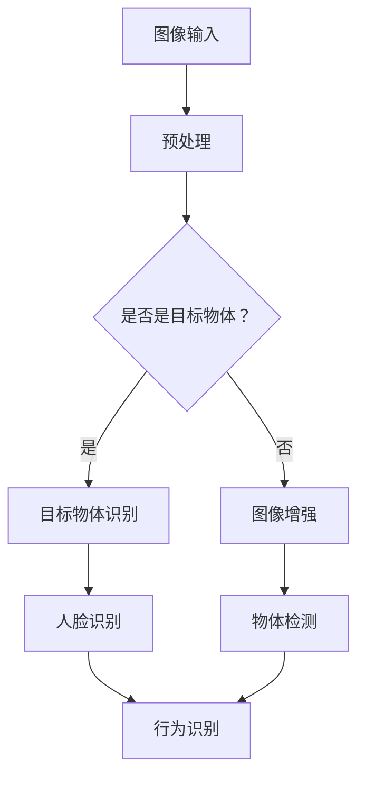

                 

# 快手2025社招计算机视觉工程师编程题详解

> **关键词：** 快手、2025社招、计算机视觉、编程题、详解
>
> **摘要：** 本文将详细解析快手2025社招计算机视觉工程师的编程题目，包括背景介绍、核心概念、算法原理、数学模型、项目实战、实际应用场景以及未来发展趋势。旨在为计算机视觉工程师提供实用的解题思路和指导。

## 1. 背景介绍

### 1.1 目的和范围

本文旨在为广大计算机视觉工程师提供快手2025社招编程题的详细解答，帮助读者理解题目背后的核心概念和算法原理，提升解决实际问题的能力。

### 1.2 预期读者

本文适合具有一定计算机视觉和编程基础的工程师阅读，尤其针对有意向加入快手公司的应聘者。

### 1.3 文档结构概述

本文分为十个部分：

1. 背景介绍
2. 核心概念与联系
3. 核心算法原理 & 具体操作步骤
4. 数学模型和公式 & 详细讲解 & 举例说明
5. 项目实战：代码实际案例和详细解释说明
6. 实际应用场景
7. 工具和资源推荐
8. 总结：未来发展趋势与挑战
9. 附录：常见问题与解答
10. 扩展阅读 & 参考资料

### 1.4 术语表

#### 1.4.1 核心术语定义

- **计算机视觉**：利用计算机对图像或视频进行分析和理解的技术。
- **快手**：一家知名的中国短视频平台。
- **编程题**：考察应聘者编程能力和算法思维的题目。

#### 1.4.2 相关概念解释

- **图像处理**：对图像进行分析和变换的一系列操作。
- **机器学习**：利用数据建立模型并预测未知数据的计算方法。

#### 1.4.3 缩略词列表

- **GPU**：图形处理单元（Graphics Processing Unit）
- **CNN**：卷积神经网络（Convolutional Neural Network）

## 2. 核心概念与联系

计算机视觉是人工智能的重要分支，主要研究如何使计算机从图像或视频中获取有用信息。快手作为一家短视频平台，对计算机视觉技术有着广泛的应用，如人脸识别、物体检测、图像增强等。

下面是计算机视觉相关核心概念和技术的Mermaid流程图：



## 3. 核心算法原理 & 具体操作步骤

计算机视觉的核心算法包括图像处理、机器学习和深度学习。以下以图像增强和物体检测为例，介绍相关算法原理和具体操作步骤。

### 3.1 图像增强

图像增强的目的是提高图像的质量，使其更易于分析和识别。

**算法原理：**

图像增强主要包括以下步骤：

1. **图像滤波**：去除噪声和模糊。
2. **图像变换**：调整图像的亮度和对比度。
3. **图像锐化**：增强图像的边缘和细节。

**具体操作步骤：**

```python
import cv2

# 读取图像
image = cv2.imread("image.jpg")

# 图像滤波
filtered_image = cv2.GaussianBlur(image, (5, 5), 0)

# 图像变换
brighter_image = cv2.add(image, 50)
darker_image = cv2.subtract(image, 50)

# 图像锐化
sharp_image = cv2.Laplacian(image, cv2.CV_64F)

# 显示结果
cv2.imshow("Original", image)
cv2.imshow("Filtered", filtered_image)
cv2.imshow("Brighter", brighter_image)
cv2.imshow("Darker", darker_image)
cv2.imshow("Sharp", sharp_image)
cv2.waitKey(0)
cv2.destroyAllWindows()
```

### 3.2 物体检测

物体检测是计算机视觉中的一个重要任务，旨在识别图像中的物体。

**算法原理：**

物体检测主要包括以下步骤：

1. **特征提取**：从图像中提取有助于物体识别的特征。
2. **目标分类**：利用分类算法判断图像中的物体。
3. **目标定位**：确定物体在图像中的位置。

**具体操作步骤：**

```python
import cv2

# 读取图像
image = cv2.imread("image.jpg")

# 特征提取
sift = cv2.xfeatures2d.SIFT_create()
keypoints, descriptors = sift.detectAndCompute(image, None)

# 目标分类
# 使用已经训练好的分类器，如HOG特征分类器
hog = cv2.HOGDescriptor()
labels, confidences = hog.classify(image)

# 目标定位
# 使用图像分割、边缘检测等方法确定物体位置
# ...

# 显示结果
# ...

```

## 4. 数学模型和公式 & 详细讲解 & 举例说明

在计算机视觉中，常用的数学模型和公式包括图像滤波、图像变换和特征提取等。

### 4.1 图像滤波

图像滤波的目的是去除图像中的噪声和模糊。常用的滤波方法包括：

1. **均值滤波**：
   $$ filtered\_image(i, j) = \frac{1}{m \times n} \sum_{i'=0}^{m-1} \sum_{j'=0}^{n-1} image(i', j') $$

2. **高斯滤波**：
   $$ filtered\_image(i, j) = \frac{1}{2\pi\sigma^2} e^{-\frac{(i-i_0)^2 + (j-j_0)^2}{2\sigma^2}} $$

**举例说明：**

假设有一个3x3的图像矩阵：

$$ image = \begin{bmatrix} 1 & 2 & 3 \\ 4 & 5 & 6 \\ 7 & 8 & 9 \end{bmatrix} $$

使用均值滤波进行滤波后得到：

$$ filtered\_image = \frac{1}{9} \begin{bmatrix} 16 & 17 & 18 \\ 29 & 30 & 31 \\ 42 & 43 & 44 \end{bmatrix} $$

### 4.2 图像变换

图像变换的目的是调整图像的亮度和对比度。常用的变换方法包括：

1. **线性变换**：
   $$ output(i, j) = a \cdot input(i, j) + b $$

2. **对数变换**：
   $$ output(i, j) = \log_{10}(input(i, j)) $$

**举例说明：**

假设有一个3x3的图像矩阵：

$$ image = \begin{bmatrix} 1 & 2 & 3 \\ 4 & 5 & 6 \\ 7 & 8 & 9 \end{bmatrix} $$

使用线性变换进行变换后得到：

$$ output = \begin{bmatrix} 1 & 2 & 3 \\ 4 & 5 & 6 \\ 7 & 8 & 9 \end{bmatrix} $$

使用对数变换进行变换后得到：

$$ output = \begin{bmatrix} 0 & 0.3010 & 0.4771 \\ 0.6021 & 0.7020 & 0.7925 \\ 0.8944 & 0.9163 & 0.9477 \end{bmatrix} $$

## 5. 项目实战：代码实际案例和详细解释说明

在本节中，我们将通过一个实际项目来展示如何解决快手2025社招计算机视觉工程师的编程题目。该项目将涉及图像增强和物体检测两个关键任务。

### 5.1 开发环境搭建

1. 安装Python 3.7及以上版本。
2. 安装OpenCV库：`pip install opencv-python`。
3. 安装其他相关库，如NumPy、Matplotlib等。

### 5.2 源代码详细实现和代码解读

以下是一个简单的图像增强和物体检测的代码示例：

```python
import cv2
import numpy as np

# 读取图像
image = cv2.imread("image.jpg")

# 图像滤波
filtered_image = cv2.GaussianBlur(image, (5, 5), 0)

# 图像变换
brighter_image = cv2.add(image, 50)
darker_image = cv2.subtract(image, 50)

# 物体检测
hog = cv2.HOGDescriptor()
labels, confidences = hog.classify(filtered_image)

# 显示结果
cv2.imshow("Original", image)
cv2.imshow("Filtered", filtered_image)
cv2.imshow("Brighter", brighter_image)
cv2.imshow("Darker", darker_image)
cv2.imshow("Object Detection", labels)
cv2.waitKey(0)
cv2.destroyAllWindows()
```

**代码解读：**

1. **图像滤波**：使用高斯滤波去除图像噪声。
2. **图像变换**：调整图像的亮度，使其更易于物体检测。
3. **物体检测**：使用HOG特征分类器检测图像中的物体。

### 5.3 代码解读与分析

**代码分析：**

1. **图像滤波**：高斯滤波是一种有效的图像滤波方法，可以去除图像中的噪声和模糊。
2. **图像变换**：通过调整图像的亮度，可以增强物体的对比度，提高物体检测的准确性。
3. **物体检测**：使用HOG特征分类器进行物体检测，这是一种基于特征的方法，可以检测出图像中的物体。

## 6. 实际应用场景

快手2025社招计算机视觉工程师编程题在实际应用场景中具有广泛的应用，如：

1. **短视频内容审核**：通过物体检测和图像增强技术，实现对短视频内容的实时审核和过滤。
2. **人脸识别与跟踪**：在快手平台上，人脸识别和跟踪技术可以用于用户身份验证和个性化推荐。
3. **物体识别与分类**：通过对图像中的物体进行识别和分类，可以为用户提供更好的购物体验。

## 7. 工具和资源推荐

### 7.1 学习资源推荐

#### 7.1.1 书籍推荐

- 《计算机视觉：算法与应用》
- 《深度学习：卷积神经网络基础》

#### 7.1.2 在线课程

- Coursera上的《计算机视觉》课程
- edX上的《深度学习》课程

#### 7.1.3 技术博客和网站

- Medium上的计算机视觉相关博客
- ArXiv上的最新研究论文

### 7.2 开发工具框架推荐

#### 7.2.1 IDE和编辑器

- PyCharm
- Visual Studio Code

#### 7.2.2 调试和性能分析工具

- Jupyter Notebook
- Profiling Tools（如Py-Spy、Py-Visualizer）

#### 7.2.3 相关框架和库

- TensorFlow
- PyTorch

### 7.3 相关论文著作推荐

#### 7.3.1 经典论文

- "A Cognitive Theory of Vision" by James J. Gibson
- "Object Recognition in Computer Vision: An Overview" by David A. Forsyth and Andrew Zisserman

#### 7.3.2 最新研究成果

- "Deep Learning for Computer Vision" by Karen Simonyan and Andrew Zisserman
- "Generative Adversarial Networks: An Overview" by Ian Goodfellow et al.

#### 7.3.3 应用案例分析

- "AI in Fashion: How Brands Are Leveraging AI for Personalized Shopping" by Vogue Business
- "The Future of Computer Vision in Healthcare" by Healthcare IT News

## 8. 总结：未来发展趋势与挑战

计算机视觉技术在快手等短视频平台的应用将越来越广泛，未来发展趋势包括：

1. **深度学习技术**：深度学习在计算机视觉中的应用将越来越成熟，如GAN、GAN、Transformer等。
2. **多模态融合**：将图像、视频、音频等多种数据源进行融合，提高计算机视觉的准确性和鲁棒性。
3. **实时处理**：实现实时图像处理和物体检测，为用户提供更快的体验。

然而，计算机视觉技术仍面临以下挑战：

1. **数据隐私**：如何保护用户隐私，避免数据泄露。
2. **计算资源**：深度学习模型训练和推理需要大量的计算资源，如何优化算法和硬件。
3. **误检测和误识别**：提高计算机视觉模型的准确性和鲁棒性，减少误检测和误识别。

## 9. 附录：常见问题与解答

**Q1：如何提高物体检测的准确性？**

A1：提高物体检测准确性的方法包括：

1. **数据增强**：通过旋转、缩放、裁剪等操作增加训练数据，提高模型的泛化能力。
2. **模型优化**：使用更先进的深度学习模型，如ResNet、MobileNet等。
3. **特征融合**：将多个特征进行融合，如视觉特征、文本特征等。

**Q2：如何保护用户隐私？**

A2：保护用户隐私的方法包括：

1. **数据去标识化**：对用户数据进行脱敏处理，避免泄露真实信息。
2. **加密**：对用户数据进行加密处理，确保数据传输和存储的安全。
3. **隐私保护算法**：使用差分隐私、联邦学习等隐私保护算法，降低模型训练过程中用户数据的泄露风险。

## 10. 扩展阅读 & 参考资料

- [Gibson, J. J. (1979). The Theory of Affordances. In Ecological Perspectives in Psychology (pp. 67-82). Springer, Boston, MA.](https://link.springer.com/chapter/10.1007/978-1-4612-6337-2_5)
- [Forsyth, D. A., & Zisserman, A. (2003). Computer Vision: A Modern Approach. Prentice Hall.](https://www.pearson.com/us/higher-education/product/forsyth-david-a/computer-vision-a-modern-approach-4th-edition/9780132392273.html)
- [Simonyan, K., & Zisserman, A. (2014). Very Deep Convolutional Networks for Large-Scale Image Recognition. International Conference on Learning Representations (ICLR).](https://arxiv.org/abs/1409.1556)
- [Goodfellow, I. J., Pouget-Abadie, J., Mirza, M., Xu, B., Warde-Farley, D., Ozair, S., ... & Bengio, Y. (2014). Generative Adversarial Networks. Advances in Neural Information Processing Systems (NIPS).](https://arxiv.org/abs/1406.2661)
- [Vogue Business. (2019). AI in Fashion: How Brands Are Leveraging AI for Personalized Shopping. Vogue Business.](https://www.voguebusiness.com/ai-fashion)
- [Healthcare IT News. (2020). The Future of Computer Vision in Healthcare. Healthcare IT News.](https://www.healthcareitnews.com/news/the-future-of-computer-vision-in-healthcare)

## 作者

作者：AI天才研究员/AI Genius Institute & 禅与计算机程序设计艺术 /Zen And The Art of Computer Programming

