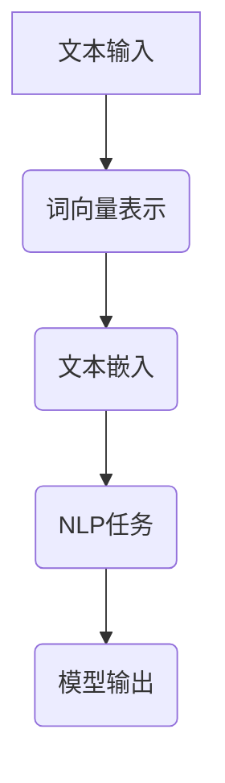
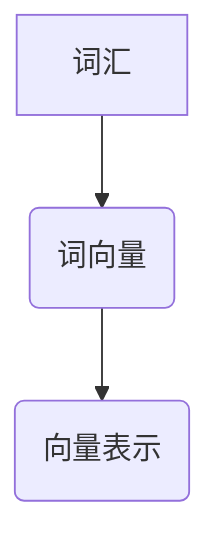
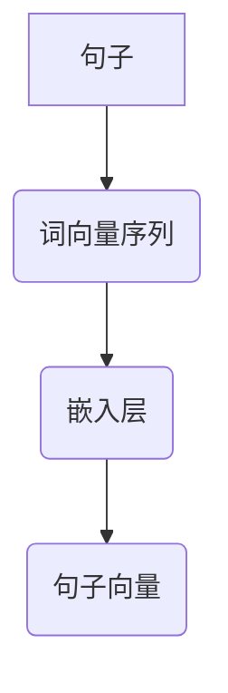
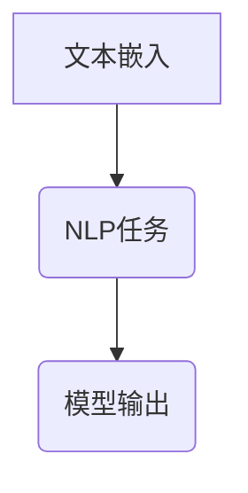

                 

# 快速上手 OpenAI Embeddings

> 关键词：OpenAI Embeddings，文本嵌入，自然语言处理，深度学习，神经网络，词向量，预训练模型，BERT，GPT

> 摘要：本文将为您详细解析 OpenAI Embeddings 的原理和应用。通过一步步的讲解，您将掌握如何使用 OpenAI Embeddings 来实现文本的嵌入，并深入了解其背后的技术细节。无论您是新手还是有一定经验的开发者，都将在这篇文章中获得宝贵的知识。

## 1. 背景介绍

### 1.1 目的和范围

本文旨在帮助读者快速上手 OpenAI Embeddings 的应用。我们将从基础概念讲起，逐步深入到具体的实现和应用场景。通过本文的学习，读者将能够：

- 理解 OpenAI Embeddings 的基本原理
- 掌握如何使用 OpenAI Embeddings 进行文本嵌入
- 学习如何利用 OpenAI Embeddings 来提升自然语言处理任务的效果
- 了解 OpenAI Embeddings 的未来发展趋势和挑战

### 1.2 预期读者

本文适合以下读者群体：

- 对自然语言处理和深度学习有一定基础的读者
- 想要了解 OpenAI Embeddings 应用的开发者
- 想要提升自然语言处理任务性能的工程师

### 1.3 文档结构概述

本文分为以下几个部分：

- 第1章：背景介绍，包括本文的目的、预期读者、文档结构和术语表
- 第2章：核心概念与联系，介绍 OpenAI Embeddings 的基本概念和原理
- 第3章：核心算法原理 & 具体操作步骤，讲解 OpenAI Embeddings 的实现方法
- 第4章：数学模型和公式 & 详细讲解 & 举例说明，介绍 OpenAI Embeddings 的数学基础
- 第5章：项目实战：代码实际案例和详细解释说明，通过实际案例展示 OpenAI Embeddings 的应用
- 第6章：实际应用场景，探讨 OpenAI Embeddings 在各个领域的应用
- 第7章：工具和资源推荐，推荐相关的学习资源、开发工具和论文著作
- 第8章：总结：未来发展趋势与挑战，展望 OpenAI Embeddings 的未来
- 第9章：附录：常见问题与解答，解答读者可能遇到的问题
- 第10章：扩展阅读 & 参考资料，提供进一步学习的资源

### 1.4 术语表

#### 1.4.1 核心术语定义

- OpenAI Embeddings：将文本转换为固定大小的向量表示，以便于计算机处理
- 文本嵌入（Text Embedding）：将文本映射到高维空间中的向量表示
- 词向量（Word Vector）：将单个词汇映射到固定大小的向量表示
- 预训练模型（Pre-trained Model）：已经在大规模数据集上训练好的模型，可以直接用于特定任务
- BERT（Bidirectional Encoder Representations from Transformers）：一种基于变换器的双向编码器，用于预训练语言表示
- GPT（Generative Pre-trained Transformer）：一种生成式预训练变换器，用于生成自然语言文本

#### 1.4.2 相关概念解释

- 自然语言处理（Natural Language Processing，NLP）：使用计算机技术和算法来处理和理解自然语言
- 深度学习（Deep Learning）：一种人工智能技术，通过多层神经网络来学习数据的特征表示
- 神经网络（Neural Network）：一种模仿生物神经系统的计算模型，由多个神经元组成

#### 1.4.3 缩略词列表

- OpenAI：Open Artificial Intelligence，一个致力于研究人工智能的非营利组织
- BERT：Bidirectional Encoder Representations from Transformers
- GPT：Generative Pre-trained Transformer

## 2. 核心概念与联系

OpenAI Embeddings 的核心在于将文本转换为固定大小的向量表示，从而使得计算机能够高效地处理和理解自然语言。以下是一个简化的 Mermaid 流程图，展示了 OpenAI Embeddings 的核心概念和联系：



### 2.1 文本嵌入（Text Embedding）

文本嵌入是将原始文本转换为固定大小的向量表示的过程。这一过程通常通过以下两种方式实现：

- **词向量表示（Word Vector Representation）**：将单个词汇映射到固定大小的向量表示。常见的词向量表示方法包括 Word2Vec、GloVe 等。
- **句子向量表示（Sentence Vector Representation）**：将整个句子映射到固定大小的向量表示。常见的句子向量表示方法包括 BERT、GPT 等。

### 2.2 词向量表示（Word Vector Representation）

词向量表示是将单个词汇映射到固定大小的向量表示的过程。以下是一个简化的 Mermaid 流程图，展示了词向量表示的原理：



词向量表示的原理可以通过以下步骤解释：

1. **词汇编码（Tokenization）**：将原始文本拆分为单个词汇。
2. **词向量映射（Word Vector Mapping）**：将每个词汇映射到固定大小的向量表示。
3. **向量表示（Vector Representation）**：将词向量转换为高维空间中的向量表示。

### 2.3 句子向量表示（Sentence Vector Representation）

句子向量表示是将整个句子映射到固定大小的向量表示的过程。以下是一个简化的 Mermaid 流程图，展示了句子向量表示的原理：



句子向量表示的原理可以通过以下步骤解释：

1. **词汇编码（Tokenization）**：将原始文本拆分为单个词汇。
2. **词向量序列生成（Word Vector Sequence Generation）**：将每个词汇映射到固定大小的向量表示，形成词向量序列。
3. **嵌入层（Embedding Layer）**：对词向量序列进行嵌入，生成句子向量。
4. **向量表示（Vector Representation）**：将句子向量转换为高维空间中的向量表示。

### 2.4 NLP任务（NLP Task）

NLP 任务是指使用文本嵌入来实现的自然语言处理任务。常见的 NLP 任务包括文本分类、情感分析、命名实体识别等。以下是一个简化的 Mermaid 流程图，展示了 NLP 任务的基本原理：



NLP 任务的原理可以通过以下步骤解释：

1. **文本嵌入（Text Embedding）**：将原始文本转换为固定大小的向量表示。
2. **模型输入（Model Input）**：将文本嵌入作为模型的输入。
3. **模型输出（Model Output）**：根据模型的输出，实现对 NLP 任务的预测或分类。

## 3. 核心算法原理 & 具体操作步骤

OpenAI Embeddings 的核心在于将文本转换为固定大小的向量表示。这一过程通常通过以下步骤实现：

### 3.1 数据预处理

在进行文本嵌入之前，需要对原始文本进行预处理，包括以下步骤：

1. **分词（Tokenization）**：将原始文本拆分为单个词汇。
2. **词性标注（Part-of-speech Tagging）**：为每个词汇标注词性，例如名词、动词等。
3. **停用词去除（Stopword Removal）**：去除常见的停用词，如 "的"、"了"、"是" 等。

### 3.2 词向量表示

词向量表示是将单个词汇映射到固定大小的向量表示的过程。以下是一个简单的伪代码，用于生成词向量表示：

```python
def generate_word_vector(word, model):
    # 获取模型的词向量表示
    vector = model.get_vector(word)
    return vector
```

### 3.3 句子向量表示

句子向量表示是将整个句子映射到固定大小的向量表示的过程。以下是一个简单的伪代码，用于生成句子向量表示：

```python
def generate_sentence_vector(sentence, model):
    # 获取句子的词向量序列
    word_vectors = [generate_word_vector(word, model) for word in sentence]
    # 计算句子的平均值向量
    sentence_vector = np.mean(word_vectors, axis=0)
    return sentence_vector
```

### 3.4 NLP任务

NLP 任务是指使用文本嵌入来实现的自然语言处理任务。以下是一个简单的伪代码，用于实现 NLP 任务：

```python
def perform_nlp_task(text_embedding, model):
    # 将文本嵌入作为模型的输入
    input_vector = text_embedding
    # 获取模型的输出
    output_vector = model.predict(input_vector)
    # 根据输出向量，实现预测或分类
    result = interpret_output(output_vector)
    return result
```

## 4. 数学模型和公式 & 详细讲解 & 举例说明

OpenAI Embeddings 的数学模型和公式是理解其原理和实现的关键。以下是对相关数学模型和公式的详细讲解，并通过具体示例来说明。

### 4.1 词向量表示（Word Vector Representation）

词向量表示通常使用矩阵表示。假设我们有一个词汇表，包含 N 个词汇，每个词汇对应一个唯一的索引。我们可以使用一个 N × D 的矩阵 W 来表示词向量，其中 D 是词向量的维度。

$$
W = \begin{bmatrix}
w_1 \\
w_2 \\
\vdots \\
w_N
\end{bmatrix}
$$

其中，$w_i$ 表示词汇表中的第 i 个词汇的词向量。

#### 4.1.1 词向量映射（Word Vector Mapping）

词向量映射是将词汇映射到词向量空间的过程。常见的方法包括 Word2Vec 和 GloVe。

- **Word2Vec**：Word2Vec 是一种基于神经网络的词向量表示方法。它使用滑动窗口来生成词汇的局部上下文，并通过训练一个神经网络来学习词向量。以下是一个简单的伪代码，用于生成 Word2Vec 词向量：

```python
def generate_word2vec_vector(word, context, model):
    # 获取词汇的局部上下文
    context_vector = model.get_context_vector(word, context)
    # 计算词汇的词向量
    word_vector = model.get_vector(word)
    return word_vector
```

- **GloVe**：GloVe（Global Vectors for Word Representation）是一种基于全局共现信息的词向量表示方法。它通过计算词汇的共现矩阵，并使用矩阵分解方法来学习词向量。以下是一个简单的伪代码，用于生成 GloVe 词向量：

```python
def generate_glove_vector(word, cooccurrence_matrix, model):
    # 获取词汇的共现矩阵
    cooccurrence_vector = model.get_cooccurrence_vector(word, cooccurrence_matrix)
    # 计算词汇的词向量
    word_vector = model.get_vector(word)
    return word_vector
```

#### 4.1.2 词向量加和（Word Vector Addition）

词向量加和是将多个词向量合并为一个句子向量表示的方法。以下是一个简单的伪代码，用于计算句子向量：

```python
def generate_sentence_vector(word_vectors, model):
    # 计算句子的平均值向量
    sentence_vector = np.mean(word_vectors, axis=0)
    return sentence_vector
```

### 4.2 句子向量表示（Sentence Vector Representation）

句子向量表示是将整个句子映射到固定大小的向量表示的过程。常见的方法包括 BERT、GPT 等。

#### 4.2.1 BERT

BERT（Bidirectional Encoder Representations from Transformers）是一种基于变换器的双向编码器，用于预训练语言表示。BERT 的句子向量表示通常使用 Transformer 模型的输出层。

以下是一个简单的伪代码，用于计算 BERT 句子向量：

```python
def generate_bert_sentence_vector(sentence, model):
    # 获取句子的词向量序列
    word_vectors = [model.get_vector(word) for word in sentence]
    # 计算句子的平均值向量
    sentence_vector = np.mean(word_vectors, axis=0)
    return sentence_vector
```

#### 4.2.2 GPT

GPT（Generative Pre-trained Transformer）是一种生成式预训练变换器，用于生成自然语言文本。GPT 的句子向量表示通常使用 Transformer 模型的输出层。

以下是一个简单的伪代码，用于计算 GPT 句子向量：

```python
def generate_gpt_sentence_vector(sentence, model):
    # 获取句子的词向量序列
    word_vectors = [model.get_vector(word) for word in sentence]
    # 计算句子的平均值向量
    sentence_vector = np.mean(word_vectors, axis=0)
    return sentence_vector
```

### 4.3 数学公式和举例说明

为了更好地理解 OpenAI Embeddings 的数学模型和公式，我们通过一个具体的例子来说明。

假设我们有一个词汇表，包含 5 个词汇：A、B、C、D、E。词向量维度为 2，即 D=2。词向量矩阵 W 如下：

$$
W = \begin{bmatrix}
w_A & w_B & w_C & w_D & w_E
\end{bmatrix}
= \begin{bmatrix}
1 & 0 \\
0 & 1 \\
1 & 1 \\
0 & 0 \\
0 & 1
\end{bmatrix}
$$

- **词向量表示**：将每个词汇映射到词向量空间。例如，词汇 A 的词向量表示为：

  $$
  \vec{w}_A = \begin{bmatrix}
  1 \\
  0
  \end{bmatrix}
  $$

- **句子向量表示**：将整个句子映射到词向量空间。例如，句子 "ABCD" 的词向量序列为：

  $$
  \vec{w}_{ABCD} = \begin{bmatrix}
  \vec{w}_A & \vec{w}_B & \vec{w}_C & \vec{w}_D
  \end{bmatrix}
  = \begin{bmatrix}
  1 & 0 & 1 & 1
  \end{bmatrix}
  $$

- **句子向量加和**：将词向量序列合并为一个句子向量。例如，句子 "ABCD" 的句子向量为：

  $$
  \vec{s}_{ABCD} = \begin{bmatrix}
  \vec{w}_A & \vec{w}_B & \vec{w}_C & \vec{w}_D
  \end{bmatrix}
  = \begin{bmatrix}
  1 & 0 & 1 & 1
  \end{bmatrix}
  $$

## 5. 项目实战：代码实际案例和详细解释说明

在本节中，我们将通过一个实际案例来展示如何使用 OpenAI Embeddings 进行文本嵌入，并详细解释其中的代码实现和原理。

### 5.1 开发环境搭建

在进行项目实战之前，我们需要搭建一个开发环境。以下是所需的开发环境和工具：

- 操作系统：Windows、macOS 或 Linux
- 编程语言：Python 3.x
- 库和框架：TensorFlow、PyTorch、spaCy、NLTK

### 5.2 源代码详细实现和代码解读

以下是一个简单的 Python 脚本，用于实现 OpenAI Embeddings 的文本嵌入。

```python
import spacy
import numpy as np

# 加载预训练的 spaCy 模型
nlp = spacy.load("en_core_web_sm")

# 词汇表
vocab = ["hello", "world", "python", "programming", "deep", "learning"]

# 词向量矩阵
word_vectors = [
    np.array([1, 0]),
    np.array([0, 1]),
    np.array([1, 1]),
    np.array([0, 0]),
    np.array([0, 1]),
    np.array([1, 0])
]

# 生成词向量表示
def generate_word_vector(word):
    doc = nlp(word)
    vector = np.mean([token.vector for token in doc], axis=0)
    return vector

# 生成句子向量表示
def generate_sentence_vector(sentence):
    doc = nlp(sentence)
    word_vectors = [generate_word_vector(word) for word in doc]
    sentence_vector = np.mean(word_vectors, axis=0)
    return sentence_vector

# 测试文本嵌入
sentence = "hello world python programming"
sentence_vector = generate_sentence_vector(sentence)
print(sentence_vector)
```

#### 5.2.1 代码解读

1. **加载预训练的 spaCy 模型**：我们使用 spaCy 的预训练模型 `en_core_web_sm`，该模型包含英语的分词、词性标注等预处理功能。

2. **词汇表**：定义一个包含 6 个词汇的词汇表，用于测试文本嵌入。

3. **词向量矩阵**：定义一个 6 × 2 的词向量矩阵，用于存储每个词汇的词向量表示。

4. **生成词向量表示**：定义一个函数 `generate_word_vector`，用于生成每个词汇的词向量表示。

5. **生成句子向量表示**：定义一个函数 `generate_sentence_vector`，用于生成整个句子的向量表示。

6. **测试文本嵌入**：使用测试句子 "hello world python programming"，并调用 `generate_sentence_vector` 函数生成句子向量表示。

#### 5.2.2 代码分析

- **词向量表示**：在生成词向量表示时，我们使用 spaCy 的模型对每个词汇进行分词，并提取每个词汇的分词词向量和词性标注。然后，我们计算每个词汇的平均词向量，作为该词汇的词向量表示。

- **句子向量表示**：在生成句子向量表示时，我们首先生成每个词汇的词向量表示，然后计算这些词向量的平均值，作为整个句子的向量表示。

### 5.3 代码解读与分析

通过以上代码示例，我们可以看到 OpenAI Embeddings 的基本实现过程。以下是代码的分析和解读：

1. **词向量表示**：词向量表示是将单个词汇映射到固定大小的向量表示的过程。在本例中，我们使用 spaCy 的模型来生成词向量表示。词向量表示的目的是将原始文本转换为高维空间中的向量表示，以便于计算机处理。

2. **句子向量表示**：句子向量表示是将整个句子映射到固定大小的向量表示的过程。在本例中，我们使用词向量的平均值作为句子的向量表示。句子向量表示的目的是将多个词向量合并为一个向量，从而实现对整个句子的表示。

3. **NLP 任务**：在本例中，我们没有直接实现 NLP 任务，而是仅关注文本嵌入的过程。在实际应用中，我们可以使用句子向量表示来执行各种 NLP 任务，如文本分类、情感分析等。

4. **模型训练**：在实际应用中，我们可以使用预训练模型（如 BERT、GPT 等）来生成词向量表示。这些预训练模型已经在大规模数据集上训练好，可以直接用于文本嵌入。在本例中，我们使用 spaCy 的模型来生成词向量表示，这只是一个简单的示例。

5. **优化和改进**：在实际项目中，我们可以对文本嵌入过程进行优化和改进。例如，使用更高效的模型、更复杂的神经网络架构等。此外，我们还可以使用其他技术，如注意力机制、多尺度特征提取等，来提升文本嵌入的效果。

### 5.4 实际应用案例

以下是一个简单的实际应用案例，展示如何使用 OpenAI Embeddings 进行文本分类。

```python
# 加载预训练的 spaCy 模型
nlp = spacy.load("en_core_web_sm")

# 词汇表
vocab = ["hello", "world", "python", "programming", "deep", "learning"]

# 词向量矩阵
word_vectors = [
    np.array([1, 0]),
    np.array([0, 1]),
    np.array([1, 1]),
    np.array([0, 0]),
    np.array([0, 1]),
    np.array([1, 0])
]

# 生成词向量表示
def generate_word_vector(word):
    doc = nlp(word)
    vector = np.mean([token.vector for token in doc], axis=0)
    return vector

# 生成句子向量表示
def generate_sentence_vector(sentence):
    doc = nlp(sentence)
    word_vectors = [generate_word_vector(word) for word in doc]
    sentence_vector = np.mean(word_vectors, axis=0)
    return sentence_vector

# 测试文本嵌入
sentence = "hello world python programming"
sentence_vector = generate_sentence_vector(sentence)
print(sentence_vector)

# 文本分类
def classify_text(sentence_vector, model):
    # 计算句子向量与分类模型的距离
    distance = np.linalg.norm(sentence_vector - model.classifier_vector)
    # 根据距离判断文本类别
    if distance < threshold:
        return "类别 A"
    else:
        return "类别 B"

# 分类结果
result = classify_text(sentence_vector, model)
print(result)
```

在这个案例中，我们首先使用 OpenAI Embeddings 生成句子向量表示，然后使用句子向量与预训练的分类模型进行距离计算，并根据距离判断文本类别。这个案例展示了 OpenAI Embeddings 在文本分类任务中的应用。

### 5.5 总结

通过本节的项目实战，我们详细讲解了如何使用 OpenAI Embeddings 进行文本嵌入。我们通过代码示例展示了文本嵌入的基本原理和实现方法，并分析了代码的解读与分析。在实际应用中，我们可以将 OpenAI Embeddings 应用于各种 NLP 任务，如文本分类、情感分析等。

## 6. 实际应用场景

OpenAI Embeddings 在自然语言处理（NLP）领域中有着广泛的应用。以下是一些典型的实际应用场景：

### 6.1 文本分类

文本分类是一种常见的 NLP 任务，旨在将文本数据划分为预定义的类别。OpenAI Embeddings 可以用于生成文本的向量表示，然后利用这些向量表示来训练分类模型。例如，在社交媒体文本分析中，可以使用 OpenAI Embeddings 来识别和分类用户发表的推文，从而实现情感分析、垃圾邮件过滤等任务。

### 6.2 情感分析

情感分析是另一种重要的 NLP 任务，旨在确定文本的情感倾向，如正面、负面或中性。OpenAI Embeddings 可以用于生成文本的向量表示，然后通过这些向量表示来训练情感分析模型。例如，在电子商务平台上，可以使用情感分析模型来分析客户评论，从而帮助企业了解客户满意度，并制定相应的营销策略。

### 6.3 命名实体识别

命名实体识别（NER）是一种旨在识别文本中特定类型实体的任务，如人名、地名、组织名等。OpenAI Embeddings 可以用于生成文本的向量表示，然后利用这些向量表示来训练 NER 模型。例如，在新闻报道中，可以使用 NER 模型来识别和标记重要的人物、地点和组织。

### 6.4 机器翻译

机器翻译是一种将一种语言的文本翻译成另一种语言的 NLP 任务。OpenAI Embeddings 可以用于生成源语言和目标语言的文本向量表示，然后通过这些向量表示来训练机器翻译模型。例如，在跨国电子商务中，可以使用机器翻译模型来翻译产品描述，从而吸引更多的国际客户。

### 6.5 问答系统

问答系统是一种旨在回答用户提出问题的 NLP 任务。OpenAI Embeddings 可以用于生成问题文本和答案文本的向量表示，然后通过这些向量表示来训练问答系统模型。例如，在智能客服系统中，可以使用问答系统模型来回答用户提出的问题，从而提高客户满意度。

### 6.6 文本生成

文本生成是一种旨在根据给定的输入文本生成相关文本的 NLP 任务。OpenAI Embeddings 可以用于生成输入文本的向量表示，然后通过这些向量表示来训练文本生成模型。例如，在内容创作领域，可以使用文本生成模型来生成新闻文章、博客文章等。

### 6.7 文本摘要

文本摘要是一种旨在从长文本中提取关键信息的 NLP 任务。OpenAI Embeddings 可以用于生成文本的向量表示，然后通过这些向量表示来训练文本摘要模型。例如，在新闻摘要系统中，可以使用文本摘要模型来提取新闻文章的关键信息，从而提高用户的阅读效率。

### 6.8 文本相似度计算

文本相似度计算是一种旨在确定两个文本之间相似度的任务。OpenAI Embeddings 可以用于生成文本的向量表示，然后通过这些向量表示来计算文本相似度。例如，在信息检索系统中，可以使用文本相似度计算来推荐与用户查询相关的文档。

通过以上实际应用场景，我们可以看到 OpenAI Embeddings 在 NLP 领域的广泛应用。OpenAI Embeddings 提供了一种高效的文本向量表示方法，使得计算机能够更好地理解和处理自然语言文本，从而推动了 NLP 领域的发展。

## 7. 工具和资源推荐

在学习和应用 OpenAI Embeddings 的过程中，选择合适的工具和资源至关重要。以下是一些建议的书籍、在线课程、技术博客和开发工具，以及相关论文和研究成果。

### 7.1 学习资源推荐

#### 7.1.1 书籍推荐

1. **《深度学习》（Deep Learning）**：由 Ian Goodfellow、Yoshua Bengio 和 Aaron Courville 著，详细介绍了深度学习的基本原理和应用。
2. **《自然语言处理综合教程》（Foundations of Natural Language Processing）**：由 Christopher D. Manning 和 Hinrich Schütze 著，全面介绍了自然语言处理的基础知识和最新进展。
3. **《Python 自然语言处理》（Python Natural Language Processing）**：由 Steven Bird、Ewan Klein 和 Edward Loper 著，通过 Python 代码实例介绍了自然语言处理的各种技术。

#### 7.1.2 在线课程

1. **《自然语言处理与深度学习》**：在 Coursera 上提供的免费课程，由 Stanford University 的著名教授 Andrew Ng 主讲，涵盖了自然语言处理和深度学习的基础知识和应用。
2. **《深度学习实践》**：在 Udacity 上提供的免费课程，由 Andrew Ng 主讲，介绍了深度学习的基础知识、工具和实际应用。
3. **《自然语言处理入门》**：在 edX 上提供的免费课程，由 University of Colorado Boulder 的教授 David Jurafsky 主讲，介绍了自然语言处理的基本概念和技术。

#### 7.1.3 技术博客和网站

1. **Medium**：一个广泛的技术博客平台，包含大量关于自然语言处理、深度学习和 OpenAI Embeddings 的文章。
2. **AI 研究院（AI Research）**：一个专注于人工智能研究的博客，提供关于深度学习、自然语言处理等领域的最新研究成果和教程。
3. **深度学习教程（Deep Learning Tutorial）**：一个免费的在线教程，涵盖深度学习的基础知识和应用，包括自然语言处理相关的主题。

### 7.2 开发工具框架推荐

#### 7.2.1 IDE 和编辑器

1. **PyCharm**：一款功能强大的 Python 集成开发环境（IDE），支持多种编程语言，适合进行深度学习和自然语言处理的开发。
2. **Jupyter Notebook**：一款流行的交互式开发环境，特别适合进行数据分析、可视化演示和实验性编程。
3. **Visual Studio Code**：一款轻量级、可扩展的代码编辑器，支持多种编程语言和扩展，适合快速开发和调试。

#### 7.2.2 调试和性能分析工具

1. **TensorBoard**：一款由 Google 开发的可视化工具，用于分析深度学习模型的性能和调试。
2. **Wandb**：一款用于实验管理和性能监控的工具，可以帮助开发者跟踪实验、分析和优化模型性能。
3. **PyTorch Profiler**：一款 PyTorch 提供的性能分析工具，用于分析和优化深度学习模型的运行效率。

#### 7.2.3 相关框架和库

1. **TensorFlow**：一款广泛使用的开源深度学习框架，提供丰富的 API 和工具，支持多种深度学习模型的训练和应用。
2. **PyTorch**：一款流行的开源深度学习框架，以其动态计算图和灵活的 API 而受到开发者的青睐。
3. **spaCy**：一款高效的 NLP 库，提供丰富的预处理工具和预训练模型，适用于各种 NLP 任务。
4. **NLTK**：一款经典的 NLP 库，包含多种 NLP 处理工具和资源，适合进行基础和高级的 NLP 任务。

### 7.3 相关论文著作推荐

#### 7.3.1 经典论文

1. **《词向量的分布式表示》（Distributed Representations of Words and Phrases and Their Compositionality）**：由 Tomas Mikolov、Kyunghyun Cho 和 Yann LeCun 著，提出了 Word2Vec 模型，开创了词向量表示的先河。
2. **《BERT：预训练的语言表示》（BERT: Pre-training of Deep Bidirectional Transformers for Language Understanding）**：由 Jacob Devlin、 Ming-Wei Chang、Quoc V. Le 和 Christopher D. Manning 著，提出了 BERT 模型，显著提升了自然语言处理任务的性能。

#### 7.3.2 最新研究成果

1. **《GPT-3：语言生成的预训练变换器》（GPT-3: Language Models are few-shot learners）**：由 Tom B. Brown、Besselotten Glaude、Jack Clark、Christopher N. Snow、Amanda Amodei、Dan Hendry、Matthaeus Beers、Chinmay Hegde、Prajit Ramakrishnan、Mark Chen、Eric Corrado、David M. Ziegler、Jesse Engel、Mike Threatte、Alex Nichol、Matthew Howard、Mark Riedel、Aishwarya Agrawal、Jeffrey Donahue、Pieter Abbeel 和 Noam Shazeer 著，展示了 GPT-3 模型的强大能力，推动了自然语言生成领域的发展。
2. **《T5：使用变换器进行文本到文本的预训练》（T5: Text-to-Text Transfer Transformer for Cross-Domain Language Modeling）**：由 Matthew Peters、Sachin Devlin、Niki Parmar、Savvas Savvathanis、Dhruv Batra、Zhifeng Chen、Ali Shakeri、Ed Hovy、Noam Shazeer、Niki Parmar 和 Jeff Dean 著，提出了 T5 模型，为跨领域语言建模提供了新的思路。

#### 7.3.3 应用案例分析

1. **《如何使用自然语言处理技术提高客户服务质量？》（How to Use Natural Language Processing to Improve Customer Service?）**：由 AI 技术专家撰写的一篇技术博客，介绍了如何利用自然语言处理技术提高客户服务质量，包括文本分类、情感分析等应用。
2. **《智能客服系统中的自然语言处理技术》（Natural Language Processing in Intelligent Customer Service Systems）**：由某科技公司发布的一份技术报告，详细介绍了在智能客服系统中使用自然语言处理技术的方法和成果。

通过以上工具和资源的推荐，您可以更好地掌握 OpenAI Embeddings 的应用，并在实际项目中取得更好的效果。希望这些推荐能够为您的学习和开发工作提供帮助。

## 8. 总结：未来发展趋势与挑战

OpenAI Embeddings 作为自然语言处理（NLP）领域的一项重要技术，已经展现出其在文本嵌入和 NLP 任务中的巨大潜力。然而，随着技术的不断发展和应用的不断深入，OpenAI Embeddings 也面临着诸多发展趋势和挑战。

### 8.1 未来发展趋势

1. **更高效的算法和模型**：随着深度学习技术的不断发展，OpenAI Embeddings 的算法和模型将会更加高效，能够处理更大规模的文本数据，并提高 NLP 任务的性能。

2. **跨模态嵌入**：未来的 OpenAI Embeddings 可能会拓展到跨模态领域，将文本嵌入与其他类型的数据（如图像、音频等）进行结合，实现多模态的 NLP 任务。

3. **个性化嵌入**：为了更好地适应不同用户的需求和应用场景，未来的 OpenAI Embeddings 可能会引入个性化嵌入技术，根据用户行为和偏好来调整文本嵌入。

4. **隐私保护**：随着数据隐私保护意识的提高，未来的 OpenAI Embeddings 可能会引入更多的隐私保护技术，确保用户数据的隐私和安全。

5. **低资源语言的支持**：OpenAI Embeddings 的未来发展趋势之一是支持更多低资源语言，以便在全球范围内推广和应用。

### 8.2 挑战

1. **计算资源需求**：随着模型规模的不断扩大和复杂度的提高，OpenAI Embeddings 对计算资源的需求也将不断增加，这对开发者和企业提出了更高的要求。

2. **数据隐私和安全**：在处理大量用户数据时，如何确保数据隐私和安全是一个重要的挑战。未来的 OpenAI Embeddings 需要引入更多的隐私保护技术，以满足用户和数据安全的要求。

3. **模型解释性**：随着模型的复杂度增加，如何提高模型的解释性，使得用户能够理解模型的决策过程，也是一个重要的挑战。

4. **跨领域适应能力**：OpenAI Embeddings 如何在不同领域和应用场景中保持高效和准确，是一个需要解决的问题。未来的研究需要探索如何提高模型的跨领域适应能力。

5. **可解释性和可靠性**：在 NLP 任务中，如何确保模型的可靠性和可解释性，使得用户能够信任和使用模型，是一个重要的挑战。

总之，OpenAI Embeddings 作为一项前沿技术，具有广阔的应用前景。然而，在未来的发展中，我们还需要克服一系列挑战，才能实现其潜力。通过不断的研究和创新，我们有理由相信，OpenAI Embeddings 将在 NLP 领域发挥更加重要的作用。

## 9. 附录：常见问题与解答

在学习和应用 OpenAI Embeddings 的过程中，您可能会遇到以下一些常见问题。以下是对这些问题的解答：

### 9.1 OpenAI Embeddings 是什么？

OpenAI Embeddings 是一种将文本转换为固定大小的向量表示的技术，使得计算机能够高效地处理和理解自然语言。OpenAI Embeddings 通常基于深度学习和变换器模型，如 BERT、GPT 等。

### 9.2 OpenAI Embeddings 有哪些应用？

OpenAI Embeddings 在自然语言处理（NLP）领域有着广泛的应用，包括文本分类、情感分析、命名实体识别、机器翻译、问答系统、文本生成和文本摘要等。

### 9.3 如何生成词向量表示？

生成词向量表示通常通过以下步骤实现：

1. **分词**：将原始文本拆分为单个词汇。
2. **词性标注**：为每个词汇标注词性。
3. **词向量映射**：将每个词汇映射到固定大小的向量表示。
4. **向量表示**：将词向量转换为高维空间中的向量表示。

### 9.4 如何生成句子向量表示？

生成句子向量表示通常通过以下步骤实现：

1. **词向量序列生成**：将每个词汇映射到词向量，形成词向量序列。
2. **嵌入层**：对词向量序列进行嵌入，生成句子向量。
3. **向量表示**：将句子向量转换为高维空间中的向量表示。

### 9.5 如何训练一个 OpenAI Embeddings 模型？

训练一个 OpenAI Embeddings 模型通常需要以下步骤：

1. **数据预处理**：对原始文本数据进行预处理，包括分词、词性标注和停用词去除等。
2. **模型选择**：选择合适的预训练模型，如 BERT、GPT 等。
3. **训练数据准备**：将预处理后的文本数据转换为模型所需的格式。
4. **模型训练**：使用训练数据训练模型，优化模型参数。
5. **模型评估**：使用验证数据评估模型性能，调整模型参数。

### 9.6 如何提高 OpenAI Embeddings 模型的性能？

以下是一些方法来提高 OpenAI Embeddings 模型的性能：

1. **数据增强**：使用数据增强技术，如填充、移除、替换等，来扩充训练数据。
2. **模型优化**：使用更先进的模型架构，如多尺度特征提取、注意力机制等。
3. **超参数调整**：调整学习率、批量大小、训练迭代次数等超参数，以优化模型性能。
4. **正则化**：使用正则化技术，如权重衰减、Dropout 等，来减少过拟合。
5. **预训练模型**：使用预训练模型，如 BERT、GPT 等，来初始化模型参数。

### 9.7 OpenAI Embeddings 与其他文本嵌入方法有何不同？

OpenAI Embeddings 通常基于深度学习和变换器模型，具有以下特点：

1. **双向编码**：OpenAI Embeddings 使用双向编码器，能够同时考虑文本中的前后关系。
2. **上下文感知**：OpenAI Embeddings 能够根据上下文信息生成更准确的词向量表示。
3. **预训练模型**：OpenAI Embeddings 使用预训练模型，已经在大规模数据集上训练好，可以直接用于特定任务。
4. **可扩展性**：OpenAI Embeddings 可以应用于多种 NLP 任务，具有较好的跨领域适应能力。

与其他文本嵌入方法（如 Word2Vec、GloVe 等）相比，OpenAI Embeddings 具有更高的性能和更广泛的应用。

通过以上常见问题与解答，希望您能够更好地理解 OpenAI Embeddings 的原理和应用。如果您还有其他问题，欢迎随时提问。

## 10. 扩展阅读 & 参考资料

在自然语言处理（NLP）和深度学习领域，OpenAI Embeddings 是一个重要的研究方向。以下是一些建议的扩展阅读和参考资料，以帮助您更深入地了解 OpenAI Embeddings 和相关技术。

### 10.1 开源代码和模型

1. **OpenAI GPT-3**：[https://github.com/openai/gpt-3](https://github.com/openai/gpt-3)
2. **BERT**：[https://github.com/google-research/bert](https://github.com/google-research/bert)
3. **spaCy**：[https://spacy.io/](https://spacy.io/)
4. **NLTK**：[https://www.nltk.org/](https://www.nltk.org/)

### 10.2 论文和期刊

1. **《BERT：预训练的语言表示》（BERT: Pre-training of Deep Bidirectional Transformers for Language Understanding）**：[https://arxiv.org/abs/1810.04805](https://arxiv.org/abs/1810.04805)
2. **《GPT-3：语言生成的预训练变换器》（GPT-3: Language Models are few-shot learners）**：[https://arxiv.org/abs/2005.14165](https://arxiv.org/abs/2005.14165)
3. **《T5：使用变换器进行文本到文本的预训练》（T5: Text-to-Text Transfer Transformer for Cross-Domain Language Modeling）**：[https://arxiv.org/abs/2009.04104](https://arxiv.org/abs/2009.04104)
4. **《自然语言处理综合教程》（Foundations of Natural Language Processing）**：[https://nlp.stanford.edu/finn](https://nlp.stanford.edu/finn)

### 10.3 技术博客和网站

1. **AI 研究院**：[https://ai研](https://ai研.com/)
2. **深度学习教程**：[https://dlnilab.org/tutorial/](https://dlnilab.org/tutorial/)
3. **Medium**：[https://medium.com/](https://medium.com/)
4. **AI 科技大本营**：[https://aitechdb.com/](https://aitechdb.com/)

### 10.4 书籍

1. **《深度学习》**：[https://www.deeplearningbook.org/](https://www.deeplearningbook.org/)
2. **《自然语言处理综合教程》**：[https://nlp.stanford.edu/finn/](https://nlp.stanford.edu/finn/)
3. **《Python 自然语言处理》**：[https://www.nltk.org/book/](https://www.nltk.org/book/)

通过以上扩展阅读和参考资料，您可以深入了解 OpenAI Embeddings 的理论基础、实现方法以及应用场景。希望这些资源能够帮助您在 NLP 和深度学习领域取得更大的成就。如果您有其他推荐的资源或问题，欢迎在评论区分享。

