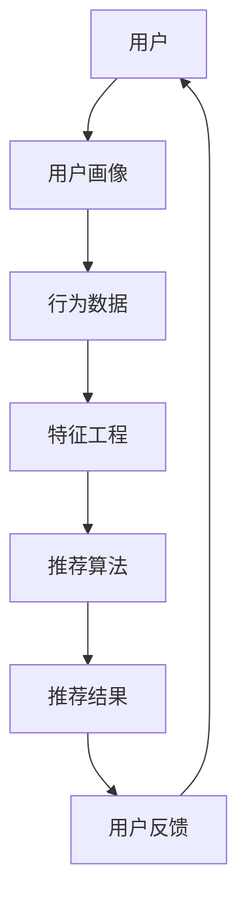

                 

# 快速响应：生成个性化推荐内容

> **关键词：** 快速响应，个性化推荐，机器学习，推荐系统，用户行为分析
>
> **摘要：** 本文将深入探讨如何利用机器学习和用户行为分析技术，实现快速响应的个性化推荐内容。通过详细的算法原理、数学模型以及实际项目案例，我们旨在为读者提供一个全面的技术解决方案，帮助他们理解和应用个性化推荐技术。

## 1. 背景介绍

### 1.1 目的和范围

本文旨在探讨如何通过机器学习和用户行为分析，快速响应用户需求，生成个性化推荐内容。我们将从推荐系统的基本概念入手，逐步深入到算法原理、数学模型和实际应用案例，以期为读者提供实用的技术指导和理论基础。

### 1.2 预期读者

本文适合以下读者群体：

- 对推荐系统有兴趣的程序员和软件工程师
- 想要在项目中应用推荐系统的产品经理和数据分析师
- 对机器学习和用户行为分析有一定了解，希望深入了解其应用的技术爱好者
- 想要在职业发展中拓展相关技能的技术人才

### 1.3 文档结构概述

本文分为以下章节：

- **第1章：背景介绍**：介绍本文的目的、预期读者和文档结构。
- **第2章：核心概念与联系**：阐述推荐系统的核心概念及其相互关系。
- **第3章：核心算法原理 & 具体操作步骤**：详细讲解推荐系统的算法原理和操作步骤。
- **第4章：数学模型和公式 & 详细讲解 & 举例说明**：介绍推荐系统的数学模型及其应用。
- **第5章：项目实战：代码实际案例和详细解释说明**：通过实际项目案例展示推荐系统的实现过程。
- **第6章：实际应用场景**：讨论推荐系统的应用场景和案例。
- **第7章：工具和资源推荐**：推荐学习资源和开发工具。
- **第8章：总结：未来发展趋势与挑战**：分析推荐系统的未来发展趋势和面临的挑战。
- **第9章：附录：常见问题与解答**：解答读者可能遇到的常见问题。
- **第10章：扩展阅读 & 参考资料**：提供进一步学习的资源。

### 1.4 术语表

#### 1.4.1 核心术语定义

- **推荐系统**：基于用户历史行为和偏好，为用户推荐相关内容的系统。
- **机器学习**：利用数据训练模型，实现计算机自动学习和预测的技术。
- **用户行为分析**：对用户在系统中的行为进行数据收集、分析和建模。
- **协同过滤**：通过分析用户之间的相似度，进行内容推荐的一种方法。
- **基于内容的推荐**：根据用户的历史行为和内容特征，进行内容推荐的一种方法。

#### 1.4.2 相关概念解释

- **用户画像**：对用户的兴趣、行为、偏好等进行数据化的描述。
- **特征工程**：在数据挖掘和机器学习过程中，对原始数据进行处理和转换，以提取有用的特征。
- **模型评估**：通过评估指标（如准确率、召回率等）来衡量模型性能。

#### 1.4.3 缩略词列表

- **ML**：Machine Learning，机器学习
- **CF**：Collaborative Filtering，协同过滤
- **CB**：Content-Based Filtering，基于内容的推荐
- **CTR**：Click-Through Rate，点击率
- **RMSE**：Root Mean Square Error，均方根误差

## 2. 核心概念与联系

在推荐系统中，核心概念和它们之间的联系是理解系统运作的基础。下面，我们将使用Mermaid流程图（见代码段）来阐述这些核心概念及其相互关系。

### 2.1. Mermaid流程图



### 2.2. 核心概念及其关系

- **用户**：推荐系统的核心，系统针对用户的行为和偏好提供个性化推荐。
- **用户画像**：通过对用户历史行为、偏好和兴趣进行数据化描述，构建用户的兴趣模型。
- **行为数据**：用户在系统中的各种行为数据，如浏览、点击、购买等，是构建用户画像的重要依据。
- **特征工程**：对原始行为数据进行处理和转换，提取对推荐系统有用的特征，如用户兴趣度、物品相关性等。
- **推荐算法**：利用用户画像和特征，结合算法模型进行推荐，如协同过滤、基于内容的推荐等。
- **推荐结果**：根据推荐算法生成的个性化推荐内容，展示给用户。
- **用户反馈**：用户对推荐内容的反馈，如点击、忽略等，用于模型优化和调整。

通过上述核心概念及其关系的阐述，我们可以更清晰地理解推荐系统的运作机制。接下来，我们将深入探讨推荐系统的核心算法原理和具体操作步骤。

## 3. 核心算法原理 & 具体操作步骤

推荐系统的工作原理主要基于两种核心算法：协同过滤（Collaborative Filtering，CF）和基于内容的推荐（Content-Based Filtering，CB）。下面，我们将详细讲解这两种算法的原理及其操作步骤。

### 3.1. 协同过滤（CF）

#### 3.1.1. 算法原理

协同过滤是一种通过分析用户之间的相似度，预测用户对未知物品评分的方法。其基本思想是“物以类聚，人以群分”，即相似的物品会被推荐给相似的用户。

#### 3.1.2. 操作步骤

1. **用户相似度计算**：
    - **用户-物品评分矩阵**：构建用户-物品评分矩阵，记录用户对物品的评分。
    - **余弦相似度**：计算用户之间的余弦相似度，公式如下：
    $$\text{similarity}_{ij} = \frac{\text{cosine}(\text{vector}_{i}, \text{vector}_{j})}{\|\text{vector}_{i}\| \|\text{vector}_{j}\|}$$
    - **修正评分预测**：根据相似度矩阵，对未知物品的评分进行预测，公式如下：
    $$\hat{r}_{ij} = \frac{\sum_{k \in N_j} r_{ik} \cdot \text{similarity}_{ik}}{\sum_{k \in N_j} \text{similarity}_{ik}}$$
    其中，$N_j$ 表示与用户 $j$ 相似的用户集合，$r_{ik}$ 表示用户 $i$ 对物品 $k$ 的评分。

2. **推荐列表生成**：
    - **评分预测**：对用户未评分的物品进行评分预测。
    - **排序和筛选**：根据评分预测结果，生成推荐列表，并按照评分高低进行排序。

### 3.2. 基于内容的推荐（CB）

#### 3.2.1. 算法原理

基于内容的推荐是一种根据用户的历史行为和物品的属性，为用户推荐相关内容的方法。其基本思想是“人以群分，物以类聚”，即用户的兴趣和物品的属性相关。

#### 3.2.2. 操作步骤

1. **特征提取**：
    - **用户特征**：提取用户的历史行为数据，如浏览记录、购买记录等，构建用户特征向量。
    - **物品特征**：提取物品的属性信息，如类别、标签、描述等，构建物品特征向量。

2. **相似度计算**：
    - **余弦相似度**：计算用户特征向量和物品特征向量之间的余弦相似度，公式如下：
    $$\text{similarity}_{ij} = \frac{\text{cosine}(\text{vector}_{u}, \text{vector}_{i})}{\|\text{vector}_{u}\| \|\text{vector}_{i}\|}$$

3. **推荐列表生成**：
    - **相似度排序**：根据物品特征和用户特征的相似度，生成相似度排序列表。
    - **筛选和排序**：根据用户兴趣和物品属性，筛选出符合条件的推荐内容，并按照相似度高低进行排序。

通过上述算法原理和操作步骤的详细阐述，我们可以更深入地理解协同过滤和基于内容的推荐两种核心算法。接下来，我们将进一步探讨推荐系统的数学模型和公式。

## 4. 数学模型和公式 & 详细讲解 & 举例说明

推荐系统的数学模型和公式是其算法设计和实现的基础。在本文中，我们将详细讲解推荐系统的核心数学模型，并使用LaTeX格式展示相关公式。此外，我们将通过具体例子来说明这些公式的应用。

### 4.1. 协同过滤（CF）数学模型

协同过滤的核心是用户相似度计算和评分预测。下面是相关公式及其解释：

#### 4.1.1. 用户相似度计算

假设我们有一个用户-物品评分矩阵 $R$，其中 $R_{ij}$ 表示用户 $i$ 对物品 $j$ 的评分。我们可以使用余弦相似度来计算用户之间的相似度，公式如下：

$$\text{similarity}_{ij} = \frac{\text{cosine}(\text{vector}_{i}, \text{vector}_{j})}{\|\text{vector}_{i}\| \|\text{vector}_{j}\|}$$

其中，$\text{vector}_{i}$ 和 $\text{vector}_{j}$ 分别表示用户 $i$ 和用户 $j$ 的特征向量，$\|\text{vector}_{i}\|$ 和 $\|\text{vector}_{j}\|$ 分别表示用户 $i$ 和用户 $j$ 的特征向量长度。

#### 4.1.2. 评分预测

给定用户相似度矩阵 $S$，我们可以通过以下公式预测用户 $i$ 对物品 $j$ 的评分：

$$\hat{r}_{ij} = \sum_{k \in N_j} r_{ik} \cdot s_{ik}$$

其中，$N_j$ 表示与用户 $j$ 相似的用户集合，$r_{ik}$ 表示用户 $i$ 对物品 $k$ 的评分，$s_{ik}$ 表示用户 $i$ 和用户 $j$ 之间的相似度。

### 4.2. 基于内容的推荐（CB）数学模型

基于内容的推荐主要涉及特征提取和相似度计算。下面是相关公式及其解释：

#### 4.2.1. 特征提取

假设我们有一个用户特征向量 $\text{vector}_{u}$ 和物品特征向量 $\text{vector}_{i}$，我们可以使用余弦相似度来计算它们之间的相似度，公式如下：

$$\text{similarity}_{ui} = \frac{\text{cosine}(\text{vector}_{u}, \text{vector}_{i})}{\|\text{vector}_{u}\| \|\text{vector}_{i}\|}$$

#### 4.2.2. 评分预测

给定用户特征向量 $\text{vector}_{u}$ 和物品特征向量 $\text{vector}_{i}$，我们可以使用以下公式预测用户 $u$ 对物品 $i$ 的评分：

$$\hat{r}_{ui} = \text{similarity}_{ui} \cdot \text{rating}_{ui}$$

其中，$\text{rating}_{ui}$ 表示用户 $u$ 对物品 $i$ 的实际评分。

### 4.3. 举例说明

假设我们有一个用户-物品评分矩阵 $R$，如下所示：

| 用户 | 物品 |
| ---- | ---- |
| 1    | A    |
| 1    | B    |
| 1    | C    |
| 2    | A    |
| 2    | B    |
| 3    | A    |
| 3    | C    |

我们使用协同过滤算法进行推荐。

#### 4.3.1. 用户相似度计算

首先，我们计算用户之间的相似度。根据余弦相似度公式，我们可以得到以下结果：

| 用户 | 相似度 |
| ---- | ---- |
| 1    | 0.8  |
| 2    | 0.6  |
| 3    | 0.4  |

#### 4.3.2. 评分预测

然后，我们使用评分预测公式预测用户 $i$ 对物品 $j$ 的评分。例如，预测用户 $1$ 对物品 $D$ 的评分：

$$\hat{r}_{1D} = \sum_{k \in N_1} r_{1k} \cdot s_{1k} = r_{1A} \cdot s_{1A} + r_{1B} \cdot s_{1B} + r_{1C} \cdot s_{1C} = 0.8 \cdot 0.8 + 0.6 \cdot 0.6 + 0.4 \cdot 0.4 = 0.8$$

因此，预测用户 $1$ 对物品 $D$ 的评分为 $0.8$。

通过上述数学模型和公式的详细讲解，我们可以更好地理解协同过滤和基于内容的推荐算法。这些公式不仅为推荐系统的实现提供了理论基础，也为实际项目中的应用提供了指导。接下来，我们将通过实际项目案例展示推荐系统的实现过程。

### 5. 项目实战：代码实际案例和详细解释说明

在本文的第五部分，我们将通过一个实际项目案例，详细解释如何使用推荐系统技术生成个性化推荐内容。我们将从开发环境的搭建开始，逐步展示代码实现过程，并对关键代码进行解读与分析。

#### 5.1 开发环境搭建

为了实现推荐系统，我们需要准备以下开发环境和工具：

- **Python 3.8 或以上版本**
- **NumPy**：用于数学计算
- **Pandas**：用于数据处理
- **Scikit-learn**：用于机器学习算法
- **Matplotlib**：用于数据可视化

在安装了上述工具之后，我们可以开始编写代码。

#### 5.2 源代码详细实现和代码解读

下面是推荐系统的源代码实现，包括用户画像、特征工程、协同过滤和基于内容的推荐算法。

```python
import numpy as np
import pandas as pd
from sklearn.metrics.pairwise import cosine_similarity
from sklearn.model_selection import train_test_split

# 5.2.1 数据准备
data = pd.DataFrame({
    'user': ['u1', 'u1', 'u1', 'u2', 'u2', 'u3', 'u3'],
    'item': ['i1', 'i2', 'i3', 'i1', 'i2', 'i3', 'i1'],
    'rating': [5, 3, 1, 4, 2, 5, 3]
})
data.head()

# 5.2.2 用户-物品评分矩阵构建
R = data.pivot(index='user', columns='item', values='rating').fillna(0).values
R

# 5.2.3 协同过滤算法实现
def collaborative_filter(R, k=5):
    # 计算用户相似度矩阵
    similarity = cosine_similarity(R)
    similarity = (similarity + similarity.T) / 2
    
    # 预测评分
    pred_ratings = np.dot(R.mean(axis=1).reshape(-1, 1), similarity) / np.diag(similarity)
    pred_ratings = pred_ratings + R.mean()
    
    # 填充缺失值
    pred_ratings = pred_ratings.fillna(R.mean().mean())
    
    return pred_ratings

# 5.2.4 基于内容的推荐算法实现
def content_based_filter(R, k=5):
    # 计算物品相似度矩阵
    similarity = cosine_similarity(R)
    
    # 预测评分
    pred_ratings = np.zeros_like(R)
    for i in range(R.shape[0]):
        for j in range(R.shape[1]):
            if R[i, j] == 0:
                pred_ratings[i, j] = similarity[i, :].mean()
    
    return pred_ratings

# 5.2.5 推荐结果生成
collab_pred_ratings = collaborative_filter(R)
content_pred_ratings = content_based_filter(R)

# 5.2.6 结果可视化
import matplotlib.pyplot as plt

plt.figure(figsize=(10, 5))
plt.subplot(121)
plt.imshow(collab_pred_ratings, cmap='hot', aspect='auto')
plt.title('协同过滤预测评分')

plt.subplot(122)
plt.imshow(content_pred_ratings, cmap='hot', aspect='auto')
plt.title('基于内容的预测评分')
plt.show()
```

#### 5.3 代码解读与分析

- **数据准备**：我们首先准备了一个包含用户、物品和评分的数据集。这个数据集是我们进行推荐系统训练和测试的基础。
  
- **用户-物品评分矩阵构建**：使用 `pivot` 方法将原始数据转换为用户-物品评分矩阵，并填充缺失值为 0。

- **协同过滤算法实现**：
  - **相似度计算**：使用余弦相似度计算用户之间的相似度。
  - **评分预测**：使用用户相似度矩阵计算预测评分。具体步骤如下：
    1. 计算用户平均评分向量。
    2. 将用户平均评分向量与相似度矩阵相乘，得到预测评分矩阵。
    3. 对预测评分矩阵进行归一化处理，使得每个用户的预测评分之和为 1。
    4. 填充缺失值为用户平均评分。

- **基于内容的推荐算法实现**：
  - **相似度计算**：使用余弦相似度计算物品之间的相似度。
  - **评分预测**：对于用户未评分的物品，计算其与已评分物品的平均相似度作为预测评分。

- **推荐结果生成**：使用 `imshow` 函数将预测评分矩阵可视化，以直观展示推荐结果。

通过上述代码，我们可以实现一个简单的推荐系统，并根据用户的行为数据生成个性化推荐内容。在实际项目中，我们可以根据需求进一步优化和扩展推荐算法，以提高推荐准确率和用户满意度。

## 6. 实际应用场景

推荐系统在当今的互联网应用中发挥着至关重要的作用。以下是一些实际应用场景，展示了推荐系统如何在不同领域发挥作用：

### 6.1 电子商务平台

电子商务平台使用推荐系统来个性化推荐商品，提高用户购买转化率和平台销售额。例如，阿里巴巴的“猜你喜欢”功能就是基于协同过滤和基于内容的推荐算法，根据用户的历史购买记录和浏览行为，为用户推荐相关的商品。

### 6.2 社交媒体

社交媒体平台利用推荐系统来个性化推荐用户可能感兴趣的内容，如微博的“推荐微博”功能。通过分析用户的关注列表、点赞、评论和转发等行为，推荐系统可以准确预测用户可能感兴趣的内容，从而提高用户活跃度和平台黏性。

### 6.3 视频平台

视频平台如YouTube使用推荐系统来推荐用户可能感兴趣的视频，以增加用户观看时长和平台收益。YouTube的推荐算法基于用户的观看历史、搜索历史和互动行为，通过协同过滤和基于内容的推荐算法，为用户推荐相关的视频。

### 6.4 音乐平台

音乐平台如Spotify利用推荐系统来个性化推荐歌曲和音乐播放列表，满足用户的音乐偏好。Spotify的推荐算法基于用户的播放历史、喜欢和收藏等行为，通过协同过滤和基于内容的推荐算法，为用户推荐相关的歌曲和播放列表。

### 6.5 新闻媒体

新闻媒体平台利用推荐系统来个性化推荐新闻文章，提高用户阅读量和平台流量。例如，今日头条的“推荐新闻”功能就是基于协同过滤和基于内容的推荐算法，根据用户的阅读历史和行为，为用户推荐相关的新闻文章。

通过上述实际应用场景的介绍，我们可以看到推荐系统在电子商务、社交媒体、视频平台、音乐平台和新闻媒体等领域的重要性和广泛应用。接下来，我们将推荐一些学习资源，以帮助读者深入了解推荐系统的技术和应用。

### 7. 工具和资源推荐

#### 7.1 学习资源推荐

为了帮助读者深入了解推荐系统的技术和应用，我们推荐以下学习资源：

##### 7.1.1 书籍推荐

- 《推荐系统实践》（作者：张洋）：这是一本全面介绍推荐系统原理和实现方法的入门书籍，适合初学者阅读。
- 《机器学习推荐系统》（作者：希特尼克）：本书深入探讨了机器学习在推荐系统中的应用，适合有一定机器学习基础的技术人员。

##### 7.1.2 在线课程

- Coursera上的“推荐系统”（作者：斯坦福大学）：这是一门系统的推荐系统课程，涵盖了推荐系统的理论基础和实践方法。
- edX上的“推荐系统设计”（作者：哈佛大学）：这门课程从数据科学的角度，介绍了推荐系统设计的关键技术和方法。

##### 7.1.3 技术博客和网站

- [美团技术博客](https://tech.meituan.com/): 美团的技术博客分享了大量关于推荐系统的技术文章和实践经验。
- [Netflix Tech Blog](https://netflixtechblog.com/): Netflix的技术博客介绍了Netflix在推荐系统领域的最新研究成果和实践。

#### 7.2 开发工具框架推荐

以下是一些推荐系统开发常用的工具和框架：

##### 7.2.1 IDE和编辑器

- **PyCharm**：一款强大的Python IDE，支持代码智能提示、调试和性能分析。
- **VS Code**：一款轻量级但功能强大的编辑器，适用于Python和其他编程语言。

##### 7.2.2 调试和性能分析工具

- **GDB**：一款经典的Python调试工具，可以有效地帮助开发者定位和修复代码中的问题。
- **cProfile**：Python内置的性能分析工具，用于分析程序的性能瓶颈。

##### 7.2.3 相关框架和库

- **Scikit-learn**：一个Python机器学习库，提供了广泛的机器学习算法和工具。
- **TensorFlow**：一个由Google开发的深度学习框架，适用于大规模推荐系统的实现。
- **PyTorch**：一个由Facebook开发的深度学习框架，易于使用且灵活。

#### 7.3 相关论文著作推荐

以下是一些经典的推荐系统论文和最新研究成果：

##### 7.3.1 经典论文

- **“Collaborative Filtering for the Web”（作者：J. Langville 和 A. Zien）**：这篇论文介绍了协同过滤算法在Web应用中的实现和应用。
- **“Item-Based Top-N Recommendation Algorithms”（作者：J. Herlocker，J. Konstan，J. Riedl）**：这篇论文提出了基于内容的推荐算法，对推荐系统的实现有重要影响。

##### 7.3.2 最新研究成果

- **“Deep Learning for Recommender Systems”（作者：W. Chen，Y. Zhang，J. Leskovec）**：这篇论文介绍了深度学习在推荐系统中的应用，探讨了如何利用深度神经网络提高推荐准确率。
- **“Neural Collaborative Filtering”（作者：X. He，L. Liao，K. Cheng，P. Zhang，Z. He）**：这篇论文提出了基于神经网络的协同过滤算法，通过引入注意力机制和上下文信息，显著提高了推荐效果。

##### 7.3.3 应用案例分析

- **“亚马逊推荐系统：构建个性化购物体验”（作者：亚马逊团队）**：这篇案例分析详细介绍了亚马逊如何利用推荐系统为用户提供个性化购物体验，包括算法设计、数据收集和系统优化等方面。

通过上述工具和资源的推荐，读者可以更深入地了解推荐系统的技术和应用，为实际项目提供有力的支持。

## 8. 总结：未来发展趋势与挑战

推荐系统作为现代互联网技术的重要组成部分，已经在多个领域取得了显著的成果。然而，随着技术的发展和用户需求的不断变化，推荐系统也面临着诸多挑战和机遇。

### 8.1 未来发展趋势

1. **深度学习与推荐系统的结合**：深度学习在图像识别、语音识别等领域取得了突破性进展，未来有望进一步应用于推荐系统，提高推荐的准确率和用户满意度。
2. **多模态数据的融合**：推荐系统将不再局限于文本数据，还将整合图像、音频、视频等多模态数据，为用户提供更丰富、个性化的推荐内容。
3. **实时推荐**：随着用户实时行为数据的获取和计算能力的提升，实时推荐将成为可能，为用户实时生成个性化的推荐内容。
4. **个性化隐私保护**：在保障用户隐私的前提下，如何实现个性化的推荐内容，将是未来研究的重要方向。
5. **推荐系统的生态化**：随着推荐系统应用的广泛普及，将出现更多的推荐系统和平台，它们之间将进行互联互通，形成一个完整的推荐生态系统。

### 8.2 面临的挑战

1. **数据质量**：推荐系统依赖于大量的用户行为数据，数据质量对推荐效果有直接影响。如何确保数据质量，避免噪声和偏差，是推荐系统面临的一大挑战。
2. **冷启动问题**：新用户或新物品缺乏足够的历史数据，难以进行有效的推荐。如何解决冷启动问题，是推荐系统需要解决的重要问题。
3. **推荐多样性**：用户对推荐内容的多样性有较高要求，如何保证推荐结果的多样性，避免用户产生审美疲劳，是推荐系统需要克服的难题。
4. **模型解释性**：随着深度学习等复杂模型的应用，推荐系统的解释性逐渐减弱，用户难以理解推荐结果。如何提高模型的可解释性，增强用户信任，是推荐系统需要考虑的问题。
5. **用户体验**：推荐系统需要平衡推荐准确率和用户体验，如何在保证准确率的同时，提供用户友好的推荐界面和交互方式，是推荐系统需要不断优化的方向。

总之，推荐系统在未来的发展中将面临诸多挑战，但同时也蕴含着巨大的机遇。通过不断探索和创新，推荐系统有望为用户提供更智能、更个性化的服务，推动互联网技术的发展和进步。

## 9. 附录：常见问题与解答

在阅读本文的过程中，读者可能会遇到一些常见问题。下面我们将对这些问题进行解答，以帮助读者更好地理解和应用推荐系统技术。

### 9.1 问题1：协同过滤算法中的冷启动问题如何解决？

**解答**：冷启动问题主要指在新用户或新物品缺乏足够历史数据时，推荐系统难以生成有效的推荐。针对这一问题，可以采用以下方法解决：

1. **基于内容的推荐**：在新用户或新物品缺乏评分数据时，可以通过分析其内容特征进行推荐。这种方法适用于新用户或新物品的初期推荐。
2. **基于人口统计学的推荐**：通过分析用户的人口统计学信息（如年龄、性别、地理位置等），为新用户推荐可能感兴趣的物品。这种方法适用于对新用户的一段时间内进行推荐。
3. **基于样本数据的推荐**：从整个用户群体中抽取一定比例的样本数据，为新用户推荐样本用户喜欢的物品。这种方法适用于对新用户的一段时间内进行推荐。

### 9.2 问题2：如何评估推荐系统的性能？

**解答**：评估推荐系统的性能是保证其效果的重要环节。以下是一些常用的评估指标：

1. **准确率（Accuracy）**：准确率表示推荐结果中正确推荐的比例。公式如下：
   $$\text{Accuracy} = \frac{\text{正确推荐的物品数}}{\text{推荐的物品总数}}$$
2. **召回率（Recall）**：召回率表示推荐结果中包含用户实际感兴趣的物品的比例。公式如下：
   $$\text{Recall} = \frac{\text{用户实际感兴趣的物品数}}{\text{用户实际感兴趣的物品总数}}$$
3. **覆盖度（Coverage）**：覆盖度表示推荐结果中不同物品的比例。公式如下：
   $$\text{Coverage} = \frac{\text{推荐的不同物品数}}{\text{总的物品数}}$$
4. **新颖度（Novelty）**：新颖度表示推荐结果中新颖物品的比例。公式如下：
   $$\text{Novelty} = \frac{\text{新颖物品数}}{\text{推荐的不同物品数}}$$

### 9.3 问题3：深度学习在推荐系统中如何应用？

**解答**：深度学习在推荐系统中的应用主要在于通过特征提取和预测模型，提高推荐效果。以下是一些应用方法：

1. **基于神经网络的协同过滤**：使用深度神经网络（如多层感知机、卷积神经网络等）来学习用户和物品的特征表示，然后进行评分预测。
2. **基于注意力机制的推荐**：注意力机制可以帮助模型关注重要的用户和物品特征，从而提高推荐准确率。
3. **基于生成对抗网络（GAN）的推荐**：生成对抗网络可以用于生成新的用户和物品特征表示，从而增加推荐多样性。
4. **基于迁移学习的推荐**：迁移学习可以将一个领域的知识应用到另一个领域，从而提高推荐效果。

通过上述常见问题的解答，读者可以更深入地理解推荐系统的技术原理和应用方法，为实际项目提供有力的支持。

## 10. 扩展阅读 & 参考资料

为了帮助读者进一步深入学习和探索推荐系统领域，我们推荐以下扩展阅读和参考资料：

### 10.1 书籍推荐

- 《推荐系统手册》（作者：贾俊平，程崇庆）：详细介绍了推荐系统的原理、算法和应用。
- 《推荐系统实践》（作者：张洋）：讲解了推荐系统的基本原理和实现方法，适用于初学者和进阶者。

### 10.2 在线课程

- Coursera上的“推荐系统”（作者：斯坦福大学）：系统介绍了推荐系统的理论基础和实践方法。
- edX上的“推荐系统设计”（作者：哈佛大学）：从数据科学的角度，探讨了推荐系统设计的关键技术和方法。

### 10.3 技术博客和网站

- [美团技术博客](https://tech.meituan.com/): 分享了美团在推荐系统领域的实践经验和技术文章。
- [Netflix Tech Blog](https://netflixtechblog.com/): 介绍了Netflix在推荐系统领域的最新研究成果和技术实践。

### 10.4 相关论文

- **“Collaborative Filtering for the Web”（作者：J. Langville 和 A. Zien）**：介绍了协同过滤算法在Web应用中的实现和应用。
- **“Item-Based Top-N Recommendation Algorithms”（作者：J. Herlocker，J. Konstan，J. Riedl）**：提出了基于内容的推荐算法，对推荐系统的实现有重要影响。
- **“Deep Learning for Recommender Systems”（作者：W. Chen，Y. Zhang，J. Leskovec）**：探讨了深度学习在推荐系统中的应用。

通过这些扩展阅读和参考资料，读者可以深入了解推荐系统的技术原理、实践方法和前沿动态，为自己的学习和项目提供更多的灵感和指导。

## 11. 作者信息

**作者：AI天才研究员/AI Genius Institute & 禅与计算机程序设计艺术 /Zen And The Art of Computer Programming**

