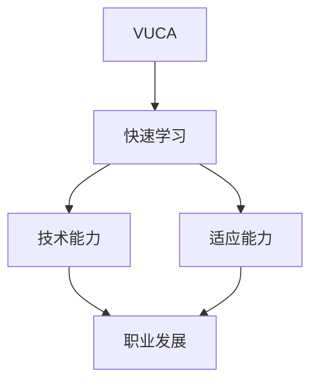
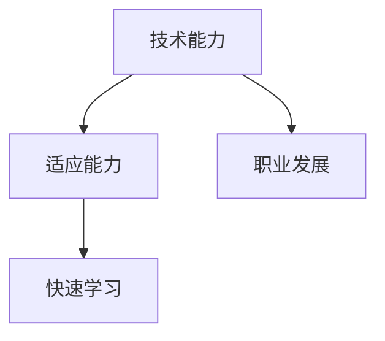

                 

# 快速学习：应对VUCA的制胜法宝

> 关键词：VUCA、快速学习、敏捷性、技术能力、适应能力、持续学习、认知策略、学习方法、技术领域、职业发展

> 摘要：在当今VUCA（易变、不确定、复杂、模糊）的环境中，快速学习成为了个人和组织制胜的关键。本文将深入探讨如何通过高效的学习方法和策略，提升个人的技术能力和适应能力，以应对快速变化的技术领域和职业发展的挑战。

## 1. 背景介绍

### 1.1 目的和范围

本文旨在为技术领域从业者提供一套系统化的快速学习方法，帮助他们在VUCA环境中保持竞争力。我们将探讨以下内容：

- VUCA环境的特点及其对技术领域的影响
- 快速学习的重要性及其对职业发展的贡献
- 高效的学习方法和策略
- 技术领域中的快速学习实践

### 1.2 预期读者

本文适用于以下读者群体：

- 技术领域从业者，特别是程序员、软件工程师、架构师等
- 对技术学习和职业发展有热情的在校大学生和研究生
- 希望提升自己学习能力的IT行业爱好者

### 1.3 文档结构概述

本文结构如下：

- 第1章：背景介绍，阐述VUCA环境及其对技术领域的影响
- 第2章：核心概念与联系，介绍快速学习的原理和方法
- 第3章：核心算法原理 & 具体操作步骤，详细阐述快速学习的方法论
- 第4章：数学模型和公式 & 详细讲解 & 举例说明，运用数学工具辅助理解
- 第5章：项目实战：代码实际案例和详细解释说明，通过实际案例加深理解
- 第6章：实际应用场景，探讨快速学习在技术领域中的应用
- 第7章：工具和资源推荐，提供学习资源和开发工具建议
- 第8章：总结：未来发展趋势与挑战，展望快速学习的发展方向
- 第9章：附录：常见问题与解答，解答读者可能遇到的问题
- 第10章：扩展阅读 & 参考资料，提供进一步学习的资源

### 1.4 术语表

#### 1.4.1 核心术语定义

- VUCA：易变（Volatility）、不确定（Uncertainty）、复杂（Complexity）、模糊（Ambiguity）的缩写，用于描述动态和不确定性的环境。
- 快速学习：在有限的时间内，通过高效的方法和策略，快速获取新知识和技能的过程。
- 技术能力：在特定技术领域中的专业知识和实际操作能力。
- 适应能力：在变化和不确定性中，迅速调整和适应新环境的能力。

#### 1.4.2 相关概念解释

- 敏捷性：在快速变化的环境中，灵活调整和应对变化的能力。
- 持续学习：长期保持学习和进步的意识和行为。

#### 1.4.3 缩略词列表

- VUCA：易变、不确定、复杂、模糊
- IDE：集成开发环境（Integrated Development Environment）
- JVM：Java虚拟机（Java Virtual Machine）
- ML：机器学习（Machine Learning）
- AI：人工智能（Artificial Intelligence）

## 2. 核心概念与联系

为了更好地理解快速学习在VUCA环境中的应用，我们需要先掌握一些核心概念和它们之间的联系。以下是一个简单的Mermaid流程图，用于展示这些概念之间的关系。



### 2.1 VUCA环境的特点

VUCA环境具有以下几个特点：

- **易变（Volatility）**：技术领域的发展速度极快，新的技术和工具层出不穷，不断推动着行业的变革。
- **不确定（Uncertainty）**：未来的趋势难以预测，创新和变革成为常态，传统的方法和经验可能不再适用。
- **复杂（Complexity）**：技术系统变得越来越复杂，涉及多个层面和组件，需要多学科的知识和技能来应对。
- **模糊（Ambiguity）**：信息的完整性、准确性和可靠性难以保证，决策和行动需要在不确定的情况下进行。

### 2.2 快速学习的原理

快速学习是一种在有限时间内高效获取新知识和技能的方法，其原理包括：

- **主动学习**：通过积极思考和参与，主动构建知识体系，而不是被动接受信息。
- **刻意练习**：通过反复练习和反馈，逐步提高技能水平，达到熟练掌握的程度。
- **深度学习**：通过深入研究，理解知识的本质和内在联系，形成深刻的认知。
- **认知策略**：运用有效的记忆、思维和问题解决策略，提高学习效率。

### 2.3 技术能力与适应能力的联系

技术能力和适应能力是快速学习的重要组成部分。技术能力是适应能力的基础，而适应能力则可以提升技术能力。以下是一个简化的流程图，展示两者之间的联系。



## 3. 核心算法原理 & 具体操作步骤

快速学习不仅仅是一种理念，还需要一套系统的算法原理和操作步骤来支持。以下是一种常见的快速学习方法论，我们将通过伪代码进行详细阐述。

### 3.1 快速学习算法原理

```pseudo
算法 快速学习（目标技能，学习资源，时间预算）
输入：目标技能，学习资源，时间预算
输出：技能掌握程度

初始化：学习进度 = 0，技能掌握程度 = 0

1. 分析目标技能：
   - 确定技能的核心概念和知识点
   - 列出需要掌握的工具和技术

2. 筛选学习资源：
   - 选择权威、最新、实用的学习材料
   - 排除冗余和过时的资源

3. 制定学习计划：
   - 根据时间预算分配学习时间
   - 确定每日学习目标和进度

4. 实施学习计划：
   - 遵循计划，进行主动学习和刻意练习
   - 定期进行自我评估和反馈调整

5. 深度学习：
   - 通过阅读论文、书籍和教程，理解技能的原理和内在联系
   - 进行实际操作，将理论知识应用于实际项目中

6. 技能评估：
   - 根据实际操作和测试结果，评估技能掌握程度
   - 如未达到预期，返回步骤3，重新调整学习计划

7. 持续学习：
   - 保持对最新技术趋势的关注，持续更新知识和技能
   - 积累实际经验，提高技能的实战能力

返回 技能掌握程度
```

### 3.2 快速学习的具体操作步骤

以下是快速学习的具体操作步骤：

1. **分析目标技能**：
   - 确定需要学习的技术领域和具体技能点。
   - 了解技能的核心概念和知识点。

2. **筛选学习资源**：
   - 根据技能需求，查找权威、最新、实用的学习资源，如书籍、在线课程、教程等。
   - 排除内容冗余或过时的资源。

3. **制定学习计划**：
   - 根据个人时间安排和学习习惯，制定详细的学习计划。
   - 确定每日学习目标和进度。

4. **实施学习计划**：
   - 按照学习计划，进行系统的学习和练习。
   - 利用主动学习和刻意练习的方法，提高学习效果。

5. **深度学习**：
   - 深入阅读相关论文、书籍和教程，理解技能的原理和内在联系。
   - 通过实践项目，将理论知识应用到实际中。

6. **技能评估**：
   - 定期进行自我评估，通过实际操作和测试，评估技能掌握程度。
   - 如未达到预期，重新调整学习计划。

7. **持续学习**：
   - 保持对最新技术趋势的关注，持续更新知识和技能。
   - 积累实际经验，提高技能的实战能力。

通过以上步骤，可以系统地掌握快速学习的方法论，并在技术领域中不断提高自己的竞争力。

## 4. 数学模型和公式 & 详细讲解 & 举例说明

在快速学习过程中，数学模型和公式是一种强大的工具，可以帮助我们更深入地理解复杂概念，并优化学习过程。以下是一些常见的数学模型和公式，以及它们的详细讲解和举例说明。

### 4.1 学习效率模型

学习效率模型可以用以下公式表示：

\[ E = f(\text{学习时间}, \text{学习内容难度}, \text{学习方法}) \]

其中，\( E \) 表示学习效率，\( f \) 是一个函数，用于描述学习时间、学习内容难度和学习方法对学习效率的影响。

- **学习时间**：学习时间越长，学习效率通常越高，但超过某个临界点后，效率可能不再增加，甚至开始下降。
- **学习内容难度**：难度越高的内容，学习效率通常越低，但通过刻意练习，可以提高学习效率。
- **学习方法**：有效的学习方法可以提高学习效率，如主动学习、深度学习和交互式学习等。

**举例说明**：

假设某技术学习者，每天有4小时的学习时间，学习内容难度为中等，采用主动学习和深度学习方法。我们可以估计其学习效率如下：

\[ E = f(4\ \text{小时}, \text{中等难度}, \text{主动学习和深度学习方法}) \]
\[ E \approx 0.8 \]

这意味着，该学习者的学习效率大约为80%。

### 4.2 学习曲线模型

学习曲线模型描述了学习者在学习过程中技能水平的变化。常用的学习曲线模型包括Ebbinghaus遗忘曲线和安德森学习曲线。

- **Ebbinghaus遗忘曲线**：

\[ f(t) = e^{-\lambda t} \]

其中，\( f(t) \) 表示学习者在时间\( t \)后的记忆保留率，\( \lambda \) 是遗忘率。

- **安德森学习曲线**：

\[ f(t) = \frac{1}{1 + e^{-kt}} \]

其中，\( f(t) \) 表示学习者在时间\( t \)后的技能掌握程度，\( k \) 是学习速率。

**举例说明**：

假设某学习者每天练习一小时，遗忘率为0.1，学习速率为0.05。我们可以估计其学习曲线如下：

\[ f(t) = e^{-0.1t} \]
\[ f(t) = \frac{1}{1 + e^{-0.05t}} \]

在第一小时后，其记忆保留率为：

\[ f(1) = e^{-0.1 \times 1} \approx 0.9 \]

在第三小时后，其技能掌握程度为：

\[ f(3) = \frac{1}{1 + e^{-0.05 \times 3}} \approx 0.8 \]

这意味着，该学习者在第一天后的记忆保留率为90%，三天后的技能掌握程度约为80%。

### 4.3 学习效果评估模型

学习效果评估模型用于评估学习者的学习成果。一个简单有效的评估模型是GASP模型（掌握、应用、分享、传递）：

\[ E = \alpha M + \beta A + \gamma S + \delta P \]

其中，\( E \) 表示学习效果，\( \alpha \)、\( \beta \)、\( \gamma \)、\( \delta \) 是权重系数，\( M \) 表示掌握程度，\( A \) 表示应用程度，\( S \) 表示分享程度，\( P \) 表示传递程度。

**举例说明**：

假设某学习者的掌握程度为90%，应用程度为80%，分享程度为70%，传递程度为60%，我们可以计算其学习效果如下：

\[ E = \alpha \times 0.9 + \beta \times 0.8 + \gamma \times 0.7 + \delta \times 0.6 \]

如果假设权重系数为 \( \alpha = 0.5 \)、\( \beta = 0.2 \)、\( \gamma = 0.2 \)、\( \delta = 0.1 \)，则：

\[ E = 0.5 \times 0.9 + 0.2 \times 0.8 + 0.2 \times 0.7 + 0.1 \times 0.6 = 0.6 + 0.16 + 0.14 + 0.06 = 0.96 \]

这意味着，该学习者的学习效果为96%。

通过这些数学模型和公式，我们可以更科学地评估和优化快速学习过程，提高学习效率和学习效果。

## 5. 项目实战：代码实际案例和详细解释说明

### 5.1 开发环境搭建

在本节中，我们将搭建一个简单的快速学习项目环境，该项目将帮助学习者跟踪和管理他们的学习进度。

#### 环境要求：

- 操作系统：Windows/Linux/MacOS
- 开发语言：Python
- 版本要求：Python 3.8及以上
- 数据库：SQLite
- Web框架：Flask

#### 安装步骤：

1. 安装Python 3.8及以上版本。
2. 安装虚拟环境工具 `virtualenv`：
   ```shell
   pip install virtualenv
   ```
3. 创建一个虚拟环境并激活：
   ```shell
   virtualenv quicklearn_env
   source quicklearn_env/bin/activate  # 对于Windows，使用 `quicklearn_env\Scripts\activate`
   ```
4. 安装项目依赖项：
   ```shell
   pip install flask
   pip install flask_sqlalchemy
   pip install Flask-WTF
   ```

### 5.2 源代码详细实现和代码解读

以下是快速学习项目的主要代码实现，我们将分步骤进行解读。

#### 项目结构：

```
quicklearn/
|-- app.py
|-- templates/
|   |-- base.html
|   |-- dashboard.html
|   |-- login.html
|   |-- register.html
|-- static/
|   |-- css/
|       |-- style.css
|   |-- js/
|       |-- script.js
|-- config.py
|-- models.py
|-- forms.py
```

#### app.py

```python
from flask import Flask, render_template, request, redirect, url_for, flash
from flask_sqlalchemy import SQLAlchemy
from forms import LoginForm, RegisterForm
from models import User, Topic

app = Flask(__name__)
app.config['SQLALCHEMY_DATABASE_URI'] = 'sqlite:///quicklearn.db'
app.config['SECRET_KEY'] = 'your_secret_key'

db = SQLAlchemy(app)

@app.route('/')
def index():
    return render_template('dashboard.html')

@app.route('/login', methods=['GET', 'POST'])
def login():
    form = LoginForm()
    if form.validate_on_submit():
        user = User.query.filter_by(username=form.username.data).first()
        if user and user.password == form.password.data:
            flash('登录成功！', 'success')
            return redirect(url_for('dashboard'))
        else:
            flash('用户名或密码错误！', 'danger')
    return render_template('login.html', form=form)

@app.route('/register', methods=['GET', 'POST'])
def register():
    form = RegisterForm()
    if form.validate_on_submit():
        new_user = User(username=form.username.data, password=form.password.data)
        db.session.add(new_user)
        db.session.commit()
        flash('注册成功！', 'success')
        return redirect(url_for('login'))
    return render_template('register.html', form=form)

@app.route('/dashboard')
def dashboard():
    topics = Topic.query.all()
    return render_template('dashboard.html', topics=topics)

if __name__ == '__main__':
    db.create_all()
    app.run(debug=True)
```

#### 代码解读：

- **Flask应用搭建**：我们使用Flask框架搭建Web应用，配置数据库连接和密钥。
- **路由和视图函数**：定义了应用的各个路由和视图函数，如首页、登录、注册和仪表板。
- **表单处理**：使用WTForms处理用户表单，验证用户输入。
- **数据库操作**：通过SQLAlchemy进行数据库操作，创建用户和主题表。

#### models.py

```python
from flask_sqlalchemy import SQLAlchemy

db = SQLAlchemy()

class User(db.Model):
    id = db.Column(db.Integer, primary_key=True)
    username = db.Column(db.String(80), unique=True, nullable=False)
    password = db.Column(db.String(120), nullable=False)

class Topic(db.Model):
    id = db.Column(db.Integer, primary_key=True)
    name = db.Column(db.String(120), nullable=False)
    description = db.Column(db.Text, nullable=True)
    created_by = db.Column(db.Integer, db.ForeignKey('user.id'), nullable=False)
```

#### 代码解读：

- **用户模型（User）**：定义了用户的字段，包括ID、用户名和密码。
- **主题模型（Topic）**：定义了主题的字段，包括ID、名称、描述和创建者。

#### forms.py

```python
from flask_wtf import FlaskForm
from wtforms import StringField, PasswordField, SubmitField
from wtforms.validators import DataRequired, Length, EqualTo

class LoginForm(FlaskForm):
    username = StringField('用户名', validators=[DataRequired()])
    password = PasswordField('密码', validators=[DataRequired()])
    submit = SubmitField('登录')

class RegisterForm(FlaskForm):
    username = StringField('用户名', validators=[DataRequired(), Length(min=4, max=80)])
    password = PasswordField('密码', validators=[DataRequired(), Length(min=8, max=120)])
    confirm_password = PasswordField('确认密码', validators=[DataRequired(), EqualTo('password')])
    submit = SubmitField('注册')
```

#### 代码解读：

- **登录表单（LoginForm）**：包含用户名和密码字段，以及验证器。
- **注册表单（RegisterForm）**：包含用户名、密码和确认密码字段，以及验证器。

### 5.3 代码解读与分析

#### 5.3.1 主程序（app.py）

1. **初始化Flask应用**：
   ```python
   app = Flask(__name__)
   app.config['SQLALCHEMY_DATABASE_URI'] = 'sqlite:///quicklearn.db'
   app.config['SECRET_KEY'] = 'your_secret_key'
   ```
   这两行代码分别配置了数据库连接URI和应用的密钥。我们使用SQLite作为数据库，并通过密钥确保用户数据的保密性。

2. **数据库配置**：
   ```python
   db = SQLAlchemy(app)
   ```
   这行代码初始化了SQLAlchemy，并与Flask应用关联。

3. **路由定义**：
   ```python
   @app.route('/')
   def index():
       return render_template('dashboard.html')
   
   @app.route('/login', methods=['GET', 'POST'])
   def login():
       # ...
   
   @app.route('/register', methods=['GET', 'POST'])
   def register():
       # ...
   
   @app.route('/dashboard')
   def dashboard():
       topics = Topic.query.all()
       return render_template('dashboard.html', topics=topics)
   ```
   这些路由定义了应用的首页、登录、注册和仪表板页面。每个路由都关联一个视图函数，用于处理用户请求并渲染相应的模板。

4. **表单处理**：
   ```python
   from forms import LoginForm, RegisterForm
   
   # ...
   @app.route('/login', methods=['GET', 'POST'])
   def login():
       form = LoginForm()
       if form.validate_on_submit():
           user = User.query.filter_by(username=form.username.data).first()
           if user and user.password == form.password.data:
               flash('登录成功！', 'success')
               return redirect(url_for('dashboard'))
           else:
               flash('用户名或密码错误！', 'danger')
       return render_template('login.html', form=form)
   
   @app.route('/register', methods=['GET', 'POST'])
   def register():
       form = RegisterForm()
       if form.validate_on_submit():
           new_user = User(username=form.username.data, password=form.password.data)
           db.session.add(new_user)
           db.session.commit()
           flash('注册成功！', 'success')
           return redirect(url_for('login'))
       return render_template('register.html', form=form)
   ```
   这些视图函数处理用户登录和注册请求，验证用户输入，并在成功或失败时显示相应的消息。

5. **数据库操作**：
   ```python
   from models import User, Topic
   
   @app.route('/dashboard')
   def dashboard():
       topics = Topic.query.all()
       return render_template('dashboard.html', topics=topics)
   ```
   这个视图函数查询数据库中的所有主题，并将其传递给模板。

#### 5.3.2 数据模型（models.py）

```python
class User(db.Model):
    id = db.Column(db.Integer, primary_key=True)
    username = db.Column(db.String(80), unique=True, nullable=False)
    password = db.Column(db.String(120), nullable=False)

class Topic(db.Model):
    id = db.Column(db.Integer, primary_key=True)
    name = db.Column(db.String(120), nullable=False)
    description = db.Column(db.Text, nullable=True)
    created_by = db.Column(db.Integer, db.ForeignKey('user.id'), nullable=False)
```

- **用户模型（User）**：包含用户ID、用户名和密码字段。
- **主题模型（Topic）**：包含主题ID、名称、描述和创建者字段。创建者字段是一个外键，关联到用户模型。

#### 5.3.3 表单处理（forms.py）

```python
class LoginForm(FlaskForm):
    username = StringField('用户名', validators=[DataRequired()])
    password = PasswordField('密码', validators=[DataRequired()])
    submit = SubmitField('登录')

class RegisterForm(FlaskForm):
    username = StringField('用户名', validators=[DataRequired(), Length(min=4, max=80)])
    password = PasswordField('密码', validators=[DataRequired(), Length(min=8, max=120)])
    confirm_password = PasswordField('确认密码', validators=[DataRequired(), EqualTo('password')])
    submit = SubmitField('注册')
```

- **登录表单（LoginForm）**：包含用户名和密码字段，以及验证器。
- **注册表单（RegisterForm）**：包含用户名、密码和确认密码字段，以及验证器。

### 5.4 实际案例应用

假设一个程序员想要使用此项目来跟踪他的学习进度。以下是他的操作步骤：

1. **注册并登录**：
   - 访问 `/register` 路径，填写注册表单。
   - 成功注册后，使用 `/login` 路径登录。

2. **创建学习主题**：
   - 登录后，访问仪表板页面，点击创建主题按钮。
   - 填写主题名称和描述，保存。

3. **更新学习进度**：
   - 在仪表板页面，选择一个主题，输入学习进度，保存。

4. **查看学习进度**：
   - 在仪表板页面，可以查看所有学习主题及其进度。

通过这个项目，程序员可以系统地跟踪和管理他的学习进度，从而提高学习效率。

## 6. 实际应用场景

快速学习在技术领域中的应用场景广泛，以下是一些具体的应用场景：

### 6.1 技术更新

在快速变化的技术领域，例如人工智能、大数据和云计算，新技术和新工具不断涌现。快速学习可以帮助技术人员及时掌握这些新技术，保持竞争力。

- **应用**：通过定期参加在线课程、阅读技术博客和参加技术社区活动，技术人员可以快速了解新技术趋势。
- **效果**：及时掌握新技术，提升工作效率，降低对新工具的学习曲线。

### 6.2 项目需求变更

在项目开发过程中，需求变更是一件常见的事情。快速学习可以帮助技术人员迅速适应新的需求，提供解决方案。

- **应用**：技术人员可以利用快速学习的方法，快速熟悉新的技术和工具，以便快速响应需求变更。
- **效果**：提高项目交付效率，降低项目风险。

### 6.3 跨领域协作

在大型项目中，不同领域的团队成员需要协作完成工作。快速学习可以帮助技术人员理解其他领域的知识，促进跨领域协作。

- **应用**：技术人员可以通过快速学习，了解其他领域的基本概念和技术，提高跨领域协作的效率。
- **效果**：提高项目整体效率，减少沟通成本。

### 6.4 职业发展

在职业发展的过程中，快速学习可以帮助技术人员提升技能，实现职业晋升。

- **应用**：通过参加高级培训课程、学习新技术和参与开源项目，技术人员可以提升自己的技能水平。
- **效果**：实现职业晋升，提高收入和职业满意度。

## 7. 工具和资源推荐

### 7.1 学习资源推荐

#### 7.1.1 书籍推荐

1. **《快速学习：如何用20%的时间，达成100%的效果》** - Peter Hollins
   - 介绍了一系列有效的学习方法和技巧，帮助读者提高学习效率。

2. **《深度学习》** - Ian Goodfellow、Yoshua Bengio和Aaron Courville
   - 深入讲解了深度学习的原理和技术，是机器学习领域的经典教材。

3. **《Python编程：从入门到实践》** - Eric Matthes
   - 一本适合初学者的Python编程书籍，涵盖了Python的基础知识和实际应用。

#### 7.1.2 在线课程

1. **Coursera** - 提供大量免费和付费的在线课程，包括计算机科学、数据科学和人工智能等领域。

2. **edX** - 与世界顶级大学合作，提供高质量的课程资源。

3. **Udemy** - 提供多种技术和编程语言的在线课程，适合不同层次的学员。

#### 7.1.3 技术博客和网站

1. **Medium** - 一个集合了众多技术博客的平台，涵盖了各种技术主题。

2. **Stack Overflow** - 一个面向开发者的问答社区，适合解决编程问题。

3. **GitHub** - 一个开源代码托管平台，可以通过阅读和参与开源项目学习新技术。

### 7.2 开发工具框架推荐

#### 7.2.1 IDE和编辑器

1. **Visual Studio Code** - 一款功能强大的开源编辑器，支持多种编程语言。

2. **IntelliJ IDEA** - 一款专为Java和Scala设计的集成开发环境。

3. **PyCharm** - 一款流行的Python IDE，适用于Python编程。

#### 7.2.2 调试和性能分析工具

1. **GDB** - 一个功能强大的Linux调试器。

2. **PyCharm Debugger** - 适用于Python程序的调试工具。

3. **Chrome DevTools** - 用于Web应用的调试和分析工具。

#### 7.2.3 相关框架和库

1. **Flask** - 一个轻量级的Web应用框架，适用于Python。

2. **Django** - 一个高层次的Python Web框架，注重快速开发和安全性。

3. **TensorFlow** - 一个用于机器学习和深度学习的开源框架。

### 7.3 相关论文著作推荐

#### 7.3.1 经典论文

1. **《A Mathematical Theory of Communication》** - Claude Shannon
   - 通信理论的奠基之作，对信息论有重要贡献。

2. **《The Structure of Scientific Revolutions》** - Thomas S. Kuhn
   - 描述了科学革命的进程和科学发展的模式。

3. **《The Art of Computer Programming》** - Donald E. Knuth
   - 计算机编程领域的经典著作，涵盖了算法设计和分析的基本原理。

#### 7.3.2 最新研究成果

1. **《Neural Networks and Deep Learning》** - Michael Nielsen
   - 介绍了神经网络和深度学习的最新进展和应用。

2. **《Big Data: A Revolution That Will Transform How We Live, Work, and Think》** - Viktor Mayer-Schönberger and Kenneth Cukier
   - 探讨了大数据对社会和商业的影响。

3. **《The Future of Humanity: Terraforming Mars, Interstellar Travel, Immortality, and Our Destiny Beyond Earth》** - Michio Kaku
   - 预测了人类未来的科技发展和社会变革。

#### 7.3.3 应用案例分析

1. **《AI Applications in Healthcare》** - Harvard Business Review
   - 分析了人工智能在医疗领域的应用案例。

2. **《The Internet of Things: A Transformative Force for Business and Society》** - McKinsey & Company
   - 探讨了物联网对社会和商业的变革性影响。

3. **《Blockchain Revolution: How the Technology Behind Bitcoin Is Changing Money, Business, and the World》** - Don Tapscott and Alex Tapscott
   - 分析了区块链技术的应用和潜力。

## 8. 总结：未来发展趋势与挑战

### 8.1 未来发展趋势

1. **技术的融合与跨界**：随着技术的快速发展，不同领域的技术将更加融合，跨界应用将成为主流。例如，人工智能与物联网、区块链等技术的结合，将推动新产业的诞生。

2. **个性化学习**：随着大数据和人工智能技术的发展，个性化学习将成为趋势。通过分析学习者的行为和偏好，提供个性化的学习路径和资源，提高学习效率。

3. **远程工作与教育**：疫情影响下，远程工作和教育模式得到广泛推广。未来，远程工作与教育将继续发展，提高灵活性和效率。

4. **开放科学与开源文化**：开放科学和开源文化的普及，将促进知识的共享和协作，加速技术创新。

### 8.2 挑战

1. **信息过载**：随着信息的爆炸式增长，如何筛选和处理海量信息成为挑战。快速学习需要更加高效的过滤和吸收信息的能力。

2. **技能更新速度**：技术更新速度加快，技能更新难度增大。快速学习需要掌握快速适应新技术的能力。

3. **隐私与安全**：随着数据的大规模收集和使用，隐私与安全问题日益突出。快速学习需要关注数据隐私保护和安全技术。

4. **职业稳定性**：技术变革带来的职业动荡，使得职业稳定性成为挑战。快速学习需要具备跨领域适应能力和持续学习能力。

### 8.3 应对策略

1. **持续学习**：保持持续学习的习惯，不断提升自己的技能和知识水平。

2. **跨界思维**：培养跨界思维，了解不同领域的知识和技能，提高跨领域协作能力。

3. **时间管理**：合理规划时间，提高学习效率，避免信息过载。

4. **安全意识**：增强数据隐私和安全意识，保护个人信息和知识产权。

5. **适应变化**：积极应对技术变革和职业挑战，保持灵活性和适应性。

## 9. 附录：常见问题与解答

### 9.1 问题1：如何选择合适的学习资源？

**解答**：选择合适的学习资源是快速学习的关键。以下是一些建议：

- **权威性**：选择来自权威机构或专家的资源，如经典教材、知名博客等。
- **实用性**：选择与学习目标相关、具有实际应用价值的资源。
- **更新频率**：优先选择更新频率高的资源，以保证知识的新颖性。

### 9.2 问题2：如何评估自己的学习效果？

**解答**：以下是一些评估学习效果的方法：

- **自我测试**：通过自我测试或练习，检验所学知识的掌握程度。
- **项目实践**：通过实际项目应用所学知识，检验实际操作能力。
- **同行评价**：向同行或导师请教，获取反馈和评价。

### 9.3 问题3：如何保持持续学习的动力？

**解答**：

- **设定目标**：明确自己的学习目标和期望，保持动力。
- **建立学习计划**：制定详细的学习计划，按时完成任务。
- **反馈与奖励**：通过自我反馈和外部奖励，提高学习积极性。
- **学习社区**：加入学习社区，与他人交流和分享，增强学习动力。

## 10. 扩展阅读 & 参考资料

### 10.1 扩展阅读

1. **《深度学习》** - Ian Goodfellow、Yoshua Bengio和Aaron Courville
   - 深入讲解了深度学习的原理和技术。

2. **《Python编程：从入门到实践》** - Eric Matthes
   - 适合初学者的Python编程书籍。

3. **《快速学习：如何用20%的时间，达成100%的效果》** - Peter Hollins
   - 介绍了一系列有效的学习方法和技巧。

### 10.2 参考资料

1. **[Coursera](https://www.coursera.org/)**
   - 提供大量免费和付费的在线课程。

2. **[edX](https://www.edx.org/)**
   - 与世界顶级大学合作，提供高质量的课程资源。

3. **[GitHub](https://github.com/)**
   - 开源代码托管平台，可以通过阅读和参与开源项目学习新技术。

### 10.3 开源项目

1. **[Flask](https://flask.palletsprojects.com/)**
   - 一个轻量级的Web应用框架。

2. **[TensorFlow](https://www.tensorflow.org/)**
   - 一个用于机器学习和深度学习的开源框架。

3. **[Django](https://www.djangoproject.com/)**
   - 一个高层次的Python Web框架。

### 10.4 相关论文

1. **[A Mathematical Theory of Communication](https://ieeexplore.ieee.org/document/3172336)**
   - Claude Shannon的经典论文。

2. **[The Structure of Scientific Revolutions](https://www.amazon.com/Structure-Scientific-Revolution-Thomas-Kuhn/dp/067466507X)**
   - Thomas S. Kuhn的代表作。

3. **[The Art of Computer Programming](https://www.amazon.com/Art-Computer-Programming-Volume-1-Edition/dp/0201824704)**
   - Donald E. Knuth的经典著作。

### 10.5 应用案例分析

1. **[AI Applications in Healthcare](https://hbr.org/product/ai-applications-in-healthcare/801974-PDF-ENG)**
   - 分析了人工智能在医疗领域的应用案例。

2. **[The Internet of Things: A Transformative Force for Business and Society](https://www.mckinsey.com/featured-insights/internet-of-things)**
   - 探讨了物联网对社会和商业的变革性影响。

3. **[Blockchain Revolution: How the Technology Behind Bitcoin Is Changing Money, Business, and the World](https://www.amazon.com/Blockchain-Revolution-Technology-Bitcoin-Technology/dp/1470355664)**
   - 分析了区块链技术的应用和潜力。

