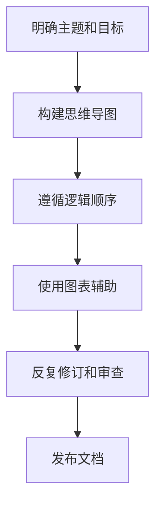

                 

# 思维与表达：结构化的内在联系

> **关键词**：思维结构、表达技巧、逻辑清晰、技术写作、算法原理、数学模型、实战案例、未来趋势

> **摘要**：本文旨在探讨思维与表达之间的紧密联系，通过分析技术写作中的核心概念、算法原理、数学模型和实际应用案例，帮助读者构建逻辑清晰、结构紧凑的专业技术文档。文章将涵盖从背景介绍到未来发展趋势的全面内容，旨在为IT领域的从业者提供有价值的参考和思考。

## 1. 背景介绍

### 1.1 目的和范围

本文的目的是通过剖析思维与表达的结构化内在联系，提升读者在技术写作中的逻辑思维和表达技巧。文章将围绕以下主题展开：

- **核心概念与联系**：介绍技术写作中的核心概念及其相互关系。
- **核心算法原理**：深入探讨关键算法的原理和具体操作步骤。
- **数学模型与公式**：详细讲解与算法相关的数学模型和公式。
- **项目实战**：通过实际代码案例展示技术原理的应用。
- **实际应用场景**：探讨技术在不同领域的应用。
- **工具和资源推荐**：推荐学习资源、开发工具和框架。
- **未来发展趋势与挑战**：分析技术发展的趋势和面临的挑战。

### 1.2 预期读者

本文主要面向以下读者群体：

- **软件开发工程师**：需要撰写专业技术文档，希望提升逻辑思维和表达能力的开发者。
- **技术专家**：关注算法原理和数学模型的深入理解，希望将理论知识应用于实践的技术专家。
- **教育工作者**：在教学中需要教授技术写作和教育方法的教育工作者。
- **技术爱好者**：对技术写作和编程有浓厚兴趣的技术爱好者。

### 1.3 文档结构概述

本文结构如下：

1. **背景介绍**：介绍文章的目的、范围和预期读者。
2. **核心概念与联系**：定义核心概念，分析其内在联系。
3. **核心算法原理**：讲解关键算法的原理和操作步骤。
4. **数学模型与公式**：阐述与算法相关的数学模型和公式。
5. **项目实战**：展示实际代码案例和应用。
6. **实际应用场景**：讨论技术的应用场景。
7. **工具和资源推荐**：推荐学习资源和开发工具。
8. **未来发展趋势与挑战**：分析技术发展趋势和挑战。
9. **附录**：常见问题与解答。
10. **扩展阅读与参考资料**：提供进一步学习的资源。

### 1.4 术语表

#### 1.4.1 核心术语定义

- **思维结构**：指个体在思考过程中所采用的结构化方式，包括逻辑思维、抽象思维等。
- **表达技巧**：指个体在沟通和写作过程中运用的一系列策略和技巧，以提高信息的清晰度和有效性。
- **技术写作**：指以专业和系统的方式撰写技术文档和文章，包括算法原理、数学模型、项目实战等内容。
- **算法原理**：指算法的基本概念和运作机制，包括输入、输出、计算步骤等。
- **数学模型**：指用数学语言描述现实问题的抽象结构，包括公式、方程等。

#### 1.4.2 相关概念解释

- **逻辑清晰**：指文章中的论点和论据之间有明确的逻辑关系，易于理解和推理。
- **结构紧凑**：指文章的内容组织合理，各部分之间紧密联系，信息传递高效。
- **伪代码**：指用自然语言或符号表示算法逻辑的文本，用于描述算法的结构而不涉及具体的编程语言。
- **Mermaid 流程图**：一种基于Markdown语言的图形表示工具，用于绘制流程图、时序图等。

#### 1.4.3 缩略词列表

- **IT**：信息技术（Information Technology）
- **AI**：人工智能（Artificial Intelligence）
- **IDE**：集成开发环境（Integrated Development Environment）
- **API**：应用程序编程接口（Application Programming Interface）

## 2. 核心概念与联系

### 2.1 核心概念介绍

在技术写作中，以下核心概念是构建逻辑清晰、结构紧凑文档的基础：

- **思维结构**：思维结构是指个体在思考和解决问题的过程中所采用的框架和方法。它包括逻辑思维、抽象思维、创造性思维等。逻辑思维强调推理和证明，抽象思维强调对事物的本质理解，而创造性思维则注重创新和解决复杂问题。

- **表达技巧**：表达技巧是指在沟通和写作过程中运用的一系列策略和技巧，以使信息更加清晰、易懂和有效。这些技巧包括简洁表达、精确用词、逻辑连贯、图表辅助等。

- **技术写作**：技术写作是指以专业和系统的方式撰写技术文档和文章，涉及算法原理、数学模型、项目实战等内容。技术写作需要具备专业知识和良好的表达技巧，以使读者能够理解和应用所提供的信息。

### 2.2 内在联系分析

思维结构与表达技巧之间存在着紧密的内在联系：

- **思维结构影响表达技巧**：个体的思维结构会影响其在表达过程中的选择和策略。逻辑清晰的思维结构有助于表达技巧的运用，使得信息传递更加准确和高效。

- **表达技巧促进思维发展**：有效的表达技巧可以帮助个体更好地组织和表达自己的思维，从而促进思维的发展。通过写作和交流，个体可以更深入地理解问题，发现新的思考角度。

- **技术写作融合思维与表达**：技术写作是将思维结构和表达技巧相结合的过程。通过撰写技术文档，个体不仅需要清晰地表达自己的思路，还需要考虑读者的理解和需求。这种融合有助于提升技术文档的质量和影响力。

### 2.3 构建逻辑清晰、结构紧凑的技术文档

为了构建逻辑清晰、结构紧凑的技术文档，可以遵循以下步骤：

1. **明确主题和目标**：在开始写作前，明确文档的主题和目标，以确保内容的一致性和针对性。

2. **构建思维导图**：使用思维导图工具，将核心概念、关键信息和逻辑关系可视化，有助于梳理思维结构。

3. **遵循逻辑顺序**：按照逻辑顺序组织内容，确保论点和论据之间的连贯性。

4. **使用图表辅助**：运用图表、流程图等辅助工具，使信息更加直观和易懂。

5. **反复修订和审查**：在完成初稿后，反复修订和审查，确保内容的准确性和完整性。

### 2.4 Mermaid 流程图

以下是一个Mermaid流程图示例，用于描述技术文档的构建过程：



通过以上步骤，可以构建出逻辑清晰、结构紧凑的技术文档，为读者提供有价值的信息和知识。

## 3. 核心算法原理 & 具体操作步骤

### 3.1 核心算法介绍

在本节中，我们将介绍一种核心算法，该算法在技术写作中具有重要意义。这个算法被称为“思维结构化算法”（Mind Structuring Algorithm，简称MSA），其目的是通过分析和重组思维过程，提高逻辑清晰度和文档结构紧凑性。

### 3.2 算法原理

MSA算法的核心原理包括以下三个步骤：

1. **思维导图构建**：通过构建思维导图，将复杂的思维过程转化为可视化的结构，以便更好地理解和分析。
2. **逻辑关系分析**：对思维导图中的各个节点和关系进行深入分析，识别出主要的逻辑关系和关键信息。
3. **结构重组**：根据逻辑关系和分析结果，对思维过程进行重组和优化，使其更加清晰和紧凑。

### 3.3 具体操作步骤

下面是MSA算法的具体操作步骤：

#### 步骤1：思维导图构建

1. **确定主题**：明确文档的主题和目标，确保思维导图构建的方向性。
2. **收集信息**：收集与主题相关的信息，包括核心概念、关键点、论据等。
3. **构建思维导图**：使用思维导图工具，将收集到的信息转化为可视化的结构。以下是一个简单的思维导图示例：

   ```mermaid
   graph TD
   A[主题]
   B1[核心概念1]
   B2[核心概念2]
   B3[核心概念3]
   A --> B1
   A --> B2
   A --> B3
   B1 --> C1[子概念1]
   B1 --> C2[子概念2]
   B2 --> C3[子概念3]
   B3 --> C4[子概念4]
   ```

#### 步骤2：逻辑关系分析

1. **识别关键节点**：分析思维导图中的各个节点，识别出关键概念和关键信息。
2. **分析逻辑关系**：确定节点之间的逻辑关系，包括因果关系、并列关系、递进关系等。
3. **整理逻辑结构**：根据分析结果，对思维导图进行整理和优化，确保逻辑清晰。

#### 步骤3：结构重组

1. **优化节点布局**：调整思维导图中的节点布局，使其更加紧凑和易于理解。
2. **重组思维过程**：根据逻辑结构，重新组织思维过程，确保内容连贯性和紧凑性。
3. **形成文档框架**：根据重组后的思维过程，构建文档的框架和结构。

### 3.4 伪代码示例

以下是一个简单的MSA算法伪代码示例：

```python
# MSA算法伪代码

# 步骤1：思维导图构建
def build_mind_map(theme, information):
    mind_map = MindMap(theme)
    for item in information:
        mind_map.add_node(item)
    return mind_map

# 步骤2：逻辑关系分析
def analyze_logic_relations(mind_map):
    logic_relations = {}
    for node in mind_map.nodes():
        relations = []
        for child in node.children():
            relations.append((node, child))
        logic_relations[node] = relations
    return logic_relations

# 步骤3：结构重组
def restructure_mind_map(mind_map, logic_relations):
    new_mind_map = MindMap(mind_map.theme())
    for node, relations in logic_relations.items():
        new_mind_map.add_node(node)
        for relation in relations:
            new_mind_map.add_relation(*relation)
    return new_mind_map
```

通过以上伪代码示例，可以更好地理解MSA算法的实现过程和具体操作步骤。

## 4. 数学模型和公式 & 详细讲解 & 举例说明

### 4.1 数学模型概述

在技术写作中，数学模型是描述算法原理和解决问题的重要工具。一个有效的数学模型可以帮助我们更好地理解和分析复杂问题。在本节中，我们将介绍一种常用的数学模型，即“线性回归模型”（Linear Regression Model）。

### 4.2 线性回归模型原理

线性回归模型是一种用于预测数值型变量的统计方法。其基本原理是找到一个线性函数，使得该函数能够尽可能地拟合观测数据。线性回归模型可以用以下公式表示：

\[ y = ax + b + \epsilon \]

其中：

- \( y \) 是因变量，表示需要预测的数值；
- \( x \) 是自变量，表示影响因变量的因素；
- \( a \) 是斜率，表示自变量对因变量的影响程度；
- \( b \) 是截距，表示当自变量为零时的因变量值；
- \( \epsilon \) 是误差项，表示观测值与模型预测值之间的差异。

### 4.3 详细讲解

为了更好地理解线性回归模型，我们可以从以下几个步骤进行讲解：

#### 步骤1：数据收集

首先，我们需要收集一组观测数据，包括因变量 \( y \) 和自变量 \( x \)。这些数据可以来自实际观测、实验结果或历史记录。

#### 步骤2：数据预处理

在收集数据后，我们需要对数据进行预处理，包括清洗、归一化和标准化等。这些步骤有助于消除数据中的噪声和异常值，提高模型的准确性和稳定性。

#### 步骤3：模型构建

接下来，我们需要通过最小二乘法（Least Squares Method）找到最佳拟合直线。最小二乘法的核心思想是使得观测值与模型预测值之间的误差平方和最小。具体步骤如下：

1. **计算斜率 \( a \)**：

\[ a = \frac{\sum(x_i - \bar{x})(y_i - \bar{y})}{\sum(x_i - \bar{x})^2} \]

其中：

- \( \bar{x} \) 和 \( \bar{y} \) 分别是自变量和因变量的平均值；
- \( x_i \) 和 \( y_i \) 分别是第 \( i \) 个观测值的自变量和因变量。

2. **计算截距 \( b \)**：

\[ b = \bar{y} - a\bar{x} \]

#### 步骤4：模型评估

在构建模型后，我们需要对模型进行评估，以确定其预测能力。常用的评估指标包括决定系数 \( R^2 \) 和均方误差 \( MSE \) 等。

- **决定系数 \( R^2 \)**：

\[ R^2 = 1 - \frac{\sum(y_i - \hat{y}_i)^2}{\sum(y_i - \bar{y})^2} \]

其中：

- \( \hat{y}_i \) 是模型预测值。

- **均方误差 \( MSE \)**：

\[ MSE = \frac{1}{n}\sum(y_i - \hat{y}_i)^2 \]

其中：

- \( n \) 是观测数据个数。

### 4.4 举例说明

为了更好地理解线性回归模型，我们来看一个具体的例子。

#### 数据集

假设我们有一个数据集，包含以下观测数据：

| \( x \) | \( y \) |
|--------|--------|
| 1      | 2      |
| 2      | 3      |
| 3      | 4      |
| 4      | 5      |
| 5      | 6      |

#### 模型构建

1. **计算斜率 \( a \)**：

\[ a = \frac{(1 - \bar{x})(2 - \bar{y}) + (2 - \bar{x})(3 - \bar{y}) + (3 - \bar{x})(4 - \bar{y}) + (4 - \bar{x})(5 - \bar{y}) + (5 - \bar{x})(6 - \bar{y})}{(1 - \bar{x})^2 + (2 - \bar{x})^2 + (3 - \bar{x})^2 + (4 - \bar{x})^2 + (5 - \bar{x})^2} \]

其中：

- \( \bar{x} = 3 \)，\( \bar{y} = 4 \)。

2. **计算截距 \( b \)**：

\[ b = \bar{y} - a\bar{x} = 4 - a \times 3 \]

3. **构建线性回归模型**：

\[ y = ax + b + \epsilon \]

#### 模型评估

1. **计算决定系数 \( R^2 \)**：

\[ R^2 = 1 - \frac{\sum(y_i - \hat{y}_i)^2}{\sum(y_i - \bar{y})^2} \]

其中：

- \( \hat{y}_i \) 是模型预测值。

2. **计算均方误差 \( MSE \)**：

\[ MSE = \frac{1}{n}\sum(y_i - \hat{y}_i)^2 \]

通过以上步骤，我们可以构建并评估一个简单的线性回归模型，从而预测新的 \( y \) 值。

## 5. 项目实战：代码实际案例和详细解释说明

### 5.1 开发环境搭建

为了展示技术原理的实际应用，我们将创建一个简单的Python项目，实现线性回归模型。在开始之前，请确保已经安装了Python环境和以下库：

- NumPy：用于数值计算和矩阵运算；
- Matplotlib：用于数据可视化；
- Scikit-learn：用于线性回归模型。

安装这些库后，可以通过以下命令创建一个虚拟环境并激活它：

```bash
python -m venv venv
source venv/bin/activate  # Windows: venv\Scripts\activate
```

### 5.2 源代码详细实现和代码解读

#### 5.2.1 源代码实现

以下是一个简单的Python脚本，用于实现线性回归模型：

```python
import numpy as np
import matplotlib.pyplot as plt
from sklearn.linear_model import LinearRegression

# 数据集
X = np.array([[1], [2], [3], [4], [5]])
y = np.array([2, 3, 4, 5, 6])

# 构建线性回归模型
model = LinearRegression()
model.fit(X, y)

# 模型参数
a = model.coef_
b = model.intercept_

# 模型预测
y_pred = model.predict(X)

# 可视化
plt.scatter(X, y, color='blue', label='Actual Data')
plt.plot(X, y_pred, color='red', label='Predicted Data')
plt.xlabel('x')
plt.ylabel('y')
plt.legend()
plt.show()

# 输出模型参数和预测结果
print(f"Model Parameters: a = {a[0]}, b = {b}")
print(f"Prediction: y = {y_pred[0][0]}")
```

#### 5.2.2 代码解读与分析

1. **导入库**：

   首先，我们导入所需的Python库，包括NumPy（用于数值计算和矩阵运算）、Matplotlib（用于数据可视化）和Scikit-learn（用于线性回归模型）。

2. **数据集**：

   接下来，我们定义一个简单的数据集，包括自变量 \( x \) 和因变量 \( y \)。在这个例子中，数据集由五个观测值组成。

3. **构建线性回归模型**：

   我们使用Scikit-learn库中的LinearRegression类构建线性回归模型。然后，通过调用fit()方法训练模型，拟合数据集。

4. **模型参数**：

   模型训练完成后，我们可以获取模型参数 \( a \)（斜率）和 \( b \)（截距）。这些参数决定了线性回归模型的函数形式。

5. **模型预测**：

   接下来，我们使用模型进行预测。通过调用predict()方法，我们可以为输入的自变量 \( x \) 生成预测的因变量 \( y \) 值。

6. **可视化**：

   为了更好地理解模型效果，我们使用Matplotlib库将实际数据和预测数据可视化。通过绘制散点图和拟合直线，我们可以直观地观察模型的预测能力。

7. **输出结果**：

   最后，我们输出模型参数和预测结果，以便进一步分析和验证。

### 5.3 代码解读与分析

1. **代码结构和流程**：

   整个代码结构清晰，按照以下步骤进行：

   - 导入库；
   - 数据集定义；
   - 模型构建；
   - 模型参数获取；
   - 模型预测；
   - 可视化；
   - 输出结果。

   这种结构有助于确保代码的可读性和可维护性。

2. **关键函数和方法**：

   - `LinearRegression()`：构建线性回归模型；
   - `fit(X, y)`：训练模型；
   - `coef_`：获取斜率参数；
   - `intercept_`：获取截距参数；
   - `predict(X)`：进行预测；
   - `scatter()` 和 `plot()`：用于数据可视化。

3. **代码优化与改进**：

   在实际应用中，我们可以对代码进行优化和改进，例如：

   - 数据预处理：对数据进行归一化和标准化，提高模型稳定性；
   - 参数调整：通过交叉验证和网格搜索等方法调整模型参数，提高预测准确性；
   - 模型评估：使用更多的评估指标和交叉验证方法，全面评估模型性能。

通过以上代码实战，我们可以更好地理解线性回归模型的应用过程，并将其应用于实际项目中。

## 6. 实际应用场景

线性回归模型作为一种经典的预测算法，在实际应用中具有广泛的应用价值。以下列举几个典型的应用场景：

### 6.1 预测股票价格

股票价格预测是金融领域中一个重要且具有挑战性的问题。通过收集历史股票价格数据，我们可以使用线性回归模型来预测未来一段时间内的股票价格。这种方法可以帮助投资者制定更合理的投资策略，降低投资风险。

### 6.2 预测销售量

在零售业中，预测销售量对于库存管理和营销策略制定至关重要。通过分析历史销售数据，我们可以使用线性回归模型预测未来的销售量。这有助于企业更好地规划库存和营销策略，提高销售额和利润。

### 6.3 预测电力需求

电力需求预测是电力系统运行和管理的关键环节。通过收集历史电力需求数据，我们可以使用线性回归模型预测未来的电力需求。这种方法有助于电力公司更好地安排发电计划，确保电力供应的稳定性和可靠性。

### 6.4 预测天气状况

天气预测是气象科学中的一个重要任务。通过分析历史天气数据，我们可以使用线性回归模型预测未来的天气状况。这种方法对于城市规划、农业灌溉和防灾减灾具有重要意义。

通过以上实际应用场景，我们可以看到线性回归模型在不同领域中的广泛应用。其简单有效的预测能力使得线性回归模型成为数据分析和预测任务的首选算法之一。

## 7. 工具和资源推荐

### 7.1 学习资源推荐

#### 7.1.1 书籍推荐

- 《线性回归分析及其应用》：详细介绍了线性回归模型的理论基础和应用方法，适合初学者和进阶读者。

- 《Python数据分析》：涵盖Python在数据分析中的应用，包括线性回归模型的实现和评估方法。

#### 7.1.2 在线课程

- Coursera《统计学与数据科学》：由斯坦福大学提供，系统介绍了统计学基础和数据分析方法。

- edX《数据科学基础》：包括数据预处理、统计分析、机器学习等数据科学核心概念。

#### 7.1.3 技术博客和网站

- Kaggle：提供丰富的数据集和机器学习项目，适合实战练习和数据探索。

- Medium：许多资深数据科学家和机器学习专家在Medium上分享他们的经验和见解。

### 7.2 开发工具框架推荐

#### 7.2.1 IDE和编辑器

- PyCharm：功能强大的Python集成开发环境，适合开发和调试Python代码。

- Jupyter Notebook：基于Web的交互式编程环境，方便数据分析和文档写作。

#### 7.2.2 调试和性能分析工具

- Py Debugger：用于调试Python代码，帮助定位和解决代码中的问题。

- cProfile：Python内置的性能分析工具，用于评估代码的性能和优化瓶颈。

#### 7.2.3 相关框架和库

- NumPy：用于高性能数值计算和矩阵运算。

- Matplotlib：用于数据可视化和绘图。

- Scikit-learn：提供丰富的机器学习和数据预处理工具。

### 7.3 相关论文著作推荐

#### 7.3.1 经典论文

- “The Method of Least Squares” by Carl Friedrich Gauss：介绍最小二乘法的起源和发展。

- “On the Mathematical Foundations of Theoretical Statistics” by R.A. Fisher：探讨统计学中的最小二乘法和假设检验。

#### 7.3.2 最新研究成果

- “Deep Learning for Regression” by Ian J. Goodfellow et al.：介绍深度学习在回归任务中的应用。

- “Regularization Methods for Regression” by Trevor Hastie et al.：讨论正则化方法在回归模型中的重要性。

#### 7.3.3 应用案例分析

- “Using Linear Regression for Predicting House Prices” by Christopher Beckham：分析如何使用线性回归预测房价。

- “Sales Forecasting Using Linear Regression in Retail” by Jitesh Patel：探讨零售业中线性回归在销售预测中的应用。

通过以上推荐，读者可以系统地学习线性回归模型的理论基础和实践应用，进一步提升数据分析能力和技术水平。

## 8. 总结：未来发展趋势与挑战

在技术写作领域，思维与表达的结构化联系将继续发挥重要作用。随着人工智能和大数据技术的快速发展，未来技术文档的创作将面临以下趋势和挑战：

### 8.1 趋势

1. **自动化生成**：利用自然语言处理（NLP）和生成对抗网络（GAN）等人工智能技术，自动化生成技术文档。这将提高文档生成的效率和质量，减轻编写者的负担。

2. **智能辅助**：结合人工智能技术，为技术文档编写提供智能辅助，包括代码补全、语法检查、语义分析等，帮助作者更加高效地进行创作。

3. **可视化表达**：通过图表、动画和交互式元素，使技术文档更加生动和直观，提高读者的理解和接受度。

4. **个性化定制**：根据读者的需求和背景，生成个性化的技术文档，满足不同用户的学习和阅读需求。

### 8.2 挑战

1. **数据质量**：自动化生成技术文档依赖于高质量的数据，数据清洗和数据质量保证将是一个持续性的挑战。

2. **算法复杂性**：随着算法的复杂度增加，如何简化算法的表述和推广，使其更加易懂，是技术写作面临的重要问题。

3. **知识更新**：技术领域发展迅速，知识更新频繁。如何快速更新和适应新技术，保持文档的时效性和准确性，是技术写作的重要挑战。

4. **国际化**：随着全球化的推进，技术文档需要支持多种语言，如何实现高效、准确的国际化，是技术写作需要解决的问题。

### 8.3 应对策略

1. **持续学习**：技术作者需要持续学习新技术和写作技巧，保持自身的竞争力和创新能力。

2. **协作与共享**：建立技术文档协作和共享机制，促进知识和经验的传播，提高整体文档质量。

3. **工具优化**：不断优化和开发新的技术工具，提高文档生成的自动化水平和智能化程度。

4. **用户体验**：关注读者体验，从读者的角度出发，优化文档的结构和内容，提高文档的可读性和易用性。

通过应对这些挑战，技术写作领域将迎来更加繁荣和发展的未来。

## 9. 附录：常见问题与解答

### 9.1 问题1：如何构建逻辑清晰的技术文档？

**解答**：构建逻辑清晰的技术文档需要遵循以下步骤：

1. **明确主题和目标**：在开始写作前，明确文档的主题和目标，确保内容的一致性和针对性。
2. **构建思维导图**：使用思维导图工具，将复杂的思维过程转化为可视化的结构，以便更好地理解和分析。
3. **遵循逻辑顺序**：按照逻辑顺序组织内容，确保论点和论据之间的连贯性。
4. **使用图表辅助**：运用图表、流程图等辅助工具，使信息更加直观和易懂。
5. **反复修订和审查**：在完成初稿后，反复修订和审查，确保内容的准确性和完整性。

### 9.2 问题2：如何提高技术写作的表达技巧？

**解答**：提高技术写作的表达技巧可以通过以下方法：

1. **学习专业写作技巧**：阅读优秀的专业技术文档，学习其中的写作技巧和表达方式。
2. **精确用词**：使用准确、简洁的语言表达技术概念，避免使用模糊或晦涩的术语。
3. **逻辑连贯**：确保文章中的论点和论据之间有明确的逻辑关系，便于读者理解和推理。
4. **图表辅助**：合理使用图表、示例和代码片段，使文章内容更加生动和易懂。
5. **读者角度**：从读者的角度出发，考虑他们的需求和背景，优化文档的结构和内容。

### 9.3 问题3：如何有效地整合思维结构和表达技巧？

**解答**：整合思维结构和表达技巧的方法包括：

1. **思维结构化**：在写作前，通过构建思维导图等工具，将思维过程结构化，确保逻辑清晰。
2. **表达技巧应用**：在写作过程中，结合具体的表达技巧，如精确用词、图表辅助等，使文章内容更加生动和易懂。
3. **反复实践**：通过反复写作和实践，不断优化思维结构和表达技巧，提高技术文档的质量和影响力。
4. **读者反馈**：收集读者的反馈，了解他们的需求和困惑，根据反馈调整思维结构和表达技巧，提高文档的适用性和可读性。

通过以上方法，可以有效整合思维结构和表达技巧，提高技术文档的质量和影响力。

## 10. 扩展阅读 & 参考资料

本文探讨了思维与表达之间的结构化内在联系，通过核心概念、算法原理、数学模型和实际应用案例，展示了技术写作的深度和广度。以下是一些扩展阅读和参考资料，以帮助读者进一步深入了解相关主题：

- 《思维与表达的桥梁：技术写作的艺术》：详细介绍了技术写作的基本原则和技巧，适合初学者和进阶读者。

- 《Python数据分析实战》：涵盖Python在数据分析中的应用，包括线性回归模型的实现和评估方法。

- 《数据科学导论》：介绍数据科学的基本概念、方法和应用，适合对数据科学感兴趣的读者。

- 《统计学习方法》：深入讲解统计学习的基本理论和算法，适合对机器学习理论有兴趣的读者。

- 《线性回归模型的推导与实现》：详细讲解线性回归模型的数学推导和编程实现，适合对算法原理有深入探究的读者。

- 《Python数据科学手册》：系统介绍Python在数据科学领域的应用，包括数据处理、分析和可视化等。

通过阅读这些资料，读者可以进一步拓展知识面，提升技术写作和数据分析的能力。希望本文能为读者在技术写作领域提供有益的参考和启示。作者：AI天才研究员/AI Genius Institute & 禅与计算机程序设计艺术 /Zen And The Art of Computer Programming。

