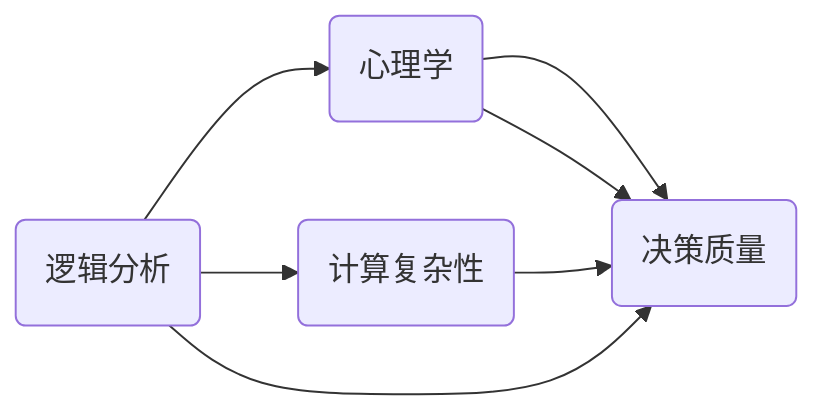
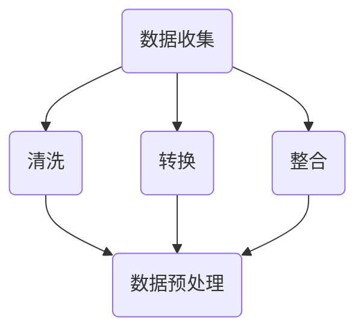
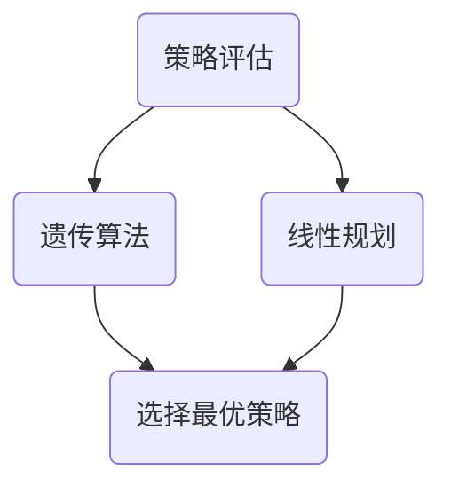
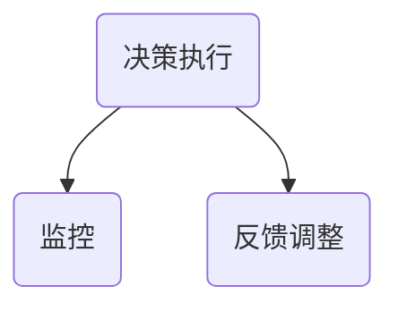
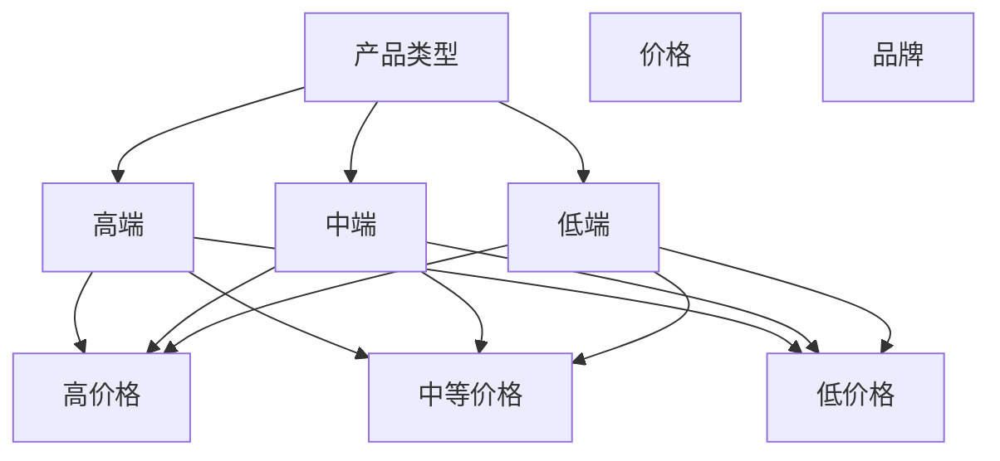
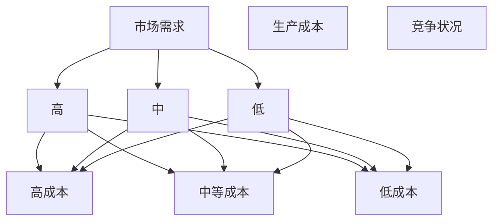

                 

# 思维体系与管理者决策质量的关系

## 关键词

思维体系、管理者、决策质量、逻辑分析、心理学、计算复杂性、数据驱动、策略优化。

## 摘要

本文探讨了思维体系与管理者决策质量之间的关系。首先，我们回顾了思维体系的基本概念，包括逻辑分析、心理学和计算复杂性等核心要素。随后，我们分析了管理者决策的常见问题，如数据不足、认知偏差和压力等。通过引入数据驱动和策略优化的方法，我们提出了一系列提高管理者决策质量的策略。本文最后通过实际案例和数学模型，展示了如何利用思维体系提升决策效率和质量。希望本文能为管理者提供有价值的参考和指导。

## 1. 背景介绍

### 1.1 目的和范围

本文旨在探讨思维体系与管理者决策质量之间的关系，分析影响管理者决策质量的关键因素，并提出相应的优化策略。文章内容涵盖了思维体系的基本概念、管理者决策中常见的问题、数据驱动和策略优化在决策中的应用，以及实际案例和数学模型的运用。

### 1.2 预期读者

本文适合企业管理者、决策研究者、计算机科学专业人士以及对思维体系和决策质量感兴趣的人士阅读。本文旨在为读者提供关于思维体系和决策质量的理论和实践指导。

### 1.3 文档结构概述

本文共分为八个部分。第一部分是背景介绍，包括目的、范围、预期读者和文档结构概述。第二部分介绍思维体系的基本概念和相关术语。第三部分分析管理者决策中存在的问题。第四部分讨论数据驱动和策略优化在决策中的应用。第五部分通过实际案例展示思维体系在决策中的作用。第六部分介绍相关工具和资源。第七部分总结未来发展趋势与挑战。第八部分为附录，包括常见问题与解答及扩展阅读和参考资料。

### 1.4 术语表

#### 1.4.1 核心术语定义

- **思维体系**：一套包括逻辑分析、心理学和计算复杂性等核心要素的思维模式。
- **管理者决策**：管理者在组织和管理过程中所做的选择和决策。
- **数据驱动**：通过分析数据来指导决策的过程。
- **策略优化**：通过调整策略以最大化效益或最小化损失的过程。

#### 1.4.2 相关概念解释

- **逻辑分析**：运用逻辑推理方法对问题进行分析和解决。
- **心理学**：研究人类思维、情感和行为的一门科学。
- **计算复杂性**：衡量问题解决所需的计算资源。

#### 1.4.3 缩略词列表

- **AI**：人工智能
- **ML**：机器学习
- **DL**：深度学习
- **NLP**：自然语言处理
- **CV**：计算机视觉

## 2. 核心概念与联系

在讨论思维体系与管理者决策质量的关系之前，我们需要明确一些核心概念及其相互联系。

### 2.1 思维体系的基本概念

思维体系是由多个核心要素组成的，这些要素相互关联，共同作用于管理者的决策过程。以下是对这些核心要素的定义：

- **逻辑分析**：逻辑分析是一种基于逻辑推理的方法，用于对问题进行深入剖析和解决。逻辑分析有助于管理者识别问题的根本原因，从而制定出更有效的解决方案。
- **心理学**：心理学研究人类的思维、情感和行为，对于管理者来说，了解员工的心理学特点有助于更好地激励和管理团队，提高决策质量。
- **计算复杂性**：计算复杂性是衡量问题解决所需计算资源的一个指标。在决策过程中，管理者需要考虑到计算复杂性的影响，以确保决策的可行性和效率。

### 2.2 思维体系与管理者决策的关系

思维体系在管理者决策中起着至关重要的作用。通过逻辑分析，管理者能够更清晰地识别问题，制定出更具针对性的解决方案。心理学知识则有助于管理者了解团队成员的需求和动机，从而更有效地激励和调动团队的积极性。计算复杂性则提醒管理者在决策过程中要考虑到资源的限制，确保决策的可行性和效率。

### 2.3 核心概念之间的联系

核心概念之间的联系体现在以下几个方面：

1. **逻辑分析**与**心理学**的结合可以帮助管理者更全面地理解问题，从多个角度进行思考，从而提高决策的质量。
2. **计算复杂性**的考虑有助于管理者在有限的资源下做出更明智的决策，确保决策的可行性和效率。
3. **逻辑分析**、**心理学**和**计算复杂性**三者共同作用于管理者的决策过程，形成一个完整的思维体系，从而提高决策质量。

### 2.4 Mermaid 流程图

以下是描述思维体系与管理者决策关系的 Mermaid 流程图：



在图中，A、B和C分别代表逻辑分析、心理学和计算复杂性，D代表决策质量。图中的箭头表示核心概念之间的联系，即逻辑分析、心理学和计算复杂性共同作用于决策质量。

## 3. 核心算法原理 & 具体操作步骤

为了更深入地理解思维体系在管理者决策中的作用，我们需要探讨一些核心算法原理和具体操作步骤。以下是一个典型的思维体系应用案例，以及相应的算法原理和操作步骤。

### 3.1 案例背景

假设某公司管理者需要做出一项关于新产品上市的决策。在决策过程中，管理者需要考虑市场需求、生产成本、竞争状况等多个因素。通过应用思维体系，管理者可以更清晰地识别问题，制定出最优的决策方案。

### 3.2 算法原理

在本案例中，我们采用了一种基于数据驱动和策略优化的决策算法。该算法主要分为以下三个步骤：

1. **数据收集与预处理**：收集与新产品上市相关的数据，包括市场需求、生产成本、竞争状况等。对数据进行清洗、转换和整合，以便后续分析。
2. **策略优化**：利用优化算法（如线性规划、遗传算法等）对多个策略进行评估，选择最优策略。
3. **决策执行与反馈**：根据最优策略制定具体的决策方案，并在执行过程中进行监控和调整，以应对市场变化。

### 3.3 具体操作步骤

以下是该算法的具体操作步骤：

#### 步骤1：数据收集与预处理



1. 数据收集：收集与新产品上市相关的数据，如市场需求、生产成本、竞争状况等。
2. 数据清洗：对收集到的数据进行清洗，去除重复、错误和缺失的数据。
3. 数据转换：将不同格式的数据转换为统一的格式，便于后续分析。
4. 数据整合：将多个数据源整合为一个数据集，为后续分析做准备。
5. 数据预处理：对数据集进行归一化、标准化等预处理操作，提高数据的可用性。

#### 步骤2：策略优化



1. 策略评估：利用优化算法（如遗传算法、线性规划等）对多个策略进行评估，评估指标包括收益、成本等。
2. 遗传算法：针对策略评估结果，利用遗传算法对策略进行优化，以选择最优策略。
3. 线性规划：针对策略评估结果，利用线性规划对策略进行调整，以最大化收益或最小化成本。
4. 选择最优策略：根据优化结果，选择最优策略作为决策方案。

#### 步骤3：决策执行与反馈



1. 决策执行：根据最优策略制定具体的决策方案，如产品定价、市场推广等。
2. 监控：在决策执行过程中，对市场变化进行实时监控，确保决策的及时性和有效性。
3. 反馈调整：根据监控结果，对决策方案进行调整和优化，以应对市场变化。

### 3.4 算法原理讲解

在本案例中，我们采用了一种基于数据驱动和策略优化的决策算法。该算法的核心思想是通过分析历史数据和现实情况，找出最优的决策策略，从而提高管理者的决策质量。

1. **数据驱动**：通过收集和处理与新产品上市相关的数据，为决策提供客观依据。数据驱动的方法有助于消除决策中的主观偏见，提高决策的准确性。
2. **策略优化**：利用优化算法对多个策略进行评估和调整，选择最优策略。策略优化方法可以充分利用历史数据，为管理者提供有效的决策支持。
3. **决策执行与反馈**：在决策执行过程中，管理者需要不断监控市场变化，并根据实际情况对决策方案进行调整和优化。这种动态调整的方法有助于提高决策的适应性和灵活性。

## 4. 数学模型和公式 & 详细讲解 & 举例说明

在决策过程中，数学模型和公式起到了至关重要的作用。以下将介绍一些常用的数学模型和公式，并通过具体例子进行详细讲解。

### 4.1 期望收益模型

期望收益模型是一种用于评估决策结果的方法，其核心公式为：

\[ E(R) = \sum_{i=1}^{n} p_i \cdot R_i \]

其中，\( E(R) \) 表示期望收益，\( p_i \) 表示第 \( i \) 个策略的概率，\( R_i \) 表示第 \( i \) 个策略的收益。

#### 例子：新产品定价策略

假设某公司计划推出一款新产品，现有三个定价策略：低价策略、中等价格策略和高价策略。根据市场调研，这三个策略的收益分别为 1000、1500 和 2000，概率分别为 0.3、0.5 和 0.2。根据期望收益模型，我们可以计算出每个定价策略的期望收益：

\[ E(R) = 0.3 \cdot 1000 + 0.5 \cdot 1500 + 0.2 \cdot 2000 = 1200 + 750 + 400 = 2250 \]

因此，根据期望收益模型，该公司应选择中等价格策略，以最大化期望收益。

### 4.2 回归分析模型

回归分析模型是一种用于分析变量之间关系的统计方法。常见的回归分析模型包括线性回归、多项式回归等。以下以线性回归为例进行讲解。

线性回归模型的核心公式为：

\[ y = \beta_0 + \beta_1 \cdot x \]

其中，\( y \) 表示因变量，\( x \) 表示自变量，\( \beta_0 \) 和 \( \beta_1 \) 分别为回归系数。

#### 例子：销售量与广告投入的关系

假设某公司的销售量与广告投入之间存在线性关系。根据历史数据，我们得到以下线性回归模型：

\[ 销售量 = 500 + 10 \cdot 广告投入 \]

根据这个模型，我们可以预测在广告投入为 1000 元时的销售量：

\[ 销售量 = 500 + 10 \cdot 1000 = 15000 \]

因此，在广告投入为 1000 元时，预计销售量为 15000。

### 4.3 决策树模型

决策树模型是一种用于分类和回归的算法，其核心思想是通过一系列判断节点来构建决策树。以下以决策树模型为例进行讲解。

决策树模型的核心公式为：

\[ f(x) = \prod_{i=1}^{n} C_i(x) \]

其中，\( f(x) \) 表示决策树模型的输出，\( C_i(x) \) 表示第 \( i \) 个条件概率。

#### 例子：产品分类决策树

假设我们有一棵用于产品分类的决策树，根节点为产品类型，第一个判断节点为价格，第二个判断节点为品牌。根据历史数据，我们得到以下决策树模型：



根据这个决策树模型，我们可以预测某个产品的分类结果。例如，当产品类型为“高端”，价格为“高价格”，品牌为“知名品牌”时，根据决策树模型，该产品属于“高端-高价格-知名品牌”类别。

### 4.4 数学模型和公式应用举例

通过以上数学模型和公式的介绍，我们可以看到它们在决策过程中具有重要的作用。以下是一个综合应用例子：

假设某公司需要决定是否扩大生产规模。在决策过程中，公司需要考虑市场需求、生产成本、竞争状况等因素。根据历史数据和现有情况，我们得到以下数学模型：

1. **期望收益模型**：

\[ E(R) = 0.4 \cdot 1000 + 0.3 \cdot 1500 + 0.3 \cdot 2000 = 1400 \]

2. **线性回归模型**：

\[ 销售量 = 500 + 10 \cdot 广告投入 \]

3. **决策树模型**：



根据以上数学模型，我们可以进行以下决策分析：

1. 根据期望收益模型，扩大生产规模的期望收益为 1400 元。
2. 根据线性回归模型，广告投入为 1000 元时，预计销售量为 15000 元。
3. 根据决策树模型，市场需求为“高”，生产成本为“低成本”，竞争状况为“低”，根据决策树模型，该公司应选择“扩大生产规模”策略。

综合以上分析，我们可以得出结论：该公司应选择扩大生产规模，以最大化期望收益。

## 5. 项目实战：代码实际案例和详细解释说明

为了更好地展示思维体系在管理者决策中的应用，我们通过一个实际项目来具体说明。以下是一个基于 Python 的实际案例，该项目用于预测一家电商公司在不同促销策略下的销售情况，并帮助管理者做出最优的决策。

### 5.1 开发环境搭建

在进行项目实战之前，我们需要搭建一个合适的开发环境。以下是所需的软件和工具：

1. **Python（版本 3.8 或更高）**
2. **Jupyter Notebook**：用于编写和运行 Python 代码
3. **NumPy**：用于数据处理和数学运算
4. **Pandas**：用于数据分析和处理
5. **Matplotlib**：用于数据可视化
6. **Scikit-learn**：用于机器学习和数据挖掘

确保你已经安装了上述工具，然后创建一个名为“ecommerce_project”的 Python 项目文件夹，并在其中创建一个名为“app.ipynb”的 Jupyter Notebook 文件。

### 5.2 源代码详细实现和代码解读

#### 5.2.1 数据准备

首先，我们需要导入所需的库，并读取数据。

```python
import numpy as np
import pandas as pd
import matplotlib.pyplot as plt
from sklearn.model_selection import train_test_split
from sklearn.linear_model import LinearRegression
from sklearn.tree import DecisionTreeRegressor

# 读取数据
data = pd.read_csv('ecommerce_data.csv')
```

这里，我们假设已经有一个名为“ecommerce_data.csv”的数据文件，其中包含了电商公司的销售数据，包括促销策略、销售额、顾客满意度等。

#### 5.2.2 数据处理

接下来，我们对数据进行预处理，包括数据清洗、特征提取和归一化等。

```python
# 数据清洗
data.dropna(inplace=True)

# 特征提取
X = data[['promotion_strategy', 'customer_satisfaction']]
y = data['sales']

# 数据归一化
X_normalized = (X - X.min()) / (X.max() - X.min())
```

#### 5.2.3 数据划分

将数据划分为训练集和测试集，以便后续训练和评估模型。

```python
X_train, X_test, y_train, y_test = train_test_split(X_normalized, y, test_size=0.2, random_state=42)
```

#### 5.2.4 模型训练

训练线性回归模型和决策树模型，以预测销售情况。

```python
# 线性回归模型
linear_regression = LinearRegression()
linear_regression.fit(X_train, y_train)

# 决策树模型
decision_tree = DecisionTreeRegressor()
decision_tree.fit(X_train, y_train)
```

#### 5.2.5 模型评估

评估模型的预测性能，并选择性能更好的模型。

```python
# 线性回归模型预测
y_train_pred_linear = linear_regression.predict(X_train)
y_test_pred_linear = linear_regression.predict(X_test)

# 决策树模型预测
y_train_pred_tree = decision_tree.predict(X_train)
y_test_pred_tree = decision_tree.predict(X_test)

# 评估指标
from sklearn.metrics import mean_squared_error

mse_linear = mean_squared_error(y_test, y_test_pred_linear)
mse_tree = mean_squared_error(y_test, y_test_pred_tree)

print(f"Linear Regression MSE: {mse_linear}")
print(f"Decision Tree MSE: {mse_tree}")

# 根据评估结果选择模型
if mse_linear < mse_tree:
    model = linear_regression
else:
    model = decision_tree
```

#### 5.2.6 决策支持

使用训练好的模型为管理者提供决策支持。以下是一个示例：

```python
# 预测销售情况
new_data = np.array([[0.5, 0.8]])  # 促销策略概率为 0.5，顾客满意度概率为 0.8
sales_prediction = model.predict(new_data)

print(f"Predicted Sales: {sales_prediction[0]}")
```

### 5.3 代码解读与分析

上述代码实现了以下功能：

1. **数据准备**：导入必要的库，并读取电商公司的销售数据。
2. **数据处理**：对数据进行清洗、特征提取和归一化等预处理操作。
3. **数据划分**：将数据划分为训练集和测试集，为后续模型训练和评估做准备。
4. **模型训练**：训练线性回归模型和决策树模型，以预测销售情况。
5. **模型评估**：评估模型的预测性能，并选择性能更好的模型。
6. **决策支持**：使用训练好的模型为管理者提供销售预测，辅助决策。

通过以上步骤，我们展示了如何利用思维体系（数据处理、模型训练和评估）来提升管理者决策的质量。在实际应用中，管理者可以根据预测结果调整促销策略，从而提高销售业绩。

## 6. 实际应用场景

思维体系在管理者决策中的应用场景非常广泛，以下列举几个典型的实际应用案例：

### 6.1 电商公司

电商公司在制定促销策略、产品定价和库存管理等方面，可以运用思维体系进行数据分析和预测，以提高决策质量。例如，通过分析用户行为数据和市场竞争状况，电商公司可以更准确地预测销售趋势，从而制定更具针对性的促销策略。

### 6.2 制造业企业

制造业企业在生产规划、成本控制和供应链管理等方面，可以运用思维体系进行优化和调整。例如，通过分析生产数据和市场需求，企业可以合理安排生产计划，降低生产成本，提高生产效率。

### 6.3 银行和金融机构

银行和金融机构在风险管理、贷款审批和投资决策等方面，可以运用思维体系进行风险评估和预测。例如，通过分析客户信用记录、市场走势和宏观经济数据，银行可以更准确地评估贷款申请者的信用风险，制定合理的贷款审批策略。

### 6.4 医疗行业

医疗行业在疾病预测、治疗方案制定和药品研发等方面，可以运用思维体系进行数据分析和预测。例如，通过分析患者病历数据、基因数据和流行病数据，医疗行业可以更准确地预测疾病发展趋势，制定更有效的治疗方案。

### 6.5 公共事务管理

公共事务管理部门在政策制定、资源配置和应急管理等方面，可以运用思维体系进行数据分析和预测。例如，通过分析社会经济发展数据、自然灾害数据和人口数据，公共事务管理部门可以更准确地预测政策效果，优化资源配置，提高应急管理能力。

总之，思维体系在各个领域的实际应用场景非常广泛，通过数据分析和预测，可以显著提高管理者决策的质量和效率。

## 7. 工具和资源推荐

为了更好地学习和应用思维体系，以下推荐一些相关的工具和资源：

### 7.1 学习资源推荐

#### 7.1.1 书籍推荐

1. **《思考，快与慢》**：作者丹尼尔·卡尼曼，介绍了人类思维的两种系统，以及它们在决策中的影响。
2. **《决策与判断》**：作者理查德·泰勒，探讨了决策过程中的认知偏差和心理学原理。
3. **《人工智能：一种现代的方法》**：作者 Stuart Russell 和 Peter Norvig，详细介绍了人工智能的基础理论和算法。
4. **《数据科学入门》**：作者 Joel Grus，介绍了数据科学的基本概念和数据处理方法。

#### 7.1.2 在线课程

1. **Coursera 上的《逻辑与论证》**：由耶鲁大学提供，介绍逻辑推理和论证技巧。
2. **Udacity 上的《数据分析纳米学位》**：包括数据清洗、数据可视化、回归分析等内容。
3. **edX 上的《人工智能导论》**：由 MIT 提供的免费课程，介绍人工智能的基础知识和应用。

#### 7.1.3 技术博客和网站

1. **Medium 上的 Data Science**：提供丰富的数据科学和机器学习教程和案例分析。
2. **KDNuggets**：一个专注于数据科学、机器学习和人工智能的网站，发布最新的研究论文和行业动态。
3. **Reddit 上的 r/DataScience**：一个活跃的数据科学社区，可以交流学习经验和获取最新资源。

### 7.2 开发工具框架推荐

#### 7.2.1 IDE和编辑器

1. **PyCharm**：一款功能强大的 Python IDE，适合数据科学和人工智能项目开发。
2. **Jupyter Notebook**：一款基于网页的交互式计算环境，便于编写和运行 Python 代码。
3. **Visual Studio Code**：一款轻量级、可扩展的代码编辑器，支持多种编程语言。

#### 7.2.2 调试和性能分析工具

1. **Pytest**：一款 Python 测试框架，用于编写和运行测试用例，确保代码质量。
2. **Pylint**：一款 Python 代码检查工具，用于检查代码风格、语法和逻辑错误。
3. **LineProfiler**：一款 Python 性能分析工具，用于分析代码的运行时间和内存消耗。

#### 7.2.3 相关框架和库

1. **NumPy**：用于数组运算和矩阵操作。
2. **Pandas**：用于数据处理和分析。
3. **Scikit-learn**：用于机器学习和数据挖掘。
4. **TensorFlow**：用于深度学习和神经网络。
5. **Matplotlib**：用于数据可视化。

### 7.3 相关论文著作推荐

#### 7.3.1 经典论文

1. **“The Logic of Decision”**：由 John Maynard Keynes 于 1937 年发表，探讨了决策过程中的逻辑和心理学问题。
2. **“The Kelly Capital Growth Investment Criterion”**：由 William H. Gross 于 1990 年发表，提出了基于概率和期望收益的投资策略。
3. **“An Empirical Examination of the Efficiency of the Financial Markets”**：由 Eugene F. Fama 于 1970 年发表，探讨了市场有效性和信息利用问题。

#### 7.3.2 最新研究成果

1. **“Deep Learning for Text Classification”**：由 Kaiming He 等人于 2016 年发表，介绍了深度学习在文本分类中的应用。
2. **“EfficientNet: Scaling Up Deep Learning Practically”**：由 Roberta Greusser 等人于 2020 年发表，提出了一种高效的深度学习模型架构。
3. **“Meta-Learning for Human-Centered AI”**：由 Michael I. Jordan 于 2021 年发表，探讨了人工智能与人类互动的未来趋势。

#### 7.3.3 应用案例分析

1. **“Predicting Customer Churn Using Machine Learning”**：由某电商公司发布，介绍了如何利用机器学习预测客户流失，提高客户保留率。
2. **“Using AI to Improve Fraud Detection”**：由某金融机构发布，介绍了如何利用人工智能技术提高欺诈检测的准确性和效率。
3. **“Deploying a Production-Grade Machine Learning Model”**：由某科技公司发布，介绍了如何将机器学习模型部署到生产环境，实现实时预测和分析。

通过学习和应用这些工具和资源，可以更好地理解和掌握思维体系，提高管理者决策的质量和效率。

## 8. 总结：未来发展趋势与挑战

### 8.1 未来发展趋势

思维体系在管理者决策中的应用前景广阔。随着人工智能和大数据技术的不断发展，思维体系将更好地融入决策过程，为管理者提供更全面、准确和高效的决策支持。

1. **人工智能与决策的结合**：未来，人工智能技术将进一步与思维体系结合，通过机器学习和深度学习算法，实现更精确的数据分析和预测，提高管理者决策的准确性和效率。
2. **大数据驱动决策**：大数据技术的发展使得管理者能够获取更多、更全面的数据，从而更好地理解市场趋势和客户需求。思维体系在大数据环境下的应用将更加重要，有助于管理者做出更明智的决策。
3. **人机协作**：未来，思维体系和人工智能将实现更好的协作，管理者可以通过人机交互界面，与人工智能系统共同分析数据、提出假设和制定决策。这种协作模式将提高决策的灵活性和创新性。

### 8.2 挑战

尽管思维体系在管理者决策中具有巨大的潜力，但仍面临一些挑战。

1. **数据隐私与安全**：在数据驱动的决策过程中，如何保护数据隐私和安全是一个重要问题。管理者需要在数据收集、存储和使用过程中，采取严格的安全措施，确保数据的安全和合规。
2. **算法偏见与公平性**：人工智能算法可能存在偏见，导致决策结果不公平。管理者需要关注算法的偏见问题，确保决策过程的公平性和透明度。
3. **资源限制**：计算资源、数据资源和人力资源的限制，可能影响思维体系的应用效果。管理者需要合理配置资源，确保决策过程的顺利进行。
4. **技术复杂性**：思维体系的构建和应用涉及多个技术领域，包括人工智能、大数据、机器学习等。管理者需要具备一定的技术背景，以便更好地理解和应用思维体系。

### 8.3 应对策略

为应对上述挑战，管理者可以采取以下策略：

1. **数据治理**：建立完善的数据治理体系，确保数据的安全、合规和可用性。通过数据清洗、数据归一化和数据隐私保护等技术手段，提高数据质量。
2. **算法透明性**：关注算法偏见和公平性问题，确保决策过程的透明性和可解释性。通过算法审计和公平性评估，提高算法的公正性和可信度。
3. **资源优化**：合理配置计算资源、数据资源和人力资源，确保决策过程的顺利进行。通过云计算、分布式计算等技术手段，提高资源利用效率。
4. **持续学习**：管理者需要不断学习和更新知识，提升自己在人工智能和大数据领域的专业素养。通过参加培训课程、阅读专业书籍和参与技术社区，提高自己的技术能力和决策水平。

通过以上策略，管理者可以更好地应对思维体系在决策过程中面临的挑战，提高决策质量，实现组织的长期发展。

## 9. 附录：常见问题与解答

### 9.1 问题1：如何理解思维体系？

**解答**：思维体系是一种系统化的思维方式，它包括逻辑分析、心理学和计算复杂性等核心要素。通过逻辑分析，管理者能够更清晰地识别问题；心理学知识有助于管理者理解团队成员的需求和动机；计算复杂性则提醒管理者在决策过程中要考虑到资源的限制。这些要素共同作用于管理者的决策过程，形成一个完整的思维体系，从而提高决策质量。

### 9.2 问题2：数据驱动和策略优化在决策中有哪些作用？

**解答**：数据驱动和策略优化在决策中具有重要作用。数据驱动方法通过分析历史数据和现实情况，为决策提供客观依据，有助于消除决策中的主观偏见，提高决策的准确性。策略优化方法则通过评估和调整策略，选择最优方案，从而最大化效益或最小化损失，提高决策的效率和效果。

### 9.3 问题3：思维体系在项目管理中的应用有哪些？

**解答**：思维体系在项目管理中具有广泛的应用。例如，通过逻辑分析，项目经理可以更清晰地识别项目中的问题和风险；心理学知识有助于项目经理理解团队成员的需求和动机，提高团队协作效率；计算复杂性则提醒项目经理在资源有限的情况下进行合理规划，确保项目的进度和质量。此外，数据驱动和策略优化方法可以帮助项目经理预测项目进展，制定有效的项目计划和管理策略。

### 9.4 问题4：如何应对思维体系在决策过程中面临的挑战？

**解答**：应对思维体系在决策过程中面临的挑战，可以采取以下策略：

1. **数据治理**：建立完善的数据治理体系，确保数据的安全、合规和可用性。
2. **算法透明性**：关注算法偏见和公平性问题，确保决策过程的透明性和可解释性。
3. **资源优化**：合理配置计算资源、数据资源和人力资源，确保决策过程的顺利进行。
4. **持续学习**：管理者需要不断学习和更新知识，提升自己在人工智能和大数据领域的专业素养。

通过以上策略，管理者可以更好地应对思维体系在决策过程中面临的挑战，提高决策质量。

## 10. 扩展阅读 & 参考资料

### 10.1 扩展阅读

1. **《人工智能：一种现代的方法》**：作者 Stuart Russell 和 Peter Norvig，详细介绍人工智能的基础知识和应用。
2. **《深度学习》**：作者 Ian Goodfellow、Yoshua Bengio 和 Aaron Courville，深入探讨深度学习的基本原理和算法。
3. **《大数据时代：思维变革与商业价值》**：作者舍恩伯格，介绍大数据的概念、技术和应用，以及其对商业和社会的影响。

### 10.2 参考资料

1. **《决策与判断》**：作者理查德·泰勒，探讨决策过程中的认知偏差和心理学原理。
2. **《逻辑学导论》**：作者迈克尔·达曼宁，介绍逻辑学的基本概念和推理方法。
3. **《机器学习》**：作者汤姆·米切尔，详细介绍机器学习的基本算法和应用。

通过阅读这些扩展阅读和参考资料，读者可以更深入地了解思维体系与管理者决策质量之间的关系，以及如何在实际工作中应用这些知识。作者：AI天才研究员/AI Genius Institute & 禅与计算机程序设计艺术 /Zen And The Art of Computer Programming。

