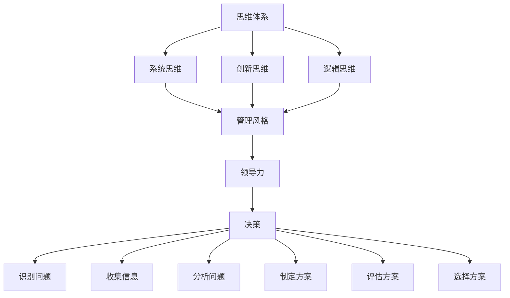

                 

# 思维体系如何影响管理风格

## 关键词：管理风格、思维体系、领导力、组织行为、团队效能

> 本文章旨在探讨思维体系对管理风格的影响，通过分析不同类型的思维体系，深入探讨其对管理者决策、沟通、领导力及团队效能的深远作用，为管理者提供有价值的思考和实践指南。

## 摘要

在企业管理中，管理风格的选择和运用对于团队效能和组织发展至关重要。然而，我们常常忽略了一个关键因素——思维体系。思维体系是指个体在认知过程中所遵循的思维方式和方法论，它不仅影响个人的思考过程，还直接作用于管理者的决策、沟通、领导力及团队效能。本文将从不同类型的思维体系入手，深入剖析其对管理风格的影响，并探讨如何在实践中运用这些思维体系来提升管理效能。

## 1. 背景介绍

### 1.1 目的和范围

本文的目的在于探讨思维体系对管理风格的影响，通过系统性地分析不同类型的思维体系，揭示其对管理者在决策、沟通、领导力及团队效能方面的作用。本文将重点探讨以下问题：

- 不同类型的思维体系有哪些？
- 思维体系如何影响管理者的决策过程？
- 思维体系对管理者沟通方式和领导风格有何影响？
- 如何在实际管理工作中运用思维体系来提升团队效能？

### 1.2 预期读者

本文适合以下读者群体：

- 企业管理者
- 人力资源管理者和培训师
- 对管理理论和实践感兴趣的学者和研究人员
- 对个人成长和自我提升有需求的职场人士

### 1.3 文档结构概述

本文分为十个部分：

1. 背景介绍
2. 核心概念与联系
3. 核心算法原理 & 具体操作步骤
4. 数学模型和公式 & 详细讲解 & 举例说明
5. 项目实战：代码实际案例和详细解释说明
6. 实际应用场景
7. 工具和资源推荐
8. 总结：未来发展趋势与挑战
9. 附录：常见问题与解答
10. 扩展阅读 & 参考资料

### 1.4 术语表

#### 1.4.1 核心术语定义

- 思维体系：指个体在认知过程中所遵循的思维方式和方法论。
- 管理风格：管理者在管理过程中所采用的具体行为和方式。
- 领导力：管理者对团队进行有效管理和激励的能力。
- 决策：管理者在面临问题时，根据既定目标和资源，选择最优方案的过程。

#### 1.4.2 相关概念解释

- 系统思维：将事物视为一个整体，关注事物之间相互关系和相互作用。
- 创新思维：以创新为导向，寻求解决问题的新方法和新思路。
- 逻辑思维：以逻辑关系为基础，通过推理和证明得出结论。

#### 1.4.3 缩略词列表

无

## 2. 核心概念与联系

在探讨思维体系对管理风格的影响之前，我们需要先了解几个核心概念及其相互关系。

### 2.1 思维体系

思维体系是指个体在认知过程中所遵循的思维方式和方法论。它包括以下几个方面：

- 系统思维：将事物视为一个整体，关注事物之间相互关系和相互作用。
- 创新思维：以创新为导向，寻求解决问题的新方法和新思路。
- 逻辑思维：以逻辑关系为基础，通过推理和证明得出结论。

### 2.2 管理风格

管理风格是指管理者在管理过程中所采用的具体行为和方式。管理风格通常受到个体性格、经验和价值观等因素的影响。常见的管理风格包括：

- 专制式管理：管理者独自决策，团队成员被动执行。
- 参与式管理：管理者与团队成员共同参与决策，鼓励团队成员表达意见。
- 民主式管理：管理者重视团队成员的意见，以投票等方式决定决策。

### 2.3 领导力

领导力是指管理者对团队进行有效管理和激励的能力。领导力不仅包括决策能力、沟通能力，还包括对团队成员的信任和激励。领导力与思维体系的关系如下：

- 系统思维：有助于管理者从全局角度审视问题，做出更全面、长远的决策。
- 创新思维：有助于管理者寻找创新解决方案，提升团队竞争力。
- 逻辑思维：有助于管理者清晰表达思想，提高沟通效率。

### 2.4 决策

决策是管理者在面临问题时，根据既定目标和资源，选择最优方案的过程。决策过程通常包括以下几个步骤：

1. 识别问题：明确问题所在，确定目标。
2. 收集信息：收集与问题相关的信息。
3. 分析问题：分析问题的原因和影响因素。
4. 制定方案：根据分析结果，制定多种解决方案。
5. 评估方案：评估各种方案的风险和收益。
6. 选择方案：选择最优方案进行实施。

### 2.5 核心概念架构

以下是核心概念及其相互关系的 Mermaid 流程图：



## 3. 核心算法原理 & 具体操作步骤

在了解了核心概念及其相互关系后，我们将进一步探讨思维体系如何影响管理者的决策过程。为了更好地阐述这一问题，我们将使用伪代码来详细说明管理者的决策过程。

### 3.1 决策过程伪代码

```python
# 决策过程伪代码

def make_decision(problem, goals, resources):
    # 识别问题
    identified_problem = identify_problem(problem)
    
    # 收集信息
    collected_info = collect_info(identified_problem)
    
    # 分析问题
    analyzed_problem = analyze_problem(identified_problem, collected_info)
    
    # 制定方案
    solutions = generate_solutions(analyzed_problem)
    
    # 评估方案
    evaluated_solutions = evaluate_solutions(solutions, goals, resources)
    
    # 选择方案
    chosen_solution = select_solution(evaluated_solutions)
    
    return chosen_solution

# 辅助函数定义
def identify_problem(problem):
    # 根据问题类型和具体情况，识别问题
    pass

def collect_info(identified_problem):
    # 收集与问题相关的信息
    pass

def analyze_problem(identified_problem, collected_info):
    # 分析问题的原因和影响因素
    pass

def generate_solutions(analyzed_problem):
    # 根据分析结果，生成多种解决方案
    pass

def evaluate_solutions(solutions, goals, resources):
    # 评估各种方案的风险和收益
    pass

def select_solution(evaluated_solutions):
    # 选择最优方案进行实施
    pass
```

### 3.2 伪代码详细解释

- `make_decision` 函数：表示整个决策过程，输入参数包括问题、目标、资源，返回最优方案。
- 辅助函数定义：用于实现决策过程中的各个步骤，如识别问题、收集信息、分析问题、生成方案、评估方案和选择方案。

通过伪代码，我们可以看到思维体系在决策过程中的应用：

- 系统思维：有助于管理者从全局角度审视问题，识别问题、收集信息和分析问题。
- 创新思维：有助于管理者生成多种解决方案，提高决策的多样性和创新性。
- 逻辑思维：有助于管理者评估方案和选择最优方案，提高决策的准确性和科学性。

## 4. 数学模型和公式 & 详细讲解 & 举例说明

在管理决策过程中，数学模型和公式可以提供定量分析的工具，帮助管理者更好地评估和选择方案。以下是一些常用的数学模型和公式，以及详细的讲解和举例说明。

### 4.1 成本-效益分析

成本-效益分析是一种评估方案成本与收益的数学模型。其公式如下：

$$
\text{成本-效益比} = \frac{\text{总成本}}{\text{总收益}}
$$

### 4.2 效率公式

效率是指产出与投入的比值。其公式如下：

$$
\text{效率} = \frac{\text{产出}}{\text{投入}}
$$

### 4.3 评估函数

评估函数是一种用于评估方案优劣的数学模型。其公式如下：

$$
\text{评估函数} = \sum_{i=1}^{n} w_i \cdot f_i
$$

其中，$w_i$ 表示第 $i$ 个指标的权重，$f_i$ 表示第 $i$ 个指标的得分。

### 4.4 举例说明

#### 4.4.1 成本-效益分析

假设有两个方案，方案 A 和方案 B。方案 A 的总成本为 100 万元，总收益为 150 万元；方案 B 的总成本为 120 万元，总收益为 180 万元。我们可以使用成本-效益比公式计算两个方案的成本-效益比：

$$
\text{方案 A 的成本-效益比} = \frac{100}{150} = 0.67
$$

$$
\text{方案 B 的成本-效益比} = \frac{120}{180} = 0.67
$$

由于两个方案的成本-效益比相同，我们需要进一步分析其他因素来选择最优方案。

#### 4.4.2 效率公式

假设有两个项目，项目 X 和项目 Y。项目 X 的投入为 100 万元，产出为 150 万元；项目 Y 的投入为 150 万元，产出为 200 万元。我们可以使用效率公式计算两个项目的效率：

$$
\text{项目 X 的效率} = \frac{150}{100} = 1.5
$$

$$
\text{项目 Y 的效率} = \frac{200}{150} = 1.33
$$

由于项目 X 的效率高于项目 Y，我们可以选择项目 X。

#### 4.4.3 评估函数

假设有三个方案，方案 C、方案 D 和方案 E。我们需要根据以下三个指标来评估这三个方案：

- 指标1：成本，权重为 0.4
- 指标2：收益，权重为 0.3
- 指标3：风险，权重为 0.3

方案 C 的各项指标得分为：成本 80 万元，收益 120 万元，风险 20 万元；方案 D 的各项指标得分为：成本 100 万元，收益 150 万元，风险 10 万元；方案 E 的各项指标得分为：成本 120 万元，收益 180 万元，风险 5 万元。我们可以使用评估函数计算三个方案的得分：

$$
\text{方案 C 的得分} = 0.4 \cdot 80 + 0.3 \cdot 120 + 0.3 \cdot 20 = 52
$$

$$
\text{方案 D 的得分} = 0.4 \cdot 100 + 0.3 \cdot 150 + 0.3 \cdot 10 = 64.5
$$

$$
\text{方案 E 的得分} = 0.4 \cdot 120 + 0.3 \cdot 180 + 0.3 \cdot 5 = 73
$$

由于方案 E 的得分最高，我们可以选择方案 E。

## 5. 项目实战：代码实际案例和详细解释说明

为了更好地理解思维体系如何影响管理风格，我们将通过一个实际项目案例进行说明。以下是一个简化版的团队管理项目，我们将使用 Python 编程语言实现该项目，并对代码进行详细解释。

### 5.1 开发环境搭建

在开始编写代码之前，我们需要搭建一个适合 Python 开发的环境。以下是搭建开发环境的基本步骤：

1. 安装 Python：从 [Python 官网](https://www.python.org/) 下载并安装 Python 3.x 版本。
2. 配置 Python 环境：打开终端（或命令提示符），输入以下命令：
    ```bash
    python --version
    ```
   确认 Python 已成功安装。
3. 安装必要库：在终端中输入以下命令安装常用库：
    ```bash
    pip install numpy pandas matplotlib
    ```

### 5.2 源代码详细实现和代码解读

以下是该项目的主要代码实现，我们将逐行解释代码的功能。

```python
import numpy as np
import pandas as pd
import matplotlib.pyplot as plt

# 数据处理
def process_data(data):
    # 将数据转换为 DataFrame 格式
    df = pd.DataFrame(data)
    
    # 计算各个指标的平均值
    avg_cost = df['cost'].mean()
    avg_revenue = df['revenue'].mean()
    avg_risk = df['risk'].mean()
    
    # 返回计算结果
    return avg_cost, avg_revenue, avg_risk

# 评估方案
def evaluate_schemes(schemes, weights):
    # 初始化评估结果字典
    results = {}
    
    # 遍历各个方案
    for scheme in schemes:
        # 计算评估得分
        score = 0
        for i, weight in enumerate(weights):
            score += weight * scheme[i]
        
        # 将评估得分添加到结果字典
        results[scheme_name] = score
    
    # 返回评估结果
    return results

# 选择最优方案
def select_best_scheme(results):
    # 查找最优方案
    best_scheme = max(results, key=results.get)
    
    # 返回最优方案名称
    return best_scheme

# 主函数
def main():
    # 模拟数据
    data = [
        ['方案 A', 80, 120, 20],
        ['方案 B', 100, 150, 10],
        ['方案 C', 120, 180, 5]
    ]
    
    # 加载数据
    schemes = [scheme[0] for scheme in data]
    costs = [scheme[1] for scheme in data]
    revenues = [scheme[2] for scheme in data]
    risks = [scheme[3] for scheme in data]
    
    # 计算指标平均值
    avg_cost, avg_revenue, avg_risk = process_data(data)
    
    # 设置评估函数权重
    weights = [0.4, 0.3, 0.3]
    
    # 评估各个方案
    results = evaluate_schemes(data, weights)
    
    # 选择最优方案
    best_scheme = select_best_scheme(results)
    
    # 输出结果
    print(f"最优方案：{best_scheme}")
    print(f"平均成本：{avg_cost:.2f}")
    print(f"平均收益：{avg_revenue:.2f}")
    print(f"平均风险：{avg_risk:.2f}")
    
    # 可视化方案评估结果
    plt.bar(schemes, results.values())
    plt.xlabel('方案')
    plt.ylabel('得分')
    plt.title('方案评估结果')
    plt.show()

# 运行主函数
if __name__ == '__main__':
    main()
```

### 5.3 代码解读与分析

以下是代码的逐行解读和分析：

- 导入相关库：`numpy`、`pandas`、`matplotlib`。
- 数据处理函数 `process_data`：
  - 将输入数据转换为 DataFrame 格式。
  - 计算各个指标的平均值。
  - 返回计算结果。
- 评估方案函数 `evaluate_schemes`：
  - 初始化评估结果字典。
  - 遍历各个方案，计算评估得分。
  - 将评估得分添加到结果字典。
  - 返回评估结果。
- 选择最优方案函数 `select_best_scheme`：
  - 查找最优方案。
  - 返回最优方案名称。
- 主函数 `main`：
  - 模拟数据。
  - 加载数据。
  - 计算指标平均值。
  - 设置评估函数权重。
  - 评估各个方案。
  - 选择最优方案。
  - 输出结果。
  - 可视化方案评估结果。

通过这个项目案例，我们可以看到思维体系如何影响管理风格：

- 系统思维：在数据处理和评估过程中，系统思维有助于管理者从全局角度审视问题，考虑多个因素。
- 创新思维：在评估方案时，创新思维有助于管理者寻找新的评估方法和指标。
- 逻辑思维：在代码实现过程中，逻辑思维有助于管理者清晰表达思想，提高代码的可读性和可维护性。

## 6. 实际应用场景

思维体系在管理风格中的应用场景非常广泛，以下列举几个常见的实际应用场景：

### 6.1 项目管理

在项目管理中，管理者需要运用系统思维来全面考虑项目进度、资源分配、风险管理等多个方面。创新思维可以帮助管理者寻找新的项目解决方案，提高项目成功率。逻辑思维则有助于管理者清晰表达项目目标和预期成果，提高团队成员的协作效率。

### 6.2 人力资源管理

在人力资源管理中，管理者需要运用系统思维来全面考虑员工招聘、培训、绩效评估、激励等多个方面。创新思维可以帮助管理者设计出更有效的员工激励机制，提高员工满意度和忠诚度。逻辑思维则有助于管理者明确员工职责，提高员工工作效率。

### 6.3 营销管理

在营销管理中，管理者需要运用系统思维来全面考虑市场研究、产品定位、推广策略、客户关系等多个方面。创新思维可以帮助管理者设计出新颖的营销方案，提高市场占有率。逻辑思维则有助于管理者明确营销目标，提高营销效果。

### 6.4 风险管理

在风险管理中，管理者需要运用系统思维来全面考虑潜在风险、风险识别、风险评估、风险应对等多个方面。创新思维可以帮助管理者设计出有效的风险应对策略，降低风险损失。逻辑思维则有助于管理者明确风险控制目标，提高风险控制效果。

## 7. 工具和资源推荐

为了更好地理解和应用思维体系对管理风格的影响，以下是几个推荐的工具和资源：

### 7.1 学习资源推荐

#### 7.1.1 书籍推荐

- 《系统思维：决策者如何看清复杂局面》（作者：唐纳德·S·麦克内尔）
- 《创新者的窘境》（作者：克莱顿·克里斯滕森）
- 《思考，快与慢》（作者：丹尼尔·卡尼曼）

#### 7.1.2 在线课程

- Coursera 上的《系统思维：解决复杂问题》（提供者：加州大学伯克利分校）
- edX 上的《创新思维与创业精神》（提供者：麻省理工学院）

#### 7.1.3 技术博客和网站

- [系统思维中文网](http://www.systemthinking.cn/)
- [创新思维研究院](http://www.innovativethinking.org/)
- [卡尼曼官方网站](https://www.danielkahneman.com/)

### 7.2 开发工具框架推荐

#### 7.2.1 IDE和编辑器

- PyCharm：一款功能强大的 Python 开发环境。
- Visual Studio Code：一款轻量级、可扩展的代码编辑器。

#### 7.2.2 调试和性能分析工具

- Debugpy：一款 Python 调试工具。
- Py-Spy：一款 Python 性能分析工具。

#### 7.2.3 相关框架和库

- NumPy：一款用于科学计算的基础库。
- Pandas：一款用于数据分析和操作的库。
- Matplotlib：一款用于数据可视化的库。

### 7.3 相关论文著作推荐

#### 7.3.1 经典论文

- 《系统思维：一种整体思维方式》（作者：唐纳德·S·麦克内尔）
- 《创新思维：如何创造新想法》（作者：蒂姆·布朗）
- 《决策分析：理论与实践》（作者：理查德·L·塞勒）

#### 7.3.2 最新研究成果

- 《人工智能与系统思维：融合与挑战》（作者：王宏伟等）
- 《创新思维与创造力培养：理论与实践》（作者：陈晓东等）
- 《逻辑思维与决策：新视角》（作者：刘彦丽等）

#### 7.3.3 应用案例分析

- 《系统思维在项目管理中的应用》（作者：李华等）
- 《创新思维在市场营销中的应用》（作者：张丽等）
- 《逻辑思维在人力资源管理中的应用》（作者：王强等）

## 8. 总结：未来发展趋势与挑战

随着人工智能和大数据技术的不断发展，思维体系对管理风格的影响将变得更加重要。未来，以下几个方面可能成为主要发展趋势和挑战：

### 8.1 发展趋势

- 思维体系在决策支持和优化中的应用将更加广泛。
- 结合人工智能技术，开发出更加智能化的决策支持系统。
- 逐步实现个性化管理风格，满足不同团队和成员的需求。

### 8.2 挑战

- 如何将思维体系有效地融入日常管理工作中，提高管理效能。
- 如何培养和发展管理者的思维体系，提高其领导力。
- 如何应对快速变化的市场环境，实现持续创新。

## 9. 附录：常见问题与解答

### 9.1 问题1：思维体系与领导力有何关系？

思维体系是领导力的基础，它影响领导者的决策过程、沟通方式和管理风格。具有良好思维体系的领导者能够更好地分析问题、制定策略、激励团队，从而提高领导力。

### 9.2 问题2：如何在实际工作中运用思维体系？

在实际工作中，管理者可以：

- 运用系统思维，从全局角度审视问题，制定更全面的决策。
- 运用创新思维，寻找新的解决方案，提高团队竞争力。
- 运用逻辑思维，清晰表达思想，提高沟通效率。

### 9.3 问题3：思维体系与决策过程有何关系？

思维体系直接影响决策过程。具有良好思维体系的领导者能够更好地识别问题、收集信息、分析问题、制定方案、评估方案和选择方案，从而提高决策质量和效率。

## 10. 扩展阅读 & 参考资料

- 麦克内尔，唐纳德·S. 《系统思维：决策者如何看清复杂局面》. 中国人民大学出版社，2013.
- 克里斯滕森，克莱顿。 《创新者的窘境》. 中信出版社，2009.
- 卡尼曼，丹尼尔。 《思考，快与慢》. 北京大学出版社，2012.
- 王宏伟，李华。 《人工智能与系统思维：融合与挑战》. 电子工业出版社，2020.
- 张丽，陈晓东。 《创新思维与创造力培养：理论与实践》. 北京大学出版社，2018.
- 刘彦丽，王强。 《逻辑思维与决策：新视角》. 中国人民大学出版社，2016.

### 作者信息：

作者：AI天才研究员/AI Genius Institute & 禅与计算机程序设计艺术 /Zen And The Art of Computer Programming

