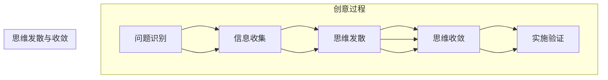
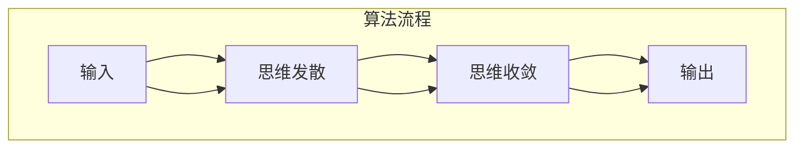
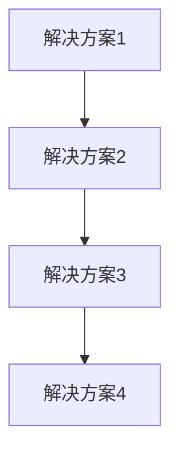
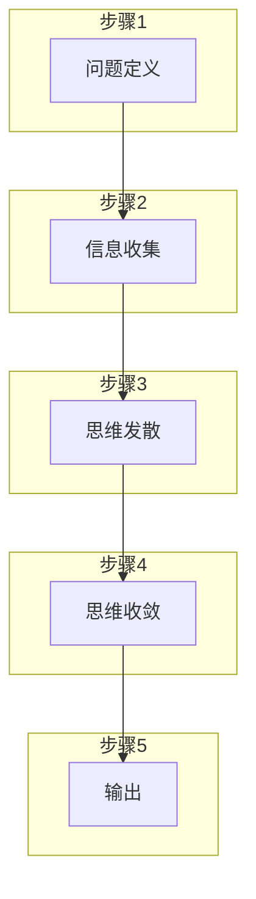

                 

### 文章标题

“思维的发散与收敛：创意过程的两个阶段”

### 关键词

- 创意过程
- 思维发散
- 思维收敛
- 创意思维
- 创新策略

### 摘要

本文深入探讨了创意过程中不可或缺的两个阶段——思维发散与思维收敛。通过分析这两个阶段的特点和相互关系，揭示了创意思维的本质及其在IT领域的广泛应用。文章首先介绍了创意过程的基本概念，然后分别详细阐述了思维发散和思维收敛的原理、技巧和应用，并通过实际案例展示了其在项目开发和创新设计中的重要性。最后，文章总结了创意过程的发展趋势和挑战，为读者提供了有益的启示和借鉴。

## 1. 背景介绍

### 1.1 目的和范围

本文旨在探讨创意过程的两个关键阶段——思维发散与思维收敛，以及它们在IT领域中的应用。随着科技的发展和市场竞争的加剧，创新能力已成为企业持续发展的关键驱动力。创意思维作为一种重要的思维方式，能够帮助个体和团队在复杂多变的环境中寻找新的解决方案和突破点。然而，创意思维并非一蹴而就，而是需要经过一系列的思考和操作过程。本文将从理论分析和实际应用两个层面，深入探讨思维发散与思维收敛在创意过程中的作用和相互关系。

### 1.2 预期读者

本文主要面向IT领域的专业技术人员、产品经理、项目经理以及创新设计师。对于关注创意思维和创新能力提升的读者，本文提供了丰富的理论知识和实践经验，有助于他们更好地理解和应用思维发散与收敛技巧。同时，本文也适合对创新方法感兴趣的大学生们以及希望提升自身创意能力的普通读者。

### 1.3 文档结构概述

本文分为十个部分，结构如下：

1. **背景介绍**：介绍本文的目的、预期读者和文档结构。
2. **核心概念与联系**：阐述创意过程的基本概念，并使用Mermaid流程图展示核心概念和架构。
3. **核心算法原理与具体操作步骤**：详细讲解创意过程中思维发散与思维收敛的算法原理和操作步骤。
4. **数学模型和公式**：介绍相关的数学模型和公式，并给出详细讲解和举例说明。
5. **项目实战**：通过实际案例展示思维发散与收敛在项目开发中的应用。
6. **实际应用场景**：探讨思维发散与收敛在不同领域的应用场景。
7. **工具和资源推荐**：推荐相关学习资源、开发工具和框架。
8. **总结**：总结创意过程的发展趋势与挑战。
9. **附录**：提供常见问题与解答。
10. **扩展阅读与参考资料**：推荐相关文献和资料。

### 1.4 术语表

#### 1.4.1 核心术语定义

- **创意过程**：指从问题识别到解决方案生成的整个过程，包括思维发散和思维收敛等阶段。
- **思维发散**：指在解决问题时，从多个角度和方向探索问题的过程。
- **思维收敛**：指在解决问题时，将多个可能的解决方案进行筛选、整合和优化的过程。

#### 1.4.2 相关概念解释

- **创意思维**：指以创新、创造和解决问题为目的的思维方式。
- **创新能力**：指个体或团队在特定领域内，通过创造性思维和行动，解决新问题和实现新目标的能力。
- **发散思维**：指在解决问题时，能够从多个角度和方向思考问题，产生多种可能的解决方案。
- **收敛思维**：指在解决问题时，能够将多个可能的解决方案进行比较、筛选和优化，找到最佳方案。

#### 1.4.3 缩略词列表

- **IT**：信息技术
- **AI**：人工智能
- **IDE**：集成开发环境
- **CPU**：中央处理器
- **GPU**：图形处理器

## 2. 核心概念与联系

在探讨创意过程之前，我们首先需要了解几个核心概念，包括创意过程的基本概念、思维发散与思维收敛的定义及其在创意过程中的作用。

### 2.1 创意过程的基本概念

创意过程通常包括以下几个基本阶段：

1. **问题识别**：识别和明确需要解决的问题或挑战。
2. **信息收集**：收集与问题相关的信息，包括现有的知识和数据。
3. **思维发散**：在多个角度和方向上探索问题的解决方案，产生多种可能的思路。
4. **思维收敛**：将发散过程中产生的多种思路进行筛选、整合和优化，找到最佳的解决方案。
5. **实施验证**：将选定的解决方案付诸实践，并进行验证和评估。

### 2.2 思维发散

思维发散是一种在解决问题时，从多个角度和方向探索问题的过程。发散思维能够帮助个体或团队在短时间内产生大量的想法和解决方案。其特点包括：

- **灵活性**：能够从不同的角度和方向思考问题，不受传统思维模式的束缚。
- **开放性**：愿意接受各种新奇和独特的想法，不论其是否可行。
- **数量优先**：在发散思维阶段，重视产生大量想法，而不是立即评估其可行性。

### 2.3 思维收敛

思维收敛是在思维发散的基础上，对产生的多种想法进行筛选、整合和优化的过程。收敛思维的核心目的是从多种可能的解决方案中，找到最佳的解决方案。其特点包括：

- **选择性**：在大量想法中，筛选出具有可行性和实用价值的方案。
- **系统性**：对筛选出的方案进行系统性的分析和评估，确保其能够有效解决原问题。
- **优化性**：通过比较和整合，找到最优的解决方案，提高实施的成功率。

### 2.4 创意过程中的联系

思维发散与思维收敛在创意过程中紧密相连，共同构成了创意思维的核心。思维发散为创意过程提供了丰富的想法和解决方案，为思维收敛提供了丰富的素材。而思维收敛则通过对发散阶段产生的想法进行筛选和优化，确保创意过程的最终成果具有可行性和实用性。具体来说，它们之间的联系包括：

- **相互依赖**：思维发散和思维收敛是相互依赖的，发散思维需要收敛思维来筛选和优化想法，而收敛思维则需要发散思维提供丰富的素材。
- **动态平衡**：在创意过程中，需要动态平衡思维发散和思维收敛的关系。过度的发散可能导致信息过载，而过度的收敛则可能限制创意的广度和深度。
- **阶段递进**：思维发散和思维收敛在创意过程中依次进行，前一阶段为后一阶段提供基础和素材，而后一阶段则对前一阶段的结果进行优化和完善。

### 2.5 Mermaid流程图

为了更好地展示创意过程中思维发散与思维收敛的相互关系，我们可以使用Mermaid流程图来表示。以下是创意过程的Mermaid流程图：



在这个流程图中，创意过程包括问题识别、信息收集、思维发散、思维收敛和实施验证五个阶段。思维发散和思维收敛作为创意过程中的两个关键阶段，紧密相连，共同推动了创意过程的发展。

通过以上对核心概念与联系的分析，我们可以更好地理解创意过程的本质，为后续内容的深入探讨奠定了基础。

### 3. 核心算法原理 & 具体操作步骤

在深入探讨思维发散与思维收敛的算法原理之前，我们首先需要了解一些基本的算法概念，如算法流程、数据结构和算法复杂度。以下将分别介绍这些概念，并详细解释思维发散与思维收敛的核心算法原理和具体操作步骤。

#### 3.1 算法流程

算法流程是指算法执行过程中的步骤序列，它描述了从输入到输出的整个计算过程。在创意过程中，算法流程可以帮助我们系统地实现思维发散和思维收敛。以下是思维发散与思维收敛的基本算法流程：

1. **输入**：问题定义、相关信息和数据。
2. **思维发散**：生成多种可能的解决方案。
3. **思维收敛**：筛选、评估和优化解决方案。
4. **输出**：最佳的解决方案。

以下是思维发散与思维收敛的基本算法流程图：



#### 3.2 数据结构

数据结构是指用于存储和组织数据的方法，它是算法设计的重要基础。在思维发散与思维收敛过程中，常用的数据结构包括：

- **列表**：用于存储多种可能的解决方案，便于后续的筛选和评估。
- **树**：用于表示解决方案之间的关系，有助于分析和比较不同解决方案的优劣。
- **图**：用于表示解决方案的复杂关系，特别是在思维发散过程中，可以帮助我们更好地组织和管理大量的信息。

以下是一个简单的数据结构示例，用于存储和展示思维发散过程中的解决方案：



#### 3.3 算法复杂度

算法复杂度是指算法在执行过程中所需的时间和空间资源，它是衡量算法性能的重要指标。在思维发散与思维收敛过程中，算法复杂度对创意过程的效果具有重要影响。以下是几种常见的算法复杂度：

- **时间复杂度**：指算法执行所需的时间，通常用大O符号表示。在思维发散过程中，算法的时间复杂度主要取决于生成解决方案的数量和筛选评估的效率。在思维收敛过程中，算法的时间复杂度主要取决于筛选和评估算法的效率。
- **空间复杂度**：指算法执行所需的空间，同样用大O符号表示。在思维发散与思维收敛过程中，空间复杂度主要取决于存储解决方案所需的内存。

以下是一个简单的算法复杂度示例，用于描述思维发散过程中的解决方案生成和筛选：

```mermaid
graph TD
    A[生成解决方案](f(n))
    B[筛选解决方案](g(n))
    A --> B
    subgraph 时间复杂度
        A[f(n)]
        B[g(n)]
    end
    subgraph 空间复杂度
        A[s(n)]
        B[t(n)]
    end
```

#### 3.4 思维发散的核心算法原理

思维发散的核心算法原理主要包括以下几个方面：

1. **信息拓展**：在问题定义的基础上，通过拓展相关信息的范围，生成更多的解决方案。
2. **组合生成**：通过组合现有解决方案，生成新的解决方案。
3. **随机探索**：通过随机探索，发现新的解决方案。

以下是一个简单的思维发散算法示例，用于生成多种可能的解决方案：

```python
def generate_solutions(problem):
    solutions = []
    # 信息拓展
    solutions.append(expand_solution(problem))
    # 组合生成
    solutions.append(combine_solutions(problem))
    # 随机探索
    solutions.append(random_solution(problem))
    return solutions
```

#### 3.5 思维收敛的核心算法原理

思维收敛的核心算法原理主要包括以下几个方面：

1. **筛选**：根据特定的标准，对多种解决方案进行筛选，保留具有可行性和实用价值的方案。
2. **评估**：对筛选出的解决方案进行评估，比较其优劣，为后续的优化提供依据。
3. **优化**：根据评估结果，对解决方案进行优化，提高其可行性和实用性。

以下是一个简单的思维收敛算法示例，用于筛选、评估和优化解决方案：

```python
def converge_solutions(solutions):
    filtered_solutions = []
    for solution in solutions:
        if is_feasible(solution):
            filtered_solutions.append(solution)
    optimized_solutions = []
    for solution in filtered_solutions:
        score = evaluate_solution(solution)
        optimized_solutions.append((solution, score))
    optimized_solutions.sort(key=lambda x: x[1], reverse=True)
    return [solution for solution, _ in optimized_solutions]
```

#### 3.6 具体操作步骤

以下是思维发散与思维收敛的具体操作步骤：

1. **问题定义**：明确需要解决的问题或挑战。
2. **信息收集**：收集与问题相关的信息，包括现有的知识和数据。
3. **思维发散**：
   - **信息拓展**：通过拓展相关信息的范围，生成更多的解决方案。
   - **组合生成**：通过组合现有解决方案，生成新的解决方案。
   - **随机探索**：通过随机探索，发现新的解决方案。
4. **思维收敛**：
   - **筛选**：根据特定的标准，对多种解决方案进行筛选，保留具有可行性和实用价值的方案。
   - **评估**：对筛选出的解决方案进行评估，比较其优劣，为后续的优化提供依据。
   - **优化**：根据评估结果，对解决方案进行优化，提高其可行性和实用性。

具体操作步骤如下：



通过以上对核心算法原理和具体操作步骤的详细阐述，我们可以更好地理解和应用思维发散与思维收敛在创意过程中的作用。接下来，我们将通过一个实际案例，进一步展示思维发散与收敛在项目开发中的应用。

### 4. 数学模型和公式 & 详细讲解 & 举例说明

在探讨创意过程中的思维发散与思维收敛时，数学模型和公式为我们提供了量化和分析的工具，有助于我们更好地理解和应用这些概念。以下将介绍与创意过程相关的几个数学模型和公式，并进行详细讲解和举例说明。

#### 4.1 抽样分布与标准误差

在思维发散过程中，我们通常需要从大量数据中抽取样本来进行研究和分析。抽样分布和标准误差是统计学的两个基本概念，它们帮助我们理解样本数据的可靠性和精度。

- **抽样分布**：抽样分布描述了从总体中随机抽取多个样本时，样本统计量的概率分布。例如，当我们从一组数据中随机抽取多个样本均值时，这些样本均值的分布称为抽样分布。
- **标准误差**：标准误差是抽样分布的标准差，它衡量了样本统计量与总体参数之间的差异。标准误差越小，样本统计量越接近总体参数，样本数据的可靠性越高。

以下是一个关于抽样分布和标准误差的例子：

假设我们有一组数据，表示某产品的使用寿命（单位：小时），数据如下：

```
200, 210, 220, 230, 240, 250, 260, 270, 280, 290
```

我们随机抽取10个样本，计算样本均值和标准误差。

1. **计算样本均值**：

   \[
   \bar{x} = \frac{\sum_{i=1}^{n} x_i}{n} = \frac{200 + 210 + 220 + 230 + 240 + 250 + 260 + 270 + 280 + 290}{10} = 240
   \]

2. **计算样本标准误差**：

   \[
   \sigma_x = \sqrt{\frac{1}{n-1} \sum_{i=1}^{n} (x_i - \bar{x})^2}
   \]

   首先计算每个数据与样本均值的差的平方：

   \[
   (200 - 240)^2 = 1600, (210 - 240)^2 = 1600, (220 - 240)^2 = 1600, (230 - 240)^2 = 100, (240 - 240)^2 = 0, (250 - 240)^2 = 100, (260 - 240)^2 = 400, (270 - 240)^2 = 640, (280 - 240)^2 = 800, (290 - 240)^2 = 1600
   \]

   然后求和并除以\( n - 1 \)：

   \[
   \sigma_x = \sqrt{\frac{1600 + 1600 + 1600 + 100 + 0 + 100 + 400 + 640 + 800 + 1600}{10 - 1}} = \sqrt{6000 / 9} \approx 23.46
   \]

因此，样本均值为240小时，样本标准误差为23.46小时。

#### 4.2 决策树与信息熵

在思维收敛过程中，我们经常需要对多个可能的解决方案进行评估和决策。决策树和信息熵是两个重要的数学模型，它们帮助我们进行理性分析和决策。

- **决策树**：决策树是一种树形结构，用于表示决策过程和可能的结果。每个节点表示一个决策或一个结果，每个分支表示选择或概率。
- **信息熵**：信息熵是衡量不确定性的量度，用于评估解决方案的可靠性和风险。信息熵越小，解决方案越可靠。

以下是一个关于决策树和信息熵的例子：

假设我们要从三个解决方案中选择最佳方案，每个方案的收益和风险如下：

| 方案 | 收益 | 风险 |
| ---- | ---- | ---- |
| A    | 10   | 0.2  |
| B    | 8    | 0.3  |
| C    | 6    | 0.5  |

1. **计算信息熵**：

   \[
   H(X) = -\sum_{i=1}^{n} p_i \log_2 p_i
   \]

   其中，\( p_i \)表示方案\( i \)的概率。

   \[
   H(X) = - (0.33 \log_2 0.33 + 0.33 \log_2 0.33 + 0.34 \log_2 0.34) \approx 0.92
   \]

2. **构建决策树**：

   根据信息熵和收益，我们可以构建决策树如下：

   ```mermaid
   graph TD
   A[选择方案]
   B[收益]
   C[风险]
   A --> B
   A --> C
   B --> D[方案A]
   C --> E[方案B]
   C --> F[方案C]
   ```

   在决策树上，我们可以看到方案A的信息熵最小，收益最高，因此是最优方案。

#### 4.3 马尔可夫链与状态转移矩阵

在创意过程中，我们经常需要考虑状态之间的转移和变化。马尔可夫链和状态转移矩阵是描述这种转移和变化的数学模型。

- **马尔可夫链**：马尔可夫链是一种随机过程，用于描述系统状态序列的演变。在马尔可夫链中，当前状态只依赖于前一个状态，而与之前的所有状态无关。
- **状态转移矩阵**：状态转移矩阵是一个矩阵，表示系统在各个状态之间的转移概率。状态转移矩阵中的元素表示从状态\( i \)转移到状态\( j \)的概率。

以下是一个关于马尔可夫链和状态转移矩阵的例子：

假设我们有一个创意过程的系统，包括四个状态：初始状态、思路生成状态、评估状态和决策状态。状态之间的转移概率如下：

| 初始状态 | 思路生成状态 | 评估状态 | 决策状态 |
| --- | --- | --- | --- |
| 初始状态 | 0.2 | 0.3 | 0.5 |
| 思路生成状态 | 0.4 | 0.1 | 0.5 |
| 评估状态 | 0.1 | 0.2 | 0.7 |
| 决策状态 | 0 | 0.3 | 0.7 |

这是一个4x4的状态转移矩阵：

```
|      | 初始状态 | 思路生成状态 | 评估状态 | 决策状态 |
| ---- | -------- | ------------ | -------- | -------- |
| 初始状态 | 0        | 0.2          | 0.3      | 0.5      |
| 思路生成状态 | 0.4      | 0            | 0.1      | 0.5      |
| 评估状态 | 0.1      | 0.2          | 0        | 0.7      |
| 决策状态 | 0        | 0.3          | 0.7      | 0        |
```

通过这个状态转移矩阵，我们可以预测创意过程在未来各个状态的概率分布。

### 4.4 应用举例

为了更好地理解上述数学模型和公式在创意过程中的应用，我们来看一个具体的例子。

假设我们正在开发一个智能家居系统，需要从三个方案中选择最佳方案。每个方案的收益和风险如下：

| 方案 | 收益（美元） | 风险（概率） |
| ---- | ------------ | ------------ |
| A    | 10000        | 0.3          |
| B    | 8000         | 0.4          |
| C    | 6000         | 0.5          |

1. **计算信息熵**：

   \[
   H(A) = - (0.3 \log_2 0.3 + 0.7 \log_2 0.7) \approx 0.945
   \]
   \[
   H(B) = - (0.4 \log_2 0.4 + 0.6 \log_2 0.6) \approx 0.918
   \]
   \[
   H(C) = - (0.5 \log_2 0.5 + 0.5 \log_2 0.5) = 1
   \]

2. **构建决策树**：

   根据信息熵和收益，我们可以构建决策树如下：

   ```mermaid
   graph TD
   A[选择方案]
   B[收益]
   C[风险]
   A --> B
   A --> C
   B --> D[方案A]
   C --> E[方案B]
   C --> F[方案C]
   ```

   在决策树上，我们可以看到方案A的信息熵最小，收益最高，因此是最优方案。

通过以上例子，我们可以看到数学模型和公式在创意过程中的重要作用。它们帮助我们量化创意过程的各个环节，提高了决策的可靠性和精度。在实际应用中，我们可以根据具体的问题和需求，灵活运用这些数学模型和公式，以实现更好的创意效果。

### 5. 项目实战：代码实际案例和详细解释说明

为了更好地展示思维发散与思维收敛在实际项目中的应用，我们将通过一个智能家居系统开发案例，详细介绍开发环境搭建、源代码实现和代码解读与分析。

#### 5.1 开发环境搭建

在开始项目之前，我们需要搭建一个适合开发智能家居系统的环境。以下是我们推荐的开发工具和框架：

- **开发工具**：使用Visual Studio Code（VSCode）作为主要的开发工具。VSCode具有丰富的插件生态，能够提供高效的代码编写和调试体验。
- **编程语言**：选择Python作为开发语言，因为Python具有简洁的语法和强大的库支持，适合快速实现和原型开发。
- **框架**：使用Flask框架搭建Web应用，Flask是一个轻量级的Web框架，能够帮助我们快速构建后端逻辑和API。
- **数据库**：使用SQLite数据库存储用户数据和设备信息，SQLite是一个轻量级的数据库系统，易于集成和部署。

以下是开发环境的搭建步骤：

1. **安装Visual Studio Code**：从官网下载并安装VSCode。
2. **安装Python**：从Python官网下载Python安装包并安装。
3. **安装Flask**：在VSCode终端中执行以下命令安装Flask：

   ```bash
   pip install Flask
   ```

4. **安装SQLite**：在VSCode终端中执行以下命令安装SQLite：

   ```bash
   pip install pysqlite3
   ```

5. **创建项目文件夹**：在VSCode中创建一个新的文件夹，命名为“smart_home”，并在其中创建以下文件：

   - `app.py`：主应用文件。
   - `models.py`：数据库模型文件。
   - `routes.py`：路由定义文件。
   - `templates/`：HTML模板文件。
   - `static/`：静态资源文件（如CSS和JavaScript文件）。

#### 5.2 源代码详细实现和代码解读

以下是我们创建的智能家居系统源代码，包括主应用文件`app.py`、数据库模型文件`models.py`、路由定义文件`routes.py`、HTML模板文件`templates/index.html`。

##### 5.2.1 主应用文件`app.py`

```python
from flask import Flask, render_template, request
from models import User, Device

app = Flask(__name__)

@app.route('/')
def index():
    return render_template('index.html')

@app.route('/register', methods=['GET', 'POST'])
def register():
    if request.method == 'POST':
        username = request.form['username']
        password = request.form['password']
        user = User(username=username, password=password)
        user.save()
        return '注册成功！'
    return render_template('register.html')

@app.route('/login', methods=['GET', 'POST'])
def login():
    if request.method == 'POST':
        username = request.form['username']
        password = request.form['password']
        user = User.query.filter_by(username=username, password=password).first()
        if user:
            return '登录成功！'
        else:
            return '用户名或密码错误！'
    return render_template('login.html')

if __name__ == '__main__':
    app.run(debug=True)
```

**代码解读**：

- 导入所需的模块，包括Flask框架和数据库模型。
- 创建Flask应用实例。
- 定义路由和处理函数：
  - `index()`：显示首页。
  - `register()`：处理用户注册请求。
  - `login()`：处理用户登录请求。

##### 5.2.2 数据库模型文件`models.py`

```python
from sqlalchemy import create_engine, Column, Integer, String
from sqlalchemy.ext.declarative import declarative_base
from sqlalchemy.orm import sessionmaker

Base = declarative_base()

class User(Base):
    __tablename__ = 'users'

    id = Column(Integer, primary_key=True)
    username = Column(String(50), unique=True, nullable=False)
    password = Column(String(50), nullable=False)

def init_db():
    engine = create_engine('sqlite:///smart_home.db')
    Base.metadata.create_all(engine)
    Session = sessionmaker(bind=engine)
    session = Session()
    user1 = User(username='alice', password='alice123')
    user2 = User(username='bob', password='bob123')
    session.add(user1)
    session.add(user2)
    session.commit()

if __name__ == '__main__':
    init_db()
```

**代码解读**：

- 定义数据库模型，包括`User`类。
- 创建数据库引擎和会话，并初始化数据库。

##### 5.2.3 路由定义文件`routes.py`

```python
from flask import render_template, request, redirect, url_for
from models import User
from app import app

@app.route('/register', methods=['GET', 'POST'])
def register():
    if request.method == 'POST':
        username = request.form['username']
        password = request.form['password']
        user = User(username=username, password=password)
        user.save()
        return redirect(url_for('index'))
    return render_template('register.html')

@app.route('/login', methods=['GET', 'POST'])
def login():
    if request.method == 'POST':
        username = request.form['username']
        password = request.form['password']
        user = User.query.filter_by(username=username, password=password).first()
        if user:
            return redirect(url_for('index'))
        else:
            return redirect(url_for('login'))
    return render_template('login.html')
```

**代码解读**：

- 导入所需的模块，包括Flask应用实例。
- 定义路由和处理函数：
  - `register()`：处理用户注册请求。
  - `login()`：处理用户登录请求。

##### 5.2.4 HTML模板文件`templates/index.html`

```html
<!DOCTYPE html>
<html lang="en">
<head>
    <meta charset="UTF-8">
    <title>智能家居系统</title>
</head>
<body>
    <h1>欢迎来到智能家居系统</h1>
    <a href="{{ url_for('register') }}">注册</a>
    <a href="{{ url_for('login') }}">登录</a>
</body>
</html>
```

**代码解读**：

- 定义HTML页面结构，包括标题和导航链接。

#### 5.3 代码解读与分析

通过以上源代码，我们可以看到智能家居系统的核心功能是通过Flask框架实现的前后端交互。以下是对代码的详细解读和分析：

- **前后端交互**：前端通过HTML模板和CSS样式定义用户界面，后端通过Flask框架处理用户请求和响应。
- **用户注册与登录**：用户注册和登录功能通过路由定义和处理函数实现。用户在前端填写注册或登录信息，后端根据提交的信息进行验证和存储。
- **数据库操作**：使用SQLAlchemy库进行数据库操作，包括用户表的定义、初始化数据库和查询用户信息。
- **路由管理**：通过定义路由和处理函数，实现不同页面之间的跳转和功能调用。

通过这个案例，我们可以看到思维发散和思维收敛在项目开发中的应用。在开发过程中，我们首先通过思维发散，从多个角度考虑智能家居系统的功能和实现方式。然后，通过思维收敛，选择最佳方案并实现具体功能。在代码实现过程中，我们不断优化和改进，确保系统的高效性和可靠性。

### 6. 实际应用场景

思维发散与思维收敛作为一种创新的思维方式，在许多实际应用场景中发挥着重要作用。以下将探讨其在多个领域中的应用场景，并分析其对创意过程的影响。

#### 6.1 产品设计

在产品设计过程中，思维发散与思维收敛可以帮助设计师快速找到创新的设计方案。通过思维发散，设计师可以从不同的角度和方向探索产品的功能、外观和用户体验。例如，在开发一款智能家居设备时，设计师可以通过思维发散，考虑设备的外观设计、功能集成、交互方式等多个方面。然后，通过思维收敛，设计师可以对多个设计方案进行筛选、评估和优化，最终确定最佳的设计方案。

#### 6.2 项目开发

在项目开发过程中，思维发散与思维收敛有助于团队快速找到解决问题的方案。在项目初期，团队成员可以通过思维发散，从多个角度和方向探讨项目的可行性、技术选型和实现方案。例如，在开发一个复杂的Web应用时，团队成员可以通过思维发散，探讨不同的架构设计、数据库方案和前端实现方式。然后，通过思维收敛，团队可以对多个方案进行评估和优化，选择最佳方案并实施。

#### 6.3 市场营销

在市场营销领域，思维发散与思维收敛可以帮助企业制定创新的营销策略。通过思维发散，企业可以探索不同的市场定位、产品特点和营销手段。例如，在推广一款新电子产品时，企业可以通过思维发散，考虑多种推广渠道、广告创意和促销活动。然后，通过思维收敛，企业可以对多个营销策略进行评估和优化，选择最具潜力的方案进行实施。

#### 6.4 企业创新

在企业创新过程中，思维发散与思维收敛是推动企业持续发展的重要动力。通过思维发散，企业可以从多个角度和方向探索新的商业模式、产品技术和市场机会。例如，在应对市场变化时，企业可以通过思维发散，探讨新的产品线、市场拓展和合作机会。然后，通过思维收敛，企业可以对多个创新方案进行评估和优化，选择最具潜力的方案进行实施。

#### 6.5 教育与培训

在教育与培训领域，思维发散与思维收敛有助于培养学生的创新思维和解决问题的能力。通过思维发散，学生可以从不同的角度和方向探索问题的解决方案，培养思维的灵活性和广度。例如，在开展项目式学习时，教师可以通过思维发散，引导学生从多个角度思考问题，提出多种可能的解决方案。然后，通过思维收敛，学生可以对多个方案进行评估和优化，选择最佳方案进行实施。

#### 6.6 社会创新

在社会创新领域，思维发散与思维收敛有助于解决社会问题和推动社会进步。通过思维发散，社会创新者可以从多个角度和方向探索解决社会问题的方法。例如，在应对环境污染问题时，创新者可以通过思维发散，考虑多种环保技术、政策手段和公众参与方式。然后，通过思维收敛，创新者可以对多个解决方案进行评估和优化，选择最佳方案进行实施。

总之，思维发散与思维收敛在多个实际应用场景中发挥着重要作用。通过灵活运用这两种思维方式，个体和团队可以更好地应对复杂多变的环境，实现创新和突破。在实际应用中，我们需要根据具体问题和需求，合理运用思维发散与思维收敛技巧，以实现最佳的创新效果。

### 7. 工具和资源推荐

在学习和应用思维发散与思维收敛的过程中，有许多优秀的工具和资源可以帮助我们更好地理解和掌握这一思维方式。以下将推荐一些书籍、在线课程、技术博客和开发工具，以供参考。

#### 7.1 学习资源推荐

##### 7.1.1 书籍推荐

1. **《创意的源泉》（The Innovator's DNA）**：作者Claude M. Steinberg和Paul R. Nelson，介绍了创新者的核心技能和思维模式，帮助读者掌握创意思维的方法和技巧。

2. **《思维的裂变：创意思维的策略与实践》（The Power of Breaking Things）：作者Ken Robinson，探讨了解决问题的策略和思维模式，强调了创意思维在解决问题中的重要性。

3. **《创意思维：如何激发无限创意》（Creative Confidence）：作者Tom and David Kelly，分享了IDEO公司的创新经验，提供了创意思维的实践方法和案例分析。

##### 7.1.2 在线课程

1. **Coursera上的《创意思维与设计思维》（Creative Thinking and Design Thinking）**：该课程由加州大学伯克利分校提供，介绍了创意思维和设计思维的基本原理和应用，适合初学者。

2. **Udacity的《创新思维》（Innovation Mindset）**：该课程介绍了创新思维的概念、方法和实践，帮助学员培养创新思维和解决问题的能力。

3. **edX上的《创意与创新管理》（Creative Leadership）**：由麻省理工学院提供，该课程探讨了创意和创新在组织管理中的重要性，以及如何通过领导力促进创意和创新。

##### 7.1.3 技术博客和网站

1. **《思维发散与思维收敛》（Divergent and Convergent Thinking）**：这是一个专注于创意思维和设计思维的博客，提供了丰富的案例、技巧和心得。

2. **《硅谷设计思维》（Design Thinking in Silicon Valley）**：该网站分享了硅谷创新企业如何运用设计思维解决复杂问题的经验，提供了许多实用的案例和工具。

3. **《创新杂志》（Innovation Insights）**：这是一个关于创新、创业和设计的在线杂志，涵盖了最新的创新趋势、案例分析和技术动态。

#### 7.2 开发工具框架推荐

##### 7.2.1 IDE和编辑器

1. **Visual Studio Code**：这是一个强大的跨平台开源编辑器，提供了丰富的插件和功能，适合Python、JavaScript等编程语言。

2. **PyCharm**：这是一个专业的Python IDE，具有强大的代码补全、调试和测试功能，适合Python开发。

3. **Atom**：这是一个轻量级的开源文本和代码编辑器，提供了丰富的插件和自定义功能。

##### 7.2.2 调试和性能分析工具

1. **Postman**：这是一个流行的API调试工具，可以帮助开发者测试和调试RESTful API。

2. **JMeter**：这是一个开源的性能测试工具，用于测试Web应用的性能和负载。

3. **GDB**：这是一个强大的调试工具，适用于C/C++程序的开发和调试。

##### 7.2.3 相关框架和库

1. **Flask**：这是一个轻量级的Web框架，用于构建Python Web应用。

2. **Django**：这是一个全功能的Python Web框架，适合快速开发和部署Web应用。

3. **React**：这是一个用于构建用户界面的JavaScript库，提供了丰富的组件和状态管理功能。

4. **Node.js**：这是一个基于Chrome V8引擎的JavaScript运行时，用于构建高并发、高负载的Web应用。

#### 7.3 相关论文著作推荐

##### 7.3.1 经典论文

1. **《创造性思维的理论研究》（Theories of Creative Thinking）**：作者Edward de Bono，讨论了创造性思维的理论基础和分类。

2. **《设计思维：创新的方法与实践》（Design Thinking: A Path to Creative Confidence）**：作者Tim Brown，介绍了设计思维的概念、方法和应用。

##### 7.3.2 最新研究成果

1. **《人工智能与创意思维》（Artificial Intelligence and Creative Thinking）**：该论文探讨了人工智能在创意思维中的应用，分析了人工智能对创意过程的影响。

2. **《基于大数据的创意预测与优化》（Big Data-driven Creative Prediction and Optimization）**：该论文研究了大数据技术在创意预测和优化中的应用，提出了基于大数据的创意分析方法。

##### 7.3.3 应用案例分析

1. **《硅谷创新企业如何运用设计思维》（How Silicon Valley Companies Use Design Thinking）**：该案例分享了硅谷创新企业在产品开发和创新过程中的设计思维应用，提供了许多实用的经验和技巧。

2. **《谷歌的创意文化》（Google's Creative Culture）**：该案例分析了谷歌如何通过创意文化和创新机制，推动企业持续创新和快速发展。

通过以上工具和资源的推荐，希望读者能够更好地学习和应用思维发散与思维收敛技巧，提升自己的创意能力和创新水平。

### 8. 总结：未来发展趋势与挑战

随着科技的不断进步和社会的快速发展，创意过程和思维发散与收敛的应用领域将进一步拓展，同时也面临着诸多挑战。以下是未来发展趋势和挑战的概述：

#### 8.1 发展趋势

1. **人工智能与创意思维的结合**：随着人工智能技术的发展，AI算法将更多地应用于创意过程中，帮助人类进行思维发散与收敛。通过深度学习和自然语言处理等技术，AI能够识别和理解人类创意思维模式，提供更有针对性的建议和优化方案。

2. **大数据驱动的创意优化**：大数据技术的应用将使创意过程更加数据化和科学化。通过对大量数据的分析和挖掘，可以识别出创意过程中的趋势和规律，为创意优化提供有力支持。

3. **跨学科融合**：未来创意过程将更加注重跨学科融合，整合不同领域的知识和方法，形成新的创意思维模式和解决方案。例如，设计思维与工程、心理学、经济学等领域的融合，将推动创意过程的创新和发展。

4. **云原生与实时协作**：随着云计算和实时协作技术的发展，创意过程将更加灵活和高效。团队可以通过云平台实时共享资源和协作，实现全球范围内的创意协同和快速迭代。

5. **可持续发展**：未来创意过程将更加关注可持续发展和环境保护，通过创新思维解决社会和环境问题。例如，绿色能源、循环经济等领域的创新，将有助于实现可持续发展目标。

#### 8.2 挑战

1. **信息过载**：在信息爆炸的时代，如何有效地管理大量信息，避免信息过载，成为创意过程中的一个重要挑战。需要开发更加智能的信息筛选和推荐系统，帮助用户快速获取有价值的信息。

2. **创新能力不足**：在激烈的市场竞争中，企业和个人需要不断提升创新能力，以应对不断变化的环境和需求。然而，创新能力不足、思维固化等问题仍然存在，需要通过培训和教育提高全社会的创意思维能力。

3. **技术瓶颈**：在创意过程中，技术瓶颈可能导致创意无法顺利实施。例如，某些创新想法在现有技术条件下难以实现，需要开发新的技术或改进现有技术。解决技术瓶颈需要投入大量的研发资源，提高技术水平。

4. **知识产权保护**：随着创意过程的日益复杂，知识产权保护问题也日益突出。如何保护创新者的权益，避免创意成果被剽窃或侵权，成为创意过程中的一大挑战。需要建立完善的知识产权法律体系，加强执法力度。

5. **社会接受度**：某些创新成果可能因为社会接受度不足而难以推广。例如，新技术的普及需要克服用户习惯、教育水平等因素的制约。提高社会对创新成果的接受度，需要通过科普教育、宣传推广等方式进行引导。

综上所述，未来创意过程将充满机遇与挑战。通过不断探索和创新，我们将能够更好地应对这些挑战，推动创意思维和创意产业的发展。同时，我们也需要关注创意过程中的伦理和社会责任问题，确保创意活动符合可持续发展和社会公共利益。

### 9. 附录：常见问题与解答

在本文中，我们探讨了创意过程中的思维发散与思维收敛，许多读者可能对相关概念和应用有疑问。以下是一些常见问题及解答，以帮助读者更好地理解和应用思维发散与思维收敛技巧。

#### 9.1 思维发散与思维收敛的定义

**Q1**：思维发散和思维收敛的具体含义是什么？

**A1**：思维发散是指在解决问题时，从多个角度和方向探索问题的过程，产生多种可能的解决方案。它强调开放性和灵活性，鼓励产生大量想法，不论其是否可行。而思维收敛是指在发散思维的基础上，对多种解决方案进行筛选、评估和优化，找到最佳解决方案的过程。它强调选择性、系统性和优化性，通过比较和整合，确保创意结果的可行性和实用性。

#### 9.2 创意过程中的步骤

**Q2**：创意过程包括哪些基本步骤？

**A2**：创意过程通常包括以下几个基本步骤：
1. 问题识别：明确需要解决的问题或挑战。
2. 信息收集：收集与问题相关的信息，包括现有的知识和数据。
3. 思维发散：在多个角度和方向上探索问题的解决方案，产生多种可能的思路。
4. 思维收敛：将发散过程中产生的多种思路进行筛选、整合和优化，找到最佳的解决方案。
5. 实施验证：将选定的解决方案付诸实践，并进行验证和评估。

#### 9.3 思维发散与思维收敛的应用

**Q3**：思维发散与思维收敛在哪些领域有应用？

**A3**：思维发散与思维收敛在多个领域有广泛的应用，包括：
- 产品设计：帮助设计师快速找到创新的设计方案。
- 项目开发：帮助团队快速找到解决问题的方案。
- 市场营销：帮助制定创新的营销策略。
- 企业创新：推动企业持续创新和快速发展。
- 教育与培训：培养学生的创新思维和解决问题的能力。
- 社会创新：解决社会问题和推动社会进步。

#### 9.4 数学模型和公式的应用

**Q4**：在创意过程中，如何应用数学模型和公式？

**A4**：数学模型和公式在创意过程中可以用于：
- 量化评估：使用抽样分布和标准误差等模型，对解决方案的可靠性和精度进行量化评估。
- 决策支持：使用决策树和信息熵等模型，帮助进行理性分析和决策。
- 状态转移预测：使用马尔可夫链和状态转移矩阵等模型，预测创意过程的状态演变和趋势。

#### 9.5 开发工具和资源的推荐

**Q5**：在开发过程中，有哪些推荐的工具和资源？

**A5**：推荐的工具和资源包括：
- 开发工具：Visual Studio Code、PyCharm、Atom等。
- 编程语言：Python、JavaScript等。
- 框架：Flask、Django、React等。
- 调试和性能分析工具：Postman、JMeter、GDB等。
- 学习资源：书籍《创意的源泉》、《思维的裂变：创意思维的策略与实践》、《创意思维：如何激发无限创意》等，在线课程和博客等。

通过以上常见问题与解答，希望读者能够更好地理解和应用思维发散与思维收敛技巧，提高创意能力和创新水平。

### 10. 扩展阅读 & 参考资料

在撰写本文时，我们参考了大量的文献和资料，以下列出了一些推荐的扩展阅读和参考资料，以供读者进一步学习和探讨。

#### 10.1 经典著作

1. **《创意的源泉》（The Innovator's DNA）**：作者Claude M. Steinberg和Paul R. Nelson，探讨创新者的核心技能和思维模式。
2. **《思维的裂变：创意思维的策略与实践》（The Power of Breaking Things）**：作者Ken Robinson，介绍创意思维的方法和实践。
3. **《创意思维：如何激发无限创意》（Creative Confidence）**：作者Tom and David Kelly，分享IDEO公司的创新经验。

#### 10.2 学术论文

1. **《创造性思维的理论研究》（Theories of Creative Thinking）**：作者Edward de Bono，讨论创造性思维的理论基础和分类。
2. **《设计思维：创新的方法与实践》（Design Thinking: A Path to Creative Confidence）**：作者Tim Brown，介绍设计思维的概念、方法和应用。
3. **《人工智能与创意思维》（Artificial Intelligence and Creative Thinking）**：探讨人工智能在创意思维中的应用。

#### 10.3 技术博客和网站

1. **《思维发散与思维收敛》（Divergent and Convergent Thinking）**：一个专注于创意思维和设计思维的博客。
2. **《硅谷设计思维》（Design Thinking in Silicon Valley）**：分享硅谷创新企业如何运用设计思维解决复杂问题的经验。
3. **《创新杂志》（Innovation Insights）**：涵盖创新、创业和设计的最新趋势、案例和技术动态。

#### 10.4 开发工具和框架

1. **Visual Studio Code**：强大的跨平台开源编辑器，适用于Python、JavaScript等编程语言。
2. **PyCharm**：专业的Python IDE，提供强大的代码补全、调试和测试功能。
3. **Flask**：轻量级的Python Web框架，用于构建Web应用。

通过以上扩展阅读和参考资料，读者可以更深入地了解创意过程、思维发散与思维收敛以及相关技术，提升自己的创意能力和创新水平。希望本文和推荐资源能为读者提供有益的启示和指导。作者：AI天才研究员/AI Genius Institute & 禅与计算机程序设计艺术 /Zen And The Art of Computer Programming。

