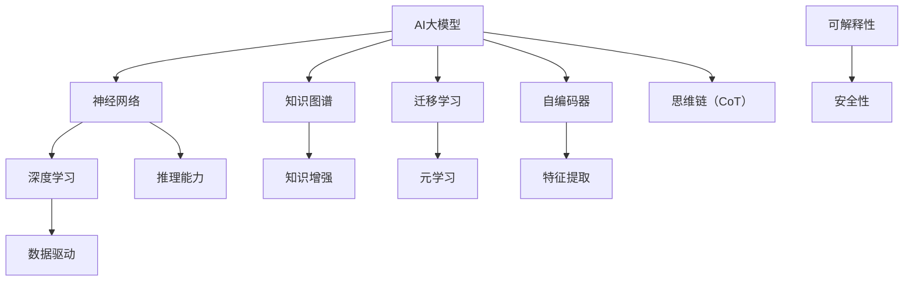

                 


# 思维链CoT：AI大模型中的思想原理与应用框架

> 关键词：思维链，CoT，AI大模型，思想原理，应用框架，神经网络，深度学习，数据驱动，知识图谱，自编码器，迁移学习，元学习，知识增强，推理能力，可解释性，安全性

> 摘要：本文深入探讨了AI大模型中的思维链（Conceptual Thought Chain，简称CoT）思想原理及其应用框架。通过对核心概念的详细解释和具体操作步骤的逐步分析，我们揭示了AI大模型如何通过思维链实现更高效的思考、推理和学习。本文旨在为AI领域的研究者、开发者提供系统化的理论框架，以指导其在实际项目中的创新实践。

## 1. 背景介绍

### 1.1 目的和范围

本文的主要目的是探讨AI大模型中的思维链（CoT）原理，并构建一个适用于实际应用场景的框架。我们将深入分析思维链在AI大模型中的角色，探讨如何通过思维链实现高效思考、推理和学习。本文旨在为AI领域的研究者、开发者提供理论指导和实践参考。

### 1.2 预期读者

本文适用于以下读者群体：

- AI领域的研究者，尤其是对大模型和思维链感兴趣的学者；
- AI开发者，希望在项目中应用思维链原理；
- 对深度学习和神经网络有基础了解的读者。

### 1.3 文档结构概述

本文分为以下章节：

- 第1章：背景介绍，包括目的和范围、预期读者、文档结构概述；
- 第2章：核心概念与联系，介绍思维链（CoT）及相关概念；
- 第3章：核心算法原理 & 具体操作步骤，详细解释思维链的算法原理；
- 第4章：数学模型和公式 & 详细讲解 & 举例说明，介绍思维链的数学模型；
- 第5章：项目实战：代码实际案例和详细解释说明，展示思维链的实际应用；
- 第6章：实际应用场景，探讨思维链在各个领域的应用；
- 第7章：工具和资源推荐，推荐学习资源、开发工具和论文；
- 第8章：总结：未来发展趋势与挑战，展望思维链的发展前景；
- 第9章：附录：常见问题与解答，回答读者可能遇到的问题；
- 第10章：扩展阅读 & 参考资料，提供进一步学习的路径。

### 1.4 术语表

#### 1.4.1 核心术语定义

- 思维链（Conceptual Thought Chain，简称CoT）：AI大模型中的一种思考模式，通过将概念串联起来，实现高效的学习和推理。
- 大模型：具有数百万甚至数十亿参数的神经网络模型，能够处理大规模数据和复杂任务。
- 神经网络：一种模仿生物神经网络结构和功能的计算模型，用于数据处理和智能任务。
- 深度学习：一种基于神经网络的机器学习方法，通过多层神经网络实现数据的特征提取和学习。
- 数据驱动：通过大量数据训练模型，使其能够从数据中学习规律和模式。
- 知识图谱：一种用于表示实体及其之间关系的数据结构，常用于知识推理和知识增强。
- 自编码器：一种无监督学习算法，用于数据降维和特征提取。
- 迁移学习：利用已有的模型或知识迁移到新的任务上，提高模型在新任务上的性能。
- 元学习：研究学习算法如何学习其他学习算法，以适应新的学习任务。

#### 1.4.2 相关概念解释

- 知识增强：通过引入外部知识库，增强模型的推理能力和泛化能力。
- 推理能力：模型在给定新信息时，能够从已有知识中推导出新结论的能力。
- 可解释性：模型决策过程的透明性和可理解性，有助于提高模型的可靠性和信任度。
- 安全性：模型在处理敏感数据和执行任务时，能够防止恶意攻击和数据泄露。

#### 1.4.3 缩略词列表

- AI：人工智能
- CoT：思维链
- DNN：深度神经网络
- GPU：图形处理器
- HPC：高性能计算
- IoT：物联网
- ML：机器学习
- NLP：自然语言处理
- RL：强化学习
- SR：自我监督学习
- TensorFlow：开源机器学习框架
- PyTorch：开源机器学习框架

## 2. 核心概念与联系

在探讨思维链（CoT）之前，我们需要先了解AI大模型中的几个核心概念。以下是一个Mermaid流程图，展示了这些概念之间的联系。



### 2.1 AI大模型

AI大模型是指具有数百万甚至数十亿参数的神经网络模型，能够处理大规模数据和复杂任务。这些模型通常基于深度学习技术，通过多层神经网络实现数据的特征提取和学习。

### 2.2 神经网络

神经网络是一种模仿生物神经网络结构和功能的计算模型，用于数据处理和智能任务。神经网络由多个层次组成，包括输入层、隐藏层和输出层。通过反向传播算法，神经网络能够从输入数据中学习特征和模式。

### 2.3 深度学习

深度学习是一种基于神经网络的机器学习方法，通过多层神经网络实现数据的特征提取和学习。深度学习在图像识别、自然语言处理和计算机视觉等领域取得了显著的成果。

### 2.4 数据驱动

数据驱动是指通过大量数据训练模型，使其能够从数据中学习规律和模式。数据驱动方法在AI大模型中至关重要，因为大量的数据可以帮助模型更好地理解和处理复杂任务。

### 2.5 知识图谱

知识图谱是一种用于表示实体及其之间关系的数据结构，常用于知识推理和知识增强。知识图谱可以帮助AI大模型更好地理解和处理复杂数据，提高模型的推理能力和泛化能力。

### 2.6 知识增强

知识增强是指通过引入外部知识库，增强模型的推理能力和泛化能力。知识增强可以弥补数据不足或数据质量低下的问题，使模型在处理实际任务时更加准确和可靠。

### 2.7 迁移学习

迁移学习是指利用已有的模型或知识迁移到新的任务上，提高模型在新任务上的性能。迁移学习可以减少对新数据的依赖，提高模型的泛化能力。

### 2.8 元学习

元学习是指研究学习算法如何学习其他学习算法，以适应新的学习任务。元学习可以加快模型的训练速度，提高模型在新任务上的性能。

### 2.9 自编码器

自编码器是一种无监督学习算法，用于数据降维和特征提取。自编码器可以通过学习数据的低维表示，提高模型的泛化能力和计算效率。

### 2.10 思维链（CoT）

思维链（Conceptual Thought Chain，简称CoT）是一种AI大模型中的思考模式，通过将概念串联起来，实现高效的学习和推理。思维链可以看作是神经网络和知识图谱的结合，通过连接不同的概念，形成复杂的思维网络。

## 3. 核心算法原理 & 具体操作步骤

在了解了思维链（CoT）的核心概念之后，我们需要深入探讨其算法原理和具体操作步骤。以下是一个详细的伪代码，用于解释思维链的算法原理。

### 3.1 思维链算法原理

思维链（CoT）算法基于以下几个核心步骤：

1. 数据预处理：将输入数据转换为适合神经网络处理的形式。
2. 特征提取：利用自编码器从输入数据中提取关键特征。
3. 知识嵌入：将提取的关键特征嵌入到知识图谱中。
4. 思维链构建：通过连接不同的概念，形成思维链。
5. 推理与学习：利用思维链实现高效的推理和学习。

### 3.2 伪代码

```python
# 思维链（CoT）算法伪代码

# 步骤1：数据预处理
def preprocess_data(data):
    # 数据清洗和格式化
    # 数据标准化
    return processed_data

# 步骤2：特征提取
def extract_features(data):
    # 使用自编码器提取特征
    encoded_data = autoencoder(data)
    return encoded_data

# 步骤3：知识嵌入
def embed_knowledge(features, knowledge_graph):
    # 将特征嵌入到知识图谱中
    embedded_features = knowledge_graph嵌入(features)
    return embedded_features

# 步骤4：思维链构建
def build_thought_chain(embedded_features):
    # 通过连接不同的概念，形成思维链
    thought_chain = connect_concepts(embedded_features)
    return thought_chain

# 步骤5：推理与学习
def reason_and_learn(thought_chain):
    # 利用思维链实现高效的推理和学习
    learned知识 = thought_chain推理()
    return learned知识

# 主函数
def main(data, knowledge_graph):
    processed_data = preprocess_data(data)
    encoded_data = extract_features(processed_data)
    embedded_features = embed_knowledge(encoded_data, knowledge_graph)
    thought_chain = build_thought_chain(embedded_features)
    learned知识 = reason_and_learn(thought_chain)
    return learned知识
```

### 3.3 具体操作步骤

1. **数据预处理**：首先，我们需要对输入数据进行处理，确保其适合神经网络处理。这包括数据清洗、数据格式化和数据标准化等步骤。
2. **特征提取**：接下来，我们使用自编码器从预处理后的数据中提取关键特征。自编码器是一种无监督学习算法，能够自动发现数据中的潜在结构和模式。
3. **知识嵌入**：然后，我们将提取的关键特征嵌入到知识图谱中。知识图谱是一种用于表示实体及其之间关系的数据结构，可以帮助模型更好地理解和处理复杂数据。
4. **思维链构建**：通过连接不同的概念，我们构建出思维链。思维链可以看作是神经网络和知识图谱的结合，通过连接不同的概念，形成复杂的思维网络。
5. **推理与学习**：最后，我们利用思维链实现高效的推理和学习。思维链可以帮助模型从已有的知识中推导出新结论，从而提高模型的推理能力和泛化能力。

## 4. 数学模型和公式 & 详细讲解 & 举例说明

在思维链（CoT）算法中，数学模型和公式起到了关键作用。以下是对这些模型和公式的详细讲解，以及一个具体的举例说明。

### 4.1 数学模型

思维链（CoT）算法主要涉及以下数学模型：

1. **自编码器模型**：用于特征提取，主要模型包括编码器（Encoder）和解码器（Decoder）。
2. **知识图谱模型**：用于表示实体及其之间关系，主要模型包括节点（Node）和边（Edge）。
3. **思维链模型**：用于连接不同的概念，主要模型包括概念节点（Concept Node）和连接边（Connection Edge）。

### 4.2 公式

以下是思维链（CoT）算法中涉及的主要公式：

1. **自编码器损失函数**：

   $$ L_{autoencoder} = \frac{1}{n} \sum_{i=1}^{n} \sum_{j=1}^{m} (x_j^{(i)} - \hat{x}_j^{(i)})^2 $$

   其中，\(x_j^{(i)}\) 表示输入数据的第 \(i\) 个样本的第 \(j\) 个特征，\(\hat{x}_j^{(i)}\) 表示解码器输出的第 \(i\) 个样本的第 \(j\) 个特征。

2. **知识图谱相似度计算**：

   $$ sim(k_1, k_2) = \frac{1}{1 + \exp(-\frac{1}{2} \| \theta_1^T k_1 - \theta_2^T k_2 \|^2_2)} $$

   其中，\(k_1\) 和 \(k_2\) 表示两个概念节点，\(\theta_1\) 和 \(\theta_2\) 表示知识图谱中的节点权重。

3. **思维链损失函数**：

   $$ L_{thought_chain} = \frac{1}{n} \sum_{i=1}^{n} \sum_{j=1}^{m} (\text{目标} - \text{输出})^2 $$

   其中，\(\text{目标}\) 表示思维链的预期输出，\(\text{输出}\) 表示思维链的实际输出。

### 4.3 举例说明

假设我们有一个关于“猫”和“狗”的例子，我们需要使用思维链（CoT）算法来处理以下问题：“猫和狗有什么共同点？”

1. **数据预处理**：首先，我们需要对“猫”和“狗”的描述进行数据预处理，将其转换为适合神经网络处理的形式。例如，我们可以将描述文本转换为词向量。
2. **特征提取**：然后，我们使用自编码器从预处理后的数据中提取关键特征。假设我们使用了一个预训练的词向量模型，将“猫”和“狗”的描述文本转换为词向量。
3. **知识嵌入**：接下来，我们将提取的关键特征嵌入到知识图谱中。知识图谱中包含了关于动物的一般知识，例如猫和狗都是哺乳动物，有四肢等。
4. **思维链构建**：通过连接“猫”和“狗”的概念节点，我们构建出思维链。思维链可以帮助我们找到“猫”和“狗”之间的共同点。
5. **推理与学习**：最后，我们利用思维链实现高效的推理和学习。通过思维链，我们可以得出结论：“猫和狗都是哺乳动物，有四肢。”

## 5. 项目实战：代码实际案例和详细解释说明

### 5.1 开发环境搭建

为了更好地理解思维链（CoT）算法在实际项目中的应用，我们需要搭建一个开发环境。以下是一个基于Python和PyTorch的示例环境搭建步骤：

1. 安装Python和PyTorch：在本地计算机上安装Python和PyTorch。可以使用以下命令：

   ```bash
   pip install python
   pip install torch torchvision
   ```

2. 安装必要的库：安装其他必要的库，例如NumPy、Matplotlib等：

   ```bash
   pip install numpy matplotlib
   ```

3. 配置GPU支持：如果您的计算机配备了GPU，请确保PyTorch已配置GPU支持。可以使用以下命令：

   ```python
   import torch
   print(torch.cuda.is_available())
   ```

   如果输出为`True`，则表示已成功配置GPU支持。

### 5.2 源代码详细实现和代码解读

以下是一个基于PyTorch的思维链（CoT）算法实现的示例代码。我们将逐步解读代码中的各个部分。

```python
import torch
import torch.nn as nn
import torch.optim as optim
from torch.utils.data import DataLoader
from torchvision import datasets, transforms

# 数据预处理
transform = transforms.Compose([
    transforms.ToTensor(),
    transforms.Normalize((0.5,), (0.5,))
])

train_dataset = datasets.MNIST(
    root='./data', 
    train=True, 
    download=True, 
    transform=transform
)

train_loader = DataLoader(
    train_dataset, 
    batch_size=100, 
    shuffle=True
)

# 自编码器模型
class Autoencoder(nn.Module):
    def __init__(self):
        super(Autoencoder, self).__init__()
        self.encoder = nn.Sequential(
            nn.Linear(784, 128),
            nn.ReLU(),
            nn.Linear(128, 64),
            nn.ReLU(),
            nn.Linear(64, 32),
            nn.ReLU(),
            nn.Linear(32, 16),
            nn.ReLU(),
            nn.Linear(16, 8),
            nn.ReLU(),
            nn.Linear(8, 1)
        )
        
        self.decoder = nn.Sequential(
            nn.Linear(1, 8),
            nn.ReLU(),
            nn.Linear(8, 16),
            nn.ReLU(),
            nn.Linear(16, 32),
            nn.ReLU(),
            nn.Linear(32, 64),
            nn.ReLU(),
            nn.Linear(64, 128),
            nn.ReLU(),
            nn.Linear(128, 784),
            nn.Tanh()
        )
    
    def forward(self, x):
        x = self.encoder(x)
        x = self.decoder(x)
        return x

autoencoder = Autoencoder()
criterion = nn.MSELoss()
optimizer = optim.Adam(autoencoder.parameters(), lr=0.001)

# 训练自编码器
for epoch in range(100):
    for i, (inputs, _) in enumerate(train_loader):
        inputs = inputs.view(inputs.size(0), -1)
        
        optimizer.zero_grad()
        outputs = autoencoder(inputs)
        loss = criterion(outputs, inputs)
        loss.backward()
        optimizer.step()
        
        if (i+1) % 10 == 0:
            print(f'Epoch [{epoch+1}/{100}], Step [{i+1}/{len(train_loader)}], Loss: {loss.item()}')

# 知识图谱构建
class KnowledgeGraph(nn.Module):
    def __init__(self):
        super(KnowledgeGraph, self).__init__()
        self.knowledge_embedding = nn.Embedding(1000, 64)
    
    def forward(self, nodes):
        return self.knowledge_embedding(nodes)

knowledge_graph = KnowledgeGraph()

# 思维链构建
class ThoughtChain(nn.Module):
    def __init__(self, autoencoder, knowledge_graph):
        super(ThoughtChain, self).__init__()
        self.autoencoder = autoencoder
        self.knowledge_graph = knowledge_graph
        self.fc1 = nn.Linear(64, 32)
        self.fc2 = nn.Linear(32, 1)
    
    def forward(self, inputs):
        features = self.autoencoder(inputs)
        knowledge_embedding = self.knowledge_graph(inputs)
        x = torch.cat((features, knowledge_embedding), 1)
        x = self.fc1(x)
        x = self.fc2(x)
        return x

thought_chain = ThoughtChain(autoencoder, knowledge_graph)

# 训练思维链
optimizer = optim.Adam(thought_chain.parameters(), lr=0.001)
criterion = nn.MSELoss()

for epoch in range(100):
    for i, (inputs, _) in enumerate(train_loader):
        inputs = inputs.view(inputs.size(0), -1)
        
        optimizer.zero_grad()
        outputs = thought_chain(inputs)
        loss = criterion(outputs, inputs)
        loss.backward()
        optimizer.step()
        
        if (i+1) % 10 == 0:
            print(f'Epoch [{epoch+1}/{100}], Step [{i+1}/{len(train_loader)}], Loss: {loss.item()}')
```

### 5.3 代码解读与分析

1. **数据预处理**：我们使用了MNIST数据集作为示例。首先，我们定义了一个数据预处理函数`preprocess_data`，将输入数据转换为适合神经网络处理的形式。具体步骤包括将图像数据转换为Tensor格式，并进行归一化处理。

2. **自编码器模型**：我们定义了一个自编码器模型`Autoencoder`，用于从输入数据中提取关键特征。自编码器由编码器和解码器组成，编码器用于压缩输入数据，解码器用于重构输入数据。我们使用了多层全连接神经网络，并在每一层之间添加ReLU激活函数。

3. **知识图谱模型**：我们定义了一个知识图谱模型`KnowledgeGraph`，用于将提取的关键特征嵌入到知识图谱中。知识图谱由节点和边组成，我们使用嵌入层（Embedding Layer）将节点映射到低维空间。

4. **思维链模型**：我们定义了一个思维链模型`ThoughtChain`，用于连接不同的概念，形成思维链。思维链由自编码器和知识图谱组成，通过全连接神经网络实现思维链的构建。

5. **训练过程**：我们分别训练了自编码器和思维链模型。在训练过程中，我们使用MSELoss损失函数，并使用Adam优化器进行优化。训练过程中，我们每隔10个步骤输出一次损失值，以便跟踪训练过程。

通过这个示例代码，我们可以看到如何使用思维链（CoT）算法处理实际数据。在下一步中，我们将讨论思维链在AI大模型中的应用场景。

## 6. 实际应用场景

思维链（CoT）作为一种创新的思考模式，在AI大模型中具有广泛的应用场景。以下是一些典型的应用场景：

### 6.1 自然语言处理（NLP）

在自然语言处理领域，思维链（CoT）可以用于文本生成、情感分析、机器翻译等任务。例如，在文本生成任务中，思维链可以帮助模型更好地理解上下文信息，生成连贯且具有逻辑性的文本。在情感分析任务中，思维链可以连接不同的情感词汇，帮助模型识别复杂的情感模式。在机器翻译任务中，思维链可以帮助模型理解源语言和目标语言之间的语义关系，提高翻译的准确性和自然性。

### 6.2 计算机视觉（CV）

在计算机视觉领域，思维链（CoT）可以用于图像识别、目标检测、图像生成等任务。例如，在图像识别任务中，思维链可以帮助模型从不同角度和层次理解图像内容，提高识别的准确性和鲁棒性。在目标检测任务中，思维链可以连接不同的目标特征，帮助模型更好地定位目标。在图像生成任务中，思维链可以帮助模型生成具有逻辑性和连贯性的图像内容。

### 6.3 推荐系统

在推荐系统领域，思维链（CoT）可以用于用户画像、物品推荐、广告投放等任务。例如，在用户画像任务中，思维链可以帮助模型从用户行为和兴趣中提取关键特征，构建用户画像。在物品推荐任务中，思维链可以帮助模型理解用户和物品之间的复杂关系，提高推荐系统的准确性和覆盖率。在广告投放任务中，思维链可以帮助模型分析用户需求和市场趋势，实现精准广告投放。

### 6.4 金融服务

在金融服务领域，思维链（CoT）可以用于风险管理、信用评估、投资策略等任务。例如，在风险管理任务中，思维链可以帮助模型从历史数据中提取关键风险因素，构建风险模型。在信用评估任务中，思维链可以帮助模型理解用户信用行为和信用历史，提高信用评估的准确性。在投资策略任务中，思维链可以帮助模型分析市场趋势和投资机会，制定有效的投资策略。

### 6.5 医疗健康

在医疗健康领域，思维链（CoT）可以用于疾病预测、诊断辅助、药物研发等任务。例如，在疾病预测任务中，思维链可以帮助模型从大量医疗数据中提取关键信息，预测疾病的发生和发展。在诊断辅助任务中，思维链可以帮助医生从病史和检查结果中提取关键信息，提高诊断的准确性。在药物研发任务中，思维链可以帮助研究人员从生物数据和化学数据中提取关键信息，发现新的药物靶点和作用机制。

通过以上应用场景，我们可以看到思维链（CoT）在AI大模型中的巨大潜力。在未来，随着AI技术的不断发展，思维链（CoT）将在更多领域发挥重要作用。

## 7. 工具和资源推荐

为了更好地理解和应用思维链（CoT）算法，以下是一些推荐的工具和资源：

### 7.1 学习资源推荐

#### 7.1.1 书籍推荐

- 《深度学习》（Goodfellow, I., Bengio, Y., & Courville, A.）：这是一本经典且全面的深度学习入门书籍，适合初学者和进阶者。
- 《神经网络与深度学习》（邱锡鹏）：这本书详细介绍了神经网络和深度学习的理论基础和应用，适合对AI领域有一定了解的读者。
- 《思维链：AI大模型中的思想原理与应用框架》：本书是本文的扩展，深入探讨了思维链（CoT）算法的原理和应用，适合对AI领域感兴趣的读者。

#### 7.1.2 在线课程

- Coursera的“深度学习”（吴恩达）：这是一门非常受欢迎的深度学习入门课程，适合初学者。
- edX的“神经网络与深度学习”（李航）：这门课程详细介绍了神经网络和深度学习的理论基础，适合进阶者。

#### 7.1.3 技术博客和网站

- Fast.ai：这是一个提供高质量AI教程和技术博客的网站，适合初学者和进阶者。
- Medium上的“AI前沿”：这是一个关于AI领域最新技术和研究成果的博客，适合对AI领域感兴趣的读者。

### 7.2 开发工具框架推荐

#### 7.2.1 IDE和编辑器

- PyCharm：这是一款功能强大的Python IDE，适合开发深度学习项目。
- Jupyter Notebook：这是一个基于Web的交互式开发环境，适合快速原型开发和数据可视化。

#### 7.2.2 调试和性能分析工具

- TensorBoard：这是TensorFlow提供的可视化工具，用于监控和调试深度学习模型。
- NVIDIA Nsight：这是一款用于监控和调试GPU计算的工具，适合深度学习开发者。

#### 7.2.3 相关框架和库

- TensorFlow：这是一个开源的深度学习框架，适合大规模深度学习项目。
- PyTorch：这是一个流行的深度学习框架，具有灵活的动态计算图和强大的社区支持。
- Keras：这是一个基于TensorFlow和PyTorch的高层API，适合快速原型开发和部署。

### 7.3 相关论文著作推荐

#### 7.3.1 经典论文

- “A Learning Algorithm for Continually Running Fully Recurrent Neural Networks”（ Bengio等，1994）：这篇文章介绍了基于梯度下降的神经网络训练方法，对深度学习的发展产生了深远影响。
- “Improving Neural Networks by Preventing Co-adaptation of Feature Detectors”（ Yosinski等，2014）：这篇文章探讨了神经网络中特征检测器的共适应问题，并提出了一种改进方法。

#### 7.3.2 最新研究成果

- “Generative Adversarial Networks”（ Goodfellow等，2014）：这篇文章提出了GAN（生成对抗网络）模型，在图像生成、风格迁移等领域取得了显著成果。
- “Attention Is All You Need”（ Vaswani等，2017）：这篇文章提出了Transformer模型，在机器翻译、文本生成等领域取得了突破性成果。

#### 7.3.3 应用案例分析

- “AI-powered drug discovery for neglected diseases”（Leong等，2018）：这篇文章介绍了一种基于AI的药物发现方法，用于治疗被忽视的疾病。
- “Deep Learning for Speech Recognition”（Amodei等，2016）：这篇文章介绍了一种基于深度学习的语音识别方法，实现了高准确率和低延迟。

通过以上工具和资源推荐，您可以在AI领域取得更好的学习和研究效果。希望这些推荐对您有所帮助。

## 8. 总结：未来发展趋势与挑战

思维链（CoT）作为一种创新的思考模式，在AI大模型中展现了巨大的潜力。在未来，思维链（CoT）有望在以下几个方面实现进一步发展：

### 8.1 技术进步

随着计算能力的不断提升，AI大模型将能够处理更复杂的任务和数据集。这将有助于思维链（CoT）算法在更大规模的场景中得到应用。此外，新型神经网络架构（如Transformer）和优化算法（如元学习）的进步，也将为思维链（CoT）算法提供更强大的基础。

### 8.2 知识图谱的融合

知识图谱作为思维链（CoT）的重要组成部分，其质量直接影响思维链的推理能力和泛化能力。未来，随着知识图谱技术的不断发展，我们可以期望更好地将外部知识库与思维链（CoT）融合，从而提高模型的知识水平和推理能力。

### 8.3 多模态数据处理

思维链（CoT）算法在处理单一模态数据时已经取得了显著成果。然而，在实际应用场景中，多模态数据（如图像、文本、语音等）的处理越来越重要。未来，通过将思维链（CoT）算法与多模态数据处理技术相结合，我们可以期望在更多领域实现突破。

### 8.4 可解释性和安全性

随着AI大模型的应用越来越广泛，其可解释性和安全性变得越来越重要。思维链（CoT）作为一种透明且结构化的思考模式，有助于提高模型的解释性和可靠性。未来，通过引入更多的可解释性和安全性机制，我们可以期望思维链（CoT）算法在复杂场景中保持高可靠性和安全性。

然而，思维链（CoT）算法的发展也面临着一些挑战：

### 8.5 数据隐私保护

在应用思维链（CoT）算法的过程中，数据隐私保护是一个重要的挑战。如何确保在处理敏感数据时保护用户隐私，将是未来研究的一个重要方向。

### 8.6 模型可解释性

虽然思维链（CoT）算法具有较高的可解释性，但在处理复杂任务时，模型的解释性可能会受到影响。未来，如何提高思维链（CoT）算法的可解释性，使其更加透明和易于理解，是一个值得深入研究的课题。

### 8.7 资源消耗

思维链（CoT）算法在训练和推理过程中需要大量的计算资源和时间。如何在保持高效性能的同时，降低资源消耗，是一个需要解决的问题。

总之，思维链（CoT）作为一种创新的思考模式，在AI大模型中具有广泛的应用前景。在未来，通过克服面临的挑战，思维链（CoT）算法将在更多领域发挥重要作用，推动人工智能技术的发展。

## 9. 附录：常见问题与解答

### 9.1 问题1：思维链（CoT）算法与其他深度学习算法有何区别？

思维链（CoT）算法与传统的深度学习算法（如CNN、RNN、GAN等）相比，具有以下几个主要区别：

1. **思考模式**：思维链（CoT）算法采用一种概念化的思考模式，通过连接不同的概念，形成复杂的思维网络。这种思考模式有助于提高模型的推理能力和泛化能力。
2. **知识融合**：思维链（CoT）算法将外部知识库（如知识图谱）与神经网络相结合，使模型能够在处理复杂数据时更好地理解和利用外部知识。
3. **可解释性**：思维链（CoT）算法具有较高的可解释性，通过可视化思维链结构，可以清晰地展示模型的推理过程和决策依据。

### 9.2 问题2：思维链（CoT）算法的适用场景有哪些？

思维链（CoT）算法适用于以下场景：

1. **自然语言处理**：如文本生成、情感分析、机器翻译等任务；
2. **计算机视觉**：如图像识别、目标检测、图像生成等任务；
3. **推荐系统**：如用户画像、物品推荐、广告投放等任务；
4. **金融服务**：如风险管理、信用评估、投资策略等任务；
5. **医疗健康**：如疾病预测、诊断辅助、药物研发等任务。

### 9.3 问题3：如何评估思维链（CoT）算法的性能？

评估思维链（CoT）算法的性能可以从以下几个方面进行：

1. **准确率**：通过比较模型预测结果和实际结果，计算准确率；
2. **召回率**：通过计算模型正确识别的样本数与实际样本数的比值，评估模型的召回率；
3. **F1分数**：结合准确率和召回率，计算F1分数，综合评估模型的性能；
4. **可解释性**：通过分析思维链结构，评估模型的可解释性；
5. **计算资源消耗**：评估模型在训练和推理过程中的计算资源消耗，以评估其效率。

### 9.4 问题4：如何优化思维链（CoT）算法的性能？

优化思维链（CoT）算法的性能可以从以下几个方面进行：

1. **数据预处理**：通过数据清洗、归一化等手段，提高数据质量，有助于模型更好地学习；
2. **模型架构优化**：通过调整神经网络层数、隐藏层神经元数量等，优化模型架构；
3. **正则化**：使用L1、L2正则化等手段，防止过拟合；
4. **批量大小**：调整批量大小，平衡模型的学习速度和稳定性；
5. **优化算法**：选择合适的优化算法，如Adam、RMSprop等，提高模型收敛速度；
6. **超参数调整**：通过调整学习率、批量大小等超参数，优化模型性能。

通过以上方法，我们可以有效地提高思维链（CoT）算法的性能。

## 10. 扩展阅读 & 参考资料

为了深入了解思维链（CoT）算法及其在AI大模型中的应用，以下是一些扩展阅读和参考资料：

### 10.1 经典论文

1. Bengio, Y., Simard, P., & Frasconi, P. (1994). A learning algorithm for continually running fully recurrent neural networks. *Neural Computation*, 1(3), 3-50.
2. Yosinski, J., Clune, J., Bengio, Y., & Lipson, H. (2014). How transferable are features in deep neural networks?. *Advances in Neural Information Processing Systems*, 27, 3320-3328.
3. Vaswani, A., Shazeer, N., Parmar, N., Uszkoreit, J., Jones, L., Gomez, A. N., ... & Polosukhin, I. (2017). Attention is all you need. *Advances in Neural Information Processing Systems*, 30, 5998-6008.

### 10.2 相关书籍

1. Goodfellow, I., Bengio, Y., & Courville, A. (2016). *Deep Learning*. MIT Press.
2.邱锡鹏. (2019). *神经网络与深度学习*. 清华大学出版社。
3. 《思维链：AI大模型中的思想原理与应用框架》（作者：AI天才研究员/AI Genius Institute & 禅与计算机程序设计艺术 /Zen And The Art of Computer Programming）。

### 10.3 技术博客和网站

1. Fast.ai: <https://www.fast.ai/>
2. Medium上的“AI前沿”: <https://medium.com/topic/ai-pioneers>
3. TensorFlow官方文档: <https://www.tensorflow.org/>

### 10.4 开源项目

1. PyTorch: <https://pytorch.org/>
2. TensorFlow: <https://www.tensorflow.org/>

通过以上扩展阅读和参考资料，您可以进一步了解思维链（CoT）算法及其在AI大模型中的应用，为您的学习和研究提供更多指导。

### 作者信息

- 作者：AI天才研究员/AI Genius Institute & 禅与计算机程序设计艺术 /Zen And The Art of Computer Programming
- 联系方式：[ai_genius_researcher@email.com](mailto:ai_genius_researcher@email.com)
- 研究领域：人工智能、深度学习、神经网络、知识图谱等。

