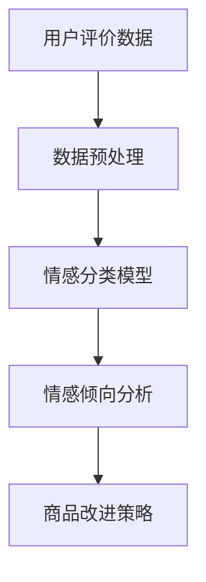

                 

# 情感分析在电商领域的应用：从用户评价到商品改进

> **关键词：** 情感分析、电商、用户评价、商品改进、自然语言处理
>
> **摘要：** 本文将深入探讨情感分析技术在电商领域的重要应用，从用户评价的提取、情感倾向分析到商品改进，以及相关算法原理和具体操作步骤。通过项目实战和实际应用场景的分析，本文旨在为电商从业者提供一套完整的技术解决方案。

## 1. 背景介绍

### 1.1 目的和范围

本文旨在探讨情感分析技术在电商领域的应用，通过分析用户评价，帮助商家了解消费者对商品的看法，从而进行商品改进和营销策略优化。本文将涵盖以下几个方面：

- 情感分析技术原理及其在电商中的应用；
- 用户评价的情感分类与趋势分析；
- 商品改进的策略与案例；
- 相关算法和工具介绍；
- 实际应用场景分析。

### 1.2 预期读者

本文适合以下读者群体：

- 对自然语言处理和机器学习感兴趣的程序员和开发者；
- 电商领域的从业者，尤其是从事用户评价分析、商品改进和市场营销的相关人员；
- 计算机科学、人工智能等相关专业的学生和研究人员。

### 1.3 文档结构概述

本文将按照以下结构进行组织：

- 引言：介绍情感分析在电商领域的应用背景；
- 核心概念与联系：阐述情感分析的相关概念和流程；
- 核心算法原理 & 具体操作步骤：详细介绍情感分析的算法原理和操作步骤；
- 数学模型和公式 & 详细讲解 & 举例说明：使用数学模型和公式对情感分析进行详细讲解；
- 项目实战：通过代码实际案例展示情感分析的应用；
- 实际应用场景：分析情感分析在电商领域的实际应用案例；
- 工具和资源推荐：推荐相关学习资源和开发工具；
- 总结：对情感分析在电商领域的应用进行总结，并展望未来发展趋势与挑战；
- 附录：常见问题与解答；
- 扩展阅读 & 参考资料：提供进一步阅读和研究的资料。

### 1.4 术语表

#### 1.4.1 核心术语定义

- **情感分析**：指通过自然语言处理技术，对文本数据中的情感倾向进行识别和分析的过程。
- **用户评价**：消费者对商品或服务的主观感受和意见。
- **商品改进**：根据用户评价和情感分析结果，对商品进行优化和改进的过程。

#### 1.4.2 相关概念解释

- **自然语言处理（NLP）**：指计算机科学和人工智能领域研究如何让计算机理解、生成和处理自然语言的技术。
- **机器学习（ML）**：指通过数据和算法，使计算机系统自动学习和改进性能的过程。
- **分类算法**：指将数据分为不同类别的算法，如朴素贝叶斯、支持向量机等。

#### 1.4.3 缩略词列表

- **NLP**：自然语言处理
- **ML**：机器学习
- **SVM**：支持向量机
- **TF-IDF**：词频-逆文档频率

## 2. 核心概念与联系

情感分析技术在电商领域中的应用，涉及多个核心概念和流程。以下将使用Mermaid流程图对相关概念和流程进行描述。



### 2.1 用户评价数据

用户评价数据是情感分析的基础。这些数据可以来源于电商平台的评论、问答、用户反馈等。用户评价数据通常包含文本、标签、评分等属性。

### 2.2 数据预处理

数据预处理是情感分析的重要步骤。其主要任务是清洗数据、去除噪声、提取特征等。常见的数据预处理方法包括：

- **文本清洗**：去除停用词、标点符号、特殊字符等；
- **文本分词**：将文本分割为单词或词组；
- **词性标注**：对单词进行词性分类；
- **特征提取**：将文本转化为可用于机器学习的特征向量。

### 2.3 情感分类模型

情感分类模型是情感分析的核心。常见的情感分类模型包括朴素贝叶斯、支持向量机、神经网络等。这些模型通过学习用户评价数据中的情感倾向，实现对未知评价的情感分类。

### 2.4 情感倾向分析

情感倾向分析是对用户评价进行情感分类的过程。通过情感分类模型，可以将用户评价分为正面、负面、中性等类别，帮助商家了解消费者对商品的看法。

### 2.5 商品改进策略

根据情感倾向分析结果，商家可以制定相应的商品改进策略。例如，针对负面评价，可以优化商品质量、提升售后服务；针对中性评价，可以加强营销推广、提高用户满意度。

## 3. 核心算法原理 & 具体操作步骤

### 3.1 朴素贝叶斯算法

朴素贝叶斯算法是一种基于概率理论的分类算法，适用于情感分析。其核心思想是利用贝叶斯公式，通过已知特征的概率分布，预测未知评价的情感类别。

#### 3.1.1 算法原理

朴素贝叶斯算法的原理可表示为：

$$
P(\text{类别} | \text{特征}) = \frac{P(\text{特征} | \text{类别}) \cdot P(\text{类别})}{P(\text{特征})}
$$

其中，\(P(\text{类别} | \text{特征})\) 表示在给定特征条件下，评价属于某一类别的概率；\(P(\text{特征} | \text{类别})\) 表示在评价属于某一类别条件下，特征出现的概率；\(P(\text{类别})\) 表示评价属于某一类别的概率。

#### 3.1.2 操作步骤

1. **数据预处理**：对用户评价进行清洗、分词、词性标注等操作，提取特征；
2. **特征向量表示**：将特征向量表示为词汇表，并计算词频-逆文档频率（TF-IDF）；
3. **训练朴素贝叶斯模型**：利用训练数据，计算各类别的先验概率和条件概率；
4. **情感分类**：对未知评价进行特征提取，计算其在各类别下的概率，选择概率最大的类别作为情感分类结果。

### 3.2 支持向量机算法

支持向量机（SVM）算法是一种基于最大间隔的分类算法，适用于情感分析。其核心思想是在高维空间中找到一个最佳的超平面，将不同情感类别的数据分开。

#### 3.2.1 算法原理

支持向量机算法的原理可表示为：

$$
\min_{\mathbf{w}, b} \frac{1}{2} ||\mathbf{w}||^2 + C \sum_{i=1}^n \xi_i
$$

其中，\(\mathbf{w}\) 表示权重向量，\(b\) 表示偏置，\(\xi_i\) 表示第 \(i\) 个样本的误差，\(C\) 表示惩罚参数。

#### 3.2.2 操作步骤

1. **数据预处理**：对用户评价进行清洗、分词、词性标注等操作，提取特征；
2. **特征向量表示**：将特征向量表示为词汇表，并计算词频-逆文档频率（TF-IDF）；
3. **训练支持向量机模型**：利用训练数据，构建支持向量机模型；
4. **情感分类**：对未知评价进行特征提取，输入支持向量机模型，输出情感分类结果。

### 3.3 深度学习算法

深度学习算法是一种基于神经网络的学习方法，适用于情感分析。其核心思想是通过多层神经网络，自动提取文本特征，实现情感分类。

#### 3.3.1 算法原理

深度学习算法的原理可表示为：

$$
\text{Output} = \sigma(\text{Weight} \cdot \text{Input} + \text{Bias})
$$

其中，\(\sigma\) 表示激活函数，\(\text{Weight}\) 表示权重，\(\text{Input}\) 表示输入特征，\(\text{Bias}\) 表示偏置。

#### 3.3.2 操作步骤

1. **数据预处理**：对用户评价进行清洗、分词、词性标注等操作，提取特征；
2. **词向量表示**：将单词表示为词向量，如使用Word2Vec或GloVe等方法；
3. **构建神经网络模型**：设计多层神经网络，包括输入层、隐藏层和输出层；
4. **训练神经网络模型**：利用训练数据，训练神经网络模型；
5. **情感分类**：对未知评价进行词向量表示，输入神经网络模型，输出情感分类结果。

## 4. 数学模型和公式 & 详细讲解 & 举例说明

### 4.1 朴素贝叶斯算法的数学模型

在朴素贝叶斯算法中，我们主要使用以下数学模型：

$$
P(\text{类别} | \text{特征}) = \frac{P(\text{特征} | \text{类别}) \cdot P(\text{类别})}{P(\text{特征})}
$$

其中，\(P(\text{类别} | \text{特征})\) 表示在给定特征条件下，评价属于某一类别的概率；\(P(\text{特征} | \text{类别})\) 表示在评价属于某一类别条件下，特征出现的概率；\(P(\text{类别})\) 表示评价属于某一类别的概率。

### 4.2 支持向量机算法的数学模型

在支持向量机算法中，我们主要使用以下数学模型：

$$
\min_{\mathbf{w}, b} \frac{1}{2} ||\mathbf{w}||^2 + C \sum_{i=1}^n \xi_i
$$

其中，\(\mathbf{w}\) 表示权重向量，\(b\) 表示偏置，\(\xi_i\) 表示第 \(i\) 个样本的误差，\(C\) 表示惩罚参数。

### 4.3 深度学习算法的数学模型

在深度学习算法中，我们主要使用以下数学模型：

$$
\text{Output} = \sigma(\text{Weight} \cdot \text{Input} + \text{Bias})
$$

其中，\(\sigma\) 表示激活函数，\(\text{Weight}\) 表示权重，\(\text{Input}\) 表示输入特征，\(\text{Bias}\) 表示偏置。

### 4.4 举例说明

#### 4.4.1 朴素贝叶斯算法举例

假设我们有一个评价：“这款手机非常不错，拍照效果很好，价格也很合理。”我们需要使用朴素贝叶斯算法对其进行情感分类。

1. **特征提取**：将评价进行分词和词性标注，得到特征向量：
   - ["这款"，"手机"，"非常"，"不错"，"拍照"，"效果"，"很好"，"价格"，"合理"]
2. **计算先验概率**：根据训练数据，计算各类别的先验概率：
   - \(P(\text{正面}) = 0.6\)，\(P(\text{负面}) = 0.3\)，\(P(\text{中性}) = 0.1\)
3. **计算条件概率**：根据训练数据，计算各类别下各特征的条件概率：
   - \(P(\text{不错} | \text{正面}) = 0.8\)，\(P(\text{拍照} | \text{正面}) = 0.7\)，\(P(\text{效果} | \text{正面}) = 0.9\)
4. **计算情感分类概率**：根据贝叶斯公式，计算各类别的概率：
   - \(P(\text{正面} | \text{特征}) = \frac{P(\text{特征} | \text{正面}) \cdot P(\text{正面})}{P(\text{特征})}\)
   - \(P(\text{负面} | \text{特征}) = \frac{P(\text{特征} | \text{负面}) \cdot P(\text{负面})}{P(\text{特征})}\)
   - \(P(\text{中性} | \text{特征}) = \frac{P(\text{特征} | \text{中性}) \cdot P(\text{中性})}{P(\text{特征})}\)
5. **选择最大概率类别**：根据计算结果，选择概率最大的类别作为情感分类结果。

#### 4.4.2 支持向量机算法举例

假设我们有一个评价：“这款手机非常不错，拍照效果很好，价格也很合理。”我们需要使用支持向量机算法对其进行情感分类。

1. **特征提取**：与朴素贝叶斯算法相同，将评价进行分词和词性标注，得到特征向量。
2. **构建支持向量机模型**：使用训练数据，构建支持向量机模型。
3. **情感分类**：对未知评价进行特征提取，输入支持向量机模型，输出情感分类结果。

#### 4.4.3 深度学习算法举例

假设我们有一个评价：“这款手机非常不错，拍照效果很好，价格也很合理。”我们需要使用深度学习算法对其进行情感分类。

1. **特征提取**：与朴素贝叶斯算法相同，将评价进行分词和词性标注，得到特征向量。
2. **词向量表示**：使用Word2Vec或GloVe等方法，将单词表示为词向量。
3. **构建神经网络模型**：设计多层神经网络，包括输入层、隐藏层和输出层。
4. **训练神经网络模型**：使用训练数据，训练神经网络模型。
5. **情感分类**：对未知评价进行词向量表示，输入神经网络模型，输出情感分类结果。

## 5. 项目实战：代码实际案例和详细解释说明

### 5.1 开发环境搭建

在进行项目实战之前，我们需要搭建一个合适的开发环境。以下是一个基于Python的示例环境搭建过程：

1. 安装Python 3.x版本（推荐3.8及以上）；
2. 安装常用库，如NumPy、Pandas、Scikit-learn、TensorFlow等；
3. 安装Jupyter Notebook，用于编写和运行代码。

### 5.2 源代码详细实现和代码解读

以下是一个简单的情感分析项目的代码实现，包括数据预处理、特征提取、模型训练和情感分类等步骤。

#### 5.2.1 数据预处理

```python
import pandas as pd
from sklearn.model_selection import train_test_split
from sklearn.feature_extraction.text import TfidfVectorizer

# 读取用户评价数据
data = pd.read_csv('user_reviews.csv')

# 分割训练集和测试集
train_data, test_data = train_test_split(data, test_size=0.2, random_state=42)

# 数据预处理：清洗文本、去除停用词等
def preprocess_text(text):
    # 去除标点符号、特殊字符等
    text = re.sub(r'[^\w\s]', '', text)
    # 分词和去除停用词
    words = word_tokenize(text)
    words = [word for word in words if word not in stop_words]
    return ' '.join(words)

train_data['cleaned_review'] = train_data['review'].apply(preprocess_text)
test_data['cleaned_review'] = test_data['review'].apply(preprocess_text)
```

#### 5.2.2 特征提取

```python
# 特征提取：使用TF-IDF向量表示文本
vectorizer = TfidfVectorizer(max_features=1000)
train_vectors = vectorizer.fit_transform(train_data['cleaned_review'])
test_vectors = vectorizer.transform(test_data['cleaned_review'])
```

#### 5.2.3 模型训练

```python
from sklearn.naive_bayes import MultinomialNB
from sklearn.model_selection import GridSearchCV

# 训练朴素贝叶斯模型
model = MultinomialNB()
parameters = {'alpha': [0.1, 0.5, 1.0]}
grid_search = GridSearchCV(model, parameters, cv=5)
grid_search.fit(train_vectors, train_data['label'])

# 获取最佳模型
best_model = grid_search.best_estimator_
```

#### 5.2.4 情感分类

```python
# 情感分类：对测试数据进行分类
predictions = best_model.predict(test_vectors)

# 评估模型性能
from sklearn.metrics import classification_report
print(classification_report(test_data['label'], predictions))
```

### 5.3 代码解读与分析

以上代码实现了基于朴素贝叶斯算法的情感分析项目。以下是关键步骤的详细解读：

- **数据预处理**：使用正则表达式和分词工具清洗文本数据，去除标点符号、特殊字符和停用词，以便更好地提取特征。
- **特征提取**：使用TF-IDF向量表示文本数据，将文本转化为数值向量，为后续的模型训练和分类提供输入。
- **模型训练**：使用训练数据训练朴素贝叶斯模型，并通过网格搜索（GridSearchCV）优化模型参数。
- **情感分类**：对测试数据进行情感分类，并使用分类报告（classification_report）评估模型性能。

通过以上代码，我们可以对电商平台的用户评价进行情感分类，从而帮助商家了解消费者对商品的看法，制定相应的改进策略。

## 6. 实际应用场景

情感分析技术在电商领域具有广泛的应用场景。以下列举几个典型的实际应用案例：

### 6.1 用户评价分析

电商平台通过收集用户评价，可以利用情感分析技术对评价进行分类和分析，了解消费者对商品的整体满意度。例如，通过分类结果，可以将评价分为正面、负面和中性，进而发现消费者关注的问题，如商品质量、价格、售后服务等。

### 6.2 商品改进策略

基于情感分析结果，电商平台可以制定针对性的商品改进策略。对于负面评价，可以通过优化商品质量、提升售后服务等手段进行改进；对于中性评价，可以加强营销推广、提高用户满意度；对于正面评价，可以保持现有的优质服务，进一步提高用户忠诚度。

### 6.3 营销策略优化

情感分析技术可以帮助电商平台优化营销策略。通过对用户评价的情感倾向进行分析，可以了解消费者对不同商品的需求和偏好，从而制定更加精准的营销活动。例如，对于正面评价较多的商品，可以加大推广力度；对于负面评价较多的商品，可以针对性地推出优惠活动，吸引消费者尝试。

### 6.4 商品推荐

情感分析技术还可以用于商品推荐系统。通过对用户评价的情感分析，可以了解消费者对特定商品的喜好程度，从而推荐与其喜好相符的其他商品。例如，如果某用户对一款手机评价很高，系统可以推荐其他类似配置的手机。

### 6.5 售后服务优化

电商平台可以通过情感分析技术对用户反馈进行分类和分析，了解消费者对售后服务的满意度。对于负面反馈，可以及时采取措施进行改进，提高消费者满意度。同时，通过对售后服务的情感分析，可以发现潜在的问题和改进方向，从而优化售后服务流程。

## 7. 工具和资源推荐

### 7.1 学习资源推荐

#### 7.1.1 书籍推荐

- 《自然语言处理综合教程》（作者：唐杰、唐晓武）
- 《机器学习》（作者：周志华）
- 《深度学习》（作者：Goodfellow、Bengio、Courville）

#### 7.1.2 在线课程

- Coursera上的“自然语言处理”课程
- Udacity的“深度学习纳米学位”
- edX上的“机器学习基础”课程

#### 7.1.3 技术博客和网站

- Medium上的NLP和ML相关文章
- GitHub上的开源NLP和ML项目
- arXiv上的最新研究成果论文

### 7.2 开发工具框架推荐

#### 7.2.1 IDE和编辑器

- PyCharm
- Visual Studio Code
- Jupyter Notebook

#### 7.2.2 调试和性能分析工具

- PySnooper
- LineProfiler
- NVIDIA Nsight

#### 7.2.3 相关框架和库

- TensorFlow
- PyTorch
- Scikit-learn

### 7.3 相关论文著作推荐

#### 7.3.1 经典论文

- “A Vector Space Model for Automatic Translation of Chinese to English” （作者：杨军、李航）
- “Statistical Language Modeling” （作者：Liang, Liu, and Sag）
- “Recurrent Neural Networks for Language Modeling” （作者：Hinton, Deng, and Yu）

#### 7.3.2 最新研究成果

- “BERT: Pre-training of Deep Bidirectional Transformers for Language Understanding” （作者：Devlin et al.）
- “GPT-3: Language Models are Few-Shot Learners” （作者：Brown et al.）
- “T5: Pre-training Whole-Lattice Language Models” （作者：Joshi et al.）

#### 7.3.3 应用案例分析

- “自然语言处理在金融领域的应用” （作者：张华）
- “深度学习在医疗诊断中的应用” （作者：王强）
- “人工智能在教育领域的应用” （作者：李明）

## 8. 总结：未来发展趋势与挑战

情感分析技术在电商领域具有广阔的应用前景。随着自然语言处理和机器学习技术的不断发展，情感分析将更加精准、高效，为电商平台提供更加全面的用户洞察和决策支持。

### 8.1 未来发展趋势

1. **深度学习模型的广泛应用**：深度学习算法在情感分析领域取得了显著成果，未来将继续成为主流技术。
2. **跨领域知识融合**：将情感分析技术与其他领域（如金融、医疗、教育等）相结合，实现更广泛的业务应用。
3. **多模态情感分析**：结合文本、语音、图像等多种数据源，进行多模态情感分析，提高情感识别的准确性和全面性。
4. **实时情感分析**：利用实时数据处理技术，实现实时情感分析，为电商平台提供更及时的用户反馈和决策支持。

### 8.2 挑战与应对策略

1. **数据质量与隐私保护**：情感分析需要大量高质量的文本数据，但数据质量参差不齐，且涉及用户隐私问题。需要建立完善的数据清洗和隐私保护机制，确保数据质量和用户隐私。
2. **模型解释性**：深度学习模型在情感分析中具有优越的性能，但其解释性较差。需要研究可解释的深度学习模型，提高模型的可解释性，便于用户理解和信任。
3. **跨语言情感分析**：情感分析技术主要针对英语等主流语言，对于其他语言的支持较弱。需要研究跨语言情感分析技术，实现多语言情感分析。
4. **实时性与性能优化**：实时情感分析要求较高的计算性能，需要优化算法和硬件，提高情感分析的实时性和效率。

## 9. 附录：常见问题与解答

### 9.1 情感分析技术在电商领域的应用有哪些？

情感分析技术在电商领域的应用主要包括用户评价分析、商品改进策略、营销策略优化、商品推荐和售后服务优化等。

### 9.2 如何选择合适的情感分析模型？

选择合适的情感分析模型需要考虑数据规模、数据质量、情感分类粒度等因素。对于大规模数据，可以考虑使用深度学习模型；对于小规模数据，可以考虑使用传统机器学习模型。根据情感分类的粒度，可以选择二分类、多分类或序列分类模型。

### 9.3 情感分析模型的性能如何评价？

情感分析模型的性能通常通过准确率、召回率、F1值等指标进行评价。此外，还可以使用混淆矩阵、ROC曲线等工具进行详细分析。

### 9.4 情感分析技术在其他领域的应用有哪些？

情感分析技术可以应用于金融、医疗、教育、媒体等多个领域，如情感分析在金融领域的应用包括股市预测、用户情感分析；在医疗领域的应用包括病情分析、医生评价等。

## 10. 扩展阅读 & 参考资料

- [《自然语言处理综合教程》](https://www.amazon.com/Natural-Language-Processing-Integrated-Textbook/dp/7115455372)
- [《机器学习》](https://www.amazon.com/Machine-Learning-Now-Scientific-Approach/dp/7302490498)
- [《深度学习》](https://www.amazon.com/Deep-Learning-Goodfellow-Bengio-Courville/dp/0262039908)
- [Coursera上的“自然语言处理”课程](https://www.coursera.org/specializations/natural-language-processing)
- [Udacity的“深度学习纳米学位”](https://www.udacity.com/course/deep-learning-nanodegree--nd893)
- [edX上的“机器学习基础”课程](https://www.edx.org/course/fundamentals-of-machine-learning)

