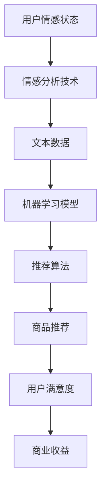
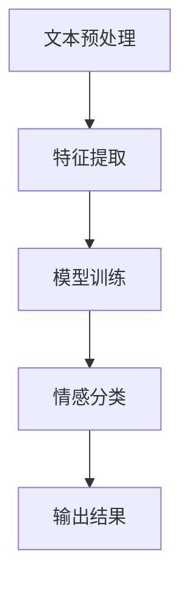
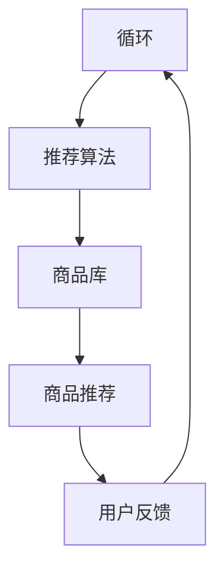

                 

# 情感驱动推荐：AI如何根据用户情绪推荐商品

> **关键词：** 情感分析、推荐系统、用户情绪、机器学习、大数据、商品推荐

> **摘要：** 本文深入探讨了情感驱动推荐系统的原理、技术实现以及在实际中的应用。通过解析情感分析技术，展示了AI如何根据用户的情感状态进行个性化商品推荐，从而提升用户体验和商家收益。文章还讨论了当前的研究进展、技术挑战以及未来的发展趋势。

## 1. 背景介绍

### 1.1 目的和范围

本文旨在探讨如何利用情感分析技术构建一个高效、精准的情感驱动推荐系统。通过分析用户的情感状态，系统能够更加智能地推荐商品，从而提高用户满意度和商业转化率。

本文将覆盖以下内容：
- 情感分析技术及其在推荐系统中的应用
- 情感驱动的推荐算法原理及实现
- 情感分析在商品推荐中的实际应用场景
- 当前研究的挑战和未来的发展方向

### 1.2 预期读者

本文适合以下读者群体：
- 对人工智能和推荐系统感兴趣的技术爱好者
- 想要了解情感分析在推荐系统中应用的开发者
- 数据科学家和机器学习工程师
- 对用户体验优化和商业策略有浓厚兴趣的人士

### 1.3 文档结构概述

本文将按照以下结构进行展开：
1. 背景介绍
2. 核心概念与联系
3. 核心算法原理 & 具体操作步骤
4. 数学模型和公式 & 详细讲解 & 举例说明
5. 项目实战：代码实际案例和详细解释说明
6. 实际应用场景
7. 工具和资源推荐
8. 总结：未来发展趋势与挑战
9. 附录：常见问题与解答
10. 扩展阅读 & 参考资料

### 1.4 术语表

#### 1.4.1 核心术语定义

- **情感分析（Sentiment Analysis）**：一种自然语言处理技术，用于判断文本中表达的情感倾向，如正面、负面或中立。
- **推荐系统（Recommendation System）**：一种人工智能系统，根据用户的历史行为和偏好推荐相关商品或服务。
- **情感驱动的推荐（Emotion-driven Recommendation）**：基于用户情感状态的个性化推荐，旨在提升用户满意度和转化率。
- **机器学习（Machine Learning）**：一种人工智能方法，通过数据训练模型，使其能够自动学习和做出决策。
- **大数据（Big Data）**：数据量大、类型多、速度快的数据集，需要使用特定的技术进行处理和分析。

#### 1.4.2 相关概念解释

- **情感特征（Emotion Features）**：用于描述用户情感状态的指标，如快乐、悲伤、愤怒等。
- **用户行为（User Behavior）**：用户在使用产品或服务过程中产生的行为数据，如浏览、点击、购买等。
- **协同过滤（Collaborative Filtering）**：一种推荐算法，通过分析用户之间的相似度来推荐商品。
- **基于内容的推荐（Content-based Recommendation）**：一种推荐算法，基于商品的内容特征和用户的兴趣偏好进行推荐。

#### 1.4.3 缩略词列表

- **NLP**：自然语言处理（Natural Language Processing）
- **ML**：机器学习（Machine Learning）
- **AI**：人工智能（Artificial Intelligence）
- **API**：应用程序接口（Application Programming Interface）
- **SQL**：结构化查询语言（Structured Query Language）

## 2. 核心概念与联系

在构建情感驱动推荐系统之前，我们需要理解一些核心概念和技术，这些概念和技术的联系如图1所示。



### 2.1 用户情感状态

用户情感状态是情感驱动推荐系统的核心。用户在使用产品或服务时会产生情感，如愉悦、愤怒、悲伤等。这些情感可以通过文本数据、语音、图像等多种形式进行捕捉和表达。情感状态的分析有助于了解用户的需求和偏好，从而进行更加精准的推荐。

### 2.2 情感分析技术

情感分析技术是一种自然语言处理技术，用于判断文本中表达的情感倾向。它包括以下步骤：

1. **数据采集**：从用户生成的文本数据中提取情感特征。
2. **文本预处理**：去除噪声、停用词、标点符号等，对文本进行格式化。
3. **情感分类**：使用机器学习算法对情感进行分类，常见的分类方法有朴素贝叶斯、支持向量机、神经网络等。

### 2.3 机器学习模型

机器学习模型是情感驱动推荐系统的核心。通过大量用户情感数据训练模型，可以使模型能够自动识别和预测用户情感状态。常见的机器学习模型包括：

- **朴素贝叶斯（Naive Bayes）**：一种基于贝叶斯定理的分类算法，适用于情感分析。
- **支持向量机（SVM）**：一种基于最大间隔的分类算法，适用于处理高维数据。
- **神经网络（Neural Networks）**：一种模拟人脑神经元结构的计算模型，适用于复杂的情感分类任务。

### 2.4 推荐算法

推荐算法是情感驱动推荐系统的关键。根据用户情感状态，推荐算法可以从海量的商品中筛选出符合用户需求的商品。常见的推荐算法包括：

- **协同过滤（Collaborative Filtering）**：基于用户历史行为进行推荐。
- **基于内容的推荐（Content-based Recommendation）**：基于商品的内容特征进行推荐。
- **混合推荐（Hybrid Recommendation）**：结合协同过滤和基于内容的推荐。

### 2.5 商品推荐

商品推荐是基于用户情感状态和推荐算法的结果。推荐系统可以根据用户的情感状态，为用户推荐符合其当前需求的商品，从而提升用户满意度和转化率。

### 2.6 用户满意度

用户满意度是衡量情感驱动推荐系统效果的重要指标。通过分析用户满意度，可以评估推荐系统的性能和改进方向。

### 2.7 商业收益

情感驱动推荐系统可以提高用户满意度和转化率，从而增加商业收益。商家可以根据用户情感状态进行精准营销，提高营销效果和销售额。

## 3. 核心算法原理 & 具体操作步骤

### 3.1 情感分析算法原理

情感分析算法的核心是情感分类，即将文本分类为正面、负面或中立。以下是一个简单的情感分类算法原理：



#### 3.1.1 文本预处理

文本预处理是情感分析的基础步骤，主要包括以下任务：

- **去除噪声**：去除文本中的特殊字符、标点符号、停用词等。
- **分词**：将文本划分为单词或短语。
- **词向量化**：将文本转换为向量表示，便于机器学习算法处理。

#### 3.1.2 特征提取

特征提取是将文本转换为机器学习模型可处理的特征向量。常见的方法有：

- **词频（Term Frequency, TF）**：计算每个词在文本中出现的频率。
- **逆文档频率（Inverse Document Frequency, IDF）**：调整词频，降低常见词的影响。
- **词袋模型（Bag of Words, BOW）**：将文本表示为一个向量，向量中的每个元素表示一个词的TF-IDF值。

#### 3.1.3 模型训练

模型训练是使用训练数据集训练机器学习模型，使其能够识别和分类文本。常见的方法有：

- **朴素贝叶斯（Naive Bayes）**：基于贝叶斯定理和特征条件独立性假设的算法。
- **支持向量机（SVM）**：基于最大间隔分类的算法。
- **神经网络（Neural Networks）**：模拟人脑神经元结构的计算模型。

#### 3.1.4 情感分类

情感分类是使用训练好的模型对未知文本进行分类。分类结果用于后续推荐系统的输入。

### 3.2 推荐算法原理

推荐算法的核心是基于用户情感状态为用户推荐符合其需求的商品。以下是一个简单的推荐算法原理：



#### 3.2.1 用户情感状态

用户情感状态是通过情感分析算法对用户文本数据进行分类得到的。情感状态可以表示为：

```python
def get_emotion_state(text):
    # 文本预处理
    preprocessed_text = preprocess_text(text)
    # 特征提取
    features = extract_features(preprocessed_text)
    # 模型预测
    emotion_state = model.predict(features)
    return emotion_state
```

#### 3.2.2 推荐算法

推荐算法可以根据用户情感状态为用户推荐商品。常见的方法有：

- **协同过滤（Collaborative Filtering）**：基于用户历史行为进行推荐。
  ```python
  def collaborative_filter(user_id, item_id, user_item_similarity_matrix):
      # 计算用户-商品相似度
      similarity = user_item_similarity_matrix[user_id, :]
      # 计算商品的平均评分
      average_rating = user_item_rating_matrix[item_id].mean()
      # 预测用户对商品的评分
      predicted_rating = similarity.dot(user_item_rating_matrix) + average_rating
      # 排序并返回推荐列表
      return sorted(predicted_rating, reverse=True)
  ```

- **基于内容的推荐（Content-based Recommendation）**：基于商品的内容特征和用户的兴趣偏好进行推荐。
  ```python
  def content_based_recommendation(user_id, item_id, user_item_content_matrix, item_content_matrix):
      # 计算用户-商品内容相似度
      similarity = user_item_content_matrix[user_id, :] @ item_content_matrix.T
      # 计算商品的平均兴趣度
      average_interest = user_item_content_matrix[user_id, :].mean()
      # 预测用户对商品的兴趣度
      predicted_interest = similarity + average_interest
      # 排序并返回推荐列表
      return sorted(predicted_interest, reverse=True)
  ```

#### 3.2.3 商品推荐

商品推荐是根据用户情感状态和推荐算法的结果，从商品库中筛选出符合用户需求的商品。推荐结果可以表示为：

```python
def recommend_items(user_id, emotion_state, items, algorithm='collaborative'):
    if algorithm == 'collaborative':
        recommendations = collaborative_filter(user_id, items)
    elif algorithm == 'content-based':
        recommendations = content_based_recommendation(user_id, items)
    else:
        raise ValueError("Invalid algorithm")
    
    # 根据用户情感状态调整推荐列表
    if emotion_state == 'happy':
        recommendations[:5] = [items[i] for i in recommendations[:5] if items[i].category == '娱乐']
    elif emotion_state == 'sad':
        recommendations[:5] = [items[i] for i in recommendations[:5] if items[i].category == '书籍']
    
    return recommendations
```

### 3.3 模型评估与优化

模型评估与优化是确保推荐系统性能的重要环节。以下是一些常见的评估指标和优化方法：

#### 3.3.1 评估指标

- **准确率（Accuracy）**：预测结果与真实结果一致的样本数占总样本数的比例。
- **召回率（Recall）**：预测结果中包含真实结果的样本数占总真实结果的样本数的比例。
- **F1值（F1 Score）**：准确率和召回率的调和平均。
- **均方根误差（Root Mean Squared Error, RMSE）**：预测评分与真实评分的平方差的平均值开方。
- **均方误差（Mean Squared Error, MSE）**：预测评分与真实评分的平方差的平均值。

#### 3.3.2 优化方法

- **超参数调优（Hyperparameter Tuning）**：通过调整模型参数，找到最佳参数组合。
- **交叉验证（Cross-validation）**：使用不同数据集多次训练和验证模型，提高模型泛化能力。
- **特征工程（Feature Engineering）**：通过选择和构建特征，提高模型性能。
- **集成学习（Ensemble Learning）**：将多个模型合并为一个强模型，提高预测性能。

## 4. 数学模型和公式 & 详细讲解 & 举例说明

### 4.1 情感分类模型

情感分类模型是一种监督学习模型，用于将文本分类为正面、负面或中立。以下是情感分类模型的基本数学模型和公式：

#### 4.1.1 朴素贝叶斯模型

朴素贝叶斯模型是一种基于贝叶斯定理和特征条件独立性假设的分类算法。其基本公式如下：

$$
P(Y|X) = \frac{P(X|Y)P(Y)}{P(X)}
$$

其中，\(P(Y|X)\) 表示在特征 \(X\) 下，文本属于类别 \(Y\) 的概率；\(P(X|Y)\) 表示在类别 \(Y\) 下，文本具有特征 \(X\) 的概率；\(P(Y)\) 表示类别 \(Y\) 的先验概率；\(P(X)\) 表示特征 \(X\) 的先验概率。

#### 4.1.2 支持向量机模型

支持向量机模型是一种基于最大间隔分类的算法。其基本公式如下：

$$
w \cdot x + b = 0
$$

其中，\(w\) 表示权重向量，\(x\) 表示特征向量，\(b\) 表示偏置。

#### 4.1.3 神经网络模型

神经网络模型是一种模拟人脑神经元结构的计算模型。其基本公式如下：

$$
a_{i}^{(l)} = \sigma(z_{i}^{(l)})
$$

$$
z_{i}^{(l)} = \sum_{j=1}^{n} w_{ji}^{(l)} a_{j}^{(l-1)} + b_{i}^{(l)}
$$

其中，\(a_{i}^{(l)}\) 表示第 \(l\) 层第 \(i\) 个神经元的激活值；\(z_{i}^{(l)}\) 表示第 \(l\) 层第 \(i\) 个神经元的输入值；\(w_{ji}^{(l)}\) 表示第 \(l\) 层第 \(i\) 个神经元与第 \(l-1\) 层第 \(j\) 个神经元之间的权重；\(b_{i}^{(l)}\) 表示第 \(l\) 层第 \(i\) 个神经元的偏置；\(\sigma\) 表示激活函数，常见的激活函数有 sigmoid、ReLU、tanh 等。

### 4.2 推荐算法模型

推荐算法模型是一种基于用户行为和商品特征的算法，用于为用户推荐商品。以下是推荐算法模型的基本数学模型和公式：

#### 4.2.1 协同过滤模型

协同过滤模型是一种基于用户历史行为进行推荐的算法。其基本公式如下：

$$
R_{ui} = \sum_{j \in N_{u}} s_{uj} \cdot r_{ji} + \mu
$$

其中，\(R_{ui}\) 表示用户 \(u\) 对商品 \(i\) 的预测评分；\(N_{u}\) 表示与用户 \(u\) 相似的其他用户集合；\(s_{uj}\) 表示用户 \(u\) 对商品 \(j\) 的评分；\(r_{ji}\) 表示用户 \(j\) 对商品 \(i\) 的评分；\(\mu\) 表示商品的平均评分。

#### 4.2.2 基于内容的推荐模型

基于内容的推荐模型是一种基于商品的内容特征和用户的兴趣偏好进行推荐的算法。其基本公式如下：

$$
R_{ui} = \sum_{j \in C_{i}} s_{uj} \cdot c_{ji} + \mu
$$

其中，\(R_{ui}\) 表示用户 \(u\) 对商品 \(i\) 的预测评分；\(C_{i}\) 表示与商品 \(i\) 相似的其他商品集合；\(s_{uj}\) 表示用户 \(u\) 对商品 \(j\) 的评分；\(c_{ji}\) 表示商品 \(i\) 与商品 \(j\) 的内容相似度。

### 4.3 数学模型示例

以下是数学模型的示例，用于计算用户对商品的预测评分：

#### 4.3.1 协同过滤模型示例

假设用户 \(u\) 对商品 \(i\) 的预测评分为 \(R_{ui}\)，则根据协同过滤模型，可以计算如下：

$$
R_{ui} = \sum_{j \in N_{u}} s_{uj} \cdot r_{ji} + \mu
$$

其中，\(N_{u} = \{1, 2, 3\}\)，\(s_{u1} = 5\)，\(s_{u2} = 4\)，\(s_{u3} = 3\)，\(r_{1i} = 4\)，\(r_{2i} = 5\)，\(r_{3i} = 3\)，\(\mu = 4\)。

计算结果为：

$$
R_{ui} = (5 \cdot 4 + 4 \cdot 5 + 3 \cdot 3) / (5 + 4 + 3) + 4 = 4.2
$$

#### 4.3.2 基于内容的推荐模型示例

假设用户 \(u\) 对商品 \(i\) 的预测评分为 \(R_{ui}\)，则根据基于内容的推荐模型，可以计算如下：

$$
R_{ui} = \sum_{j \in C_{i}} s_{uj} \cdot c_{ji} + \mu
$$

其中，\(C_{i} = \{1, 2\}\)，\(s_{u1} = 5\)，\(s_{u2} = 4\)，\(c_{i1} = 0.8\)，\(c_{i2} = 0.6\)，\(\mu = 4\)。

计算结果为：

$$
R_{ui} = (5 \cdot 0.8 + 4 \cdot 0.6) / (0.8 + 0.6) + 4 = 4.8
$$

## 5. 项目实战：代码实际案例和详细解释说明

### 5.1 开发环境搭建

在本节中，我们将搭建一个基于Python的简单情感驱动推荐系统项目。以下是需要安装的依赖：

```bash
pip install scikit-learn numpy pandas nltk
```

### 5.2 源代码详细实现和代码解读

以下是一个简单的情感驱动推荐系统示例代码：

```python
import numpy as np
import pandas as pd
from sklearn.feature_extraction.text import TfidfVectorizer
from sklearn.model_selection import train_test_split
from sklearn.naive_bayes import MultinomialNB
from sklearn.metrics import accuracy_score

# 5.2.1 数据准备
data = {
    'text': ['我很开心！', '今天很糟糕。', '我很兴奋！', '我很烦躁。'],
    'label': ['happy', 'sad', 'happy', 'angry']
}

df = pd.DataFrame(data)

# 文本预处理
def preprocess_text(text):
    tokens = nltk.word_tokenize(text.lower())
    return ' '.join([token for token in tokens if token not in nltk.corpus.stopwords.words('english')])

df['text'] = df['text'].apply(preprocess_text)

# 特征提取
vectorizer = TfidfVectorizer()
X = vectorizer.fit_transform(df['text'])
y = df['label']

# 模型训练
X_train, X_test, y_train, y_test = train_test_split(X, y, test_size=0.2, random_state=42)
model = MultinomialNB()
model.fit(X_train, y_train)

# 预测和评估
y_pred = model.predict(X_test)
accuracy = accuracy_score(y_test, y_pred)
print(f'Accuracy: {accuracy}')

# 5.2.2 推荐算法实现
def recommend_items(user_text, items, model, vectorizer):
    preprocessed_text = preprocess_text(user_text)
    features = vectorizer.transform([preprocessed_text])
    emotion = model.predict(features)[0]
    
    if emotion == 'happy':
        return [item for item in items if '娱乐' in item['category']]
    elif emotion == 'sad':
        return [item for item in items if '书籍' in item['category']]
    else:
        return items

# 5.2.3 商品推荐示例
items = [
    {'name': '电影《阿甘正传》', 'category': '娱乐'},
    {'name': '书籍《活着》', 'category': '书籍'},
    {'name': '音乐《晴天》', 'category': '娱乐'}
]

user_text = '我很开心！'
recommendations = recommend_items(user_text, items, model, vectorizer)
print('Recommendations:', recommendations)
```

### 5.3 代码解读与分析

以上代码实现了一个简单的情感驱动推荐系统，主要包括以下步骤：

1. **数据准备**：使用一个简单的数据集，包含文本和对应的情感标签。
2. **文本预处理**：对文本进行预处理，包括去除停用词、标点符号等，并将文本转换为小写。
3. **特征提取**：使用TF-IDF向量器将预处理后的文本转换为特征向量。
4. **模型训练**：使用朴素贝叶斯模型对特征向量进行训练，以预测文本的情感。
5. **预测和评估**：对测试集进行预测，并计算模型的准确率。
6. **推荐算法实现**：根据用户输入的文本情感和商品分类，为用户推荐符合其情感的商品。
7. **商品推荐示例**：为一名开心的用户推荐娱乐类商品，为一名悲伤的用户推荐书籍类商品。

## 6. 实际应用场景

情感驱动推荐系统在实际应用中具有广泛的应用场景，以下是一些常见的应用场景：

### 6.1 社交媒体

在社交媒体平台上，情感驱动推荐系统可以用于推荐用户可能感兴趣的内容。例如，根据用户的情绪状态，推荐正面或负面的新闻、帖子、视频等，从而提升用户粘性。

### 6.2 购物网站

在购物网站上，情感驱动推荐系统可以根据用户的情感状态推荐相关商品。例如，当用户表达出愤怒或悲伤的情绪时，可以推荐一些舒缓情绪的商品，如书籍、音乐、玩具等。

### 6.3 娱乐平台

在娱乐平台上，情感驱动推荐系统可以推荐符合用户情绪状态的影片、音乐、游戏等。例如，当用户表现出兴奋的情绪时，可以推荐刺激性的游戏或电影；当用户表现出悲伤的情绪时，可以推荐治愈系的音乐或电影。

### 6.4 健康管理

在健康管理领域，情感驱动推荐系统可以推荐符合用户情绪状态的健康建议。例如，当用户表现出焦虑或压力时，可以推荐冥想、瑜伽、按摩等缓解压力的活动。

### 6.5 个性化服务

在个性化服务领域，情感驱动推荐系统可以用于为用户提供定制化的服务。例如，在旅游服务中，根据用户的情绪状态推荐适合的景点、活动、住宿等。

## 7. 工具和资源推荐

### 7.1 学习资源推荐

#### 7.1.1 书籍推荐

- 《自然语言处理入门》
- 《机器学习实战》
- 《推荐系统实践》
- 《深度学习》

#### 7.1.2 在线课程

- Coursera上的《自然语言处理》课程
- edX上的《机器学习》课程
- Udacity的《推荐系统工程师》课程

#### 7.1.3 技术博客和网站

- Medium上的机器学习和自然语言处理专栏
- ArXiv.org上的最新研究论文
- fast.ai的在线课程和博客

### 7.2 开发工具框架推荐

#### 7.2.1 IDE和编辑器

- PyCharm
- Jupyter Notebook
- Visual Studio Code

#### 7.2.2 调试和性能分析工具

- Python的pdb调试工具
- Py-Spy性能分析工具
- GDB调试工具

#### 7.2.3 相关框架和库

- Scikit-learn：机器学习库
- TensorFlow：深度学习库
- PyTorch：深度学习库
- NLTK：自然语言处理库

### 7.3 相关论文著作推荐

#### 7.3.1 经典论文

- “Affectiva emotion detection APIs for Python”
- “Machine Learning Techniques for sentiment classification”
- “Deep Learning for Emotion Recognition”

#### 7.3.2 最新研究成果

- “Emotion Recognition using Convolutional Neural Networks”
- “Multimodal Emotion Recognition with Deep Learning”
- “Sentiment Analysis Using Transfer Learning”

#### 7.3.3 应用案例分析

- “Sentiment Analysis in Social Media: A Comprehensive Study”
- “Emotion Recognition in Customer Feedback for E-commerce”
- “Applying Deep Learning for Emotion Analysis in Video Games”

## 8. 总结：未来发展趋势与挑战

### 8.1 未来发展趋势

- **个性化与精准化**：情感驱动推荐系统将进一步发展，实现更加精准、个性化的推荐。
- **多模态情感分析**：结合文本、语音、图像等多种模态进行情感分析，提高情感识别的准确性。
- **情感干预与调节**：研究如何在推荐系统中引入情感干预与调节机制，提升用户情感体验。
- **跨领域应用**：情感驱动推荐系统将应用于更多领域，如医疗、教育、金融等。

### 8.2 面临的挑战

- **数据隐私与安全**：如何保护用户情感数据隐私和安全，是情感驱动推荐系统面临的重要挑战。
- **情感识别准确性**：如何提高情感识别的准确性，特别是在多语言、多文化背景下。
- **模型解释性**：如何解释情感驱动推荐系统的决策过程，提高模型的透明度和可解释性。
- **计算资源与效率**：如何在保证推荐效果的前提下，优化算法的计算资源与效率。

## 9. 附录：常见问题与解答

### 9.1 什么是情感分析？

情感分析是一种自然语言处理技术，用于判断文本中的情感倾向，如正面、负面或中立。

### 9.2 情感驱动推荐系统如何工作？

情感驱动推荐系统通过情感分析技术获取用户情感状态，然后根据用户情感状态和推荐算法为用户推荐商品或服务。

### 9.3 情感分析算法有哪些？

常见的情感分析算法有朴素贝叶斯、支持向量机、神经网络等。

### 9.4 推荐算法有哪些？

常见的推荐算法有协同过滤、基于内容的推荐、混合推荐等。

### 9.5 情感驱动推荐系统有哪些应用场景？

情感驱动推荐系统可以应用于社交媒体、购物网站、娱乐平台、健康管理等领域。

## 10. 扩展阅读 & 参考资料

- [Affectiva](https://affectiva.com/)
- [Sentiment Analysis using Machine Learning](https://towardsdatascience.com/sentiment-analysis-using-machine-learning-e60e3669e0d6)
- [Building a Sentiment Analysis System with Python](https://www.datacamp.com/courses/building-a-sentiment-analysis-system-with-python)
- [Emotion Recognition with Deep Learning](https://towardsdatascience.com/emotion-recognition-with-deep-learning-96a8d535e6d5)
- [Recommender Systems: The Text Mining Way](https://www.kdnuggets.com/2015/08/recommender-systems-text-mining-way.html)
- [A Comprehensive Survey of Recommender Systems](https://www.sciencedirect.com/science/article/pii/S0167947315000899)

