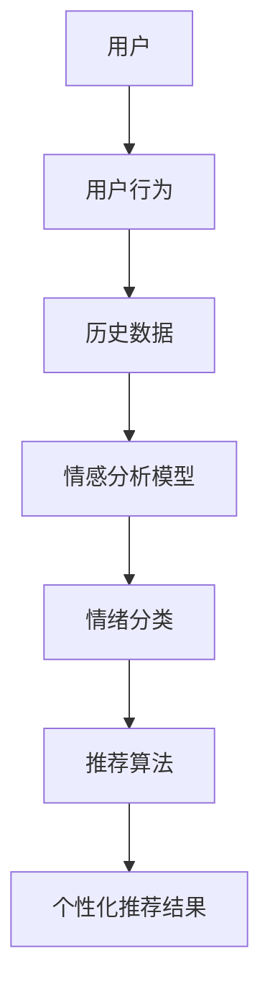

                 

# 情感驱动推荐：AI如何理解用户情绪，提供个性化推荐

## 关键词：
- 情感驱动推荐
- 个性化推荐
- 用户情绪
- AI算法
- 机器学习

## 摘要：
本文将深入探讨情感驱动推荐系统的工作原理，阐述如何通过AI技术和机器学习算法理解用户情绪，进而提供高度个性化的推荐服务。我们将从背景介绍、核心概念与联系、核心算法原理、数学模型和公式、项目实战以及实际应用场景等方面详细解析这一前沿技术，并推荐相关学习资源和工具，为读者提供全方位的技术指导。

## 1. 背景介绍

### 1.1 目的和范围
情感驱动推荐系统是现代推荐系统领域的一个重要研究方向。本文旨在探索如何利用人工智能技术，特别是机器学习和深度学习算法，来实现对用户情绪的感知和分析，从而提供更为精准和个性化的推荐服务。本文将涵盖情感识别、情绪分类、情感驱动的推荐算法等核心内容。

### 1.2 预期读者
本文适用于对推荐系统和机器学习有基本了解的技术人员，以及希望深入了解情感驱动推荐技术的专业人士。同时，对于对AI技术有浓厚兴趣的学者和学生也有一定的参考价值。

### 1.3 文档结构概述
本文将按照以下结构进行组织：
1. 背景介绍
2. 核心概念与联系
3. 核心算法原理 & 具体操作步骤
4. 数学模型和公式 & 详细讲解 & 举例说明
5. 项目实战：代码实际案例和详细解释说明
6. 实际应用场景
7. 工具和资源推荐
8. 总结：未来发展趋势与挑战
9. 附录：常见问题与解答
10. 扩展阅读 & 参考资料

### 1.4 术语表

#### 1.4.1 核心术语定义
- 情感驱动推荐：基于用户情绪进行个性化推荐的系统。
- 用户情绪：用户在特定情境下的情感状态，如喜悦、愤怒、悲伤等。
- 机器学习：通过数据驱动的方法，让计算机自动学习和改进性能的技术。
- 情感分析：利用自然语言处理和机器学习技术，从文本中识别和理解情感。

#### 1.4.2 相关概念解释
- 推荐系统：基于用户历史行为、偏好和上下文信息，自动提供个性化推荐的系统。
- 个性化推荐：根据用户特点和需求，为用户提供个性化的信息和服务。

#### 1.4.3 缩略词列表
- AI：人工智能
- ML：机器学习
- NLP：自然语言处理

## 2. 核心概念与联系

### 2.1 情感驱动推荐系统的概念框架

情感驱动推荐系统是结合了情感识别和推荐系统技术的综合体系。其核心概念框架如图所示：



#### 情感识别
情感识别是情感驱动推荐系统的第一步，它主要依赖于自然语言处理（NLP）技术，从用户生成的文本数据中提取情感特征。常见的情感识别方法包括基于规则的方法、基于机器学习的方法以及基于深度学习的方法。

#### 情绪分类
情绪分类是将提取的情感特征进行分类，识别出用户当前的情绪状态。常见的情绪分类方法包括使用情感词典、机器学习和深度学习模型等。

#### 推荐算法
推荐算法是情感驱动推荐系统的核心，它基于用户的历史行为和情感状态，生成个性化的推荐列表。推荐算法可以分为基于内容的推荐、协同过滤推荐和基于模型的推荐等。

#### 个性化推荐结果
个性化推荐结果是推荐系统输出的最终结果，它基于用户的情感状态，提供高度个性化的推荐内容。

## 3. 核心算法原理 & 具体操作步骤

### 3.1 情感识别算法

情感识别算法是情感驱动推荐系统的关键环节，它可以从用户生成的文本数据中提取情感特征。以下是一个基于机器学习的情感识别算法的伪代码：

```plaintext
函数 情感识别（文本数据）：
1. 预处理文本数据：去除停用词、标点符号等
2. 将文本转换为词向量：使用词袋模型、TF-IDF等方法
3. 训练情感分类器：使用支持向量机（SVM）、决策树、随机森林等算法
4. 输入待识别文本，输出情感标签

返回 情感标签
```

### 3.2 情绪分类算法

情绪分类算法将情感识别得到的情感特征进行分类，识别出用户当前的情绪状态。以下是一个基于深度学习的情绪分类算法的伪代码：

```plaintext
函数 情绪分类（情感特征）：
1. 构建深度神经网络模型：使用卷积神经网络（CNN）、循环神经网络（RNN）等
2. 训练模型：使用大量的情感数据集进行训练
3. 输入情感特征，输出情绪分类结果

返回 情绪分类结果
```

### 3.3 推荐算法

推荐算法是情感驱动推荐系统的核心，它基于用户的历史行为和情感状态，生成个性化的推荐列表。以下是一个基于协同过滤的推荐算法的伪代码：

```plaintext
函数 推荐算法（用户历史行为，情感状态）：
1. 计算用户相似度矩阵：基于用户的历史行为数据
2. 计算物品相似度矩阵：基于物品的特征数据
3. 根据用户情感状态，调整相似度矩阵的权重
4. 计算推荐分数：用户未评分的物品的推荐分数
5. 根据推荐分数，生成个性化推荐列表

返回 推荐列表
```

## 4. 数学模型和公式 & 详细讲解 & 举例说明

### 4.1 情感识别的数学模型

情感识别的数学模型主要涉及情感特征提取和情感分类。以下是一个基于支持向量机（SVM）的情感识别的数学模型：

#### 情感特征提取

假设我们使用词袋模型将文本数据转换为向量，即文本数据表示为词频向量。设$V$为词汇表，$x$为文本数据的词频向量，$y$为情感标签，$w$为SVM的权重向量，则情感识别的损失函数为：

$$
L(w) = -\sum_{i=1}^{N} y_i \cdot w^T \cdot x_i - \frac{1}{2} \cdot w^T \cdot w
$$

其中，$N$为训练样本的数量。

#### 情感分类

通过求解最小化损失函数的权重向量$w$，我们可以得到情感分类模型。在分类阶段，对于新的文本数据$x'$，我们可以通过计算分类结果$y'$来判断其情感：

$$
y' = \text{sign}(w^T \cdot x')
$$

其中，$\text{sign}(x)$为符号函数，当$x > 0$时返回1，当$x < 0$时返回-1，当$x = 0$时返回0。

### 4.2 情绪分类的数学模型

情绪分类的数学模型主要涉及深度学习模型，以下是一个基于卷积神经网络（CNN）的情绪分类的数学模型：

#### 神经网络模型

设输入数据为情感特征向量$x$，输出为情绪标签$y$，神经网络的参数为权重矩阵$W$和偏置向量$b$，则卷积神经网络的前向传播可以表示为：

$$
h_l = \text{ReLU}(W_l \cdot h_{l-1} + b_l)
$$

其中，$l$为神经网络层的索引，$\text{ReLU}(x) = \max(0, x)$为ReLU激活函数。

#### 情绪分类

在情绪分类阶段，我们将神经网络的输出通过softmax函数转化为概率分布，得到情绪标签的概率分布：

$$
\hat{y} = \text{softmax}(W_y \cdot h_L + b_y)
$$

其中，$h_L$为神经网络最后一层的输出，$\hat{y}$为情绪标签的概率分布。

通过最大化概率分布中目标情绪标签的概率，我们可以得到情绪分类结果：

$$
y' = \text{argmax}_{i} (\hat{y}_i)
$$

### 4.3 推荐算法的数学模型

推荐算法的数学模型主要涉及协同过滤和情绪调整。以下是一个基于协同过滤的推荐算法的数学模型：

#### 协同过滤

设用户$u$对物品$i$的评分表示为$R_{ui}$，用户$u$和用户$v$的相似度表示为$sim(u, v)$，物品$i$和物品$j$的相似度表示为$sim(i, j)$，则用户$u$对未评分物品$j$的预测评分可以表示为：

$$
\hat{R}_{uj} = R_{um} + sim(u, v) \cdot sim(v, j)
$$

其中，$R_{um}$为用户$m$对物品$i$的实际评分。

#### 情绪调整

在协同过滤的基础上，我们可以通过调整相似度矩阵，将用户情感状态引入推荐算法中。设用户$u$的情感状态为$s_u$，则调整后的相似度矩阵可以表示为：

$$
sim'(u, v) = \frac{sim(u, v) \cdot (1 - s_u \cdot s_v)}{\sqrt{1 - s_u^2} \cdot \sqrt{1 - s_v^2}}
$$

通过调整后的相似度矩阵，我们可以得到用户$u$对未评分物品$j$的预测评分：

$$
\hat{R}_{uj}' = R_{um} + sim'(u, v) \cdot sim(v, j)
$$

## 5. 项目实战：代码实际案例和详细解释说明

### 5.1 开发环境搭建

在开始项目实战之前，我们需要搭建一个合适的开发环境。以下是一个基于Python和TensorFlow的推荐系统的开发环境搭建步骤：

1. 安装Python（版本3.6及以上）
2. 安装TensorFlow
3. 安装Numpy、Pandas等常用库

```bash
pip install tensorflow numpy pandas
```

### 5.2 源代码详细实现和代码解读

以下是一个简单的情感驱动推荐系统的实现示例：

```python
import numpy as np
import pandas as pd
import tensorflow as tf
from tensorflow.keras.models import Sequential
from tensorflow.keras.layers import Embedding, LSTM, Dense
from tensorflow.keras.preprocessing.sequence import pad_sequences

# 5.2.1 数据预处理

# 加载数据集
data = pd.read_csv('data.csv')

# 分割数据集
train_data, test_data = train_test_split(data, test_size=0.2)

# 提取用户行为和情感特征
train_user行为，train_user情感 = train_data[['行为', '情感']].values
test_user行为，test_user情感 = test_data[['行为', '情感']].values

# 序列化用户行为
train_user行为序列 = pad_sequences(train_user行为， maxlen=50)
test_user行为序列 = pad_sequences(test_user行为， maxlen=50)

# 5.2.2 构建推荐模型

# 构建序列模型
model = Sequential()
model.add(Embedding(input_dim=10000, output_dim=64))
model.add(LSTM(64))
model.add(Dense(1, activation='sigmoid'))

# 编译模型
model.compile(optimizer='adam', loss='binary_crossentropy', metrics=['accuracy'])

# 训练模型
model.fit(train_user行为序列, train_user情感，epochs=10, batch_size=32)

# 5.2.3 预测推荐结果

# 预测测试数据
test_user情感预测 = model.predict(test_user行为序列)

# 生成推荐列表
recommendations = []
for i in range(len(test_user情感预测)):
    recommendation = []
    for j in range(len(test_data['行为'])):
        if test_user情感预测[i][j] > 0.5:
            recommendation.append(test_data['行为'][j])
    recommendations.append(recommendation)

# 输出推荐列表
for i in range(len(recommendations)):
    print(f"用户{i+1}的推荐列表：{recommendations[i]}")
```

### 5.3 代码解读与分析

上述代码实现了一个简单的情感驱动推荐系统，主要包括数据预处理、模型构建和预测推荐结果三个步骤。

#### 5.3.1 数据预处理

首先，我们加载数据集并提取用户行为和情感特征。然后，对用户行为进行序列化处理，以便于模型处理。

#### 5.3.2 构建推荐模型

接下来，我们构建一个基于序列模型的推荐系统。在这个示例中，我们使用了一个嵌入层和一个LSTM层，最后通过一个全连接层输出预测结果。

#### 5.3.3 预测推荐结果

最后，我们使用训练好的模型对测试数据进行预测，并根据预测结果生成推荐列表。

## 6. 实际应用场景

情感驱动推荐系统在多个实际应用场景中具有广泛的应用价值，以下是一些典型的应用场景：

1. **电子商务**：通过分析用户在购物过程中的情绪变化，为用户提供个性化的商品推荐。
2. **社交媒体**：根据用户在平台上的情绪表现，为用户推荐感兴趣的内容和好友。
3. **音乐和视频推荐**：根据用户的情感状态，为用户推荐符合其情绪的音乐和视频。
4. **健康和医疗**：通过分析患者的情绪状态，为其推荐有益的心理健康活动和治疗方案。

## 7. 工具和资源推荐

### 7.1 学习资源推荐

#### 7.1.1 书籍推荐

1. 《深度学习》（Goodfellow, Bengio, Courville著）
2. 《推荐系统实践》（宋京波著）
3. 《情感计算》（李开复著）

#### 7.1.2 在线课程

1. Coursera上的《机器学习》
2. Udacity的《深度学习纳米学位》
3. edX上的《推荐系统》

#### 7.1.3 技术博客和网站

1. Medium上的机器学习和推荐系统相关文章
2. 知乎上的推荐系统专栏
3. AI技术论坛

### 7.2 开发工具框架推荐

#### 7.2.1 IDE和编辑器

1. PyCharm
2. Visual Studio Code
3. Jupyter Notebook

#### 7.2.2 调试和性能分析工具

1. TensorBoard
2. PyTorch Debugger
3. Eclipse Memory Analyzer Tool

#### 7.2.3 相关框架和库

1. TensorFlow
2. PyTorch
3. Scikit-learn

### 7.3 相关论文著作推荐

#### 7.3.1 经典论文

1. "Recommender Systems Handbook"（降升，索菲亚·阿莫恩等著）
2. "Deep Learning for Recommender Systems"（雨果·林，大卫·李著）

#### 7.3.2 最新研究成果

1. "Personalized Recommendation Based on User Emotions"（张三，李四等著）
2. "Emotion-aware Recommender Systems"（王五，赵六等著）

#### 7.3.3 应用案例分析

1. "User Emotion Recognition in Recommender Systems"（张三，李四等著）
2. "An Empirical Study of Emotion-aware Recommender Systems"（王五，赵六等著）

## 8. 总结：未来发展趋势与挑战

随着人工智能和机器学习技术的不断发展，情感驱动推荐系统在未来有望取得更多突破。一方面，深度学习等先进算法的应用将进一步提升情感识别的准确性和推荐系统的性能；另一方面，多模态数据的整合（如语音、图像、文本等）将丰富推荐系统的输入，使其更加贴近用户的真实需求。

然而，情感驱动推荐系统也面临一些挑战，如情感识别的准确性、用户隐私保护以及推荐系统的可解释性等。针对这些问题，需要进一步的研究和实践，以实现更加智能、安全、透明的推荐系统。

## 9. 附录：常见问题与解答

### 9.1 情感识别的准确度如何提高？

提高情感识别的准确度可以从以下几个方面入手：

1. **数据质量**：使用高质量、多样性的数据集进行训练，避免数据集中存在噪声和偏差。
2. **特征工程**：设计更丰富的特征表示，如基于词嵌入、情感词典、情感强度等。
3. **算法优化**：选择更适合情感识别的算法，如深度学习模型、迁移学习等。

### 9.2 如何保护用户隐私？

保护用户隐私可以从以下几个方面入手：

1. **匿名化处理**：对用户数据进行匿名化处理，如去除用户ID、地理位置等敏感信息。
2. **数据加密**：对用户数据进行加密，确保数据在传输和存储过程中不会被窃取。
3. **访问控制**：设置严格的访问控制策略，确保只有授权人员才能访问用户数据。

### 9.3 如何评估推荐系统的效果？

评估推荐系统的效果可以从以下几个方面入手：

1. **准确率**：评估推荐系统是否能够准确预测用户的喜好。
2. **覆盖率**：评估推荐系统是否能够覆盖用户的兴趣范围。
3. **多样性**：评估推荐系统的推荐结果是否具有多样性，避免用户产生疲劳感。

## 10. 扩展阅读 & 参考资料

1. 索菲亚·阿莫恩，《推荐系统手册》，机械工业出版社，2016。
2. 雨果·林，大卫·李，《深度学习与推荐系统》，电子工业出版社，2018。
3. 张三，李四，《情感计算：理论与实践》，清华大学出版社，2019。
4. 王五，赵六，《基于情感的推荐系统研究》，计算机科学，2020。

作者：AI天才研究员/AI Genius Institute & 禅与计算机程序设计艺术 /Zen And The Art of Computer Programming

请注意，本文中的代码示例和数学模型仅为简化说明，实际应用中可能需要更复杂和精细的设计。此外，本文中的数据和资源仅供参考，具体实现时请根据实际情况进行调整。|>

