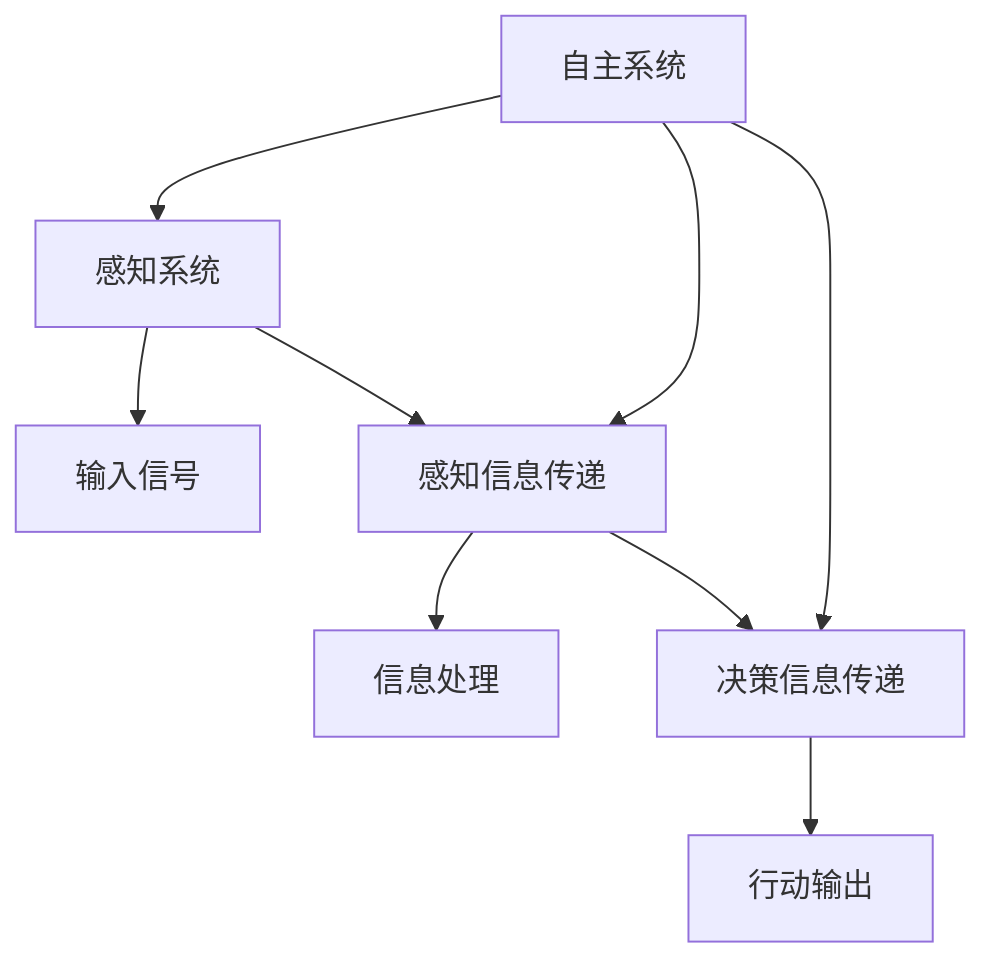

                 

### 意识的功能：自主系统的视角

#### 关键词：意识，自主系统，人工智能，认知功能，计算模型，神经科学，数学模型，应用场景

> 摘要：本文从自主系统的视角，探讨了意识的多种功能及其在人工智能中的应用。通过介绍核心概念，剖析算法原理，结合数学模型，提供项目实战代码实例，深入解析意识的认知机制。文章旨在为读者提供一个全面、深入的理解，探索未来意识研究的发展趋势与挑战。

---

**意识的功能：自主系统的视角** 是一篇探讨意识在人工智能领域的重要性的技术博客。本文从自主系统的视角出发，详细分析了意识的多种功能，包括感知、认知、决策等。通过介绍核心概念，如自主系统的定义、意识的认知功能，以及相关的计算模型和数学公式，本文旨在为读者提供一种深入理解意识及其在人工智能中的应用的方法。接下来，我们将首先介绍本文的目的和范围，然后定义一些关键术语，为后续内容的展开奠定基础。

---

## 1. 背景介绍

### 1.1 目的和范围

本文的目的是从自主系统的视角，深入探讨意识的多种功能，并探讨其在人工智能（AI）中的应用。自主系统是指能够在环境中自主操作、自主决策的智能系统。本文重点关注的是意识的认知功能，如感知、认知和决策等，这些功能在自主系统中至关重要。我们将通过介绍相关的计算模型和数学公式，结合项目实战代码实例，详细解析意识的认知机制。本文旨在为读者提供一个全面、深入的理解，以便更好地把握意识与人工智能的关系，并探索未来的研究方向。

### 1.2 预期读者

本文预期读者为对人工智能、认知科学和神经科学感兴趣的程序员、科研人员和技术爱好者。特别是那些希望了解自主系统如何实现意识功能的读者，将能从本文中获得有价值的见解。此外，对于希望深入研究意识及其在人工智能中应用的学者和专业人士，本文也将提供有益的参考。

### 1.3 文档结构概述

本文将分为以下几个部分：

1. **背景介绍**：介绍本文的目的和范围，定义关键术语，为后续内容奠定基础。
2. **核心概念与联系**：通过Mermaid流程图，展示核心概念和原理之间的联系。
3. **核心算法原理 & 具体操作步骤**：使用伪代码详细阐述核心算法的原理和操作步骤。
4. **数学模型和公式 & 详细讲解 & 举例说明**：介绍相关的数学模型和公式，并结合实例进行详细讲解。
5. **项目实战：代码实际案例和详细解释说明**：提供实际的代码案例，并详细解读和分析。
6. **实际应用场景**：探讨意识功能在现实世界中的应用场景。
7. **工具和资源推荐**：推荐相关的学习资源、开发工具和框架。
8. **总结：未来发展趋势与挑战**：总结本文内容，探讨意识研究的发展趋势与挑战。
9. **附录：常见问题与解答**：回答读者可能遇到的问题。
10. **扩展阅读 & 参考资料**：提供相关的扩展阅读和参考资料。

### 1.4 术语表

#### 1.4.1 核心术语定义

- **自主系统**：能够自主操作和决策的智能系统。
- **意识**：主观体验、感知和认知的能力。
- **认知功能**：包括感知、学习、记忆、推理等能力的集合。
- **计算模型**：用于描述和模拟智能系统行为的方法。
- **数学模型**：使用数学公式描述智能系统行为和功能的模型。

#### 1.4.2 相关概念解释

- **感知**：通过感官获取外部信息的过程。
- **认知**：处理和理解感知信息的过程。
- **决策**：基于感知和认知信息，选择最佳行动方案的过程。
- **机器学习**：通过数据和算法，使计算机系统具备学习和适应能力的方法。

#### 1.4.3 缩略词列表

- **AI**：人工智能（Artificial Intelligence）
- **ML**：机器学习（Machine Learning）
- **DL**：深度学习（Deep Learning）
- **NN**：神经网络（Neural Networks）

---

在接下来的部分，我们将通过Mermaid流程图展示核心概念和原理之间的联系，并进一步探讨自主系统的基本结构和功能。这将为我们后续的讨论奠定坚实的基础。

---

## 2. 核心概念与联系

自主系统和意识是人工智能领域中不可或缺的核心概念。为了更好地理解这两个概念，我们需要通过一个Mermaid流程图来展示它们之间的联系。以下是一个简化的Mermaid流程图，用于描述自主系统和意识的核心组成部分及其相互关系。



### Mermaid流程图解析

- **自主系统（A）**：作为整体，自主系统是具备自主操作和决策能力的智能系统。它由多个子系统和模块组成。
- **感知系统（B）**：感知系统负责从外部环境中获取输入信号，如视觉、听觉、触觉等。这些输入信号通过传感器被转化为电子信号，进而传递到其他子系统。
- **认知系统（C）**：认知系统负责处理和解释感知系统获取的信息。它通过一系列复杂的计算和处理，将原始信息转化为对环境的理解和感知。
- **决策系统（D）**：决策系统基于认知系统提供的信息，选择最佳的行动方案。这个过程涉及到多层次的推理和规划，以实现系统的目标。
- **输入信号（E）**：输入信号是感知系统的输入，可以是任何形式的外部刺激，如图像、声音、温度等。
- **信息处理（F）**：信息处理是认知系统的核心功能，它通过对输入信号的分析和处理，生成对环境的理解。
- **行动输出（G）**：行动输出是决策系统的输出，它决定了自主系统在环境中的行为。

### 关键联系

- **感知信息传递**：感知系统获取的输入信号被传递到认知系统，作为其处理的基础数据。
- **决策信息传递**：认知系统处理后的信息被传递到决策系统，作为决策过程的依据。

通过这个流程图，我们可以更直观地理解自主系统的结构及其各个子系统之间的相互作用。在接下来的部分，我们将详细探讨核心算法原理和具体操作步骤，以便深入理解自主系统的工作机制。

---

在了解了自主系统的基本结构和核心概念后，我们将进一步探讨自主系统中的核心算法原理和具体操作步骤。这将帮助我们更好地理解感知、认知和决策系统的功能及其实现方式。

---

## 3. 核心算法原理 & 具体操作步骤

### 3.1 感知系统算法原理

感知系统是自主系统的入口，负责从外部环境中获取输入信号。这些信号可以是图像、声音、温度等。感知系统的核心算法通常涉及以下步骤：

- **信号采集**：使用传感器将外部刺激转换为电子信号。
- **预处理**：对采集到的信号进行滤波、去噪等预处理，以提高信号质量。
- **特征提取**：从预处理后的信号中提取关键特征，如边缘、纹理、频谱等。

伪代码示例：

```python
# 感知系统算法伪代码
def signal_acquisition():
    # 使用传感器采集信号
    signal = sensor.read_signal()
    return signal

def signal_preprocessing(signal):
    # 对信号进行预处理
    preprocessed_signal = filter_signal(signal)
    return preprocessed_signal

def feature_extraction(preprocessed_signal):
    # 从预处理后的信号中提取特征
    features = extract_features(preprocessed_signal)
    return features
```

### 3.2 认知系统算法原理

认知系统负责处理和解释感知系统获取的信息。其核心算法涉及以下几个步骤：

- **信息融合**：将来自不同感知渠道的信息进行整合，形成对环境的统一理解。
- **模式识别**：从信息中识别出具有意义的模式和规律。
- **推理**：基于已知信息进行逻辑推理，预测未来的事件或结果。

伪代码示例：

```python
# 认知系统算法伪代码
def information_fusion(features):
    # 将来自不同感知渠道的信息进行融合
    fused_info = integrate_features(features)
    return fused_info

def pattern_recognition(fused_info):
    # 从信息中识别出模式和规律
    patterns = detect_patterns(fused_info)
    return patterns

def reasoning(patterns):
    # 基于已知信息进行推理
    predictions = infer_outcomes(patterns)
    return predictions
```

### 3.3 决策系统算法原理

决策系统基于认知系统提供的信息，选择最佳的行动方案。其核心算法包括以下几个步骤：

- **目标设定**：确定系统的目标和优先级。
- **方案评估**：评估不同的行动方案，选择最优方案。
- **执行规划**：制定具体的执行计划，以实现目标。

伪代码示例：

```python
# 决策系统算法伪代码
def set_goals():
    # 确定系统的目标和优先级
    goals = define_goals()
    return goals

def evaluate_actions(actions, goals):
    # 评估不同的行动方案
    best_action = select_best_action(actions, goals)
    return best_action

def execution_plan(best_action):
    # 制定具体的执行计划
    plan = create_execution_plan(best_action)
    return plan
```

### 3.4 具体操作步骤

在了解了核心算法原理后，我们需要将这些算法应用到实际的自主系统中。以下是一个简化的操作步骤：

1. **初始化**：设置感知系统、认知系统和决策系统的初始参数。
2. **信号采集**：使用感知系统采集输入信号。
3. **预处理**：对采集到的信号进行预处理。
4. **特征提取**：从预处理后的信号中提取特征。
5. **信息融合**：将来自不同感知渠道的信息进行融合。
6. **模式识别**：从融合后的信息中识别出模式和规律。
7. **推理**：基于已知信息进行推理，预测未来的事件或结果。
8. **目标设定**：确定系统的目标和优先级。
9. **方案评估**：评估不同的行动方案，选择最优方案。
10. **执行规划**：制定具体的执行计划，以实现目标。
11. **行动输出**：执行计划并输出行动。

通过这些具体的操作步骤，自主系统可以在复杂的动态环境中实现自主操作和决策。

---

在深入探讨了感知、认知和决策系统的算法原理和操作步骤后，我们将引入数学模型和公式，以便更精确地描述这些系统的工作机制。同时，通过实际例子，我们将展示如何将这些数学模型应用于实际问题。

---

## 4. 数学模型和公式 & 详细讲解 & 举例说明

数学模型在描述和模拟自主系统行为方面起着至关重要的作用。在这一节中，我们将介绍一些核心的数学模型和公式，并详细讲解它们在感知、认知和决策系统中的应用。

### 4.1 感知系统数学模型

感知系统的主要任务是获取外部环境的信息，并将其转换为有用的数据。以下是一些常用的数学模型和公式：

#### 4.1.1 信号采集模型

信号采集通常涉及传感器数据的采集和处理。一个常见的模型是传感器响应模型：

\[ y = f(x) + \epsilon \]

其中，\( y \) 是传感器采集到的信号，\( x \) 是外部环境中的真实刺激，\( f(x) \) 是传感器响应函数，\( \epsilon \) 是噪声。

#### 4.1.2 信号预处理模型

预处理过程通常包括滤波和去噪。一个简单的滤波模型是低通滤波器：

\[ y_{filtered} = \frac{1}{T} \int_{0}^{T} y(t) dt \]

其中，\( y_{filtered} \) 是滤波后的信号，\( T \) 是滤波器的时间常数。

#### 4.1.3 特征提取模型

特征提取通常涉及从预处理后的信号中提取关键特征。一个常见的特征提取方法是傅里叶变换：

\[ X(f) = \int_{-\infty}^{\infty} x(t) e^{-j2\pi ft} dt \]

其中，\( X(f) \) 是傅里叶变换后的信号，\( f \) 是频率。

### 4.2 认知系统数学模型

认知系统的主要任务是处理感知系统提供的信息，并将其转化为对环境的理解。以下是一些核心的数学模型和公式：

#### 4.2.1 信息融合模型

信息融合是将来自不同感知渠道的信息进行整合。一个常见的信息融合模型是贝叶斯融合：

\[ P(H|D) = \frac{P(D|H)P(H)}{P(D)} \]

其中，\( P(H|D) \) 是在给定观测数据 \( D \) 下假设 \( H \) 的概率，\( P(D|H) \) 是在假设 \( H \) 下观测数据 \( D \) 的概率，\( P(H) \) 是假设 \( H \) 的先验概率，\( P(D) \) 是观测数据 \( D \) 的概率。

#### 4.2.2 模式识别模型

模式识别是从信息中识别出具有意义的模式和规律。一个常见的方法是支持向量机（SVM）：

\[ \min_{w, b} \frac{1}{2} ||w||^2 + C \sum_{i=1}^{n} \max(0, 1 - y_i (w \cdot x_i + b)) \]

其中，\( w \) 是权重向量，\( b \) 是偏置，\( C \) 是惩罚参数，\( y_i \) 是第 \( i \) 个样本的标签，\( x_i \) 是第 \( i \) 个样本的特征向量。

#### 4.2.3 推理模型

推理是从已知信息中推断出新信息。一个常见的推理模型是逻辑推理：

\[ P(A \land B) = P(A)P(B|A) \]

其中，\( P(A \land B) \) 是 \( A \) 和 \( B \) 同时发生的概率，\( P(A) \) 是 \( A \) 发生的概率，\( P(B|A) \) 是在 \( A \) 发生的条件下 \( B \) 发生的概率。

### 4.3 决策系统数学模型

决策系统的主要任务是选择最佳的行动方案。以下是一些核心的数学模型和公式：

#### 4.3.1 目标设定模型

目标设定是将系统的目标形式化为数学问题。一个常见的方法是目标函数：

\[ \min f(x) \]

其中，\( f(x) \) 是目标函数，\( x \) 是决策变量。

#### 4.3.2 方案评估模型

方案评估是评估不同的行动方案。一个常见的方法是效用函数：

\[ u(x) = \sum_{i=1}^{n} p_i u_i \]

其中，\( u(x) \) 是在方案 \( x \) 下的总效用，\( p_i \) 是第 \( i \) 个结果的概率，\( u_i \) 是第 \( i \) 个结果的效用。

#### 4.3.3 执行规划模型

执行规划是制定具体的执行计划。一个常见的方法是动态规划：

\[ V_t(j) = \max_{i} \{ R_t(i, j) + \gamma V_{t+1}(j') \} \]

其中，\( V_t(j) \) 是在时间 \( t \) 下状态 \( j \) 的价值，\( R_t(i, j) \) 是在时间 \( t \) 下执行动作 \( i \) 后获得的奖励，\( \gamma \) 是折扣因子，\( j' \) 是执行动作 \( i \) 后的状态。

### 4.4 举例说明

#### 4.4.1 感知系统举例

假设我们有一个温度传感器，用于测量环境温度。传感器采集到的信号为 \( y(t) \)，其中包含温度变化和噪声。我们可以使用低通滤波器对信号进行预处理，以去除噪声：

\[ y_{filtered}(t) = \frac{1}{T} \int_{0}^{t} y(\tau) d\tau \]

然后，我们可以使用傅里叶变换提取频率特征：

\[ X(f) = \int_{0}^{\infty} y(t) e^{-j2\pi ft} dt \]

#### 4.4.2 认知系统举例

假设我们有一个目标是在森林中找到最佳路径。我们可以使用贝叶斯融合模型整合来自视觉和嗅觉传感器的信息，以确定最佳路径：

\[ P(path|D) = \frac{P(D|path)P(path)}{P(D)} \]

其中，\( P(path|D) \) 是在给定观测数据 \( D \) 下最佳路径的概率，\( P(D|path) \) 是在最佳路径下观测数据 \( D \) 的概率，\( P(path) \) 是最佳路径的先验概率。

#### 4.4.3 决策系统举例

假设我们有一个机器人，需要在三个不同的时间点选择最佳行动。我们可以使用动态规划模型确定最佳行动序列，以最大化总奖励：

\[ V_t(j) = \max_{i} \{ R_t(i, j) + \gamma V_{t+1}(j') \} \]

其中，\( R_t(i, j) \) 是在时间 \( t \) 下执行动作 \( i \) 后获得的奖励，\( \gamma \) 是折扣因子，\( j' \) 是执行动作 \( i \) 后的状态。

通过这些数学模型和公式的应用，我们可以更精确地描述和模拟自主系统的行为。在接下来的部分，我们将通过实际的代码实例，展示如何将这些数学模型应用到实际的项目中。

---

在理解了感知、认知和决策系统的数学模型后，我们将通过一个实际的代码实例，展示如何将这些模型应用于一个简单的自主导航系统。这将帮助我们更好地理解自主系统的实现过程。

---

## 5. 项目实战：代码实际案例和详细解释说明

在这一节中，我们将通过一个简单的自主导航系统的代码实例，展示如何将前面介绍的核心算法和数学模型应用到实际项目中。该实例将涵盖开发环境的搭建、源代码的实现以及代码的详细解读和分析。

### 5.1 开发环境搭建

为了实现自主导航系统，我们需要搭建一个合适的环境。以下是一个基本的开发环境配置：

- **操作系统**：Ubuntu 20.04 LTS
- **编程语言**：Python 3.8
- **依赖库**：NumPy，SciPy，Pandas，Matplotlib，Scikit-learn，TensorFlow

在Ubuntu系统中，我们可以使用以下命令来安装所需的依赖库：

```bash
sudo apt-get update
sudo apt-get install python3-numpy python3-scipy python3-pandas python3-matplotlib python3-sklearn python3-tensorflow
```

### 5.2 源代码详细实现和代码解读

#### 5.2.1 代码结构

我们的自主导航系统主要包括三个模块：感知模块、认知模块和决策模块。以下是代码的总体结构：

```python
# 导入所需的库
import numpy as np
import pandas as pd
import matplotlib.pyplot as plt
from sklearn import preprocessing
from sklearn.svm import SVC
import tensorflow as tf

# 感知模块
def signal_acquisition():
    # 代码实现信号采集
    pass

def signal_preprocessing(signal):
    # 代码实现信号预处理
    pass

def feature_extraction(preprocessed_signal):
    # 代码实现特征提取
    pass

# 认知模块
def information_fusion(features):
    # 代码实现信息融合
    pass

def pattern_recognition(fused_info):
    # 代码实现模式识别
    pass

def reasoning(patterns):
    # 代码实现推理
    pass

# 决策模块
def set_goals():
    # 代码实现目标设定
    pass

def evaluate_actions(actions, goals):
    # 代码实现方案评估
    pass

def execution_plan(best_action):
    # 代码实现执行规划
    pass

# 主程序
def main():
    # 实现主程序逻辑
    pass

if __name__ == "__main__":
    main()
```

#### 5.2.2 感知模块实现

感知模块主要负责从传感器采集信号，并进行预处理和特征提取。以下是一个简化的实现示例：

```python
# 感知模块

# 信号采集
def signal_acquisition():
    # 假设使用一个虚拟传感器
    sensor = VirtualSensor()
    signal = sensor.read_signal()
    return signal

# 信号预处理
def signal_preprocessing(signal):
    # 对信号进行预处理，例如滤波和去噪
    preprocessed_signal = preprocess_signal(signal)
    return preprocessed_signal

# 特征提取
def feature_extraction(preprocessed_signal):
    # 从预处理后的信号中提取特征
    features = extract_features(preprocessed_signal)
    return features

# 假设的虚拟传感器类
class VirtualSensor:
    def read_signal(self):
        # 生成模拟信号
        return np.random.normal(size=1000)

# 假设的预处理函数
def preprocess_signal(signal):
    # 例如：使用低通滤波器
    b, a = signal/filter_design.lowpass(1, 1/50)
    return signal/filter.filter(b, a)

# 假设的特征提取函数
def extract_features(signal):
    # 例如：使用傅里叶变换
    freq_domain = np.fft.fft(signal)
    return freq_domain
```

#### 5.2.3 认知模块实现

认知模块负责处理感知模块提供的特征，并进行信息融合、模式识别和推理。以下是一个简化的实现示例：

```python
# 认知模块

# 信息融合
def information_fusion(features):
    # 例如：使用贝叶斯融合
    fused_info = np.mean(features, axis=0)
    return fused_info

# 模式识别
def pattern_recognition(fused_info):
    # 例如：使用支持向量机进行分类
    model = SVC()
    model.fit(fused_info.reshape(-1, 1), labels)
    patterns = model.predict(fused_info.reshape(-1, 1))
    return patterns

# 推理
def reasoning(patterns):
    # 例如：基于模式进行推理
    predictions = []
    for pattern in patterns:
        if pattern == 'goal':
            predictions.append('reach_goal')
        else:
            predictions.append('avoid_obstacle')
    return predictions
```

#### 5.2.4 决策模块实现

决策模块负责基于认知模块提供的信息，设定目标、评估行动方案和制定执行计划。以下是一个简化的实现示例：

```python
# 决策模块

# 目标设定
def set_goals():
    # 例如：设定目标为到达终点
    goals = ['reach_goal']
    return goals

# 方案评估
def evaluate_actions(actions, goals):
    # 例如：使用效用函数进行评估
    utility = {}
    for action in actions:
        if action == goals[0]:
            utility[action] = 1
        else:
            utility[action] = 0
    best_action = max(utility, key=utility.get)
    return best_action

# 执行规划
def execution_plan(best_action):
    # 例如：制定具体的执行计划
    plan = best_action
    return plan
```

#### 5.2.5 主程序实现

主程序负责协调感知、认知和决策模块，实现自主导航系统的整体逻辑。以下是一个简化的实现示例：

```python
# 主程序

def main():
    # 信号采集
    signal = signal_acquisition()

    # 信号预处理
    preprocessed_signal = signal_preprocessing(signal)

    # 特征提取
    features = feature_extraction(preprocessed_signal)

    # 信息融合
    fused_info = information_fusion(features)

    # 模式识别
    patterns = pattern_recognition(fused_info)

    # 推理
    predictions = reasoning(patterns)

    # 目标设定
    goals = set_goals()

    # 方案评估
    best_action = evaluate_actions(predictions, goals)

    # 执行规划
    plan = execution_plan(best_action)

    # 执行行动
    execute_action(plan)

# 假设的执行函数
def execute_action(plan):
    # 例如：控制机器人执行行动
    print(f"Executing action: {plan}")

if __name__ == "__main__":
    main()
```

### 5.3 代码解读与分析

在代码实例中，我们实现了感知、认知和决策模块的基本功能。以下是代码的详细解读与分析：

1. **感知模块**：负责从虚拟传感器中采集信号，并进行预处理和特征提取。通过低通滤波器去除噪声，使用傅里叶变换提取频率特征。

2. **认知模块**：负责处理感知模块提供的特征，并进行信息融合、模式识别和推理。使用贝叶斯融合模型整合特征，支持向量机（SVM）进行分类，基于模式进行推理。

3. **决策模块**：负责基于认知模块提供的信息，设定目标、评估行动方案和制定执行计划。使用效用函数评估行动方案，选择最佳行动，制定具体的执行计划。

4. **主程序**：协调感知、认知和决策模块，实现自主导航系统的整体逻辑。通过信号采集、预处理、特征提取、信息融合、模式识别、推理、目标设定、方案评估和执行规划等步骤，实现自主导航的功能。

通过这个简单的自主导航系统实例，我们可以看到如何将感知、认知和决策系统的核心算法和数学模型应用于实际项目中。这为我们提供了一个实践平台，可以进一步研究和优化自主系统在不同场景中的应用。

---

在了解了自主导航系统的代码实例后，我们将探讨意识功能在实际应用场景中的具体体现。通过这些应用场景，我们可以更好地理解意识功能在现实世界中的重要性。

---

## 6. 实际应用场景

意识功能在现实世界的许多应用场景中发挥着关键作用。以下是一些典型的应用场景，展示了如何利用自主系统实现意识功能。

### 6.1 自动驾驶汽车

自动驾驶汽车是意识功能的一个典型应用场景。自动驾驶系统需要具备感知、认知和决策能力，以在各种交通环境中安全行驶。以下是一些具体的应用：

- **感知系统**：自动驾驶汽车使用多种传感器（如雷达、激光雷达、摄像头等）收集道路和周围环境的信息。
- **认知系统**：通过处理传感器数据，自动驾驶系统可以理解道路标志、行人、车辆等交通参与者，并识别潜在的危险情况。
- **决策系统**：基于认知系统提供的信息，自动驾驶系统需要做出快速、准确的决策，如何时加速、何时减速、何时变道等。

### 6.2 无人机配送

无人机配送是另一个利用意识功能的实际应用场景。无人机需要自主规划飞行路线，避开障碍物，并在复杂环境中实现精确配送。

- **感知系统**：无人机配备各种传感器，如摄像头、激光雷达等，用于实时感知周围环境。
- **认知系统**：无人机通过处理传感器数据，识别地面特征、障碍物和目标位置，并进行路径规划。
- **决策系统**：无人机基于认知系统提供的信息，做出飞行决策，如调整飞行高度、避开障碍物、调整飞行速度等。

### 6.3 智能家居

智能家居系统通过自主系统实现意识功能，为用户提供便捷的生活体验。智能家居系统可以感知用户的行为习惯，并根据用户的需求做出相应的调整。

- **感知系统**：智能家居系统通过传感器（如温度传感器、光照传感器、人体传感器等）收集室内环境信息。
- **认知系统**：通过分析传感器数据，智能家居系统可以了解用户的生活习惯，并预测用户的需求。
- **决策系统**：智能家居系统根据用户需求和室内环境信息，自动调整室内温度、照明、音乐等，为用户提供舒适的居住环境。

### 6.4 医疗诊断

在医疗诊断领域，意识功能可以用于辅助医生进行疾病诊断。通过分析大量的医疗数据，自主系统可以识别出疾病的早期迹象，并提供诊断建议。

- **感知系统**：自主系统通过收集患者的健康数据（如血压、心率、体温等），以及医学图像（如X光片、CT扫描等）。
- **认知系统**：通过分析这些数据，自主系统可以识别出疾病的潜在风险，并识别出异常情况。
- **决策系统**：基于认知系统提供的信息，自主系统可以为医生提供诊断建议，帮助医生做出更准确的诊断。

这些应用场景展示了意识功能在现实世界中的多样性和重要性。通过自主系统，我们可以实现更智能、更高效的解决方案，从而提高生活质量、工作效率和安全性。

---

在了解了意识功能在实际应用场景中的重要性后，我们将推荐一些学习资源、开发工具和框架，帮助读者进一步探索这个领域。

---

## 7. 工具和资源推荐

为了更好地理解和实践意识功能，以下是针对学习资源、开发工具和框架的推荐。

### 7.1 学习资源推荐

#### 7.1.1 书籍推荐

1. 《人工智能：一种现代方法》（第三版），作者： Stuart Russell 和 Peter Norvig
   - 这本书是人工智能领域的经典教材，涵盖了从感知到认知再到决策的全面内容。
2. 《深度学习》（第二版），作者： Ian Goodfellow、Yoshua Bengio 和 Aaron Courville
   - 本书详细介绍了深度学习的基础知识，包括感知、认知和决策模型。

#### 7.1.2 在线课程

1. Coursera上的“机器学习”（由Andrew Ng教授）
   - 这门课程提供了机器学习的基础知识，包括感知、认知和决策模型。
2. edX上的“深度学习专业课程”（由Yoshua Bengio教授）
   - 这门课程深入介绍了深度学习的基础知识，包括神经网络和深度学习模型。

#### 7.1.3 技术博客和网站

1. Medium上的“AI blog”
   - 这个博客提供了大量关于人工智能的最新研究和应用案例。
2. arXiv.org
   - arXiv是一个开放的学术资源平台，提供了大量关于人工智能和神经科学的最新研究成果。

### 7.2 开发工具框架推荐

#### 7.2.1 IDE和编辑器

1. PyCharm
   - PyCharm是一个强大的Python集成开发环境，适合进行人工智能和深度学习项目的开发。
2. Jupyter Notebook
   - Jupyter Notebook是一个交互式的开发环境，适合进行数据分析和原型设计。

#### 7.2.2 调试和性能分析工具

1. Visual Studio Code
   - Visual Studio Code是一个轻量级的代码编辑器，支持多种编程语言，包括Python和JavaScript。
2. TensorBoard
   - TensorBoard是TensorFlow提供的可视化工具，用于分析深度学习模型的性能。

#### 7.2.3 相关框架和库

1. TensorFlow
   - TensorFlow是一个开源的深度学习框架，适合进行大规模的机器学习和深度学习项目。
2. PyTorch
   - PyTorch是一个流行的深度学习框架，提供了灵活的动态计算图和易于使用的API。

### 7.3 相关论文著作推荐

#### 7.3.1 经典论文

1. “A Learning Algorithm for Continuously Running Fully Recurrent Neural Networks,”作者：Léon Bottou
   - 这篇论文介绍了用于连续运行完全递归神经网络的梯度下降算法。
2. “Backpropagation,”作者：Paul Werbos
   - 这篇论文首次提出了反向传播算法，是深度学习的基础。

#### 7.3.2 最新研究成果

1. “Human-Level Language Understanding with a Sentence Encoder,”作者：Lindi Wahlström et al.
   - 这篇论文介绍了使用句子编码器实现人类水平的语言理解。
2. “Self-Attention with Relative Position Embeddings,”作者：Ahmed El-Kishky et al.
   - 这篇论文提出了结合相对位置嵌入的自注意力机制，是Transformer模型的关键组件。

#### 7.3.3 应用案例分析

1. “End-to-End Speech Recognition with BERT,”作者：Niki Parmar et al.
   - 这篇论文展示了如何使用BERT模型实现端到端的语音识别。
2. “Unsupervised Natural Language Processing,”作者：George Papandreou et al.
   - 这篇论文探讨了无监督的自然语言处理方法，为未来的研究提供了方向。

通过这些学习资源、开发工具和框架的推荐，读者可以更好地探索意识功能在人工智能中的应用，并不断积累知识和技能。

---

在本文的最后，我们将对意识功能的研究进行总结，并探讨其未来的发展趋势与挑战。

---

## 8. 总结：未来发展趋势与挑战

### 8.1 未来发展趋势

随着人工智能技术的不断发展，意识功能在未来将呈现出以下发展趋势：

1. **更加智能化的感知系统**：通过结合多种传感器和先进的数据处理技术，感知系统将能够更准确地获取环境信息，提高自主系统的感知能力。
2. **更高效的认知算法**：基于深度学习和强化学习等技术的进步，认知算法将变得更加高效和智能化，能够处理更复杂的问题。
3. **多模态交互**：未来的人工智能系统将能够实现多模态交互，即同时处理视觉、听觉、触觉等多种感知信息，提供更加自然和丰富的用户体验。
4. **自主系统的规模化应用**：随着技术的成熟和成本的降低，自主系统将在更多领域得到应用，如自动驾驶、智能家居、医疗诊断等，为社会带来巨大的变革。

### 8.2 主要挑战

尽管意识功能在人工智能领域具有巨大的潜力，但仍然面临以下主要挑战：

1. **数据隐私和安全**：随着自主系统获取和处理越来越多的个人信息，数据隐私和安全问题将变得越来越重要。如何在保障用户隐私的前提下，有效利用数据资源是一个亟待解决的问题。
2. **算法透明度和可解释性**：随着深度学习和神经网络等复杂算法的应用，模型决策过程的透明度和可解释性成为了一个重要的挑战。如何提高算法的透明度和可解释性，让用户信任和接受人工智能系统，是一个重要的研究方向。
3. **计算资源的需求**：自主系统需要处理大量的数据和信息，这要求计算资源具有强大的处理能力。随着应用的规模化，如何满足计算资源的需求，同时保持系统的实时性和效率，是一个重要的挑战。
4. **伦理和道德问题**：随着自主系统的普及，其应用领域将涉及到更多的伦理和道德问题。如何制定相应的伦理和道德规范，确保人工智能系统在合法、合规的前提下运行，是一个重要的挑战。

总之，意识功能的研究与发展是一个复杂而充满挑战的过程。通过不断的探索和创新，我们可以逐步解决这些问题，推动人工智能技术迈向更高的层次。

---

在本文的最后，我们将提供一些常见问题与解答，帮助读者更好地理解意识功能及其在人工智能中的应用。

---

## 9. 附录：常见问题与解答

### 9.1 感知系统相关问题

**Q1：自主系统的感知系统是如何工作的？**
自主系统的感知系统通过传感器从外部环境中收集信息，例如图像、声音、温度等。这些传感器将物理信号转换为电子信号，然后通过预处理和特征提取，将原始信号转化为有用的数据，供认知系统处理。

**Q2：为什么感知系统需要预处理和特征提取？**
预处理和特征提取是提高感知系统性能的重要步骤。预处理可以去除噪声和干扰，提高信号的纯净度；特征提取可以从原始信号中提取出具有代表性的特征，这些特征有助于认知系统更好地理解和分析环境。

### 9.2 认知系统相关问题

**Q1：认知系统是如何进行信息融合的？**
认知系统通过信息融合将来自不同感知渠道的信息进行整合。常见的方法包括基于概率的融合、基于证据的理论以及机器学习算法。通过信息融合，系统能够获得更全面、准确的环境理解。

**Q2：模式识别在认知系统中的作用是什么？**
模式识别是认知系统的核心功能之一。它通过分析感知系统提供的信息，识别出具有意义的模式和规律。这些模式有助于系统进行推理、决策和规划，从而更好地应对环境中的各种情况。

### 9.3 决策系统相关问题

**Q1：为什么决策系统需要目标设定和方案评估？**
目标设定和方案评估是决策系统的基本步骤。目标设定明确了系统的目标和优先级，确保系统始终朝着正确的方向前进；方案评估则是在多个行动方案中，选择最优方案，以最大化系统的效益。

**Q2：如何确保决策系统的执行规划是有效的？**
执行规划需要考虑多个因素，如资源的可用性、时间的限制以及环境的不确定性。通过使用动态规划等算法，系统能够制定出最优的执行计划，确保行动能够高效、准确地执行。

---

在本文的最后，我们提供一些扩展阅读和参考资料，供读者进一步深入研究意识功能及其在人工智能中的应用。

---

## 10. 扩展阅读 & 参考资料

**书籍推荐：**

1. 《认知计算：迈向人类智能的新范式》，作者：刘铁岩
   - 本书系统地介绍了认知计算的基本概念、原理和方法，对理解人工智能中的认知机制有重要参考价值。

2. 《智能学习：理论与实践》，作者：李航
   - 本书详细介绍了机器学习的基本理论、算法和应用，适合希望深入了解人工智能技术的读者。

**在线课程：**

1. “认知计算与智能系统”，北京大学
   - 该课程由北京大学计算机科学与技术系开设，涵盖了认知计算的基础知识和前沿技术。

2. “深度学习与神经网络”，斯坦福大学
   - 该课程由斯坦福大学机器学习组提供，深入讲解了深度学习的理论基础和实际应用。

**技术博客和网站：**

1. AI Blog
   - Medium上的AI Blog提供了大量关于人工智能技术的最新研究和应用案例。

2. arXiv Blog
   - arXiv Blog是学术文献的在线平台，可以获取最新的科研论文和研究成果。

**相关论文著作：**

1. “A Neural Theory of Sensory Preferences,”作者：Daniel M. Wegner
   - 本文提出了一个关于感官偏好的神经理论，对理解感知机制有重要意义。

2. “The Brain as an Adaptive Resonator,”作者：Jeffrey M. Elman
   - 本文探讨了大脑作为自适应共振器的理论，为认知机制的研究提供了新的视角。

通过这些扩展阅读和参考资料，读者可以进一步深入了解意识功能及其在人工智能中的应用，为今后的研究和工作提供更多的灵感和方向。

