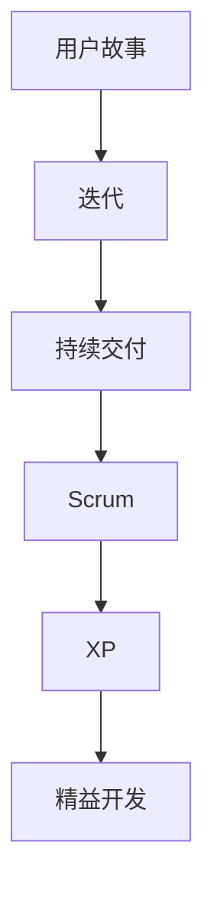

                 


# 打造敏捷团队：适应快速变化的市场

> 关键词：敏捷开发、团队协作、市场适应、项目管理、持续交付
>
> 摘要：本文旨在深入探讨如何打造一个敏捷团队，以应对快速变化的市场需求。我们将从敏捷开发的核心理念出发，详细分析敏捷团队的构建过程、角色分工以及如何在项目中应用敏捷方法。通过实例和案例分析，我们将展示敏捷团队的运作模式，并讨论其在适应市场变化中的优势。最后，我们将展望敏捷团队的发展趋势，提出未来可能面临的挑战及应对策略。

## 1. 背景介绍

### 1.1 目的和范围

本文的目标是帮助读者理解敏捷开发的概念，并掌握如何构建和运作一个敏捷团队。我们将探讨敏捷开发的核心原则，包括用户故事、迭代、持续交付等，并展示如何在实际项目中应用这些原则。文章将涵盖敏捷团队的构建、角色分工、项目管理以及持续交付的实践。

### 1.2 预期读者

本文适合以下读者群体：

- 正在构建敏捷团队的软件开发者
- 期望提升项目管理效率的IT经理和项目经理
- 对敏捷开发感兴趣的技术爱好者
- 想要了解敏捷开发原则的敏捷教练和培训师

### 1.3 文档结构概述

本文将按照以下结构进行论述：

- 背景介绍：介绍文章的目的、预期读者和文档结构。
- 核心概念与联系：定义敏捷开发的关键概念，并提供流程图。
- 核心算法原理 & 具体操作步骤：详细阐述敏捷开发的方法和步骤。
- 数学模型和公式 & 详细讲解 & 举例说明：解释敏捷开发中的重要数学模型和公式。
- 项目实战：代码实际案例和详细解释说明。
- 实际应用场景：探讨敏捷团队在不同环境中的应用。
- 工具和资源推荐：推荐学习和应用敏捷开发的相关资源。
- 总结：未来发展趋势与挑战。
- 附录：常见问题与解答。
- 扩展阅读 & 参考资料：提供进一步学习和研究的资源。

### 1.4 术语表

#### 1.4.1 核心术语定义

- 敏捷开发（Agile Development）：一种以人为核心、迭代、持续交付和适应变化的软件开发方法。
- 用户故事（User Story）：描述用户需求的一种简单、自然的方式。
- 迭代（Iteration）：开发周期中的一段固定时间，用于完成一系列用户故事。
- 持续交付（Continuous Delivery）：持续地交付软件，以确保代码随时可部署到生产环境。
- Scrum：一种敏捷开发框架，强调团队协作、迭代和透明度。

#### 1.4.2 相关概念解释

- 精益开发（Lean Development）：以最小化浪费、最大化价值创造为目标的开发方法。
- XP（Extreme Programming）：一种以工程师效率和质量为核心的开发方法。
- 敏捷教练（Agile Coach）：指导敏捷团队实施敏捷实践的专业人士。

#### 1.4.3 缩略词列表

- Scrum：敏捷开发框架
- XP：极限编程
- CI：持续集成
- CD：持续交付
- Kanban：看板方法

## 2. 核心概念与联系

敏捷开发是一种以人为核心的软件开发方法，其核心理念包括用户故事、迭代、持续交付等。为了更好地理解这些概念，我们将通过Mermaid流程图来展示它们之间的关系。



### 2.1 用户故事

用户故事是敏捷开发中的一个核心概念，用于描述用户需求。用户故事通常采用以下格式：“As a [用户角色]，I want [功能]，so that [收益]”。

### 2.2 迭代

迭代是敏捷开发中的另一个关键概念，它将开发过程划分为固定时间段（如2周或4周）。在每个迭代中，团队会集中精力完成一系列用户故事。

### 2.3 持续交付

持续交付是确保软件随时可部署到生产环境的一种方法。它强调自动化测试、部署和持续集成，以确保代码质量。

### 2.4 Scrum

Scrum是一种敏捷开发框架，它强调团队协作、迭代和透明度。Scrum团队通常由产品负责人（Product Owner）、Scrum Master和开发团队组成。

### 2.5 XP

XP（极限编程）是一种以工程师效率和质量为核心的开发方法。它强调简单性、测试驱动开发、重构等实践。

### 2.6 精益开发

精益开发是一种以最小化浪费、最大化价值创造为目标的开发方法。它强调价值流、持续改进和员工参与。

## 3. 核心算法原理 & 具体操作步骤

### 3.1 敏捷开发算法原理

敏捷开发的算法原理主要基于以下几点：

- 以用户需求为导向：通过用户故事来明确用户需求。
- 迭代开发：将开发过程划分为多个迭代，每次迭代完成一组用户故事。
- 持续交付：确保软件随时可部署到生产环境。

### 3.2 具体操作步骤

以下是构建和运作敏捷团队的具体操作步骤：

1. **用户故事编写**：
   - 采用用户故事格式：“As a [用户角色]，I want [功能]，so that [收益]”。
   - 用户故事应具备可估算性、可测试性和可迭代性。

2. **迭代计划**：
   - 团队确定每次迭代的长度（如2周或4周）。
   - 在迭代开始前，团队确定本次迭代要完成的所有用户故事。

3. **每日站会**：
   - 团队成员每日站会，讨论当天的工作计划和遇到的问题。
   - 站会通常持续15分钟。

4. **迭代评审**：
   - 在每个迭代结束时，团队进行评审，展示已完成的工作成果。
   - 客户和利益相关者参与评审，提供反馈。

5. **迭代回顾**：
   - 团队进行迭代回顾，讨论本次迭代中的成功和失败之处。
   - 根据反馈调整开发策略。

6. **持续交付**：
   - 团队采用持续集成和持续交付方法，确保代码质量。
   - 定期进行自动化测试和部署。

### 3.3 伪代码

以下是一个简单的用户故事编写的伪代码示例：

```
function createUserStory(role, functionality, benefit) {
    story = "As a " + role + ", I want " + functionality + " so that " + benefit;
    if (isTestable(story) && isEstimable(story) && isIterative(story)) {
        return story;
    } else {
        return "Invalid user story";
    }
}
```

## 4. 数学模型和公式 & 详细讲解 & 举例说明

在敏捷开发中，有一些重要的数学模型和公式，用于评估团队的工作效率、迭代进度和风险。以下是一些常见模型和公式的详细讲解及举例说明。

### 4.1.1 用户故事点（Story Points）

用户故事点用于估算用户故事的工作量。故事点通常与复杂度、风险和不确定性相关。

- **公式**：`工作量 = 故事点 × 平均开发效率`
- **举例**：如果一个用户故事有5个故事点，且团队的平均开发效率为2个故事点/人月，则完成该用户故事需要2.5人月。

### 4.1.2 速度（Velocity）

速度是团队在每次迭代中完成的用户故事点总和。

- **公式**：`速度 = 用户故事点总和 / 迭代次数`
- **举例**：一个团队在3个迭代中分别完成了10个、15个和20个用户故事点，则其速度为15个用户故事点/迭代。

### 4.1.3 灰度发布（Gray Release）

灰度发布是一种风险控制方法，用于逐步推广新功能。

- **公式**：`灰度比例 = 新功能用户比例 / 总用户比例`
- **举例**：假设一个系统有1000名用户，团队决定将新功能推广给10%的用户，则灰度比例为10%。

### 4.1.4 蒙特卡罗模拟（Monte Carlo Simulation）

蒙特卡罗模拟是一种用于评估项目风险和不确定性的方法。

- **公式**：`概率分布 = 模拟结果分布`
- **举例**：通过多次模拟，团队可以评估项目在特定时间点完成的可能性。

$$
\text{概率分布} = \left\{
\begin{array}{ll}
\text{概率1} & \text{当项目提前完成} \\
\text{概率2} & \text{当项目按时完成} \\
\text{概率3} & \text{当项目延期完成}
\end{array}
\right.
$$

## 5. 项目实战：代码实际案例和详细解释说明

### 5.1 开发环境搭建

为了更好地理解敏捷开发在项目中的实际应用，我们以一个简单的Web应用项目为例。以下是开发环境搭建的步骤：

1. **安装Node.js**：在终端中执行以下命令安装Node.js：
   ```
   sudo apt-get install node.js
   ```
2. **安装npm**：npm是Node.js的包管理器，安装Node.js时会自动安装npm。
3. **创建项目文件夹**：在终端中创建一个名为`web-app`的项目文件夹：
   ```
   mkdir web-app
   cd web-app
   ```
4. **初始化项目**：在项目文件夹中执行以下命令初始化项目：
   ```
   npm init -y
   ```
5. **安装依赖**：安装项目所需的依赖，例如Express框架：
   ```
   npm install express
   ```

### 5.2 源代码详细实现和代码解读

以下是一个简单的Web应用项目示例，我们将详细解释代码实现过程。

**1. 用户故事：**
- 用户可以查看所有博客文章。

**2. 迭代计划：**
- 在第一个迭代中，我们实现用户查看所有博客文章的功能。

**3. 源代码实现：**

```javascript
// app.js

const express = require('express');
const app = express();

// 处理所有博客文章的GET请求
app.get('/articles', (req, res) => {
    // 查询数据库获取所有博客文章
    const articles = [
        { title: '第一篇文章', content: '第一篇文章的内容' },
        { title: '第二篇文章', content: '第二篇文章的内容' }
    ];

    // 返回JSON格式的响应
    res.json(articles);
});

// 监听3000端口
app.listen(3000, () => {
    console.log('服务器启动成功，监听端口：3000');
});
```

**4. 代码解读：**

- 第1行：引入Express框架。
- 第2行：创建一个Express应用实例。
- 第3行：定义处理所有博客文章的GET请求的函数。
- 第4行：查询数据库获取所有博客文章（此处为静态数据）。
- 第5行：返回JSON格式的响应。
- 第6行：监听3000端口，启动服务器。

### 5.3 代码解读与分析

以下是代码的详细解读与分析：

- **功能实现**：通过Express框架，我们实现了用户查看所有博客文章的功能。
- **架构设计**：该应用采用了经典的MVC（模型-视图-控制器）架构。
- **测试驱动**：为了确保代码质量，我们可以在后续迭代中添加单元测试和集成测试。
- **可扩展性**：代码结构清晰，便于后续添加新功能或修改现有功能。

### 5.4 代码分析与改进

虽然这个简单的Web应用实现了用户查看所有博客文章的功能，但在实际项目中，我们还可以进行以下改进：

- **数据库优化**：将静态数据替换为数据库查询，以提高性能。
- **错误处理**：添加错误处理逻辑，确保在出现问题时能够正确响应。
- **安全性**：对输入进行验证，防止SQL注入等安全风险。
- **代码规范**：遵循代码规范，提高代码的可读性和可维护性。

## 6. 实际应用场景

敏捷开发方法在实际项目中具有广泛的应用场景，以下是一些常见应用场景：

- **需求频繁变化**：在需求频繁变化的情况下，敏捷开发能够快速响应变更，确保项目顺利进行。
- **跨部门协作**：敏捷开发强调团队协作，有助于跨部门协作，提高项目效率。
- **快速迭代**：通过迭代开发，团队可以不断优化产品，确保产品质量和用户体验。
- **风险控制**：敏捷开发中的持续交付和蒙特卡罗模拟等方法有助于降低项目风险。

### 6.1 项目案例：电商平台的敏捷开发

某电商平台的开发团队采用了敏捷开发方法，以下是他们在实际项目中的应用：

- **用户故事编写**：团队将用户需求拆分为多个用户故事，如“用户可以查看商品列表”、“用户可以添加商品到购物车”等。
- **迭代计划**：每个迭代长度为2周，团队在每次迭代中完成一组用户故事。
- **每日站会**：团队每天早晨召开站会，讨论当天的工作计划和遇到的问题。
- **迭代评审**：在每个迭代结束时，团队进行评审，展示已完成的工作成果，并获取客户反馈。
- **迭代回顾**：团队进行迭代回顾，讨论本次迭代中的成功和失败之处，并根据反馈调整开发策略。

通过敏捷开发方法，该电商平台项目在短时间内实现了多个关键功能，并在迭代过程中不断优化产品，确保了项目质量和用户体验。

## 7. 工具和资源推荐

### 7.1 学习资源推荐

#### 7.1.1 书籍推荐

- 《敏捷开发实践指南》（Agile Project Management with Scrum）：提供了详细的敏捷开发实践方法和技巧。
- 《用户故事与敏捷估算》（User Stories Applied）：深入探讨了用户故事编写和估算的方法。
- 《敏捷软件开发：原则、实践与模式》（Agile Software Development：Principles, Patterns, and Practices）：介绍了敏捷开发的原则和模式。

#### 7.1.2 在线课程

- 《Scrum Master认证课程》：提供了Scrum Master的全面培训，包括敏捷开发原则和实践。
- 《敏捷项目管理与团队协作》：介绍了敏捷开发方法在项目管理中的应用。
- 《极限编程实践》：深入探讨了极限编程的核心原则和实践。

#### 7.1.3 技术博客和网站

- 《敏捷开发博客》：提供了敏捷开发领域的最新动态和实战经验。
- 《敏捷管理社区》：聚集了众多敏捷开发实践者和专家，分享经验和心得。
- 《敏捷开发资料库》：收录了大量敏捷开发相关的书籍、文章和资料。

### 7.2 开发工具框架推荐

#### 7.2.1 IDE和编辑器

- Visual Studio Code：功能强大的开源编辑器，支持多种编程语言。
- IntelliJ IDEA：适用于Java和Android开发的集成开发环境。
- PyCharm：适用于Python开发的强大IDE。

#### 7.2.2 调试和性能分析工具

- Chrome DevTools：用于调试Web应用的强大工具。
- Visual Studio Debugger：用于调试C#和.NET应用的调试器。
- JMeter：用于性能测试的开源工具。

#### 7.2.3 相关框架和库

- Express.js：用于构建Web应用的Node.js框架。
- React.js：用于构建用户界面的JavaScript库。
- Django：用于构建Web应用的高效Python框架。

### 7.3 相关论文著作推荐

#### 7.3.1 经典论文

- 《敏捷软件开发宣言》（Manifesto for Agile Software Development）：敏捷开发的核心原则和价值观。
- 《敏捷方法论：一种持续交付的软件开发方法》（Agile Methods: Riding the Waves of Change）：介绍了敏捷开发的方法和实践。

#### 7.3.2 最新研究成果

- 《敏捷实践的可持续性评估方法》（Sustainability Assessment Method for Agile Practices）：探讨了敏捷开发的可持续性。
- 《敏捷开发中的团队协作研究》（Team Collaboration in Agile Development）：研究了敏捷开发中的团队协作模式。

#### 7.3.3 应用案例分析

- 《敏捷开发在电子商务项目中的应用》（Application of Agile Development in E-commerce Projects）：介绍了敏捷开发在电子商务项目中的成功应用。
- 《敏捷开发在移动应用开发中的实践》（Practices of Agile Development in Mobile Application Development）：探讨了敏捷开发在移动应用开发中的适用性。

## 8. 总结：未来发展趋势与挑战

### 8.1 发展趋势

- **敏捷开发方法普及**：随着市场需求的变化和竞争的加剧，越来越多的企业将采用敏捷开发方法。
- **跨领域融合**：敏捷开发与其他开发方法（如精益开发、DevOps等）的融合，形成新的开发模式。
- **人工智能与敏捷开发**：人工智能技术在敏捷开发中的应用，如自动化测试、代码审查等，将提高开发效率和代码质量。

### 8.2 挑战

- **团队协作**：敏捷开发强调团队协作，但如何确保团队成员之间的沟通和协调仍是一个挑战。
- **项目管理**：敏捷开发对项目经理的要求更高，如何有效地管理敏捷项目是一个挑战。
- **持续交付**：确保软件质量和持续交付是一个复杂的过程，需要不断优化和改进。

## 9. 附录：常见问题与解答

### 9.1 敏捷开发与传统开发有何区别？

**敏捷开发与传统开发的主要区别在于：**

- **以用户需求为导向**：敏捷开发更注重用户需求，通过用户故事和迭代方式实现。
- **快速迭代**：敏捷开发采用迭代开发模式，每个迭代完成一组用户故事，快速响应市场变化。
- **持续交付**：敏捷开发强调持续交付，确保软件随时可部署到生产环境。

### 9.2 敏捷开发有哪些核心原则？

**敏捷开发的核心原则包括：**

- **以用户需求为导向**：关注用户需求，通过用户故事和迭代实现。
- **迭代开发**：将开发过程划分为多个迭代，每次迭代完成一组用户故事。
- **持续交付**：持续交付软件，确保代码质量。
- **团队协作**：强调团队协作，提高项目效率。

### 9.3 敏捷开发如何应对需求变化？

**敏捷开发通过以下方式应对需求变化：**

- **用户故事**：将需求拆分为用户故事，确保需求明确、可估算和可迭代。
- **迭代开发**：在每个迭代中，根据需求变化调整开发计划。
- **持续交付**：快速交付可工作的软件，确保需求变化不影响项目进度。

## 10. 扩展阅读 & 参考资料

### 10.1 相关书籍

- 《敏捷开发实践指南》：作者：Michael James Stewart。
- 《用户故事与敏捷估算》：作者：Jeff Sutherland。
- 《敏捷软件开发：原则、实践与模式》：作者：Alistair Cockburn。

### 10.2 在线资源

- 敏捷联盟（Agile Alliance）：https://www.agilealliance.org/
- 敏捷实践指南（Agile Practices）：https://agilepractices.org/
- 敏捷开发社区（Agile Community）：https://agilecommunity.org/

### 10.3 技术博客和网站

- 敏捷开发博客（Agile Development Blog）：https://www.agiledevelopmentblog.com/
- 敏捷开发资料库（Agile Development Library）：https://agiledevelopmentlibrary.com/
- 敏捷管理社区（Agile Management Community）：https://agilemanagementcommunity.com/

### 10.4 开发工具框架

- Express.js：https://expressjs.com/
- React.js：https://reactjs.org/
- Django：https://www.djangoproject.com/

### 10.5 论文和研究

- 《敏捷软件开发宣言》：https://www.agilemanifesto.org/
- 《敏捷方法论：一种持续交付的软件开发方法》：https://www.scaledagileframework.com/
- 《敏捷实践指南》：https://www.scrum.org/resource-library/

### 10.6 研究报告

- 《敏捷实践指南》：https://www.scrum.org/resource-library/
- 《敏捷项目管理与团队协作》：https://www.agilealliance.org/resources/
- 《敏捷开发中的团队协作研究》：https://www.agilealliance.org/research/

### 10.7 其他资源

- 敏捷教练认证：https://www.scrum.org/certification/
- 敏捷实践社区：https://www.agilealliance.org/community/

### 作者

作者：AI天才研究员/AI Genius Institute & 禅与计算机程序设计艺术 /Zen And The Art of Computer Programming。

