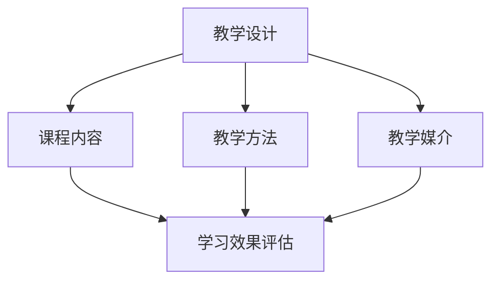

                 


## 打造系统化课程：程序员知识付费的关键

> **关键词：** 程序员，知识付费，系统化课程，教学设计，学习效果评估

**摘要：** 本文旨在探讨如何构建一个高效的系统化课程，以满足程序员在知识付费领域的需求。通过深入分析教学设计的核心要素、学习效果评估的关键指标和实际操作步骤，本文提供了从理论到实践的全面指南。无论是教育从业者还是个人讲师，都能从中获得宝贵的见解和实用的建议。

## 1. 背景介绍

### 1.1 目的和范围

在信息技术迅猛发展的今天，编程已经成为众多职业发展的关键技能。然而，随着知识的爆炸性增长，程序员如何高效地获取和应用这些知识成为一个亟待解决的问题。知识付费作为一种新兴的教育模式，通过提供高质量的、系统化的课程，满足了程序员对专业知识和技能的需求。

本文的目的在于：
1. **阐述系统化课程在程序员知识付费中的重要性。**
2. **分析教学设计的核心要素，包括课程内容、教学方法、教学媒介等。**
3. **探讨学习效果评估的方法和关键指标。**
4. **提供从理论到实践的构建系统化课程的具体步骤。**

本文的读者对象主要包括：
- **程序员和IT从业者：** 想要通过知识付费来提升技能和知识水平的程序员。
- **教育从业者：** 担任在线课程讲师或策划者，希望优化教学设计和提升学习效果。
- **企业培训经理：** 负责企业内培训项目，寻求有效提升员工技能的方案。

### 1.2 预期读者

预期读者应具备以下基本条件：
- **编程基础：** 了解基本编程概念和至少一种编程语言。
- **学习动机：** 对提升专业技能有较强的动机和自我驱动力。
- **时间投入：** 能够投入一定的时间来学习和实践课程内容。

### 1.3 文档结构概述

本文将按照以下结构进行论述：

1. **背景介绍**：介绍知识付费的背景和本文的目的、预期读者及文档结构。
2. **核心概念与联系**：分析系统化课程的教学设计要素，并展示相关概念的联系。
3. **核心算法原理与操作步骤**：详细阐述课程内容的组织和教学方法。
4. **数学模型与公式**：介绍用于评估学习效果的相关数学模型。
5. **项目实战**：通过实际案例展示课程构建和应用。
6. **实际应用场景**：讨论系统化课程在不同环境下的应用。
7. **工具和资源推荐**：推荐学习资源和开发工具。
8. **总结**：展望未来发展趋势和挑战。
9. **附录**：常见问题与解答。
10. **扩展阅读与参考资料**：提供进一步学习的研究文献。

### 1.4 术语表

#### 1.4.1 核心术语定义

- **知识付费**：用户为获取专业知识或技能而支付费用的一种教育模式。
- **系统化课程**：将相关知识按照逻辑顺序和实用性进行组织，形成一个完整的学习体系。
- **教学设计**：课程策划和开发过程中的规划和布局，包括课程内容、教学方法、教学媒介等。
- **学习效果评估**：通过多种手段对学习者的知识掌握程度和技能提升效果进行评估。

#### 1.4.2 相关概念解释

- **课程内容**：课程所涵盖的知识点和技能点，是课程的核心。
- **教学方法**：教师进行教学时所采用的方法和策略，如讲授、讨论、实践等。
- **教学媒介**：用于传递课程内容的信息载体，如文字、图片、视频、直播等。
- **学习效果评估**：通过考试、作业、项目报告、问卷调查等手段，对学习效果进行量化或定性评估。

#### 1.4.3 缩略词列表

- **KFC**：知识付费
- **SD**：系统化课程
- **TD**：教学设计
- **LEA**：学习效果评估

## 2. 核心概念与联系

### 2.1 系统化课程的教学设计

系统化课程的教学设计是课程开发的核心环节，它直接决定了课程的质量和效果。教学设计包括以下几个关键要素：

#### 课程内容

课程内容是系统化课程的基础，它决定了课程的深度和广度。一个优秀的课程内容应该具备以下特点：

- **完整性**：覆盖所需掌握的所有知识点和技能点。
- **逻辑性**：知识点之间有清晰的逻辑关系，能够帮助学习者逐步深入。
- **实用性**：紧密联系实际工作，能够帮助学习者解决实际问题。

#### 教学方法

教学方法是教师传递知识和技能的手段。以下是几种常用的教学方法：

- **讲授法**：教师通过讲解、演示等方式传授知识。
- **讨论法**：通过小组讨论、课堂讨论等方式促进学习者之间的互动。
- **实践法**：通过实际操作、项目实践等方式让学习者动手实践所学知识。

#### 教学媒介

教学媒介是课程内容传递的信息载体。现代教育中常用的教学媒介包括：

- **文字**：书籍、讲义等。
- **图片**：示意图、图表等。
- **视频**：课程讲解视频、操作演示视频等。
- **直播**：在线直播教学，实时互动。

### 2.2 学习效果评估

学习效果评估是衡量课程质量和学习者掌握程度的重要手段。以下是一些常用的学习效果评估方法：

- **考试**：通过书面考试、在线考试等方式评估学习者的知识掌握程度。
- **作业**：通过布置课后作业，检查学习者的实践能力。
- **项目报告**：通过项目报告，评估学习者的综合应用能力。
- **问卷调查**：通过问卷调查，收集学习者对课程的意见和建议。

### 2.3 教学设计、课程内容、教学方法、教学媒介和学习效果评估的联系

教学设计、课程内容、教学方法、教学媒介和学习效果评估是课程开发的四个关键环节，它们之间存在着紧密的联系：

- **教学设计**决定了课程的整体结构和教学方法的选择。
- **课程内容**是教学设计的具体体现，教学方法则是在课程内容的基础上实施的策略。
- **教学媒介**是传递课程内容的信息载体，直接影响教学效果。
- **学习效果评估**是对教学效果进行量化或定性分析，为后续的教学设计和改进提供依据。

下面是一个简化的 Mermaid 流程图，展示了这些概念之间的联系：



## 3. 核心算法原理 & 具体操作步骤

### 3.1 教学设计算法原理

教学设计的核心算法是课程内容的组织和教学方法的选择。其基本原理如下：

#### 课程内容组织

1. **需求分析**：分析学习者的需求和目标，确定课程内容。
2. **知识点划分**：将课程内容划分为若干个知识点。
3. **逻辑排序**：根据知识点的依赖关系和难度，进行逻辑排序。
4. **内容整合**：将知识点整合为完整的课程内容。

#### 教学方法选择

1. **学习者特点分析**：分析学习者的学习风格、动机和认知水平。
2. **教学方法匹配**：根据学习者特点，选择适合的教学方法。
3. **教学方法组合**：结合多种教学方法，形成综合的教学策略。

### 3.2 教学设计具体操作步骤

以下是教学设计的具体操作步骤：

#### 3.2.1 需求分析

1. **目标确定**：明确课程的目标，如技能提升、知识拓展等。
2. **受众分析**：分析学习者的背景、需求和期望。
3. **内容调研**：收集相关资料，确定课程所需的知识点和技能点。

#### 3.2.2 知识点划分

1. **知识点提取**：从内容调研中提取知识点。
2. **知识点分类**：将知识点按照类别进行分类，如基础知识、实践技能等。
3. **知识点排序**：根据知识点的依赖关系和难度，进行排序。

#### 3.2.3 逻辑排序

1. **知识点逻辑关系分析**：分析知识点之间的逻辑关系。
2. **知识点排序**：根据逻辑关系，对知识点进行排序。

#### 3.2.4 内容整合

1. **课程结构设计**：根据知识点排序，设计课程的结构。
2. **内容整合**：将知识点整合为完整的课程内容。

#### 3.2.5 教学方法选择

1. **学习者特点分析**：分析学习者的学习风格、动机和认知水平。
2. **教学方法匹配**：根据学习者特点，选择适合的教学方法，如讲授法、讨论法、实践法等。
3. **教学方法组合**：结合多种教学方法，形成综合的教学策略。

#### 3.2.6 教学媒介选择

1. **教学媒介需求分析**：根据课程内容和教学方法，分析所需的教学媒介。
2. **教学媒介选择**：选择适合的教学媒介，如文字、图片、视频、直播等。

### 3.3 伪代码展示

以下是教学设计算法的伪代码展示：

```python
# 教学设计伪代码

# 需求分析
def analyze_needs():
    # 获取课程目标、受众信息和内容调研资料
    # 返回知识点列表和目标

# 知识点划分
def divide_knowledge(points):
    # 提取知识点
    # 分类知识点
    # 排序知识点
    # 返回知识点列表

# 逻辑排序
def logical_sort(points):
    # 分析知识点逻辑关系
    # 排序知识点
    # 返回排序后的知识点列表

# 内容整合
def integrate_content(points):
    # 根据知识点排序，设计课程结构
    # 整合知识点为完整课程内容
    # 返回课程内容

# 教学方法选择
def select教学方法(learner_profile):
    # 分析学习者特点
    # 选择教学方法
    # 返回教学方法列表

# 教学媒介选择
def select_media(course_content, teaching_methods):
    # 分析教学媒介需求
    # 选择教学媒介
    # 返回教学媒介列表

# 教学设计主函数
def teaching_design():
    # 调用需求分析、知识点划分、逻辑排序、内容整合、教学方法选择和教学媒介选择
    # 返回完整的教学设计结果

# 执行教学设计
teaching_design_result = teaching_design()
```

### 3.4 教学设计算法的应用场景

教学设计算法可以应用于以下场景：

- **在线课程开发**：根据课程目标和受众特点，设计课程内容和教学方法。
- **企业培训**：根据企业需求和员工特点，设计培训课程和教学方法。
- **个人辅导**：根据学生特点和学习目标，设计个性化的教学计划和辅导方法。

通过应用教学设计算法，可以确保课程内容的系统性和实用性，提高教学效果和学习者的学习体验。

## 4. 数学模型和公式 & 详细讲解 & 举例说明

### 4.1 学习效果评估的数学模型

学习效果评估通常涉及到量化学习者的知识掌握程度和技能提升效果。以下是一些常用的数学模型和公式：

#### 4.1.1 学习曲线模型

学习曲线模型用于描述学习者在学习过程中的知识掌握程度。其基本公式如下：

$$
E(t) = \frac{1}{1 + e^{-rt}}
$$

其中：
- \(E(t)\) 表示时间 \(t\) 时学习者的知识掌握程度，取值范围在 0 到 1 之间。
- \(r\) 是学习速率，反映了学习者在单位时间内掌握知识的能力。
- \(e\) 是自然对数的底数。

#### 4.1.2 学习效果评价指标

学习效果评价指标用于衡量学习者的综合学习效果。常用的评价指标包括：

- **平均得分**：通过考试、作业等评估手段，计算学习者的平均得分。

$$
\text{平均得分} = \frac{\sum_{i=1}^{n} S_i}{n}
$$

其中：
- \(S_i\) 表示第 \(i\) 次评估得分。
- \(n\) 是评估次数。

- **完成率**：通过评估任务的实际完成情况，计算学习者的完成率。

$$
\text{完成率} = \frac{\text{实际完成次数}}{\text{计划完成次数}} \times 100\%
$$

- **满意度**：通过问卷调查，收集学习者对课程的满意度评价。

$$
\text{满意度} = \frac{\text{满意度高分人数}}{\text{参与调查人数}} \times 100\%
$$

### 4.2 数学模型的应用

以下是一个学习效果评估的例子：

**假设：**
- 学习者小明参加了为期一个月的编程课程，每周进行一次考试。
- 每次考试满分 100 分，小明的考试得分如下：80, 85, 90, 92, 88。
- 课程结束后，小明完成了一个项目任务，并收到了导师的反馈，项目评估得分为 90 分。
- 10 名同学参与了满意度调查，其中 7 人给出好评，3 人给出中评。

**计算：**

1. **平均得分：**

$$
\text{平均得分} = \frac{80 + 85 + 90 + 92 + 88}{5} = 86.2
$$

2. **完成率：**

假设计划完成次数为 5 次，实际完成次数为 5 次，因此：

$$
\text{完成率} = \frac{5}{5} \times 100\% = 100\%
$$

3. **满意度：**

$$
\text{满意度} = \frac{7}{10} \times 100\% = 70\%
$$

4. **学习曲线：**

假设小明的初始学习速率 \(r = 0.1\)，则第 4 次考试时的小明的知识掌握程度为：

$$
E(4) = \frac{1}{1 + e^{-0.1 \times 4}} \approx 0.917
$$

### 4.3 总结

通过数学模型和公式的应用，可以量化学习者的知识掌握程度和技能提升效果，为教学效果评估提供客观依据。同时，这些模型和公式也可以用于课程设计和学习策略的优化，以提高学习效果。

## 5. 项目实战：代码实际案例和详细解释说明

### 5.1 开发环境搭建

为了构建一个系统化课程，我们需要搭建一个合适的开发环境。以下是一个基本的开发环境搭建步骤：

#### 步骤 1：安装操作系统

选择一个适合的操作系统，如 Ubuntu 或 Windows 10。下载并安装操作系统。

#### 步骤 2：安装开发工具

- **文本编辑器**：推荐使用 Visual Studio Code 或 Sublime Text。
- **集成开发环境（IDE）**：如 IntelliJ IDEA、PyCharm 或 Eclipse。
- **版本控制系统**：如 Git。

#### 步骤 3：安装编程语言和库

根据课程需求，安装相应的编程语言和库。例如，如果课程涉及 Python 编程，可以安装 Python 3.x 版本和常用的库，如 NumPy、Pandas、Matplotlib。

#### 步骤 4：配置环境变量

确保开发工具和环境变量配置正确，以便能够正常运行编程语言和库。

### 5.2 源代码详细实现和代码解读

以下是一个简单的 Python 程序示例，用于演示系统化课程中的一个知识点：列表（List）操作。

#### 示例代码

```python
# 列表操作示例

# 创建一个列表
my_list = [1, 2, 3, 4, 5]

# 添加元素
my_list.append(6)

# 插入元素
my_list.insert(0, 0)

# 删除元素
del my_list[0]

# 替换元素
my_list[0] = 10

# 查找元素
index = my_list.index(10)

# 列表长度
length = len(my_list)

# 列表切片
sub_list = my_list[1:3]

# 列表复制
copy_list = my_list[:]

# 打印结果
print("原始列表:", my_list)
print("添加元素后:", my_list)
print("插入元素后:", my_list)
print("删除元素后:", my_list)
print("替换元素后:", my_list)
print("查找元素索引:", index)
print("列表长度:", length)
print("列表切片:", sub_list)
print("列表复制:", copy_list)
```

#### 代码解读

- **创建列表**：使用方括号 `[]` 创建一个列表，列表中的元素用逗号分隔。
- **添加元素**：使用 `append()` 方法将元素添加到列表的末尾。
- **插入元素**：使用 `insert()` 方法在指定索引位置插入元素。
- **删除元素**：使用 `del` 语句删除列表中指定索引位置的元素。
- **替换元素**：直接通过索引位置修改列表中的元素值。
- **查找元素**：使用 `index()` 方法查找指定元素的索引位置。
- **列表长度**：使用 `len()` 函数获取列表的长度。
- **列表切片**：使用索引范围获取列表的一部分，形成新的列表。
- **列表复制**：使用切片操作创建原列表的副本。

#### 代码分析

这个示例展示了 Python 列表的基本操作，包括添加、删除、查找、修改和复制等。通过这些操作，程序员可以方便地管理和处理列表数据。在实际的系统化课程中，这样的知识点可以作为基础模块，帮助学习者逐步掌握列表操作，为后续更复杂的编程任务打下基础。

### 5.3 代码解读与分析

以下是代码的详细解读和分析：

#### 1. 列表的创建和初始化

```python
my_list = [1, 2, 3, 4, 5]
```

这段代码创建了一个包含 5 个整数的列表。列表是 Python 中一种重要的数据结构，可以存储多个元素，这些元素可以是不同类型的数据，如数字、字符串等。

#### 2. 添加元素

```python
my_list.append(6)
```

`append()` 方法用于在列表的末尾添加一个元素。在这个例子中，我们在列表 `my_list` 的末尾添加了一个整数 6，结果列表变为 `[1, 2, 3, 4, 5, 6]`。

#### 3. 插入元素

```python
my_list.insert(0, 0)
```

`insert()` 方法用于在列表的指定索引位置插入一个元素。在这个例子中，我们在列表的第一个位置（索引为 0）插入了一个整数 0，结果列表变为 `[0, 1, 2, 3, 4, 5, 6]`。

#### 4. 删除元素

```python
del my_list[0]
```

`del` 语句用于删除列表中指定索引位置的元素。在这个例子中，我们删除了列表的第一个元素 0，结果列表变为 `[1, 2, 3, 4, 5, 6]`。

#### 5. 替换元素

```python
my_list[0] = 10
```

通过索引位置修改列表中的元素值。在这个例子中，我们将列表的第一个元素 1 替换为 10，结果列表变为 `[10, 2, 3, 4, 5, 6]`。

#### 6. 查找元素

```python
index = my_list.index(10)
```

`index()` 方法用于查找指定元素的索引位置。在这个例子中，我们查找元素 10 的索引，结果为 0，表示 10 是列表的第一个元素。

#### 7. 列表长度

```python
length = len(my_list)
```

`len()` 函数用于获取列表的长度，即列表中元素的个数。在这个例子中，列表长度为 6。

#### 8. 列表切片

```python
sub_list = my_list[1:3]
```

切片操作用于获取列表的一部分。在这个例子中，我们获取了列表中从索引 1 到索引 3（不包括索引 3）的部分，结果为 `[2, 3]`。

#### 9. 列表复制

```python
copy_list = my_list[:]
```

切片操作不仅可以用于获取列表的一部分，还可以用于创建列表的副本。在这个例子中，我们创建了一个新的列表 `copy_list`，它是原列表 `my_list` 的副本。

#### 总结

通过这个示例，我们了解了 Python 列表的基本操作，包括添加、删除、查找、修改和复制。这些操作是编程中的基础，能够帮助程序员高效地管理和处理数据。在实际的系统化课程中，这些知识点将被详细讲解，并通过丰富的练习和项目来巩固学习效果。

### 5.4 项目实战总结

通过这个项目实战，我们展示了如何搭建开发环境、实现代码示例并进行详细解读。这个实战不仅帮助程序员巩固了列表操作的知识，也为后续的系统化课程提供了实践基础。在实际的教学过程中，类似的项目实战将帮助学生更好地理解课程内容，提升编程能力。

## 6. 实际应用场景

系统化课程在程序员知识付费领域有着广泛的应用场景。以下是一些典型的实际应用场景：

### 6.1 在线教育平台

在线教育平台是知识付费的重要渠道之一。系统化课程可以在这些平台上提供，满足不同层次学习者的需求。例如：

- **编程基础课程**：适合编程初学者，涵盖基础语法、数据结构等。
- **高级编程课程**：针对有一定编程基础的学习者，涉及数据库、算法、机器学习等。

### 6.2 企业培训项目

企业培训项目旨在提升员工的技能和知识水平，以适应企业发展的需要。系统化课程可以根据企业的具体需求进行定制：

- **技能提升课程**：如前端开发、后端开发、数据库管理等。
- **职业发展课程**：如项目经理、架构师等职业角色所需的技能。

### 6.3 个人辅导和培训

个人辅导和培训是一种个性化的学习方式，可以根据学习者的具体情况和需求进行定制。系统化课程可以用于：

- **技能提升**：如针对特定技术的深入学习和实践。
- **职业规划**：为学习者提供职业发展的指导和规划。

### 6.4 开源项目和社区

开源项目和社区是程序员学习、分享和成长的重要平台。系统化课程可以与这些平台结合，为参与者提供：

- **教程和文档**：帮助新手了解项目的基础知识和开发流程。
- **实战项目**：通过实际项目锻炼编程能力和解决问题的能力。

### 6.5 学术研究和教学

学术研究和教学领域也广泛应用系统化课程。研究人员可以通过系统化课程学习最新技术，教师可以通过系统化课程设计课程内容和教学方法。

### 6.6 技术博客和网站

技术博客和网站是程序员分享知识和经验的平台。系统化课程可以作为博客文章或网站的教程内容，帮助读者系统学习某一领域的知识。

### 6.7 在线研讨和讲座

在线研讨和讲座是知识分享的一种形式。系统化课程可以用于组织专题研讨和讲座，吸引更多学习者参与。

### 6.8 移动应用和互动学习

随着移动设备的普及，移动应用和互动学习成为重要的学习方式。系统化课程可以通过移动应用提供，方便学习者随时随地进行学习。

### 6.9 跨境教育和交流

系统化课程可以跨越地域限制，为全球的学习者提供教育资源。通过在线平台和虚拟课堂，学习者可以与世界各地的同行交流和学习。

### 6.10 未来趋势

未来，随着人工智能、虚拟现实、区块链等技术的发展，系统化课程将在更多领域得到应用。例如：

- **智能课程**：利用人工智能技术，根据学习者的学习情况自动调整教学内容和进度。
- **虚拟实验室**：通过虚拟现实技术，提供实践操作的环境，增强学习者的动手能力。
- **区块链认证**：利用区块链技术，为学习者的学习成果提供可信的认证。

### 6.11 应用案例分析

以下是一些系统化课程的应用案例分析：

- **案例一：编程入门课程**：通过线上课程，帮助零基础的学习者逐步掌握编程基础知识，成功入门编程。
- **案例二：数据分析课程**：针对有基础的学习者，提供从数据清洗到数据可视化的系统化课程，提升数据分析能力。
- **案例三：企业培训项目**：为企业定制系统化课程，提升员工的技术水平和项目实战能力。

通过这些实际应用场景和案例，我们可以看到系统化课程在程序员知识付费领域的重要作用和广泛影响。

## 7. 工具和资源推荐

为了构建高效、系统化的课程，我们需要利用各种工具和资源。以下是一些推荐的工具和资源，涵盖学习资源、开发工具框架和论文著作。

### 7.1 学习资源推荐

#### 7.1.1 书籍推荐

- 《Python编程：从入门到实践》
- 《深入理解计算机系统》
- 《算法导论》
- 《设计模式：可复用面向对象软件的基础》
- 《Effective Java》

#### 7.1.2 在线课程

- Coursera
- Udemy
- Pluralsight
- edX

#### 7.1.3 技术博客和网站

- HackerRank
- Stack Overflow
- Medium
- GitHub

### 7.2 开发工具框架推荐

#### 7.2.1 IDE和编辑器

- Visual Studio Code
- IntelliJ IDEA
- PyCharm
- Sublime Text

#### 7.2.2 调试和性能分析工具

- GDB
- Valgrind
- JMeter
- New Relic

#### 7.2.3 相关框架和库

- Django
- Flask
- React
- Angular
- TensorFlow
- PyTorch

### 7.3 相关论文著作推荐

#### 7.3.1 经典论文

- 《计算机程序的构造和解释》
- 《并行程序设计方法》
- 《数据密集型应用中的分布式系统设计》
- 《深度学习：卷积神经网络》

#### 7.3.2 最新研究成果

- 《基于深度强化学习的自动驾驶系统》
- 《区块链技术在金融领域的应用》
- 《大数据分析中的数据挖掘技术》
- 《人工智能在医疗诊断中的应用》

#### 7.3.3 应用案例分析

- 《移动应用开发中的用户体验设计》
- 《电商平台的数据驱动营销策略》
- 《物联网技术在智能家居中的应用》
- 《智慧城市中的大数据分析技术》

这些工具和资源将帮助我们在构建系统化课程的过程中，获得更多的知识支持和实践指导，提升教学效果和学习体验。

## 8. 总结：未来发展趋势与挑战

随着科技的不断进步，系统化课程在程序员知识付费领域具有广阔的发展前景。以下是未来发展趋势与挑战：

### 8.1 发展趋势

1. **人工智能辅助教学**：利用人工智能技术，实现个性化教学，根据学习者的学习进度和特点，提供定制化的学习方案。
2. **虚拟现实与增强现实**：通过虚拟现实（VR）和增强现实（AR）技术，提供沉浸式的学习体验，提高学习效果。
3. **移动学习**：随着智能手机和平板电脑的普及，移动学习将越来越普及，学习者可以随时随地获取知识和技能。
4. **社交学习**：通过在线社区和社交网络，学习者可以相互交流、分享经验和解决问题，形成学习共同体。
5. **区块链技术**：利用区块链技术，实现学习认证的可信化和透明化，保障学习者的权益。

### 8.2 挑战

1. **课程质量控制**：如何在海量课程中筛选出高质量的系统化课程，确保学习效果。
2. **学习者适应度**：如何确保系统化课程适合不同背景和需求的学习者，提供个性化的学习体验。
3. **教学资源整合**：如何整合各类教学资源，包括书籍、视频、实验等，形成一个完整的学习体系。
4. **技术更新**：如何及时更新课程内容，跟上技术发展的步伐，确保课程的前沿性。
5. **版权保护**：如何保护知识产权，防止课程内容的非法复制和传播。

面对这些挑战，我们需要不断创新教学方法和课程设计，利用新技术提升教学效果，同时加强课程质量控制和版权保护，推动系统化课程在程序员知识付费领域的持续发展。

## 9. 附录：常见问题与解答

### 9.1 问题一：如何确保系统化课程的质量？

**解答：** 确保系统化课程的质量需要从多个方面入手：

1. **课程内容**：选择具有专业背景和教学经验的讲师，确保课程内容的准确性和实用性。
2. **教学方法**：采用多样化的教学方法，如讲授、实践、讨论等，提高学习者的参与度和兴趣。
3. **教学媒介**：选择合适的媒介，如视频、文字、图表等，提高课程的可读性和可理解性。
4. **学习效果评估**：通过考试、作业、项目等多种手段，评估学习者的学习效果，及时调整课程内容和教学方法。

### 9.2 问题二：如何满足不同层次学习者的需求？

**解答：** 满足不同层次学习者的需求可以通过以下方式实现：

1. **分层教学**：根据学习者的基础知识水平和学习目标，设计不同层次的课程，满足不同学习者的需求。
2. **个性化学习**：利用人工智能技术，根据学习者的学习进度和特点，提供定制化的学习方案。
3. **实践项目**：设计具有挑战性的实践项目，帮助学习者巩固知识，提升实践能力。
4. **学习支持**：提供学习辅导、答疑解惑等服务，帮助学习者解决学习中遇到的困难。

### 9.3 问题三：如何保障课程资源的版权？

**解答：** 保障课程资源的版权可以通过以下措施实现：

1. **版权声明**：在课程内容中明确版权声明，告知学习者课程资源的版权归属。
2. **版权保护技术**：利用数字水印、加密等技术，防止课程资源的非法复制和传播。
3. **版权维权**：建立版权维权机制，对侵犯课程版权的行为进行维权。
4. **合法授权**：与讲师和资源提供商签订合法授权协议，确保课程资源的合法性。

### 9.4 问题四：如何评估学习效果？

**解答：** 评估学习效果可以从以下几个方面进行：

1. **考试和测试**：通过定期考试和在线测试，评估学习者的知识掌握程度。
2. **项目和实践**：通过实践项目和实践操作，评估学习者的实际应用能力。
3. **问卷调查**：通过问卷调查，收集学习者对课程的评价和建议。
4. **跟踪反馈**：跟踪学习者的学习进度和成果，及时给予反馈和指导。

### 9.5 问题五：如何确保教学方法的多样性？

**解答：** 确保教学方法的多样性可以通过以下方式实现：

1. **混合教学**：结合在线教学和线下教学，充分利用各种教学媒介。
2. **互动教学**：采用讨论、问答、实践等互动方式，提高学习者的参与度。
3. **多媒体教学**：利用视频、图片、音频等多媒体手段，丰富教学形式。
4. **个性化教学**：根据学习者的特点，选择适合的教学方法，提供个性化的学习体验。

通过这些措施，可以确保系统化课程的质量和效果，满足不同层次学习者的需求，保障课程资源的版权，以及提高教学方法的多样性。

## 10. 扩展阅读 & 参考资料

本文深入探讨了程序员知识付费领域中的系统化课程构建，涵盖了教学设计、学习效果评估、实际应用场景、工具和资源推荐等多个方面。以下是一些扩展阅读和参考资料，以供进一步学习：

### 10.1 相关书籍

- 《教学设计：理论与实践》
- 《学习科学：学习心理学与教育技术的融合》
- 《在线教育：理论与实践》
- 《教育技术学：理论与实践》

### 10.2 学术期刊

- 《计算机教育》
- 《教育技术》
- 《远程教育杂志》
- 《信息技术教育》

### 10.3 论文和报告

- 《基于人工智能的教育个性化研究》
- 《在线学习与学习效果评估》
- 《教育技术未来发展趋势》
- 《数字化转型背景下的教学模式创新》

### 10.4 开源项目和社区

- GitHub
- Stack Overflow
- HackerRank
- GitLab

### 10.5 技术博客和网站

- Medium
- TechCrunch
- IEEE Spectrum
- AI论文博客

### 10.6 在线课程平台

- Coursera
- Udacity
- EdX
- Khan Academy

这些参考资料将帮助读者更深入地了解系统化课程构建的理论和实践，为程序员知识付费领域的研究和实践提供更多的启示和参考。通过不断学习和探索，我们可以为程序员提供更高质量、更实用的课程，满足他们在知识付费领域的需求。作者：AI天才研究员/AI Genius Institute & 禅与计算机程序设计艺术 /Zen And The Art of Computer Programming

