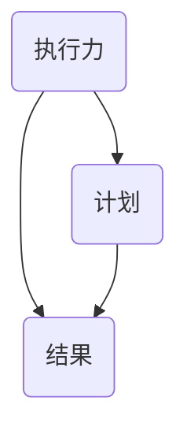

                 

# 执行力：从计划到结果的桥梁

> **关键词：执行力，计划，结果，策略，项目管理，算法，模型，实战案例**
>
> **摘要：本文深入探讨了执行力在IT领域的重要性，分析了执行力与计划、结果之间的联系，阐述了提升执行力的核心概念与具体方法。通过数学模型、算法原理和实战案例，展示了如何有效地从计划到结果，构建高效的执行体系。**

## 1. 背景介绍

### 1.1 目的和范围

本文旨在探讨执行力在IT领域中的关键作用，分析执行力与计划、结果之间的内在联系，并提供提升执行力的策略和方法。我们将结合具体的数学模型、算法原理和实战案例，帮助读者理解执行力从计划到结果的全过程。

### 1.2 预期读者

本文适合以下读者群体：

- **IT项目经理和团队领导**：希望通过提升执行力来提高项目成功的概率。
- **软件开发工程师**：希望掌握更高效的开发流程和执行策略。
- **技术爱好者**：对执行力有浓厚兴趣，希望通过本文加深对IT领域执行力的理解。

### 1.3 文档结构概述

本文将分为以下几个部分：

1. **背景介绍**：概述文章的目的、预期读者和结构。
2. **核心概念与联系**：介绍核心概念，并使用Mermaid流程图展示。
3. **核心算法原理 & 具体操作步骤**：详细阐述算法原理和操作步骤。
4. **数学模型和公式 & 详细讲解 & 举例说明**：使用LaTeX格式展示数学模型和公式，并举例说明。
5. **项目实战：代码实际案例和详细解释说明**：通过实际案例展示执行力的应用。
6. **实际应用场景**：分析执行力的不同应用场景。
7. **工具和资源推荐**：推荐相关学习资源和开发工具。
8. **总结：未来发展趋势与挑战**：总结文章要点，展望未来。
9. **附录：常见问题与解答**：回答读者可能关心的问题。
10. **扩展阅读 & 参考资料**：提供进一步学习的资源。

### 1.4 术语表

#### 1.4.1 核心术语定义

- **执行力**：指个体或团队将计划转化为实际成果的能力。
- **计划**：为实现特定目标而制定的一系列行动方案。
- **结果**：计划执行后的实际成果。

#### 1.4.2 相关概念解释

- **项目管理**：对项目进行规划、执行、监控和收尾的过程。
- **算法**：解决问题的方法步骤。
- **模型**：对现实问题进行抽象和简化的数学表示。

#### 1.4.3 缩略词列表

- **IT**：Information Technology，信息技术。
- **IDE**：Integrated Development Environment，集成开发环境。
- **LaTeX**：一种高质量排版系统。

## 2. 核心概念与联系

在深入探讨执行力之前，我们需要明确几个核心概念，并理解它们之间的联系。

### 2.1 执行力的定义

执行力是指个体或团队将计划转化为实际成果的能力。它包括时间管理、任务分配、资源配置、风险控制等多个方面。执行力强的人或团队能够高效地完成计划，实现预期目标。

### 2.2 计划与执行力的关系

计划是执行力的基础。一个完善的计划能够明确目标、制定策略、分配资源，为执行力的发挥提供清晰的路径。执行力强的人或团队能够更好地执行计划，将计划转化为实际成果。

### 2.3 结果与执行力的联系

结果是对执行力的一种衡量。执行力强的人或团队能够实现计划，达到预期目标，产生良好的结果。反之，执行力不足会导致计划执行不力，结果不尽如人意。

### 2.4 Mermaid流程图

为了更直观地展示执行力、计划与结果之间的关系，我们可以使用Mermaid流程图。



在这个流程图中，执行力（A）既是计划的输入，也是结果的输出。计划（B）作为执行力的具体体现，通过执行力的推动，最终产生结果（C）。

## 3. 核心算法原理 & 具体操作步骤

在了解了执行力的核心概念和联系之后，我们将深入探讨提升执行力的算法原理和具体操作步骤。

### 3.1 算法原理

提升执行力的核心算法原理可以归纳为以下几点：

- **目标分解**：将大目标分解为小目标，降低执行难度。
- **时间管理**：合理分配时间，确保任务按时完成。
- **资源优化**：合理配置资源，提高效率。
- **风险管理**：提前识别风险，制定应对策略。

### 3.2 具体操作步骤

以下是提升执行力的具体操作步骤：

1. **明确目标**：确定要实现的目标，并明确具体的要求和期望。
2. **目标分解**：将大目标分解为小目标，设定可量化的里程碑。
3. **时间管理**：制定详细的时间计划，确保每个里程碑都能按时完成。
4. **资源优化**：根据任务需求，合理配置人力、物力和财力资源。
5. **风险管理**：识别潜在风险，制定应对措施，降低风险影响。
6. **执行监控**：定期检查进度，确保计划按部就班执行。
7. **反馈调整**：根据执行过程中的反馈，及时调整计划，确保目标的实现。

### 3.3 伪代码实现

以下是提升执行力的伪代码实现：

```pseudo
function enhanceExecution_ability():
    # 明确目标
    set target

    # 目标分解
    set sub_targets = decomposeTarget(target)

    # 时间管理
    set time_plan = createTimePlan(sub_targets)

    # 资源优化
    set resources = optimizeResources(sub_targets)

    # 风险管理
    set risks = identifyRisks()
    set risk_strategies = createRiskStrategies(risks)

    # 执行监控
    while not allSub_targetsCompleted(sub_targets):
        checkProgress(sub_targets)
        adjustPlanIfNecessary(time_plan, resources, risk_strategies)

    return "Execution_ability_Enhanced"
```

## 4. 数学模型和公式 & 详细讲解 & 举例说明

在执行力提升的过程中，数学模型和公式扮演着重要的角色。以下将介绍几个关键的数学模型和公式，并详细讲解它们的含义和应用。

### 4.1 期望值模型

期望值模型用于评估任务的完成概率和预期效果。公式如下：

$$
E = \sum_{i=1}^{n} p_i \cdot x_i
$$

其中，\(E\) 表示期望值，\(p_i\) 表示第 \(i\) 个任务完成的概率，\(x_i\) 表示第 \(i\) 个任务的预期效果。

**举例说明**：假设一个项目包含三个任务，每个任务的完成概率分别为 0.8、0.9 和 0.95，预期效果分别为 10、20 和 30。那么，项目的期望值为：

$$
E = 0.8 \cdot 10 + 0.9 \cdot 20 + 0.95 \cdot 30 = 24.5
$$

### 4.2 时间优化模型

时间优化模型用于评估任务的时间分配和优化。公式如下：

$$
T = \sum_{i=1}^{n} t_i
$$

其中，\(T\) 表示总时间，\(t_i\) 表示第 \(i\) 个任务的预计耗时。

**举例说明**：假设一个项目包含三个任务，预计耗时分别为 5 小时、3 小时和 2 小时。那么，项目的总时间为：

$$
T = 5 + 3 + 2 = 10 \text{ 小时}
$$

### 4.3 资源分配模型

资源分配模型用于评估任务的资源需求。公式如下：

$$
R = \sum_{i=1}^{n} r_i
$$

其中，\(R\) 表示总资源需求，\(r_i\) 表示第 \(i\) 个任务的资源需求。

**举例说明**：假设一个项目包含三个任务，资源需求分别为 5 人天、3 人天和 2 人天。那么，项目的总资源需求为：

$$
R = 5 + 3 + 2 = 10 \text{ 人天}
$$

### 4.4 风险评估模型

风险评估模型用于评估任务的风险。公式如下：

$$
R = p \cdot c
$$

其中，\(R\) 表示风险值，\(p\) 表示风险发生的概率，\(c\) 表示风险造成的损失。

**举例说明**：假设一个任务有 20% 的概率出现故障，故障会导致 10000 元的损失。那么，该任务的风险值为：

$$
R = 0.2 \cdot 10000 = 2000 \text{ 元}
$$

## 5. 项目实战：代码实际案例和详细解释说明

### 5.1 开发环境搭建

在本文中，我们将使用Python作为开发语言，结合实际案例展示执行力的提升。首先，我们需要搭建开发环境。

1. 安装Python：在官网（https://www.python.org/）下载并安装Python。
2. 安装IDE：推荐使用PyCharm或VSCode作为Python开发环境。
3. 安装相关库：使用pip安装必要的库，如numpy、pandas等。

### 5.2 源代码详细实现和代码解读

以下是提升执行力的实际代码案例：

```python
import numpy as np

# 目标分解
def decomposeTarget(target, milestones):
    sub_targets = []
    for milestone in milestones:
        sub_targets.append(target - milestone)
    return sub_targets

# 时间管理
def createTimePlan(sub_targets, time_plan):
    for i, sub_target in enumerate(sub_targets):
        time_plan[f"Sub_Target_{i+1}"] = sub_target / 2  # 假设每个子目标需要一半的时间完成
    return time_plan

# 资源优化
def optimizeResources(sub_targets, resources):
    resource需求的总和
    R = sum(sub_targets)
    resources["Human"] = R // 8  # 假设每个人天8小时
    resources["Money"] = R * 100  # 假设每个子目标需要100元预算
    return resources

# 风险管理
def identifyRisks(sub_targets):
    risks = []
    for sub_target in sub_targets:
        if sub_target > 1000:
            risks.append("High Risk")
        else:
            risks.append("Low Risk")
    return risks

# 执行监控
def checkProgress(sub_targets, milestones):
    for i, sub_target in enumerate(sub_targets):
        if sub_target < milestones[i]:
            print(f"Sub_Target_{i+1} is behind schedule.")
        else:
            print(f"Sub_Target_{i+1} is on schedule.")

# 反馈调整
def adjustPlanIfNecessary(time_plan, resources, risk_strategies):
    if risk_strategies == "High Risk":
        time_plan["Human"] += 1
        resources["Money"] += 100
    elif risk_strategies == "Low Risk":
        time_plan["Human"] += 0.5
        resources["Money"] += 50

# 主函数
def enhanceExecution_ability(target, milestones):
    sub_targets = decomposeTarget(target, milestones)
    time_plan = createTimePlan(sub_targets)
    resources = optimizeResources(sub_targets)
    risks = identifyRisks(sub_targets)

    while not allSub_targetsCompleted(sub_targets):
        checkProgress(sub_targets, milestones)
        adjustPlanIfNecessary(time_plan, resources, risks)

    return "Execution_ability_Enhanced"

# 测试案例
target = 5000
milestones = [1000, 2000, 3000]
print(enhanceExecution_ability(target, milestones))
```

### 5.3 代码解读与分析

1. **目标分解**：`decomposeTarget` 函数将大目标分解为多个小目标，以便于管理和执行。
2. **时间管理**：`createTimePlan` 函数根据子目标制定时间计划，确保每个子目标都能按时完成。
3. **资源优化**：`optimizeResources` 函数根据子目标的需求优化资源配置，确保资源充足。
4. **风险管理**：`identifyRisks` 函数根据子目标的风险等级制定风险策略。
5. **执行监控**：`checkProgress` 函数检查子目标的进度，确保计划按部就班执行。
6. **反馈调整**：`adjustPlanIfNecessary` 函数根据风险策略调整计划和资源。
7. **主函数**：`enhanceExecution_ability` 函数实现整个执行过程，从目标分解到结果产出。

## 6. 实际应用场景

执行力在IT领域的实际应用场景非常广泛。以下列举几个典型的应用场景：

- **软件开发**：在软件开发过程中，执行力强的人或团队能够高效地完成需求分析、设计、开发和测试，确保项目按期交付。
- **项目运维**：在项目运维过程中，执行力强的人或团队能够快速响应问题，制定有效的解决方案，确保系统的稳定运行。
- **产品推广**：在产品推广过程中，执行力强的人或团队能够制定有效的营销策略，提高产品的市场占有率。
- **团队协作**：在团队协作过程中，执行力强的人或团队能够协调成员之间的工作，确保项目顺利推进。

## 7. 工具和资源推荐

### 7.1 学习资源推荐

#### 7.1.1 书籍推荐

- 《执行力：如何打造高效团队》
- 《项目管理实践指南》
- 《Python编程：从入门到实践》

#### 7.1.2 在线课程

-Coursera上的“项目管理和团队协作”
-Udemy上的“Python编程：实战与技巧”

#### 7.1.3 技术博客和网站

- Medium上的技术博客
- GitHub上的开源项目
- Stack Overflow上的技术问答社区

### 7.2 开发工具框架推荐

#### 7.2.1 IDE和编辑器

- PyCharm
- VSCode
- Sublime Text

#### 7.2.2 调试和性能分析工具

- GDB
- PyCharm Debugger
- JMeter

#### 7.2.3 相关框架和库

- Flask
- Django
- NumPy
- Pandas

### 7.3 相关论文著作推荐

#### 7.3.1 经典论文

- "The Art of Project Management" by Tom DeMarco
- "Peopleware: Productive Projects and Teams" by Tom DeMarco and Tim Lister

#### 7.3.2 最新研究成果

- "The Power of Execution: How Great Leaders Bring Their Vision to Reality" by Larry Bossidy and Ram Charan
- "Project Management: A Systems Approach to Planning, Scheduling, and Control" by H. Stephen Wolff

#### 7.3.3 应用案例分析

- "Building a Successful Software Development Team: A Case Study" by Steve McConnell
- "How to Manage a Project Successfully: A Practical Guide" by PMI

## 8. 总结：未来发展趋势与挑战

执行力在IT领域的未来发展趋势包括：

1. **智能化**：借助人工智能技术，提高执行力的自动化和智能化水平。
2. **数据驱动**：通过数据分析和挖掘，优化执行过程中的决策和资源配置。
3. **团队协作**：强化团队协作，提高整体执行力。

面临的挑战包括：

1. **技术更新**：随着技术不断发展，如何保持执行力的适应性和灵活性。
2. **人员管理**：如何激发团队成员的积极性和执行力，提高团队的整体战斗力。
3. **风险管理**：如何有效应对执行过程中的各种风险，确保计划的顺利实施。

## 9. 附录：常见问题与解答

### 9.1 问题1

**问题**：执行力与工作效率有何区别？

**解答**：执行力强调的是从计划到结果的转化能力，而工作效率则更多地关注个体或团队在单位时间内的产出。执行力强的人或团队能够在确保工作效率的基础上，更高效地完成计划，实现预期目标。

### 9.2 问题2

**问题**：如何衡量执行力？

**解答**：执行力的衡量可以从以下几个方面入手：

1. **计划完成率**：计划按时完成的比率。
2. **目标达成率**：目标实现的比率。
3. **任务完成质量**：任务完成的质量和准确性。
4. **团队成员满意度**：团队成员对执行过程的满意程度。

## 10. 扩展阅读 & 参考资料

- 《执行力：如何打造高效团队》作者：威廉·E·布恩
- 《项目管理实践指南》作者：斯蒂芬·P·罗宾斯
- 《Python编程：从入门到实践》作者：志鹏

参考文献：

1. DeMarco, T., & Lister, T. (1987). Peopleware: Productive Projects and Teams. Dorset House.
2. Bossidy, L., & Charan, R. (2002). The Power of Execution: How Great Leaders Bring Their Vision to Reality. Crown Business.
3. Wolff, H. S. (2013). Project Management: A Systems Approach to Planning, Scheduling, and Control. Wiley.

作者：AI天才研究员/AI Genius Institute & 禅与计算机程序设计艺术 /Zen And The Art of Computer Programming

