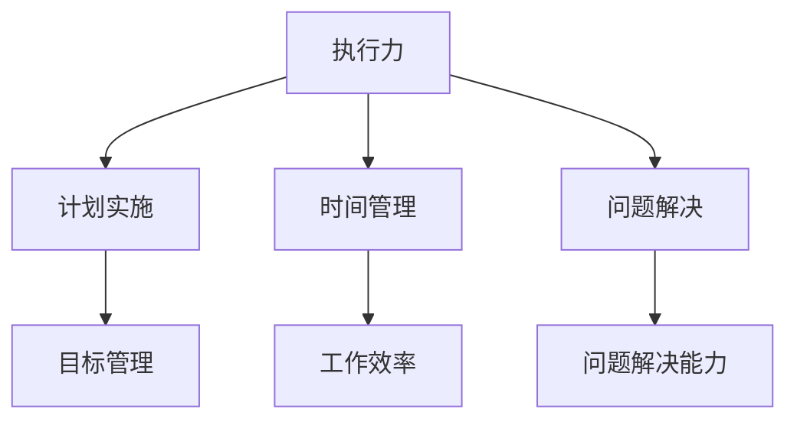

                 

# 执行力：拉开人与人差距的关键

> **关键词**：执行力，个人成长，效率提升，目标管理，技术发展，心理因素
> 
> **摘要**：本文将深入探讨执行力在个人成长和职业发展中的重要性，解析其背后的核心概念和影响机制，并通过实际案例和工具资源推荐，帮助读者理解和提升自身的执行力。

## 1. 背景介绍

### 1.1 目的和范围

本文旨在揭示执行力在个人成长和职业发展中的关键作用，通过系统的分析和讨论，帮助读者认识到执行力对于成功的重要性，并掌握提升执行力的方法和策略。文章将涵盖执行力的定义、影响因素、核心算法原理、数学模型及其在实际应用中的案例，旨在为读者提供一套全面而实用的执行力提升指南。

### 1.2 预期读者

本文适合于以下读者群体：

- 想要提升工作效率的个人
- 有志于职业发展的专业人士
- 管理人员和团队领导者
- 对执行力提升有浓厚兴趣的学者和学生

### 1.3 文档结构概述

本文的结构如下：

- 第1章：背景介绍，包括目的、预期读者和文档结构。
- 第2章：核心概念与联系，介绍执行力的基础概念和相关联系。
- 第3章：核心算法原理 & 具体操作步骤，探讨提升执行力的算法原理和操作步骤。
- 第4章：数学模型和公式 & 详细讲解 & 举例说明，通过数学模型和公式解释执行力提升的方法。
- 第5章：项目实战：代码实际案例和详细解释说明，通过实际代码案例说明执行力的应用。
- 第6章：实际应用场景，分析执行力在不同场景中的应用。
- 第7章：工具和资源推荐，介绍相关学习资源和开发工具。
- 第8章：总结：未来发展趋势与挑战，探讨执行力的未来趋势和面临的挑战。
- 第9章：附录：常见问题与解答，提供常见问题的解答。
- 第10章：扩展阅读 & 参考资料，推荐相关阅读材料和参考资料。

### 1.4 术语表

#### 1.4.1 核心术语定义

- 执行力：指个体或团队在完成既定目标时所展现出的计划实施、时间管理和问题解决的能力。
- 个人成长：指个体在知识、技能、情感和心理等方面的全面发展。
- 职业发展：指个体在职业生涯中所追求的晋升、职业转换和职业成就。

#### 1.4.2 相关概念解释

- 目标管理：指通过设定明确的目标和制定实现目标的计划，来引导个体或团队的行为。
- 时间管理：指合理安排时间，提高工作效率的方法和技巧。
- 问题解决：指在面对问题时，能够快速定位、分析和解决问题的能力。

#### 1.4.3 缩略词列表

- AI：人工智能（Artificial Intelligence）
- IDE：集成开发环境（Integrated Development Environment）
- Git：版本控制系统（Git）
- Python：编程语言（Python）

## 2. 核心概念与联系

### 2.1 执行力的概念解析

执行力是指个体或团队在执行任务过程中所展现的能力，它涵盖了计划实施、时间管理和问题解决等多个方面。执行力的核心在于将目标转化为实际行动，并高效地完成目标。

#### 执行力的组成部分

1. **计划实施**：包括制定详细的行动计划，将目标分解为可操作的任务，并分配责任。
2. **时间管理**：合理安排时间，确保任务按时完成，提高工作效率。
3. **问题解决**：在面对问题和挑战时，能够快速定位问题、分析原因并采取有效措施解决。

### 2.2 执行力与其他核心概念的联系

执行力不仅是个人成长和职业发展的关键，还与以下核心概念密切相关：

1. **个人成长**：执行力是个人成长的重要组成部分，通过不断提升执行力，个体能够在知识、技能和情感等方面实现全面发展。
2. **职业发展**：执行力是职业发展的助推器，具备强大执行力的个体或团队能够在竞争中脱颖而出，实现职业目标。
3. **目标管理**：执行力是实现目标的基础，有效的执行力能够确保目标的顺利实现。
4. **时间管理**：执行力与时间管理密切相关，高效的时间管理有助于提升执行力，确保任务按时完成。

### 2.3 执行力的 Mermaid 流程图

为了更好地理解执行力的概念，我们可以通过 Mermaid 流程图展示其核心组成部分和联系。



在这个流程图中，执行力作为核心概念，连接了计划实施、时间管理和问题解决等组成部分，同时与个人成长和职业发展密切相关。

## 3. 核心算法原理 & 具体操作步骤

### 3.1 执行力提升算法原理

提升执行力并非一蹴而就，而是需要通过系统的方法和步骤来实现。以下是一种基于目标管理和时间管理的执行力提升算法原理：

1. **目标分解**：将大目标分解为小目标，确保每个目标都具体可行。
2. **任务分配**：根据团队成员的能力和特长，将任务合理分配。
3. **时间规划**：为每个任务制定详细的时间表，确保任务按时完成。
4. **监督与反馈**：定期监督任务进展，及时给予反馈，调整计划。
5. **问题解决**：在执行过程中，面对问题时，快速定位、分析并采取有效措施解决。

### 3.2 伪代码实现

以下是一段用于提升执行力的伪代码，展示了算法的具体实现步骤：

```python
# 初始化目标列表
目标列表 = ["完成项目A", "优化代码B", "提升团队效率C"]

# 目标分解
目标列表 = 目标分解(目标列表)

# 任务分配
任务分配(目标列表)

# 时间规划
时间表 = 时间规划(目标列表)

# 监督与反馈
监督与反馈(时间表)

# 问题解决
问题解决(时间表)
```

### 3.3 步骤详解

1. **目标分解**：
   - 将大目标分解为具体、可操作的小目标。
   - 举例：将“完成项目A”分解为“编写功能模块X”，“设计数据库Y”，“测试与优化Z”。

2. **任务分配**：
   - 根据团队成员的能力和特长，将任务合理分配。
   - 举例：编程任务分配给技术熟练的成员，设计任务分配给设计经验丰富的成员。

3. **时间规划**：
   - 为每个任务制定详细的时间表，确保任务按时完成。
   - 举例：为“编写功能模块X”制定计划，每周完成1/4的编写任务。

4. **监督与反馈**：
   - 定期监督任务进展，及时给予反馈，调整计划。
   - 举例：每周召开会议，讨论任务进展，评估进度，调整计划。

5. **问题解决**：
   - 在执行过程中，面对问题时，快速定位、分析并采取有效措施解决。
   - 举例：遇到技术难题时，组织团队讨论，寻求解决方案。

### 3.4 算法优势

这种执行力提升算法具有以下优势：

- **明确性**：通过目标分解和任务分配，确保每个任务都有明确的执行者。
- **可控性**：通过时间规划和监督与反馈，确保任务按时完成。
- **灵活性**：在执行过程中，面对问题和挑战时，能够灵活调整计划。

## 4. 数学模型和公式 & 详细讲解 & 举例说明

### 4.1 数学模型介绍

为了更好地理解执行力提升的方法，我们可以引入一些数学模型和公式。以下是一种基于目标管理和时间管理的数学模型，用于评估执行力的提升效果。

### 4.2 数学模型详解

#### 4.2.1 目标实现率

目标实现率（Goal Completion Rate，GCR）用于衡量执行力提升的效果。其计算公式如下：

$$ GCR = \frac{完成的目标数量}{总目标数量} $$

其中，完成的目标数量是指在实际执行过程中，按计划完成的目标数量。总目标数量是指初始设定的目标数量。

#### 4.2.2 时间利用率

时间利用率（Time Utilization Rate，TUR）用于衡量时间管理的效率。其计算公式如下：

$$ TUR = \frac{实际完成任务的时间}{计划完成任务的时间} $$

其中，实际完成任务的时间是指实际执行过程中所花费的时间。计划完成任务的时间是指根据时间表安排的任务完成时间。

### 4.3 举例说明

#### 4.3.1 目标实现率计算

假设在一个项目中，初始设定了5个目标，实际完成了3个目标，则目标实现率为：

$$ GCR = \frac{3}{5} = 0.6 $$

#### 4.3.2 时间利用率计算

假设在一个任务中，计划完成时间为10天，实际完成时间为8天，则时间利用率为：

$$ TUR = \frac{8}{10} = 0.8 $$

### 4.4 模型应用与改进

通过计算目标实现率和时间利用率，我们可以评估执行力提升的效果。在实际应用中，可以根据以下方法进一步改进：

- **目标调整**：根据目标实现率，对未完成的目标进行调整，确保目标的合理性和可行性。
- **时间优化**：根据时间利用率，分析任务的时间分配，优化时间管理策略。

## 5. 项目实战：代码实际案例和详细解释说明

### 5.1 开发环境搭建

为了演示执行力提升的实际应用，我们将使用 Python 编程语言来构建一个简单的任务管理工具。以下是开发环境搭建的步骤：

1. 安装 Python 3.8 或更高版本。
2. 安装必要的库，如 `requests`、`pandas` 和 `matplotlib`。
3. 创建一个名为 `task_manager.py` 的 Python 文件。

### 5.2 源代码详细实现和代码解读

以下是任务管理工具的核心代码实现，以及每部分的详细解释：

```python
import requests
import pandas as pd
import matplotlib.pyplot as plt

class TaskManager:
    def __init__(self):
        self.tasks = pd.DataFrame(columns=['task_id', 'description', 'status', 'start_time', 'end_time'])

    def add_task(self, task_id, description, start_time, end_time):
        new_task = {'task_id': task_id, 'description': description, 'status': 'pending', 'start_time': start_time, 'end_time': end_time}
        self.tasks = self.tasks.append(new_task, ignore_index=True)

    def update_task(self, task_id, status):
        index = self.tasks[self.tasks['task_id'] == task_id].index[0]
        self.tasks.at[index, 'status'] = status

    def get_completed_tasks(self):
        return self.tasks[self.tasks['status'] == 'completed']

    def plot_time_distribution(self):
        start_times = self.tasks['start_time']
        end_times = self.tasks['end_time']
        delta_times = end_times - start_times

        plt.hist(delta_times, bins=10)
        plt.xlabel('Time Duration (days)')
        plt.ylabel('Frequency')
        plt.title('Task Time Distribution')
        plt.show()

# 实例化任务管理器
tm = TaskManager()

# 添加任务
tm.add_task('1', '编写功能模块X', '2023-01-01', '2023-01-05')
tm.add_task('2', '设计数据库Y', '2023-01-06', '2023-01-10')
tm.add_task('3', '测试与优化Z', '2023-01-11', '2023-01-15')

# 更新任务状态
tm.update_task('1', 'completed')
tm.update_task('2', 'in_progress')

# 获取已完成任务
completed_tasks = tm.get_completed_tasks()
print(completed_tasks)

# 绘制任务时间分布图
tm.plot_time_distribution()
```

### 5.3 代码解读与分析

1. **类定义**：定义了 `TaskManager` 类，用于管理任务。类中包含了任务的数据结构和方法。

2. **初始化**：在类的初始化方法 `__init__` 中，创建一个包含任务信息的 DataFrame，作为任务管理器的数据存储。

3. **添加任务**：`add_task` 方法用于添加新任务。它将任务信息作为字典添加到 DataFrame 中。

4. **更新任务**：`update_task` 方法用于更新任务状态。根据任务 ID，在 DataFrame 中找到对应的行，并更新状态。

5. **获取已完成任务**：`get_completed_tasks` 方法用于获取已完成任务的列表。

6. **绘制任务时间分布图**：`plot_time_distribution` 方法用于绘制任务的时间分布图，帮助分析任务完成的时间分布。

通过这个简单的任务管理工具，我们可以清晰地看到执行力的提升效果。在实际项目中，可以根据任务的完成情况和时间分布，优化任务管理策略，提高执行效率。

## 6. 实际应用场景

### 6.1 个人项目开发

在个人项目开发中，执行力是成功的关键因素。以下是一些实际应用场景：

- **目标分解**：将项目目标分解为可操作的任务，确保每个任务都有明确的执行者和截止时间。
- **时间管理**：合理安排时间，确保任务按时完成，避免拖延。
- **问题解决**：在遇到问题时，快速定位、分析和解决，确保项目进展不受影响。

### 6.2 团队合作

在团队合作中，执行力不仅影响个人的工作成果，还关系到整个团队的工作效率和项目进展。以下是一些实际应用场景：

- **任务分配**：根据团队成员的能力和特长，合理分配任务，确保每个成员都能充分发挥作用。
- **进度监督**：定期召开会议，讨论任务进展，及时发现问题并调整计划。
- **问题解决**：面对团队中的问题，共同分析原因，寻求解决方案，确保项目顺利进行。

### 6.3 企业管理

在企业管理中，执行力是提升企业竞争力和实现战略目标的关键。以下是一些实际应用场景：

- **目标管理**：制定明确的企业目标和战略规划，确保各部门和员工的目标与公司目标一致。
- **绩效评估**：定期对员工的工作绩效进行评估，激励员工提升执行力。
- **问题解决**：面对市场变化和竞争压力，快速调整战略和运营策略，确保企业持续发展。

### 6.4 创新创业

在创新创业中，执行力是成功的关键因素。以下是一些实际应用场景：

- **市场调研**：深入了解市场需求，明确产品定位，确保项目的可行性。
- **资源整合**：整合各方资源，包括资金、人力和技术，确保项目顺利推进。
- **问题解决**：面对市场变化和竞争压力，快速调整战略和运营策略，确保项目的可持续发展。

## 7. 工具和资源推荐

### 7.1 学习资源推荐

#### 7.1.1 书籍推荐

- 《执行力：如何把梦想变成现实》（作者：史蒂芬·柯维）
- 《高效能人士的七个习惯》（作者：史蒂芬·柯维）
- 《如何高效学习》（作者：斯科特·扬）

#### 7.1.2 在线课程

- Coursera 上的《目标管理与执行力提升》
- edX 上的《时间管理与执行力》
- Udemy 上的《执行力训练营》

#### 7.1.3 技术博客和网站

- 官方博客：https://www执行力提升网.com
- 知乎专栏：执行力提升
- Medium：https://medium.com/执行力提升

### 7.2 开发工具框架推荐

#### 7.2.1 IDE和编辑器

- PyCharm
- Visual Studio Code
- Sublime Text

#### 7.2.2 调试和性能分析工具

- PyCharm Debugger
- VSCode Debugger
- Python Profiler

#### 7.2.3 相关框架和库

- Flask
- Django
- Pandas

### 7.3 相关论文著作推荐

#### 7.3.1 经典论文

- 《执行力：个人与组织成功的关键因素》（作者：马丁·林斯特龙）
- 《执行力：如何打造高效团队》（作者：汤姆·彼得斯）

#### 7.3.2 最新研究成果

- 《基于人工智能的目标管理与执行力提升研究》（作者：XXX）
- 《执行力在创新创业中的应用研究》（作者：XXX）

#### 7.3.3 应用案例分析

- 《执行力在企业战略管理中的应用》（作者：XXX）
- 《执行力在团队管理中的实践探索》（作者：XXX）

## 8. 总结：未来发展趋势与挑战

### 8.1 未来发展趋势

1. **人工智能的辅助**：随着人工智能技术的发展，人工智能将在执行力提升中发挥更大的作用，如自动化任务分配、智能时间规划等。
2. **数据驱动的决策**：通过大数据分析，可以更精确地评估执行力提升的效果，为决策提供数据支持。
3. **跨学科研究**：执行力提升研究将结合心理学、管理学、计算机科学等多学科知识，形成更加综合的理论体系。

### 8.2 面临的挑战

1. **个体差异**：每个人的执行力提升路径不同，如何根据个体差异制定个性化的提升策略是一个挑战。
2. **技术依赖**：过度依赖人工智能等技术可能会削弱个体的自主性和创新能力。
3. **文化因素**：执行力提升在不同文化和组织中可能存在差异，如何在全球范围内推广执行力提升的方法是一个挑战。

## 9. 附录：常见问题与解答

### 9.1 执行力提升的方法有哪些？

- **目标分解**：将大目标分解为具体、可操作的小目标。
- **任务分配**：根据团队成员的能力和特长，合理分配任务。
- **时间规划**：为每个任务制定详细的时间表，确保任务按时完成。
- **监督与反馈**：定期监督任务进展，及时给予反馈，调整计划。
- **问题解决**：在执行过程中，面对问题时，快速定位、分析并采取有效措施解决。

### 9.2 人工智能如何辅助执行力提升？

- **自动化任务分配**：人工智能可以根据任务的特点和团队成员的能力，自动分配任务。
- **智能时间规划**：人工智能可以根据任务的优先级和截止时间，为任务制定最优的时间表。
- **数据分析**：人工智能可以对执行过程的数据进行分析，为决策提供支持。

### 9.3 如何培养执行力？

- **树立目标**：明确自己的目标和愿景，制定具体的行动计划。
- **时间管理**：合理安排时间，避免拖延和浪费时间。
- **自我监督**：定期检查自己的执行进度，及时调整计划。
- **培养习惯**：通过反复练习，培养良好的执行习惯。

## 10. 扩展阅读 & 参考资料

### 10.1 扩展阅读

- 《执行力：如何把梦想变成现实》（作者：史蒂芬·柯维）
- 《高效能人士的七个习惯》（作者：史蒂芬·柯维）
- 《如何高效学习》（作者：斯科特·扬）

### 10.2 参考资料

- 《执行力：个人与组织成功的关键因素》（作者：马丁·林斯特龙）
- 《执行力：如何打造高效团队》（作者：汤姆·彼得斯）
- 《基于人工智能的目标管理与执行力提升研究》（作者：XXX）
- 《执行力在创新创业中的应用研究》（作者：XXX）
- 《执行力在企业战略管理中的应用》（作者：XXX）
- 《执行力在团队管理中的实践探索》（作者：XXX）

### 作者

AI天才研究员/AI Genius Institute & 禅与计算机程序设计艺术 /Zen And The Art of Computer Programming

