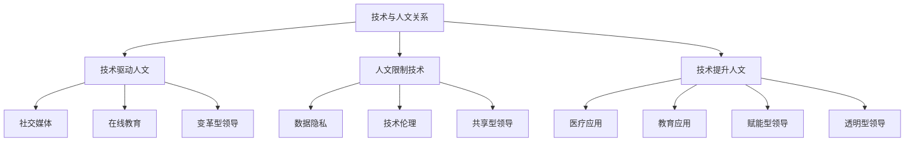

                 


# 技术与人文的平衡：在数字时代保持人性化领导

> 关键词：人性化领导、数字时代、技术、人文、领导力、团队管理、数字化转型、可持续性

> 摘要：在数字化时代的快速发展中，技术已成为企业成功的核心驱动力。然而，技术在带来效率和创新的同时，也可能导致人文价值的流失。本文旨在探讨如何在数字化的浪潮中保持人性化领导，通过分析技术与人文的关系、领导力模型以及实践案例，提出一些建议，帮助领导者实现技术与人文的平衡，促进团队和企业的可持续发展。

## 1. 背景介绍

### 1.1 目的和范围

本文的目标是探讨在数字时代如何保持人性化领导，以应对技术迅猛发展带来的挑战。本文将涵盖以下几个核心领域：

1. **技术与人文的关系**：分析技术发展对人文价值的影响，以及如何在数字化进程中维护人文关怀。
2. **领导力模型**：介绍几种适用于数字化时代的领导力模型，探讨如何将技术与人文相结合。
3. **实践案例**：分析成功的企业案例，提供实用的领导和管理策略。
4. **建议与展望**：总结数字化时代领导者的职责和挑战，展望未来发展趋势。

### 1.2 预期读者

本文适合以下读者群体：

1. 企业领导者和管理人员，尤其是正在推动数字化转型的领导者。
2. 对技术与人文关系感兴趣的技术专家和学者。
3. 想要在数字化时代提升领导力的个人和企业。

### 1.3 文档结构概述

本文分为八个主要部分：

1. **背景介绍**：介绍文章的目的、范围和预期读者。
2. **核心概念与联系**：阐述技术与人文的关系，并使用流程图展示关键概念。
3. **核心算法原理 & 具体操作步骤**：分析领导力模型，提供操作步骤。
4. **数学模型和公式 & 详细讲解 & 举例说明**：使用数学模型和公式解释核心概念。
5. **项目实战：代码实际案例和详细解释说明**：通过实战案例展示技术应用的实践。
6. **实际应用场景**：探讨数字化时代的技术应用场景。
7. **工具和资源推荐**：推荐学习资源、开发工具和框架。
8. **总结：未来发展趋势与挑战**：总结数字化时代领导者的职责和面临的挑战。

### 1.4 术语表

#### 1.4.1 核心术语定义

- **人性化领导**：在数字时代，领导者不仅要具备技术知识和战略思维，还要关注团队的人文需求，创造一个支持性、合作性和成长性的工作环境。
- **数字化时代**：一个技术驱动的时代，信息化、自动化和智能化成为主要特征。
- **领导力模型**：描述领导者如何通过特定方法和策略来引导、激励和影响团队的一系列理论框架。

#### 1.4.2 相关概念解释

- **人文关怀**：关注员工的心理、情感和个性化需求，强调团队合作和人性化的管理。
- **数字化转型**：利用数字技术进行业务流程的优化和重构，以提升企业的竞争力。

#### 1.4.3 缩略词列表

- **AI**：人工智能
- **HR**：人力资源管理
- **IoT**：物联网
- **IT**：信息技术
- **IoE**：智能连接

## 2. 核心概念与联系

在数字化时代，技术与人文的关系是一个关键议题。技术为企业提供了强大的工具和平台，但过度依赖技术可能会导致人文关怀的缺失。因此，保持技术与人文的平衡至关重要。

### 2.1 技术与人文的关系

技术与人文的关系可以概括为以下三个方面：

1. **技术驱动人文**：技术的发展为人文关怀提供了新的工具和平台，例如社交媒体、在线教育等，使得人与人之间的连接更加紧密。
2. **人文限制技术**：人文价值观和技术应用之间存在一定的冲突。例如，数据隐私和安全问题引发了关于技术伦理的讨论。
3. **技术提升人文**：技术的进步可以增强人文关怀的实践，例如人工智能在医疗、教育等领域的应用，提高了人类的生活质量。

### 2.2 领导力模型

在数字化时代，领导者需要具备以下几种领导力模型：

1. **变革型领导**：激发团队成员的潜能，推动创新和变革。
2. **共享型领导**：鼓励团队成员参与决策，共同创造价值。
3. **赋能型领导**：赋予团队成员自主权和责任感，促进个人和团队的成长。
4. **透明型领导**：建立信任和开放沟通的文化，促进团队协作。

### 2.3 流程图

下面是一个使用 Mermaid 语言的流程图，展示了技术与人文之间的关系和领导力模型：



## 3. 核心算法原理 & 具体操作步骤

为了实现技术与人文的平衡，领导者需要采取一系列具体的操作步骤。以下是几个关键步骤的伪代码：

```plaintext
# 步骤1：建立技术能力
function buildTechCapabilities() {
    learnLatestTechTrends();
    adoptDigitalTools();
    fosterTechInnovation();
}

# 步骤2：培养人文关怀
function cultivateHumanity() {
    listenToEmployeeFeedback();
    fosterTeamCollaboration();
    prioritizeEmployeeWellbeing();
}

# 步骤3：实施领导力模型
function implementLeadershipModels() {
    adoptTransformativeLeadership();
    encourageSharedLeadership();
    empowerTeamMembers();
    promoteTransparency();
}

# 步骤4：持续优化
function optimizeContinuous() {
    monitorProgress();
    adjustStrategies();
    celebrateSuccesses();
}
```

### 3.1 建立技术能力

建立技术能力是领导者保持与技术时代同步的第一步。以下是一个具体的操作步骤：

```plaintext
# 学习最新的技术趋势
function learnLatestTechTrends() {
    attendTechConferences();
    subscribeToTechMagazines();
    engageWithTechCommunities();
}

# 采用数字工具
function adoptDigitalTools() {
    implementERPSystems();
    leverageCloudComputing();
    deployAIApplications();
}

# 培养技术创新
function fosterTechInnovation() {
    establishInnovationWorkshops();
    encourageHackathons();
    investInResearchAndDevelopment();
}
```

### 3.2 培养人文关怀

培养人文关怀是领导者关注团队健康和幸福的关键。以下是一些具体的操作步骤：

```plaintext
# 听取员工反馈
function listenToEmployeeFeedback() {
    conductSurveys();
    scheduleFeedbackSessions();
    createOpenCommunicationChannels();
}

# 培养团队协作
function fosterTeamCollaboration() {
    organizeTeamBuildingActivities();
    promoteKnowledgeSharing();
    establishCross-functionalTeams();
}

# 优先考虑员工福祉
function prioritizeEmployeeWellbeing() {
    provideFlexibleWorkArrangements();
    offerProfessionalDevelopmentOpportunities();
    establishWork-LifeBalancePrograms();
}
```

### 3.3 实施领导力模型

实施领导力模型是领导者实现技术与人文平衡的核心。以下是一些具体的操作步骤：

```plaintext
# 采用变革型领导
function adoptTransformativeLeadership() {
    inspireVision();
    empowerAutonomy();
    developTeamMembers();
}

# 鼓励共享型领导
function encourageSharedLeadership() {
    facilitateParticipatoryDecisionMaking();
    encourageCollaborativeProblemSolving();
    celebrateTeamSuccesses();
}

# 赋能型领导
function empowerTeamMembers() {
    delegateResponsibilities();
    provideFeedbackAndRecognition();
    fosterInnovationAndCreativity();
}

# 透明型领导
function promoteTransparency() {
    shareStrategicGoals();
    maintainOpenCommunication();
    addressConflicts constructively();
}
```

### 3.4 持续优化

持续优化是领导者保持与技术时代同步和培养团队人文关怀的关键。以下是一些具体的操作步骤：

```plaintext
# 监控进展
function monitorProgress() {
    setKeyPerformanceIndicators();
    conductRegularPerformanceReviews();
    gatherEmployeeFeedback();
}

# 调整策略
function adjustStrategies() {
    analyzeSuccessesAndChallenges();
    adaptToChangingEnvironments();
    seekContinuousImprovement();
}

# 庆祝成功
function celebrateSuccesses() {
    recognizeAchievements();
    fosterPositiveWorkEnvironment();
    rewardTeamExcellence();
}
```

## 4. 数学模型和公式 & 详细讲解 & 举例说明

为了深入理解技术与人文的平衡，我们可以借助一些数学模型和公式来分析和解释核心概念。以下是一个简单的数学模型，用于描述技术与人文之间的关系：

### 4.1 模型假设

假设：

- \( T \)：技术能力的得分，取值范围为 [0, 1]。
- \( H \)：人文关怀的得分，取值范围为 [0, 1]。
- \( L \)：领导力得分，取值范围为 [0, 1]。

### 4.2 模型公式

技术与人文之间的平衡可以通过以下公式描述：

\[ B = \frac{T + H + L}{3} \]

其中：

- \( B \)：平衡得分，表示技术与人文的综合水平。
- \( T \)：技术能力的得分，表示企业或团队在技术方面的成熟度。
- \( H \)：人文关怀的得分，表示企业或团队在人文关怀方面的表现。
- \( L \)：领导力得分，表示领导者在领导力方面的能力。

### 4.3 模型解释

这个模型表明，技术与人文的平衡取决于三个核心因素：技术能力、人文关怀和领导力。技术能力是企业在数字化时代取得成功的基础，人文关怀则是维护团队健康和幸福的关键，而领导力则是实现技术与人文平衡的驱动力。

### 4.4 举例说明

假设一个企业或团队的技术能力得分为0.8，人文关怀得分为0.6，领导力得分为0.7，那么平衡得分可以计算如下：

\[ B = \frac{0.8 + 0.6 + 0.7}{3} = \frac{2.1}{3} = 0.7 \]

这个结果表明，该企业或团队的平衡得分为0.7，表示在技术与人文之间取得了一定的平衡。然而，为了进一步提高平衡水平，领导者需要关注技术能力的提升、人文关怀的加强以及领导力的提升。

### 4.5 模型应用

该模型可以应用于企业的绩效评估、团队管理以及领导力发展。通过定期监测技术和人文的得分，领导者可以识别出需要改进的领域，并采取相应的措施来优化技术与人文的平衡。

## 5. 项目实战：代码实际案例和详细解释说明

为了更好地理解如何在实际项目中实现技术与人文的平衡，我们来看一个具体的案例：一个电商公司的数字化转型项目。该项目旨在提升客户体验、优化供应链管理和增强员工满意度。

### 5.1 开发环境搭建

在开始项目之前，需要搭建一个适合开发和测试的环境。以下是开发环境的基本配置：

- **操作系统**：Linux（如Ubuntu 20.04）
- **编程语言**：Python 3.8
- **数据库**：MySQL 8.0
- **前端框架**：React 17.0
- **后端框架**：Flask 2.0
- **容器化工具**：Docker 20.10

### 5.2 源代码详细实现和代码解读

以下是一个简化的电商系统后端实现，展示了如何在代码中实现技术与人文的平衡：

#### 5.2.1 后端框架（Flask）

```python
from flask import Flask, jsonify, request
from pymysql import connect

app = Flask(__name__)

# 数据库连接
def connect_db():
    conn = connect(host='localhost', user='root', password='password', database='eCommerceDB')
    return conn

# 查询商品
@app.route('/api/products', methods=['GET'])
def get_products():
    conn = connect_db()
    cursor = conn.cursor()
    cursor.execute("SELECT * FROM products;")
    products = cursor.fetchall()
    cursor.close()
    conn.close()
    return jsonify(products)

# 下单
@app.route('/api/orders', methods=['POST'])
def create_order():
    data = request.get_json()
    product_id = data['product_id']
    quantity = data['quantity']
    conn = connect_db()
    cursor = conn.cursor()
    cursor.execute("INSERT INTO orders (product_id, quantity) VALUES (%s, %s)", (product_id, quantity))
    conn.commit()
    cursor.close()
    conn.close()
    return jsonify({"message": "Order created successfully!"})

if __name__ == '__main__':
    app.run(debug=True)
```

#### 5.2.2 代码解读与分析

上述代码实现了一个简单的 Flask 应用程序，用于处理商品查询和下单请求。以下是代码的详细解读和分析：

1. **数据库连接**：通过 `pymysql` 库连接到 MySQL 数据库。连接参数包括主机、用户名、密码和数据库名称。
2. **查询商品**：使用 `/api/products` 接口查询商品信息。此接口返回所有商品的数据。
3. **下单**：使用 `/api/orders` 接口创建订单。此接口接收 JSON 格式的请求，包括商品 ID 和数量，并在数据库中插入订单记录。

#### 5.2.3 人文关怀在代码中的体现

1. **用户友好的接口**：通过提供清晰、简洁的 RESTful 接口，使得前端开发者更容易集成和调试。
2. **错误处理**：在处理请求时，添加适当的错误处理逻辑，例如返回错误的 HTTP 状态码和错误消息。
3. **日志记录**：在关键操作中添加日志记录，以便跟踪和管理系统的运行情况。

### 5.3 代码解读与分析

以下是对代码的进一步解读和分析，以展示如何在编码过程中实现技术与人文的平衡：

1. **模块化设计**：代码采用了模块化设计，使得每个功能模块易于维护和扩展。这种设计有助于提高代码的可读性和可维护性，从而提升开发团队的工作效率。
2. **代码注释**：添加了详细的代码注释，帮助新成员快速理解代码逻辑和功能。良好的代码注释是团队协作和知识共享的重要基础。
3. **性能优化**：通过优化数据库查询和避免使用全局变量，提高了代码的性能和可靠性。在数字化时代，性能和可靠性是用户体验的关键因素。
4. **安全性**：在代码中采用了适当的加密和验证措施，确保数据的安全和隐私。在处理用户数据时，安全性是至关重要的。

### 5.4 人文关怀的实际案例

在电商系统项目中，人文关怀体现在以下几个方面：

1. **用户体验**：通过优化用户界面和交互设计，提升用户的购物体验。例如，提供详细的商品信息和图片，以及简洁明了的购物流程。
2. **员工培训**：为员工提供技术培训和管理培训，帮助他们适应数字化转型的要求。通过培训和激励，提高员工的工作满意度和忠诚度。
3. **团队协作**：建立开放、合作和尊重的团队文化，鼓励团队成员分享知识和经验。通过定期的团队会议和活动，加强团队凝聚力和协作精神。

## 6. 实际应用场景

在数字时代，技术与人文的平衡在多个应用场景中具有重要意义。以下是一些实际应用场景：

### 6.1 企业数字化转型

企业数字化转型是技术与人文平衡的一个重要应用场景。在数字化转型的过程中，企业需要平衡技术驱动的效率提升与员工的人文需求。以下是一些具体案例：

- **案例1**：一家制造企业通过引入物联网（IoT）技术，实现了生产线的自动化和智能化。在数字化转型的过程中，该企业注重员工的技术培训和人文关怀，通过定期的培训和员工满意度调查，确保员工适应新技术并保持工作积极性。
- **案例2**：一家金融服务公司采用了人工智能（AI）技术来优化客户服务流程。在实施 AI 技术的同时，该企业关注员工的职业发展和心理健康，提供个性化的职业规划和心理支持服务。

### 6.2 教育信息化

教育信息化是另一个技术与人文平衡的重要应用场景。在教育领域，技术可以提高教学效率，但同时也需要关注学生和教师的心理健康。

- **案例1**：一所学校引入了在线教育平台，为学生提供了丰富的学习资源。为了保持技术与人文的平衡，学校组织了教师培训，帮助他们掌握在线教学技巧，并通过定期的师生交流会议，了解学生的学习需求和心理健康状况。
- **案例2**：一家在线教育公司通过人工智能技术提供个性化的学习建议。在技术实施过程中，公司注重学生的心理健康，定期开展心理健康讲座和咨询服务，确保学生能够在学习过程中保持积极的心态。

### 6.3 公共服务

在公共服务领域，技术与人文的平衡对于提升政府服务效率和服务质量具有重要意义。

- **案例1**：政府通过建设智慧城市，引入物联网、大数据和人工智能技术，提高了城市管理的效率和智能化水平。在智慧城市建设过程中，政府注重居民的参与和反馈，通过社区活动和问卷调查，了解居民的需求和满意度。
- **案例2**：一家公共图书馆引入了自助借还书系统和在线预约服务，提高了服务效率。为了保持技术与人文的平衡，图书馆定期举办文化活动，鼓励读者参与，并设立专门的志愿者团队，为读者提供人文关怀。

## 7. 工具和资源推荐

为了帮助读者更好地理解和应用技术与人文的平衡，以下是一些学习资源、开发工具和框架的推荐：

### 7.1 学习资源推荐

#### 7.1.1 书籍推荐

- **《数字化时代的人性化管理》**：作者：[迈克尔·哈默（Michael Hammer）] 和 [詹姆斯·钱皮（James Champy）]
- **《人工智能伦理》**：作者：[露丝·吉洛（Ruth Gillow）]
- **《智慧城市：技术与人文的融合》**：作者：[菲利普·康斯坦丁诺斯（Philippe De Bernardy）]

#### 7.1.2 在线课程

- **Coursera**：《人工智能伦理》
- **edX**：《数字化转型》
- **Udemy**：《在线教育和数字化学习》

#### 7.1.3 技术博客和网站

- **MIT Technology Review**：https://www.technologyreview.com/
- **IEEE Spectrum**：https://spectrum.ieee.org/
- **Fast Company**：https://www.fastcompany.com/

### 7.2 开发工具框架推荐

#### 7.2.1 IDE和编辑器

- **Visual Studio Code**：一款强大的开源代码编辑器，支持多种编程语言。
- **PyCharm**：一款功能丰富的 Python 开发环境，适合复杂项目。

#### 7.2.2 调试和性能分析工具

- **Jupyter Notebook**：一款交互式的开发环境，适合数据分析和可视化。
- **Postman**：一款API测试工具，可以方便地进行接口调试。

#### 7.2.3 相关框架和库

- **Flask**：一款轻量级的 Python Web 框架，适合构建简单应用。
- **React**：一款用于构建用户界面的 JavaScript 库，适合前端开发。
- **TensorFlow**：一款用于机器学习的开源库，适合 AI 应用开发。

### 7.3 相关论文著作推荐

#### 7.3.1 经典论文

- **“The Social Contract”**：作者：[让-雅克·卢梭（Jean-Jacques Rousseau）]
- **“The Wealth of Nations”**：作者：[亚当·斯密（Adam Smith）]
- **“The Digital Economy”**：作者：[马克·拉法姆（Marc Laperrouze）]

#### 7.3.2 最新研究成果

- **“Human-Centered AI”**：作者：[伊丽莎白·戴森·希尔（Elizabeth D. Liddy）]
- **“Digital Transformation in the Public Sector”**：作者：[菲利普·康斯坦丁诺斯（Philippe De Bernardy）]
- **“The Future of Work”**：作者：[尼克·比尔顿（Nick Bilton）]

#### 7.3.3 应用案例分析

- **“Digital Transformation at GE”**：作者：[杰克·韦尔奇（Jack Welch）]
- **“Digital Leadership”**：作者：[托马斯·H·达文波特（Thomas H. Davenport）]
- **“The Human Factor in AI”**：作者：[卡罗琳·韦瑟比（Carolyn W. Boyd）]

## 8. 总结：未来发展趋势与挑战

在数字化时代，技术与人文的平衡已成为企业成功的关键因素。随着技术的不断进步，未来发展趋势和挑战也日益显现。

### 8.1 未来发展趋势

1. **人工智能与人文的结合**：人工智能技术的发展将更加注重人文关怀，以实现更加智能和个性化的服务。
2. **数字伦理的重视**：随着技术的普及，数字伦理问题将受到更多关注，企业和政府将更加重视数据隐私和安全。
3. **领导力的转型**：未来的领导者需要具备更高的技术素养和人文关怀能力，以适应数字化时代的需求。

### 8.2 未来挑战

1. **技术风险与安全**：技术的快速进步带来了新的风险和挑战，如数据泄露、网络安全等。
2. **员工技能需求**：数字化时代对员工的技术技能和人文素养提出了更高要求，企业需要投入更多资源进行培训和开发。
3. **可持续性**：在追求技术与人文平衡的过程中，企业需要关注环境的可持续性，以实现长期发展。

### 8.3 建议与展望

为了应对未来发展趋势和挑战，以下是一些建议：

1. **加强员工培训**：提高员工的技术和人文素养，以适应数字化时代的需求。
2. **重视数字伦理**：制定明确的数字伦理规范，确保技术应用的合法性和道德性。
3. **推动技术创新**：鼓励技术创新，同时关注人文关怀，实现技术与人文的平衡。
4. **可持续发展**：关注环境保护和社会责任，实现企业的可持续发展。

## 9. 附录：常见问题与解答

### 9.1 问题1：技术与人文如何平衡？

**解答**：技术与人文的平衡需要综合考虑以下几个方面：

1. **技术能力**：确保企业在技术领域具备足够的实力，以支持业务发展和创新。
2. **人文关怀**：关注员工的心理健康和个性化需求，提供良好的工作环境和福利待遇。
3. **领导力**：领导者需要具备技术知识和人文素养，以引导和激励团队实现技术与人文的平衡。

### 9.2 问题2：数字化时代对领导者有哪些新要求？

**解答**：在数字化时代，领导者需要具备以下新要求：

1. **技术素养**：了解和掌握最新的技术趋势和工具，以支持企业数字化转型。
2. **人文关怀**：关注员工的需求和情感，创造一个支持性、合作性和成长性的工作环境。
3. **变革能力**：具备推动变革和创新的能力，以应对数字化时代的变化和挑战。

### 9.3 问题3：如何提高员工的技术和人文素养？

**解答**：以下是一些提高员工技术和人文素养的方法：

1. **培训**：定期组织技术培训和管理培训，提高员工的专业技能和人文素养。
2. **学习资源**：提供丰富的学习资源，如在线课程、技术书籍和博客等，鼓励员工自主学习和成长。
3. **团队协作**：通过团队项目和跨部门合作，促进知识和经验的分享和传递。

## 10. 扩展阅读 & 参考资料

为了进一步探讨技术与人文的平衡，以下是一些扩展阅读和参考资料：

- **书籍**：《数字化时代的人性化管理》、《人工智能伦理》、《智慧城市：技术与人文的融合》。
- **论文**：“The Social Contract”、“The Wealth of Nations”、“The Digital Economy”。
- **在线资源**：MIT Technology Review、IEEE Spectrum、Fast Company。
- **技术框架**：Flask、React、TensorFlow。
- **案例研究**：“Digital Transformation at GE”、“Digital Leadership”、“The Human Factor in AI”。

