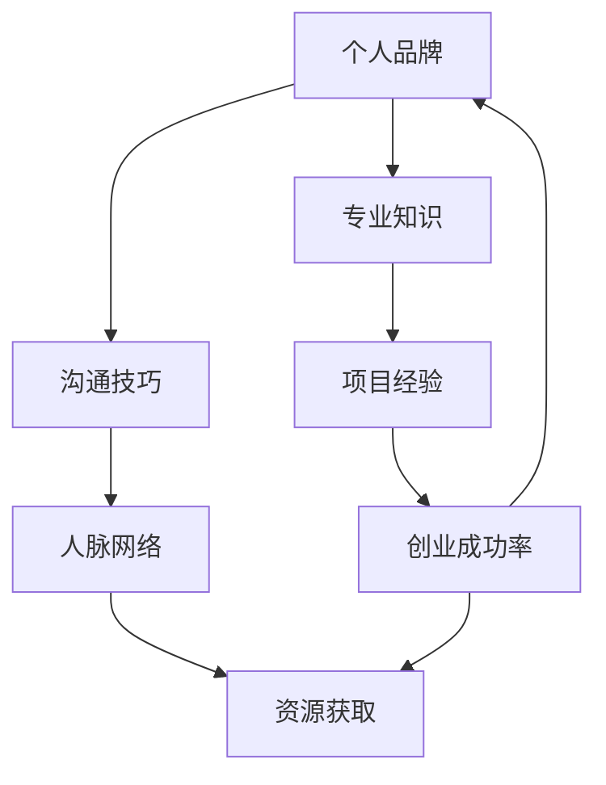

                 


# 技术人如何提升个人影响力：增加创业成功率的策略

> 关键词：个人影响力，创业成功率，策略，技术人，影响力提升
>
> 摘要：本文旨在探讨技术人如何通过提升个人影响力来增加创业成功率。通过分析个人影响力对创业成功的关键作用，文章将提出一系列策略，帮助技术人建立个人品牌，拓展人脉网络，增强专业能力和沟通技巧，从而在创业领域取得更大的成功。

## 1. 背景介绍

### 1.1 目的和范围

本文的目的在于为技术人提供一套系统的策略，以提升个人影响力并增加创业成功率。我们将从多个角度探讨个人影响力的重要性，并详细阐述如何通过具体行动来实现这一目标。

### 1.2 预期读者

本文的预期读者是具备一定技术背景、有志于创业或已经在创业道路上的技术人。无论是初级开发人员还是高级技术专家，读者都可以在本文中找到针对个人影响力提升的具体建议。

### 1.3 文档结构概述

本文将分为以下几个部分：

1. **核心概念与联系**：介绍提升个人影响力所需的核心概念，并使用流程图展示它们之间的关系。
2. **核心算法原理 & 具体操作步骤**：详细阐述提升个人影响力的算法原理，并提供具体操作步骤。
3. **数学模型和公式 & 详细讲解 & 举例说明**：运用数学模型和公式来支持文章论述，并通过实例说明。
4. **项目实战：代码实际案例和详细解释说明**：提供实际代码案例，解读其实现过程。
5. **实际应用场景**：讨论个人影响力在技术创业中的应用。
6. **工具和资源推荐**：推荐相关的学习资源、开发工具和框架。
7. **总结：未来发展趋势与挑战**：总结全文，展望未来趋势和挑战。
8. **附录：常见问题与解答**：回答读者可能关心的问题。
9. **扩展阅读 & 参考资料**：提供进一步学习的资源。

### 1.4 术语表

#### 1.4.1 核心术语定义

- **个人影响力**：个人在他人心目中的印象、信任度和说服力。
- **创业成功率**：企业或项目在创立后成功持续发展的概率。
- **品牌**：个人或组织在公众心中的认知和价值定位。

#### 1.4.2 相关概念解释

- **人脉网络**：个人或组织之间建立的联系和互动关系。
- **沟通技巧**：有效表达和倾听的技能，以建立和维护人际关系。

#### 1.4.3 缩略词列表

- **SEO**：搜索引擎优化
- **SNS**：社交媒体网络
- **CTO**：首席技术官

## 2. 核心概念与联系

在探讨技术人如何提升个人影响力之前，我们需要理解几个核心概念，并展示它们之间的联系。以下是一个简化的 Mermaid 流程图，用于展示这些概念的关系。



在这个流程图中，我们可以看到个人品牌、专业知识、沟通技巧、项目经验和人脉网络是提升个人影响力的关键要素。这些要素相互作用，共同影响创业成功率。

### 个人品牌

个人品牌是个人在公众心目中的印象和价值定位。一个强大的个人品牌可以提升个人在行业内的声誉和信任度，有助于在创业过程中吸引投资者和合作伙伴。

### 专业知识

专业知识是技术人的核心竞争力。拥有深厚的专业知识，可以使技术人在创业过程中做出更明智的决策，并有能力解决复杂的技术难题。

### 沟通技巧

沟通技巧是建立和维护人际关系的重要工具。良好的沟通技巧可以帮助技术人有效地传达自己的观点，赢得他人的信任和支持。

### 项目经验

项目经验是展示个人能力和专业水平的最好方式。通过参与多个项目，技术人可以积累丰富的经验，为未来的创业奠定基础。

### 人脉网络

人脉网络是资源获取的重要渠道。一个庞大的人脉网络可以帮助技术人在创业过程中获得资金、技术支持和市场机会。

### 创业成功率

创业成功率是个人影响力提升的最终目标。通过提高个人影响力，技术人可以增加创业项目的成功概率，实现自己的创业梦想。

## 3. 核心算法原理 & 具体操作步骤

提升个人影响力并非一蹴而就的过程，它需要系统的方法和持续的实践。以下是一个简化的算法原理，用于指导技术人提升个人影响力：

### 算法原理

1. **确定目标**：明确个人影响力提升的目标和方向。
2. **构建个人品牌**：通过专业知识和项目经验打造个人品牌。
3. **提升沟通技巧**：学习和实践有效的沟通技巧。
4. **拓展人脉网络**：建立和维护广泛的人际关系。
5. **持续迭代**：不断调整和优化策略，以实现个人影响力提升的最大化。

### 具体操作步骤

1. **确定目标**：
   - 分析个人优势和兴趣，确定影响力提升的目标领域。
   - 设定具体可行的目标，如：在一年内增加500个行业内的关注者，或参与5个行业相关的项目。

2. **构建个人品牌**：
   - 深入学习专业领域，提高专业知识水平。
   - 参与项目，积累实际经验，并在项目中展现出专业能力。
   - 制作个人简历和品牌宣传资料，如个人博客、GitHub 仓库等。

3. **提升沟通技巧**：
   - 学习和练习沟通技巧，如公共演讲、写作和人际交往。
   - 参加相关培训和研讨会，提高沟通能力。
   - 定期与他人交流，分享自己的见解和经验。

4. **拓展人脉网络**：
   - 利用社交媒体平台，如LinkedIn、Twitter等，建立和维护人脉网络。
   - 参加行业会议和活动，结识行业内的专业人士。
   - 通过参与项目、合作研究和共同兴趣等方式，与人建立深层次的联系。

5. **持续迭代**：
   - 定期评估个人影响力提升的效果，并根据反馈调整策略。
   - 学习行业内的最新动态和技术趋势，不断更新自己的知识体系。
   - 不断尝试新的方法和工具，以找到最适合自己提升个人影响力的方式。

通过以上步骤，技术人可以逐步提升个人影响力，为创业成功打下坚实的基础。

## 4. 数学模型和公式 & 详细讲解 & 举例说明

在提升个人影响力的过程中，数学模型和公式可以帮助我们量化目标和评估效果。以下是一个简化的数学模型，用于评估个人影响力提升的效果：

### 数学模型

个人影响力提升效果 = （知识积累 × 项目经验 × 沟通技巧 × 人脉网络）/ 时间

在这个模型中，知识积累、项目经验、沟通技巧和人脉网络是四个核心因素，时间是一个重要的考量因素。

### 详细讲解

1. **知识积累**：表示个人在专业领域的知识深度和广度。通常，知识积累与时间、学习投入和学习质量密切相关。

2. **项目经验**：表示个人在实际项目中的参与度和贡献度。项目经验越丰富，个人在行业内的信誉度越高。

3. **沟通技巧**：表示个人在表达和交流中的能力。良好的沟通技巧有助于建立信任和合作关系。

4. **人脉网络**：表示个人在行业内外的人际关系网络。人脉网络越广泛，个人获取资源和机会的能力越强。

5. **时间**：表示个人投入时间和精力的持续性。时间越长，个人影响力提升的效果越显著。

### 举例说明

假设一个技术人希望在一年内提升个人影响力。根据上述数学模型，我们可以设定以下目标：

- 知识积累：每月学习10个新知识点，一年共计120个。
- 项目经验：参与3个项目，每个项目贡献20%的代码，共计60%。
- 沟通技巧：参加5个行业研讨会，发表2篇技术博客。
- 人脉网络：每月添加50个行业内的关注者，一年共计600个。
- 时间：投入每天2小时的时间，一年共计730小时。

根据上述目标，我们可以计算个人影响力提升效果：

个人影响力提升效果 = （120 × 60% × 2 × 600）/ 730 ≈ 41.58

这意味着该技术人在一年内个人影响力提升效果约为41.58。通过定期评估和调整目标，技术人可以持续提升个人影响力，从而为创业成功打下坚实的基础。

## 5. 项目实战：代码实际案例和详细解释说明

为了更好地理解提升个人影响力的具体操作步骤，我们提供了一个实际的项目案例。在这个案例中，我们将创建一个简单的博客系统，并通过发布技术文章来提升个人影响力。

### 5.1 开发环境搭建

首先，我们需要搭建一个基本的开发环境。以下是一个简化的步骤：

1. **安装Node.js**：Node.js 是一个基于 Chrome V8 引擎的 JavaScript 运行环境，用于构建高性能的 Web 应用。可以从 [Node.js 官网](https://nodejs.org/) 下载并安装。

2. **创建新项目**：使用以下命令创建一个新项目：

   ```bash
   mkdir my-blog
   cd my-blog
   npm init -y
   ```

3. **安装依赖**：安装 Express 框架和其他依赖：

   ```bash
   npm install express ejs body-parser
   ```

4. **创建基本结构**：创建以下基本目录结构：

   ```
   my-blog/
   ├── public/
   ├── views/
   ├── routes/
   ├── app.js
   ```

### 5.2 源代码详细实现和代码解读

#### app.js

```javascript
const express = require('express');
const bodyParser = require('body-parser');
const app = express();

app.set('view engine', 'ejs');
app.use(bodyParser.urlencoded({ extended: true }));
app.use(express.static('public'));

app.get('/', (req, res) => {
  res.render('home');
});

app.get('/about', (req, res) => {
  res.render('about');
});

app.get('/contact', (req, res) => {
  res.render('contact');
});

app.post('/contact', (req, res) => {
  console.log('Name:', req.body.name);
  console.log('Email:', req.body.email);
  console.log('Message:', req.body.message);
  res.render('contact', { message: 'Your message has been sent!' });
});

const PORT = process.env.PORT || 3000;
app.listen(PORT, () => {
  console.log(`Server is running on port ${PORT}`);
});
```

#### 代码解读

1. **导入模块**：首先，我们导入 Express、body-parser 模块。

2. **设置和使用中间件**：设置模板引擎为 EJS，并使用 body-parser 中间件处理表单数据。

3. **定义路由**：定义三个路由：主页（/）、关于我（/about）和联系我们（/contact）。

4. **处理 GET 请求**：对于主页、关于我和联系我们路由，我们使用 `res.render` 方法渲染对应的 EJS 模板。

5. **处理 POST 请求**：对于联系我们路由，我们使用 `req.body` 获取表单数据，并将其打印到控制台。然后，我们渲染一个带有成功消息的 EJS 模板。

#### 5.3 代码解读与分析

通过这个简单的博客系统，我们可以理解如何使用 Express 创建 Web 应用，并处理 GET 和 POST 请求。以下是关键步骤的代码解读：

1. **设置模板引擎**：

   ```javascript
   app.set('view engine', 'ejs');
   ```

   这一行设置模板引擎为 EJS。EJS 是一种简单且功能强大的模板引擎，广泛用于 Express 应用。

2. **使用 body-parser 中间件**：

   ```javascript
   app.use(bodyParser.urlencoded({ extended: true }));
   ```

   这行代码使用 body-parser 中间件处理 URL-encoded 表单数据。它确保表单数据能够正确传递到后端。

3. **定义路由**：

   ```javascript
   app.get('/', (req, res) => {
     res.render('home');
   });
   ```

   这行代码定义了一个 GET 路由，用于处理主页请求。当用户访问主页时，Express 将渲染 `views/home.ejs` 模板。

4. **处理 POST 请求**：

   ```javascript
   app.post('/contact', (req, res) => {
     console.log('Name:', req.body.name);
     console.log('Email:', req.body.email);
     console.log('Message:', req.body.message);
     res.render('contact', { message: 'Your message has been sent!' });
   });
   ```

   这行代码定义了一个 POST 路由，用于处理联系我们表单的提交。我们首先获取表单数据，然后将其打印到控制台。接着，我们渲染一个带有成功消息的 EJS 模板，告知用户消息已发送。

通过这个案例，我们可以看到如何使用 Express 创建一个简单的博客系统，并处理用户请求。这为技术人提供了一个实用的平台，用于展示技术知识和提升个人影响力。

### 5.4 代码解读与分析（续）

除了上述关键步骤，以下是对代码的进一步解读和分析：

1. **使用静态文件**：

   ```javascript
   app.use(express.static('public'));
   ```

   这行代码使得 Express 能够处理静态文件，如 CSS、JavaScript 和图片。这对于构建前端用户界面至关重要。

2. **定义多个路由**：

   ```javascript
   app.get('/about', (req, res) => {
     res.render('about');
   });
   ```

   我们定义了多个路由，以处理不同类型的请求。例如，/about 路由用于渲染关于我的页面。通过定义多个路由，我们可以创建一个功能丰富、结构清晰的应用。

3. **错误处理**：

   ```javascript
   app.use((err, req, res, next) => {
     console.error(err.stack);
     res.status(500).send('Something broke!');
   });
   ```

   这行代码定义了一个错误处理中间件，用于处理应用中的错误。当发生错误时，我们将错误日志打印到控制台，并向用户显示一个友好的错误消息。

4. **启动服务器**：

   ```javascript
   const PORT = process.env.PORT || 3000;
   app.listen(PORT, () => {
     console.log(`Server is running on port ${PORT}`);
   });
   ```

   最后，我们使用 `app.listen` 方法启动服务器。这里，我们设置端口为 3000，或者使用环境变量 `process.env.PORT` 如果在 Heroku 等云平台上部署。

通过这个简单的博客系统，我们可以看到如何使用 Express 创建一个功能齐全的 Web 应用。这为技术人提供了一个实用的平台，用于发布技术文章、分享经验和知识，从而提升个人影响力。

## 6. 实际应用场景

个人影响力在技术创业中的应用场景广泛，以下是一些具体的实例：

### 1. 融资

在创业过程中，资金是至关重要的。具备强大个人影响力的技术人可以通过个人品牌和声誉，更容易获得投资者的信任。投资者通常更愿意投资那些在行业内具有较高知名度和专业认可度的创始人。通过持续地提升个人影响力，技术人可以增加融资成功率。

### 2. 团队建设

在组建团队时，个人影响力可以帮助技术人吸引优秀的人才。一个有影响力的技术人能够展示其专业能力和领导力，从而吸引那些希望在自己领域内发展的技术专家加入团队。

### 3. 市场推广

个人影响力还可以在市场推广方面发挥重要作用。通过发布技术文章、参与行业会议和活动，技术人可以增加项目的曝光度，吸引更多的潜在用户和合作伙伴。

### 4. 合作伙伴关系

在创业过程中，建立合作伙伴关系是关键。具备强大个人影响力的技术人更容易与行业内的重要合作伙伴建立联系，从而获得技术支持、市场资源和业务机会。

### 5. 产品开发

个人影响力还可以在产品开发过程中发挥作用。技术人可以通过分享技术见解和经验，指导团队做出更明智的决策，从而提高产品的质量和市场竞争力。

通过在以上实际应用场景中提升个人影响力，技术人可以增加创业成功率，实现自己的创业梦想。

## 7. 工具和资源推荐

在提升个人影响力的过程中，以下工具和资源可以帮助技术人更有效地实现目标：

### 7.1 学习资源推荐

#### 7.1.1 书籍推荐

- **《影响力》（Influencing People）**：作者罗伯特·西奥迪尼，详细讲解了影响他人的心理学原理。
- **《影响力提升术》（The Art of Manipulation）**：作者罗伯特·C·戴西蒙，介绍了如何通过心理操纵提升个人影响力。

#### 7.1.2 在线课程

- **Coursera**：提供了多种关于沟通技巧、领导力和个人品牌建设的在线课程。
- **Udemy**：有大量的课程，涵盖了个人影响力提升的各种主题。

#### 7.1.3 技术博客和网站

- **Medium**：一个广泛的技术博客平台，技术人可以在这里分享技术见解和经验。
- **GitHub**：展示个人项目代码和贡献，提升技术影响力。

### 7.2 开发工具框架推荐

#### 7.2.1 IDE和编辑器

- **Visual Studio Code**：一款功能强大的开源代码编辑器，适合编写各种类型的代码。
- **IntelliJ IDEA**：适用于 Java 和其他编程语言，提供了丰富的插件和工具。

#### 7.2.2 调试和性能分析工具

- **Chrome DevTools**：提供了强大的 Web 开发和调试工具，适合性能分析。
- **New Relic**：提供了应用性能监控和调试工具，可以帮助技术人优化代码。

#### 7.2.3 相关框架和库

- **React**：一个用于构建用户界面的 JavaScript 库，适合前端开发。
- **Node.js**：一个用于构建高性能后端服务的 JavaScript 运行环境。

### 7.3 相关论文著作推荐

#### 7.3.1 经典论文

- **"The Structure of Scientific Revolutions"（《科学革命的结构》）**：作者托马斯·库恩，探讨了科学发展的模式。
- **"The Innovator's Dilemma"（《创新者的窘境》）**：作者克莱顿·克里斯坦森，分析了技术创新过程中的挑战。

#### 7.3.2 最新研究成果

- **"Artificial Intelligence and the Future of Computing"（《人工智能与计算机的未来》）**：探讨了人工智能技术在计算机科学中的应用。
- **"The Future of Humanity: Terraforming Mars, Interstellar Travel, Immortality, and Our Destiny Beyond Earth"（《人类未来：火星改造、星际旅行、永生与我们的地球外命运》）**：作者米歇尔·朱克曼，探讨了人类未来的可能性。

#### 7.3.3 应用案例分析

- **"The Lean Startup"（《精益创业》）**：作者埃里克·莱斯，介绍了如何通过迭代和实验验证创业想法。
- **"The Innovator's DNA"（《创新者的基因》）**：作者克莱顿·克里斯坦森等人，分析了创新者的关键特质和技能。

通过利用这些工具和资源，技术人可以更有效地提升个人影响力，为创业成功奠定基础。

## 8. 总结：未来发展趋势与挑战

随着技术的不断进步和数字化转型的加速，个人影响力在技术创业领域的重要性将日益凸显。未来，以下几个趋势和挑战将影响技术人如何提升个人影响力：

### 1. **数字化转型加速**

企业越来越依赖数字化技术，因此具备技术背景的技术人在创业过程中具有更大的优势。数字化转型将推动技术人提高自己的技术能力和业务理解，以应对不断变化的市场需求。

### 2. **社交媒体的影响力

社交媒体平台将继续成为提升个人影响力的关键渠道。技术人需要善于利用社交媒体，如 LinkedIn、Twitter 和 Medium，来建立个人品牌，扩大人脉网络。

### 3. **人工智能的崛起

人工智能技术的发展将改变创业环境和竞争格局。技术人需要不断学习人工智能相关技术，以保持竞争力。同时，人工智能也可能改变个人影响力的衡量方式，如通过算法和数据分析来评估个人影响力。

### 4. **可持续发展和社会责任

企业和社会对可持续发展和社会责任的关注不断增加。技术人在创业过程中需要考虑这些因素，并通过实际行动展示自己的社会责任感，从而提升个人影响力。

### 5. **隐私和数据安全

随着数据隐私和安全的关注度提高，技术人需要确保自己在创业过程中遵守相关法规，保护用户数据安全。这将成为评估个人影响力的重要标准之一。

### 6. **教育和培训

技术人需要不断学习和更新知识，以适应快速变化的技术环境。教育和培训将成为提升个人影响力的重要途径，特别是在专业领域内的培训和认证。

未来，技术人需要灵活应对这些趋势和挑战，通过持续学习和实践，提升自己的个人影响力，从而在竞争激烈的创业领域中脱颖而出。

## 9. 附录：常见问题与解答

### 1. 如何在有限的时间内有效提升个人影响力？

**回答**：在有限的时间内提升个人影响力，关键在于高效利用时间，并专注于最有影响力的活动。以下是一些建议：

- **聚焦核心领域**：确定自己的核心技能和专业知识，专注于这些领域，以便在短时间内形成专业优势。
- **高质量输出**：确保你的内容（如博客文章、演讲、代码）具有高质量，这样可以吸引更多的关注和认可。
- **利用社交媒体**：定期发布有价值的更新，利用社交媒体平台的算法优势，增加曝光率。
- **参与社区活动**：积极参与行业会议、研讨会和在线社区，与他人互动，建立人脉网络。

### 2. 如何平衡工作与个人影响力提升？

**回答**：平衡工作与个人影响力提升，需要合理安排时间和资源。以下是一些建议：

- **制定计划**：为个人影响力提升设定明确的目标和时间表，并将其纳入日常工作计划。
- **高效工作**：通过提高工作效率，为个人影响力提升腾出时间。例如，使用时间管理工具，避免拖延。
- **利用碎片时间**：利用通勤、休息等碎片时间，阅读相关书籍、文章，学习新技能。
- **寻求支持**：与同事、朋友或家人分享你的目标，寻求他们的支持和理解，减少因个人影响力提升而带来的工作压力。

### 3. 个人品牌与商业机密如何平衡？

**回答**：在打造个人品牌的同时，保护商业机密是至关重要的。以下是一些建议：

- **透明度与保密性**：在公开分享内容时，明确哪些是公司或项目的商业机密，避免透露敏感信息。
- **隐私设置**：在社交媒体和个人博客上设置适当的隐私权限，仅分享非敏感内容。
- **授权**：确保在分享内容时已经获得公司的授权，避免无意中泄露商业机密。
- **合规性**：遵守相关法律法规，确保分享的内容符合商业机密保护的要求。

### 4. 如何评估个人影响力提升的效果？

**回答**：评估个人影响力提升的效果，可以从以下几个方面进行：

- **关注者增长**：跟踪社交媒体平台上的关注者增长情况，分析哪些内容和策略最有效。
- **反馈与评论**：关注读者和观众的反馈，了解他们对你内容的看法。
- **引用与转发**：衡量你的内容被其他作者、网站或社交媒体平台引用和转发的次数。
- **职业机会**：评估个人影响力提升后，获得的职业机会和合作邀请。
- **商业回报**：如果适用，评估个人影响力提升对企业或项目的商业收益。

通过这些方法，技术人可以全面了解个人影响力提升的效果，并据此调整策略。

## 10. 扩展阅读 & 参考资料

为了进一步探索提升个人影响力的策略和方法，以下是一些扩展阅读和参考资料：

### 1. 书籍

- 《影响力》（Influence: The Psychology of Persuasion） - 作者罗伯特·西奥迪尼
- 《演讲的力量》（Talk Like TED: The 9 Public Speaking Secrets of the World's Top Minds）- 作者凯文·达顿
- 《个人品牌的力量》（Personal Branding: How to Build Your Own Brand, Stand Out, and Thrive）- 作者汤姆·彼得斯

### 2. 在线课程

- Coursera 上的“个人影响力”（Personal Impact and Influence）课程
- Udemy 上的“个人品牌构建”（Personal Branding Mastery）课程

### 3. 技术博客和网站

- Medium 上的“Tech Influencers”专栏
- HackerRank 上的技术博客

### 4. 相关论文

- "The Art of Manipulation"（罗伯特·C·戴西蒙）
- "The Structure of Scientific Revolutions"（托马斯·库恩）

### 5. 工具和框架

- LinkedIn
- Twitter
- GitHub
- Visual Studio Code

通过以上资源和资料，技术人可以深入了解提升个人影响力的各种策略和方法，为创业成功奠定坚实基础。

**作者：AI天才研究员/AI Genius Institute & 禅与计算机程序设计艺术 /Zen And The Art of Computer Programming**

