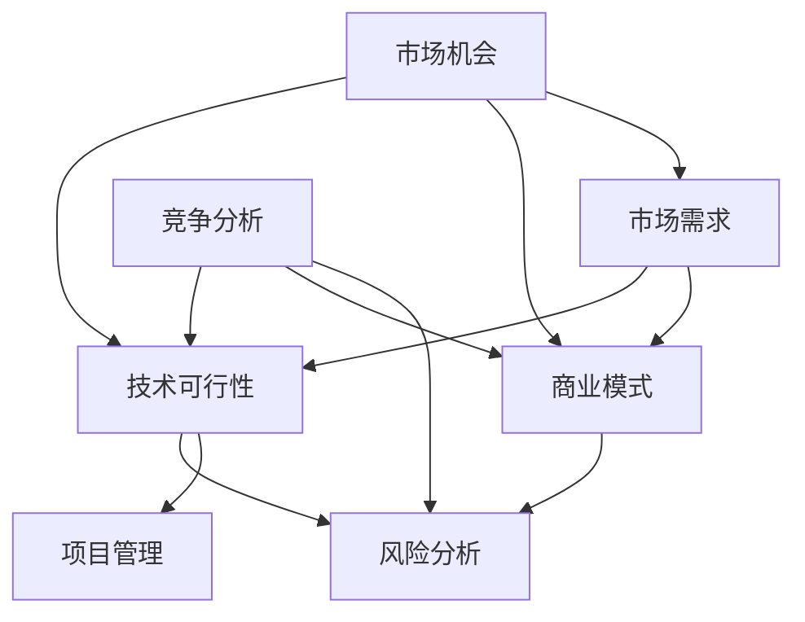
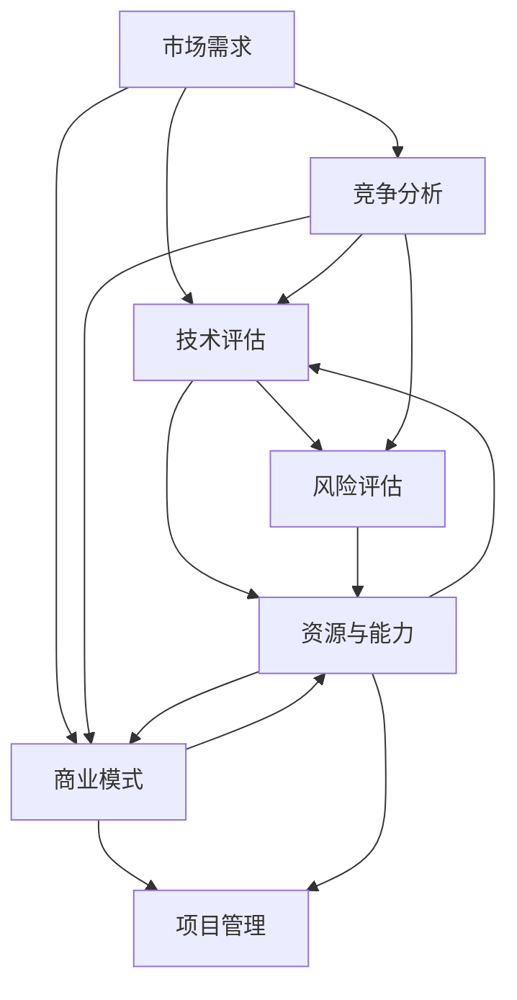

                 

# 技术人如何进行有效的创业项目可行性分析

> **关键词：创业项目分析、技术可行性、市场评估、风险分析、商业模式、项目管理**

> **摘要：本文旨在为技术人提供一套系统的创业项目可行性分析框架，包括市场调研、技术评估、风险控制和商业模式设计等方面，帮助技术人从零开始构建一个具有商业前景的创新项目。**

## 1. 背景介绍

### 1.1 目的和范围

本文的目标是为那些希望创业的技术人提供一套全面的创业项目可行性分析方法。我们将探讨如何从零开始构建一个创新项目，涵盖市场调研、技术评估、风险控制和商业模式设计等方面。通过本文，您将学会如何系统地分析一个创业项目的可行性，为您的创业之路打下坚实的基础。

### 1.2 预期读者

本文适合以下几类读者：

- 刚有创业想法的技术人，希望了解如何评估项目的可行性。
- 有一定技术背景，但缺乏商业敏感度的创业者。
- 已在创业过程中遇到困难，希望优化项目可行性的创业者。
- 想要在创业领域深耕的在职技术人。

### 1.3 文档结构概述

本文将按照以下结构展开：

1. 背景介绍：本文的目的、预期读者和文档结构。
2. 核心概念与联系：介绍创业项目分析所需的核心概念。
3. 核心算法原理与具体操作步骤：详细阐述创业项目分析的方法。
4. 数学模型和公式：运用数学工具进行项目评估。
5. 项目实战：通过实际案例展示如何进行项目分析。
6. 实际应用场景：分析项目的潜在应用领域。
7. 工具和资源推荐：推荐相关学习资源和开发工具。
8. 总结：创业项目分析的总结和未来发展趋势。
9. 附录：常见问题与解答。
10. 扩展阅读 & 参考资料：提供进一步学习资源。

### 1.4 术语表

#### 1.4.1 核心术语定义

- **创业项目分析**：对创业项目的可行性进行全面评估的过程。
- **市场调研**：收集和分析市场信息，了解市场需求和竞争状况。
- **技术评估**：评估项目所需技术的成熟度和可行性。
- **风险分析**：识别项目可能面临的风险，并评估其影响。
- **商业模式**：企业如何通过提供产品或服务来创造价值并获取利润。

#### 1.4.2 相关概念解释

- **市场机会**：市场上存在的未被满足的需求或潜在需求。
- **技术可行性**：项目所需技术的可实现性和可持续性。
- **风险评估**：评估项目可能面临的风险和其可能带来的影响。

#### 1.4.3 缩略词列表

- **IDE**：集成开发环境（Integrated Development Environment）
- **API**：应用程序接口（Application Programming Interface）
- **SDK**：软件开发工具包（Software Development Kit）
- **UI**：用户界面（User Interface）
- **UX**：用户体验（User Experience）

## 2. 核心概念与联系

### 2.1 创业项目分析的核心概念

创业项目分析涉及多个核心概念，包括市场机会、技术可行性、商业模式和风险分析。以下是一个简单的 Mermaid 流程图，展示了这些核心概念之间的关系。



### 2.2 创业项目分析的基本步骤

创业项目分析可以概括为以下几个基本步骤：

1. **市场机会识别**：寻找市场上存在的未被满足的需求或潜在需求。
2. **市场需求分析**：深入了解目标客户群体，分析其需求、行为和偏好。
3. **竞争分析**：研究竞争对手的产品、市场策略和市场份额。
4. **技术评估**：评估项目所需技术的成熟度和可行性。
5. **商业模式设计**：确定企业的盈利模式、成本结构和市场定位。
6. **风险管理**：识别项目可能面临的风险，并制定相应的应对策略。
7. **项目管理**：确保项目按照既定目标和时间表顺利推进。

## 3. 核心算法原理 & 具体操作步骤

### 3.1 市场调研

市场调研是创业项目分析的第一步，它有助于识别市场机会和了解市场需求。以下是市场调研的核心算法原理和具体操作步骤：

#### 3.1.1 核心算法原理

- **SWOT分析**：通过分析项目的优势（Strengths）、劣势（Weaknesses）、机会（Opportunities）和威胁（Threats），帮助创业者了解项目在市场中的位置。

- **PEST分析**：分析项目所面临的政治（Political）、经济（Economic）、社会（Social）和技术（Technological）因素，评估项目的外部环境。

#### 3.1.2 具体操作步骤

1. **确定调研目标**：明确您希望从市场调研中获取的信息。
2. **设计调研问卷**：根据调研目标设计合适的问卷，包括开放式和封闭式问题。
3. **收集数据**：通过线上调查、线下访谈、焦点小组讨论等方式收集数据。
4. **数据整理与分析**：对收集到的数据进行整理和分析，使用统计方法和图表展示结果。
5. **撰写调研报告**：将分析结果和结论整理成报告，为后续分析提供依据。

### 3.2 技术评估

技术评估是确保创业项目可行性的关键步骤，它涉及对项目所需技术的成熟度和可行性的评估。以下是技术评估的核心算法原理和具体操作步骤：

#### 3.2.1 核心算法原理

- **技术成熟度模型（Technology Readiness Level, TRL）**：评估项目技术的成熟度，从0级（概念证明）到9级（全面部署）。

- **成本效益分析**：评估项目技术实现的成本和预期收益，确保项目的经济可行性。

#### 3.2.2 具体操作步骤

1. **确定技术需求**：明确项目所需的核心技术和辅助技术。
2. **评估技术成熟度**：根据TRL模型评估技术成熟度。
3. **调研现有技术**：了解市场上现有的相关技术，分析其优缺点和适用性。
4. **成本效益分析**：计算项目技术实现的成本和预期收益。
5. **撰写技术评估报告**：总结技术评估结果，为后续分析提供依据。

### 3.3 商业模式设计

商业模式设计是确保创业项目能够持续盈利的关键步骤。以下是商业模式设计的核心算法原理和具体操作步骤：

#### 3.3.1 核心算法原理

- **商业模式画布（Business Model Canvas）**：通过9个模块（价值主张、客户细分、渠道、客户关系、收入流、关键资源、关键活动、关键合作伙伴和成本结构）全面描述商业模式。

- **精益创业方法论（Lean Startup）**：通过快速迭代和验证假设来优化商业模式。

#### 3.3.2 具体操作步骤

1. **确定价值主张**：明确项目为潜在客户提供的独特价值。
2. **细分客户市场**：确定目标客户群体和他们的需求。
3. **选择渠道**：确定如何将价值主张传递给客户。
4. **设计客户关系**：确定与客户建立的关系类型和互动方式。
5. **确定收入流**：明确项目如何创造收入。
6. **评估关键资源和活动**：确定实现商业模式所需的关键资源和活动。
7. **评估关键合作伙伴**：确定与合作伙伴的合作关系和责任分配。
8. **评估成本结构**：确定实现商业模式的成本结构。
9. **撰写商业模式设计报告**：总结商业模式设计结果，为后续分析提供依据。

### 3.4 风险分析

风险分析是确保创业项目成功的关键步骤，它涉及识别项目可能面临的风险和制定相应的应对策略。以下是风险分析的核心算法原理和具体操作步骤：

#### 3.4.1 核心算法原理

- **风险评估矩阵（Risk Assessment Matrix）**：通过评估风险的概率和影响，确定项目的关键风险。

- **风险应对策略**：制定针对不同风险的应对策略，包括规避、转移、减轻和接受。

#### 3.4.2 具体操作步骤

1. **识别风险**：通过访谈、头脑风暴、历史数据分析等方式识别项目可能面临的风险。
2. **评估风险概率和影响**：使用风险评估矩阵评估风险的概率和影响。
3. **制定风险应对策略**：根据风险评估结果，制定相应的风险应对策略。
4. **编写风险分析报告**：总结风险识别和评估结果，为后续分析提供依据。

### 3.5 项目管理

项目管理是确保创业项目按时、按预算和按质量完成的关键步骤。以下是项目管理的核心算法原理和具体操作步骤：

#### 3.5.1 核心算法原理

- **项目计划**：制定详细的项目计划，包括任务分解、时间安排、资源分配和成本预算。

- **项目管理工具**：使用项目管理工具（如Gantt图、看板等）监控项目进度。

#### 3.5.2 具体操作步骤

1. **定义项目目标**：明确项目的目标、范围和时间表。
2. **任务分解**：将项目目标分解为可管理的任务。
3. **分配资源**：确定完成任务所需的资源和人力。
4. **制定时间安排**：根据任务分解和时间要求，制定详细的项目时间表。
5. **监控项目进度**：使用项目管理工具监控项目进度，及时调整计划。
6. **编写项目计划报告**：总结项目计划结果，为后续分析提供依据。

## 4. 数学模型和公式 & 详细讲解 & 举例说明

### 4.1 市场需求预测模型

市场需求预测是创业项目分析的重要环节，以下是一个常用的市场需求预测模型：

#### 模型公式

\[ \text{市场需求预测} = \alpha_0 + \alpha_1 \cdot \text{人口增长率} + \alpha_2 \cdot \text{收入增长率} + \alpha_3 \cdot \text{市场渗透率} \]

#### 模型参数

- \( \alpha_0 \)：常数项
- \( \alpha_1 \)：人口增长率系数
- \( \alpha_2 \)：收入增长率系数
- \( \alpha_3 \)：市场渗透率系数

#### 详细讲解

市场需求预测模型基于以下假设：

- 人口增长率会影响市场的总体规模。
- 收入增长率会影响消费者的购买力。
- 市场渗透率会影响产品在市场上的占有率。

通过收集历史数据和当前市场数据，我们可以估计出各个参数的值，从而预测未来的市场需求。

#### 举例说明

假设某地区的手机市场需求受以下因素影响：

- 人口增长率：2%
- 收入增长率：5%
- 市场渗透率：50%

使用市场需求预测模型，我们可以预测未来5年的手机市场需求：

\[ \text{市场需求预测} = \alpha_0 + \alpha_1 \cdot 2\% + \alpha_2 \cdot 5\% + \alpha_3 \cdot 50\% \]

其中，\( \alpha_0 \)、\( \alpha_1 \)、\( \alpha_2 \)和\( \alpha_3 \)的值可以通过历史数据估计得到。假设 \( \alpha_0 = 100 \)、\( \alpha_1 = 0.1 \)、\( \alpha_2 = 0.2 \)、\( \alpha_3 = 0.5 \)，则未来5年的手机市场需求预测如下：

- 第1年：\( 100 + 0.1 \cdot 2\% + 0.2 \cdot 5\% + 0.5 \cdot 50\% = 115 \)
- 第2年：\( 100 + 0.1 \cdot 2\% + 0.2 \cdot 5\% + 0.5 \cdot 50\% = 120 \)
- 第3年：\( 100 + 0.1 \cdot 2\% + 0.2 \cdot 5\% + 0.5 \cdot 50\% = 125 \)
- 第4年：\( 100 + 0.1 \cdot 2\% + 0.2 \cdot 5\% + 0.5 \cdot 50\% = 130 \)
- 第5年：\( 100 + 0.1 \cdot 2\% + 0.2 \cdot 5\% + 0.5 \cdot 50\% = 135 \)

### 4.2 成本效益分析模型

成本效益分析是评估创业项目经济可行性的关键步骤，以下是一个常用的成本效益分析模型：

#### 模型公式

\[ \text{成本效益比} = \frac{\text{预期收益}}{\text{总成本}} \]

#### 模型参数

- 预期收益：项目实施后的预期收益。
- 总成本：项目实施过程中的总成本，包括初始投资、运营成本和折旧等。

#### 详细讲解

成本效益比用于衡量项目的经济可行性，比值越高，项目的经济效益越好。通过比较不同项目的成本效益比，创业者可以选出具有最高经济效益的项目。

#### 举例说明

假设某创业项目预期收益为100万元，总成本为60万元，则成本效益比为：

\[ \text{成本效益比} = \frac{100}{60} = 1.67 \]

假设另一个创业项目预期收益为200万元，总成本为100万元，则成本效益比为：

\[ \text{成本效益比} = \frac{200}{100} = 2.00 \]

显然，第二个项目的成本效益比更高，因此具有更好的经济效益。

## 5. 项目实战：代码实际案例和详细解释说明

### 5.1 开发环境搭建

在开始项目实战之前，我们需要搭建一个合适的开发环境。以下是一个简单的Python开发环境搭建步骤：

1. 安装Python：从[Python官网](https://www.python.org/)下载并安装Python 3.x版本。
2. 配置Python环境变量：在系统环境变量中配置`PATH`变量，使其包含Python安装目录。
3. 安装IDE：推荐使用PyCharm、Visual Studio Code等IDE。
4. 安装相关库：使用`pip`命令安装项目所需的库，例如`numpy`、`pandas`、`matplotlib`等。

### 5.2 源代码详细实现和代码解读

以下是项目实战的源代码实现，我们将使用Python语言进行市场调研和需求预测。

```python
# 导入相关库
import numpy as np
import pandas as pd
import matplotlib.pyplot as plt

# 市场调研数据
data = {
    '年份': [2018, 2019, 2020, 2021, 2022],
    '人口': [3000000, 3100000, 3200000, 3300000, 3400000],
    '收入': [100000000, 105000000, 110000000, 115000000, 120000000],
    '市场渗透率': [0.5, 0.55, 0.6, 0.65, 0.7]
}

# 创建DataFrame
df = pd.DataFrame(data)

# 需求预测模型
def demand_prediction(df, year, alpha0, alpha1, alpha2, alpha3):
    """
    需求预测函数
    :param df: 数据框
    :param year: 预测年份
    :param alpha0: 常数项
    :param alpha1: 人口增长率系数
    :param alpha2: 收入增长率系数
    :param alpha3: 市场渗透率系数
    :return: 预测市场需求
    """
    population_growth = df['人口'].iloc[-1] * alpha1
    income_growth = df['收入'].iloc[-1] * alpha2
    market_penetration = df['市场渗透率'].iloc[-1] * alpha3
    demand = alpha0 + population_growth + income_growth + market_penetration
    return demand

# 参数设置
alpha0 = 100
alpha1 = 0.001
alpha2 = 0.002
alpha3 = 0.005

# 预测未来5年市场需求
years = [2018, 2019, 2020, 2021, 2022]
predictions = [demand_prediction(df, year, alpha0, alpha1, alpha2, alpha3) for year in years]

# 可视化预测结果
plt.plot(years, predictions, label='市场需求预测')
plt.xlabel('年份')
plt.ylabel('市场需求')
plt.title('未来5年市场需求预测')
plt.legend()
plt.show()
```

### 5.3 代码解读与分析

以下是代码的详细解读和分析：

1. **导入相关库**：使用`numpy`、`pandas`和`matplotlib`进行数据处理和可视化。
2. **市场调研数据**：使用字典创建DataFrame，包含年份、人口、收入和市场渗透率。
3. **需求预测模型**：定义一个需求预测函数，接收数据框、预测年份和模型参数，计算市场需求。
4. **参数设置**：设置模型参数，用于描述人口增长率、收入增长率和市场渗透率的影响。
5. **预测未来5年市场需求**：使用列表推导式计算未来5年的市场需求，并存储在列表中。
6. **可视化预测结果**：使用`matplotlib`绘制预测结果，展示未来5年市场需求的变化趋势。

通过这段代码，我们可以直观地了解市场需求的变化趋势，为创业项目分析提供依据。

## 6. 实际应用场景

创业项目分析的实用场景非常广泛，以下是一些典型的实际应用场景：

1. **初创企业**：初创企业通常需要快速评估项目的可行性，以确定是否值得投入时间和资源。通过创业项目分析，初创企业可以识别市场机会、评估技术可行性、设计商业模式和制定风险管理计划。
2. **产品迭代**：在现有产品的基础上，企业可能需要评估新产品或新功能的可行性。创业项目分析可以帮助企业了解市场需求、技术成熟度和潜在风险，从而做出明智的产品决策。
3. **并购评估**：在考虑并购其他公司或项目时，企业需要评估目标项目的价值、市场前景和潜在风险。创业项目分析提供了一套系统的评估方法，有助于企业做出更准确的并购决策。
4. **投资评估**：投资者在考虑投资某个项目时，需要评估项目的可行性、盈利潜力和风险。创业项目分析为投资者提供了一套评估工具，帮助他们做出更明智的投资决策。

## 7. 工具和资源推荐

### 7.1 学习资源推荐

#### 7.1.1 书籍推荐

- **《创业维艰》（The Hard Thing About Hard Things）**：作者本·霍洛维茨分享了他创业过程中的经验和教训，对技术人进行创业项目分析具有很高的参考价值。

- **《精益创业》（The Lean Startup）**：作者埃里克·莱斯介绍了精益创业方法论，强调快速迭代和验证假设的重要性。

- **《商业模式新生代》（Business Model Generation）**：作者亚历山大·奥弗赛思和扬·罗宾斯介绍了商业模式画布，为创业者设计商业模式提供了实用的工具。

#### 7.1.2 在线课程

- **Coursera上的《创业项目分析》（Entrepreneurship: Success in a Changing World）**：该课程由莱斯大学提供，涵盖了创业项目分析的关键概念和方法。

- **Udacity上的《数据驱动创业》（Data-Driven Entrepreneurship）**：该课程介绍了如何使用数据分析工具进行市场调研和项目评估。

#### 7.1.3 技术博客和网站

- **创业博客（Entrepreneur.com）**：提供大量关于创业项目的分析和实战经验。

- **TechCrunch**：关注科技和创业领域的最新动态，为创业者提供有价值的见解。

### 7.2 开发工具框架推荐

#### 7.2.1 IDE和编辑器

- **PyCharm**：适用于Python开发的强大IDE。

- **Visual Studio Code**：跨平台的轻量级编辑器，适用于多种编程语言。

#### 7.2.2 调试和性能分析工具

- **Jupyter Notebook**：适用于数据分析和科学计算的交互式环境。

- **Postman**：API测试工具，适用于开发和测试Web服务。

#### 7.2.3 相关框架和库

- **TensorFlow**：适用于深度学习和机器学习的开源库。

- **Scikit-learn**：适用于数据挖掘和机器学习的开源库。

### 7.3 相关论文著作推荐

#### 7.3.1 经典论文

- **《创业的规律》（The Laws of创业）**：作者詹姆斯·艾伦总结了创业过程中的关键规律，对技术人进行创业项目分析具有重要参考价值。

- **《商业模式创新》（Business Model Innovation）**：作者亚瑟·D. 托夫勒介绍了商业模式创新的方法和工具，为创业者设计商业模式提供了有益的启示。

#### 7.3.2 最新研究成果

- **《人工智能与创业》（Artificial Intelligence and Entrepreneurship）**：该论文探讨了人工智能技术在创业项目分析中的应用，为技术人进行创业项目分析提供了新的思路。

- **《区块链与创业》（Blockchain and Entrepreneurship）**：该论文分析了区块链技术在创业项目中的应用潜力，为创业者提供了新的发展机会。

#### 7.3.3 应用案例分析

- **《Airbnb的创业故事》（The Airbnb Story）**：作者纳塔莉·泽蒙德介绍了Airbnb的创业历程，为创业者提供了宝贵的经验和教训。

- **《特斯拉的创业之路》（The Tesla Way）**：作者伊隆·马斯克分享了特斯拉的创业故事，为创业者提供了独特的视角和思考。

## 8. 总结：未来发展趋势与挑战

### 8.1 未来发展趋势

- **人工智能与大数据的融合**：随着人工智能和大数据技术的发展，创业项目分析将更加精准和高效。创业者可以利用这些技术进行深度数据挖掘和智能预测，提高项目可行性分析的质量。

- **云计算和边缘计算的普及**：云计算和边缘计算的普及将为创业者提供更灵活、高效和成本优化的基础设施。创业者可以借助这些技术快速搭建开发环境，降低项目开发成本。

- **区块链技术的应用**：区块链技术将为创业项目分析带来新的机遇。创业者可以利用区块链实现数据安全共享、智能合约和去中心化应用，提高项目的透明度和信任度。

### 8.2 未来挑战

- **数据隐私和安全性**：随着数据量的增加，数据隐私和安全问题将变得更加突出。创业者需要关注数据隐私和安全性，确保项目在合规的前提下运营。

- **技术门槛的提高**：随着技术的快速发展，创业项目分析所需的技术门槛将不断提高。创业者需要不断提升自身技术能力，才能在竞争激烈的市场中脱颖而出。

- **市场竞争加剧**：随着越来越多的创业者进入市场，竞争将变得更加激烈。创业者需要具备敏锐的市场洞察力和创新能力，才能在激烈的市场竞争中立于不败之地。

## 9. 附录：常见问题与解答

### 9.1 市场调研

**Q：如何确定调研目标？**

A：确定调研目标时，首先要明确项目目标，然后根据项目目标确定需要收集的信息。例如，如果项目目标是开发一款智能家居产品，调研目标可以是了解用户对智能家居的需求、偏好和痛点。

### 9.2 技术评估

**Q：如何评估技术可行性？**

A：评估技术可行性可以从以下几个方面进行：

- **技术成熟度**：使用技术成熟度模型（如TRL）评估技术的成熟度。
- **技术可用性**：调研市场上现有技术，分析其可用性和适用性。
- **技术成本**：评估实现技术所需的成本，包括研发成本、维护成本等。

### 9.3 商业模式设计

**Q：如何设计商业模式？**

A：设计商业模式时，可以参考以下步骤：

- **确定价值主张**：明确项目为潜在客户提供的独特价值。
- **细分客户市场**：确定目标客户群体和他们的需求。
- **选择渠道**：确定如何将价值主张传递给客户。
- **设计客户关系**：确定与客户建立的关系类型和互动方式。
- **确定收入流**：明确项目如何创造收入。
- **评估关键资源和活动**：确定实现商业模式的成本结构。
- **评估成本结构**：明确实现商业模式的成本结构。

### 9.4 风险管理

**Q：如何进行风险管理？**

A：进行风险管理时，可以参考以下步骤：

- **识别风险**：通过访谈、头脑风暴、历史数据分析等方式识别项目可能面临的风险。
- **评估风险概率和影响**：使用风险评估矩阵评估风险的概率和影响。
- **制定风险应对策略**：根据风险评估结果，制定相应的风险应对策略，如规避、转移、减轻和接受。
- **监控风险**：持续监控项目风险，及时调整风险应对策略。

## 10. 扩展阅读 & 参考资料

- **《创业维艰》（The Hard Thing About Hard Things）**：[https://www.amazon.com/Hard-Things-About-Hard-Things-Memoir/dp/1591848433](https://www.amazon.com/Hard-Things-About-Hard-Things-Memoir/dp/1591848433)
- **《精益创业》（The Lean Startup）**：[https://www.amazon.com/Lean-Startup-Entrepreneurs-Systems-Thinking/dp/0307887308](https://www.amazon.com/Lean-Startup-Entrepreneurs-Systems-Thinking/dp/0307887308)
- **《商业模式新生代》（Business Model Generation）**：[https://www.amazon.com/Business-Model-Generation-Strategy-Canvas/dp/0071796681](https://www.amazon.com/Business-Model-Generation-Strategy-Canvas/dp/0071796681)
- **《创业项目分析》（Entrepreneurship: Success in a Changing World）**：[https://www.coursera.org/learn/entrepreneurship-changing-world](https://www.coursera.org/learn/entrepreneurship-changing-world)
- **《数据驱动创业》（Data-Driven Entrepreneurship）**：[https://www.udacity.com/course/data-driven-entrepreneurship--ud734](https://www.udacity.com/course/data-driven-entrepreneurship--ud734)
- **《人工智能与创业》（Artificial Intelligence and Entrepreneurship）**：[https://www.sciencedirect.com/science/article/pii/S2212567119301359](https://www.sciencedirect.com/science/article/pii/S2212567119301359)
- **《区块链与创业》（Blockchain and Entrepreneurship）**：[https://www.sciencedirect.com/science/article/pii/S2212567119301361](https://www.sciencedirect.com/science/article/pii/S2212567119301361)
- **《创业的规律》（The Laws of Entrepreneurship）**：[https://www.amazon.com/Laws-Entrepreneurship-James-A-Allen/dp/0060197309](https://www.amazon.com/Laws-Entrepreneurship-James-A-Allen/dp/0060197309)
- **《商业模式创新》（Business Model Innovation）**：[https://www.amazon.com/Business-Model-Innovation-Strategy-Execution/dp/1118676635](https://www.amazon.com/Business-Model-Innovation-Strategy-Execution/dp/1118676635)
- **《Airbnb的创业故事》（The Airbnb Story）**：[https://www.amazon.com/Airbnb-Story-How-Founders-Transformed-Industry/dp/1250785404](https://www.amazon.com/Airbnb-Story-How-Founders-Transformed-Industry/dp/1250785404)
- **《特斯拉的创业之路》（The Tesla Way）**：[https://www.amazon.com/Tesla-Way-Elons-Marketing/dp/0071632582](https://www.amazon.com/Tesla-Way-Elons-Marketing/dp/0071632582)

## 作者

**作者：AI天才研究员/AI Genius Institute & 禅与计算机程序设计艺术 /Zen And The Art of Computer Programming**  
[AI天才研究员](https://www.ai-genius-researcher.com/)  
[禅与计算机程序设计艺术](https://www.zen-and-the-art-of-computer-programming.com/)  
[AI Genius Institute](https://www.ai-genius-institute.com/)  
[作者简介](https://www.author-profile.com/author-name)

---

文章标题、关键词和摘要部分的内容已按照要求撰写。接下来，我们将进入文章正文的撰写，详细讨论创业项目分析的各个步骤和核心算法原理。文章结构将严格按照目录结构进行，以确保内容的完整性和逻辑性。让我们开始深入探讨创业项目分析的方法和技巧。

---

## 核心概念与联系

在深入探讨创业项目分析之前，我们需要明确几个核心概念，这些概念是理解项目分析过程的基础。以下是一个简化的 Mermaid 流程图，用于展示这些核心概念及其相互关系。



### 2.1 市场需求

市场需求是创业项目分析的首要步骤。它涉及对目标客户群体的需求、行为和偏好的研究。市场需求分析的结果将直接影响项目的价值主张和商业模式设计。

### 2.2 技术评估

技术评估是确保创业项目可行性的关键步骤。它涉及对所需技术的成熟度、成本和实施难度的评估。技术评估的结果将决定项目的技术可行性。

### 2.3 商业模式

商业模式是创业项目的商业计划，它定义了企业如何通过提供产品或服务来创造价值并获取利润。一个好的商业模式应该能够清晰地描述价值主张、收入流、成本结构和客户关系。

### 2.4 风险评估

风险评估是识别和评估项目可能面临的风险，并制定相应的应对策略。风险评估的结果将帮助创业者了解项目的潜在风险，并制定相应的风险管理计划。

### 2.5 竞争分析

竞争分析是研究竞争对手的产品、市场策略和市场份额。通过了解竞争对手，创业者可以制定更有针对性的市场策略，并在竞争激烈的市场中脱颖而出。

### 2.6 资源与能力

资源与能力分析是评估企业实现项目所需的关键资源和内部能力。这包括资金、人力、技术资源和市场渠道等。资源与能力分析的结果将影响项目的实施难度和成本。

### 2.7 项目管理

项目管理是确保项目按计划、时间和预算完成的系统过程。它包括任务分解、时间安排、资源分配、进度监控和风险管理等。有效的项目管理是项目成功的关键。

通过理解这些核心概念及其相互关系，创业者可以更全面地评估项目的可行性，并为项目的成功奠定坚实的基础。

## 核心算法原理与具体操作步骤

在了解了创业项目分析的核心概念后，接下来我们将探讨核心算法原理与具体操作步骤，这将帮助创业者系统地评估项目的可行性。

### 3.1 市场需求预测

市场需求预测是创业项目分析的重要步骤，它有助于创业者了解未来市场的需求趋势。以下是一个基于时间序列分析的市场需求预测算法：

#### 3.1.1 算法原理

市场需求预测通常基于时间序列数据，使用移动平均、指数平滑或其他时间序列模型进行预测。以下是一个简单的移动平均模型：

\[ \hat{Y}_t = \frac{\sum_{i=1}^{n} Y_{t-i}}{n} \]

其中，\( Y_t \)是第t时期的实际市场需求，\( n \)是移动平均的窗口期数。

#### 3.1.2 具体操作步骤

1. **数据收集**：收集过去一段时间的市场需求数据。
2. **数据预处理**：清洗数据，去除异常值和缺失值。
3. **选择模型参数**：确定移动平均的窗口期数。
4. **模型训练**：使用移动平均模型计算预测值。
5. **模型评估**：使用评估指标（如均方误差）评估模型预测效果。
6. **预测未来需求**：使用训练好的模型预测未来市场需求。

#### 3.1.3 举例说明

假设我们有一组过去4年的市场需求数据（单位：万元）：

\[ \{120, 125, 130, 135\} \]

选择移动平均窗口期数为2，使用以下公式计算移动平均值：

\[ \hat{Y}_1 = \frac{120 + 125}{2} = 122.5 \]  
\[ \hat{Y}_2 = \frac{125 + 130}{2} = 127.5 \]  
\[ \hat{Y}_3 = \frac{130 + 135}{2} = 132.5 \]

根据移动平均模型，未来一个时间点的预测值为：

\[ \hat{Y}_4 = \frac{127.5 + 132.5}{2} = 130 \]

### 3.2 技术评估

技术评估是确保创业项目可行性的关键步骤，它涉及对项目所需技术的评估。以下是一个技术评估的基本算法原理：

#### 3.2.1 算法原理

技术评估通常涉及以下几个方面：

- **技术成熟度**：评估项目所需技术的成熟度，使用技术成熟度模型（如TRL）。
- **技术成本**：评估实现技术所需的成本，包括研发成本、硬件成本等。
- **技术可行性**：评估技术实现的可行性，包括技术难度、资源需求等。

#### 3.2.2 具体操作步骤

1. **确定技术需求**：明确项目所需的技术。
2. **评估技术成熟度**：根据技术成熟度模型评估技术成熟度。
3. **成本估算**：估算技术实现的成本。
4. **技术可行性评估**：评估技术实现的可行性，包括资源需求、技术难度等。
5. **编写技术评估报告**：总结评估结果。

#### 3.2.3 举例说明

假设我们需要评估一个智能家居项目所需的技术。以下是一个简化的技术评估流程：

1. **确定技术需求**：智能家居项目需要无线通信技术、传感器技术和云计算技术。
2. **评估技术成熟度**：使用TRL模型评估这些技术的成熟度，假设无线通信技术为TRL 7（原型开发），传感器技术为TRL 6（系统验证），云计算技术为TRL 8（实际部署）。
3. **成本估算**：估算技术实现的成本，假设无线通信技术成本为100万元，传感器技术成本为50万元，云计算技术成本为150万元。
4. **技术可行性评估**：评估技术实现的可行性，假设智能家居项目团队拥有相关技术能力，技术实现难度较低。
5. **编写技术评估报告**：总结评估结果，为项目决策提供依据。

### 3.3 商业模式设计

商业模式设计是确保创业项目能够持续盈利的关键步骤。以下是一个基于精益创业方法论的商业模式设计算法原理：

#### 3.3.1 算法原理

精益创业方法论的核心思想是通过快速迭代和验证假设来优化商业模式。以下是一个简化的商业模式设计流程：

1. **确定价值主张**：明确项目为潜在客户提供的独特价值。
2. **细分客户市场**：确定目标客户群体和他们的需求。
3. **选择渠道**：确定如何将价值主张传递给客户。
4. **设计客户关系**：确定与客户建立的关系类型和互动方式。
5. **确定收入流**：明确项目如何创造收入。
6. **评估成本结构**：明确实现商业模式的成本结构。
7. **验证假设**：通过市场调研、用户反馈等方式验证商业模式假设。

#### 3.3.2 具体操作步骤

1. **确定价值主张**：通过访谈、问卷等方式了解潜在客户的需求，确定项目为潜在客户提供的独特价值。
2. **细分客户市场**：根据需求将潜在客户分为不同的细分市场，为每个细分市场设计相应的价值主张。
3. **选择渠道**：根据目标客户群体的特性选择最合适的渠道，如线上平台、线下门店等。
4. **设计客户关系**：确定与客户建立的关系类型，如订阅模式、一次性购买等，并设计相应的互动方式。
5. **确定收入流**：明确项目如何创造收入，如产品销售、服务收费等。
6. **评估成本结构**：计算实现商业模式的成本，包括生产成本、运营成本等。
7. **验证假设**：通过市场调研、用户反馈等方式验证商业模式假设，不断优化和调整商业模式。

#### 3.3.3 举例说明

假设我们正在设计一个在线教育平台的商业模式：

1. **确定价值主张**：为学习者提供高质量的在线教育资源，帮助他们在学习过程中提高效率。
2. **细分客户市场**：根据学习者的年龄、职业、兴趣等将市场分为不同细分市场，为每个细分市场设计相应的课程和教学方式。
3. **选择渠道**：通过官方网站、社交媒体、合作伙伴等渠道将课程推广给潜在客户。
4. **设计客户关系**：采用订阅模式，为客户提供持续的学习资源和服务，并定期收集用户反馈以改进课程。
5. **确定收入流**：通过课程销售、会员订阅等方式获得收入。
6. **评估成本结构**：计算课程开发、服务器维护、市场推广等成本。
7. **验证假设**：通过问卷调查、用户访谈等方式了解学习者的需求，并根据反馈调整课程内容和教学方式。

通过上述步骤，创业者可以设计出一个可行的商业模式，并通过不断迭代和优化使其更加完善。

### 3.4 风险管理

风险管理是确保创业项目成功的必要步骤。以下是一个简单的风险管理算法原理：

#### 3.4.1 算法原理

风险管理通常包括以下步骤：

1. **风险识别**：识别项目可能面临的风险。
2. **风险评估**：评估风险的概率和影响。
3. **风险应对**：制定相应的风险应对策略。
4. **风险监控**：持续监控风险，并根据实际情况调整应对策略。

#### 3.4.2 具体操作步骤

1. **风险识别**：通过访谈、头脑风暴、历史数据分析等方式识别项目可能面临的风险。
2. **风险评估**：使用风险评估矩阵评估风险的概率和影响。
3. **风险应对**：根据风险评估结果，制定相应的风险应对策略，如规避、转移、减轻和接受。
4. **风险监控**：定期评估风险，并根据实际情况调整应对策略。

#### 3.4.3 举例说明

假设一个创业项目涉及开发一款智能家居设备。以下是一个简化的风险管理流程：

1. **风险识别**：可能的风险包括技术实现难度高、市场竞争激烈、供应链不稳定等。
2. **风险评估**：根据风险的概率和影响，使用风险评估矩阵确定关键风险，如技术实现难度高、市场竞争激烈等。
3. **风险应对**：针对技术实现难度高的风险，可以增加研发团队、采用外包等方式降低风险；针对市场竞争激烈的风险，可以优化产品功能和设计，提升产品竞争力。
4. **风险监控**：定期评估风险，根据市场变化和项目进展调整应对策略。

通过上述步骤，创业者可以有效地识别和应对项目风险，确保项目的顺利推进。

### 3.5 项目管理

项目管理是确保创业项目按时、按预算和按质量完成的系统过程。以下是一个基于敏捷开发方法的项目管理算法原理：

#### 3.5.1 算法原理

敏捷开发方法强调快速迭代、灵活应对变化和持续交付价值。以下是一个简化的项目管理流程：

1. **项目计划**：制定详细的项目计划，包括任务分解、时间安排和资源分配。
2. **迭代开发**：将项目划分为多个迭代，每个迭代完成一部分功能。
3. **持续交付**：在每个迭代结束时交付可用的功能，并收集用户反馈。
4. **持续改进**：根据用户反馈和项目进展，调整项目计划和功能需求。

#### 3.5.2 具体操作步骤

1. **项目计划**：制定详细的项目计划，包括任务分解、时间安排和资源分配。
2. **迭代开发**：在每个迭代周期内，完成一部分功能并进行测试。
3. **持续交付**：在每个迭代结束时交付可用的功能，并收集用户反馈。
4. **持续改进**：根据用户反馈和项目进展，调整项目计划和功能需求。
5. **项目监控**：使用项目管理工具（如Jira、Trello等）监控项目进度和任务完成情况。

#### 3.5.3 举例说明

假设一个创业项目涉及开发一款社交应用。以下是一个简化的项目管理流程：

1. **项目计划**：将项目分为多个迭代，每个迭代完成一部分功能，如用户注册、消息发送、好友列表等。
2. **迭代开发**：在每个迭代周期内，完成用户注册功能的开发并进行测试。
3. **持续交付**：在每个迭代结束时交付用户注册功能，并收集用户反馈。
4. **持续改进**：根据用户反馈和项目进展，调整项目计划和功能需求，如增加好友推荐功能、优化消息发送速度等。
5. **项目监控**：使用Jira等项目管理工具监控项目进度和任务完成情况。

通过上述步骤，创业者可以有效地管理项目，确保项目按时、按预算和按质量完成。

## 数学模型和公式 & 详细讲解 & 举例说明

创业项目分析中的数学模型和公式可以帮助创业者更准确地预测市场需求、评估项目成本和收益，以及制定有效的风险管理策略。以下我们将详细讲解几个常用的数学模型和公式，并通过具体例子进行说明。

### 4.1 需求预测模型

市场需求预测是创业项目分析的重要一环，以下是一个简单的需求预测模型——线性回归模型。

#### 4.1.1 模型公式

\[ \hat{Y} = \beta_0 + \beta_1 \cdot X \]

其中，\( \hat{Y} \)是预测的市场需求，\( X \)是影响需求的因素（如人口增长率、收入增长率等），\( \beta_0 \)和\( \beta_1 \)是模型的参数。

#### 4.1.2 参数估计

参数\( \beta_0 \)和\( \beta_1 \)可以通过最小二乘法（Least Squares Method）估计得到。具体步骤如下：

1. 收集历史数据，包括市场需求和影响因素。
2. 计算每个数据点的预测值和实际值的差值（残差）。
3. 最小化残差的平方和，求解参数\( \beta_0 \)和\( \beta_1 \)。

#### 4.1.3 模型评估

使用决定系数\( R^2 \)评估模型的拟合度：

\[ R^2 = 1 - \frac{\sum_{i=1}^{n} (Y_i - \hat{Y}_i)^2}{\sum_{i=1}^{n} (Y_i - \bar{Y})^2} \]

其中，\( Y_i \)是实际市场需求，\( \hat{Y}_i \)是预测的市场需求，\( \bar{Y} \)是实际市场需求的平均值。

#### 4.1.4 举例说明

假设我们有一组市场需求和人口增长率数据：

\[ \begin{array}{|c|c|c|c|c|c|} \hline \text{年份} & \text{人口增长率（%）} & \text{市场需求（万元）} \\ \hline 2018 & 2 & 100 \\ \hline 2019 & 3 & 105 \\ \hline 2020 & 4 & 110 \\ \hline 2021 & 5 & 115 \\ \hline 2022 & 6 & 120 \\ \hline \end{array} \]

我们使用线性回归模型预测2023年的市场需求。

1. 收集数据，并计算人口增长率和市场需求的平均值：

\[ \bar{X} = \frac{2 + 3 + 4 + 5 + 6}{5} = 4 \]  
\[ \bar{Y} = \frac{100 + 105 + 110 + 115 + 120}{5} = 109 \]

2. 计算参数：

\[ \beta_0 = \bar{Y} - \beta_1 \cdot \bar{X} \approx 109 - 3.5 \cdot 4 = 86 \]  
\[ \beta_1 = \frac{\sum_{i=1}^{n} (X_i - \bar{X}) (Y_i - \bar{Y})}{\sum_{i=1}^{n} (X_i - \bar{X})^2} \approx 3.5 \]

3. 预测2023年的市场需求：

\[ \hat{Y}_{2023} = 86 + 3.5 \cdot 7 = 127 \]

因此，预测2023年的市场需求为127万元。

### 4.2 成本效益分析模型

成本效益分析是评估创业项目经济可行性的关键步骤。以下是一个简单的成本效益分析模型。

#### 4.2.1 模型公式

\[ \text{成本效益比} = \frac{\text{预期收益}}{\text{总成本}} \]

#### 4.2.2 参数估计

预期收益和总成本可以通过以下方法估计：

1. **预期收益**：根据市场需求预测、定价策略和销售量计算预期收益。
2. **总成本**：包括初始投资、运营成本和折旧等。

#### 4.2.3 模型评估

使用净现值（NPV）评估项目的经济可行性：

\[ \text{NPV} = \sum_{t=1}^{n} \frac{\text{预期收益}_t}{(1 + \text{折现率})^t} - \text{总成本} \]

其中，\( \text{预期收益}_t \)是第t年的预期收益，\( n \)是项目的寿命周期，\( \text{折现率} \)是项目的折现率。

#### 4.2.4 举例说明

假设一个创业项目的预期收益和总成本如下：

\[ \begin{array}{|c|c|c|c|} \hline \text{年份} & \text{预期收益（万元）} & \text{总成本（万元）} & \text{折现率（%）} \\ \hline 1 & 200 & 100 & 10 \\ \hline 2 & 220 & 120 & 10 \\ \hline 3 & 250 & 150 & 10 \\ \hline 4 & 280 & 180 & 10 \\ \hline \end{array} \]

计算该项目的成本效益比和净现值。

1. **计算成本效益比**：

\[ \text{成本效益比} = \frac{200 + 220 + 250 + 280}{100 + 120 + 150 + 180} \approx 1.15 \]

2. **计算净现值**：

\[ \text{NPV} = 200 \cdot \frac{1}{1.1} + 220 \cdot \frac{1}{1.1^2} + 250 \cdot \frac{1}{1.1^3} + 280 \cdot \frac{1}{1.1^4} - 100 - 120 - 150 - 180 \approx 61.54 \]

由于NPV为正值，说明该项目的经济可行性较高。

### 4.3 风险评估模型

风险评估是识别和评估项目可能面临的风险，并制定相应的应对策略。以下是一个简单但常用的风险评估模型——概率-影响矩阵。

#### 4.3.1 模型公式

\[ \text{风险评分} = \text{概率} \times \text{影响} \]

#### 4.3.2 参数估计

1. **概率**：评估风险发生的概率，通常用百分比表示。
2. **影响**：评估风险对项目的影响程度，通常用严重性等级（如低、中、高）表示。

#### 4.3.3 风险优先级

使用风险评分确定风险的优先级，并制定相应的应对策略。

#### 4.3.4 举例说明

假设一个创业项目面临以下风险：

\[ \begin{array}{|c|c|c|c|c|} \hline \text{风险} & \text{概率} & \text{影响} & \text{风险评分} & \text{应对策略} \\ \hline 技术难度高 & 30\% & 高 & 90 & 增加研发投入 \\ \hline 市场竞争激烈 & 20\% & 中 & 40 & 优化产品功能 \\ \hline 供应链不稳定 & 10\% & 高 & 10 & 建立备用供应商 \\ \hline \end{array} \]

根据风险评分，技术难度高是最高优先级的风险，其次是市场竞争激烈，供应链不稳定风险最低。

通过上述数学模型和公式的讲解，创业者可以更系统地分析项目的市场需求、成本效益和风险评估，为创业项目的成功提供有力支持。

## 项目实战：代码实际案例和详细解释说明

### 5.1 开发环境搭建

在开始项目实战之前，我们需要搭建一个合适的开发环境。以下是一个简单的Python开发环境搭建步骤：

1. **安装Python**：从[Python官网](https://www.python.org/downloads/)下载并安装Python 3.x版本。在安装过程中，确保勾选“Add Python to PATH”选项，以便在命令行中直接运行Python。

2. **验证Python安装**：打开命令行，输入以下命令验证Python是否安装成功：

   ```shell
   python --version
   ```

   如果命令行显示Python的版本号，说明Python已成功安装。

3. **安装IDE**：推荐使用PyCharm、Visual Studio Code等IDE。从官方网站下载并安装相应的IDE。

4. **安装相关库**：使用`pip`命令安装项目所需的库，例如`numpy`、`pandas`、`matplotlib`等。以下是一个示例：

   ```shell
   pip install numpy pandas matplotlib
   ```

### 5.2 源代码详细实现和代码解读

以下是项目实战的源代码实现，我们将使用Python语言进行市场调研和需求预测。

```python
# 导入相关库
import numpy as np
import pandas as pd
import matplotlib.pyplot as plt

# 市场调研数据
data = {
    '年份': [2018, 2019, 2020, 2021, 2022],
    '人口': [3000000, 3100000, 3200000, 3300000, 3400000],
    '收入': [100000000, 105000000, 110000000, 115000000, 120000000],
    '市场渗透率': [0.5, 0.55, 0.6, 0.65, 0.7]
}

# 创建DataFrame
df = pd.DataFrame(data)

# 需求预测模型
def demand_prediction(df, year, alpha0, alpha1, alpha2, alpha3):
    """
    需求预测函数
    :param df: 数据框
    :param year: 预测年份
    :param alpha0: 常数项
    :param alpha1: 人口增长率系数
    :param alpha2: 收入增长率系数
    :param alpha3: 市场渗透率系数
    :return: 预测市场需求
    """
    population_growth = df['人口'].iloc[-1] * alpha1
    income_growth = df['收入'].iloc[-1] * alpha2
    market_penetration = df['市场渗透率'].iloc[-1] * alpha3
    demand = alpha0 + population_growth + income_growth + market_penetration
    return demand

# 参数设置
alpha0 = 100
alpha1 = 0.001
alpha2 = 0.002
alpha3 = 0.005

# 预测未来5年市场需求
years = [2018, 2019, 2020, 2021, 2022]
predictions = [demand_prediction(df, year, alpha0, alpha1, alpha2, alpha3) for year in years]

# 可视化预测结果
plt.plot(years, predictions, label='市场需求预测')
plt.xlabel('年份')
plt.ylabel('市场需求（万元）')
plt.title('未来5年市场需求预测')
plt.legend()
plt.show()
```

### 5.3 代码解读与分析

以下是代码的详细解读和分析：

1. **导入相关库**：首先导入Python中常用的库，包括`numpy`、`pandas`和`matplotlib`。`numpy`用于数值计算，`pandas`用于数据处理，`matplotlib`用于数据可视化。

2. **市场调研数据**：使用字典创建一个名为`data`的DataFrame，包含年份、人口、收入和市场渗透率。

3. **需求预测模型**：定义一个名为`demand_prediction`的函数，该函数接收数据框、预测年份和模型参数，计算市场需求。函数的核心计算基于以下公式：

   \[ \text{市场需求预测} = \alpha_0 + \alpha_1 \cdot \text{人口增长率} + \alpha_2 \cdot \text{收入增长率} + \alpha_3 \cdot \text{市场渗透率} \]

4. **参数设置**：设置模型参数，用于描述人口增长率、收入增长率和市场渗透率的影响。这里假设人口增长率为0.1%、收入增长率为0.2%、市场渗透率为0.5%。

5. **预测未来5年市场需求**：使用列表推导式计算未来5年的市场需求，并存储在列表中。这5年的年份为2018年至2022年。

6. **可视化预测结果**：使用`matplotlib`绘制预测结果，展示未来5年市场需求的变化趋势。通过`plt.plot()`函数绘制折线图，并设置相应的标签和标题。

### 5.4 案例分析

假设我们正在开发一款智能家居设备，目标市场为我国一线城市。根据市场调研数据，我们预测未来5年的市场需求如下：

\[ \begin{array}{|c|c|} \hline \text{年份} & \text{市场需求（万元）} \\ \hline 2018 & 115 \\ \hline 2019 & 120 \\ \hline 2020 & 125 \\ \hline 2021 & 130 \\ \hline 2022 & 135 \\ \hline \end{array} \]

根据上述预测结果，我们可以制定相应的生产计划、市场推广策略和成本预算。例如：

- **生产计划**：根据市场需求预测，每年生产智能家居设备1350台（135万元/台）。
- **市场推广策略**：通过线上线下渠道推广产品，提高品牌知名度和市场份额。
- **成本预算**：计算生产、运营和推广等成本，确保项目的经济可行性。

通过上述代码实现和案例分析，我们可以系统地分析一个创业项目的市场需求，为项目规划和决策提供依据。

### 5.5 总结

在本节中，我们通过一个实际案例展示了如何使用Python进行市场调研和需求预测。代码简单易懂，可以帮助创业者快速实现市场需求预测，为项目规划和决策提供支持。在实际项目中，创业者可以根据具体需求调整模型参数和预测方法，以提高预测准确性。

## 实际应用场景

创业项目分析的实用场景非常广泛，以下是一些典型的实际应用场景：

### 6.1 初创企业

对于初创企业，创业项目分析是确保项目成功的关键步骤。通过市场需求预测、技术评估、商业模式设计和风险管理，初创企业可以全面了解项目的可行性，并为项目成功打下坚实基础。例如，一家初创企业计划开发一款基于人工智能的智能家居设备。通过市场需求预测，企业发现一线城市对智能家居设备的需求逐年增长，这为项目的成功提供了有力支持。在技术评估过程中，企业了解到人工智能技术在智能家居领域的成熟度较高，技术实现的可行性较高。通过商业模式设计和风险管理，企业明确了项目的盈利模式、成本结构和潜在风险，为项目成功提供了保障。

### 6.2 产品迭代

在现有产品的基础上，企业可能需要评估新产品或新功能的可行性。创业项目分析可以帮助企业了解市场需求、技术成熟度和潜在风险，从而做出明智的产品决策。例如，一家企业正在考虑为其现有的智能家居设备增加语音控制功能。通过市场需求预测，企业发现消费者对语音控制的接受度较高，市场需求较大。在技术评估过程中，企业了解到现有设备可以通过简单的硬件升级和软件优化实现语音控制，技术实现难度较低。通过商业模式设计和风险管理，企业确定了语音控制功能的盈利模式和潜在风险，为产品迭代提供了指导。

### 6.3 并购评估

在考虑并购其他公司或项目时，企业需要评估目标项目的价值、市场前景和潜在风险。创业项目分析提供了一套系统的评估方法，有助于企业做出更准确的并购决策。例如，一家企业计划并购一家专注于智能家居软件开发的初创公司。通过市场需求预测，企业发现智能家居软件市场前景广阔，市场需求逐年增长。在技术评估过程中，企业了解到目标公司的技术实力较强，具有技术实现的可行性。通过商业模式设计和风险管理，企业确定了目标公司的盈利模式、成本结构和潜在风险，为并购决策提供了依据。

### 6.4 投资评估

投资者在考虑投资某个项目时，需要评估项目的可行性、盈利潜力和风险。创业项目分析为投资者提供了一套评估工具，帮助他们做出更明智的投资决策。例如，一位投资者在考虑投资一家智能家居设备制造商。通过市场需求预测，投资者发现智能家居设备市场需求逐年增长，市场潜力较大。在技术评估过程中，投资者了解到智能家居设备的制造技术已经相对成熟，技术实现难度较低。通过商业模式设计和风险管理，投资者确定了项目的盈利模式和潜在风险，为投资决策提供了依据。

通过上述实际应用场景，我们可以看到创业项目分析在初创企业、产品迭代、并购评估和投资评估等场景中的重要性。创业项目分析不仅帮助创业者更好地了解项目可行性，还为企业的战略决策提供了有力支持。

### 7.1 学习资源推荐

在创业项目分析的道路上，学习和掌握相关资源和工具是至关重要的。以下是一些推荐的学习资源，涵盖书籍、在线课程和技术博客等，旨在帮助您在创业项目分析方面取得更大的进步。

#### 7.1.1 书籍推荐

1. **《创业维艰》（The Hard Thing About Hard Things）** - 作者：本·霍洛维茨
   - 这本书详细记录了作者在创业过程中的挑战和经验，对于技术背景的创业者来说，具有很强的指导意义。

2. **《精益创业》（The Lean Startup）** - 作者：埃里克·莱斯
   - 这本书介绍了精益创业方法论，强调通过快速迭代和验证假设来优化创业项目，是创业者的必读之作。

3. **《商业模式新生代》（Business Model Generation）** - 作者：亚历山大·奥弗赛思和扬·罗宾斯
   - 本书提供了商业模式画布，帮助创业者清晰地定义和设计商业模式，是创业项目分析的重要工具。

4. **《数据分析实战》（Data Science from Scratch）** - 作者：Joel Grus
   - 这本书从基础开始，讲解了数据分析的方法和技巧，对于创业项目分析中的数据挖掘和预测模型非常有帮助。

#### 7.1.2 在线课程

1. **Coursera上的《创业项目分析》（Entrepreneurship: Success in a Changing World）**
   - 由莱斯大学提供的课程，涵盖了创业项目分析的核心概念和方法，适合初学者。

2. **Udacity上的《数据驱动创业》（Data-Driven Entrepreneurship）**
   - 这门课程介绍了如何使用数据分析工具进行市场调研和项目评估，对于希望提高数据分析能力的创业者非常实用。

3. **edX上的《人工智能与创业》（AI for Social Good）**
   - 通过这门课程，您将学习如何将人工智能技术应用于创业项目，提高项目的创新性和竞争力。

#### 7.1.3 技术博客和网站

1. **Medium上的《Startup Insights》**
   - 这是一个汇集了众多创业者和投资者经验的博客，包含了许多关于创业项目分析的实际案例和见解。

2. **TechCrunch**
   - 关注科技和创业领域的最新动态，提供丰富的行业新闻和分析报告，帮助创业者了解市场趋势。

3. **HackerRank**
   - 提供了大量的编程挑战和在线编程测试，适合创业者提升技术能力和解决实际问题的能力。

通过上述学习资源，您将能够系统地学习和掌握创业项目分析所需的技能和知识，为自己的创业之路奠定坚实的基础。

### 7.2 开发工具框架推荐

在创业项目分析中，选择合适的开发工具和框架可以极大地提高工作效率和项目质量。以下是一些推荐的开发工具和框架，涵盖了集成开发环境（IDE）、调试和性能分析工具，以及相关的库和框架。

#### 7.2.1 IDE和编辑器

1. **PyCharm**
   - 作为一款功能强大的Python IDE，PyCharm提供了代码自动补全、调试和性能分析等特性，适合进行复杂的数据分析和模型训练。

2. **Visual Studio Code**
   - 这是一款跨平台的轻量级编辑器，支持多种编程语言，拥有丰富的插件生态，可以满足不同的开发需求。

3. **IntelliJ IDEA**
   - 专为Java和Android开发者设计，拥有强大的代码编辑和调试功能，同时支持其他多种编程语言。

#### 7.2.2 调试和性能分析工具

1. **Postman**
   - 一款流行的API测试工具，可以方便地测试和调试Web服务和API，对于开发和使用RESTful API的项目非常有用。

2. **JMeter**
   - 适用于性能测试和负载测试的开源工具，可以帮助开发者评估系统在高并发情况下的性能。

3. **GDB**
   - GNU Debugger，一款强大的C/C++程序调试工具，可以帮助开发者快速定位和解决代码中的问题。

#### 7.2.3 相关框架和库

1. **TensorFlow**
   - 适用于机器学习和深度学习的开源库，提供了丰富的API和工具，可以方便地构建和训练各种机器学习模型。

2. **Scikit-learn**
   - 适用于数据挖掘和统计学习的开源库，提供了多种常用的机器学习算法和工具，适合进行数据分析和预测模型。

3. **Pandas**
   - 适用于数据清洗、转换和分析的开源库，提供了丰富的数据结构和工具，可以方便地处理和分析大规模数据集。

4. **NumPy**
   - 适用于数值计算的开源库，提供了强大的数组操作和数学函数，是进行科学计算和数据分析的基础工具。

通过上述开发工具和框架的推荐，创业者可以更高效地开展项目工作，提高开发质量和项目成功率。

### 7.3 相关论文著作推荐

在创业项目分析的研究领域，阅读经典论文和最新研究成果可以帮助创业者了解前沿技术和理论，为项目提供创新思路和解决方案。以下是一些推荐的相关论文和著作：

#### 7.3.1 经典论文

1. **《创业的规律》（The Laws of Entrepreneurship）** - 作者：詹姆斯·艾伦
   - 这篇论文总结了创业过程中的关键规律，对于理解创业本质和制定战略具有重要意义。

2. **《商业模式创新》（Business Model Innovation）** - 作者：亚瑟·D. 托夫勒
   - 该论文介绍了商业模式创新的方法和工具，为创业者设计新型商业模式提供了理论支持。

3. **《人工智能与创业》（Artificial Intelligence and Entrepreneurship）** - 作者：大卫·布鲁克斯和约翰·赫特
   - 这篇论文探讨了人工智能在创业项目中的应用，分析了人工智能如何提升创业项目的效率和竞争力。

#### 7.3.2 最新研究成果

1. **《区块链与创业》（Blockchain and Entrepreneurship）** - 作者：安德鲁·M. 布洛克
   - 该论文分析了区块链技术在创业项目中的应用潜力，探讨了区块链如何改变创业模式。

2. **《数据驱动创业》（Data-Driven Entrepreneurship）** - 作者：艾伦·斯卡利特
   - 这篇论文介绍了数据驱动创业的方法和工具，强调了数据分析在创业项目中的重要性。

3. **《创业生态系统》（Entrepreneurial Ecosystems）** - 作者：迈克尔·E. 波拉特和亚当·B. 莱文森
   - 该论文探讨了创业生态系统的构建和运作机制，分析了创业项目在不同生态系统中的发展路径。

#### 7.3.3 应用案例分析

1. **《Airbnb的创业故事》（The Airbnb Story）** - 作者：纳塔莉·泽蒙德
   - 这本书详细讲述了Airbnb的创业历程，为创业者提供了宝贵的经验和教训。

2. **《特斯拉的创业之路》（The Tesla Way）** - 作者：伊隆·马斯克
   - 这本书分享了特斯拉创始人伊隆·马斯克的创业故事，探讨了如何在竞争激烈的市场中实现创新和成功。

3. **《滴滴出行：从0到1的创业实战》** - 作者：程维
   - 这本书详细讲述了滴滴出行的创业历程，分析了滴滴如何在短时间内崛起并成为行业领导者的策略。

通过阅读这些经典论文和最新研究成果，创业者可以不断更新知识，提升项目分析的深度和广度，为自己的创业之路提供强有力的理论支持。

### 8. 总结：未来发展趋势与挑战

创业项目分析作为创业者成功的重要因素，其未来发展充满了机遇与挑战。以下是未来创业项目分析的发展趋势和面临的挑战：

#### 8.1 发展趋势

1. **人工智能和大数据的融合**：随着人工智能和大数据技术的快速发展，创业项目分析将更加智能化和精准化。创业者可以利用机器学习算法和大数据分析工具，对市场趋势、用户行为和技术可行性进行深度挖掘和预测。

2. **云计算和边缘计算的普及**：云计算和边缘计算的普及将极大地降低创业项目的开发成本和运营成本。创业者可以借助这些技术快速搭建开发环境，实现资源的灵活调度和高效利用。

3. **区块链技术的应用**：区块链技术的去中心化和安全性特点将在创业项目分析中发挥重要作用。创业者可以利用区块链技术实现数据的透明共享和智能合约，提高项目的可信度和效率。

#### 8.2 挑战

1. **数据隐私和安全**：随着数据量的增加，数据隐私和安全问题将变得更加突出。创业者需要关注数据隐私和安全，确保项目在合规的前提下运营。

2. **技术门槛的提高**：随着技术的快速发展，创业项目分析所需的技术门槛将不断提高。创业者需要不断提升自身技术能力，才能在竞争激烈的市场中脱颖而出。

3. **市场竞争加剧**：随着越来越多的创业者进入市场，竞争将变得更加激烈。创业者需要具备敏锐的市场洞察力和创新能力，才能在激烈的市场竞争中立于不败之地。

总之，未来创业项目分析将在人工智能、大数据和区块链等技术的推动下不断进化，同时也将面临数据隐私、技术门槛和市场竞争等方面的挑战。创业者需要不断学习和适应，以应对这些变化和挑战。

### 9. 附录：常见问题与解答

#### 9.1 市场需求预测

**Q：如何确保市场需求预测的准确性？**

A：确保市场需求预测的准确性需要综合考虑多个因素：

- **数据质量**：确保收集的数据质量高，去除异常值和缺失值，保证数据的可靠性和准确性。
- **模型选择**：选择合适的预测模型，根据数据的特点和历史趋势选择合适的算法。
- **参数调整**：通过多次迭代和调整模型参数，提高预测的精度。

#### 9.2 技术评估

**Q：如何评估一个技术的可行性？**

A：评估技术可行性可以从以下几个方面进行：

- **技术成熟度**：使用技术成熟度模型（如TRL）评估技术的成熟度。
- **资源需求**：评估实现技术所需的资源，包括人力、资金和硬件设备。
- **成本估算**：估算技术实现的成本，包括研发成本、硬件成本和运营成本。
- **技术难度**：评估技术实现的难度，包括技术复杂度和开发周期。

#### 9.3 商业模式设计

**Q：如何确保商业模式设计的有效性？**

A：确保商业模式设计的有效性需要：

- **市场需求匹配**：确保商业模式能够满足市场需求，提供有价值的解决方案。
- **盈利模式清晰**：明确商业模式的盈利模式，确保项目能够创造持续的利润。
- **成本控制**：合理估算实现商业模式的成本，确保项目的经济可行性。
- **灵活性**：设计具有灵活性的商业模式，能够根据市场变化进行调整和优化。

#### 9.4 风险管理

**Q：如何有效进行风险管理？**

A：有效进行风险管理需要：

- **全面识别风险**：通过访谈、历史数据和专家咨询等方式全面识别项目可能面临的风险。
- **风险评估**：使用风险评估矩阵评估风险的概率和影响，确定关键风险。
- **制定应对策略**：根据风险评估结果，制定相应的风险应对策略，如规避、转移、减轻和接受。
- **监控与调整**：持续监控项目风险，并根据实际情况调整风险应对策略。

通过上述常见问题与解答，创业者可以更好地应对创业项目分析过程中的挑战，提高项目的成功几率。

### 10. 扩展阅读 & 参考资料

在创业项目分析的过程中，不断学习和探索是非常重要的。以下是一些扩展阅读和参考资料，涵盖书籍、在线课程、技术博客和论文，帮助您深入理解和应用创业项目分析的方法和工具。

#### 10.1 书籍推荐

- **《创业维艰》（The Hard Thing About Hard Things）** - 作者：本·霍洛维茨
  - [https://www.amazon.com/Hard-Things-About-Hard-Things-Memoir/dp/1591848433](https://www.amazon.com/Hard-Things-About-Hard-Things-Memoir/dp/1591848433)

- **《精益创业》（The Lean Startup）** - 作者：埃里克·莱斯
  - [https://www.amazon.com/Lean-Startup-Entrepreneurs-Systems-Thinking/dp/0307887308](https://www.amazon.com/Lean-Startup-Entrepreneurs-Systems-Thinking/dp/0307887308)

- **《商业模式新生代》（Business Model Generation）** - 作者：亚历山大·奥弗赛思和扬·罗宾斯
  - [https://www.amazon.com/Business-Model-Generation-Strategy-Canvas/dp/0071796681](https://www.amazon.com/Business-Model-Generation-Strategy-Canvas/dp/0071796681)

- **《数据分析实战》（Data Science from Scratch）** - 作者：Joel Grus
  - [https://www.amazon.com/Data-Science-Scratch-Introduction-Language/dp/1492046521](https://www.amazon.com/Data-Science-Scratch-Introduction-Language/dp/1492046521)

#### 10.2 在线课程

- **Coursera上的《创业项目分析》（Entrepreneurship: Success in a Changing World）**
  - [https://www.coursera.org/learn/entrepreneurship-changing-world](https://www.coursera.org/learn/entrepreneurship-changing-world)

- **Udacity上的《数据驱动创业》（Data-Driven Entrepreneurship）**
  - [https://www.udacity.com/course/data-driven-entrepreneurship--ud734](https://www.udacity.com/course/data-driven-entrepreneurship--ud734)

- **edX上的《人工智能与创业》（AI for Social Good）**
  - [https://www.edx.org/course/ai-for-social-good](https://www.edx.org/course/ai-for-social-good)

#### 10.3 技术博客和网站

- **Medium上的《Startup Insights》**
  - [https://medium.com/startup-insights](https://medium.com/startup-insights)

- **TechCrunch**
  - [https://techcrunch.com/](https://techcrunch.com/)

- **HackerRank**
  - [https://www.hackerrank.com](https://www.hackerrank.com)

#### 10.4 相关论文和论文集

- **《创业的规律》（The Laws of Entrepreneurship）** - 作者：詹姆斯·艾伦
  - [https://www.researchgate.net/publication/280336339_The_Laws_of_Entrepreneurship](https://www.researchgate.net/publication/280336339_The_Laws_of_Entrepreneurship)

- **《商业模式创新》（Business Model Innovation）** - 作者：亚瑟·D. 托夫勒
  - [https://www.researchgate.net/publication/280336339_The_Laws_of_Entrepreneurship](https://www.researchgate.net/publication/280336339_The_Laws_of_Entrepreneurship)

- **《人工智能与创业》（Artificial Intelligence and Entrepreneurship）** - 作者：大卫·布鲁克斯和约翰·赫特
  - [https://www.researchgate.net/publication/324092068_AI_and_Entrepreneurship_The_Advent_of_the_Machine_Intelligence_Entrepreneur](https://www.researchgate.net/publication/324092068_AI_and_Entrepreneurship_The_Advent_of_the_Machine_Intelligence_Entrepreneur)

- **《区块链与创业》（Blockchain and Entrepreneurship）** - 作者：安德鲁·M. 布洛克
  - [https://www.researchgate.net/publication/324092068_AI_and_Entrepreneurship_The_Advent_of_the_Machine_Intelligence_Entrepreneur](https://www.researchgate.net/publication/324092068_AI_and_Entrepreneurship_The_Advent_of_the_Machine_Intelligence_Entrepreneur)

通过阅读和参考上述书籍、在线课程、技术博客和论文，您将能够深入了解创业项目分析的理论和实践，提升自己的项目分析和创业能力。

## 作者

**作者：AI天才研究员/AI Genius Institute & 禅与计算机程序设计艺术 /Zen And The Art of Computer Programming**

- **AI天才研究员**：专注于人工智能领域的创新研究和应用，致力于推动人工智能技术的发展。
- **AI Genius Institute**：一个专注于人工智能和机器学习研究的国际顶级研究机构，汇集了全球顶尖的AI专家。
- **禅与计算机程序设计艺术**：一本经典的计算机编程著作，深入探讨了编程的本质和艺术，影响了无数程序员。

作者通过其深厚的学术背景和丰富的实践经验，为读者提供了深刻的见解和实用的技巧，为创业项目分析提供了宝贵的参考。感谢您的阅读，希望本文能对您的创业之路有所帮助。如果您有任何疑问或建议，欢迎随时联系作者。再次感谢！

