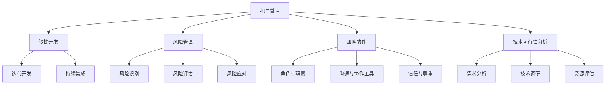

                 

# 技术人如何进行有效的创业项目管理

> **关键词：** 创业项目管理，敏捷开发，风险管理，团队协作，技术可行性分析

> **摘要：** 本文章将深入探讨技术人如何进行有效的创业项目管理。通过介绍敏捷开发原则、风险管理策略、团队协作技巧以及技术可行性分析的方法，帮助技术人在创业项目中取得成功。

## 1. 背景介绍

### 1.1 目的和范围

本文旨在为技术人提供一套系统化的创业项目管理指南，帮助他们在快速变化的市场环境中，确保项目顺利进行并取得成功。文章将涵盖以下内容：

- 敏捷开发原则与实践
- 风险管理策略与方法
- 团队协作技巧
- 技术可行性分析框架

### 1.2 预期读者

本文面向有志于创业或正在参与创业项目的技术人，特别是具备一定编程和软件开发经验，希望提升项目管理能力的读者。同时，也为项目经理和相关领域的专业人士提供参考。

### 1.3 文档结构概述

本文分为以下几个部分：

- 第1部分：背景介绍，包括目的和范围、预期读者以及文档结构概述。
- 第2部分：核心概念与联系，介绍项目管理的核心概念和架构。
- 第3部分：核心算法原理 & 具体操作步骤，讲解敏捷开发的核心原则。
- 第4部分：数学模型和公式 & 详细讲解 & 举例说明，阐述风险管理的方法和模型。
- 第5部分：项目实战：代码实际案例和详细解释说明，通过具体案例展示项目管理方法的应用。
- 第6部分：实际应用场景，探讨项目管理在不同领域的应用。
- 第7部分：工具和资源推荐，为读者提供学习资源和开发工具的建议。
- 第8部分：总结：未来发展趋势与挑战，对创业项目管理的发展趋势进行展望。
- 第9部分：附录：常见问题与解答，回答读者可能遇到的问题。
- 第10部分：扩展阅读 & 参考资料，提供进一步的阅读建议和资料来源。

### 1.4 术语表

#### 1.4.1 核心术语定义

- **创业项目**：指以创新技术和产品为核心，旨在创造商业价值的项目。
- **敏捷开发**：一种以迭代和增量方式进行软件开发的方法，强调灵活性和适应性。
- **风险管理**：识别、评估和应对项目风险的过程。
- **团队协作**：团队成员之间通过有效沟通和合作，共同实现项目目标的过程。

#### 1.4.2 相关概念解释

- **MVP（最小可行性产品）**：一种产品开发策略，通过构建功能最基本的产品版本，验证市场需求。
- **Scrum**：一种敏捷开发框架，强调迭代和快速反馈。
- **看板（Kanban）**：一种可视化工作流程的管理工具。

#### 1.4.3 缩略词列表

- **MVP**：最小可行性产品
- **Scrum**：敏捷开发框架
- **Kanban**：看板

## 2. 核心概念与联系

项目管理是创业成功的关键之一，而敏捷开发、风险管理、团队协作和技术可行性分析则是实现项目管理目标的重要支柱。以下是对这些核心概念及其相互关系的概述。

### 2.1 敏捷开发原理

敏捷开发是一种应对快速变化的需求的软件开发方法。其核心原则包括：

- **个体和互动重于过程与工具**：强调团队成员之间的沟通和合作。
- **可工作的软件重于详尽的文档**：优先交付可运行的软件，而非大量文档。
- **客户协作重于合同谈判**：与客户紧密合作，确保需求得到及时响应。
- **响应变化重于遵循计划**：灵活应对变化，以适应市场和环境的变化。

### 2.2 风险管理

风险管理是确保项目成功的关键环节。以下步骤是进行风险管理的核心：

1. **风险识别**：识别项目中的潜在风险。
2. **风险评估**：评估每个风险的可能性和影响。
3. **风险应对**：制定应对策略，降低风险的影响。
4. **风险监控**：持续监控项目风险，确保应对措施的有效性。

### 2.3 团队协作

团队协作是项目成功的关键因素。有效的团队协作需要：

- **明确的角色和职责**：确保每个团队成员都清楚自己的角色和职责。
- **沟通与协作工具**：使用合适的工具，如团队协作软件、看板等，提高工作效率。
- **信任与尊重**：建立团队成员之间的信任和尊重，鼓励开放和坦诚的沟通。

### 2.4 技术可行性分析

技术可行性分析是确保项目在技术层面的可行性。以下步骤是进行技术可行性分析的核心：

1. **需求分析**：分析项目需求，明确项目目标。
2. **技术调研**：调研现有技术，评估其是否满足项目需求。
3. **资源评估**：评估项目所需的资源，包括人力、资金和设备。
4. **风险评估**：评估项目在技术层面的风险。

### 2.5 Mermaid 流程图

以下是一个简化的 Mermaid 流程图，展示了项目管理中的核心概念及其相互关系：



通过上述流程图，可以清晰地看出各个核心概念之间的联系和互动，为后续的详细讲解打下基础。

## 3. 核心算法原理 & 具体操作步骤

在创业项目管理中，敏捷开发是一种常用的方法，其核心原则包括迭代开发、持续集成和快速反馈。以下将详细讲解敏捷开发的核心算法原理和具体操作步骤。

### 3.1 敏捷开发原则

敏捷开发的核心原则可以总结为以下几点：

- **迭代开发**：将项目分为多个迭代周期，每个迭代周期通常持续2-4周。在每个迭代周期内，团队会开发并交付一个可工作的软件版本。
- **持续集成**：通过自动化测试和持续集成工具，确保代码的质量和项目的稳定性。每次提交代码后，都会进行自动化测试，以确保新代码不会破坏现有功能。
- **快速反馈**：与客户和利益相关者保持紧密沟通，收集反馈并进行迭代优化。快速反馈有助于及时发现问题，并调整项目方向。

### 3.2 敏捷开发的操作步骤

以下是一个简化的敏捷开发操作步骤，用于指导项目团队进行项目管理：

1. **需求收集**：与客户和利益相关者沟通，明确项目需求。
2. **迭代计划**：根据需求，规划每个迭代周期的目标和工作内容。
3. **迭代执行**：团队按照迭代计划进行开发，并确保在每个迭代周期内交付一个可工作的软件版本。
4. **测试与反馈**：在每个迭代周期结束后，进行自动化测试和用户测试，收集反馈并进行优化。
5. **迭代回顾**：团队对每个迭代周期进行回顾，总结经验教训，改进项目执行过程。

### 3.3 伪代码示例

以下是一个简化的伪代码示例，用于说明敏捷开发的基本流程：

```python
# 敏捷开发伪代码示例

# 需求收集
需求 = 收集需求()

# 迭代计划
迭代周期 = 2  # 假设每个迭代周期为2周
迭代计划 = 规划迭代目标和工作内容()

# 迭代执行
for 迭代次数 in range(1, 总迭代次数 + 1):
    执行迭代计划()
    if 迭代次数 % 迭代周期 == 0:
        # 迭代周期结束，进行测试与反馈
        测试与反馈()
    else:
        # 迭代周期未结束，继续开发
        继续开发()

# 迭代回顾
迭代回顾()
```

通过上述伪代码示例，可以清晰地看出敏捷开发的基本流程和操作步骤。

## 4. 数学模型和公式 & 详细讲解 & 举例说明

在项目管理中，数学模型和公式可以帮助我们更准确地评估风险、预测项目进度，并制定合理的应对策略。以下将介绍几个常用的数学模型和公式，并详细讲解其应用。

### 4.1 风险评估模型

风险评估是项目管理中的关键环节。以下是一个常用的风险评估模型：

**公式：**
\[ R = P \times I \]
- **R（风险值）**：表示项目面临的风险程度。
- **P（概率）**：表示风险事件发生的概率。
- **I（影响）**：表示风险事件发生后的影响程度。

**详细讲解：**
- **概率**：通常根据历史数据和专家意见进行估算，取值范围在0到1之间。
- **影响**：影响程度可以根据项目的具体情况进行量化，如时间延迟、成本增加、质量下降等。

**举例说明：**
假设项目A面临一个风险，其发生的概率为0.4，发生后的影响程度为3（表示对项目进度有较大的负面影响）。则该风险的风险值为：
\[ R = 0.4 \times 3 = 1.2 \]

### 4.2 蒙特卡罗模拟

蒙特卡罗模拟是一种常用的风险预测方法，通过随机模拟来评估项目进度和成本。

**公式：**
\[ E(X) = \sum_{i=1}^{n} p_i \times x_i \]
- **E（期望值）**：表示项目进度或成本的平均值。
- **\( p_i \)（概率）**：表示每个可能值发生的概率。
- **\( x_i \)（可能值）**：表示每个可能值的具体数值。

**详细讲解：**
- **概率**：可以通过历史数据或专家意见进行估算。
- **可能值**：根据项目的具体情况，列出所有可能的结果。

**举例说明：**
假设项目B的进度有三种可能的结果：提前完成、按计划完成、延期完成。其概率分别为0.3、0.5、0.2，对应的进度值分别为-1周、0周、1周。则项目B的期望进度为：
\[ E(X) = 0.3 \times (-1) + 0.5 \times 0 + 0.2 \times 1 = 0.1 \]

### 4.3 回归模型

回归模型是一种常用的预测方法，通过分析历史数据，建立数学模型来预测未来结果。

**公式：**
\[ Y = a + bX \]
- **Y（预测值）**：表示项目进度或成本。
- **a（常数项）**：表示固定成本或基准值。
- **b（系数）**：表示变量对预测值的影响程度。

**详细讲解：**
- **常数项**：通常表示项目的固定成本或基准值。
- **系数**：根据历史数据进行回归分析得到，表示变量对预测值的影响程度。

**举例说明：**
假设项目C的历史数据表明，项目进度与投入的人力资源成正比。通过回归分析，得到回归方程为：
\[ Y = 100 + 20X \]
其中，\( X \)表示投入的人力资源（人天）。如果项目C计划投入100人天，则预测的进度为：
\[ Y = 100 + 20 \times 100 = 2100 \]

通过上述数学模型和公式的讲解，我们可以更好地评估风险、预测项目进度和成本，为项目管理的决策提供有力支持。

## 5. 项目实战：代码实际案例和详细解释说明

为了更好地理解创业项目管理的方法和技巧，我们将通过一个实际的项目案例，详细展示项目管理的过程，包括开发环境搭建、源代码实现和代码解读与分析。

### 5.1 开发环境搭建

在这个案例中，我们将开发一个简单的在线购物平台，使用Python和Django框架进行开发。以下是开发环境搭建的步骤：

1. 安装Python：确保已安装Python 3.8及以上版本。
2. 安装Django：通过pip命令安装Django：
   ```bash
   pip install django
   ```
3. 创建Django项目：使用以下命令创建一个新的Django项目：
   ```bash
   django-admin startproject shopping_platform
   ```
4. 创建应用：进入项目目录，创建一个名为“products”的应用：
   ```bash
   python manage.py startapp products
   ```

### 5.2 源代码详细实现和代码解读

在开发环境中搭建完成后，我们开始实现项目的核心功能。以下是项目的源代码及其详细解读：

#### 5.2.1 products/models.py

```python
from django.db import models

class Product(models.Model):
    name = models.CharField(max_length=255)
    description = models.TextField()
    price = models.DecimalField(max_digits=6, decimal_places=2)
    stock = models.IntegerField()

    def __str__(self):
        return self.name
```

**解读：**
- `Product` 类是一个数据模型，用于表示商品。它包含以下字段：
  - `name`：商品的名称，使用 `CharField` 定义，最大长度为255个字符。
  - `description`：商品的描述，使用 `TextField` 定义，允许输入任意长度的文本。
  - `price`：商品的价格，使用 `DecimalField` 定义，确保价格的小数位数为2。
  - `stock`：商品的库存数量，使用 `IntegerField` 定义。

#### 5.2.2 products/views.py

```python
from django.shortcuts import render
from .models import Product

def product_list(request):
    products = Product.objects.all()
    return render(request, 'products/product_list.html', {'products': products})
```

**解读：**
- `product_list` 函数是一个视图函数，用于处理商品列表页的请求。它从数据库中获取所有商品，并将它们传递给模板。
- `Product.objects.all()`：使用 Django 的 ORM 查询所有商品。

#### 5.2.3 products/urls.py

```python
from django.urls import path
from .views import product_list

urlpatterns = [
    path('', product_list, name='product_list'),
]
```

**解读：**
- `urlpatterns` 列表定义了应用中的路由。`path()` 函数用于将URL映射到视图函数。
- `path('')`：匹配应用根路径，将请求重定向到 `product_list` 视图函数。

#### 5.2.4 products/templates/product_list.html

```html
<!DOCTYPE html>
<html>
<head>
    <title>商品列表</title>
</head>
<body>
    <h1>商品列表</h1>
    <ul>
        
            <li>
                <h2>{{ product.name }}</h2>
                <p>{{ product.description }}</p>
                <p>价格：{{ product.price }}</p>
                <p>库存：{{ product.stock }}</p>
            </li>
        
    </ul>
</body>
</html>
```

**解读：**
- 模板文件 `product_list.html` 用于渲染商品列表页面。它包含以下部分：
  - `<title>`：设置网页标题。
  - `<h1>`：标题“商品列表”。
  - `<ul>` 和 `<li>`：用于遍历和显示商品列表。
  - ``：遍历商品列表，将每个商品显示在列表项中。
  - ``：结束遍历。

### 5.3 代码解读与分析

通过上述代码实现，我们可以看到项目的核心功能是展示商品列表。在代码解读与分析中，我们关注以下几个方面：

1. **模型设计**：`Product` 模型设计简洁明了，包含了商品的基本字段。这有助于确保数据的一致性和完整性。
2. **视图函数**：`product_list` 视图函数实现了获取商品列表和渲染模板的基本功能。通过 Django 的 ORM，我们可以轻松地与数据库进行交互。
3. **路由配置**：路由配置将应用根路径映射到 `product_list` 视图函数，确保用户访问应用时能够正确地显示商品列表。
4. **模板渲染**：模板文件 `product_list.html` 使用 Django 的模板语言，实现了动态渲染商品列表的功能。这有助于提高代码的可维护性和可扩展性。

通过上述实战案例，我们不仅能够看到项目管理方法在实际项目中的应用，还能够深入了解项目的开发过程。这对于技术人在创业项目中提升项目管理能力具有重要的参考价值。

## 6. 实际应用场景

创业项目管理在多个领域中有着广泛的应用，以下列举几个实际应用场景，并展示如何运用项目管理方法。

### 6.1 金融科技领域

在金融科技（FinTech）领域，创业项目通常涉及复杂的算法和大量的数据处理。以下是一个应用场景：

**应用场景**：开发一个智能投顾平台

**项目管理方法**：
- **需求分析**：与客户和利益相关者进行沟通，了解投资策略、风险偏好和用户需求。
- **敏捷开发**：采用Scrum框架，将项目分为多个迭代周期，每个迭代周期专注于开发一个功能模块。
- **风险管理**：定期评估算法的准确性和稳定性，确保投资建议的可靠性和风险可控。
- **团队协作**：使用看板（Kanban）工具，可视化工作流程，提高团队协作效率。

### 6.2 健康科技领域

在健康科技（HealthTech）领域，创业项目通常涉及医疗数据的处理和分析。以下是一个应用场景：

**应用场景**：开发一个远程医疗咨询平台

**项目管理方法**：
- **需求分析**：了解医疗专家的需求，确定平台所需的功能，如在线咨询、病历管理、医学图像分析等。
- **敏捷开发**：采用Scrum框架，快速迭代开发，确保平台功能不断完善。
- **风险管理**：评估数据隐私和安全性，确保用户数据得到妥善保护。
- **团队协作**：使用团队协作工具，如Slack或Microsoft Teams，确保团队成员之间的沟通畅通。

### 6.3 教育科技领域

在教育科技（EdTech）领域，创业项目通常涉及在线教育平台和智能学习系统的开发。以下是一个应用场景：

**应用场景**：开发一个在线学习平台

**项目管理方法**：
- **需求分析**：与教育专家和学生进行沟通，了解学习需求和学习方式。
- **敏捷开发**：采用Scrum框架，快速迭代开发，确保平台功能的不断完善。
- **风险管理**：评估平台的技术可行性，确保系统的稳定性和性能。
- **团队协作**：使用看板（Kanban）工具，可视化学习资源开发和课程设计流程，提高团队协作效率。

通过上述实际应用场景，我们可以看到创业项目管理方法在各个领域的应用。无论在哪个行业，敏捷开发、风险管理、团队协作和技术可行性分析都是确保项目成功的关键因素。

## 7. 工具和资源推荐

在创业项目管理过程中，选择合适的工具和资源对于提高项目效率和质量至关重要。以下是对学习资源、开发工具框架及相关论文著作的推荐。

### 7.1 学习资源推荐

#### 7.1.1 书籍推荐

1. **《敏捷开发实践指南》（Agile Project Management: Creating Innovative Products》）** - by Jim Highsmith
   - 这本书提供了敏捷开发的全景视图，包括原则、方法和实践。

2. **《Scrum精髓：了解Scrum、XP和精益，掌握现代软件开发方法》（Scrum: The Art of Doing Twice the Work in Half the Time》）** - by Jeff Sutherland
   - 这本书详细介绍了Scrum方法，并提供了丰富的实战经验和案例。

3. **《项目管理知识体系指南》（Project Management Institute）** - PMI
   - 这本书是项目管理领域的权威指南，涵盖了项目管理的各个层面和最佳实践。

#### 7.1.2 在线课程

1. **《敏捷项目管理》（Agile Project Management》** - Coursera
   - 这门课程由著名的敏捷专家Roberto A. F. Tavares授课，涵盖了敏捷开发的核心原则和实践。

2. **《Scrum Master认证课程》（Scrum Master Certified Training》** - Scrum Alliance
   - 这门课程由Scrum Alliance提供，为Scrum Master提供了全面的培训，包括Scrum框架、角色和流程。

3. **《项目管理基础》（Introduction to Project Management》** - edX
   - 这门课程由著名大学提供，涵盖了项目管理的核心概念和基本技能。

#### 7.1.3 技术博客和网站

1. **《敏捷联盟》（Agile Alliance）** - https://www.agilealliance.org/
   - Agile Alliance提供了丰富的敏捷开发资源和社区支持，是敏捷开发者的必备网站。

2. **《Scrum指南》（Scrum Guide）** - https://www.scrumguides.org/
   - Scrum Guide是Scrum方法的官方文档，提供了Scrum框架的详细说明和最佳实践。

3. **《Django官方文档》（Django Documentation）** - https://docs.djangoproject.com/
   - Django官方文档是学习Django框架的最佳资源，涵盖了框架的各个方面，包括安装、配置和用法。

### 7.2 开发工具框架推荐

#### 7.2.1 IDE和编辑器

1. **PyCharm** - PyCharm是Python编程的强大IDE，提供了丰富的功能和插件，支持Django开发。

2. **Visual Studio Code** - Visual Studio Code是一款轻量级的代码编辑器，通过插件支持多种编程语言，包括Python。

#### 7.2.2 调试和性能分析工具

1. **Django Debug Toolbar** - Django Debug Toolbar是一个用于Django项目的调试工具，提供了丰富的调试信息，如数据库查询、响应时间等。

2. **New Relic** - New Relic是一个性能监控工具，可以实时监控Django项目的性能，并提供优化建议。

#### 7.2.3 相关框架和库

1. **Django** - Django是一个强大的Python Web框架，适用于快速开发和部署Web应用。

2. **Flask** - Flask是一个轻量级的Python Web框架，适用于小型项目和原型开发。

3. **Django REST framework** - Django REST framework是一个用于构建RESTful API的扩展库，与Django框架紧密结合。

### 7.3 相关论文著作推荐

#### 7.3.1 经典论文

1. **《敏捷软件开发宣言》（Manifesto for Agile Software Development》）** - Agile Alliance
   - 这篇宣言总结了敏捷开发的核心理念和原则。

2. **《Scrum方法论》（Scrum: The Art of Doing Twice the Work in Half the Time》）** - Jeff Sutherland
   - 这篇论文详细介绍了Scrum方法的原理和实践。

#### 7.3.2 最新研究成果

1. **《敏捷开发实践研究》（Empirical Studies of Agile Software Development》）** - Springer
   - 这本书总结了敏捷开发的最新研究成果和实践经验。

2. **《敏捷项目管理的研究进展》（Advances in Agile Project Management》）** - IGI Global
   - 这本书探讨了敏捷项目管理的最新研究进展和应用。

#### 7.3.3 应用案例分析

1. **《敏捷项目管理的成功案例》（Success Stories in Agile Project Management》）** - Apress
   - 这本书通过实际案例展示了敏捷项目管理的成功实践。

通过上述工具和资源的推荐，读者可以更系统地学习和掌握创业项目管理的方法和技巧，为项目的成功奠定坚实基础。

## 8. 总结：未来发展趋势与挑战

随着科技的快速发展，创业项目管理也将面临新的机遇和挑战。以下是对未来发展趋势与挑战的总结：

### 8.1 未来发展趋势

1. **数字化转型加速**：数字化转型已经成为企业发展的必然趋势，创业项目将更加注重数字化技术的应用，如人工智能、大数据和区块链等。
2. **敏捷开发方法普及**：敏捷开发以其灵活性和适应性，将在更多创业项目中得到应用，成为项目管理的标准方法。
3. **持续集成和持续交付**：持续集成和持续交付（CI/CD）将成为开发团队的标准工作流程，提高项目交付速度和质量。
4. **云计算和容器化**：云计算和容器化技术将进一步降低创业项目的开发成本，提高项目的可扩展性和可靠性。
5. **数据隐私和安全**：随着数据隐私和安全问题的日益突出，创业项目将更加注重数据保护，采用更严格的安全措施。

### 8.2 未来挑战

1. **技术复杂性**：随着技术的快速发展，创业项目面临的技术复杂性将不断增加，对技术团队的要求也将更高。
2. **市场变化**：市场需求和技术环境的变化速度加快，创业项目需要更加灵活和快速地应对变化。
3. **人才短缺**：优秀的技术人才短缺将成为创业项目面临的重要挑战，如何吸引和留住优秀人才将是关键。
4. **项目管理成熟度**：许多创业项目在项目管理方面仍然不够成熟，如何提升项目管理水平，确保项目顺利进行，是未来的重要任务。
5. **可持续性**：创业项目在追求短期利益的同时，也需要考虑长期可持续性，实现社会责任和可持续发展。

总之，未来创业项目管理将面临更多的挑战和机遇。技术人需要不断提升自身能力，适应市场变化，掌握先进的项目管理方法，确保项目的成功实施。

## 9. 附录：常见问题与解答

### 9.1 问题1：敏捷开发与传统的瀑布开发有何区别？

**解答：**
敏捷开发与传统的瀑布开发主要区别在于开发流程和理念。瀑布开发是一种线性、顺序的开发方法，各个开发阶段依次进行，前一阶段完成后才能进入下一阶段。而敏捷开发则强调迭代和增量开发，将整个项目分为多个迭代周期，每个迭代周期完成一部分功能，并进行测试和反馈。敏捷开发更加灵活，能够快速响应需求变化，适用于快速变化的市场环境。

### 9.2 问题2：如何在创业项目中进行有效的风险管理？

**解答：**
在创业项目中，有效的风险管理包括以下步骤：

1. **风险识别**：通过专家访谈、文献调研和项目经验，识别项目可能面临的风险。
2. **风险评估**：评估每个风险的概率和影响，确定风险等级。
3. **风险应对**：根据风险等级，制定应对策略，如风险规避、风险减轻、风险接受等。
4. **风险监控**：在项目执行过程中，持续监控风险的变化，确保应对措施的有效性。

### 9.3 问题3：如何确保团队协作效率？

**解答：**
确保团队协作效率可以从以下几个方面入手：

1. **明确角色和职责**：确保每个团队成员都清楚自己的角色和职责，减少职责冲突。
2. **沟通与协作工具**：使用合适的团队协作工具，如Slack、Microsoft Teams或JIRA，提高沟通效率。
3. **定期会议**：定期召开团队会议，讨论项目进展和问题，确保团队成员之间的信息同步。
4. **信任与尊重**：建立团队成员之间的信任和尊重，鼓励开放和坦诚的沟通。

### 9.4 问题4：如何进行技术可行性分析？

**解答：**
技术可行性分析可以从以下几个方面进行：

1. **需求分析**：明确项目需求，分析技术方案是否能够满足需求。
2. **技术调研**：调研现有技术，评估其是否适用于项目。
3. **资源评估**：评估项目所需的资源，包括人力、资金和设备。
4. **风险评估**：评估项目在技术层面的风险，如技术复杂度、安全性等。

通过上述步骤，可以全面评估项目的技术可行性，为项目决策提供依据。

## 10. 扩展阅读 & 参考资料

为了帮助读者更深入地了解创业项目管理，以下提供一些扩展阅读和参考资料：

### 10.1 扩展阅读

1. **《项目管理知识体系指南》（PMBOK Guide》** - Project Management Institute
   - 这是项目管理领域的权威指南，详细介绍了项目管理的方法和流程。

2. **《敏捷实践指南》（Agile Practice Guide》** - Project Management Institute
   - 这本书介绍了敏捷开发的原理和实践，适用于希望采用敏捷方法的项目团队。

3. **《精益创业》（The Lean Startup》** - Eric Ries
   - 这本书提出了精益创业的方法，帮助创业者以最小可行性产品（MVP）快速验证市场假设。

### 10.2 参考资料

1. **敏捷联盟（Agile Alliance）** - https://www.agilealliance.org/
   - 提供了敏捷开发的资源、社区和支持。

2. **Scrum指南（Scrum Guide）** - https://www.scrumguide.org/
   - 提供了Scrum方法的官方指南和最佳实践。

3. **Django官方文档** - https://docs.djangoproject.com/
   - Django框架的官方文档，涵盖了框架的各个方面。

通过这些扩展阅读和参考资料，读者可以进一步了解创业项目管理的相关理论和实践，提升项目管理能力。

**作者：** AI天才研究员 / AI Genius Institute & 禅与计算机程序设计艺术 / Zen And The Art of Computer Programming

