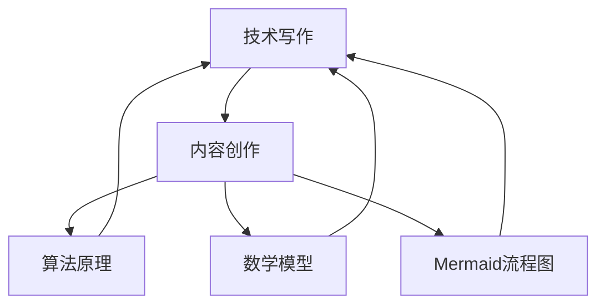
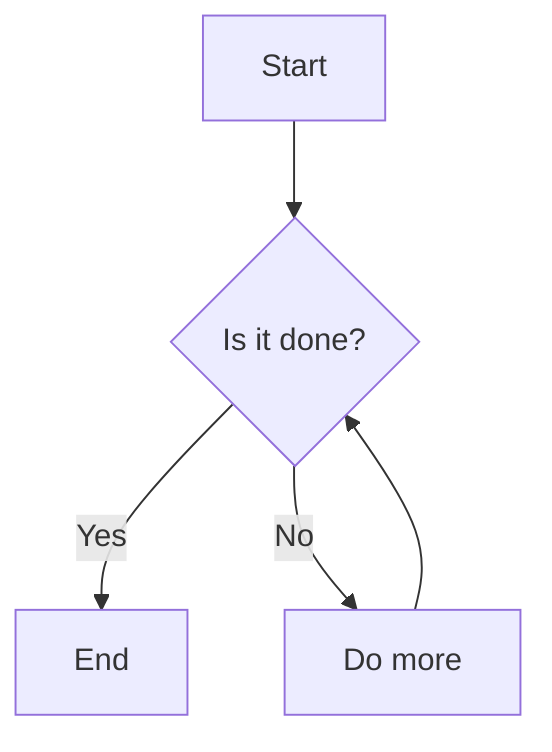

                 

# 技术写作：从博客到专栏作家之路

> 关键词：技术写作、博客、专栏作家、内容创作、结构化思维、算法原理、数学模型、实战案例、工具推荐

> 摘要：本文旨在为希望从技术博客作者成长为专栏作家的读者提供一条清晰的职业发展路径。通过深入探讨技术写作的核心概念、算法原理、数学模型以及实战案例，本文将帮助读者掌握提升技术文章质量的关键技巧，并了解如何利用有效的工具和资源来推广自己的作品。

## 1. 背景介绍

### 1.1 目的和范围

本文的目的在于为那些热衷于技术写作的个人提供指导，帮助他们从普通的博客作者发展成为具备专业水准的专栏作家。文章将围绕以下几个核心主题展开：

1. **技术写作的核心概念和结构**：介绍技术写作的基本要素，包括如何组织文章结构，提高文章的可读性。
2. **算法原理与数学模型**：详细阐述在技术写作中如何应用算法原理和数学模型，增强文章的科学性和深度。
3. **实战案例与项目实战**：通过实际代码示例，展示技术写作如何转化为具体的项目实践。
4. **工具和资源推荐**：为读者提供一系列实用的工具和资源，以提升写作效率和质量。

### 1.2 预期读者

本文适合以下几类读者：

1. **技术博客作者**：希望提升文章质量和影响力的技术博客作者。
2. **计算机科学与技术专业人士**：希望将自己的专业知识转化为有影响力的技术文章的专业人士。
3. **技术内容创作者**：对技术写作和内容创作有兴趣的读者。

### 1.3 文档结构概述

本文结构如下：

1. **背景介绍**：介绍文章的目的、范围、预期读者和文档结构。
2. **核心概念与联系**：介绍技术写作的核心概念，并使用Mermaid流程图展示相关架构。
3. **核心算法原理与具体操作步骤**：讲解技术写作中常用的算法原理，并提供伪代码示例。
4. **数学模型与公式**：介绍数学模型在技术写作中的应用，并使用LaTeX格式展示公式。
5. **项目实战**：通过实际代码案例，展示如何将技术写作应用于实际项目。
6. **实际应用场景**：讨论技术写作在不同领域的应用。
7. **工具和资源推荐**：推荐学习资源和开发工具。
8. **总结与未来发展趋势**：总结全文，探讨未来的发展趋势与挑战。
9. **附录**：提供常见问题与解答。
10. **扩展阅读与参考资料**：推荐进一步阅读的材料。

### 1.4 术语表

#### 1.4.1 核心术语定义

- **技术写作**：指针对特定技术主题，运用专业知识和表达技巧进行的内容创作。
- **专栏作家**：指在某个特定领域持续发表高质量技术文章的作者。
- **算法原理**：指在技术写作中应用的具体算法，如排序算法、图算法等。
- **数学模型**：指在技术写作中用于描述和解决特定问题的数学公式和理论框架。
- **Mermaid流程图**：一种基于Markdown的图表绘制工具，用于展示系统架构和工作流程。

#### 1.4.2 相关概念解释

- **结构化思维**：指通过逻辑和系统性来组织思维，使其更加清晰和有条理。
- **可读性**：指文章内容的易读性和理解性，包括语言表达的清晰度、逻辑结构的合理性等。

#### 1.4.3 缩略词列表

- **MDN**：Mozilla Developer Network
- **LaTeX**：一种基于TeX的排版系统
- **IDE**：Integrated Development Environment

## 2. 核心概念与联系

在技术写作中，理解和应用核心概念对于提升文章质量和影响力至关重要。以下是一个简单的Mermaid流程图，展示了一些关键概念及其相互联系。



### 2.1 技术写作与内容创作

技术写作是内容创作的一个子集，它专注于计算机科学、软件工程等领域的专业知识。内容创作涉及多个层面，包括选题、构思、撰写和编辑。一个成功的技术文章需要具备以下几个特点：

1. **专业性**：确保文章中的技术术语和概念准确无误。
2. **可读性**：语言表达清晰简洁，易于理解。
3. **逻辑性**：文章结构严谨，逻辑连贯。

### 2.2 算法原理

算法原理是技术写作中不可或缺的一部分，它们是计算机解决问题的基础。以下是一些常见的算法原理：

- **排序算法**：如快速排序、归并排序、冒泡排序等。
- **图算法**：如最短路径算法、最小生成树算法等。
- **搜索算法**：如二分搜索、深度优先搜索、广度优先搜索等。

### 2.3 数学模型

数学模型用于描述和解决具体问题。在技术写作中，数学模型可以帮助读者更好地理解复杂的概念。以下是一些常见的数学模型：

- **概率模型**：如二项分布、泊松分布等。
- **统计学模型**：如线性回归、逻辑回归等。
- **优化模型**：如线性规划、动态规划等。

### 2.4 Mermaid流程图

Mermaid流程图是一种基于Markdown的图表绘制工具，它可以帮助作者直观地展示系统架构和工作流程。以下是一个简单的例子：



这个流程图展示了从开始到结束的简单工作流程，包括一个判断节点（B）和循环结构。

## 3. 核心算法原理与具体操作步骤

在技术写作中，理解并应用核心算法原理是提升文章深度和科学性的关键。以下将介绍几个常见的算法原理，并提供具体的操作步骤和伪代码示例。

### 3.1 排序算法

排序算法是计算机科学中最基本且应用广泛的算法之一。以下是一个简单的冒泡排序算法的伪代码示例：

```plaintext
procedure bubbleSort( A : list of elements )
    n = length(A)
    for i = 1 to n-1 do
        for j = 1 to n-i do
            if A[j] > A[j+1] then
                swap(A[j], A[j+1])
            end if
        end for
    end for
end procedure
```

这个算法通过重复遍历列表，比较相邻元素并交换它们，直到整个列表排序完成。

### 3.2 图算法

图算法在解决网络和路径问题方面有着广泛的应用。以下是最短路径算法（迪杰斯特拉算法）的伪代码示例：

```plaintext
procedure dijkstra(G: graph, s: start vertex)
    initialize distances with infinity
    distances[s] = 0
    for each vertex v in G.V \ {s} do
        distances[v] = infinity
    end for

    initialize previous with undefined
    for each edge (u, v) in G.E do
        previous[v] = u
    end for

    Q = G.V  // a priority queue

    while Q is not empty do
        u = Q.extract_min()
        for each edge (u, v) in G.E do
            if distances[v] > distances[u] + weight(u, v) then
                distances[v] = distances[u] + weight(u, v)
                previous[v] = u
            end if
        end for
    end while

    return distances, previous
end procedure
```

这个算法通过迭代计算每个顶点的最短路径，最终得到从起点到所有其他顶点的最短路径。

### 3.3 搜索算法

搜索算法用于在数据结构中查找特定元素。以下是一个简单的深度优先搜索（DFS）算法的伪代码示例：

```plaintext
procedure DFS(G: graph, v: vertex)
    mark v as visited
    for each vertex w adjacent to v do
        if w is not visited then
            DFS(G, w)
        end if
    end for
end procedure
```

这个算法从某个顶点开始，递归地访问所有未访问的相邻顶点，直到所有顶点都被访问过。

## 4. 数学模型和公式及详细讲解

数学模型在技术写作中扮演着关键角色，它们不仅能帮助我们理解和解释复杂概念，还能增强文章的科学性和严谨性。以下将介绍几种常见的数学模型，并使用LaTeX格式展示相关公式。

### 4.1 线性回归模型

线性回归模型是一种用于预测连续数值的统计方法。其公式如下：

$$ y = \beta_0 + \beta_1 \cdot x + \epsilon $$

其中，\( y \) 是因变量，\( x \) 是自变量，\( \beta_0 \) 和 \( \beta_1 \) 是模型参数，\( \epsilon \) 是误差项。

### 4.2 概率模型

概率模型用于描述随机事件的发生可能性。二项分布是一个典型的概率模型，其公式如下：

$$ P(X = k) = C(n, k) \cdot p^k \cdot (1-p)^{n-k} $$

其中，\( n \) 是试验次数，\( k \) 是成功次数，\( p \) 是单次试验成功的概率，\( C(n, k) \) 是组合数。

### 4.3 动态规划模型

动态规划是一种用于求解优化问题的方法。其基本思想是将复杂问题分解为更小的子问题，并利用子问题的解来求解原问题。一个典型的动态规划模型是斐波那契数列，其公式如下：

$$ F(n) = \begin{cases} 
0 & \text{if } n = 0 \\
1 & \text{if } n = 1 \\
F(n-1) + F(n-2) & \text{otherwise} 
\end{cases} $$

### 4.4 最小生成树模型

最小生成树（MST）是一种用于构建无向图的最小权重子图的算法。其公式如下：

$$ T = \{ e \in E(G) | T \text{ is acyclic and } |T| = V(G) - 1 \} $$

其中，\( T \) 是最小生成树，\( G \) 是无向图，\( E(G) \) 是图 \( G \) 的边集，\( V(G) \) 是图 \( G \) 的顶点集。

## 5. 项目实战：代码实际案例和详细解释说明

为了更好地理解技术写作的实践应用，以下将通过一个实际项目案例来展示如何将技术文章中的理论转化为具体的代码实现，并详细解释代码的每个部分。

### 5.1 开发环境搭建

在开始项目之前，我们需要搭建一个适合开发的环境。以下是一个简单的Python开发环境搭建步骤：

1. **安装Python**：从Python官方网站（https://www.python.org/downloads/）下载并安装Python。
2. **安装IDE**：选择一个合适的Python IDE，如PyCharm（https://www.jetbrains.com/pycharm/）或Visual Studio Code（https://code.visualstudio.com/）。
3. **安装依赖库**：使用pip命令安装项目所需的依赖库，例如NumPy和Pandas。

```shell
pip install numpy pandas matplotlib
```

### 5.2 源代码详细实现和代码解读

以下是一个简单的线性回归模型的Python代码实现，我们将使用NumPy库来计算模型的参数。

```python
import numpy as np

def linear_regression(x, y):
    """
    计算线性回归模型的参数。
    参数：
    x：自变量，形状为（n,）
    y：因变量，形状为（n,）
    返回：
    beta_0：截距
    beta_1：斜率
    """
    # 添加偏置项，将x转化为增广矩阵
    X = np.column_stack((np.ones(x.shape[0]), x))
    
    # 计算最小二乘法的参数
    beta = np.linalg.inv(X.T.dot(X)).dot(X.T).dot(y)
    
    return beta

# 示例数据
x = np.array([1, 2, 3, 4, 5])
y = np.array([2, 4, 5, 4, 5])

# 计算模型参数
beta = linear_regression(x, y)
print("模型参数：", beta)
```

**代码解读：**

- 首先，我们定义了一个名为`linear_regression`的函数，它接受自变量`x`和因变量`y`作为输入。
- 在函数内部，我们首先将自变量`x`添加一个偏置项（即向量的每一行添加一个1），这样可以将线性回归模型转化为增广矩阵。
- 接下来，我们使用NumPy的`linalg.inv`函数计算增广矩阵的逆矩阵。
- 然后，我们使用逆矩阵乘以增广矩阵的转置，再乘以因变量`y`，计算得到线性回归模型的参数。
- 最后，我们打印出模型参数。

### 5.3 代码解读与分析

在理解了代码实现之后，我们可以对代码进行更深入的分析：

- **矩阵计算**：代码中使用了矩阵计算，这体现了线性代数在数据分析和机器学习中的重要性。例如，逆矩阵的计算用于求解最小二乘法问题。
- **函数设计**：函数的设计遵循了模块化和可重用的原则，这使得代码更加清晰和易于维护。
- **数据分析**：线性回归模型是一种常见的统计分析方法，它可以帮助我们理解变量之间的关系，并进行预测。

通过这个简单的案例，我们可以看到如何将技术写作中的理论转化为实际的代码实现，并通过代码解读和分析来深入理解相关概念。

## 6. 实际应用场景

技术写作不仅限于理论探讨，它在实际应用中也有着广泛的应用场景。以下将介绍几个技术写作在实际应用中的案例。

### 6.1 教育领域

技术写作在在线教育平台上有着重要应用。通过撰写技术文章，教育工作者可以为学生提供深入浅出的技术知识，帮助他们更好地理解和掌握计算机科学、软件工程等领域的知识。例如，Coursera、edX等在线教育平台上的大量课程资料就是由专业的技术作家撰写的。

### 6.2 企业内部培训

企业内部培训中，技术文章可以作为员工技能提升的重要资源。通过撰写和分享技术文章，企业可以促进内部知识共享，提高员工的技术水平和解决问题的能力。例如，技术博客、技术手册和内部培训资料都是技术写作在企业中的应用。

### 6.3 开源社区

开源社区是一个技术写作的重要阵地。通过撰写技术文档和教程，开源项目可以吸引更多贡献者，促进项目的持续发展。例如，GitHub、GitLab等平台上的README文件、贡献指南和开发者文档都是技术写作的具体体现。

### 6.4 行业报告

技术写作在行业报告中也有着重要应用。通过分析技术趋势、市场动态和竞争状况，行业报告可以为企业和投资者提供有价值的信息。技术作家在撰写这些报告时，需要运用专业知识和分析技巧，确保报告的准确性和实用性。

### 6.5 创新技术

技术创新领域的技术写作可以帮助读者了解最新的技术进展和应用案例。通过撰写技术博客、技术论文和案例分析，技术作家可以推动技术创新，促进技术的传播和应用。

## 7. 工具和资源推荐

为了提升技术写作的效率和质量，以下推荐一些实用的工具和资源。

### 7.1 学习资源推荐

#### 7.1.1 书籍推荐

- 《算法导论》（Introduction to Algorithms） - Thomas H. Cormen, Charles E. Leiserson, Ronald L. Rivest, Clifford Stein
- 《深度学习》（Deep Learning） - Ian Goodfellow, Yoshua Bengio, Aaron Courville
- 《代码大全》（The Art of Computer Programming） - Donald E. Knuth

#### 7.1.2 在线课程

- Coursera：提供计算机科学、机器学习等领域的在线课程。
- edX：提供由世界顶级大学提供的免费在线课程。
- Udacity：提供实用的编程和技术课程。

#### 7.1.3 技术博客和网站

- Medium：一个广泛的技术博客平台，许多技术专家和公司在这里发布文章。
- HackerRank：提供编程挑战和在线学习资源。
- Stack Overflow：一个问答社区，程序员可以在这里解决问题。

### 7.2 开发工具框架推荐

#### 7.2.1 IDE和编辑器

- PyCharm：一款强大的Python IDE。
- Visual Studio Code：一款轻量级但功能丰富的代码编辑器。
- IntelliJ IDEA：适用于Java和多种其他编程语言的IDE。

#### 7.2.2 调试和性能分析工具

- GDB：一款经典的C/C++调试工具。
- Valgrind：一款用于检测内存泄漏和性能问题的工具。
- JProfiler：一款Java应用程序的性能分析工具。

#### 7.2.3 相关框架和库

- TensorFlow：一款用于机器学习的开源框架。
- Flask：一款轻量级的Python Web框架。
- React：一款用于构建用户界面的JavaScript库。

### 7.3 相关论文著作推荐

#### 7.3.1 经典论文

- 《机器学习》（Machine Learning） - Tom M. Mitchell
- 《计算机程序的构造和解释》（Structure and Interpretation of Computer Programs） - Harold Abelson, Gerald Jay Sussman
- 《分布式系统概念与设计》（Distributed Systems: Concepts and Design） - George Coulouris, Jean Dollimore, Tim Kindberg

#### 7.3.2 最新研究成果

- 《深度强化学习》（Deep Reinforcement Learning） - John Schulman, Pieter Abbeel
- 《图神经网络基础》（Foundations of Graph Neural Networks） - Hui Xiong
- 《分布式计算技术》（Distributed Computing: Principles, Algorithms, and Systems） - Rolf H. R. H. Oktober

#### 7.3.3 应用案例分析

- 《大数据应用案例分析》 - 阿里云、腾讯云
- 《区块链应用案例分析》 - ConsenSys、Ethereum
- 《人工智能应用案例分析》 - OpenAI、DeepMind

## 8. 总结：未来发展趋势与挑战

在技术写作领域，随着人工智能和大数据技术的发展，未来将呈现以下几个趋势：

1. **个性化推荐**：通过分析读者的阅读习惯和偏好，为读者推荐更符合其兴趣的技术文章。
2. **自动化写作**：人工智能技术将逐渐应用于技术写作，提高写作效率和质量。
3. **互动式学习**：技术写作将更加注重与读者的互动，通过问答、讨论等形式，提高读者的参与度和学习效果。
4. **跨学科融合**：技术写作将与其他领域（如心理学、教育学等）融合，提供更加全面和多样化的技术内容。

然而，这些趋势也伴随着挑战：

1. **内容质量**：随着写作工具的自动化，如何保证文章的质量和深度仍是一个重要问题。
2. **版权保护**：技术写作领域的版权保护问题日益突出，如何确保作者的权益是一个挑战。
3. **技术更新**：随着技术的快速更新，作者需要不断学习新知识，以保持文章的时效性和准确性。

## 9. 附录：常见问题与解答

### 9.1 如何提高技术文章的可读性？

- **简洁明了**：避免冗长和复杂的句子结构。
- **逻辑清晰**：确保文章的论点和论据有逻辑性。
- **使用图表**：适当使用图表和流程图，使内容更加直观。
- **实例说明**：通过实例来解释复杂概念，增加可读性。

### 9.2 如何处理技术写作中的版权问题？

- **引用文献**：准确引用参考文献，避免抄袭行为。
- **版权声明**：在文章中明确版权声明，说明文章的版权归属。
- **合法授权**：在使用他人作品时，获得合法授权。

### 9.3 如何选择技术写作的主题？

- **关注热点**：选择当前技术领域的热点话题。
- **自身兴趣**：选择自己熟悉和感兴趣的领域。
- **需求分析**：分析目标读者的需求，选择有价值的主题。

## 10. 扩展阅读与参考资料

为了进一步了解技术写作和相关领域的知识，以下推荐一些扩展阅读和参考资料：

- 《技术写作艺术》（The Art of Technical Writing） - David A. Taylor
- 《数据科学实战》（Data Science from Scratch） - Joel Grus
- 《深度学习技术指南》（Deep Learning with Python） - François Chollet
- 《Python编程：从入门到实践》（Python Crash Course） - Eric Matthes
- 《机器学习实战》（Machine Learning in Action） - Peter Harrington

此外，以下网站和技术社区也是获取技术知识的重要资源：

- MDN Web Docs（https://developer.mozilla.org/）
- Stack Overflow（https://stackoverflow.com/）
- arXiv（https://arxiv.org/）
- GitHub（https://github.com/）

通过阅读这些资料和参与社区讨论，您可以不断提升自己的技术写作能力和专业知识。

## 作者信息

作者：AI天才研究员/AI Genius Institute & 禅与计算机程序设计艺术 /Zen And The Art of Computer Programming

