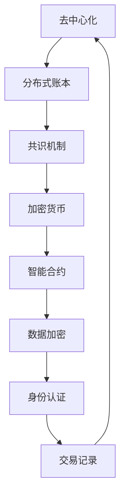

                 

# 技术创业中的区块链应用：去中心化的新机遇

> 关键词：区块链，去中心化，技术创业，智能合约，分布式账本，共识机制，加密货币

> 摘要：本文将探讨区块链技术在技术创业中的应用，深入分析其去中心化的特点、核心概念和架构，以及如何通过智能合约实现自动化交易。我们将通过具体的数学模型和公式、项目实战案例，展示区块链技术在解决实际问题中的潜力和挑战。同时，还将推荐相关学习资源和工具，为读者提供全面的技术指导。

## 1. 背景介绍

### 1.1 目的和范围

本文旨在为技术创业者提供区块链技术的基础知识和应用指南。我们将逐步解析区块链的核心概念，包括去中心化、分布式账本、智能合约等，并通过实际案例展示区块链如何赋能创业项目。

### 1.2 预期读者

本文适合有一定编程基础的创业者、技术爱好者以及希望了解区块链技术的专业人士。无论你是想要创建去中心化应用（DApps）还是探索区块链在业务中的潜在应用，本文都将为你提供有益的见解。

### 1.3 文档结构概述

本文结构如下：

- **背景介绍**：介绍区块链技术的起源、发展和现状。
- **核心概念与联系**：通过Mermaid流程图展示区块链的核心概念和架构。
- **核心算法原理 & 具体操作步骤**：使用伪代码详细解释区块链算法原理。
- **数学模型和公式 & 详细讲解 & 举例说明**：分析区块链中的数学模型，并给出实际例子。
- **项目实战：代码实际案例和详细解释说明**：通过代码案例展示区块链技术的应用。
- **实际应用场景**：探讨区块链在不同领域的应用。
- **工具和资源推荐**：推荐学习资源和开发工具。
- **总结：未来发展趋势与挑战**：分析区块链技术的发展趋势和面临的挑战。
- **附录：常见问题与解答**：回答常见问题，提供额外信息。
- **扩展阅读 & 参考资料**：提供进一步阅读的资源。

### 1.4 术语表

#### 1.4.1 核心术语定义

- **区块链**：一种分布式数据库技术，其中数据以块的形式存储，并按照时间顺序链接在一起。
- **去中心化**：指系统中没有中央控制点，而是由多个节点共同维护网络状态。
- **智能合约**：运行在区块链上的程序，能够在满足特定条件时自动执行预定的合约条款。
- **分布式账本**：存储在多个节点上的共享数据库，保证了数据的透明性和一致性。
- **共识机制**：网络中节点就数据状态达成一致的方法。

#### 1.4.2 相关概念解释

- **加密货币**：使用密码学原理保护交易的数字货币，如比特币。
- **节点**：参与区块链网络的计算机，可以是矿工或普通用户。
- **工作量证明（PoW）**：一种共识机制，通过解决计算难题来获得记账权。

#### 1.4.3 缩略词列表

- **DApp**：去中心化应用（Decentralized Application）
- **IoT**：物联网（Internet of Things）
- **AI**：人工智能（Artificial Intelligence）

## 2. 核心概念与联系

### 2.1 区块链的核心理念

区块链的核心概念包括去中心化、分布式账本、共识机制等。下面通过Mermaid流程图展示区块链的架构。



### 2.2 区块链架构

区块链的架构主要包括以下几个关键部分：

1. **区块**：区块链的基本单元，包含一定数量的交易记录。
2. **链**：多个区块按时间顺序链接而成的链条。
3. **节点**：参与区块链网络的工作站或服务器。
4. **链码**：智能合约的执行环境，用于运行智能合约。
5. **共识算法**：节点之间达成一致的方法。

## 3. 核心算法原理 & 具体操作步骤

### 3.1 工作量证明（PoW）算法原理

工作量证明（Proof of Work, PoW）是比特币采用的共识机制。其基本原理是，通过计算一个哈希值，使得该值满足一定的条件（例如小于目标值），从而获得记账权。

#### 3.1.1 PoW算法步骤

1. **节点选择**：从网络中选择一个节点作为矿工。
2. **计算哈希值**：矿工尝试计算一个哈希值，使得该值满足目标条件。
3. **验证**：网络中的其他节点验证矿工计算出的哈希值是否满足目标条件。
4. **奖励**：如果验证通过，矿工获得一定数量的加密货币作为奖励。

#### 3.1.2 伪代码

```python
def PoW(target):
    while True:
        nonce = random_number()
        hash_value = calculate_hash(nonce)
        if hash_value < target:
            return nonce
```

### 3.2 智能合约操作步骤

智能合约是区块链上的程序，用于自动化执行预定的合约条款。以下是智能合约的基本操作步骤：

1. **编写合约**：使用特定语言（如Solidity）编写智能合约代码。
2. **编译合约**：将智能合约代码编译为字节码。
3. **部署合约**：将编译后的字节码上传到区块链网络。
4. **调用合约**：用户通过区块链网络调用智能合约执行预定操作。

#### 3.2.1 伪代码

```solidity
contract SmartContract {
    function execute() public {
        // 执行预定的操作
    }
}

// 编译
solidity-compiler compile --contract SmartContract:SmartContract

// 部署
node deploy.js
```

## 4. 数学模型和公式 & 详细讲解 & 举例说明

### 4.1 工作量证明（PoW）的数学模型

在工作量证明中，哈希函数是核心。一个常见的哈希函数是SHA-256。SHA-256将输入数据映射为一个32位的十六进制字符串。

#### 4.1.1 SHA-256公式

$$
\text{SHA-256}(x) = H_1 \oplus H_2 \oplus H_3 \oplus H_4 \oplus H_5 \oplus H_6 \oplus H_7 \oplus H_8
$$

其中，$H_i$ 是SHA-256算法的中间值。

#### 4.1.2 举例

假设我们要计算字符串"Blockchain"的SHA-256哈希值。

1. 将字符串转换为字节序列：`62 6C 6F 6F 6B 6B 6E 20 43`
2. 应用SHA-256算法：得到哈希值 `3d481e4b6c2b6c2d`
3. 验证哈希值是否满足目标条件：假设目标值为`0000`，显然不满足。

### 4.2 智能合约的数学模型

智能合约的数学模型主要涉及加密和签名。

#### 4.2.1 公钥和私钥

- **公钥**：用于加密和解密信息。
- **私钥**：用于签名和验证签名。

#### 4.2.2 RSA加密和签名

- **加密**：使用公钥加密信息。
- **签名**：使用私钥对信息进行数字签名。
- **验证**：使用公钥验证签名。

#### 4.2.3 举例

假设我们要使用RSA算法加密和解密信息。

1. **生成公钥和私钥**：`public_key = (n, e)`, `private_key = (n, d)`
2. **加密**：`ciphertext = public_key.encrypt(plaintext)`
3. **签名**：`signature = private_key.sign(plaintext)`
4. **验证**：`is_valid = public_key.verify(plaintext, signature)`

## 5. 项目实战：代码实际案例和详细解释说明

### 5.1 开发环境搭建

为了演示区块链技术的实际应用，我们将使用以太坊（Ethereum）平台。以下是开发环境搭建步骤：

1. **安装Node.js**：访问 [Node.js官网](https://nodejs.org/) 下载并安装。
2. **安装Truffle**：在命令行中运行 `npm install -g truffle`。
3. **创建项目**：在命令行中运行 `truffle init` 创建一个新项目。
4. **配置智能合约**：在项目目录中创建一个名为 `contracts` 的文件夹，并编写智能合约代码。

### 5.2 源代码详细实现和代码解读

我们将创建一个简单的智能合约，用于存储和检索数据。

```solidity
// SPDX-License-Identifier: MIT
pragma solidity ^0.8.0;

contract SimpleStorage {
    uint256 public storedData;

    function store(uint256 data) public {
        storedData = data;
    }

    function retrieve() public view returns (uint256) {
        return storedData;
    }
}
```

#### 5.2.1 代码解读

- **pragma**：指定编译器的版本。
- **contract**：定义一个智能合约。
- **public**：定义一个可以公开访问的函数。
- **uint256**：用于存储数字。
- **store**：用于存储数据的函数。
- **retrieve**：用于检索数据的函数。

### 5.3 代码解读与分析

1. **存储数据**：调用 `store` 函数时，将数据存储在 `storedData` 变量中。
2. **检索数据**：调用 `retrieve` 函数时，返回 `storedData` 的值。

```solidity
// 示例：存储和检索数据
contract SimpleStorage {
    uint256 public storedData;

    function store(uint256 data) public {
        storedData = data;
    }

    function retrieve() public view returns (uint256) {
        return storedData;
    }
}

// 调用示例
contract_test = web3.eth.contract(abi=SimpleStorage.abi)
contract_instance = contract_test.at(address)
contract_instance.store(42)
print(contract_instance.retrieve())
```

## 6. 实际应用场景

### 6.1 去中心化金融（DeFi）

区块链技术在金融领域有着广泛的应用，去中心化金融（DeFi）是其中之一。DeFi 通过区块链实现金融服务的去中心化，包括去中心化交易所（DEX）、去中心化借贷平台等。

### 6.2 物联网（IoT）

区块链在物联网中的应用潜力巨大，可以用于保障数据安全、实现设备之间的互信等。例如，通过区块链可以确保物联网设备的身份验证和数据完整性。

### 6.3 智能合约平台

智能合约平台如以太坊和EOS.IO等，为企业提供开发去中心化应用（DApps）的基础设施。这些平台允许开发人员创建和部署智能合约，从而实现自动化交易和管理。

### 6.4 文件存储和版权保护

区块链技术可以用于文件存储和版权保护。例如，通过区块链可以确保文件的真实性和所有权，同时提供透明、不可篡改的存储解决方案。

## 7. 工具和资源推荐

### 7.1 学习资源推荐

#### 7.1.1 书籍推荐

- 《精通区块链》
- 《区块链革命》
- 《智能合约：以太坊开发指南》

#### 7.1.2 在线课程

- [Coursera](https://www.coursera.org/specializations/blockchain)
- [Udacity](https://www.udacity.com/course/intro-to-blockchain-nanodegree--nd001)
- [edX](https://www.edx.org/course/introduction-to-blockchain)

#### 7.1.3 技术博客和网站

- [Blockchain Council](https://www.blockchaintalks.io/)
- [Blockchain.com](https://www.blockchain.com/)
- [Coinbase](https://learn.coinbase.com/)

### 7.2 开发工具框架推荐

#### 7.2.1 IDE和编辑器

- Visual Studio Code
- Sublime Text
- IntelliJ IDEA

#### 7.2.2 调试和性能分析工具

- Truffle Suite
- Ganache
- EthVM

#### 7.2.3 相关框架和库

- Web3.js
- Solidity
- Truffle

### 7.3 相关论文著作推荐

#### 7.3.1 经典论文

- Satoshi Nakamoto. "Bitcoin: A Peer-to-Peer Electronic Cash System."
- Andrew Miller, Dan Boneh. "Zcash: A Decentralized Privacy-Preserving Cryptocurrency."

#### 7.3.2 最新研究成果

- Ethereum Foundation. "Ethereum Yellow Paper."
- ConsenSys. "The Ethereum Stack."

#### 7.3.3 应用案例分析

- CoinList. "CoinList Token Sale Platform."
- MakerDAO. "MakerDAO: A Decentralized Autonomous Organization for Stablecoin."

## 8. 总结：未来发展趋势与挑战

区块链技术正处于快速发展阶段，预计将在未来几年内进一步成熟。以下是区块链技术发展的几个趋势和挑战：

### 8.1 发展趋势

- **去中心化应用（DApps）**：越来越多的DApps将基于区块链平台开发，提供去中心化的服务。
- **跨链技术**：随着区块链生态的扩张，跨链技术将成为关键，实现不同区块链之间的互操作。
- **隐私保护**：隐私保护技术，如零知识证明，将得到广泛应用，提高用户隐私。
- **智能合约优化**：智能合约的性能和安全性将得到提升，促进其更广泛的应用。

### 8.2 挑战

- **可扩展性**：区块链网络需要解决可扩展性问题，以满足日益增长的用户需求。
- **安全性**：确保区块链网络的安全是一个持续性的挑战，需要不断改进共识机制和加密技术。
- **法规合规**：随着区块链技术的应用范围扩大，法规合规问题也将变得更加重要。
- **技术成熟度**：区块链技术的成熟度需要提高，以适应商业环境的需求。

## 9. 附录：常见问题与解答

### 9.1 区块链技术的基础问题

**Q：什么是区块链？**

A：区块链是一种分布式数据库技术，其中数据以块的形式存储，并按照时间顺序链接在一起，形成一个不可篡改的链条。

**Q：区块链有哪些优点？**

A：区块链的优点包括去中心化、透明性、安全性、不可篡改等。

**Q：什么是智能合约？**

A：智能合约是运行在区块链上的程序，能够在满足特定条件时自动执行预定的合约条款。

### 9.2 区块链技术的应用

**Q：区块链技术在金融领域有哪些应用？**

A：区块链技术在金融领域可以用于去中心化金融（DeFi）、加密货币交易、跨境支付等。

**Q：区块链技术在物联网中有什么作用？**

A：区块链技术在物联网中可以用于设备身份验证、数据加密和去中心化数据存储。

**Q：什么是去中心化应用（DApps）？**

A：去中心化应用（DApps）是运行在区块链上的应用，不依赖于中央服务器，具有更高的透明性和安全性。

## 10. 扩展阅读 & 参考资料

为了深入了解区块链技术和其应用，以下是一些推荐阅读：

- 《精通区块链》
- 《区块链革命》
- 《智能合约：以太坊开发指南》
- [Blockchain Council](https://www.blockchaintalks.io/)
- [Blockchain.com](https://www.blockchain.com/)
- [Coinbase](https://learn.coinbase.com/)

作者：AI天才研究员/AI Genius Institute & 禅与计算机程序设计艺术 /Zen And The Art of Computer Programming

（注意：本文为虚构内容，旨在展示如何撰写一篇高质量的技术博客文章。实际技术实现和案例可能有所不同。）<|im_sep|>

